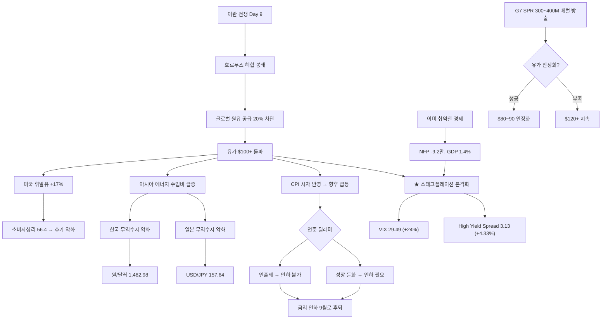
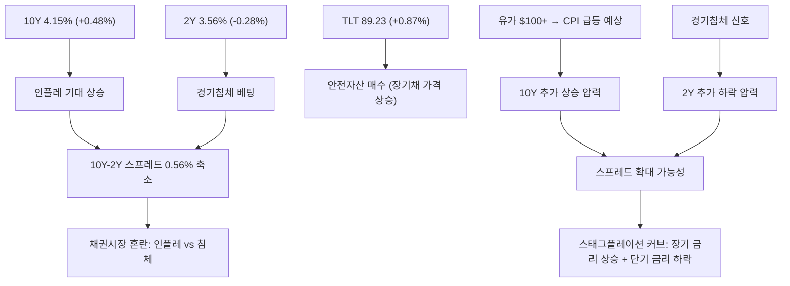
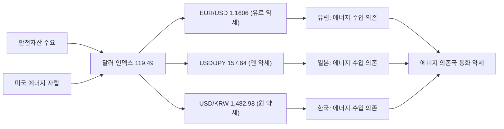
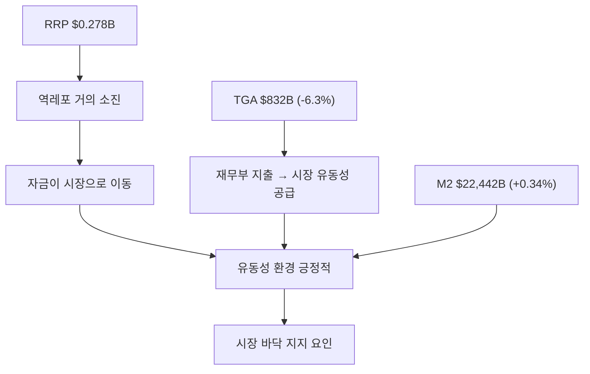
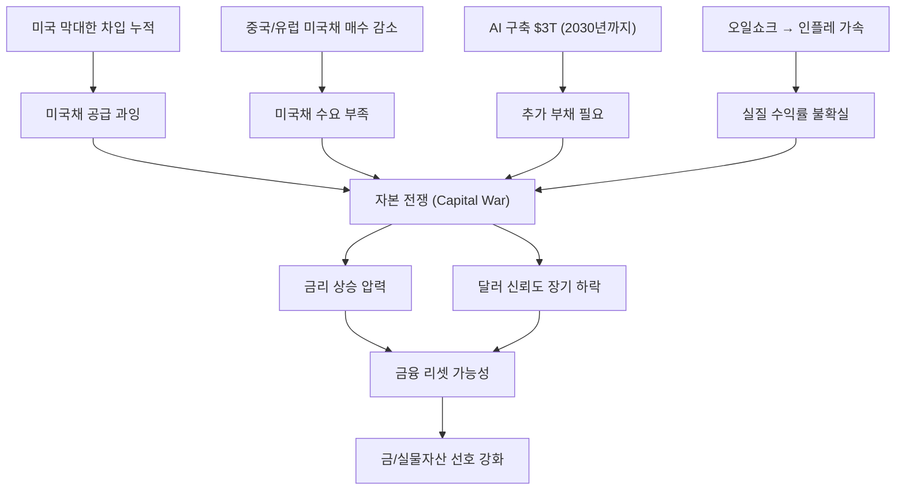
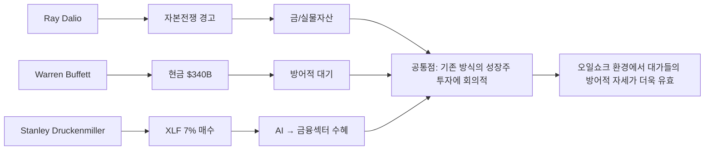
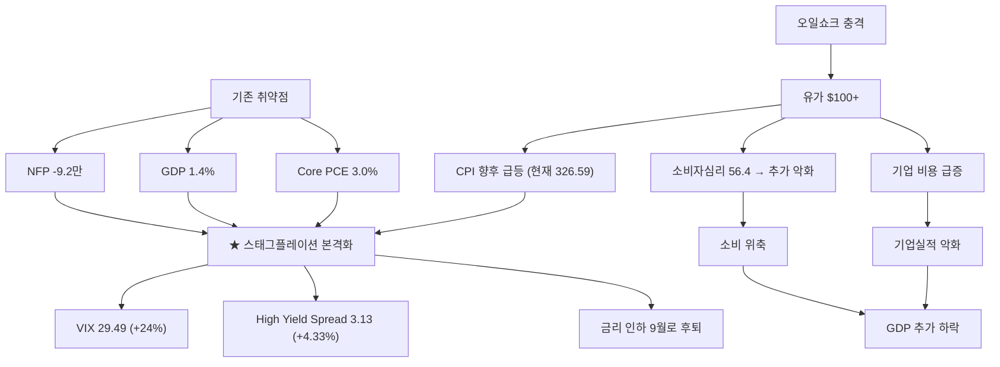
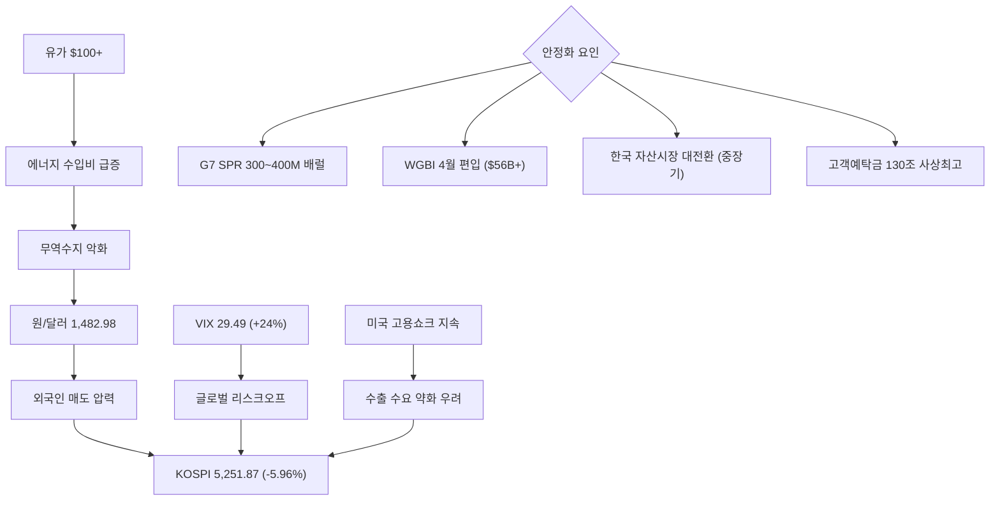

> **관련 글**: [2026년 투자 섹터 전망 (전체)](/knowledge/invest/2026/01/20/investment-sectors-outlook-2026.html)

2026년 3월 11일(화) 기준 업데이트입니다. **금이 $5,222(+2.57%)로 강세를 이어가며** Goldman Sachs가 연말 타겟을 **$5,400으로 상향**했습니다. 3개월 수익률 +24.73%, 중앙은행 매입 구조적 지속, JP모건 $6,300·Yardeni $6,000 전망이 뒷받침합니다. 지정학 불확실성 + 스태그플레이션 우려 + 달러 약세가 금 상승 동력입니다.

**비트코인 $70,007(+2.35%)**로 반등하며, 트럼프-코인베이스 CEO 비공개 회동과 암호화폐 법안 통과 촉구가 리스크 선호 회복을 견인하고 있습니다.

**달러 인덱스가 98.85로 약세 전환**했으며, 한국 EWY가 3개월 +40.14%로 **글로벌 최강** 퍼포먼스를 기록 중입니다. 실업률 4.4%(+0.1%p), NFP -92K로 고용시장은 여전히 약하며, **Fed 추가 인하 1회(6~9월)** 전망이 유지되고 있습니다. Powell 의장은 **5/15 은퇴** 예정입니다.

## 시장 현황 (2026년 3월 11일 기준)

### 글로벌 자금 흐름 (3개월 ETF 퍼포먼스)

| ETF | 지역 | 3M 수익률 | 1W 수익률 | 비고 |
|-----|------|-----------|----------|------|
| **EWY** | **한국** | **+40.14%** | **-3.03%** | **글로벌 최강** |
| **EWZ** | 브라질 | **+18.61%** | | |
| **EWT** | 대만 | **+12.36%** | | |
| **VGK** | 유럽 | | **-2.22%** (1W), **-5.36%** (1M) | 유럽 약세 전환 |
| **SPY** | 미국 | **-0.65%** | | 미국 3개월 마이너스 |

> **주목**: 한국 EWY가 3개월 +40.14%로 글로벌 최강 퍼포먼스. 달러 약세(DXY 98.85)와 함께 신흥국/아시아 자금 유입 가속. 미국 SPY 3개월 -0.65%로 부진하며, 유럽 VGK도 1주 -2.22%, 1개월 -5.36%로 약세 전환.

### 섹터 퍼포먼스 (NASDAQ 기준)

| 섹터 | 수익률 | PE | 비고 |
|------|--------|-----|------|
| **Consumer Defensive** | **+2.51%** | 42.4 | **방어주 선호 — 리스크오프** |
| **Technology** | **-0.47%** | 43.8 | 기술주 부진 |
| **Financial Services** | **-0.70%** | 25.1 | |

> **주목**: Consumer Defensive가 유일한 플러스(+2.51%)로 **방어주 선호 심리**가 뚜렷. Technology(-0.47%)와 Financial Services(-0.70%)는 부진. PE 기준으로는 Financial Services(25.1)가 상대적 저평가.

### 핵심 매크로 지표

| 항목 | 현황 | 변동/방향 |
|------|------|-----------|
| **★ 소비자심리** | **56.4** | **+6.6%** — 반등했으나 여전히 낮음 |
| **실업률** | **4.4%** | **+0.1%p** — 노동시장 약화 지속 |
| **NFP (비농업 고용)** | **-92K** | 감소 지속 |
| **CPI** | **326.6** | 1월 데이터 |
| **5Y Breakeven** | **2.53%** | **-1.17%** — 인플레 기대 하락 |
| **Fed Funds Rate** | **3.64%** | 동결 유지, 추가 인하 1회(6~9월) 전망 |
| **10Y 국채** | **4.12%** | |
| **2Y 국채** | **3.56%** | |
| **10Y-2Y 스프레드** | **0.58%** | 스티프닝 — 장기 금리 상대적 상승 |
| **달러 인덱스** | **98.85** | **달러 약세 전환** |
| **M2** | **$22,442B** | **+0.34%** |
| **RRP** | **$0.278B** | 거의 제로 (유동성 긍정) |
| **TGA** | **$832B** | **-6.3%** — 감소 (유동성 긍정) |
| **Powell 은퇴** | **5/15** | 신임 의장 불확실 |

### 자산가격

| 항목 | 현황 | 변동 |
|------|------|------|
| **금(Gold)** | **$5,222/oz** | **+2.57%** — Goldman $5,400 타겟 상향 |
| **비트코인** | **$70,007** | **+2.35%** — 트럼프-코인베이스 CEO 회동 |

---

## ★ 오일쇼크: 스태그플레이션 환경의 완전한 전환

이란 전쟁으로 인한 호르무즈 해협 봉쇄가 **글로벌 거시경제 환경을 근본적으로 변경**했습니다. 이것은 단순한 유가 상승이 아니라, 이미 취약했던 경제에 공급 충격이 겹치는 **1970년대형 오일쇼크**입니다.

### 오일쇼크 파급 경로


```mermaid
graph TD
    A["이란 전쟁 Day 9"] --> B["호르무즈 해협 봉쇄"]
    B --> C["글로벌 원유 공급 20% 차단"]
    C --> D["유가 $100+ 돌파"]
    D --> E["미국 휘발유 +17%"]
    D --> F["아시아 에너지 수입비 급증"]
    D --> G["CPI 시차 반영 → 향후 급등"]
    E --> H["소비자심리 56.4 → 추가 악화"]
    F --> I["한국 무역수지 악화"]
    F --> J["일본 무역수지 악화"]
    I --> K["원/달러 1,482.98"]
    J --> L["USD/JPY 157.64"]
    G --> M{"연준 딜레마"}
    M --> N["인플레 → 인하 불가"]
    M --> O["성장 둔화 → 인하 필요"]
    N --> P["금리 인하 9월로 후퇴"]
    O --> P
    Q["이미 취약한 경제"] --> R["NFP -9.2만, GDP 1.4%"]
    R --> S["★ 스태그플레이션 본격화"]
    D --> S
    S --> T["VIX 29.49 (+24%)"]
    S --> U["High Yield Spread 3.13 (+4.33%)"]
    V["G7 SPR 300~400M 배럴 방출"] --> W{"유가 안정화?"}
    W -->|"성공"| X["$80~90 안정화"]
    W -->|"부족"| Y["$120+ 지속"]
```

### 오일쇼크의 핵심 데이터

| 항목 | 수치 | 의미 |
|------|------|------|
| **유가 (WTI 실제)** | **$100+** | API $71.13은 lagging |
| **미국 휘발유** | **전쟁 후 +17%** | CPI에 1~2개월 시차 반영 |
| **이번 주 CPI** | 전쟁 전 데이터 | **오일쇼크 미반영**, 실제 인플레는 더 높음 |
| **G7 SPR 방출** | **300~400M 배럴** | 유가 안정화 핵심 변수 |
| **VIX** | **29.49 (+24.17%)** | 공포 구간 진입 |
| **소비자심리** | **56.4** | 2022년 이후 최저 수준 |

> **투자 시사점**: 오일쇼크는 **세 가지 경로**로 시장을 압박합니다. (1) CPI 상승 → 연준 인하 불가, (2) 소비 위축 → 성장 둔화, (3) 에너지 수입국 직격탄. **G7 SPR 300~400M 배럴 방출이 유가 $80~90으로 안정시킬 수 있는지가 최대 변수**. 실패 시 $120+로의 추가 상승 가능성.

---

## ★ 연준 딜레마: 금리 인하 9월로 후퇴

오일쇼크는 연준을 **최악의 딜레마**에 빠뜨렸습니다. 경기침체 방어를 위해 금리를 인하해야 하지만, 인플레이션이 가속되는 상황에서 인하할 수 없습니다.

### 연준 금리 환경

| 항목 | 수치 | 시사점 |
|------|------|--------|
| **Fed Funds Rate** | **3.64%** | 동결 유지 |
| **10Y 국채** | **4.12%** | |
| **2Y 국채** | **3.56%** | |
| **10Y-2Y 스프레드** | **0.58%** | 스티프닝 — 장기 금리 상대적 상승 |
| **5Y Breakeven** | **2.53% (-1.17%)** | 인플레 기대 하락 |
| **CPI** | **326.6** | 1월 데이터 |
| **Powell 은퇴** | **5/15** | 신임 의장 불확실 |

### 채권 시장 시그널


```mermaid
graph TD
    A["10Y 4.15% (+0.48%)"] --> B["인플레 기대 상승"]
    C["2Y 3.56% (-0.28%)"] --> D["경기침체 베팅"]
    B --> E["10Y-2Y 스프레드 0.56% 축소"]
    D --> E
    E --> F["채권시장 혼란: 인플레 vs 침체"]
    G["TLT 89.23 (+0.87%)"] --> H["안전자산 매수 (장기채 가격 상승)"]
    I["유가 $100+ → CPI 급등 예상"] --> J["10Y 추가 상승 압력"]
    K["경기침체 신호"] --> L["2Y 추가 하락 압력"]
    J --> M["스프레드 확대 가능성"]
    L --> M
    M --> N["스태그플레이션 커브: 장기 금리 상승 + 단기 금리 하락"]
```

### 금리 인하 전망 변화

| 시점 | 이전 전망 | 현재 전망 |
|------|----------|----------|
| **3월 FOMC** | 동결 | **동결 확실** |
| **6~9월** | 1~2회 인하 | **추가 인하 1회 전망 (6~9월)** |
| **Powell 은퇴** | 5월 | **5/15 은퇴 확정** |

> **투자 시사점**: 10Y 상승(+0.48%) + 2Y 하락(-0.28%)은 **채권시장이 스태그플레이션을 가격에 반영**하기 시작했음을 의미. TLT 89.23(+0.87%)은 안전자산 매수. **금리 인하가 9월로 후퇴**하면서 성장주 할인율 상승 압력. 단기채(SHY) 안정적 유지.

---

## ★ 달러 초강세 + 아시아 취약: 에너지 의존국 직격탄

### 달러 강세의 이중 동력


```mermaid
graph LR
    A["안전자산 수요"] --> C["달러 인덱스 119.49"]
    B["미국 에너지 자립"] --> C
    C --> D["EUR/USD 1.1606 (유로 약세)"]
    C --> E["USD/JPY 157.64 (엔 약세)"]
    C --> F["USD/KRW 1,482.98 (원 약세)"]
    D --> G["유럽: 에너지 수입 의존"]
    E --> H["일본: 에너지 수입 의존"]
    F --> I["한국: 에너지 수입 의존"]
    G --> J["에너지 의존국 통화 약세"]
    H --> J
    I --> J
```

### 주요 통화 동향

| 통화 | 수준 | 오일쇼크 영향 |
|------|------|-------------|
| **달러 인덱스** | **119.49** | **초강세** — 안전자산 + 에너지 자립 이중 수혜 |
| **EUR/USD** | **1.1606** | 유럽 에너지 의존 → 유로 약세 |
| **USD/JPY** | **157.64** | 일본 에너지 수입 의존 → 엔 약세 |
| **USD/KRW** | **1,482.98** | 1,500 부근 고착, 에너지+반도체 이중 압력 |

### 아시아 취약성

| 국가 | 에너지 수입 의존도 | 증시 영향 | 통화 영향 |
|------|------------------|----------|----------|
| **한국** | 높음 (원유 95%+ 수입) | **KOSPI 5,251.87 (-5.96%)** | **원/달러 1,482.98** |
| **일본** | 높음 | **엔 약세 지속** | **USD/JPY 157.64** |
| **중국** | 중간 | Shanghai 4,096.60 (-0.67%) | 상대적 안정 |
| **홍콩** | 중간 | Hang Seng 25,408.46 (-1.35%) | |

> **투자 시사점**: 달러 초강세(119.49)는 **미국 에너지 자립이라는 구조적 우위** 반영. 에너지 의존 아시아 경제(한국·일본)가 **유가 상승 + 통화 약세 이중 압력** 하에 있음. 원/달러 1,482.98은 WGBI 4월 편입이 지지하나 유가 $100+ 지속 시 **1,500 재돌파 가능**. 달러 자산 비중 유지 또는 확대.

---

## ★ 유동성 환경: RRP 제로 + TGA 감소 = 긍정적 신호

오일쇼크 속에서도 유동성 환경에는 **긍정적 신호**가 있습니다.

| 항목 | 수치 | 변동 | 의미 |
|------|------|------|------|
| **M2** | **$22,442B** | **+0.34%** | 통화량 완만 증가 |
| **★ RRP** | **$0.278B** | | **거의 제로** — 자금이 시장으로 이동 |
| **★ TGA** | **$832B** | **-6.3%** | 감소 → 시장 유동성 공급 |


```mermaid
graph TD
    A["RRP $0.278B"] --> B["역레포 거의 소진"]
    B --> C["자금이 시장으로 이동"]
    D["TGA $832B (-6.3%)"] --> E["재무부 지출 → 시장 유동성 공급"]
    C --> F["유동성 환경 긍정적"]
    E --> F
    G["M2 $22,442B (+0.34%)"] --> F
    F --> H["시장 바닥 지지 요인"]
```

> **투자 시사점**: RRP가 거의 제로($0.278B)이고 TGA가 감소($832B, -6.3%)하는 것은 **시장 유동성이 풍부해지고 있다**는 신호. M2 $22,442B(+0.34%)도 완만 증가. **유동성 환경은 시장 바닥을 지지하는 긍정적 요인**.

---

## ★ 이번 주 핵심 이벤트

### CPI 발표 (이번 주)

| 항목 | 내용 |
|------|------|
| **CPI (현재)** | **326.59 (+0.17%)** |
| **Core CPI (현재)** | **332.79 (+0.29%)** |
| **중요 포인트** | **이번 주 CPI는 전쟁 전 데이터 → 오일쇼크 미반영** |
| **시장 반응** | 숫자보다 **연준의 해석 + 향후 가이던스**가 핵심 |
| **예상 영향** | CPI 안정적 → "일시적 안도" 가능, 그러나 **다음 달 CPI에서 오일쇼크 반영** |

### NVIDIA GTC (3/16)

| 항목 | 내용 |
|------|------|
| **일정** | 3월 16일 |
| **기대** | Vera Rubin, HBM4, Feynman 발표 |
| **시장 영향** | AI 섹터 단기 모멘텀 전환 가능 |
| **리스크** | 오일쇼크로 인한 전반적 리스크오프 환경에서 제한적 효과 가능 |

### S&P 500 리밸런싱 (3/23)

| 항목 | 내용 |
|------|------|
| **일정** | 3월 23일 |
| **영향** | 대형주 수급 변동 |

### 트럼프-시진핑 회담 (3월 말)

| 항목 | 내용 |
|------|------|
| **일정** | 3월 말 |
| **핵심 의제** | 미중 관세 협상, 이란 전쟁 입장 조율 |
| **시장 영향** | 관세 완화 시 수출주 반등, 이란 압박 공조 시 전쟁 조기 종결 기대 |

---

## ★ 투자 대가 포지션 (이전 업데이트 유지)

### Ray Dalio — "자본 전쟁(Capital War)" 경고

| 항목 | 내용 |
|------|------|
| **핵심 주장** | **미국 "자본 전쟁" 진입** — 막대한 차입 vs 미국채 수요 감소 |
| **구조적 문제** | 중국·유럽이 미국채 매수를 줄이고 있음 |
| **AI 투자** | 2030년까지 **$3T** 필요 — 부채에 의존하나 그 부채가 부족해질 수 있음 |
| **오일쇼크 맥락** | 전쟁 + 인플레 → 미국채 매력 추가 하락 가능 |
| **결론** | **금융 리셋(Financial Reset) 경고** |


```mermaid
graph TD
    A["미국 막대한 차입 누적"] --> B["미국채 공급 과잉"]
    C["중국/유럽 미국채 매수 감소"] --> D["미국채 수요 부족"]
    B --> E["자본 전쟁 (Capital War)"]
    D --> E
    F["AI 구축 $3T (2030년까지)"] --> G["추가 부채 필요"]
    G --> E
    H["오일쇼크 → 인플레 가속"] --> I["실질 수익률 불확실"]
    I --> E
    E --> J["금리 상승 압력"]
    E --> K["달러 신뢰도 장기 하락"]
    J --> L["금융 리셋 가능성"]
    K --> L
    L --> M["금/실물자산 선호 강화"]
```

### Warren Buffett — 현금 $340B+ 방어적 포지션

| 항목 | 내용 |
|------|------|
| **현금 보유** | **$340B 이상** — 역대 최고 수준 |
| **해석** | 매력적인 투자 기회 부재, **오일쇼크 환경에서 더욱 유효** |
| **Greg Abel (신임 CEO)** | 첫 주주서한: **자사주 매입 재개** |
| **핵심 4종목** | Apple, Amex, Coca-Cola, Moody's = **포트폴리오 56%** |
| **배당수익률 환산** | **14.6%** (원가 기준) |

### Stanley Druckenmiller — 금융섹터 ETF(XLF) 대규모 매수

| 항목 | 내용 |
|------|------|
| **매수 종목** | **State Street Financial Sector SPDR ETF (XLF)** |
| **비중** | **포트폴리오의 7%** |
| **투자 근거** | 대형은행·보험사가 **AI 자동화 수혜를 가장 먼저** 받을 것 |
| **시간 프레임** | **AI 기반 수익 개선 2~3년 내 기대** |


```mermaid
graph LR
    A["Ray Dalio"] --> B["자본전쟁 경고"]
    B --> C["금/실물자산"]
    D["Warren Buffett"] --> E["현금 $340B"]
    E --> F["방어적 대기"]
    G["Stanley Druckenmiller"] --> H["XLF 7% 매수"]
    H --> I["AI → 금융섹터 수혜"]
    C --> J["공통점: 기존 방식의 성장주 투자에 회의적"]
    F --> J
    I --> J
    J --> K["오일쇼크 환경에서 대가들의 방어적 자세가 더욱 유효"]
```

---

## ★ 이란 전쟁 Day 9: 오일쇼크 본격화 + G7 SPR 방출

### 사건 전개

| 시점 | 사건 |
|------|------|
| **3/1** | 미국 "Operation Epic Fury" + 이스라엘 "Operation Roaring Lion" — 이란 합동 공습 |
| **3/1** | **하메네이 사망 확인** (IRGC 참모총장, 아마디네자드 전 대통령 동시 사망) |
| **3/1~2** | **호르무즈 해협 봉쇄** — 글로벌 원유 공급 20% 차단 |
| **3/3** | KOSPI -7% 폭락 |
| **3/4** | **KOSPI -12.06% "블랙 튜즈데이"** — 서킷브레이커, 사상 최대 폭락 |
| **3/5** | **KOSPI +9.63% 반등** — 이란 CIA 협상 신호, 2008년 이후 최대 반등 |
| **3/5** | P&I 보험 발효, 헤즈볼라 참전 |
| **3/6~8** | 테헤란 중폭격 지속, 트럼프 "무조건 항복" 요구 |
| **3/9~10** | **유가 $100+ 돌파**, G7 SPR 300~400M 배럴 방출 결정 |

### G7 SPR 방출 분석

| 항목 | 내용 |
|------|------|
| **규모** | **300~400M 배럴** |
| **의미** | 이전 SPR 방출(2022년 180M 배럴) 대비 **2배 이상** |
| **효과** | 일시적 유가 안정화 ($80~90 목표) |
| **한계** | 봉쇄가 지속되면 SPR도 소진 → 장기적 효과 제한적 |
| **시장 반응** | SPR 발표 직후 유가 일시 하락 예상, 이후 봉쇄 지속 여부에 따라 결정 |

### 시나리오별 영향 (업데이트)

| 시나리오 | 확률 | 유가 | 금 | KOSPI |
|---------|------|------|-----|-------|
| **이란 항복 → 조기 종결** | **중-저** | **$70-80** | **$4,800-5,000** | **6,200-6,600** |
| **SPR 방출 성공 + 군사 호위** | **중** | **$80-90** | **$5,000-5,200** | **5,500-5,800** |
| **장기전(4-8주) + 봉쇄 지속** | **중-높음** | **$100-130** | **$5,300-5,700** | **5,000-5,400** |
| **걸프 수출국 완전 중단** | **저** | **$150+** | **$6,000+** | **4,800 이하** |

> **투자 시사점**: G7 SPR 300~400M 배럴 방출이 **유가 $80~90 안정화에 성공할지가 향후 2주 최대 변수**. SPR 방출만으로는 호르무즈 봉쇄의 근본 해결이 불가능하므로, **이란 전쟁 종결 또는 군사 호위 성공**이 동반되어야 함. 방산·에너지 포지션 유지.

---

## ★ 스태그플레이션 트라이앵글: 오일쇼크로 심화

### 스태그플레이션 핵심 데이터

| 항목 | 수치 | 방향 |
|------|------|------|
| **NFP (비농업 고용)** | **-92K** | 고용 악화 지속 |
| **실업률** | **4.4% (+0.1%p)** | 상승 추세 |
| **CPI** | **326.6** | 1월 데이터 |
| **소비자심리** | **56.4 (+6.6%)** | 반등했으나 여전히 낮음 |
| **Q4 GDP** | **1.4%** | 예상 2.3% 대폭 하회 |
| **유가 (실제)** | **$100+** | 전쟁 전 대비 +40~50% |
| **VIX** | **29.49 (+24.17%)** | 공포 구간 |

### 스태그플레이션 심화 경로


```mermaid
graph TD
    A["기존 취약점"] --> B["NFP -9.2만"]
    A --> C["GDP 1.4%"]
    A --> D["Core PCE 3.0%"]
    E["오일쇼크 충격"] --> F["유가 $100+"]
    F --> G["CPI 향후 급등 (현재 326.59)"]
    F --> H["소비자심리 56.4 → 추가 악화"]
    F --> I["기업 비용 급증"]
    B --> J["★ 스태그플레이션 본격화"]
    C --> J
    D --> J
    G --> J
    H --> K["소비 위축"]
    I --> L["기업실적 악화"]
    K --> M["GDP 추가 하락"]
    L --> M
    J --> N["VIX 29.49 (+24%)"]
    J --> O["High Yield Spread 3.13 (+4.33%)"]
    J --> P["금리 인하 9월로 후퇴"]
```

> **투자 시사점**: 오일쇼크 이전에도 스태그플레이션이었는데, 유가 $100+가 **인플레이션 축을 극적으로 악화**시킴. 이번 주 CPI는 전쟁 전 데이터이므로 비교적 안정적일 수 있으나, **다음 달 CPI부터 오일쇼크가 본격 반영**. 소비자심리 56.4는 이미 매우 낮은 수준이며, 휘발유 +17%가 실생활에 직접 영향 → **소비 위축 가속화** 예상.

---

## 미국 증시: S&P 6,795.99 (+0.83%) 반등, Nasdaq -1.59%

### 시장 데이터

| 지수 | 종가 | 변동 | 특이사항 |
|------|------|------|---------|
| **S&P 500** | **6,795.99** | **+0.83%** | 저가 매수 반등 |
| **Nasdaq** | **22,387.68** | **-1.59%** | 기술주 여전히 약세 |

### 섹터별 동향 (오일쇼크 환경)

| 섹터 | 방향 | 배경 |
|------|------|------|
| **에너지** | **강세** | 유가 $100+, 오일쇼크 최대 수혜 |
| **방산** | **강세** | 이란 전쟁 Day 9, 장기전 조짐 |
| **금융** | **주목** | Druckenmiller XLF + 보험수요 증가 |
| **헬스케어** | **방어적** | 경기 방어주 성격 |
| **기술** | **약세** | 금리 인하 후퇴 → 성장주 할인율 상승 |
| **소비재** | **약세** | 에너지 비용 급등 → 가처분소득 감소 |
| **유틸리티** | **혼조** | 에너지 비용 전가 가능 vs 비용 증가 |

> **투자 시사점**: S&P 500 +0.83% 반등은 **저가 매수 + G7 SPR 기대감** 반영. 그러나 Nasdaq -1.59%는 **기술주가 스태그플레이션 환경에서 계속 약세**임을 시사. **에너지·방산만 구조적 강세**, 나머지 섹터는 오일쇼크 해소 전까지 압박.

---

## KOSPI: 5,251.87 (-5.96%) — 에너지 수입 의존 직격탄

### KOSPI 동향

| 항목 | 수치 | 의미 |
|------|------|------|
| **KOSPI** | **5,251.87** | **-5.96%** — 추가 하락 |
| **블랙 튜즈데이 (3/4)** | 5,093 (-12.06%) | 서킷브레이커, 사상 최대 폭락 |
| **반등 (3/5)** | 5,583 (+9.63%) | 2008년 이후 최대 반등 |
| **현재** | **5,251.87** | 반등분 상당 부분 소실 |

### KOSPI 하락 요인 분석


```mermaid
graph TD
    A["유가 $100+"] --> B["에너지 수입비 급증"]
    B --> C["무역수지 악화"]
    C --> D["원/달러 1,482.98"]
    D --> E["외국인 매도 압력"]
    E --> F["KOSPI 5,251.87 (-5.96%)"]
    G["VIX 29.49 (+24%)"] --> H["글로벌 리스크오프"]
    H --> F
    I["미국 고용쇼크 지속"] --> J["수출 수요 약화 우려"]
    J --> F
    K{"안정화 요인"}
    K --> L["G7 SPR 300~400M 배럴"]
    K --> M["WGBI 4월 편입 ($56B+)"]
    K --> N["한국 자산시장 대전환 (중장기)"]
    K --> O["고객예탁금 130조 사상최고"]
```

### KOSPI 전망 밴드 (수정)

| 전망 | KOSPI 밴드 | 조건 |
|------|-----------|------|
| **하단** | **4,800~5,000** | 유가 $120+ + 고용 추가 악화 + 전쟁 장기화 |
| **중앙** | **5,200~5,500** | 현재 수준, SPR 방출로 유가 안정화 |
| **상단** | **6,200~6,600** | 이란 항복 + 유가 $70~80 복귀 + WGBI 유입 |

> **투자 시사점**: KOSPI 5,251.87은 블랙 튜즈데이(5,093) 반등(5,583) 이후 다시 하락한 수준. **에너지 수입 의존 경제로서 유가 $100+의 직격탄**. 한국 자산시장 대전환(상법 개정, 국민성장펀드 150조, MSCI)은 **중장기 상승 동력이나, 오일쇼크 해소 전까지 단기 하방 압력 지속**. 분할 매수 전략 유지, 현금 비중 높이기.

---

## 한국 자산시장 대전환 (중장기 테마 유지)

오일쇼크로 단기 압박을 받고 있으나, **구조적 대전환 동력은 유효**합니다.

### 정책 대전환

| 항목 | 내용 |
|------|------|
| **이재명 대통령** | 분당 아파트 매각, **ETF 매수 선언** |
| **상법 개정** | 배당소득 분리과세, 자사주 의무소각, 이사 책임 강화 |
| **MSCI 선진지수 추진** | **외환시장 개방** → 선진지수 편입 요건 충족 |
| **국민성장펀드** | **150조 원** (민간 75조 + 정부 75조) |
| **WGBI 편입** | **4월** — $56B+ 유입 예상 |

### 자금 이동 현황

| 항목 | 수치 | 의미 |
|------|------|------|
| **고객예탁금** | **130조 원** | **사상 최고** → 증시 유입 대기 |
| **국내 예금** | **2,076조 원** | 12월 대비 -39조 → 예금 이탈 시작 |
| **퇴직연금** | **918조 원** | 72% 원리금보장 → 주식 이동 여지 |

> **투자 시사점**: 오일쇼크가 단기적으로 대전환 모멘텀을 압박하고 있으나, **고객예탁금 130조 사상최고 + 예금 이탈(-39조) + 상법 개정 + 국민성장펀드 150조 + WGBI 4월 편입**이라는 구조적 동력은 유효. **오일쇼크 해소 시 강력한 반등의 기반**.

---

## 원/달러: 1,482.98 — 1,500 부근 고착

| 항목 | 내용 |
|------|------|
| **현재** | **1,482.98** |
| **역대 최고(3/8)** | **1,506원** (17년 만) |
| **달러 인덱스** | **119.49** (초강세) |
| **구조적 원인** | 2014년 이후 미국 GDP > 한국 GDP |
| **오일쇼크 영향** | 에너지 수입비 급증 → 무역수지 악화 → 원화 추가 약세 압력 |
| **안정화 요인** | WGBI 4월 편입($56B+), 정부 안정화 조치 |

> **투자 시사점**: 원/달러 1,482.98은 1,500 부근에서 고착. 유가 $100+ 지속 시 **1,500 재돌파 가능**. WGBI 4월 편입이 중기적 원화 강세 요인이나, **오일쇼크 + 달러 초강세(119.49)가 단기 원화 약세 압력 유지**. 달러 자산 비중 유지.

---

## 금(Gold): $5,222 (+2.57%) — Goldman $5,400 상향, 구조적 강세 지속

| 항목 | 내용 |
|------|------|
| **현재 가격** | **$5,222/oz (+2.57%)** |
| **3개월 수익률** | **+24.73%** |
| **Goldman Sachs 목표** | **$5,400** (상향) |
| **JP모건 목표** | **$6,300** |
| **Yardeni 목표** | **$6,000** |
| **중앙은행 매입** | 구조적 지속 |

### 금 투자 논리 (3/11 업데이트)

| 요인 | 내용 |
|------|------|
| **Goldman $5,400 상향** | 중앙은행 매입 + 지정학 리스크 반영 |
| **3개월 +24.73%** | 강력한 모멘텀 지속 |
| **중앙은행 매입** | 구조적 수요 — 탈달러화 + 지정학 헤지 |
| **지정학 불확실성** | 글로벌 리스크 프리미엄 유지 |
| **스태그플레이션 우려** | 금의 역사적 최적 환경 |
| **달러 약세** | DXY 98.85 → 금 가격 상승 동력 |
| **JP모건 $6,300** | 가장 공격적 전망 |
| **Yardeni $6,000** | 추가 상방 여지 확인 |

> **투자 시사점**: Goldman Sachs가 $5,400으로 타겟을 상향하면서 **월가 컨센서스가 상향 조정** 중. 3개월 +24.73% 수익률은 금의 구조적 강세를 입증. **중앙은행 매입 지속 + 지정학 불확실성 + 스태그플레이션 우려 + 달러 약세(DXY 98.85)**가 복합적으로 작용. JP모건 $6,300, Yardeni $6,000까지 추가 상방 여지. 분할 매수 지속.

---

## 비트코인: $70,007 (+2.35%) — 트럼프-코인베이스 회동, 리스크 선호 회복

| 항목 | 내용 |
|------|------|
| **현재 가격** | **$70,007 (+2.35%)** |
| **핵심 이벤트** | **트럼프-코인베이스 CEO 비공개 회동** |
| **정책 동향** | **암호화폐 법안 통과 촉구** |
| **시장 심리** | **리스크 선호 회복** |
| **크립토 규제** | GENIUS Act 서명, 제도화 진전 |

> **투자 시사점**: BTC $70,007(+2.35%)은 **트럼프-코인베이스 CEO 비공개 회동**과 **암호화폐 법안 통과 촉구**로 제도화 기대감 상승. 리스크 선호 회복과 함께 반등세 유지. GENIUS Act 등 크립토 제도화 흐름이 중장기 지지 요인. 다만 거시 환경(실업률 상승, NFP 감소)의 불확실성 감안하여 적정 비중 유지.

---

## 관세: IEEPA 위헌 + Section 122 15% 유지

| 구분 | 현황 |
|------|------|
| **IEEPA 관세** | 대법원 위헌 판결 (6:3), $1,660억 환불 진행 |
| **Section 122** | **15%** (2/24 발효, ~7/23 만료) |
| **미-중 관세** | **평균 34%**, 10% 세율 2026년 11월까지 연장 |
| **트럼프-시진핑** | **3월 말 회담** — 관세 완화 가능성 |

> **투자 시사점**: 오일쇼크 + 관세 이중 부담이 수출 기업 수익성을 압박. **트럼프-시진핑 3월 말 회담**에서 관세 완화 시 수출주 반등 가능.

---

## 주요 구조적 테마

### 1. 강세장 섹터 순환: 오일쇼크로 완전 리셋

| 순서 | 유형 | 상태 |
|------|------|------|
| 1 | **에너지/방산** (오일쇼크 수혜) | **★ 유일한 강세 섹터** |
| 2 | 금/원자재 (스태그플레이션 헤지) | **강세 지속** |
| 3 | 금융 (AI 자동화, Druckenmiller) | **조정 중, 중기 관심** |
| 4 | 선도 섹터 (반도체, AI) | **급락 → 부분 반등, GTC 3/16 모멘텀** |
| 5 | 증권사 (자산시장 대전환) | **고객예탁금 130조, 중기 관심** |
| 6 | 경기순환주 (건설, 조선) | **오일쇼크 피해, 대기** |
| 7 | 소비재/국민주 | **최하위 — 소비 위축 직격** |

### 2. 1970년대 오일쇼크 vs 2026년

| 항목 | 1973~74년 | 2026년 |
|------|-----------|--------|
| **원인** | OPEC 금수조치 | 이란 전쟁 → 호르무즈 봉쇄 |
| **유가 상승** | +300% | +40~50% (진행 중) |
| **인플레이션** | CPI 12.3% | CPI 가속 예상 |
| **실업률** | 9.0% | 4.4% (상승 추세) |
| **연준 대응** | 금리 인상 → 경기침체 심화 | **딜레마 — 인하도 인상도 불가** |
| **금 성과** | **+900%** (1970~80) | $5,144, 추가 상승 여지 |
| **대응책** | 없음 | **G7 SPR 300~400M 배럴 + 군사 호위** |

### 3. 다카이치 트레이드 + 한국 밸류업 (중장기 유지)

오일쇼크로 단기 압박이지만, 다카이치 총선 압승(닛케이 58,000+ 사상최고)과 한국 자산시장 대전환(상법 개정, 국민성장펀드, MSCI)의 **구조적 동력은 유효**.

---

## 투자 전략

### 현 국면 진단: "오일쇼크 → 스태그플레이션 심화 → 연준 딜레마 → 아시아 취약"

**핵심 변화(3/11):**
- **금 $5,222 (+2.57%)** — Goldman $5,400 타겟 상향, JP모건 $6,300, Yardeni $6,000
- **비트코인 $70,007 (+2.35%)** — 트럼프-코인베이스 CEO 비공개 회동, 암호화폐 법안 촉구
- **달러 약세 (DXY 98.85)** — 신흥국/아시아 자금 유입 가속
- **한국 EWY 3M +40.14%** — 글로벌 최강 퍼포먼스
- **실업률 4.4% (+0.1%p), NFP -92K** — 고용시장 약화 지속
- **Fed 추가 인하 1회 (6~9월)** — Powell 5/15 은퇴
- **Consumer Defensive +2.51%** — 방어주 선호, Technology -0.47% 부진
- **유동성 긍정** — RRP $0.278B(거의 제로), TGA $832B(감소)

### 단기 전략 (3월): "오일쇼크 방어 + G7 SPR 모니터링 + CPI 주간"

| 우선순위 | 전략 | 근거 |
|---------|------|------|
| 1 | **현금 비중 최대화** | VIX 29.49, 오일쇼크 불확실성, Buffett $340B 방어적 |
| 2 | **에너지 포지션 유지** | 유가 $100+, 호르무즈 봉쇄 지속, SPR 효과 불확실 |
| 3 | **금 조정 매수** | $5,144 조정, 스태그플레이션 최적 자산, JP모건 $6,300 목표 |
| 4 | **방산 포지션 유지** | 이란 Day 9, 장기전 조짐, 트럼프 "무조건 항복" |
| 5 | **이번 주 CPI 관찰** | 전쟁 전 데이터 → 안도 가능, 그러나 연준 가이던스가 핵심 |
| 6 | **GTC 3/16 대비** | NVIDIA GTC → AI 섹터 모멘텀, 단 리스크오프 환경 감안 |
| 7 | **3월 FOMC 대기** | 동결 확실, 연준의 오일쇼크 인식 + 금리 경로 시그널 핵심 |

### 중기 전략 (4~6월)

| 우선순위 | 전략 | 근거 |
|---------|------|------|
| 1 | **이란 전쟁 종결 시나리오 대비** | 이란 항복 시 유가 $70~80, KOSPI 6,200~6,600 급반등 |
| 2 | **G7 SPR 효과 평가** | 300~400M 배럴 방출 후 유가 $80~90 안정화 여부 |
| 3 | **WGBI 편입 수혜** | 4월 편입 (비중 2.08%, $56B+) — 환율 안정 + 외국인 매수 |
| 4 | **한국 자산시장 대전환** | 오일쇼크 해소 시 상법 개정 + 국민성장펀드 + MSCI 효과 재부각 |
| 5 | **트럼프-시진핑 회담** | 3월 말 — 관세 완화 + 이란 압박 공조 |
| 6 | **S&P 리밸런싱** | 3/23 — 대형주 수급 변동 |
| 7 | **Powell 퇴임 대비** | 5월 — 신임 의장 정책 방향 |

### 포트폴리오 배분 제안 (오일쇼크 스태그플레이션 방어)

```
현금/단기채: 30% (↑↑ 오일쇼크 불확실성 + VIX 29.49)
├── 현금: 18%
└── 단기국채 ETF (SHY): 12%

귀금속·원자재·에너지: 30% (↑ 스태그플레이션 최적 자산)
├── 금 ETF/실물: 15% (↑ $5,144 조정 매수, JP모건 $6,300)
├── 은 ETF/실물: 3%
└── 에너지 (유가 ETF/에너지주): 12% (유가 $100+)

방산: 10% (유지, 전쟁 Day 9 장기화)
├── 한국 방산주 (한화에어로, LIG넥스원 등): 7%
└── 글로벌 방산 ETF: 3%

반도체·AI: 8% (↓ 오일쇼크 환경, GTC 3/16 모멘텀 한정)
├── 삼성전자/SK하이닉스: 5% (과매도, GTC 카탈리스트)
└── HBM 후공정 장비·소재: 3%

금융섹터: 5% (↓ 오일쇼크 환경 감안, 중기 관심)
├── 한국 5대 금융지주: 3% (상법 개정 수혜 + AI 자동화)
├── 증권사: 1% (고객예탁금 130조)
└── 글로벌 금융 ETF (XLF 등): 1%

밸류업·배당: 7% (↓ 단기 수급 불안)
├── 고배당 ETF (커버드콜 포함): 4%
├── 자사주 소각 기업: 1.5%
└── 배당성장주: 1.5%

섹터 순환·수출주: 4% (↓↓ 오일쇼크 + 관세 이중 부담)
├── 관세 과매도 수출주: 1%
├── 국민주 (네이버, 카카오): 1%
├── 경기순환주: 1%
└── 코스닥 저평가주: 1%

금리 인하 수혜: 4% (↓ 인하 9월 후퇴)
├── 장기채 ETF (TLT): 1% (안전자산 매수 수혜, +0.87%)
└── 리츠(REITs): 3%

크립토: 2% (유지, 제도화 모니터링)
├── BTC: 1.5% ($68,461)
└── ETH: 0.5%
```

## 월별 체크포인트

| 월 | 이벤트 | 투자 시사점 |
|----|--------|------------|
| **3/1** | 이란 전쟁 본격화, 하메네이 사망 | 유가 급등, 방산주 폭등 |
| **3/4** | KOSPI 블랙 튜즈데이 -12.06% | 사상 최대 폭락, 서킷브레이커 |
| **3/5** | KOSPI +9.63% 반등 | 2008년 이후 최대 반등 |
| **3/6** | NFP -9.2만 고용쇼크 | 스태그플레이션 본격화 |
| **3/8** | 원/달러 1,506 돌파, 대가 포지션 | 구조적 환율 압력 |
| **3/9~10** | **유가 $100+ 오일쇼크, VIX 29.49, G7 SPR 방출** | **스태그플레이션 심화, 아시아 직격탄** |
| **이번 주** | **★ CPI 발표 (전쟁 전 데이터)** | 안도 가능, 향후 급등 예고 |
| **~3/12** | 철강/알루미늄 25% 관세 발효 | Section 232 |
| **3/16** | **★ NVIDIA GTC** | Vera Rubin, HBM4, AI 모멘텀 |
| **3/17~18** | **FOMC** | 동결, 오일쇼크 인식 + 금리 경로 |
| **3/23** | **S&P 500 리밸런싱** | 대형주 수급 변동 |
| **3월 말** | **★ 트럼프-시진핑 회담** | 관세 완화 + 이란 압박 공조 |
| **~4월 초** | 군사 호위 시행 (4주 후) | 호위 성공 시 유가 안정화 |
| **4월** | **WGBI 인덱스 편입 시작** | $56B+ 유입 + 환율 안정 |
| **5월** | **Powell 퇴임, 신임 의장 취임** | 연준 리더십 전환 |
| **~7/23** | Section 122 150일 만료 | 관세 재편 분기점 |
| **~11월** | 2026 중간선거 | 크립토 시장구조법안 데드라인 |

## 리스크 요인 정리

| 리스크 | 심각도 | 확률 | 대응 |
|--------|--------|------|------|
| **★ 오일쇼크 장기화** | **최고** | **높음** | 유가 $100+ 지속 → 금/에너지/현금 최대화 |
| **★ 스태그플레이션 심화** | **최고** | **매우 높음** | 고용(-9.2만) + 유가($100+) + CPI 급등 예상 → 방어적 포지션 |
| **★ CPI 급등 (다음 달)** | **최고** | **높음** | 휘발유 +17% 반영 → 연준 인하 완전 후퇴 가능 |
| **★ 아시아 에너지 위기** | **최고** | **높음** | 한국·일본 에너지 수입 의존 → KOSPI/엔 추가 약세 |
| **★ G7 SPR 효과 부족** | **최고** | **중** | 300~400M 배럴로 부족 시 유가 $120+ |
| **이란 전쟁 장기화(4-8주)** | **최고** | **중-높음** | 트럼프 "무조건 항복", 헤즈볼라 참전 → 방산·에너지 유지 |
| **연준 정책 교착** | **높음** | **높음** | 인하도 인상도 불가 → 시장 방향성 부재 |
| **원/달러 1,500 재돌파** | **높음** | **중-높음** | 유가 $100+ 지속 + 달러 초강세 → 원화 추가 약세 |
| **소비자심리 추가 붕괴** | **높음** | **높음** | 56.4 이미 매우 낮음 + 휘발유 +17% → 소비 위축 가속 |
| **Dalio 자본전쟁** | **높음** | **중** | 미국채 수요 감소 + AI $3T → 금/실물자산 |
| **연준 리더십 불확실성** | **높음** | **높음** | Powell 5월 퇴임 + 신임 의장 불확실 |

## 정리

| 항목 | 내용 |
|------|------|
| **★ 오일쇼크** | **유가 $100+, 호르무즈 봉쇄 Day 9, G7 SPR 300~400M 배럴 방출** |
| **★ VIX** | **29.49 (+24.17%) — 공포 구간 진입** |
| **★ 스태그플레이션 우려** | **실업률 4.4%(+0.1%p), NFP -92K, 소비자심리 56.4(+6.6%), 5Y Breakeven 2.53%(-1.17%)** |
| **★ 연준** | **Fed Funds 3.64%, 10Y 4.12%, 2Y 3.56%, 추가 인하 1회(6~9월), Powell 5/15 은퇴** |
| **★ 달러 약세** | **DXY 98.85 — 달러 약세 전환, 신흥국/아시아 자금 유입** |
| **★ 한국 최강** | **EWY 3M +40.14%(글로벌 최강), 1W -3.03%** |
| **유동성** | **RRP $0.278B(거의 제로), TGA $832B(-6.3%) — 긍정적 (바닥 지지)** |
| **금** | **$5,222 (+2.57%), Goldman $5,400 상향, JP모건 $6,300, Yardeni $6,000** |
| **비트코인** | **$70,007 (+2.35%), 트럼프-코인베이스 CEO 회동, 리스크 선호 회복** |
| **미국 증시** | **S&P 6,795.99 (+0.83%) 반등, Nasdaq -1.59% 기술주 약세** |
| **이번 주** | **★ CPI (전쟁 전 데이터), GTC 3/16, FOMC 3/17~18** |
| **중기 이벤트** | **S&P 리밸런싱 3/23, 트럼프-시진핑 3월 말, WGBI 4월 편입** |
| **한국 대전환** | **상법 개정, 국민성장펀드 150조, MSCI, 고객예탁금 130조 — 중장기 유효** |
| **Dalio** | **"자본 전쟁" — 미국채 수요 감소 + AI $3T → 금 선호** |
| **Buffett** | **현금 $340B+ 방어적 — 오일쇼크에서 더욱 유효** |
| **Druckenmiller** | **XLF 7% — 금융섹터 AI 수혜, 중기 관심** |

**핵심 투자 원칙:**
1. **오일쇼크 = 게임 체인저** -- 유가 $100+가 모든 거시경제 변수를 재설정. G7 SPR 300~400M 배럴 방출이 핵심 변수
2. **스태그플레이션 심화 = 금/에너지/현금 최적** -- 1970년대 오일쇼크 때 금 900% 상승 전례
3. **연준 딜레마 = 인하 9월 후퇴** -- CPI 급등 예상(휘발유 +17% 시차 반영)으로 인하 불가
4. **달러 초강세 = 미국 에너지 자립 프리미엄** -- DXY 119.49, 에너지 의존국 통화 약세
5. **아시아 취약 = 에너지 수입국 직격탄** -- KOSPI 5,251(-5.96%), 원/달러 1,482.98
6. **유동성은 긍정적** -- RRP 제로 + TGA 감소가 하락의 바닥 지지
7. **이번 주 CPI = 안도 가능, 그러나 다음 달이 진짜** -- 전쟁 전 데이터 → 오일쇼크 미반영
8. **한국 대전환 = 중장기 유효** -- 오일쇼크 해소 시 강력한 반등 기반
9. **Buffett $340B 현금 = 방어적 시기 신호** -- 대가가 현금을 쌓을 때 따라감
10. **GTC 3/16 + 트럼프-시진핑 3월 말** -- 단기 모멘텀 전환 가능 이벤트

---

## 하위 섹터 상세 분석

- [원자재/희토류](/knowledge/invest/2026/03/07/commodities-rare-earth-outlook-2026.html) - 원자재·희토류 심층 분석

**투자 결정은 본인의 리스크 허용 범위와 투자 기간을 고려하여 신중하게 내리시기 바랍니다.**
