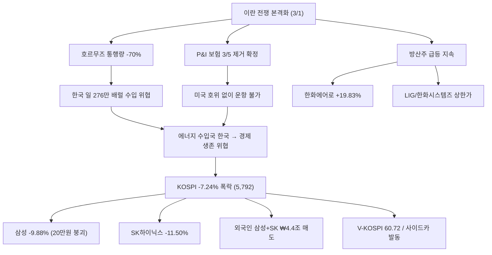
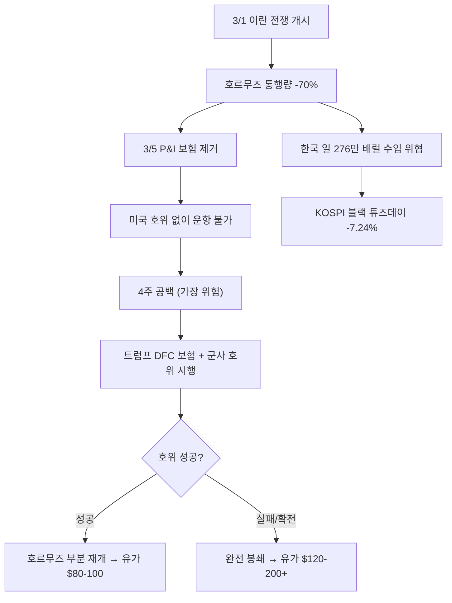
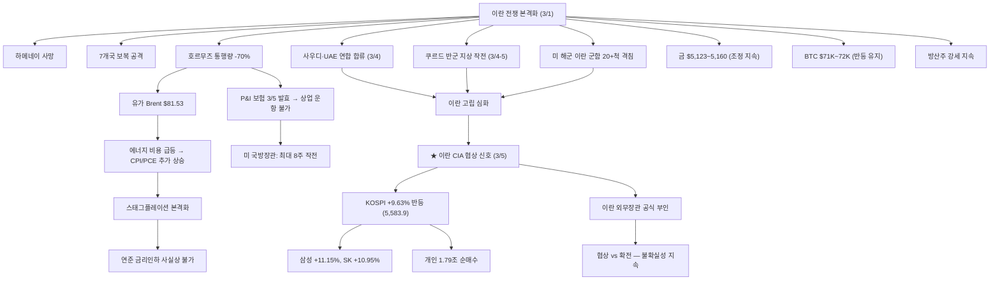
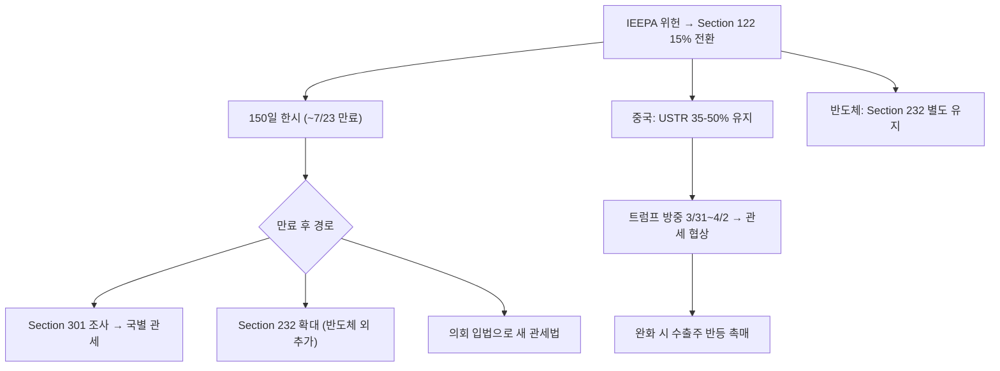

> **관련 글**: [2026년 투자 섹터 전망 (전체)](/knowledge/invest/2026/01/20/investment-sectors-outlook-2026.html)

2026년 3월 6일(목) 기준 업데이트입니다. **3월 5일 KOSPI가 +9.63%(+490.36p) 반등하며 5,583.9로 마감했습니다.** 이는 **2008년 이후 최대 단일 일일 상승폭**입니다. 3/3 -7.24%, 3/4 -12.06%(서킷브레이커, 사상 최대 폭락)에서 **극적으로 반전**되었습니다.

반등의 핵심 트리거는 **이란 정보기관이 CIA에 제3국을 통해 협상 의사를 타진**한 보도입니다. 삼성전자 **~195,100원(+11.15%**, 장중 197,700원), SK하이닉스 **~941,000원(+10.95%**, 장중 985,000원)이 급반등. **개인투자자 1.79조원 순매수**. VKOSPI는 80.37(3/4 사상 최고)에서 **~73.71(-8.29%)**로 하락했으나 여전히 극도로 높은 수준.

다만 이란 외무장관은 공식 휴전 요청 부인. **사우디·UAE가 미-이스라엘 연합에 합류(3/4)**, **쿠르드 반군 지상 작전 개시(3/4-5)**, **미 해군이 이란 군함 20+척 격침**(5일간), 미 국방장관 **"최대 8주 작전"** 발언 등 전쟁 확전 요소도 동시에 존재합니다.

P&I 보험 3/5 00:00 GMT 발효. 유가 **Brent $81.53**. 금 **$5,123-5,160**(조정 지속). **은 $82.78**(추가 하락). **비트코인 $71,015-72,722**(반등 유지). **원/달러 1,477.68원(+1.05%)**. S&P 500 **~6,821(-0.71%)**.

다음 주 **GTC 2026(3/16-19)**과 **FOMC(3/17-18)**가 시장 방향성의 핵심 변수입니다.

## 시장 현황 (2026년 3월 6일 기준)

### 글로벌 증시

| 지수 | 수준 | 변동 |
|------|------|------|
| S&P 500 | **~6,821** | **-0.71%**, 이란 전쟁으로 여전히 하락 |
| Nasdaq | **~22,500대** | 위험자산 회피 지속 |
| Dow Jones | **하락** | 방산 제외 하락 지속 |
| **KOSPI** | **5,583.9** (3/5 반등) | **+9.63% (+490.36p), 2008년 이후 최대 반등, 이란 CIA 협상 신호** |
| Nikkei 225 | **58,000+** | 사상최고 ('다카이치 트레이드') |

### 핵심 매크로 지표

| 항목 | 현황 | 방향 |
|------|------|------|
| 미국 Q4 GDP | **1.4%** (2/20 발표) | **예상 2.3% 대폭 하회**, Q3 4.4%에서 급락 |
| Core PCE | **3.0%** | **2025년 4월 이후 최고**, 유가 급등으로 추가 상승 우려 |
| 미국 CPI | **2.4%** | 유가 충격으로 상승 전환 가능성 |
| Core CPI | **2.5%** | 에너지 파급 효과 주시 |
| 미국 기준금리 | **3.50~3.75%** | FOMC 동결, 유가 급등으로 인하 사실상 불가 |
| **연준 의장** | **Powell 5/15 퇴임 확정** | 신임 의장 불확실성 부상 |
| 원/달러 환율 | **1,477.68원** | **+1.05% 원화 약세**, WGBI 4월 편입 + ING 1,375 전망 |
| **금(Gold)** | **$5,123~5,160/oz** | **조정 지속, 고변동성** |
| **은(Silver)** | **$82.78/oz** | **ATH $121.62 (1/29)에서 급락, 기술적 약세 지속** |
| **비트코인** | **$71,015~72,722** | **반등 유지, 이란 협상 신호에 긍정적** |
| **유가(Brent)** | **$81.53** | **P&I 보험 발효 후 소폭 상승, 바클레이즈 $100 전망** |
| 한은 기준금리 | **2.50%** | 5회 연속 동결 |
| **VKOSPI** | **~73.71** | **80.37(3/4 사상 최고)에서 -8.29%, 여전히 극도로 높음** |

### 지정학 리스크

| 항목 | 현황 | 긴급도 |
|------|------|--------|
| **★ 이란 CIA 협상 신호** | 이란 정보기관이 CIA에 제3국 통해 협상 타진, 외무장관 공식 부인 | **최고 (핵심 변수)** |
| **KOSPI +9.63% 반등** | 5,583.9, 2008년 이후 최대 반등, 개인 1.79조 순매수 | **긍정적** |
| **이란 전쟁 확전 중** | 사우디·UAE 연합 합류, 쿠르드 지상 작전, 미 군함 20+척 격침 | **최고** |
| **미 국방장관 "8주 작전"** | 트럼프 4-5주 vs 국방장관 최대 8주 | **높음** |
| **호르무즈 해협 봉쇄** | P&I 보험 3/5 발효, 통행량 -70% | **최고** |
| **한국 호르무즈 의존도** | 일 276만 배럴 수입 — 경제 생존 위협 | **최고** |
| **필리핀-한국 MOU 10건** | 원전·조선·방산·AI·핵심광물 (3/3 국빈방문) | **긍정적** |
| **방산주 강세 지속** | 이란 전쟁 지속, 사우디·UAE 합류로 추가 수혜 | **긍정적** |
| 러시아-우크라이나 | 평화 협상 결렬 | 높음 |

---

## KOSPI 3/3~5: 블랙 튜즈데이 -7.24% → 서킷브레이커 -12.06% → +9.63% 반등

### 폭락 핵심 데이터

| 항목 | 수치 |
|------|------|
| **KOSPI 종가** | **5,792** (-7.24%) |
| **시총 증발** | **₩377~390조원 (약 $270B)** |
| **V-KOSPI (변동성지수)** | **60.72** (2020년 이후 최고) |
| **사이드카** | **발동** |
| **삼성전자** | **-9.88%** (20만원 붕괴) |
| **SK하이닉스** | **-11.50%** |
| **외국인 매도 (삼성+SK)** | **₩4.4조원** |
| **한화에어로** | **+19.83%** |
| **LIG넥스원** | **상한가** |
| **한화시스템즈** | **상한가** |

### 블랙 튜즈데이 원인 분석


```mermaid
graph TD
    A["이란 전쟁 본격화 (3/1)"] --> B["호르무즈 통행량 -70%"]
    A --> C["P&I 보험 3/5 제거 확정"]
    B --> D["한국 일 276만 배럴 수입 위협"]
    C --> E["미국 호위 없이 운항 불가"]
    D --> F["에너지 수입국 한국 → 경제 생존 위협"]
    E --> F
    F --> G["KOSPI -7.24% 폭락 (5,792)"]
    G --> H["삼성 -9.88% (20만원 붕괴)"]
    G --> I["SK하이닉스 -11.50%"]
    G --> J["외국인 삼성+SK ₩4.4조 매도"]
    G --> K["V-KOSPI 60.72 / 사이드카 발동"]
    A --> L["방산주 급등 지속"]
    L --> M["한화에어로 +19.83%"]
    L --> N["LIG/한화시스템즈 상한가"]
```

### 섹터별 영향

| 섹터 | 변동 | 의미 |
|------|------|------|
| **반도체** | **삼성 -9.88%, SK -11.50%** | 외국인 ₩4.4조 매도, 에너지 의존도 우려 |
| **방산** | **한화에어로 +19.83%, LIG·한화시스템즈 상한가** | 전쟁 수혜 지속, K-방산 글로벌 수주 기대 |
| **에너지·화학** | 혼조 | 유가 상승 수혜 vs 원가 부담 |
| **수출주** | 대폭 하락 | 해운 대란 + 관세 + 유가 3중 부담 |
| **금융** | 하락 | 시장 전체 위험회피 |

### 시장 전망: 애널리스트 밴드

| 전망 | KOSPI 밴드 | 근거 |
|------|-----------|------|
| **하단** | **5,400** | 이란 협상 실패 + 전쟁 장기화 |
| **중앙** | **5,800-6,200** | 이란 협상 진전 + 군사 호위 시행 후 안정화 |
| **상단** | **6,600** | 이란 항복/협상 타결 + WGBI 편입 |

> **투자 시사점**: 3/5 반등(5,583.9)은 이란 CIA 협상 신호에 대한 시장의 강한 반응. 다만 V-KOSPI 73.71로 여전히 극변동성. 이란 협상 실질 진전 여부가 향후 방향 결정. 전쟁 조기 종결 시 **6,200-6,600 회복**, 장기화 시 **5,400 재테스트** 가능.

---

## KOSPI +9.63% 반등 (3/5): 이란 CIA 협상 신호 — 2008년 이후 최대 상승

### 반등 핵심 데이터

| 항목 | 수치 |
|------|------|
| **KOSPI 종가** | **5,583.9** (+9.63%, +490.36p) |
| **반등 규모** | **2008년 이후 최대 단일 상승폭** |
| **삼성전자** | **~195,100원 (+11.15%)**, 장중 197,700원 |
| **SK하이닉스** | **~941,000원 (+10.95%)**, 장중 985,000원 |
| **개인 순매수** | **1.79조원** |
| **VKOSPI** | **~73.71** (3/4 80.37에서 -8.29%) |

### 반등 트리거: 이란 CIA 협상 신호

| 항목 | 내용 |
|------|------|
| **이란 정보기관 → CIA** | 제3국을 통해 협상 의사 타진 |
| **시장 해석** | 전쟁 조기 종결 가능성 → 위험자산 급반등 |
| **이란 외무장관** | 공식적으로 휴전 요청 부인 |
| **판단** | 비공식 채널의 신호, 공식 vs 비공식 괴리 — 추이 모니터링 필수 |

> **투자 시사점**: KOSPI +9.63% 반등은 이란 협상 가능성에 대한 시장의 극적 반응. 삼성·SK하이닉스가 각각 +11.15%, +10.95% 반등했으나 **아직 폭락 전 수준은 미회복**. 개인투자자 1.79조 순매수가 반등을 주도. VKOSPI 73.71로 **변동성은 여전히 극도로 높아** 추가 급변동 가능. 이란 협상의 **실질 진전 여부**가 향후 추세를 결정.

---

## 트럼프 군사 호위 발표: DFC 보험 + 해군 호위 (4주 소요)

### 호위 작전 핵심

| 항목 | 내용 |
|------|------|
| **발표 내용** | DFC(개발금융공사) 보험 + 군사 호위함 제공 |
| **시행 시점** | "가능한 빨리" — 약 **4주 소요** 예상 |
| **대상** | 호르무즈 해협 통과 유조선 |
| **목적** | P&I 보험 대체 + 물리적 안전 보장 |

### P&I 보험 제거 (3/5 확정)

| 항목 | 내용 |
|------|------|
| **시행일** | **2026년 3월 5일** |
| **영향** | 미국 호위 없이는 **경제적으로 운항 불가** |
| **의미** | 보험사들이 전쟁 지역 리스크로 보장 철회 |

### 호르무즈 해협 현황

| 항목 | 수치 |
|------|------|
| **통행량 감소** | **-70%** (선박 추적 데이터 확인) |
| **일일 수송량 (정상)** | **1,500만 배럴/일** |
| **현재 수송량 (추정)** | **~450만 배럴/일** |
| **한국 호르무즈 의존** | **일 276만 배럴 수입** — **경제 생존 위협** |

### 한국의 호르무즈 의존도

한국은 호르무즈 해협을 통해 **하루 276만 배럴**을 수입하며, 이는 한국 경제의 **생존적 위협**에 해당합니다. 통행량 -70% 감소 상태에서 P&I 보험마저 제거되면, 미국 군사 호위가 시행되기까지의 **4주간 공백**이 가장 위험한 구간입니다.


```mermaid
graph TD
    A["3/1 이란 전쟁 개시"] --> B["호르무즈 통행량 -70%"]
    B --> C["3/5 P&I 보험 제거"]
    C --> D["미국 호위 없이 운항 불가"]
    D --> E["4주 공백 (가장 위험)"]
    E --> F["트럼프 DFC 보험 + 군사 호위 시행"]
    F --> G{"호위 성공?"}
    G -->|"성공"| H["호르무즈 부분 재개 → 유가 $80-100"]
    G -->|"실패/확전"| I["완전 봉쇄 → 유가 $120-200+"]
    B --> J["한국 일 276만 배럴 수입 위협"]
    J --> K["KOSPI 블랙 튜즈데이 -7.24%"]
```

> **투자 시사점**: 트럼프의 군사 호위 발표는 **중기적 안정 시그널**이나, **4주 공백기**가 핵심 리스크. P&I 보험 제거(3/5)로 상업 운항이 사실상 중단되면, 한국의 276만 배럴/일 수입에 직접 타격. 군사 호위 시행까지의 4주가 **시장 최대 변동성 구간**.

---

## 이란 전쟁: 하메네이 사망·CIA 협상 신호·사우디 연합·쿠르드 지상전 (3/1~)

### 사건 전개

| 시점 | 사건 |
|------|------|
| **3/1** | 미국 "Operation Epic Fury" + 이스라엘 "Operation Roaring Lion" — 이란 합동 공습 |
| **3/1** | **하메네이 사망** (IRGC 참모총장, 아마디네자드 전 대통령 동시 사망) |
| **3/1** | 이란 보복: **7개국** (이스라엘·UAE·카타르·쿠웨이트·바레인·요르단·사우디)에 미사일·드론 공격 |
| **3/1~2** | **호르무즈 해협 차단** — 1,500만 배럴/일 원유 수송 차질 |
| **3/1~2** | **MSC 중동 화물 전면 중단**, **Maersk 호르무즈/수에즈 통행 정지** |
| **3/3** | **KOSPI "블랙 튜즈데이" -7.24%** — 시총 377~390조 증발, V-KOSPI 60.72 |
| **3/3** | **삼성 -9.88%, SK하이닉스 -11.50%** — 외국인 ₩4.4조 매도 |
| **3/3** | **방산주 급등 지속** — 한화에어로 +19.83%, LIG·한화시스템즈 상한가 |
| **3/3~4** | **트럼프 DFC 보험 + 군사 호위 발표** (4주 소요) |
| **3/4** | **사우디아라비아·UAE, 미-이스라엘 연합에 공식 합류** |
| **3/4~5** | **쿠르드 반군, 이란 국경에서 지상 작전 개시** |
| **3/5** | **P&I(선박보험) 3/5 00:00 GMT 공식 발효** — 미국 호위 없이 운항 불가 |
| **3/5** | **미 해군, 5일간 이란 군함 20+척 격침** (잠수함 어뢰 공격 포함, 인도양) |
| **3/5** | **★ 이란 정보기관, CIA에 제3국 통해 협상 타진** — KOSPI +9.63% 반등 트리거 |
| **3/5** | **이란 외무장관, 공식 휴전 요청 부인** |
| **3/5** | **미 국방장관: "작전 최대 8주 소요"** (트럼프 4-5주 추정 대비 장기) |

### 시장 영향 (3/6 기준)

| 자산 | 수준 | 변동 | 의미 |
|------|------|------|------|
| **유가(Brent)** | **$81.53** | P&I 발효 후 소폭 상승 | 바클레이즈 $100 전망 유지 |
| **금(Gold)** | **$5,123~5,160** | **조정 지속** | JP모건 $6,300 목표 |
| **은(Silver)** | **$82.78** | **추가 하락** | 기술적 약세 지속 |
| **비트코인** | **$71,015~72,722** | **반등 유지** | 이란 협상 신호에 긍정적 |
| **KOSPI** | **5,583.9** | **+9.63% 반등** | 이란 CIA 협상 신호, 개인 1.79조 순매수 |
| **원/달러** | **1,477.68원** | **+1.05% 약세** | WGBI 4월 편입 + ING 1,375 전망 |
| **방산주** | **강세 지속** | 사우디·UAE 연합 합류 | K-방산 수혜 확대 |

### 자산 상관관계 — 이란 전쟁 환경 (3/6 업데이트)


```mermaid
graph TD
    A["이란 전쟁 본격화 (3/1)"] --> B["하메네이 사망"]
    A --> C["7개국 보복 공격"]
    A --> D["호르무즈 통행량 -70%"]
    D --> E["유가 Brent $81.53"]
    E --> F["에너지 비용 급등 → CPI/PCE 추가 상승"]
    F --> G["스태그플레이션 본격화"]
    G --> H["연준 금리인하 사실상 불가"]
    D --> I["P&I 보험 3/5 발효 → 상업 운항 불가"]
    I --> J["미 국방장관: 최대 8주 작전"]
    A --> K["사우디·UAE 연합 합류 (3/4)"]
    A --> L["쿠르드 반군 지상 작전 (3/4-5)"]
    A --> M["미 해군 이란 군함 20+척 격침"]
    K --> N["이란 고립 심화"]
    L --> N
    M --> N
    N --> O["★ 이란 CIA 협상 신호 (3/5)"]
    O --> P["KOSPI +9.63% 반등 (5,583.9)"]
    P --> Q["삼성 +11.15%, SK +10.95%"]
    P --> R["개인 1.79조 순매수"]
    O --> S["이란 외무장관 공식 부인"]
    S --> T["협상 vs 확전 — 불확실성 지속"]
    A --> U["금 $5,123~5,160 (조정 지속)"]
    A --> V["BTC $71K~72K (반등 유지)"]
    A --> W["방산주 강세 지속"]
```

| 자산 | 방향 | 논리 |
|------|------|------|
| **유가** | **상승 지속** | P&I 발효, 봉쇄 지속, 바클레이즈 $100, 미 국방장관 "8주" |
| **방산주** | **강세 지속** | 전쟁 확전 + 사우디·UAE 합류 + K-방산 수주 확대 |
| **금** | **조정 후 상승** | 안전자산 수요 유지, 이란 협상 불확실성으로 변동성 |
| **KOSPI** | **반등 시작** | 이란 CIA 협상 신호 트리거, 다만 VKOSPI 73.71 변동성 |
| **비트코인** | **반등 유지** | 이란 협상 신호에 긍정적이나 전쟁 종결 전 불확실 |

### 시나리오별 영향 (3/6 업데이트)

| 시나리오 | 확률 | 유가 | 금 | KOSPI |
|---------|------|------|-----|-------|
| **★ 이란 협상 진전 → 조기 종결** | **중 (3/5 신규)** | **$70-80** | **$5,000-5,200** | **6,200-6,600 급반등** |
| **군사 호위 성공 + 제한적 전쟁** | **중-높음** | **$80-100** | **$5,200-5,500** | **5,900-6,200 회복** |
| **장기전 + 간헐적 봉쇄 (8주)** | **중** | **$90-120** | **$5,500-6,000** | **방산 상승, 비방산 부진** |
| **봉쇄 장기화 (완전 차단)** | 중-저 | **$120-200** | **$6,000-6,500** | **추가 하락** |
| **이란 정권 교체 → 안정화** | 중-저 | $70-80 | $5,000-5,200 | 강한 반등 |

> **투자 시사점**: **이란 CIA 협상 신호**로 **"조기 종결" 시나리오**가 새롭게 부상하며 KOSPI +9.63% 반등을 이끌었습니다. 다만 이란 외무장관의 공식 부인, 사우디·UAE 연합 합류, 쿠르드 지상 작전, 미 국방장관 "최대 8주" 발언 등 **전쟁 확전 요소도 동시에 존재**합니다. **협상 진전 모니터링**이 최우선이며, 확전 시 재하락 리스크에 대비해 **VKOSPI 73.71 고변동성 속 현금 비중 유지**가 필요합니다.

---

## 유가: Brent $81.53, P&I 보험 발효, 바클레이즈 $100 전망

### 유가 현황 (3/6)

| 항목 | 수치 | 변동 |
|------|------|------|
| **Brent** | **$81.53** | P&I 보험 발효 후 소폭 상승 |
| 이란 공습 전 (2/27) | WTI ~$65, Brent ~$70 | |
| 호르무즈 차단 규모 | **1,500만 배럴/일** → 현재 **-70%** | |
| **바클레이즈 전망** | **$100 도달 가능** | |
| **미 국방장관** | **"최대 8주 작전"** | 트럼프 4-5주 추정 대비 장기 |

### OPEC+ 증산 발표

| 항목 | 내용 |
|------|------|
| **증산 규모** | **20.6만 배럴/일** |
| **목적** | 호르무즈 차단에 따른 공급 부족 완화 |
| **효과** | 제한적 — 호르무즈 차단(-70%)은 1,050만 배럴/일 감소에 해당 |

### 해운 대란 상세

| 해운사 | 조치 | 영향 |
|--------|------|------|
| **MSC** | **중동 화물 전면 중단** | 세계 최대 컨테이너 해운사 운항 정지 |
| **Maersk** | **호르무즈/수에즈 통행 정지** | 글로벌 공급망 대란 확대 |
| **P&I 보험** | **3/5 제거 확정** | 미국 호위 없이 경제적 운항 불가 |

### 유가 시나리오 (3/6 업데이트)

| 시나리오 | 유가 범위 | 확률 |
|---------|----------|------|
| **★ 이란 협상 진전 → 조기 종결** | **$70-80** | **중 (신규)** |
| **봉쇄 지속 + 호위 준비 (최대 8주)** | **$85-100** | **중-높음** |
| **군사 호위 성공 → 부분 재개** | **$80-100** | 중 |
| **봉쇄 장기화·완전 차단** | **$120-200** | 중-저 |
| **이란 정권 교체 → 안정** | $70-80 | 중-저 |

### 유가 급등의 거시경제 영향

| 영향 | 설명 |
|------|------|
| **인플레이션 급가속** | Brent $81.23, 바클레이즈 $100 전망 → CPI 0.5~1.0%p 추가 상승 가능 |
| **글로벌 공급망 대란** | MSC·Maersk 운항 중단 + P&I 제거 → 물류비 폭등 |
| **금리인하 사실상 불가** | 유가 급등 → 인플레 기대 급상승 → 연준 인하 불가 |
| **소비자 부담 폭증** | 휘발유/물류비 급등 → 소비 위축 → GDP 추가 하락 |
| **한국 경제 생존 위협** | **276만 배럴/일 호르무즈 의존** → 에너지 적자 급확대 |

> **투자 시사점**: 유가 Brent $81.53. P&I 보험 발효로 **상업 운항 사실상 불가**. 이란 CIA 협상 신호는 유가 하방 요인이나 외무장관 부인으로 **불확실성 지속**. 미 국방장관의 **"최대 8주 작전"** 발언은 유가 상방 압력. 바클레이즈 $100 전망 유지. **에너지 포지션 유지하되 이란 협상 진전 시 일부 차익실현 고려**.

---

## 금 $5,123~5,160: 조정 지속, 고변동성

### 금 가격 현황

| 항목 | 내용 |
|------|------|
| 현재 가격 | **$5,123~5,160/oz** (3/5 기준) |
| 역대 고점 | **$5,595** (2026년 1월 29일) |
| **JP모건 목표** | **$6,300** |
| **골드만삭스** | **목표 상향** |
| **중앙은행 매입** | **585톤/분기 평균** |

### 금 가격 흐름

| 시점 | 가격 | 이벤트 |
|------|------|--------|
| 1/29 | **$5,595** | 사상최고 (이란 공습 우려) |
| 2/22~24 | **$5,072** | 이란 협상 진전 → 폭락 |
| 2/28 | **$5,464** | 이란 공습 임박 → 급반등 |
| 3/3 | **$5,338~5,408** | 이란 전쟁 본격화 → 급등 |
| 3/4 | **$5,075~5,200** | 차익 실현 → 조정 |
| **3/5** | **$5,123~5,160** | **이란 협상 신호로 소폭 반등, 조정 지속** |

### 금 조정 요인

| 요인 | 설명 |
|------|------|
| **차익 실현** | $5,400+ 고점에서 단기 매도 물량 출회 |
| **달러 강세** | 안전자산 수요 → 달러 강세 → 금 상대적 약세 |
| **고변동성** | 전쟁 불확실성 → 양방향 급변동 |
| **구조적 지지** | 중앙은행 585톤/분기 매입 + JP모건 $6,300 → 하방 제한 |

> **투자 시사점**: 금은 **$5,123~5,160으로 조정 지속**. 이란 CIA 협상 신호로 안전자산 수요 일부 후퇴했으나, 전쟁 불확실성 지속으로 고변동성 유지. 중앙은행 585톤/분기 매입, JP모건 $6,300 목표가 **구조적 하방 지지**. 조정 시 **분할 매수 기회**로 판단.

---

## 은(Silver) $82.78: 기술적 약세 지속, 구조적 공급적자

### 은 가격 현황

| 항목 | 내용 |
|------|------|
| 현재 | **$82.78/oz** |
| **ATH** | **$121.62** (2026년 1월 29일) |
| **최근 하락** | **$93~96 → $83~86 → $82.78** (추가 약세) |
| **공급 상황** | **6년 연속 공급적자**, **COMEX 재고 -75%** |
| **촉매** | 이란 협상 신호로 안전자산 프리미엄 축소 |

### 은 급등 배경

| 요인 | 설명 |
|------|------|
| **이란 전쟁 → 안전자산 수요** | 금 동반 급등에 연동 |
| **6년 연속 공급적자** | 구조적 수급 불균형 심화 |
| **COMEX 재고 -75%** | 물리적 인도 가능 재고 고갈 수준 |
| **AI 산업수요 확대** | 태양광 패널, 전자기기, AI 서버 냉각 시스템 등 |
| **금 대비 저평가** | 금/은 비율 여전히 역사적 고평가 영역 |

> **투자 시사점**: 은 $82.78로 **추가 하락**(ATH $121.62). 이란 CIA 협상 신호로 안전자산 프리미엄이 축소되며 기술적 약세 지속. **6년 연속 공급적자 + COMEX 재고 -75%**라는 구조적 요인은 유효하나 **단기적으로 하방 압력 우세**. 추가 하락 시 중장기 매수 기회로 볼 수 있으나 현 구간에서는 관망 권고.

---

## 비트코인 $71,015~72,722: 이란 협상 신호에 반등 유지

| 항목 | 내용 |
|------|------|
| 현재 가격 | **$71,015~72,722** |
| **Fear & Greed** | **극도의 공포** 지속 |
| **핵심 변수** | 이란 CIA 협상 신호 → 위험자산에 긍정적, 다만 전쟁 지속 |
| **자산 상관관계** | 금 조정 + BTC 반등 = 위험자산 성격 유지 |

> **투자 시사점**: 비트코인은 $71,015~72,722로 **반등 유지** 중. 이란 CIA 협상 신호가 위험자산에 긍정적으로 작용. 다만 전쟁 종결 전까지 **불확실성 지속**이며, 여전히 위험자산으로 거래. 이란 협상 실질 진전 시 추가 반등 가능. **레버리지 절대 금지**, 관망 또는 극소량 분할 매수만 권고.

---

## KOSPI 5,583.9: 폭락 후 +9.63% 반등 — 이란 협상 신호

KOSPI는 2/26 사상최고 6,307 → 3/3-4 2일 -18.4% 대폭락(~5,093) → **3/5 +9.63% 반등(5,583.9)**. 이란 CIA 협상 신호가 트리거. **개인 1.79조원 순매수**. VKOSPI 73.71로 하락했으나 여전히 극변동성.

| 요인 | 영향 |
|------|------|
| **3/5 +9.63% 반등** | **삼성 +11.15%(~195,100원), SK +10.95%(~941,000원), 2008년 이후 최대** |
| **이란 CIA 협상 신호** | **반등 트리거**: 전쟁 조기 종결 가능성 부상 |
| **개인 1.79조 순매수** | **개인투자자 주도 반등** |
| **VKOSPI 73.71** | **80.37(사상 최고)에서 하락했으나 여전히 극변동성** |
| **유가 Brent $81.53** | **부정적**: P&I 보험 발효, 에너지 수입비 급증 |
| **한국 호르무즈 의존** | **치명적**: 일 276만 배럴 수입 → 경제 생존 위협 |
| **WGBI 4월 편입** | **지지**: 비중 2.08%, $56B+ 유입, ING 1,375원 전망 |
| **이란 협상 진전 여부** | **핵심 변수**: 진전 시 6,200-6,600 회복, 실패 시 재하락 |
| **필리핀-한국 MOU** | **긍정적**: 원전·조선·방산 등 10건, K-수출 파이프라인 확대 |

> **투자 시사점**: 3/5 반등(+9.63%)은 이란 협상 가능성에 대한 시장의 강한 반응. **VKOSPI 73.71로 변동성 극도로 높아** 추가 급변동 가능. 이란 협상 실질 진전 여부가 핵심. **반도체 반등 추세 포착하되, 현금 비중 유지**. WGBI 4월 편입(비중 2.08%, $56B+)이 중기적 지지 요인.

---

## 관세: Section 122 15% + 트럼프 방중 (3/31~4/2)

### 관세 체제 현황

| 구분 | 근거법 | 세율 | 상태 |
|------|--------|------|------|
| 보편관세 | **Section 122** | **15%** (2/24 발효) | **150일 한시 (~7/23 만료), 상한 도달** |
| **중국 관세** | USTR | **35~50%** | **트럼프 방중 3/31~4/2 협상 변수** |
| 반도체 관세 | **Section 232** | 별도 | **유지** |
| 철강/알루미늄 | **Section 232** | 별도 | **유지 (3/12 발효)** |
| IEEPA 기반 관세 | IEEPA | - | **위헌 무효 (대법원 6:3)** |

### 향후 관세 경로


```mermaid
graph TD
    A["IEEPA 위헌 → Section 122 15% 전환"] --> B["150일 한시 (~7/23 만료)"]
    B --> C{"만료 후 경로"}
    C --> D["Section 301 조사 → 국별 관세"]
    C --> E["Section 232 확대 (반도체 외 추가)"]
    C --> F["의회 입법으로 새 관세법"]
    A --> G["중국: USTR 35-50% 유지"]
    G --> H["트럼프 방중 3/31~4/2 → 관세 협상"]
    H --> I["완화 시 수출주 반등 촉매"]
    A --> J["반도체: Section 232 별도 유지"]
```

> **투자 시사점**: Section 122 15% 발효 중, **7/23 만료** 예정. **트럼프 방중(3/31~4/2)**은 미중 관세 완화의 첫 기회. 중국 35~50% 관세 조정 여부가 핵심. 이란 전쟁에 따른 에너지 비용 상승 + 관세 부담의 **이중 타격**이 수출 기업에 부담.

---

## WGBI 4월 편입: $56B+ 유입 — 환율 안정 핵심, ING 1,375원 전망

| 항목 | 내용 |
|------|------|
| 편입 시작 | **2026년 4월** |
| 비중 | **2.08%** (9위 규모) |
| 편입 방식 | **8단계 순차 편입** |
| **예상 유입 규모** | **$56B+** (약 80조원+) |
| **ING 환율 전망** | **2026년 중반 USD/KRW 1,375** |

> **투자 시사점**: 원/달러 1,477.68원으로 원화 약세가 지속되고 있으나, **WGBI 4월 편입(비중 2.08%, $56B+ 유입)**이 환율 안정의 핵심 촉매. ING는 WGBI 효과로 **2026년 중반 1,375원** 전망. 26번째 편입 국가.

---

## 스태그플레이션 심화: GDP 1.4% + Core PCE 3.0% + 유가 $81.23 충격

### 스태그플레이션 신호 (3/6 업데이트)

| 지표 | 신호 | 의미 |
|------|------|------|
| GDP **1.4%** (급락) | 성장 둔화 | Q3 4.4% → Q4 1.4% 급락 |
| Core PCE **3.0%** | 인플레 재상승 | 2025년 4월 이후 최고 |
| **Brent $81.53** | **에너지 충격 지속** | **바클레이즈 $100 전망, P&I 보험 발효** |
| **미 국방장관 "8주 작전"** | **유가 상방 압력 장기화** | 트럼프 4-5주 대비 장기 |
| **호르무즈 -70%** | **공급 차단 지속** | **P&I 발효(3/5)로 상업 운항 불가** |
| **해운비 급등** | **공급망 비용 급등** | **MSC·Maersk 운항 중단 → 물류비 전가** |
| 관세 15% | 수입 물가 상승 | 관세 + 유가 + 해운비 3중 인플레 압력 |
| **조합** | **성장 둔화 + 인플레 가속 + 에너지 충격 지속** | **스태그플레이션 본격화** |

### 연준 금리 전망: 인하 사실상 불가

| 시점 | 전망 | 근거 |
|------|------|------|
| 2월 초 | 6월 인하 기대 | CPI 2.4% (하락세) |
| 2/20 | 인하 후퇴 | Core PCE 3.0% (재가속) |
| 3/3 | 인하 사실상 불가 | Brent $79.41 → 인플레 가속, 호르무즈 차단 |
| 3/4 | 인하 완전 불가 | Brent $81+ 추가 상승, P&I 발효 |
| **3/5** | **인하 불가 유지** | **Brent $81.53, 미 국방장관 "8주 작전", 유가 상방 압력 장기화** |
| **Powell 퇴임** | **5/15 퇴임 확정** | 신임 의장 불확실성 |

> **투자 시사점**: 유가 Brent $81.53 + 미 국방장관 "최대 8주 작전"으로 **에너지 충격 장기화 가능성** 부상. Core PCE 3.0%에 관세 15% + 유가 + 해운비의 **3중 인플레 압력** 지속. 연준 금리인하는 **완전 불가**. 다만 이란 CIA 협상 진전 시 유가 하락 → 인하 여건 개선 가능. **인플레 헤지 자산(금, 원자재, 에너지) 비중 유지**.

---

## 환율: USD/KRW 1,477.68원 — 유가 충격 vs WGBI 편입 + ING 1,375 전망

| 요인 | 방향 | 설명 |
|------|------|------|
| **유가 $81.53 + 해운 대란** | **원화 약세** | 에너지 수입비 급증 + 물류비 상승 → 무역수지 악화 |
| **이란 전쟁 → 달러 강세** | **원화 약세** | 안전자산 선호 지속 |
| **원/달러 1,477.68원 (+1.05%)** | **원화 약세** | KOSPI 반등에도 원화는 약세 지속 |
| **WGBI 4월 편입** | **원화 강세** | 비중 2.08%, $56B+ 유입 → 핵심 상쇄 요인 |
| **ING 환율 전망** | **원화 강세** | **2026년 중반 1,375원** 전망 |
| **소비자심리 112.4** | **원화 강세** | 계엄 후유증 완전 탈피 |
| 한은 기준금리 | 2.50% (5회 연속 동결) | |

---

## 한국 경제: 호르무즈 의존 — 경제 생존 위협

| 항목 | 내용 |
|------|------|
| **호르무즈 수입** | **일 276만 배럴** — 한국 원유 수입의 핵심 통로 |
| **호르무즈 통행량** | **-70% 감소** |
| **P&I 보험** | **3/5 제거** — 미국 호위 없이 운항 불가 |
| **소비자심리** | 88.2 → **112.4** (급격 회복, but 블랙 튜즈데이 이전) |
| **정부 선언** | **2026 경제도약의 해** |
| **GPU 확보 목표** | 2028년 **15,000개**, 2030년 **50,000개** |
| **삼성+SK 비중** | KOSPI 순이익 **56%** (257.6조/457조) — 삼성 +11.15%(~195,100원), SK +10.95%(~941,000원) 반등 |
| **WGBI 편입** | 4월 시작, 26번째 국가, 비중 **2.08%**, $56B+ 유입, ING 1,375원 |
| **필리핀-한국 MOU** | **10건 MOU 체결** (3/3 국빈방문) — 원전·조선·방산·AI·핵심광물·경찰협력 |
| **수출** | 2월 **+44.4%**, 반도체 출하량 **+137.6%** |

---

## 주요 구조적 테마

### 1. 다카이치 총선 압승 + 닛케이 58,000 ('다카이치 트레이드')

다카이치 총리의 압승(자민당 316석, 연립 352석)으로 아베노믹스 2.0이 본격화. 식료품 소비세 면제, 재정 확장, 금리 인상 억제가 핵심이며, **엔캐리 트레이드 재개**로 글로벌 유동성 공급.

### 2. 삼성전자 HBM4 출하 + 폭락 후 반등

삼성전자는 HBM4 출하 개시(2/12)로 주가가 작년 초 대비 **4배** 상승했으나, 3/3-4 블랙 튜즈데이에 2일 -20% 폭락 후 **3/5 +11.15%(~195,100원) 반등**. SK하이닉스도 **+10.95%(~941,000원) 반등**. 삼성+SK = KOSPI 순이익의 **56%**. 아직 폭락 전 수준은 미회복이나 과매도 복원 시작.

### 3. 한국 밸류업: 1980년대 일본 비유

| 항목 | 1980년대 일본 | 2026년 한국 |
|------|---------------|-------------|
| 미국 대통령 | 레이건 (보호무역) | 트럼프 (관세→양자협상) |
| 역할 | 미국의 핵심 제조업 파트너 | 미국의 대중국 제조업 파트너 |
| 밸류에이션 | 저평가→급격한 재평가 | 코리아 디스카운트→밸류업 |
| 핵심 산업 | 자동차, 전자 | 반도체(HBM4), AI, 배터리, 방산 |

### 4. 강세장 섹터 순환: 블랙 튜즈데이로 리셋

| 순서 | 유형 | 상태 |
|------|------|------|
| 1 | 선도 섹터 (반도체, AI) | 급등 후 **블랙 튜즈데이 폭락** |
| 2 | 대형 가치주 (금융, 통신) | 진행 중 → 조정 |
| 2.5 | **방산/조선** (이란 전쟁 수혜) | **급등 지속 (유일한 상승 섹터)** |
| 3 | **국민주 (네이버, 카카오)** | **미개시** |
| 4 | **경기순환주 (화학, 철강, 건설)** | **미개시** |
| 5 | 소형주·테마주 | 마지막 단계 |

---

## 투자 전략

### 현 국면 진단: "폭락 후 반등 + 이란 협상 신호 + 스태그플레이션 지속"

KOSPI **3/5 +9.63% 반등(5,583.9)**, 2008년 이후 최대 단일 상승. 삼성 +11.15%(~195,100원), SK하이닉스 +10.95%(~941,000원). **이란 CIA 협상 신호**가 트리거. 개인 1.79조 순매수. 다만 VKOSPI 73.71로 극변동성 지속. 유가 Brent $81.53. 미 국방장관 "최대 8주 작전". 이란 외무장관 공식 부인. 금 $5,123-5,160 조정 지속.

### 단기 전략 (3월): "반등 확인 + 이란 협상 추이 + 방산·에너지·반도체"

| 우선순위 | 전략 | 근거 |
|---------|------|------|
| 1 | **이란 협상 추이 모니터링** | CIA 협상 신호 → 실질 진전 여부가 시장 방향 결정 |
| 2 | **방산·에너지 포지션 유지** | 사우디·UAE 합류, 미 국방장관 "8주", 전쟁 지속 → 방산·에너지 강세 |
| 3 | **반도체 반등 추세 포착** | 삼성 +11.15%, SK +10.95% 반등 확인, GTC 3/16~19 카탈리스트 |
| 4 | **현금 비중 유지** | VKOSPI 73.71 극변동성, 이란 협상 불확실성 → 급변동 대비 |
| 5 | **금 조정 시 분할 매수** | $5,123~5,160 조정, JP모건 $6,300, 중앙은행 585톤/분기 |
| 6 | **은 관망** | $82.78 기술적 약세 지속, 추가 하락 가능성 |

### 중기 전략 (4~6월)

| 우선순위 | 전략 | 근거 |
|---------|------|------|
| 1 | **이란 전쟁 종결 시 반도체 추가 반등** | 이란 협상 진전 → KOSPI 6,200-6,600 회복 |
| 2 | **WGBI 편입 수혜** | 4월 편입 (비중 2.08%, $56B+) — 환율 안정(ING 1,375) + 외국인 매수 |
| 3 | **스태그플레이션 헤지 유지** | 유가 $100+ 시 인플레 급가속 — 금/원자재/에너지 비중 유지 |
| 4 | **트럼프 방중 모니터링** | 3/31~4/2 — 미중 관세 완화 시 수출주 반등 |
| 5 | **관세 체제 재편 모니터링** | Section 122 7/23 만료 |
| 6 | **밸류업 수혜주** | 자사주 소각, 고배당 기업 |

### 포트폴리오 배분 제안 (폭락 후 반등 확인)

```
현금/단기채: 22% (↓ 반등 확인이나 VKOSPI 73.71 극변동성)
├── 현금: 12%
└── 단기국채 ETF: 10%

귀금속·원자재·에너지: 28% (유지)
├── 금 ETF/실물: 12% (JP모건 $6,300, $5,123~5,160 조정 시 매수)
├── 은 ETF/실물: 3% (↓ $82.78 기술적 약세, 관망)
└── 에너지 (유가 ETF/에너지주): 13% (Brent $81.53, 바클레이즈 $100)

방산: 10% (유지, 전쟁 지속)
├── 한국 방산주 (한화에어로, LIG넥스원 등): 7% (사우디·UAE 합류, 필리핀 MOU)
└── 글로벌 방산 ETF: 3%

반도체·AI: 12% (↑ 반등 확인, GTC 3/16~19)
├── 삼성전자/SK하이닉스: 9% (반등 +11.15%, +10.95% 확인, 추가 회복 여력)
└── HBM 후공정 장비·소재: 3%

섹터 순환·수출주: 10% (유지)
├── 관세 과매도 수출주: 3%
├── 국민주 (네이버, 카카오): 3%
├── 경기순환주 (화학, 철강, 건설): 2%
└── 코스닥 저평가주: 2%

밸류업·배당: 10% (유지)
├── 고배당 ETF (커버드콜 포함): 5%
├── 자사주 소각 기업: 3%
└── 배당성장주: 2%

금리 인하 수혜: 8% (유지, 인하 불가이나 이란 협상 진전 시 변수)
├── 장기채 ETF: 3%
└── 리츠(REITs): 5%
```

## 월별 체크포인트

| 월 | 이벤트 | 투자 시사점 |
|----|--------|------------|
| **3/1** | **이란 전쟁 본격화, 하메네이 사망** | 유가 급등, 방산주 폭등, 해운 대란 |
| **3/3** | **KOSPI 블랙 튜즈데이 -7.24%** | V-KOSPI 60.72, 삼성 20만원 붕괴, 시총 377~390조 증발 |
| **3/4** | **트럼프 군사 호위 발표, 사우디·UAE 연합 합류** | 중기 안정 시그널 + 이란 고립 심화 |
| ~~**3/5**~~ | ~~**P&I 보험 발효**~~ | **완료: 3/5 00:00 GMT 발효** |
| **3/5** | **KOSPI +9.63% 반등, 이란 CIA 협상 신호, 미 군함 20+척 격침, 쿠르드 지상전** | **2008년 이후 최대 반등, 협상 vs 확전 동시 진행** |
| **~3/12** | 철강/알루미늄 25% 관세 발효 | Section 232 |
| **3/15~19** | **GTC 2026** | Vera Rubin, HBM4, Feynman |
| **3/31~4/2** | **트럼프 방중, 시진핑 정상회담** | 미중 관세 협상 변수 |
| **~4월 초** | **군사 호위 시행 (4주 후)** | 호위 성공 시 유가 안정화, KOSPI 반등 |
| **4월** | **WGBI 인덱스 편입 시작** | $560-700억 유입 + 환율 안정 |
| **5/15** | Powell 퇴임 | 연준 리더십 전환 |
| **~7/23** | **Section 122 150일 만료** | 관세 재편 핵심 분기점 |
| 4~11월 | WGBI 8회 분할 편입 진행 | 매달 균등 편입 → 지속적 외국인 매수 |

## 리스크 요인 정리

| 리스크 | 심각도 | 확률 | 대응 |
|--------|--------|------|------|
| **이란 협상 실패 → 전쟁 장기화(8주+)** | **최고** | **중-높음** | 방산·에너지 비중 유지, 현금 확보 |
| **한국 호르무즈 의존 (276만 배럴/일)** | **최고** | **확정** | P&I 발효, 에너지 안보 최우선 |
| **VKOSPI 73.71 극변동성** | **최고** | **확정** | 반등 후에도 급변동 가능, 현금 비중 유지 |
| **유가 $100+ (바클레이즈 전망)** | **최고** | **중** | 미 국방장관 "8주 작전", 에너지 포지션 유지 |
| **스태그플레이션 본격화** | **최고** | **매우 높음** | 금/원자재/에너지 비중 유지, 금리인하 불가 |
| **KOSPI 재하락** | **높음** | **중** | 이란 협상 실패 시 5,093 재테스트 가능 |
| **관세 15% + 유가 급등 이중 부담** | **높음** | **높음** | 수출주 영향 재점검 |
| 원화 약세 지속 (1,477.68원) | 높음 | 높음 | WGBI 4월 편입 + ING 1,375 전망이 중기 상쇄 |
| 은 추가 하락 | 중간 | 중-높음 | $82.78 기술적 약세, 관망 권고 |

## 정리

| 항목 | 내용 |
|------|------|
| **3/5 KOSPI +9.63% 반등** | **5,583.9 (+490.36p), 2008년 이후 최대, 이란 CIA 협상 신호 트리거, 개인 1.79조 순매수** |
| **이란 CIA 협상 신호** | **이란 정보기관 → CIA 제3국 통해 협상 타진, 외무장관 공식 부인 — 불확실성** |
| **삼성·SK 반등** | **삼성 +11.15%(~195,100원), SK +10.95%(~941,000원) — 아직 폭락 전 미회복** |
| **이란 전쟁 확전** | **사우디·UAE 연합 합류, 쿠르드 지상 작전, 미 군함 20+척 격침, 미 국방장관 "8주"** |
| **P&I 보험** | **3/5 00:00 GMT 발효 — 상업 운항 사실상 불가** |
| **호르무즈** | **통행량 -70%, 한국 일 276만 배럴 수입 — 경제 생존 위협** |
| **유가** | **Brent $81.53, 바클레이즈 $100 전망 유지** |
| **VKOSPI** | **73.71 (80.37에서 -8.29%) — 여전히 극변동성** |
| **금(Gold)** | **$5,123~5,160 (조정 지속), JP모건 $6,300 목표, 중앙은행 585톤/분기** |
| **은(Silver)** | **$82.78 추가 하락, 기술적 약세 지속** |
| **스태그플레이션** | **GDP 1.4% + Core PCE 3.0% + 유가 $81.53 → 인플레 지속, 연준 인하 불가** |
| **비트코인** | **$71,015~72,722 반등 유지, 이란 협상 신호에 긍정적** |
| **원/달러** | **1,477.68원 (+1.05%), WGBI 4월 편입 + ING 1,375 전망이 중기 상쇄** |
| **관세** | **Section 122 15% 발효 (~7/23 만료), 트럼프 방중 3/31~4/2** |
| **KOSPI 전망** | **이란 협상 진전 시 6,200~6,600, 실패 시 5,400 재테스트** |
| **WGBI** | **4월 편입 (비중 2.08%, $56B+ 유입) — 환율 안정 핵심** |
| **필리핀 MOU** | **10건 MOU (원전·조선·방산·AI·핵심광물) — K-수출 파이프라인 확대** |

**핵심 투자 원칙:**
1. **이란 CIA 협상 신호 = 핵심 변수** -- 실질 진전 여부가 시장 방향 결정, 모니터링 최우선
2. **KOSPI +9.63% 반등 확인** -- 과매도 복원 시작이나 VKOSPI 73.71 극변동성 지속
3. **반도체 반등 추세 포착** -- 삼성 +11.15%, SK +10.95% 반등, GTC 3/16~19 카탈리스트
4. **방산·에너지 = 전쟁 지속 수혜** -- 사우디·UAE 합류, 미 국방장관 "8주", 비중 유지
5. **에너지 + 금 = 인플레 헤지** -- Brent $81.53, 금 $5,123~5,160 조정 시 매수
6. **한국 호르무즈 의존(276만 배럴/일) = 경제 생존 위협** -- P&I 보험 발효
7. **WGBI 4월 편입 = 구조적 호재** -- 비중 2.08%, $56B+ 유입, ING 1,375원 전망
8. **현금 비중 유지** -- VKOSPI 73.71 극변동성, 이란 협상 불확실성 대비

**투자 결정은 본인의 리스크 허용 범위와 투자 기간을 고려하여 신중하게 내리시기 바랍니다.**
