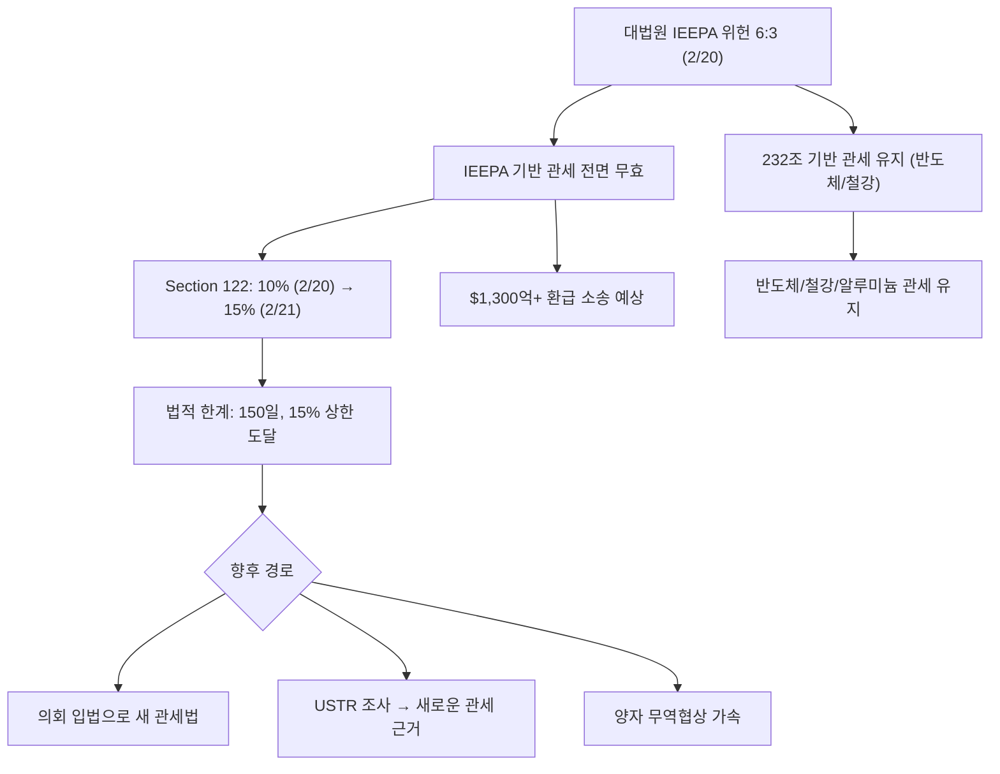

> **관련 글**: [2026년 투자 섹터 전망 (전체)](/knowledge/invest/2026/01/20/investment-sectors-outlook-2026.html)

2026년 2월 27일(목) 기준 업데이트입니다. 이번 주 최대 이벤트는 **NVIDIA Q4 FY26 실적 비트**(매출 $68.1B, Q1 가이던스 $78B)로 AI 투자 모멘텀이 재확인된 것입니다. **Section 122 15% 관세가 2/24 발효**되었으며, 대법원 IEEPA 위헌 판결 이후 트럼프가 즉시 글로벌 관세를 15%로 재인상했습니다. **비트코인이 $68.5K로 반등**(2/25, 사상 최악의 연초 후 회복 조짐)했으나, 연초 대비 여전히 -24% 수준입니다. **연준 Powell 의장의 5/15 퇴임**이 확정되어 리더십 불확실성이 부상하고 있습니다. 금은 $5,072 조정 후 안정화 중이며, WGBI 4월 편입이 예정대로 진행됩니다.

## 시장 현황 (2026년 2월 27일 기준)

### 글로벌 증시

| 지수 | 수준 | 변동 |
|------|------|------|
| S&P 500 | **~6,900** | NVIDIA 실적 비트로 반등 |
| Nasdaq | **~22,900** | AI/반도체 강세 |
| Dow Jones | **~49,600** | 관세 불확실성 상존 |
| KOSPI | **5,809+** | 사상최고 연속 경신 |
| Nikkei 225 | **58,000+** | 사상최고 ('다카이치 트레이드') |

### 핵심 매크로 지표

| 항목 | 현황 | 방향 |
|------|------|------|
| 미국 Q4 GDP | **1.4%** (2/20 발표) | **예상 2.3% 대폭 하회**, Q3 4.4%에서 급락 |
| Core PCE | **3.0%** | **2025년 4월 이후 최고**, 예상 2.9% 상회 |
| 미국 CPI | **2.4%** | 2025년 5월 이후 최저 |
| Core CPI | **2.5%** | 2021년 4월 이후 최저 |
| 미국 기준금리 | **3.50~3.75%** | FOMC 동결, 연내 2회 인하 기대 잔존 |
| **★ 연준 의장** | **Powell 5/15 퇴임 확정** | 신임 의장 불확실성 부상 |
| 원/달러 환율 | **~1,445원** | WGBI 4월 편입 원화 강세 기대 |
| **금(Gold)** | **~$5,072/oz** | 2일간 $1,200 폭락 후 안정화 중 |
| **은(Silver)** | **~$78/oz** | $100 돌파 후 -22% 조정, 6년 연속 공급적자 |
| **★ 비트코인** | **~$68,500** | **2/25 +6% 반등**, 연초 대비 -24%, ETF 유출 둔화 조짐 |
| 유가(브렌트) | **$70** | 이란 협상 진전으로 소폭 안정 |
| 유가(WTI) | **$66.3** | |
| 한은 기준금리 | **2.50%** | 5회 연속 동결 |

### 지정학 리스크

| 항목 | 현황 | 긴급도 |
|------|------|--------|
| **이란-미국** | **협상 진전**: 외무장관 "2~3일 합의 초안", 3/15 공격 확률 50% | **높음 (완화 추세)** |
| 러시아-우크라이나 | 평화 협상 결렬 | 높음 |

---

## ★ Section 122 관세 15% 인상 + USTR 조사 착수 예고

### Section 122 관세 인상 (2/21)

IEEPA 위헌 판결(2/20) 직후 10%로 발동했던 Section 122 보편관세가 **이틀 만에 15%로 인상**되었습니다.

| 항목 | 내용 |
|------|------|
| 인상 일자 | **2월 21일 (금)** |
| 발효 일자 | **2월 24일 (월)** |
| 세율 변경 | **10% → 15%** (법적 상한 도달) |
| 법적 제한 | **최대 150일, 최대 15%** — 법적 상한에 도달, 추가 인상 불가 |
| Section 232 관세 | **반도체·철강 관세 별도 유지** (Section 122와 무관) |

### 환급 소송 이슈

| 항목 | 내용 |
|------|------|
| 환급 대상 금액 | **$1,300억+** (IEEPA 위헌으로 무효화된 관세 징수분) |
| 행정명령 포함 여부 | **미포함** — 행정명령에 환급 관련 조항 없음 |
| 예상 | 대규모 환급 소송 예상 → 재정 부담 |

### USTR 주요 교역국 조사 예고

| 항목 | 내용 |
|------|------|
| 내용 | USTR이 **주요 교역국 대상 무역 관행 조사 착수 예고** |
| 한국 포함 가능성 | **있음** — 주요 교역국에 해당 |
| 의미 | Section 122 만료(150일) 이후를 대비한 **새로운 관세 근거 마련** 시도 |
| 시사점 | 관세 불확실성 장기화 가능 |

### 관세 체제 현황 종합

| 구분 | 근거법 | 세율 | 상태 |
|------|--------|------|------|
| 보편관세 | **Section 122** | **15%** (2/24 발효) | **150일 한시, 상한 도달** |
| 반도체 관세 | **Section 232** | 별도 | **유지** |
| 철강/알루미늄 | **Section 232** | 별도 | **유지** |
| IEEPA 기반 관세 | IEEPA | - | **위헌 무효** |
| 캐나다/멕시코 펜타닐 | IEEPA | - | **별도 소송 진행 중** |

### 관세 경로 전망


```mermaid
graph TD
    A["대법원 IEEPA 위헌 6:3 (2/20)"] --> B["IEEPA 기반 관세 전면 무효"]
    A --> C["232조 기반 관세 유지 (반도체/철강)"]
    B --> D["Section 122: 10% (2/20) → 15% (2/21)"]
    D --> E["법적 한계: 150일, 15% 상한 도달"]
    E --> F{"향후 경로"}
    F --> G["의회 입법으로 새 관세법"]
    F --> H["USTR 조사 → 새로운 관세 근거"]
    F --> I["양자 무역협상 가속"]
    C --> J["반도체/철강/알루미늄 관세 유지"]
    B --> K["$1,300억+ 환급 소송 예상"]
```

> **투자 시사점**: Section 122가 이틀 만에 **법적 상한 15%에 도달**했다는 것은 트럼프 행정부의 관세 의지가 강하다는 신호이나, 동시에 **더 이상 인상이 불가**하다는 한계도 드러냈습니다. USTR 조사 착수 예고는 150일 만료 이후를 대비한 **새로운 관세 근거 마련** 시도로, 관세 불확실성이 장기화될 수 있습니다. $1,300억+ 환급 소송은 재정적 부담 요인입니다.

---

## ★ 금 $5,072 폭락: 2일간 $1,200 하락 (1983년 이후 최악)

### 금 가격 현황

| 항목 | 내용 |
|------|------|
| 현재 가격 | **$5,072/oz** |
| 고점 | **$5,595** (2026년 1월 29일) |
| 조정 폭 | **-$523 (-9.3%)** |
| **2일간 폭락** | **$1,200 하락** — **1983년 이후 최악의 2일 하락** |
| UBS 전망 | **$6,200** |
| Goldman Sachs 전망 | **$5,400** |
| JPMorgan/Deutsche Bank | **$6,000** |

### 금 폭락 원인 분석

| 요인 | 설명 |
|------|------|
| **이란 협상 진전** | 공습 우려 급감 → 안전자산 프리미엄 해소 |
| **단기 과매수 해소** | $5,595까지 급등 후 기술적 조정 |
| **차익 실현** | 고점 부근에서 대규모 차익 매물 |
| **달러 강세 반전** | 관세 인상 → 달러 강세 → 금 약세 |

### 금 구조적 강세 요인 (여전히 유효)

| 요인 | 설명 |
|------|------|
| **스태그플레이션 우려** | GDP 1.4% + Core PCE 3.0% → 전통적 금 강세 환경 |
| **관세 불확실성** | Section 122 15% + USTR 조사 → 장기 불확실성 |
| **중앙은행 매입 지속** | 글로벌 중앙은행의 달러 대안 자산 매입 |
| **금리 인하 불확실** | Core PCE 3.0%로 인하 지연 → 그러나 장기 인하 방향 유지 |

> **투자 시사점**: 2일간 $1,200 폭락은 **1983년 이후 최악의 단기 하락**이지만, 구조적 강세 요인(스태그플레이션, 중앙은행 매입, 관세 불확실성)은 여전히 유효합니다. UBS $6,200, GS $5,400 전망 대비 $5,072는 **조정 매수 기회**가 될 수 있으나, 이란 협상 타결 시 추가 하락($4,800-4,900대) 가능성도 열어둬야 합니다.

---

## ★ 은(Silver) $100 돌파 후 $78 조정: 구조적 강세 유효

### 은 가격 현황

| 항목 | 내용 |
|------|------|
| 현재 가격 | **~$78/oz** |
| 고점 | **$100+ 돌파** (이번 주) |
| 조정 폭 | **-22%** |
| 전년 대비 | 여전히 대폭 상승 |
| **공급 상황** | **6년 연속 공급적자**, **COMEX 재고 -75%** |

### 은 조정 원인

| 요인 | 설명 |
|------|------|
| **금 동반 조정** | 금 $1,200 폭락에 연동된 매도 |
| **$100 심리적 저항** | 3자리 진입 후 대규모 차익 실현 |
| **이란 협상 진전** | 안전자산 프리미엄 해소 |

### 은 구조적 강세 요인 (여전히 유효)

| 요인 | 설명 |
|------|------|
| **6년 연속 공급적자** | 구조적 수급 불균형 심화 |
| **COMEX 재고 -75%** | 물리적 인도 가능 재고 고갈 수준 |
| **AI 산업수요** | 태양광 패널, 전자기기, AI 서버 냉각 시스템 등 |
| **금 대비 저평가** | 금 $5,072 대비 은의 상대적 가치 여전히 저평가 |

> **투자 시사점**: 은의 $100→$78(-22%) 조정은 금 폭락과 심리적 저항의 영향이나, **6년 연속 공급적자 + COMEX 재고 -75%**라는 구조적 요인은 변함없습니다. 조정 폭이 금(-9%)보다 크지만(-22%), 이는 은의 높은 변동성 특성이며, 구조적 공급 부족이 지속되는 한 중장기 상승 추세는 유효합니다.

---

## ★ 이란 협상 진전: 공습 우려에서 외교적 해결 가능성으로

### 현황 변화

| 항목 | 이전 (2/22) | 현재 (2/23) |
|------|------------|------------|
| **상황** | 공습 임박 (CNN 2/22-23) | **협상 진전** |
| **이란 외무장관** | UN 안보리 서한 | **"2~3일 합의 초안 가능"** |
| **공격 확률** | 2/28까지 27% (Polymarket) | **3/15까지 50%** |
| **시장 반응** | 금 급등, 유가 상승 | **금 폭락, 안전자산 프리미엄 해소** |

### 시나리오별 영향 (업데이트)

| 시나리오 | 확률 | 유가 | 금 | 증시 |
|---------|------|------|-----|------|
| **외교적 합의** | **상승** | $60-65 하락 | $4,800대 추가 하락 | 반등 |
| **협상 결렬→공습** | 50% (3/15까지) | $80-90+ 급등 | $5,500+ 급반등 | 급락 |
| **긴장 지속** | - | $70-75 유지 | $5,000-5,200 횡보 | 변동성 |

> **투자 시사점**: 이란 상황이 **공습 임박→협상 진전**으로 전환된 것이 금 폭락의 핵심 촉매입니다. 그러나 3/15까지 공격 확률이 50%로, **외교적 해결이 확정된 것은 아닙니다**. 협상 결렬 시 금·유가 급반등이 예상되므로, 귀금속 포지션을 완전히 청산하기보다는 **조정 수준에서 분할 매수** 전략이 합리적입니다.

---

## ★ 비트코인 $68,500: 사상 최악의 연초 후 반등 조짐

### 비트코인 현황

| 항목 | 내용 |
|------|------|
| 현재 가격 | **~$68,500** (2/25 기준) |
| 고점 대비 | **-46%** |
| 연초 대비 | **-24%** (사상 최악의 연초 기록) |
| **2/25 반등** | **+6% 일일 반등**, 숏 스퀴즈 동반 |
| **ETF 자금 흐름** | 3개월간 -$58억 순유출, 최근 유출 둔화 조짐 |
| Fear & Greed | **극도의 공포** |

### 반등 배경 및 전망

| 포인트 | 설명 |
|--------|------|
| **과매도 반등** | Extreme Fear 구간에서 기술적 반등, 2/25 +6% |
| **숏 스퀴즈** | Circle +29%, Coinbase +13% 동반 |
| **규제 호재** | GENIUS Act 서명 완료, Clarity Act 진전 |
| **잔존 리스크** | 연초 대비 -24%, 대형 투자자 복귀 미확인 |

> **투자 시사점**: 비트코인이 사상 최악의 연초(-24%)를 기록한 후 $68,500으로 반등했습니다. 숏 스퀴즈와 과매도 기술적 반등의 성격이 강하며, **ETF 순유입 전환 + 대형 투자자 복귀**가 확인되기 전까지는 지속적 상승을 단정하기 어렵습니다. 다만 Extreme Fear 구간의 역사적 매수 기회 가능성은 열어두어야 합니다.

---

## ★ WGBI 4월 편입 재확인: $560-700억 외국인 자금 유입

### WGBI 편입 확정 상세

| 항목 | 내용 |
|------|------|
| 발표 | **FTSE Russell 재확인** |
| 편입 시작 | **2026년 4월** |
| 비중 | **2.05%** (9위 규모) |
| 편입 방식 | 8개월 x 8회 균등 분할 (4~11월) |
| **예상 유입 규모** | **$560-700억** (약 80-100조원) |
| 효과 | 외국인 채권 매수 → 원화 수요 → **환율 안정 핵심** |

> **투자 시사점**: FTSE Russell의 공식 재확인으로 WGBI 편입 불확실성이 완전히 해소되었습니다. $560-700억 유입은 기존 추정(60조원)보다 **상향된 수치**이며, 4월부터 8개월간 지속적인 외국인 매수가 원화 강세와 KOSPI 지지에 기여할 것입니다.

---

## 환율 동향: USD/KRW 1,445원

### 원/달러 1,445원

| 항목 | 수치/내용 |
|------|----------|
| 원/달러 환율 | **1,445원** |
| 한은 기준금리 | **2.50%** (5회 연속 동결) |
| 한국 2026 GDP 전망 | **1.8%** (수출 강세로 상향) |
| WGBI 편입 | **4월 시작** — $560-700억 유입 예상 |

### 환율 안정/강세 요인

| 요인 | 설명 |
|------|------|
| **WGBI 4월 편입 재확인** | $560-700억 유입 → 원화 수요 최대 촉매 |
| **IEEPA 위헌 판결** | 한국 관세 부담 경감 → 수출 기대 개선 |
| **KOSPI 사상최고** | 5,809 연속 경신 → 외국인 자금 유입 |

### 잔존 리스크

| 리스크 요인 | 설명 |
|------------|------|
| Section 122 15% + USTR 조사 | 관세 인상 → 원화 약세 압력 |
| 스태그플레이션 우려 | 미국 경기 둔화 → 한국 수출 영향 |
| 한은 동결 지속 | 경기 부양 여력 제한 |

---

## KOSPI 5,809 사상최고 연속 경신

### 한국 증시

| 지표 | 수준 | 비고 |
|------|------|------|
| KOSPI | **5,809** | +2.31%, 사상최고 연속 경신 |
| 삼성전자 HBM4 | 출하 개시 (2/12) | AI 반도체 경쟁력 |
| 개인 예수금 | **111조원** | 역대 최고 수준 |
| 한국 2026 GDP | **1.8%** | 수출 강세 반영 |

### KOSPI 상승 동력

| 요인 | 설명 |
|------|------|
| **IEEPA 위헌 수혜** | 한국 관세 부담 경감 기대 → 수출주 반등 |
| **반도체 강세** | HBM4 출하, AI 수요 지속 |
| **WGBI 편입 재확인** | 4월 편입 → $560-700억 유입 대기 |
| **밸류업 정책** | 자사주 소각, 배당 확대 지속 |
| **부동산→주식 자금 이동** | 예수금 111조원 |

---

## Q4 GDP 1.4% + Core PCE 3.0%: 스태그플레이션 우려

### 스태그플레이션 신호

| 지표 | 신호 | 의미 |
|------|------|------|
| GDP **1.4%** (급락) | 성장 둔화 | 경기 약화 |
| Core PCE **3.0%** (재가속) | 인플레 재상승 | 물가 불안 |
| 수출 **-0.9%** | 교역 둔화 | 관세 부작용 가시화 |
| **조합** | **성장 둔화 + 인플레 재가속** | **스태그플레이션 초기 신호** |

### 연준 금리 전망 + Powell 퇴임 리스크

| 시점 | 전망 | 근거 |
|------|------|------|
| 2월 초 | 6월 인하 재개 기대 | CPI 2.4%, Core CPI 2.5% (4년 최저) |
| **2/20 이후** | **인하 기대 후퇴** | **Core PCE 3.0%** (인플레 재가속) |
| 현 전망 | 연내 2회 인하 기대 잔존 | 시기 불확실, 하반기 가능 |
| **★ Powell 퇴임** | **5월 15일 퇴임 확정** | **신임 의장 선임 불확실성 부상** |

**연준 리더십 전환 리스크**: Jerome Powell 의장이 5/15 퇴임하며, 신임 의장 인선이 2026년 하반기 통화정책 방향에 핵심 변수로 부상합니다. 트럼프 대통령이 보다 완화적인 인물을 지명할 경우 금리 인하 가속, 매파적 인물 시 현 기조 유지가 예상됩니다.

> **투자 시사점**: GDP 1.4%와 Core PCE 3.0%의 조합은 **스태그플레이션 초기 신호**입니다. **금리 민감 자산(장기채, 리츠)에 대한 기대를 하향 조정**하고, 인플레 헤지 자산(금, 원자재)의 비중을 유지하되 **급격한 조정 후 분할 매수 전략**이 유효합니다.

---

## 주요 구조적 테마

### 1. 다카이치 총선 압승 + 닛케이 58,000 ('다카이치 트레이드')

다카이치 총리의 압승(자민당 316석, 연립 352석)으로 아베노믹스 2.0이 본격화되고 있습니다. 식료품 소비세 면제, 재정 확장, 금리 인상 억제가 핵심이며, **엔캐리 트레이드 재개**로 글로벌 유동성을 공급하고 있습니다.

### 2. 삼성전자 HBM4 출하 (2/12)

삼성전자의 HBM4 출하 개시는 한국 AI 반도체 경쟁력을 재확인한 이벤트입니다. SK하이닉스와 함께 글로벌 HBM 양강 구도를 공고히 하며, KOSPI 상승 동력으로 작용하고 있습니다.

### 3. 한국 밸류업: 1980년대 일본 비유

| 항목 | 1980년대 일본 | 2026년 한국 |
|------|---------------|-------------|
| 미국 대통령 | 레이건 (보호무역) | 트럼프 (관세→양자협상) |
| 역할 | 미국의 핵심 제조업 파트너 | 미국의 대중국 제조업 파트너 |
| 밸류에이션 | 저평가→급격한 재평가 | 코리아 디스카운트→밸류업 |
| 핵심 산업 | 자동차, 전자 | 반도체(HBM4), AI, 배터리 |

### 4. 강세장 섹터 순환: 아직 미완성

| 순서 | 유형 | 상태 |
|------|------|------|
| 1 | 선도 섹터 (반도체, AI) | 이미 상승 |
| 2 | 대형 가치주 (금융, 통신) | 진행 중 |
| 3 | **국민주 (네이버, 카카오)** | **미개시** |
| 4 | **경기순환주 (화학, 철강, 건설)** | **미개시** |
| 5 | 소형주·테마주 | 마지막 단계 |

---

## 투자 전략

### 현 국면 진단: "귀금속 급조정 + 관세 15% 인상 + 이란 협상 진전"

글로벌 시장은 **금 $1,200 폭락(-9%)·은 $100→$78(-22%)**의 귀금속 급조정, **Section 122 15% 인상 + USTR 조사 예고**의 관세 강화, **이란 협상 진전**으로 인한 안전자산 프리미엄 해소가 동시에 진행되고 있습니다. 한편 **WGBI 재확인($560-700억)**, **KOSPI 5,809 사상최고**, **IEEPA 위헌**은 중장기 긍정 요인입니다.

### 단기 전략 (2월~3월)

| 우선순위 | 전략 | 근거 |
|---------|------|------|
| 1 | **귀금속 조정 매수 기회 판단** | 금 -9%, 은 -22% 조정 — 구조적 강세 유효하나 이란 합의 시 추가 하락 가능 |
| 2 | **관세 15% + USTR 조사 영향 모니터링** | 수출주 영향 재점검, 한국 포함 가능성 |
| 3 | **이란 협상 결과 주시** | 3/15까지 공격 확률 50% — 협상 결렬 시 금·유가 급반등 |
| 4 | **비트코인 ETF 유출 추이 관찰** | $58억 유출 지속 시 추가 하방 리스크 |
| 5 | **스태그플레이션 헤지 유지** | Core PCE 3.0% 고착 시 금/원자재 조정 후 비중 확대 |

### 중기 전략 (4~6월)

| 우선순위 | 전략 | 근거 |
|---------|------|------|
| 1 | **WGBI 편입 수혜 포지션** | 4월 편입 재확인 ($560-700억) — 환율 안정 + 외국인 매수 |
| 2 | **관세 체제 재편 모니터링** | Section 122 150일 만료 시점(~7월), USTR 조사 결과 |
| 3 | **밸류업 수혜주** | 자사주 소각, 고배당 기업 |
| 4 | **섹터 순환 선제 매수** | 국민주, 경기순환주 — 아직 미개시 |

### 장기 전략 (연간)

| 우선순위 | 전략 | 근거 |
|---------|------|------|
| 1 | **장기 보유 원칙** | 코스피 75.6% 상승에도 42% 손실 — 단기 매매의 함정 |
| 2 | **밸류업 구조적 수혜주** | 1980년대 일본 비유 — 한국 밸류에이션 재평가 |
| 3 | **엔캐리 유동성 수혜** | 다카이치 아베노믹스 2.0 → 글로벌 유동성 공급 |

### 포트폴리오 배분 제안 (귀금속 조정 반영)

```
귀금속·원자재: 18%
├── 금 ETF/실물: 10% (조정 매수 분할 진입)
├── 은 ETF/실물: 5% (COMEX 재고 -75%, 구조적 공급적자)
└── 에너지 (유가 헤지): 3%

금리 인하 수혜: 12% — Core PCE 3.0%로 인하 지연 반영
├── 장기채 ETF: 5%
├── 리츠(REITs): 3%
└── 바이오/성장주: 4%

섹터 순환·수출주: 22% — IEEPA 위헌 수혜, Section 122 15% 영향 모니터링
├── 관세 과매도 수출주: 8%
├── 국민주 (네이버, 카카오): 6%
├── 경기순환주 (화학, 철강, 건설): 5%
└── 코스닥 저평가주: 3%

밸류업·배당: 18%
├── 고배당 ETF (커버드콜 포함): 8%
├── 자사주 소각 기업: 5%
└── 배당성장주: 5%

반도체·AI: 12%
├── 삼성전자/SK하이닉스: 8%
└── HBM 후공정 장비·소재: 4%

현금/단기채: 18% — 변동성 대비
├── 현금: 10%
└── 단기국채 ETF: 8%
```

## 월별 체크포인트

| 월 | 이벤트 | 투자 시사점 |
|----|--------|------------|
| **2/20** | **대법원 IEEPA 위헌 6:3 (완료)** | 관세 체제 대전환 |
| **2/21** | **Section 122 10%→15% 인상 (완료)** | 법적 상한 도달, 추가 인상 불가 |
| **2/24** | **Section 122 15% 발효** | 수출 기업 영향 모니터링 |
| 2월 | 금 $5,072 (-9% 조정), 은 $78 (-22% 조정) | 조정 매수 기회 vs 추가 하락 판단 |
| 3월 | 연준 FOMC | Core PCE 3.0% 반영한 스탠스 확인 |
| 3월 | USTR 교역국 조사 착수 | 한국 포함 여부, 관세 근거 변화 |
| **3/15** | **이란 공격 확률 50% 기준일** | 협상 타결 vs 결렬 분기점 |
| **4월** | **WGBI 인덱스 편입 시작** | $560-700억 유입 + 환율 안정 최대 촉매 |
| 5월 | STO 제도 구체화 | 코스닥 신규 자금 유입 기대 |
| 6월 | 거래시간 연장 + 지방선거 | 유동성 확대 / 부동산 규제 강화 |
| **~7월** | **Section 122 150일 만료** | 관세 재편 핵심 분기점 |
| 4~11월 | WGBI 8회 분할 편입 진행 | 매달 균등 편입 → 지속적 외국인 매수 |

## 리스크 요인 정리

| 리스크 | 심각도 | 확률 | 대응 |
|--------|--------|------|------|
| **관세 15% + USTR 조사** | **최고** | **높음** | 수출주 영향 재점검, 한국 포함 대비 |
| **이란 협상 결렬→공습** | **높음** | **50% (3/15까지)** | 귀금속 완전 청산 보류, 분할 매수 |
| **귀금속 추가 조정** | **높음** | **중간** | 이란 합의 시 금 $4,800대 가능, 분할 진입 |
| **스태그플레이션** | **높음** | **중간** | 금/원자재 비중 유지, 금리 인하 수혜 축소 |
| **비트코인 ETF 유출 지속** | **중간** | **높음** | 기관 이탈 신호, 하방 리스크 확대 |
| **$1,300억 환급 소송** | **중간** | **높음** | 재정 부담 → 국채 금리 상승 가능 |
| 환율 변동 (1,445원) | 중간 | 중간 | WGBI(4월) 안정 기대 |
| 러-우 협상 결렬 | 높음 | 높음 | 유럽 노출 점검, 에너지 헤지 |
| 부동산 경착륙 | 중간 | 중간 | 6월 이후 규제 강화 → 자금 이탈 가속 |

## 정리

| 항목 | 내용 |
|------|------|
| **Section 122 관세** | **10%→15% 인상 (2/21), 2/24 발효, 150일 한시, 법적 상한 도달** |
| **USTR 조사** | **주요 교역국 대상 조사 착수 예고, 한국 포함 가능성** |
| **환급 소송** | **$1,300억+** (행정명령 미포함, 대규모 소송 예상) |
| **★ 금(Gold)** | **$5,595→$5,072 (-9%), 2일간 $1,200 폭락 (1983년 이후 최악)** |
| **★ 은(Silver)** | **$100 돌파 후 $78 (-22% 조정), 6년 연속 공급적자, COMEX 재고 -75%** |
| **이란** | **협상 진전: 외무장관 "2~3일 합의 초안", 3/15 공격 확률 50%** |
| **비트코인** | **$67,825, ETF 3개월 -$58억 순유출** |
| **WGBI** | **4월 편입 재확인 (FTSE Russell), $560-700억 유입 예상** |
| 원/달러 | **1,445원** |
| KOSPI | **5,809 사상최고 연속 경신** |
| 연준 금리 | **3.50-3.75% 동결**, 인하 기대 후퇴 |
| 스태그플레이션 | GDP 1.4% + Core PCE 3.0% → 초기 신호 |

**핵심 투자 원칙:**
1. **귀금속 급조정은 공포가 아닌 기회** — 금 -9%, 은 -22% 조정이나 구조적 강세 요인(공급적자, 중앙은행 매입, 스태그플레이션) 유효. 분할 매수 전략 권장
2. **관세 15% 상한 도달 = 추가 인상 불가** — 그러나 USTR 조사로 장기 불확실성 지속
3. **이란 협상 진전은 긍정적이나 50% 리스크 잔존** — 3/15까지 결과 주시, 귀금속 완전 청산 보류
4. **비트코인 ETF 유출은 경고 신호** — 기관 이탈 지속, 추가 하방 리스크
5. **WGBI 4월 편입 = 최대 구조적 호재** — $560-700억 유입, 환율 안정 확정
6. **장기 보유가 수익률의 핵심** — 단기 변동에 흔들리지 않는 장기 관점 유지

**투자 결정은 본인의 리스크 허용 범위와 투자 기간을 고려하여 신중하게 내리시기 바랍니다.**
