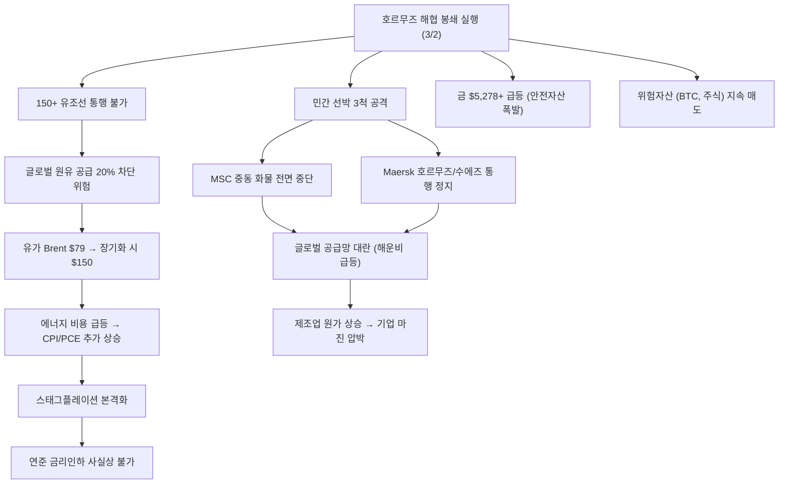
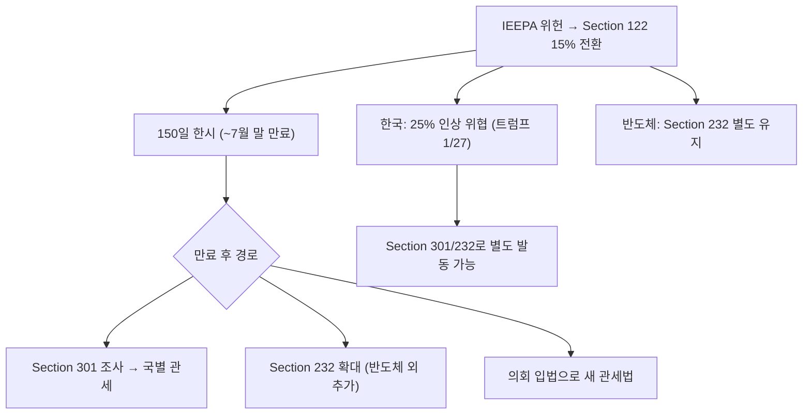

> **관련 글**: [2026년 투자 섹터 전망 (전체)](/knowledge/invest/2026/01/20/investment-sectors-outlook-2026.html)

2026년 3월 2일(일) 기준 업데이트입니다. **호르무즈 해협이 실제로 봉쇄**되었습니다. 이란은 민간 선박 3척을 공격하고, 150척 이상의 유조선이 통행 불가 상태입니다. **MSC는 중동 화물 전면 중단**, **Maersk는 호르무즈/수에즈 통행 정지**를 선언했습니다. 유가는 **Brent $79.15(+8.60%), WTI $72.35(+7.89%)** 급등했고, 장기화 시 **$150 전망**이 대두되고 있습니다. **금은 $5,278+ 급등**(안전자산 수요 폭발), **비트코인은 $63,401**(Fear 14)로 위험자산 회피가 지속됩니다. **스태그플레이션이 더욱 심화**되고 있으며, GDP 1.4% + Core PCE 3.0%에 유가 급등 충격까지 가세하여 인플레이션 가속이 우려됩니다.

## 시장 현황 (2026년 3월 2일 기준)

### 글로벌 증시

| 지수 | 수준 | 변동 |
|------|------|------|
| S&P 500 | **~6,870** | 이란·유가 충격 지속 |
| Nasdaq | **~22,690** | 위험자산 매도 지속 |
| Dow Jones | **~49,080** | 방산 제외 전면 하락 |
| KOSPI | **6,307** (2/26 사상최고) → **6,244** (2/27) | 호르무즈 봉쇄 충격 반영 예상 |
| Nikkei 225 | **58,000+** | 사상최고 ('다카이치 트레이드') |

### 핵심 매크로 지표

| 항목 | 현황 | 방향 |
|------|------|------|
| 미국 Q4 GDP | **1.4%** (2/20 발표) | **예상 2.3% 대폭 하회**, Q3 4.4%에서 급락 |
| Core PCE | **3.0%** | **2025년 4월 이후 최고**, 유가 급등으로 추가 상승 우려 |
| 미국 CPI | **2.4%** | 유가 충격으로 상승 전환 가능성 |
| Core CPI | **2.5%** | 에너지 파급 효과 주시 |
| 미국 기준금리 | **3.50~3.75%** | FOMC 동결, 유가 급등으로 인하 사실상 불가 |
| **★ 연준 의장** | **Powell 5/15 퇴임 확정** | 신임 의장 불확실성 부상 |
| 원/달러 환율 | **~1,445원** | 달러 강세 압력 vs WGBI 4월 편입 |
| **★★ 금(Gold)** | **~$5,278+/oz** | **안전자산 수요 폭발, 급등 지속** |
| **★ 은(Silver)** | **동반 급등** | 구조적 공급적자 + 지정학 프리미엄 |
| **★ 비트코인** | **~$63,401** | Fear & Greed 14 (극도의 공포), 위험자산 회피 지속 |
| **★★★ 유가(Brent)** | **$79.15** | **+8.60%, 호르무즈 봉쇄 실행, 장기화 시 $150** |
| **★★★ 유가(WTI)** | **$72.35** | **+7.89%, 민간 선박 공격·해운 대란** |
| 한은 기준금리 | **2.50%** | 5회 연속 동결 |

### 지정학 리스크

| 항목 | 현황 | 긴급도 |
|------|------|--------|
| **★★★ 호르무즈 봉쇄** | **이란 민간 선박 3척 공격, 150+ 유조선 통행 불가, MSC·Maersk 운항 중단** | **최고 (봉쇄 실행)** |
| **★★★ 이란-미국 전면전** | 2/28 공습 실행, 하메네이 사망, 이란 보복, 트럼프 "정권 교체" 선언 | **최고** |
| **★★ 해운 대란** | MSC 중동 화물 전면 중단, Maersk 호르무즈/수에즈 통행 정지 | **최고** |
| 러시아-우크라이나 | 평화 협상 결렬 | 높음 |

---

## ★★★ 호르무즈 해협 봉쇄 실행 + 해운 대란 (3/2)

### 사건 전개

| 시점 | 사건 |
|------|------|
| **2/28** | 미국-이스라엘 이란 공습 실행, 하메네이 사망 |
| **2/28** | 이란 보복: 27개 미군기지 공격, 트럼프 "정권 교체" 선언 |
| **3/1~2** | **★★★ 이란, 호르무즈 해협 민간 선박 3척 공격** |
| **3/1~2** | **★★★ 150+ 유조선 호르무즈 해협 통행 불가** |
| **3/1~2** | **★★★ MSC 중동 화물 전면 중단** |
| **3/1~2** | **★★★ Maersk 호르무즈/수에즈 통행 정지 선언** |

### 상황 변화 (3/1 → 3/2)

| 항목 | 이전 (3/1) | 현재 (3/2) |
|------|------------|------------|
| **호르무즈 해협** | 봉쇄 '리스크' | **봉쇄 '실행' — 민간 선박 3척 공격** |
| **해상 물류** | 우려 수준 | **MSC·Maersk 운항 중단, 150+ 유조선 통행 불가** |
| **유가** | Brent $72.48, WTI $67.02 | **Brent $79.15(+8.60%), WTI $72.35(+7.89%)** |
| **유가 전망** | $100-200 (봉쇄 시) | **$150 (장기화 시), 봉쇄가 현실화됨** |
| **인플레이션** | Core PCE 3.0% | **유가 급등으로 추가 가속 우려** |

### 시장 영향 (3/2)

| 자산 | 수준 | 변동 |
|------|------|------|
| **유가(Brent)** | **$79.15** | **+8.60% (하루 만에)** |
| **유가(WTI)** | **$72.35** | **+7.89%** |
| **금(Gold)** | **$5,278+** | **안전자산 수요 폭발** |
| **은(Silver)** | 동반 급등 | 금 연동 상승 |
| **비트코인** | **$63,401** | -6%, Fear 14 (위험자산 회피 지속) |

### 호르무즈 봉쇄의 거시경제 파급 효과


```mermaid
graph TD
    A["호르무즈 해협 봉쇄 실행 (3/2)"] --> B["민간 선박 3척 공격"]
    A --> C["150+ 유조선 통행 불가"]
    B --> D["MSC 중동 화물 전면 중단"]
    B --> E["Maersk 호르무즈/수에즈 통행 정지"]
    C --> F["글로벌 원유 공급 20% 차단 위험"]
    F --> G["유가 Brent $79 → 장기화 시 $150"]
    G --> H["에너지 비용 급등 → CPI/PCE 추가 상승"]
    H --> I["스태그플레이션 본격화"]
    I --> J["연준 금리인하 사실상 불가"]
    D --> K["글로벌 공급망 대란 (해운비 급등)"]
    E --> K
    K --> L["제조업 원가 상승 → 기업 마진 압박"]
    A --> M["금 $5,278+ 급등 (안전자산 폭발)"]
    A --> N["위험자산 (BTC, 주식) 지속 매도"]
```

### 시나리오별 영향 (업데이트)

| 시나리오 | 확률 | 유가 | 금 | 증시 |
|---------|------|------|-----|------|
| **★ 봉쇄 장기화 (현재 진행)** | **매우 높음** | **$100-150** | **$6,000+** | **급락 (-5~10%)** |
| **봉쇄 확대 (완전 차단)** | 상승 중 | **$150-200** | **$6,500+** | **폭락 (-10%+)** |
| **군사적 해결 (미국 호위)** | 중간 | **$80-100** | **$5,500-6,000** | **변동성 극대화** |
| **외교적 수습** | 낮음 | $65-70 복귀 | $5,000-5,200 | 반등 |

> **투자 시사점**: 호르무즈 봉쇄가 **'리스크'에서 '현실'로 전환**되었습니다. 이란의 민간 선박 공격과 글로벌 해운사(MSC·Maersk)의 운항 중단은 **공급 차질이 즉시 현실화**되고 있음을 의미합니다. 유가 Brent $79.15는 아직 시작에 불과하며, 봉쇄 장기화 시 **$150까지 급등 가능**합니다. 이는 **1970년대 오일쇼크 수준의 에너지 충격**으로 이어질 수 있으며, 글로벌 공급망 대란과 스태그플레이션을 촉발할 수 있습니다.

---

## ★★ 금 $5,278+ 급등: 호르무즈 봉쇄로 안전자산 수요 폭발

### 금 가격 현황

| 항목 | 내용 |
|------|------|
| 현재 가격 | **$5,278+/oz** (3/2 기준, 추가 급등 중) |
| 역대 고점 | **$5,595** (2026년 1월 29일) |
| **호르무즈 봉쇄 촉매** | **봉쇄 현실화 → 안전자산 수요 폭발** |
| UBS 전망 | **$6,200** |
| JPMorgan/Deutsche Bank | **$6,000** |

### 금 가격 흐름

| 시점 | 가격 | 이벤트 |
|------|------|--------|
| 1/29 | **$5,595** | 사상최고 (이란 공습 우려) |
| 2/22~24 | **$5,072** | 이란 협상 진전 → 폭락 |
| 2/28 | **$5,464** | 이란 공습 실행 → 급반등 |
| **3/2** | **$5,278+** | **호르무즈 봉쇄 실행 → 안전자산 폭발** |

### 금 급등 촉매

| 요인 | 설명 |
|------|------|
| **★★ 호르무즈 봉쇄 현실화** | 민간 선박 공격 + 해운 대란 → 안전자산 수요 극대화 |
| **유가 급등 → 인플레 가속** | Brent $79.15 → 인플레 기대 상승 → 금 강세 |
| **스태그플레이션 심화** | GDP 1.4% + Core PCE 3.0% + 유가 충격 |
| **중앙은행 매입 지속** | 글로벌 중앙은행의 달러 대안 자산 매입 |
| **$6,000 목표 근접** | UBS $6,200, JPM/DB $6,000 — 봉쇄 장기화 시 조기 달성 가능 |

> **투자 시사점**: 금은 호르무즈 봉쇄 현실화로 **$5,278+까지 급등**하고 있습니다. 유가 Brent $79.15 급등에 따른 인플레 가속 우려와 지정학 리스크가 결합되어 **$6,000 목표 달성이 앞당겨질 가능성**이 높습니다. 봉쇄 장기화 시 **$6,500+**도 전망됩니다.

---

## ★ 은(Silver) 동반 급등: 구조적 공급적자 + 호르무즈 프리미엄

### 은 가격 현황

| 항목 | 내용 |
|------|------|
| 현재 | **동반 급등** (금 연동 + 지정학 프리미엄) |
| **공급 상황** | **6년 연속 공급적자**, **COMEX 재고 -75%** |
| **촉매** | 호르무즈 봉쇄 → 안전자산 수요 + 공급망 리스크 |

### 은 급등 배경

| 요인 | 설명 |
|------|------|
| **★ 호르무즈 봉쇄 → 안전자산 수요** | 금 동반 급등에 연동 |
| **6년 연속 공급적자** | 구조적 수급 불균형 심화 |
| **COMEX 재고 -75%** | 물리적 인도 가능 재고 고갈 수준 |
| **AI 산업수요 확대** | 태양광 패널, 전자기기, AI 서버 냉각 시스템 등 |
| **금 대비 저평가** | 금/은 비율 여전히 역사적 고평가 영역 |

> **투자 시사점**: 은은 **호르무즈 봉쇄 현실화**로 금과 함께 동반 급등 중입니다. **6년 연속 공급적자 + COMEX 재고 -75%**라는 구조적 요인에 **호르무즈 프리미엄과 공급망 리스크**가 가세하여, 중장기 상승 추세가 더욱 강화되었습니다.

---

## ★★★ 유가 급등 + 해운 대란: 봉쇄 장기화 시 $150 전망

### 유가 현황 (3/2)

| 항목 | 수치 | 변동 |
|------|------|------|
| **Brent** | **$79.15** | **+8.60% (하루 만에)** |
| **WTI** | **$72.35** | **+7.89%** |
| 이란 공습 전 (2/27) | WTI ~$65, Brent ~$70 | |
| 공습 직후 (3/1) | WTI $67, Brent $72 | |

### 해운 대란 상세

| 해운사 | 조치 | 영향 |
|--------|------|------|
| **MSC** | **중동 화물 전면 중단** | 세계 최대 컨테이너 해운사의 운항 정지 |
| **Maersk** | **호르무즈/수에즈 통행 정지** | 글로벌 공급망 대란 확대 |
| **기타** | 150+ 유조선 통행 불가 | 원유 수송 병목 |

### 유가 시나리오 (업데이트)

| 시나리오 | 유가 범위 | 확률 |
|---------|----------|------|
| **★ 봉쇄 장기화 (현재)** | **$100-150** | **매우 높음** |
| **봉쇄 완전 차단** | **$150-200** | **상승 중** |
| **미국 군사 호위** | **$80-100** (부분 완화) | 중간 |
| **외교적 수습** | $65-70 복귀 | 낮음 |

### 유가 급등 + 해운 대란의 거시경제 영향

| 영향 | 설명 |
|------|------|
| **★ 인플레이션 급가속** | Brent $79 → $100+ 시 CPI 0.5~1.0%p 추가 상승 가능 |
| **글로벌 공급망 대란** | MSC·Maersk 운항 중단 → 해운비 급등 → 물류비 전가 |
| **금리인하 사실상 불가** | 유가 급등 → 인플레 기대 급상승 → 연준 인하 불가 |
| **소비자 부담 폭증** | 휘발유/물류비 급등 → 소비 위축 → GDP 추가 하락 |
| **에너지 수입국 심각 타격** | 한국·일본·유럽 — 에너지 적자 확대 + 통화 약세 |
| **제조업 원가 급등** | 원자재 + 물류비 동시 상승 → 기업 마진 대폭 압박 |

> **투자 시사점**: 호르무즈 봉쇄가 현실화되어 유가가 **Brent $79.15(+8.60%)까지 급등**했으며, 이는 시작에 불과합니다. MSC·Maersk의 운항 중단은 **에너지 공급 차질을 넘어 글로벌 공급망 대란**으로 확산되고 있습니다. 봉쇄 장기화 시 **$150까지 급등**할 수 있으며, 이는 **1970년대 오일쇼크급 충격**입니다. 에너지 포지션(유가 ETF, 에너지주) 확대가 필수이며, 해운주/물류주도 수혜가 예상됩니다.

---

## ★ 비트코인 $63,401: 위험자산 회피 지속

| 항목 | 내용 |
|------|------|
| 현재 가격 | **~$63,401** |
| **Fear & Greed** | **14 (극도의 공포)** |
| **ETF 자금 흐름** | 유출 지속 |
| **핵심 하락 요인** | 호르무즈 봉쇄 + 전면전 → 위험자산 회피, "디지털 금" 내러티브 실패 |

> **투자 시사점**: 비트코인은 호르무즈 봉쇄 + 전면전 환경에서 **위험자산으로 거래**되고 있습니다. Fear 14 극공포 구간이며, **전쟁 종료 신호 전까지 추가 하락 리스크** 존재. 다만 역사적으로 Extreme Fear 구간은 장기 매수 기회였으므로, 장기 관점 분할 매수 검토는 가능합니다.

---

## KOSPI 6,307 사상최고 → 호르무즈 봉쇄 충격 대비

KOSPI는 2/26 사상최고 6,307을 기록했으나, 호르무즈 봉쇄 충격으로 **월요일 하방 압력**이 예상됩니다.

| 요인 | 영향 |
|------|------|
| **유가 Brent $79** | **부정적**: 에너지 수입비 급증 → 무역수지 악화 |
| **해운 대란** | **부정적**: 물류비 상승 → 수출 기업 마진 압박 |
| **방산주** | **급등 예상**: 전쟁 장기화 → 국방비 증액 → 한국 방산 수출 |
| **반도체** | **혼조**: AI 수요 유지 but 위험자산 회피 + 공급망 리스크 |
| **WGBI 4월 편입** | **지지**: $560-700억 유입 → 환율 안정 핵심 |
| **반도체 강세** | **지지**: 삼성 4배, 하이닉스 6배 — 구조적 상승 추세 |

> **투자 시사점**: 호르무즈 봉쇄로 **에너지 수입 부담 급증 + 해운비 폭등**이 한국 기업에 이중 타격을 줄 수 있습니다. 다만 **WGBI 편입($560-700억) + 반도체 초강세**가 KOSPI를 지지할 것이며, **방산주는 최대 수혜 섹터**입니다.

---

## ★ 관세: Section 122 15% + 한국 25% 인상 위협

### 관세 체제 현황

| 구분 | 근거법 | 세율 | 상태 |
|------|--------|------|------|
| 보편관세 | **Section 122** | **15%** (2/24 발효) | **150일 한시 (~7월 말 만료), 상한 도달** |
| **한국 관세** | 위협 단계 | **25% 인상 위협** (트럼프 1/27) | **아직 발동 안 됨, 모니터링 필요** |
| 반도체 관세 | **Section 232** | 별도 | **유지** |
| 철강/알루미늄 | **Section 232** | 별도 | **유지** |
| IEEPA 기반 관세 | IEEPA | - | **위헌 무효** |

### 향후 관세 경로


```mermaid
graph TD
    A["IEEPA 위헌 → Section 122 15% 전환"] --> B["150일 한시 (~7월 말 만료)"]
    B --> C{"만료 후 경로"}
    C --> D["Section 301 조사 → 국별 관세"]
    C --> E["Section 232 확대 (반도체 외 추가)"]
    C --> F["의회 입법으로 새 관세법"]
    A --> G["한국: 25% 인상 위협 (트럼프 1/27)"]
    G --> H["Section 301/232로 별도 발동 가능"]
    A --> I["반도체: Section 232 별도 유지"]
```

> **투자 시사점**: Section 122 15%가 발효 중이며 **7월 말 만료 예정**입니다. 만료 후 **Section 301/Section 232 확대**로 전환 가능성이 높습니다. 특히 **한국에 대해 25% 인상 위협**(트럼프 1/27)이 있어, 수출주 리스크 요인입니다. **관세 + 유가 급등(Brent $79)**의 이중 부담이 수출 기업에 심각한 타격을 줄 수 있습니다.

---

## WGBI 4월 편입: $560-700억 유입 — 환율 안정 핵심

| 항목 | 내용 |
|------|------|
| 편입 시작 | **2026년 4월** |
| 비중 | **2.05%** (9위 규모) |
| 편입 방식 | 8개월 x 8회 균등 분할 (4~11월) |
| **예상 유입 규모** | **$560-700억** (약 80-100조원) |

> **투자 시사점**: 호르무즈 봉쇄로 원화 약세 압력이 극대화되고 있으나, **WGBI 4월 편입($560-700억 유입)**이 환율 안정의 핵심 상쇄 요인으로 작용할 것입니다.

---

## ★★ 스태그플레이션 심화: GDP 1.4% + Core PCE 3.0% + 유가 $79 충격

### 스태그플레이션 신호 (3/2 업데이트)

| 지표 | 신호 | 의미 |
|------|------|------|
| GDP **1.4%** (급락) | 성장 둔화 | Q3 4.4% → Q4 1.4% 급락 |
| Core PCE **3.0%** | 인플레 재상승 | 2025년 4월 이후 최고 |
| **★★ Brent $79.15 (+8.60%)** | **에너지 충격 현실화** | **호르무즈 봉쇄 → 유가 급등 → CPI 추가 상승** |
| **★ 해운비 급등** | **공급망 비용 급등** | **MSC·Maersk 운항 중단 → 물류비 전가** |
| 관세 15% | 수입 물가 상승 | 관세 + 유가 + 해운비 3중 인플레 압력 |
| **조합** | **성장 둔화 + 인플레 가속 + 에너지 충격** | **스태그플레이션 본격화** |

### 연준 금리 전망: 인하 사실상 불가

| 시점 | 전망 | 근거 |
|------|------|------|
| 2월 초 | 6월 인하 기대 | CPI 2.4% (하락세) |
| 2/20 | 인하 후퇴 | Core PCE 3.0% (재가속) |
| **3/2** | **인하 사실상 불가** | **Brent $79 → 인플레 가속, 봉쇄 장기화 시 $100-150** |
| **★ Powell 퇴임** | **5/15 퇴임 확정** | 신임 의장 불확실성 |

> **투자 시사점**: 호르무즈 봉쇄로 **Brent $79까지 급등**하면서, Core PCE 3.0%에 **에너지 충격이 직접 가세**하고 있습니다. 봉쇄 장기화 시 유가 $100-150 → CPI 0.5~1.0%p 추가 상승이 예상되며, 이는 **1970년대 오일쇼크급 스태그플레이션**을 촉발할 수 있습니다. 연준 금리인하는 **사실상 불가**해졌으며, **인플레 헤지 자산(금, 원자재, 에너지) 비중 확대**가 필수입니다.

---

## 환율: USD/KRW 1,445원 — 유가 충격 vs WGBI 편입

| 요인 | 방향 | 설명 |
|------|------|------|
| **★ 유가 $79 + 해운 대란** | **원화 약세** | 에너지 수입비 급증 + 물류비 상승 → 무역수지 대폭 악화 |
| **호르무즈 봉쇄 → 달러 강세** | **원화 약세** | 안전자산 선호 극대화 |
| **WGBI 4월 편입** | **원화 강세** | $560-700억 유입 → 핵심 상쇄 요인 |
| 한은 기준금리 | 2.50% (5회 연속 동결) | |

---

## 주요 구조적 테마

### 1. 다카이치 총선 압승 + 닛케이 58,000 ('다카이치 트레이드')

다카이치 총리의 압승(자민당 316석, 연립 352석)으로 아베노믹스 2.0이 본격화되고 있습니다. 식료품 소비세 면제, 재정 확장, 금리 인상 억제가 핵심이며, **엔캐리 트레이드 재개**로 글로벌 유동성을 공급하고 있습니다.

### 2. 삼성전자 HBM4 출하 + 주가 4배

삼성전자의 HBM4 출하 개시(2/12)와 함께 주가가 작년 초 대비 **4배** 상승했습니다. SK하이닉스는 **6배** 상승하여 한국 반도체 산업의 글로벌 경쟁력이 재확인되었습니다.

### 3. 한국 밸류업: 1980년대 일본 비유

| 항목 | 1980년대 일본 | 2026년 한국 |
|------|---------------|-------------|
| 미국 대통령 | 레이건 (보호무역) | 트럼프 (관세→양자협상) |
| 역할 | 미국의 핵심 제조업 파트너 | 미국의 대중국 제조업 파트너 |
| 밸류에이션 | 저평가→급격한 재평가 | 코리아 디스카운트→밸류업 |
| 핵심 산업 | 자동차, 전자 | 반도체(HBM4), AI, 배터리 |

### 4. 강세장 섹터 순환: 아직 미완성

| 순서 | 유형 | 상태 |
|------|------|------|
| 1 | 선도 섹터 (반도체, AI) | 이미 상승 |
| 2 | 대형 가치주 (금융, 통신) | 진행 중 |
| 3 | **국민주 (네이버, 카카오)** | **미개시** |
| 4 | **경기순환주 (화학, 철강, 건설)** | **미개시** |
| 5 | 소형주·테마주 | 마지막 단계 |

---

## 투자 전략

### 현 국면 진단: "호르무즈 봉쇄 실행 + 해운 대란 + 스태그플레이션 본격화"

호르무즈 해협 봉쇄가 **현실화**되었습니다. 이란의 민간 선박 공격, MSC·Maersk의 운항 중단, 150+ 유조선 통행 불가로 **글로벌 에너지 공급과 해운 물류가 동시에 마비**되고 있습니다. 유가 Brent $79.15(+8.60%)는 아직 시작이며, 봉쇄 장기화 시 $150 전망이 대두됩니다. **1970년대 오일쇼크급 스태그플레이션 리스크**가 현실적 위협이 되었습니다.

### 단기 전략 (3월): "에너지 충격 대비 포트폴리오"

| 우선순위 | 전략 | 근거 |
|---------|------|------|
| 1 | **★★ 에너지 포지션 확대** | Brent $79 → 봉쇄 장기화 시 $150, 에너지주/유가 ETF 최우선 |
| 2 | **★★ 귀금속 비중 확대** | 금 $5,278+ 급등, $6,000+ 목표 — 인플레 + 전쟁 최적 자산 |
| 3 | **★ 방산주 유지** | 전쟁 장기화 → 국방비 증액 → 한국 방산 수출 |
| 4 | **★ 해운주 주목** | MSC·Maersk 운항 중단 → 해운비 급등 → 대체 해운사 수혜 |
| 5 | **위험자산 비중 축소** | 비트코인, 고성장주 — 극도의 공포 지속 |

### 중기 전략 (4~6월)

| 우선순위 | 전략 | 근거 |
|---------|------|------|
| 1 | **스태그플레이션 헤지 최우선** | 유가 $100+ 시 인플레 급가속 — 금/원자재/에너지 비중 유지 |
| 2 | **WGBI 편입 수혜** | 4월 편입 ($560-700억) — 환율 안정 + 외국인 매수 |
| 3 | **관세 체제 재편 모니터링** | Section 122 7월 만료 + 한국 25% 위협 |
| 4 | **밸류업 수혜주** | 자사주 소각, 고배당 기업 |

### 포트폴리오 배분 제안 (에너지 충격 반영)

```
귀금속·원자재·에너지: 30% (↑ 기존 25%)
├── 금 ETF/실물: 12% (안전자산 폭발, $6,000+ 목표)
├── 은 ETF/실물: 5% (구조적 공급적자 + 지정학)
└── 에너지 (유가 ETF/에너지주): 13% (↑↑ 봉쇄 현실화)

방산: 8%
├── 한국 방산주 (한화에어로, LIG넥스원 등): 5%
└── 글로벌 방산 ETF: 3%

금리 인하 수혜: 5% (↓↓ 인하 사실상 불가)
├── 장기채 ETF: 2%
└── 리츠(REITs): 3%

섹터 순환·수출주: 15% (↓ 유가+관세 이중 부담)
├── 관세 과매도 수출주: 5%
├── 국민주 (네이버, 카카오): 4%
├── 경기순환주 (화학, 철강, 건설): 3%
└── 코스닥 저평가주: 3%

밸류업·배당: 12% (↓ 에너지 충격 반영)
├── 고배당 ETF (커버드콜 포함): 6%
├── 자사주 소각 기업: 3%
└── 배당성장주: 3%

반도체·AI: 10%
├── 삼성전자/SK하이닉스: 7%
└── HBM 후공정 장비·소재: 3%

현금/단기채: 20% (↑ 극심한 변동성 대비)
├── 현금: 12%
└── 단기국채 ETF: 8%
```

## 월별 체크포인트

| 월 | 이벤트 | 투자 시사점 |
|----|--------|------------|
| **3/2** | **★★★ 호르무즈 봉쇄 실행, 민간 선박 공격** | 유가 $79 급등, 해운 대란 시작 |
| **3/3** | **★★ 월요일 시장 개장** | 봉쇄 충격 본격 반영, 유가·증시 급변동 |
| 3월 | 연준 FOMC | Core PCE 3.0% + 유가 급등 반영 — 인하 사실상 불가 확인 |
| 3월~ | **호르무즈 봉쇄 장기화 여부** | **$100-150 분기점, 1970년대 오일쇼크 재현 여부** |
| **4월** | **WGBI 인덱스 편입 시작** | $560-700억 유입 + 환율 안정 최대 촉매 |
| 5월 | Powell 퇴임 (5/15) | 연준 리더십 전환 |
| **~7월** | **Section 122 150일 만료** | 관세 재편 핵심 분기점, 한국 25% 위협 현실화 여부 |
| 4~11월 | WGBI 8회 분할 편입 진행 | 매달 균등 편입 → 지속적 외국인 매수 |

## 리스크 요인 정리

| 리스크 | 심각도 | 확률 | 대응 |
|--------|--------|------|------|
| **★★★ 호르무즈 봉쇄 장기화** | **최고** | **매우 높음** | 에너지 포지션 최대 확대, 유가 $100-150 대비 |
| **★★★ 해운 대란 확대** | **최고** | **진행 중** | 해운주 주목, 공급망 영향 수출주 비중 조정 |
| **★★★ 스태그플레이션 본격화** | **최고** | **매우 높음** | 금/원자재/에너지 비중 최우선, 금리인하 수혜 대폭 축소 |
| **★★ 이란 전면전 확대** | **최고** | **높음** | 귀금속·방산 비중 유지, 위험자산 축소 |
| **★ 관세 15% + 한국 25% 위협** | **높음** | **높음** | 수출주 영향 재점검, 유가+관세 이중 타격 |
| 원화 약세 압력 | 높음 | 높음 | 유가 급등 + 달러 강세 vs WGBI 편입 상쇄 |
| 비트코인 추가 하락 | 중간 | 높음 | Fear 14 극공포, 전쟁 종료 전 추가 하방 |

## 정리

| 항목 | 내용 |
|------|------|
| **★★★ 호르무즈 봉쇄** | **이란 민간 선박 3척 공격, 150+ 유조선 통행 불가, MSC·Maersk 운항 중단** |
| **★★★ 유가** | **Brent $79.15(+8.60%), WTI $72.35(+7.89%), 장기화 시 $150** |
| **★★ 금(Gold)** | **$5,278+ 급등, 안전자산 수요 폭발, $6,000+ 목표** |
| **★★ 스태그플레이션** | **GDP 1.4% + Core PCE 3.0% + 유가 $79 → 인플레 가속, 연준 인하 불가** |
| **★ 은(Silver)** | **동반 급등, COMEX 재고 -75%, 구조적 공급적자** |
| **★ 비트코인** | **$63,401, Fear 14 (극도의 공포), 위험자산 회피 지속** |
| **관세** | **Section 122 15% 발효 (~7월 만료), 한국 25% 인상 위협** |
| **KOSPI** | **6,307 사상최고 — 호르무즈 충격 반영 대기** |
| **WGBI** | **4월 편입 ($560-700억 유입) — 환율 안정 핵심** |

**핵심 투자 원칙:**
1. **호르무즈 봉쇄 = 게임 체인저** — "리스크"에서 "현실"로 전환, 에너지 포지션 최우선 확대
2. **에너지 + 금 = 최적 자산** — 유가 $150 + 인플레 가속 + 전쟁 → 원자재·귀금속 구조적 강세
3. **스태그플레이션 대비 필수** — GDP 1.4% + 유가 급등 → 1970년대 오일쇼크급 위험
4. **해운 대란 수혜 포착** — MSC·Maersk 중단 → 해운비 급등 → 대체 해운사·물류주
5. **방산주 유지** — 전쟁 장기화 → 국방비 증액 지속
6. **WGBI 4월 편입 = 한국 시장 최대 구조적 호재** — $560-700억 유입, 유가 충격 부분 상쇄
7. **현금 비중 확대** — 극심한 변동성 속 기회 포착 여력 확보

**투자 결정은 본인의 리스크 허용 범위와 투자 기간을 고려하여 신중하게 내리시기 바랍니다.**
