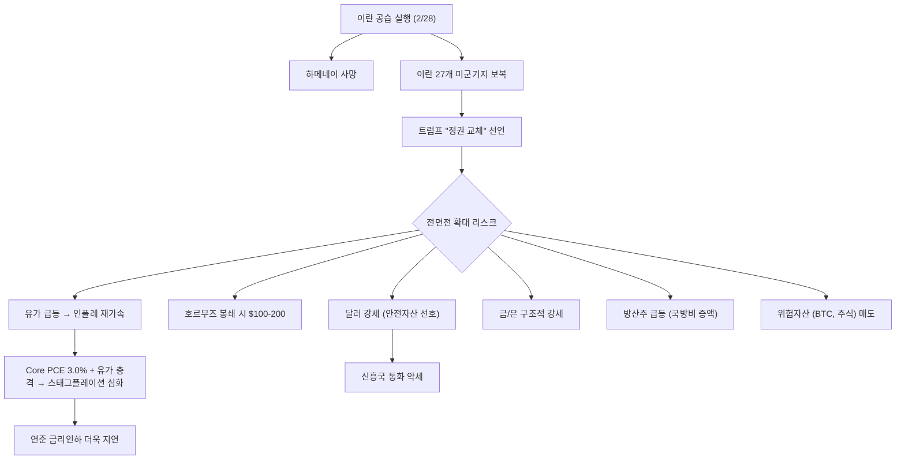
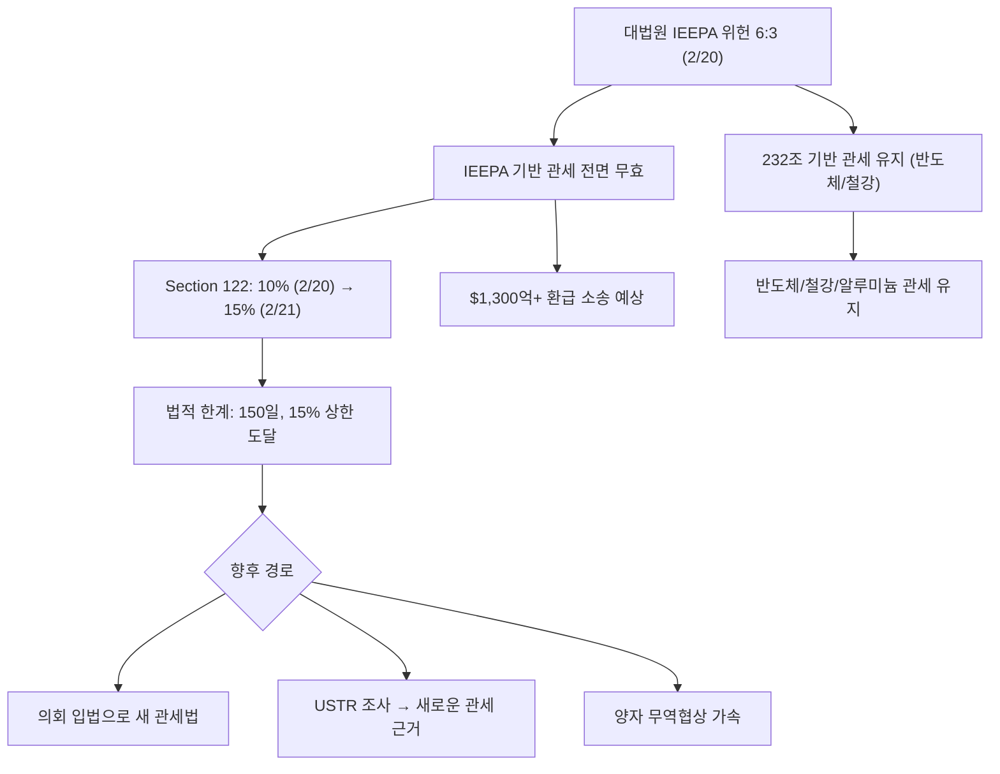

> **관련 글**: [2026년 투자 섹터 전망 (전체)](/knowledge/invest/2026/01/20/investment-sectors-outlook-2026.html)

2026년 3월 1일(토) 기준 업데이트입니다. 이번 주 최대 이벤트는 **2/28 미국-이스라엘의 이란 공습 실행**입니다. 하메네이 최고지도자가 사망하고, 이란은 **27개 미군기지에 보복 공격**을 감행했으며, 트럼프 대통령은 **"정권 교체"를 선언**했습니다. 시장은 위험자산 대거 매도, 안전자산 급등으로 반응했습니다. **금은 $5,246에서 $5,464로 급반등**, **유가는 WTI $67, Brent $72로 급등**, **비트코인은 $63,401로 추락**(Fear & Greed 14)했습니다. 한편 **KOSPI는 6,307로 사상최고를 경신**(2/26)했으며, 삼성전자 주가는 작년 초 대비 4배, SK하이닉스는 6배 상승했습니다. 이란 상황으로 인해 **스태그플레이션 우려가 더욱 심화**되고 있습니다.

## 시장 현황 (2026년 3월 1일 기준)

### 글로벌 증시

| 지수 | 수준 | 변동 |
|------|------|------|
| S&P 500 | **~6,870** | -0.43% (이란 공습 충격) |
| Nasdaq | **~22,690** | -0.92% (위험자산 매도) |
| Dow Jones | **~49,080** | -1.05% (방산 제외 전면 하락) |
| KOSPI | **6,307** (2/26) → **6,244** (2/27) | 사상최고 후 이란 리스크 반영 예상 |
| Nikkei 225 | **58,000+** | 사상최고 ('다카이치 트레이드') |

### 핵심 매크로 지표

| 항목 | 현황 | 방향 |
|------|------|------|
| 미국 Q4 GDP | **1.4%** (2/20 발표) | **예상 2.3% 대폭 하회**, Q3 4.4%에서 급락 |
| Core PCE | **3.0%** | **2025년 4월 이후 최고**, 예상 2.9% 상회 |
| 미국 CPI | **2.4%** | 2025년 5월 이후 최저 |
| Core CPI | **2.5%** | 2021년 4월 이후 최저 |
| 미국 기준금리 | **3.50~3.75%** | FOMC 동결, 유가 급등으로 인하 더욱 어려워짐 |
| **★ 연준 의장** | **Powell 5/15 퇴임 확정** | 신임 의장 불확실성 부상 |
| 원/달러 환율 | **~1,445원** | 달러 강세 압력 vs WGBI 4월 편입 |
| **★ 금(Gold)** | **~$5,464/oz** | **이란 공습 촉매 → $5,246에서 급반등**, $6,000 목표 재부상 |
| **★ 은(Silver)** | **급등** | 동반 급등 (구조적 공급적자 + 지정학 프리미엄) |
| **★ 비트코인** | **~$63,401** | **-6% 일간 추락 (2/28)**, Fear & Greed 14 (극도의 공포) |
| **★ 유가(브렌트)** | **$72.48** | **+2.45%, 호르무즈 봉쇄 시 $100-200** |
| **★ 유가(WTI)** | **$67.02** | **+2.78%, 주말 후 추가 $10-20 급등 예상** |
| 한은 기준금리 | **2.50%** | 5회 연속 동결 |

### 지정학 리스크

| 항목 | 현황 | 긴급도 |
|------|------|--------|
| **★★★ 이란-미국** | **2/28 공습 실행, 하메네이 사망, 이란 27개 미군기지 보복, 트럼프 "정권 교체" 선언** | **최고 (전면전 리스크)** |
| 러시아-우크라이나 | 평화 협상 결렬 | 높음 |

---

## ★★★ 이란 공습 실행 + 전면전 리스크 (2/28)

### 사건 전개

| 시점 | 사건 |
|------|------|
| **2/28** | **미국-이스라엘 이란 공습 실행** |
| **2/28** | **하메네이 최고지도자 사망** |
| **2/28** | **이란 보복: 27개 미군기지 공격** |
| **2/28** | **트럼프 "정권 교체" 선언** |

### 상황 변화 (2/27 → 2/28)

| 항목 | 이전 (2/27) | 현재 (2/28~) |
|------|------------|------------|
| **상황** | 협상 진전, 외무장관 "2~3일 합의 초안" | **공습 실행, 전면전 전개** |
| **하메네이** | 생존 | **사망** |
| **이란 대응** | 억제적 | **27개 미군기지 보복 공격** |
| **트럼프 입장** | 협상 병행 | **"정권 교체" 선언** |
| **시장 반응** | 안전자산 프리미엄 해소 | **위험자산 대거 매도, 안전자산 급등** |

### 시장 영향 (2/28)

| 자산 | 변동 | 의미 |
|------|------|------|
| S&P 500 | **-0.43%** | 위험자산 매도 |
| Dow Jones | **-1.05%** | 경기민감주 타격 |
| Nasdaq | **-0.92%** | 성장주 매도 |
| 금(Gold) | **$5,246 → $5,464 급등** | 안전자산 수요 폭증 |
| WTI | **$67.02 (+2.78%)** | 공급 차질 우려 |
| Brent | **$72.48 (+2.45%)** | 호르무즈 봉쇄 리스크 |
| 비트코인 | **$63,401 (-6%)** | 위험자산 회피 |

### 이란 상황의 거시경제 파급 효과


```mermaid
graph TD
    A["이란 공습 실행 (2/28)"] --> B["하메네이 사망"]
    A --> C["이란 27개 미군기지 보복"]
    C --> D["트럼프 #quot;정권 교체#quot; 선언"]
    D --> E{"전면전 확대 리스크"}
    E --> F["유가 급등 → 인플레 재가속"]
    E --> G["호르무즈 봉쇄 시 $100-200"]
    F --> H["Core PCE 3.0% + 유가 충격 → 스태그플레이션 심화"]
    H --> I["연준 금리인하 더욱 지연"]
    E --> J["달러 강세 (안전자산 선호)"]
    J --> K["신흥국 통화 약세"]
    E --> L["금/은 구조적 강세"]
    E --> M["방산주 급등 (국방비 증액)"]
    E --> N["위험자산 (BTC, 주식) 매도"]
```

### 시나리오별 영향

| 시나리오 | 확률 | 유가 | 금 | 증시 |
|---------|------|------|-----|------|
| **전면전 확대 (호르무즈 봉쇄)** | **상승** | **$100-200 급등** | **$6,000+ 돌파** | **급락 (-5~10%)** |
| **전면전 지속 (현 수준)** | 높음 | **$80-90** | **$5,500-6,000** | **하락 지속** |
| **외교적 수습** | 낮음 | $65-70 복귀 | $5,000-5,200 | 반등 |

> **투자 시사점**: 이란 상황은 "협상 진전"에서 **"전면전 리스크"**로 완전히 전환되었습니다. 하메네이 사망 후 이란의 보복(27개 미군기지 공격)과 트럼프의 "정권 교체" 선언은 **단기적 해결이 매우 어려운 상황**을 시사합니다. 호르무즈 해협 봉쇄 시 유가 $100-200까지 급등 가능하며, 이는 **글로벌 스태그플레이션을 촉발**할 수 있습니다. **주말 이후 시장 개장 시 추가 급변동이 예상**됩니다.

---

## ★ 금 $5,464 급반등: 이란 공습 촉매로 $6,000 목표 재부상

### 금 가격 현황

| 항목 | 내용 |
|------|------|
| 현재 가격 | **$5,464/oz** (2/28) |
| 직전 저점 | **$5,246** (조정 저점) |
| 역대 고점 | **$5,595** (2026년 1월 29일) |
| **2/28 급등** | **$5,246 → $5,464 (+$218, +4.2%)** |
| UBS 전망 | **$6,200** |
| JPMorgan/Deutsche Bank | **$6,000** |
| Goldman Sachs 전망 | **$5,400** (이미 돌파) |

### 금 가격 흐름

| 시점 | 가격 | 이벤트 |
|------|------|--------|
| 1/29 | **$5,595** | 사상최고 (이란 공습 우려) |
| 2/22~24 | **$5,072** | 이란 협상 진전 → 2일간 $1,200 폭락 |
| 2/25~27 | **$5,246** | 안정화, 저점 형성 |
| **2/28** | **$5,464** | **이란 공습 실행 → 급반등** |

### 금 급반등 촉매

| 요인 | 설명 |
|------|------|
| **★ 이란 전면전** | 공습 실행 + 보복 → 안전자산 수요 폭증 |
| **스태그플레이션 심화** | GDP 1.4% + Core PCE 3.0% + 유가 충격 |
| **중앙은행 매입 지속** | 글로벌 중앙은행의 달러 대안 자산 매입 |
| **금리인하 지연** | 유가 급등 → 인플레 기대 상승 → 금 강세 |
| **$6,000 목표 재부상** | UBS $6,200, JPM/DB $6,000 유지 |

> **투자 시사점**: 금은 이란 협상 진전으로 $5,072까지 조정받았으나, **2/28 공습 실행을 촉매로 $5,464까지 급반등**했습니다. 기존 조정은 **지정학 프리미엄 해소에 따른 일시적 현상**이었으며, 전면전 전개로 **$6,000 목표가 현실적**으로 다가왔습니다. UBS $6,200, JPM/DB $6,000 전망이 유효하며, 호르무즈 봉쇄 시 추가 급등 가능합니다.

---

## ★ 은(Silver) 급반등: 구조적 공급적자 + 지정학 프리미엄

### 은 가격 현황

| 항목 | 내용 |
|------|------|
| 현재 | **급등** (이란 공습 동반 상승) |
| 고점 | **$100+ 돌파** (2월 중순) |
| 조정 저점 | **~$78/oz** (이란 협상 진전 시) |
| **공급 상황** | **6년 연속 공급적자**, **COMEX 재고 -75%** |

### 은 급반등 배경

| 요인 | 설명 |
|------|------|
| **이란 전면전 → 안전자산 수요** | 금 동반 급등에 연동 |
| **6년 연속 공급적자** | 구조적 수급 불균형 심화 |
| **COMEX 재고 -75%** | 물리적 인도 가능 재고 고갈 수준 |
| **AI 산업수요 확대** | 태양광 패널, 전자기기, AI 서버 냉각 시스템 등 |
| **금 대비 저평가** | 금/은 비율 여전히 역사적 고평가 영역 |

> **투자 시사점**: 은은 이란 협상 진전으로 $100→$78(-22%)까지 조정받았으나, **이란 공습 실행으로 강력 반등**했습니다. **6년 연속 공급적자 + COMEX 재고 -75%**라는 구조적 요인에 **지정학 프리미엄**이 더해져, 중장기 상승 추세가 더욱 강화되었습니다.

---

## ★ 유가 급등: 호르무즈 봉쇄 시 $100-200 가능

### 유가 현황

| 항목 | 수치 | 변동 |
|------|------|------|
| **WTI** | **$67.02** | **+2.78%** |
| **Brent** | **$72.48** | **+2.45%** |
| 이란 공습 전 | WTI ~$65, Brent ~$70 | |

### 유가 시나리오

| 시나리오 | 유가 범위 | 확률 |
|---------|----------|------|
| **호르무즈 해협 봉쇄** | **$100-200** | 상승 중 |
| **전면전 지속 (봉쇄 없음)** | **$80-90** | 높음 |
| **주말 후 추가 급등** | **현재 대비 +$10-20** | 높음 |
| **외교적 수습** | $60-65 복귀 | 낮음 |

### 유가 급등의 거시경제 영향

| 영향 | 설명 |
|------|------|
| **인플레이션 재가속** | Core PCE 3.0%에서 유가 충격 추가 → 스태그플레이션 심화 |
| **금리인하 불가** | 유가 급등 → 인플레 기대 상승 → 연준 금리인하 지연/불가 |
| **소비자 부담 증가** | 휘발유 가격 상승 → 소비 위축 → GDP 추가 하락 |
| **수출주 타격** | 원자재 비용 상승 → 기업 마진 압박 |
| **에너지 수입국 타격** | 한국, 일본, 유럽 등 에너지 적자 확대 |

> **투자 시사점**: 유가가 이란 공습으로 급등했으며, **호르무즈 해협 봉쇄 시 $100-200까지 상승 가능**합니다. 주말 동안 상황이 악화될 경우 **월요일 추가 $10-20 급등이 예상**됩니다. 유가 급등은 **스태그플레이션을 촉발하는 핵심 변수**로, 에너지 관련 포지션(유가 ETF, 에너지주) 확대와 에너지 수입 의존도 높은 섹터 비중 축소가 필요합니다.

---

## ★ 비트코인 $63,401: 전쟁 리스크로 추가 추락

### 비트코인 현황

| 항목 | 내용 |
|------|------|
| 현재 가격 | **~$63,401** (2/28 기준) |
| **2/28 하락** | **-6% 일간** (이란 공습 충격) |
| 고점 대비 | **-50%+** |
| 연초 대비 | **-30%+** (사상 최악의 연초 기록 경신) |
| **Fear & Greed** | **14 (극도의 공포)** |
| **ETF 자금 흐름** | 유출 지속 |

### 비트코인 하락 요인

| 요인 | 설명 |
|------|------|
| **★ 전쟁 리스크 → 위험자산 회피** | 이란 전면전 → 비트코인 = 위험자산으로 매도 |
| **ETF 유출 지속** | 기관 투자자 이탈 지속 |
| **극도의 공포** | Fear & Greed 14 — 투매 심리 |
| **안전자산 대체 실패** | "디지털 금" 내러티브 약화, 실제 전쟁 시 금으로 자금 이동 |

> **투자 시사점**: 비트코인은 이란 공습으로 **$63,401까지 추가 추락**(-6% 일간)했습니다. Fear & Greed 14는 **극도의 공포** 구간이며, ETF 유출 지속으로 기관 이탈이 확인됩니다. 전쟁 상황에서 비트코인은 "디지털 금"이 아닌 **위험자산으로 거래**되고 있어, **전면전 종료 신호 전까지 추가 하락 리스크**가 있습니다. 다만 역사적으로 Extreme Fear 구간은 장기 매수 기회였으므로, 장기 관점에서의 분할 매수 검토는 가능합니다.

---

## ★ KOSPI 6,307 사상최고 (2/26) → 이란 리스크 주시

### 한국 증시

| 지표 | 수준 | 비고 |
|------|------|------|
| KOSPI | **6,307** (2/26 사상최고) → **6,244** (2/27) | 이란 공습 전 기록 |
| 삼성전자 | **작년 초 대비 4배** | HBM4 + AI 수요 |
| SK하이닉스 | **작년 초 대비 6배** | HBM 독점적 지위 |
| 개인 예수금 | **111조원** | 역대 최고 수준 |
| 한국 2026 GDP | **1.8%** | 수출 강세 반영 |

### KOSPI 상승 동력

| 요인 | 설명 |
|------|------|
| **IEEPA 위헌 수혜** | 한국 관세 부담 경감 기대 → 수출주 반등 |
| **반도체 초강세** | 삼성 4배, 하이닉스 6배 — HBM4 출하, AI 수요 폭발 |
| **WGBI 편입 재확인** | 4월 편입 → $560-700억 유입 대기 |
| **밸류업 정책** | 자사주 소각, 배당 확대 지속 |
| **부동산→주식 자금 이동** | 예수금 111조원 |

### 이란 공습 후 KOSPI 전망

| 시나리오 | KOSPI 영향 |
|---------|-----------|
| **전면전 확대** | **하방 리스크**: 유가 급등 → 무역수지 악화, 위험자산 회피 |
| **방산주** | **급등 예상**: 실제 전쟁 → 국방비 증액 → 한국 방산 수출 기대 |
| **반도체** | **혼조**: AI 수요 유지 but 위험자산 회피 압력 |
| **에너지 수입** | **부정적**: 유가 급등 → 에너지 수입비 증가 → 기업 마진 압박 |

> **투자 시사점**: KOSPI는 6,307으로 사상최고를 기록했으나, **이란 공습으로 주말 후 하방 리스크**가 있습니다. 다만 **방산주는 급등이 예상**되며, 삼성전자(4배)·SK하이닉스(6배)의 반도체 강세가 KOSPI를 지지할 것입니다. 유가 급등에 따른 **에너지 수입 부담 증가는 원화 약세 압력**으로 작용할 수 있습니다.

---

## ★ Section 122 관세 15% 인상 + USTR 조사 착수 예고

### Section 122 관세 인상 (2/21)

IEEPA 위헌 판결(2/20) 직후 10%로 발동했던 Section 122 보편관세가 **이틀 만에 15%로 인상**되었습니다.

| 항목 | 내용 |
|------|------|
| 인상 일자 | **2월 21일 (금)** |
| 발효 일자 | **2월 24일 (월)** |
| 세율 변경 | **10% → 15%** (법적 상한 도달) |
| 법적 제한 | **최대 150일, 최대 15%** — 법적 상한에 도달, 추가 인상 불가 |
| Section 232 관세 | **반도체·철강 관세 별도 유지** (Section 122와 무관) |

### 관세 체제 현황 종합

| 구분 | 근거법 | 세율 | 상태 |
|------|--------|------|------|
| 보편관세 | **Section 122** | **15%** (2/24 발효) | **150일 한시, 상한 도달** |
| 반도체 관세 | **Section 232** | 별도 | **유지** |
| 철강/알루미늄 | **Section 232** | 별도 | **유지** |
| IEEPA 기반 관세 | IEEPA | - | **위헌 무효** |

### 관세 경로 전망


```mermaid
graph TD
    A["대법원 IEEPA 위헌 6:3 (2/20)"] --> B["IEEPA 기반 관세 전면 무효"]
    A --> C["232조 기반 관세 유지 (반도체/철강)"]
    B --> D["Section 122: 10% (2/20) → 15% (2/21)"]
    D --> E["법적 한계: 150일, 15% 상한 도달"]
    E --> F{"향후 경로"}
    F --> G["의회 입법으로 새 관세법"]
    F --> H["USTR 조사 → 새로운 관세 근거"]
    F --> I["양자 무역협상 가속"]
    C --> J["반도체/철강/알루미늄 관세 유지"]
    B --> K["$1,300억+ 환급 소송 예상"]
```

> **투자 시사점**: Section 122가 **법적 상한 15%에 도달**했고, USTR 조사 착수로 150일 만료 이후를 대비한 **새로운 관세 근거 마련**을 시도 중입니다. 이란 전면전과 맞물려 **관세 + 유가 이중 부담**이 수출 기업에 작용할 수 있습니다.

---

## ★ WGBI 4월 편입 재확인: $560-700억 외국인 자금 유입

### WGBI 편입 확정 상세

| 항목 | 내용 |
|------|------|
| 발표 | **FTSE Russell 재확인** |
| 편입 시작 | **2026년 4월** |
| 비중 | **2.05%** (9위 규모) |
| 편입 방식 | 8개월 x 8회 균등 분할 (4~11월) |
| **예상 유입 규모** | **$560-700억** (약 80-100조원) |
| 효과 | 외국인 채권 매수 → 원화 수요 → **환율 안정 핵심** |

> **투자 시사점**: 이란 전면전으로 원화 약세 압력이 가해지고 있으나, **WGBI 4월 편입($560-700억 유입)**이 환율 안정의 핵심 지지 요인으로 작용할 것입니다.

---

## Q4 GDP 1.4% + Core PCE 3.0% + 유가 충격: 스태그플레이션 심화

### 스태그플레이션 신호 (유가 충격 반영)

| 지표 | 신호 | 의미 |
|------|------|------|
| GDP **1.4%** (급락) | 성장 둔화 | 경기 약화 |
| Core PCE **3.0%** (재가속) | 인플레 재상승 | 물가 불안 |
| **★ 유가 급등** | **인플레 추가 가속** | **유가→CPI 파급 → 스태그플레이션 심화** |
| 수출 **-0.9%** | 교역 둔화 | 관세 부작용 가시화 |
| **조합** | **성장 둔화 + 인플레 재가속 + 유가 충격** | **스태그플레이션 본격화 우려** |

### 연준 금리 전망: 유가 급등으로 인하 더욱 어려워짐

| 시점 | 전망 | 근거 |
|------|------|------|
| 2월 초 | 6월 인하 재개 기대 | CPI 2.4%, Core CPI 2.5% (4년 최저) |
| 2/20 이후 | 인하 기대 후퇴 | Core PCE 3.0% (인플레 재가속) |
| **2/28 이후** | **인하 기대 더욱 후퇴** | **유가 급등 → 인플레 기대 상승 → 인하 불가 환경** |
| **★ Powell 퇴임** | **5월 15일 퇴임 확정** | 신임 의장 인선 불확실성 |

> **투자 시사점**: GDP 1.4% + Core PCE 3.0%에 **유가 급등까지 추가**되면서 **스태그플레이션 우려가 본격화**되고 있습니다. 연준의 금리인하는 **더욱 어려워졌으며**, 호르무즈 봉쇄 시 유가 $100+ → CPI 급등 시나리오는 **1970년대 오일쇼크 재현** 우려를 낳고 있습니다. **인플레 헤지 자산(금, 원자재, 에너지)의 비중 확대**가 필요합니다.

---

## 환율 동향: USD/KRW 1,445원 + 달러 강세 압력

### 원/달러 1,445원

| 항목 | 수치/내용 |
|------|----------|
| 원/달러 환율 | **1,445원** |
| 한은 기준금리 | **2.50%** (5회 연속 동결) |
| 한국 2026 GDP 전망 | **1.8%** (수출 강세로 상향) |
| WGBI 편입 | **4월 시작** — $560-700억 유입 예상 |

### 환율 변동 요인

| 요인 | 방향 | 설명 |
|------|------|------|
| **이란 전면전** | **원화 약세** | 안전자산 선호 → 달러 강세 → 원화 약세 |
| **유가 급등** | **원화 약세** | 에너지 수입비 증가 → 무역수지 악화 |
| **WGBI 4월 편입** | **원화 강세** | $560-700억 유입 → 원화 수요 최대 촉매 |
| **KOSPI 사상최고** | **원화 강세** | 외국인 자금 유입 |

---

## 주요 구조적 테마

### 1. 다카이치 총선 압승 + 닛케이 58,000 ('다카이치 트레이드')

다카이치 총리의 압승(자민당 316석, 연립 352석)으로 아베노믹스 2.0이 본격화되고 있습니다. 식료품 소비세 면제, 재정 확장, 금리 인상 억제가 핵심이며, **엔캐리 트레이드 재개**로 글로벌 유동성을 공급하고 있습니다.

### 2. 삼성전자 HBM4 출하 + 주가 4배

삼성전자의 HBM4 출하 개시(2/12)와 함께 주가가 작년 초 대비 **4배** 상승했습니다. SK하이닉스는 **6배** 상승하여 한국 반도체 산업의 글로벌 경쟁력이 재확인되었습니다.

### 3. 한국 밸류업: 1980년대 일본 비유

| 항목 | 1980년대 일본 | 2026년 한국 |
|------|---------------|-------------|
| 미국 대통령 | 레이건 (보호무역) | 트럼프 (관세→양자협상) |
| 역할 | 미국의 핵심 제조업 파트너 | 미국의 대중국 제조업 파트너 |
| 밸류에이션 | 저평가→급격한 재평가 | 코리아 디스카운트→밸류업 |
| 핵심 산업 | 자동차, 전자 | 반도체(HBM4), AI, 배터리 |

### 4. 강세장 섹터 순환: 아직 미완성

| 순서 | 유형 | 상태 |
|------|------|------|
| 1 | 선도 섹터 (반도체, AI) | 이미 상승 |
| 2 | 대형 가치주 (금융, 통신) | 진행 중 |
| 3 | **국민주 (네이버, 카카오)** | **미개시** |
| 4 | **경기순환주 (화학, 철강, 건설)** | **미개시** |
| 5 | 소형주·테마주 | 마지막 단계 |

---

## 투자 전략

### 현 국면 진단: "이란 전면전 + 유가 급등 + 스태그플레이션 심화"

글로벌 시장은 **이란 공습 실행(2/28)**으로 **전시 체제**에 진입했습니다. 하메네이 사망, 27개 미군기지 보복 공격, 트럼프 "정권 교체" 선언으로 **단기 해결 가능성이 낮아졌습니다**. 금은 $5,464로 급반등하고, 유가는 $72까지 상승했으며, 비트코인은 $63,401로 추락했습니다. **스태그플레이션 우려가 본격화**되는 가운데, **KOSPI 6,307 사상최고**, **WGBI 4월 편입($560-700억)** 등 한국 시장의 구조적 강세 요인은 유지되고 있습니다.

### 단기 전략 (3월): "전시 포트폴리오" 관점

| 우선순위 | 전략 | 근거 |
|---------|------|------|
| 1 | **★ 귀금속 비중 확대** | 금 $5,464 급반등, $6,000 목표 재부상 — 전면전 + 스태그플레이션 최적 자산 |
| 2 | **★ 방산주 매수** | 실제 전쟁 발발 → 국방비 증액 → 한국 방산 수출 기대 |
| 3 | **★ 에너지 포지션 확대** | 유가 $72 → 호르무즈 봉쇄 시 $100-200, 에너지주/유가 ETF |
| 4 | **위험자산 비중 축소** | 비트코인, 고성장주 — 전쟁 리스크 → 위험자산 회피 |
| 5 | **현금 비중 확대** | 주말 후 추가 급변동 대비 |

### 중기 전략 (4~6월)

| 우선순위 | 전략 | 근거 |
|---------|------|------|
| 1 | **WGBI 편입 수혜 포지션** | 4월 편입 재확인 ($560-700억) — 환율 안정 + 외국인 매수 |
| 2 | **스태그플레이션 헤지 강화** | 유가 충격 + Core PCE 3.0% → 금/원자재/에너지 비중 유지 |
| 3 | **관세 체제 재편 모니터링** | Section 122 150일 만료 시점(~7월), USTR 조사 결과 |
| 4 | **밸류업 수혜주** | 자사주 소각, 고배당 기업 |

### 장기 전략 (연간)

| 우선순위 | 전략 | 근거 |
|---------|------|------|
| 1 | **장기 보유 원칙** | 코스피 75.6% 상승에도 42% 손실 — 단기 매매의 함정 |
| 2 | **밸류업 구조적 수혜주** | 1980년대 일본 비유 — 한국 밸류에이션 재평가 |
| 3 | **엔캐리 유동성 수혜** | 다카이치 아베노믹스 2.0 → 글로벌 유동성 공급 |

### 포트폴리오 배분 제안 (전시 포트폴리오 반영)

```
귀금속·원자재·에너지: 25% (↑ 기존 18%)
├── 금 ETF/실물: 12% (↑ 이란 촉매 급반등, $6,000 목표)
├── 은 ETF/실물: 5% (COMEX 재고 -75%, 구조적 공급적자)
└── 에너지 (유가 ETF/에너지주): 8% (↑ 호르무즈 봉쇄 리스크)

방산: 8% (★ 신규)
├── 한국 방산주 (한화에어로, LIG넥스원 등): 5%
└── 글로벌 방산 ETF: 3%

금리 인하 수혜: 8% (↓ 기존 12%, 인하 더욱 지연)
├── 장기채 ETF: 3%
├── 리츠(REITs): 2%
└── 바이오/성장주: 3%

섹터 순환·수출주: 18% (↓ 기존 22%, 유가 부담)
├── 관세 과매도 수출주: 6%
├── 국민주 (네이버, 카카오): 5%
├── 경기순환주 (화학, 철강, 건설): 4%
└── 코스닥 저평가주: 3%

밸류업·배당: 15% (↓ 기존 18%)
├── 고배당 ETF (커버드콜 포함): 7%
├── 자사주 소각 기업: 4%
└── 배당성장주: 4%

반도체·AI: 10% (↓ 기존 12%)
├── 삼성전자/SK하이닉스: 7%
└── HBM 후공정 장비·소재: 3%

현금/단기채: 16% (↓ 기존 18%, but 방산 신규로 실질 유사)
├── 현금: 10%
└── 단기국채 ETF: 6%
```

## 월별 체크포인트

| 월 | 이벤트 | 투자 시사점 |
|----|--------|------------|
| **2/28** | **★★★ 미국-이스라엘 이란 공습 실행** | 전면전 리스크 급상승, 안전자산 급등 |
| **2/28** | **하메네이 사망, 이란 27개 미군기지 보복** | 전쟁 확대 위험, 호르무즈 봉쇄 리스크 |
| **3/1~** | **주말 후 시장 개장 시 추가 급변동** | 유가 +$10-20, 위험자산 추가 하락 예상 |
| 3월 | 연준 FOMC | Core PCE 3.0% + 유가 급등 반영한 스탠스 확인 |
| 3월 | USTR 교역국 조사 착수 | 한국 포함 여부, 관세 근거 변화 |
| 3월~ | **이란 전면전 전개 모니터링** | 호르무즈 봉쇄 여부 = 유가 $100+ 분기점 |
| **4월** | **WGBI 인덱스 편입 시작** | $560-700억 유입 + 환율 안정 최대 촉매 |
| 5월 | STO 제도 구체화 + Powell 퇴임 (5/15) | 코스닥 자금 유입 + 연준 리더십 전환 |
| 6월 | 거래시간 연장 + 지방선거 | 유동성 확대 / 부동산 규제 강화 |
| **~7월** | **Section 122 150일 만료** | 관세 재편 핵심 분기점 |
| 4~11월 | WGBI 8회 분할 편입 진행 | 매달 균등 편입 → 지속적 외국인 매수 |

## 리스크 요인 정리

| 리스크 | 심각도 | 확률 | 대응 |
|--------|--------|------|------|
| **★★★ 이란 전면전 확대** | **최고** | **높음** | 귀금속·방산 비중 확대, 위험자산 축소 |
| **★★ 호르무즈 해협 봉쇄** | **최고** | **상승 중** | 에너지 포지션 확대, 유가 $100+ 대비 |
| **★★ 스태그플레이션 본격화** | **최고** | **높음** | 금/원자재/에너지 비중 유지, 금리인하 수혜 축소 |
| **관세 15% + USTR 조사** | **높음** | **높음** | 수출주 영향 재점검, 유가 부담 이중 타격 |
| **비트코인 추가 하락** | **높음** | **높음** | Fear 14 극공포, 전쟁 종료 전 추가 하방 리스크 |
| **$1,300억 환급 소송** | **중간** | **높음** | 재정 부담 → 국채 금리 상승 가능 |
| 원화 약세 압력 | 중간 | 높음 | 달러 강세 vs WGBI 편입 상쇄 |
| 러-우 협상 결렬 | 높음 | 높음 | 유럽 노출 점검, 에너지 헤지 |
| 부동산 경착륙 | 중간 | 중간 | 6월 이후 규제 강화 → 자금 이탈 가속 |

## 정리

| 항목 | 내용 |
|------|------|
| **★★★ 이란 공습** | **2/28 공습 실행, 하메네이 사망, 이란 27개 미군기지 보복, 트럼프 "정권 교체" 선언** |
| **★ 금(Gold)** | **$5,246 → $5,464 급반등 (이란 촉매), UBS $6,200·JPM/DB $6,000 목표** |
| **★ 은(Silver)** | **동반 급등 (구조적 공급적자 + 지정학 프리미엄), COMEX 재고 -75%** |
| **★ 유가** | **WTI $67.02 (+2.78%), Brent $72.48 (+2.45%), 호르무즈 봉쇄 시 $100-200** |
| **★ 비트코인** | **$63,401 (-6% 일간), Fear & Greed 14, ETF 유출 지속** |
| **KOSPI** | **6,307 사상최고 (2/26), 삼성 4배·하이닉스 6배, 이란 리스크 주시** |
| **Section 122 관세** | **15% 발효 (2/24), 150일 한시, 법적 상한 도달** |
| **WGBI** | **4월 편입 재확인 (FTSE Russell), $560-700억 유입 예상** |
| 원/달러 | **1,445원** (달러 강세 압력 vs WGBI 편입) |
| 연준 금리 | **3.50-3.75% 동결**, 유가 급등으로 인하 더욱 어려워짐 |
| 스태그플레이션 | **GDP 1.4% + Core PCE 3.0% + 유가 충격 → 본격화 우려** |

**핵심 투자 원칙:**
1. **이란 전면전 = 패러다임 전환** — "협상 진전"에서 "전시 체제"로 전환, 포트폴리오 전면 재조정 필요
2. **금·은 = 최적 자산** — 스태그플레이션 + 전쟁 + 달러 불확실성 → 귀금속 구조적 강세, $6,000 목표
3. **방산주 신규 편입** — 실제 전쟁 발발 → 국방비 증액 → 글로벌/한국 방산 수혜
4. **유가 급등 = 스태그플레이션 촉매** — 호르무즈 봉쇄 시 1970년대 오일쇼크 재현 우려
5. **비트코인은 위험자산** — 전쟁 시 "디지털 금"이 아닌 위험자산으로 거래, 추가 하락 리스크
6. **WGBI 4월 편입 = 한국 시장 최대 구조적 호재** — $560-700억 유입, 이란 리스크 상쇄 기대
7. **장기 보유가 수익률의 핵심** — 전쟁 공포에도 장기 관점 유지, 패닉셀 자제

**투자 결정은 본인의 리스크 허용 범위와 투자 기간을 고려하여 신중하게 내리시기 바랍니다.**
