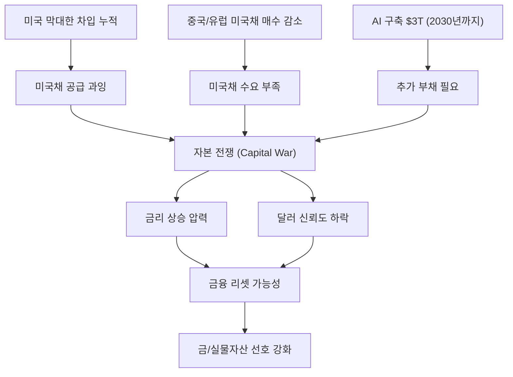
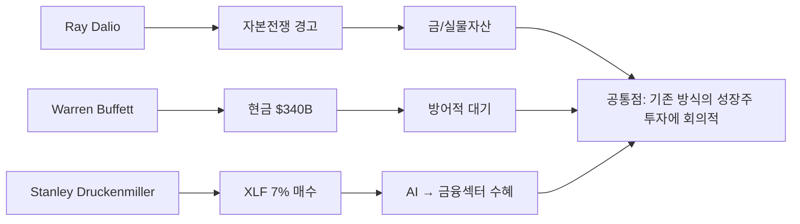
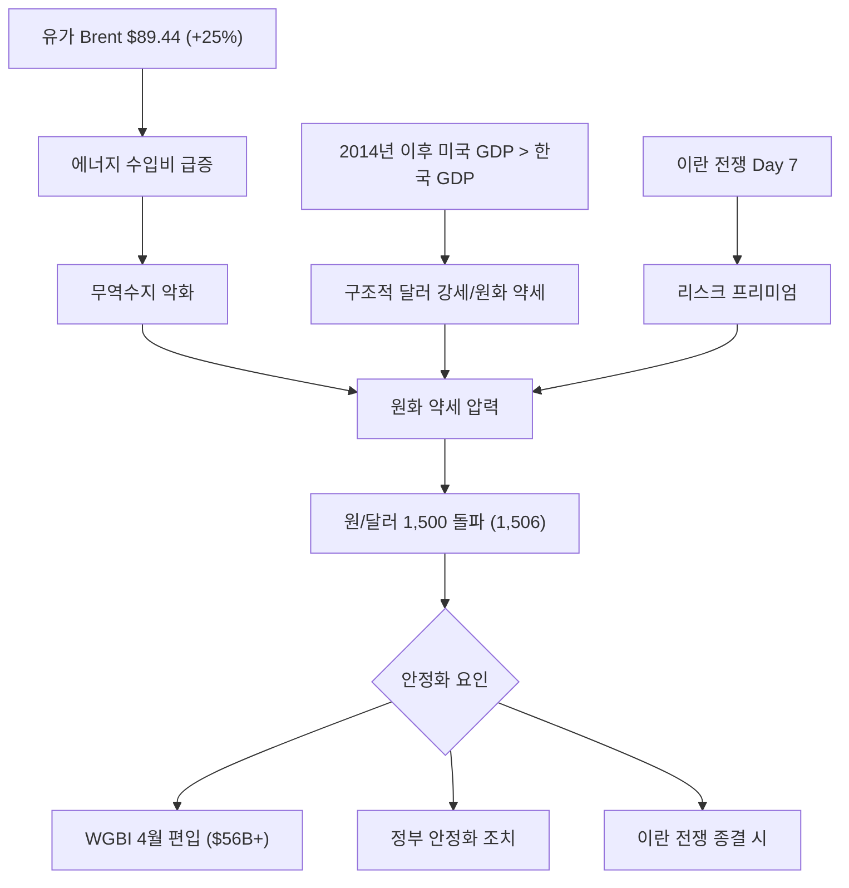
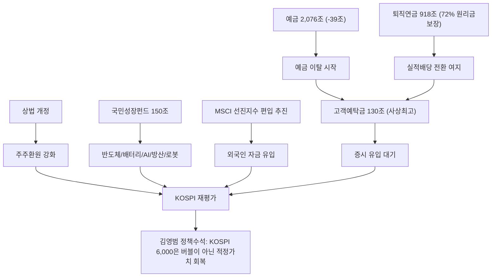
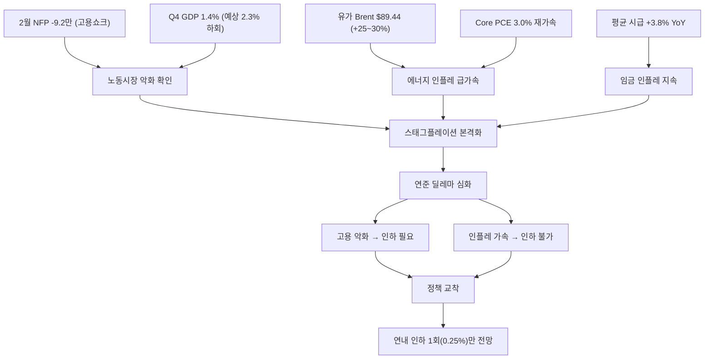
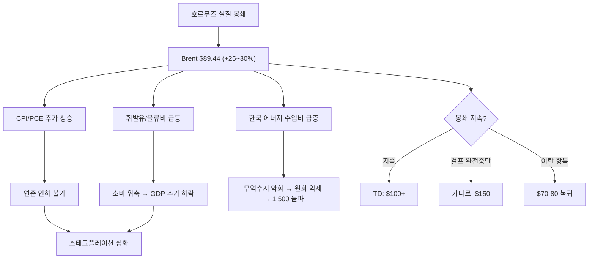
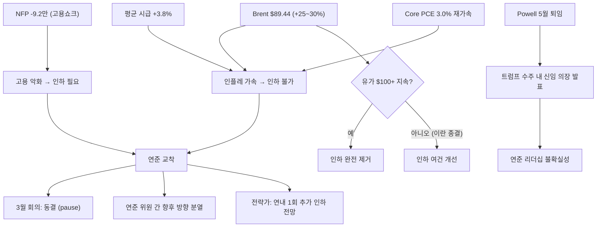
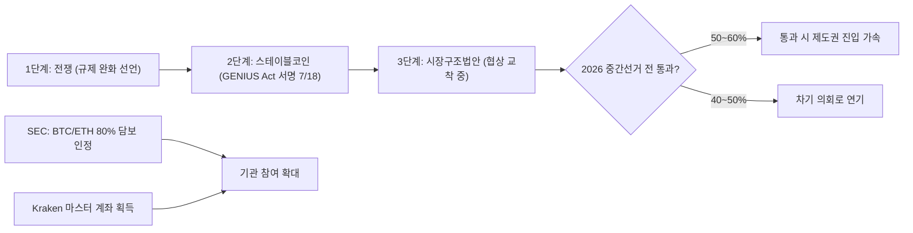
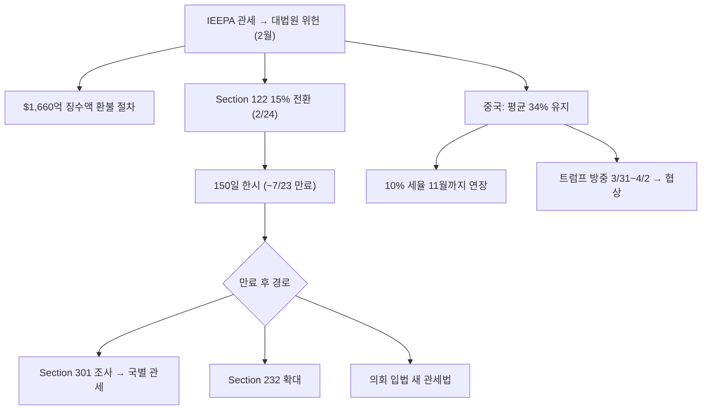

> **관련 글**: [2026년 투자 섹터 전망 (전체)](/knowledge/invest/2026/01/20/investment-sectors-outlook-2026.html)

2026년 3월 8일(토) 기준 업데이트입니다. **원/달러 환율이 17년 만에 1,500원을 돌파(1,506원)**했습니다. 1998년 IMF, 2008년 리먼 이후 세 번째입니다. 원화는 주요 통화 대비 가장 약세(-3.1% vs 엔 -0.9%, 유로 -1.2%)이며, 2014년 이후 미국 GDP 성장률이 한국을 지속 상회하는 **구조적 환율 압력**이 확인되고 있습니다.

**주요 투자 대가들의 포지션이 주목**됩니다. **Ray Dalio**는 "자본 전쟁" — 미국이 막대한 차입을 했으나 중국·유럽이 미국채 매수를 줄이고 있고, AI 구축에 2030년까지 $3T가 필요한데 이를 뒷받침할 부채 수요가 부족해질 수 있다고 경고합니다. **Warren Buffett**은 현금 보유액 $340B 이상으로 방어적 자세. Greg Abel CEO의 첫 주주서한에서 자사주 매입 재개를 발표, 핵심 4종목(Apple, Amex, Coca-Cola, Moody's)이 포트폴리오의 56%이며 배당수익률 환산 14.6%입니다. **Stanley Druckenmiller**는 State Street Financial Sector SPDR ETF(XLF)를 포트폴리오의 7%까지 매수 — 대형은행·보험사가 AI 자동화 수혜를 가장 먼저 받을 것으로 보고, AI 기반 수익 개선을 2~3년 내 예상합니다.

**한국 자산시장 대전환** 신호가 포착됩니다. 이재명 대통령이 분당 아파트를 매각하고 ETF 매수를 선언, 상법 개정(배당소득 분리과세, 자사주 의무소각, 이사 책임 강화), MSCI 선진지수 편입 추진(외환시장 개방), 국민성장펀드 150조(반도체·배터리·AI·방산·로봇) 조성이 진행 중입니다. 고객예탁금 130조 원 사상최고, 가계 예금 2,076조 원(12월 대비 -39조) 등 자금의 **예금→증시 이동**이 시작되고 있습니다.

**크립토 규제 진전**: GENIUS Act(최초 연방 스테이블코인 법)가 7/18 서명되었으며, SEC가 BTC/ETH를 80% 담보로 인정, Kraken이 사상 최초 마스터 계좌를 획득했습니다.

## 시장 현황 (2026년 3월 8일 기준)

### 글로벌 증시

| 지수 | 수준 | 변동 |
|------|------|------|
| S&P 500 | **6,740.02** | **-1.33%** |
| Nasdaq | **22,387.68** | **-1.59%** |
| Dow Jones | **47,501.55** | **-0.95% (-453p), YTD 마이너스 전환** |
| **KOSPI** | **~5,585** (3/6 안정화) | 3/5 +9.63% 반등 후 안정화 |
| Nikkei 225 | **58,000+** | 사상최고 ('다카이치 트레이드') |

### 핵심 매크로 지표

| 항목 | 현황 | 방향 |
|------|------|------|
| **★ 2월 NFP** | **-9.2만** (예상 +5만) | **고용쇼크, 5개월간 3회 마이너스** |
| **실업률** | **4.4%** (4.3%↑) | **노동시장 악화 가시화** |
| **평균 시급** | **+0.4% MoM, +3.8% YoY** | **예상 상회 → 임금 인플레 지속** |
| 미국 Q4 GDP | **1.4%** | 예상 2.3% 대폭 하회 (Q3 4.4%→급락) |
| Core PCE | **3.0%** | 재가속 — 2025년 4월 이후 최고 |
| 미국 기준금리 | **3.50~3.75%** | 2025년 3회 인하 후 동결 유지 |
| **3월 FOMC** | **동결 예상** | 연준 위원 간 향후 인하 분열 |
| **연내 인하 전망** | **0.25% 1회만** | **전략가들 1회 추가 인하 전망** |
| **Powell 퇴임** | **5월** | **트럼프 "수주 내" 신임 의장 발표** |
| **★ 원/달러 환율** | **1,500 돌파 (1,506)** | **17년 래 최저 원화, 구조적 압력** |
| **금(Gold)** | **$5,081~5,171/oz** | 3/2 ATH $5,408 이후 조정 |
| **은(Silver)** | **$88~94/oz** | ATH $120(1월)에서 하락 |
| **비트코인** | **~$70,000** | 주간 $63K~$74K 레인지 |
| **유가(Brent)** | **$89.44** | **전쟁 전 대비 +25~30%, 호르무즈 봉쇄** |
| **유가(WTI)** | **~$83** | 전쟁 개시 이후 ~30% 상승 |
| 한은 기준금리 | **2.50%** | 5회 연속 동결 |

### 지정학 리스크

| 항목 | 현황 | 긴급도 |
|------|------|--------|
| **★ 이란 전쟁 Day 7** | 테헤란 폭격 지속, 하메네이 사망 확인, 트럼프 "무조건 항복" 요구 | **최고** |
| **호르무즈 봉쇄 지속** | 실질 봉쇄, P&I 보험 발효(3/5), 글로벌 원유 공급 20% | **최고** |
| **고용쇼크** | NFP -9.2만, 5개월 3회 마이너스 → 경기침체 신호 | **최고** |
| **스태그플레이션** | 나쁜 고용 + 유가 인플레 + 임금 인플레 | **최고** |
| **원/달러 1,500 돌파** | 17년 래 최저 원화, 구조적 환율 압력 | **최고** |
| **헤즈볼라 참전** | 전쟁 확전, 다방면 전선 확대 | **최고** |
| **Dalio "자본 전쟁" 경고** | 미국채 수요 감소 + AI $3T 부채 필요 → 금융 리셋 가능성 | **높음** |
| **미-중 관세** | 평균 34%, 10% 세율 11월까지 연장 | **높음** |
| 러시아-우크라이나 | 평화 협상 결렬 | 높음 |

---

## ★ 주요 투자 대가 포지션 (3/7~8 업데이트)

### Ray Dalio — "자본 전쟁(Capital War)" 경고

| 항목 | 내용 |
|------|------|
| **핵심 주장** | **미국 "자본 전쟁" 진입** — 막대한 차입 vs 미국채 수요 감소 |
| **구조적 문제** | 중국·유럽이 미국채 매수를 줄이고 있음 |
| **AI 투자** | 2030년까지 **$3T** 필요 — 부채에 의존하나 그 부채가 부족해질 수 있음 |
| **결론** | **금융 리셋(Financial Reset) 경고** |


```mermaid
graph TD
    A["미국 막대한 차입 누적"] --> B["미국채 공급 과잉"]
    C["중국/유럽 미국채 매수 감소"] --> D["미국채 수요 부족"]
    B --> E["자본 전쟁 (Capital War)"]
    D --> E
    F["AI 구축 $3T (2030년까지)"] --> G["추가 부채 필요"]
    G --> E
    E --> H["금리 상승 압력"]
    E --> I["달러 신뢰도 하락"]
    H --> J["금융 리셋 가능성"]
    I --> J
    J --> K["금/실물자산 선호 강화"]
```

### Warren Buffett — 현금 $340B+ 방어적 포지션

| 항목 | 내용 |
|------|------|
| **현금 보유** | **$340B 이상** — 역대 최고 수준 |
| **해석** | 매력적인 투자 기회 부재로 판단 |
| **Greg Abel (신임 CEO)** | 첫 주주서한: **자사주 매입 재개**, 전체 급여를 매입에 사용 |
| **핵심 4종목** | Apple, Amex, Coca-Cola, Moody's = **포트폴리오 56%** |
| **배당수익률 환산** | **14.6%** (원가 기준) |

> **시사점**: Buffett의 $340B 현금은 **시장 전체가 고평가**되었거나 **대형 M&A 기회를 기다리는 것**으로 해석 가능. 핵심 4종목 집중 유지는 **검증된 캐시카우 기업에 대한 확신**을 보여줌. 방어적 자세는 현재 스태그플레이션 환경과 일치.

### Stanley Druckenmiller — 금융섹터 ETF(XLF) 대규모 매수

| 항목 | 내용 |
|------|------|
| **매수 종목** | **State Street Financial Sector SPDR ETF (XLF)** |
| **비중** | **포트폴리오의 7%** |
| **투자 근거** | 대형은행·보험사가 **AI 자동화 수혜를 가장 먼저** 받을 것 |
| **시간 프레임** | **AI 기반 수익 개선 2~3년 내 기대** |

> **시사점**: Druckenmiller가 기술주가 아닌 **금융섹터**를 AI 수혜주로 지목한 것이 의미심장. 은행·보험사의 대규모 데이터 처리, 리스크 관리, 고객 서비스에서 **AI가 비용 절감 효과를 가장 먼저 실현**할 수 있다는 논리. 한국에서는 **KB금융, 신한지주 등 대형 금융지주사**에 유사한 논리 적용 가능.

### 투자 대가 포지션 종합


```mermaid
graph LR
    A["Ray Dalio"] --> B["자본전쟁 경고"]
    B --> C["금/실물자산"]
    D["Warren Buffett"] --> E["현금 $340B"]
    E --> F["방어적 대기"]
    G["Stanley Druckenmiller"] --> H["XLF 7% 매수"]
    H --> I["AI → 금융섹터 수혜"]
    C --> J["공통점: 기존 방식의 성장주 투자에 회의적"]
    F --> J
    I --> J
```

---

## ★ 원/달러 1,500 돌파: 17년 래 최저 원화 — 구조적 환율 압력

### 1,500 돌파 경과

| 항목 | 내용 |
|------|------|
| **돌파 시점** | 약 새벽 12:20 경 |
| **최고점** | **1,506원** (이후 후퇴) |
| **의미** | 2009년 금융위기 이후 **처음** (17년 만) |
| **역사적 사례** | 1998년 IMF, 2008년 리먼 이후 세 번째 |

### 원화 약세의 구조적 원인

| 요인 | 내용 |
|------|------|
| **성장률 격차** | 2014년 이후 미국 GDP 성장률 > 한국 GDP 성장률 → **구조적 환율 압력** |
| **주요 통화 대비** | 원 -3.1% vs 엔 -0.9%, 유로 -1.2% → 원화가 **유독 약세** |
| **에너지 수입** | 유가 Brent $89.44 → 무역수지 악화 |
| **지정학** | 이란 전쟁 → 리스크 프리미엄 |


```mermaid
graph TD
    A["2014년 이후 미국 GDP > 한국 GDP"] --> B["구조적 달러 강세/원화 약세"]
    C["유가 Brent $89.44 (+25%)"] --> D["에너지 수입비 급증"]
    D --> E["무역수지 악화"]
    E --> F["원화 약세 압력"]
    B --> F
    G["이란 전쟁 Day 7"] --> H["리스크 프리미엄"]
    H --> F
    F --> I["원/달러 1,500 돌파 (1,506)"]
    I --> J{"안정화 요인"}
    J --> K["WGBI 4월 편입 ($56B+)"]
    J --> L["정부 안정화 조치"]
    J --> M["이란 전쟁 종결 시"]
```

> **투자 시사점**: 원/달러 1,500 돌파는 **단순 지정학 이벤트가 아닌 구조적 문제**(성장률 격차)가 반영. 단기적으로 WGBI 4월 편입($56B+)과 정부 안정화 조치가 지지하나, **미국 GDP > 한국 GDP 구도가 지속되는 한 환율 하방경직성** 존재. 달러 자산 보유 비중 유지 권장.

---

## ★ 한국 자산시장 대전환 (LS증권 분석 종합)

### 정책 대전환

| 항목 | 내용 |
|------|------|
| **이재명 대통령** | 분당 아파트 매각, **ETF 매수 선언** |
| **상법 개정** | 배당소득 분리과세, 자사주 의무소각, 이사 책임 강화 |
| **MSCI 선진지수 추진** | **외환시장 개방** → 선진지수 편입 요건 충족 |
| **국민성장펀드** | **150조 원** (민간 75조 + 정부 75조) |
| **투자 대상** | 반도체, 배터리, AI, 방산, 로봇 |

### 자금 이동 현황

| 항목 | 수치 | 의미 |
|------|------|------|
| **가계 금융자산 평균** | **1.3억 원** | |
| **금융자산/부채 비율** | **2.5배** | 미국(6.7배) 대비 크게 낮음 → 성장 여지 |
| **퇴직연금** | **918조 원** | 72% 원리금보장, 28% 실적배당 → 주식 이동 여지 |
| **국내 예금** | **2,076조 원** | 12월 대비 -39조 → 예금 이탈 시작 |
| **고객예탁금** | **130조 원** | **사상 최고** → 증시 유입 대기 자금 |


```mermaid
graph TD
    A["예금 2,076조 (-39조)"] --> B["예금 이탈 시작"]
    C["퇴직연금 918조 (72% 원리금보장)"] --> D["실적배당 전환 여지"]
    B --> E["고객예탁금 130조 (사상최고)"]
    D --> E
    E --> F["증시 유입 대기"]
    G["상법 개정"] --> H["주주환원 강화"]
    I["국민성장펀드 150조"] --> J["반도체/배터리/AI/방산/로봇"]
    K["MSCI 선진지수 편입 추진"] --> L["외국인 자금 유입"]
    H --> M["KOSPI 재평가"]
    J --> M
    L --> M
    F --> M
    M --> N["김영범 정책수석: KOSPI 6,000은 버블이 아닌 적정가치 회복"]
```

### 수혜 섹터

| 섹터 | 수혜 근거 |
|------|----------|
| **증권사** | 고객예탁금 130조 사상최고, 거래량 증가 |
| **건설** | 정부 인프라 투자 확대 |
| **조선** | 방산·에너지 안보 관련 수요 |
| **5대 금융지주** | 상법 개정 수혜 + AI 자동화 수혜 (Druckenmiller 논리) |
| **반도체·배터리·AI·방산·로봇** | 국민성장펀드 150조 직접 수혜 |

> **투자 시사점**: 한국 자산시장 대전환의 핵심은 **"부동산 → 금융자산" 자금 이동**. 금융자산/부채 비율이 미국(6.7배) 대비 2.5배로 **구조적 성장 여지가 큼**. 고객예탁금 130조 사상최고 + 예금 이탈(-39조)은 **자금의 증시 유입이 시작되었음**을 시사. 상법 개정 + 국민성장펀드 150조 + MSCI 선진지수 추진이 **중장기 KOSPI 재평가의 삼각축**.

---

## ★ 고용쇼크: NFP -9.2만 — 스태그플레이션 시나리오 본격화

### 고용 데이터 상세

| 항목 | 수치 | 평가 |
|------|------|------|
| **NFP (비농업 고용)** | **-9.2만** | 예상 +5만 대폭 하회 |
| **실업률** | **4.4%** | 전월 4.3%에서 상승 |
| **평균 시급 MoM** | **+0.4%** | 예상 상회 |
| **평균 시급 YoY** | **+3.8%** | 예상 상회 |
| **최근 5개월 패턴** | **3회 마이너스** | 명확한 노동시장 악화 추세 |
| **Q4 GDP** | **1.4%** | 예상 2.3% **대폭 하회** |
| **Core PCE** | **3.0%** | **재가속** |

### 스태그플레이션 트라이앵글


```mermaid
graph TD
    A["2월 NFP -9.2만 (고용쇼크)"] --> B["노동시장 악화 확인"]
    C["유가 Brent $89.44 (+25~30%)"] --> D["에너지 인플레 급가속"]
    E["평균 시급 +3.8% YoY"] --> F["임금 인플레 지속"]
    Z["Q4 GDP 1.4% (예상 2.3% 하회)"] --> B
    W["Core PCE 3.0% 재가속"] --> D
    B --> G["스태그플레이션 본격화"]
    D --> G
    F --> G
    G --> H["연준 딜레마 심화"]
    H --> I["고용 악화 → 인하 필요"]
    H --> J["인플레 가속 → 인하 불가"]
    I --> K["정책 교착"]
    J --> K
    K --> L["연내 인하 1회(0.25%)만 전망"]
```

> **투자 시사점**: "나쁜 고용(-9.2만) + 유가 인플레($89.44) + 임금 인플레(+3.8%)" = **교과서적 스태그플레이션**. Q4 GDP 1.4%(예상 2.3% 대폭 하회) + Core PCE 3.0% 재가속이 이를 더욱 확인. 연준은 **인하도 인상도 할 수 없는 교착 상태**. 이는 **성장주에 최악의 환경**(실적 악화 + 금리 유지/상승). **방어적 포지션(금, 에너지, 현금) 비중 확대 필요**.

---

## 이란 전쟁 Day 7: 테헤란 폭격 지속 · 헤즈볼라 참전 · 무조건 항복 요구

### 사건 전개

| 시점 | 사건 |
|------|------|
| **3/1** | 미국 "Operation Epic Fury" + 이스라엘 "Operation Roaring Lion" — 이란 합동 공습 |
| **3/1** | **하메네이 사망 확인** (IRGC 참모총장, 아마디네자드 전 대통령 동시 사망) |
| **3/1~2** | **호르무즈 해협 봉쇄** — 글로벌 원유 공급 20% 차단 |
| **3/1~7** | 이란 미사일 **500+발**, 드론 **2,000+대** 발사 |
| **3/3** | KOSPI -7% 폭락 |
| **3/4** | **KOSPI -12.06% "블랙 튜즈데이"** — 서킷브레이커, 사상 최대 폭락 |
| **3/4** | 사우디·UAE, 미-이스라엘 연합에 합류 |
| **3/4~5** | 쿠르드 반군, 이란 국경에서 지상 작전 개시 |
| **3/5** | **KOSPI +9.63% 반등** — 이란 CIA 협상 신호, 2008년 이후 최대 상승 |
| **3/5** | P&I 보험 발효 — 상업 운항 사실상 불가 |
| **3/5** | **헤즈볼라 참전** — 전쟁 확전 |
| **3/6~7** | 테헤란 **중폭격 지속**, 트럼프 **"무조건 항복" 요구** |

### 전쟁 피해 현황

| 구분 | 사망자 |
|------|--------|
| **이란** | **1,332+명** (어린이 181명 포함) |
| **이스라엘** | 11명 |
| **미군** | 6명 |

### 시나리오별 영향

| 시나리오 | 확률 | 유가 | 금 | KOSPI |
|---------|------|------|-----|-------|
| **이란 항복 → 조기 종결** | **중-저** | **$70-80** | **$4,800-5,000** | **6,200-6,600** |
| **장기전(4-8주) + 군사 호위** | **중-높음** | **$90-120** | **$5,200-5,500** | **5,400-5,800** |
| **봉쇄 장기화 → $100+** | **중** | **$100-150** | **$5,500-6,000** | **5,000-5,400** |
| **걸프 수출국 완전 중단** | 저 | **$150+** | **$6,000+** | **4,800 이하** |

> **투자 시사점**: 이란 전쟁 Day 7. **테헤란 중폭격 지속 + 헤즈볼라 참전 + 트럼프 "무조건 항복" 요구**로 조기 종결 가능성 후퇴. 전쟁이 4-8주 장기화될 경우 유가 $100+ → **스태그플레이션 더욱 심화**. 방산·에너지 포지션 유지. 이란 항복 시 급반등에 대비한 **현금 포지션도 병행 유지**.

---

## 유가: Brent $89.44 — 호르무즈 봉쇄 + $100+ 시나리오

### 유가 현황 (3/7~8)

| 항목 | 수치 |
|------|------|
| **Brent** | **$89.44** |
| **WTI** | **~$83** |
| **전쟁 전 대비** | **+25~30%** |
| **호르무즈 영향** | **글로벌 원유 공급 20% 봉쇄** |

### 유가 전망

| 출처 | 전망 |
|------|------|
| **TD Securities** | 봉쇄 지속 시 **$100+** |
| **카타르 에너지 장관** | 걸프 수출국 완전 중단 시 **$150** |

### 유가 급등의 거시경제 파급


```mermaid
graph TD
    A["호르무즈 실질 봉쇄"] --> B["Brent $89.44 (+25~30%)"]
    B --> C["CPI/PCE 추가 상승"]
    C --> D["연준 인하 불가"]
    B --> E["휘발유/물류비 급등"]
    E --> F["소비 위축 → GDP 추가 하락"]
    B --> G["한국 에너지 수입비 급증"]
    G --> H["무역수지 악화 → 원화 약세 → 1,500 돌파"]
    D --> I["스태그플레이션 심화"]
    F --> I
    B --> J{"봉쇄 지속?"}
    J -->|"지속"| K["TD: $100+"]
    J -->|"걸프 완전중단"| L["카타르: $150"]
    J -->|"이란 항복"| M["$70-80 복귀"]
```

> **투자 시사점**: Brent $89.44로 **전쟁 개시 이후 +25~30%**. WTI도 전쟁 시작 이후 ~30% 상승. 호르무즈가 글로벌 원유 공급의 20%를 차지하며 실질적으로 봉쇄 상태. **$100 돌파 시 연준 인하는 완전히 테이블에서 사라질 것**. 에너지 포지션 유지하되, 이란 항복 시나리오에 대비한 **차익실현 기준 사전 설정** 필요.

---

## 미국 증시: S&P -1.33%, Dow YTD 마이너스 전환

### 3/6 시장 데이터

| 지수 | 종가 | 변동 | 특이사항 |
|------|------|------|---------|
| **S&P 500** | **6,740.02** | **-1.33%** | |
| **Nasdaq** | **22,387.68** | **-1.59%** | 기술주 약세 |
| **Dow** | **47,501.55** | **-0.95% (-453p)** | **YTD 마이너스 전환** |

### 섹터별 동향

| 섹터 | 방향 | 배경 |
|------|------|------|
| **에너지** | **강세** | 유가 $89.44, 호르무즈 봉쇄 수혜 |
| **금융** | **주목** | Druckenmiller XLF 7% 매수 — AI 자동화 수혜 기대 |
| **기술** | **약세** | 고용쇼크 + 금리 유지 → 성장주 할인율 상승 |
| **소비** | **약세** | 에너지 비용 급등 → 가처분소득 감소 |
| **방산** | **강세** | 이란 전쟁 Day 7, 헤즈볼라 참전 |

> **투자 시사점**: **Dow의 YTD 마이너스 전환**은 상징적. NFP 쇼크(-9.2만)가 시장 심리를 압박. **에너지·방산 섹터만 강세**이고 기술·소비 약세. 스태그플레이션 환경에서는 **고PER 성장주보다 저PER 가치주·원자재·에너지가 유리**. Druckenmiller의 금융섹터 베팅(AI 자동화)도 참고.

---

## KOSPI: 3/3~6 블랙 튜즈데이 → 반등 → 안정화

### 주간 추이

| 날짜 | KOSPI | 변동 | 이벤트 |
|------|-------|------|--------|
| 3/3 | **~5,450** | **-7%** | 이란 전쟁 본격화 쇼크 |
| **3/4** | **5,093** | **-12.06%** | **블랙 튜즈데이**, 서킷브레이커, **사상 최대 폭락** |
| **3/5** | **5,583** | **+9.63%** | 이란 CIA 협상 신호, **2008년 이후 최대 반등**, 개인 1.79조 순매수 |
| **3/6** | **~5,585** | 안정화 | 변동성 축소 시작 |

### KOSPI 전망 밴드

| 전망 | KOSPI 밴드 | 조건 |
|------|-----------|------|
| **하단** | **5,000~5,200** | 이란 장기전 + 유가 $100+ + 고용 악화 |
| **중앙** | **5,500~5,800** | 현재 수준, 전쟁 불확실성 지속 |
| **상단** | **6,200~6,600** | 이란 항복 + 유가 안정 + WGBI 유입 |
| **김영범 정책수석** | **6,000** | "버블이 아닌 적정가치 회복" |

> **투자 시사점**: KOSPI ~5,585 안정화 단계. 한국 자산시장 대전환(상법 개정, 국민성장펀드 150조, MSCI 선진지수, 고객예탁금 130조 사상최고)이 **중장기 상승 동력**. 다만 **원/달러 1,500 돌파 + 미국 고용쇼크 + 유가 $89.44**가 단기 하방 압력. WGBI 4월 편입이 중기 지지. **반도체·금융 과매도 구간 분할 매수 + 현금 비중 20%+ 유지**.

---

## 환율: USD/KRW 1,500 돌파 (1,506) — 17년 래 최저 원화

| 항목 | 내용 |
|------|------|
| **최고점** | **1,506원** (새벽 12:20경, 이후 후퇴) |
| **의미** | **2009년 금융위기 이후 처음** (17년 만) |
| **역사적 사례** | 1998년 IMF, 2008년 리먼에 이어 세 번째 |
| **원화 약세 폭** | **-3.1%** (vs 엔 -0.9%, 유로 -1.2%) — 원화가 유독 약세 |
| **구조적 원인** | 2014년 이후 미국 GDP 성장률 > 한국 → 지속적 환율 압력 |
| **WGBI 4월 편입** | $56B+ 유입 → 환율 안정 핵심 |
| **ING 전망** | 2026년 중반 **1,375원** |

> **투자 시사점**: 원/달러 1,500 돌파는 **구조적 환율 약세**(성장률 격차)와 **이란 전쟁 리스크 프리미엄**이 결합된 결과. 원화가 주요 통화 중 가장 약세(-3.1%)인 점이 우려. **WGBI 4월 편입($56B+)이 중기적 원화 강세 요인**이나, 유가 $89.44 + 무역수지 악화가 단기 원화 약세 압력 유지. **달러 자산 보유 비중 재검토 필요**.

---

## 연준 금리 전망: 인하 사실상 교착, Powell 퇴임 불확실성

| 항목 | 내용 |
|------|------|
| **기준금리** | **3.50~3.75%** (2025년 3회 인하 후 동결) |
| **3월 회의** | **동결 예상 (pause)** |
| **연내 인하 전망** | **0.25% 1회 추가** (전략가 전망) |
| **연준 내부** | **향후 인하에 대해 위원 간 분열** |
| **Powell 퇴임** | **5월** |
| **신임 의장** | 트럼프 **"수주 내 발표"** 예고 |
| **유가 $100+ 시** | **인하 완전 불가** |


```mermaid
graph TD
    A["NFP -9.2만 (고용쇼크)"] --> B["고용 악화 → 인하 필요"]
    C["Brent $89.44 (+25~30%)"] --> D["인플레 가속 → 인하 불가"]
    E["평균 시급 +3.8%"] --> D
    F["Core PCE 3.0% 재가속"] --> D
    B --> G["연준 교착"]
    D --> G
    G --> H["3월 회의: 동결 (pause)"]
    G --> I["연준 위원 간 향후 방향 분열"]
    G --> J["전략가: 연내 1회 추가 인하 전망"]
    K["Powell 5월 퇴임"] --> L["트럼프 수주 내 신임 의장 발표"]
    L --> M["연준 리더십 불확실성"]
    C --> N{"유가 $100+ 지속?"}
    N -->|"예"| O["인하 완전 제거"]
    N -->|"아니오 (이란 종결)"| P["인하 여건 개선"]
```

> **투자 시사점**: 연준은 **고용 악화(인하 필요) vs 인플레 가속(인하 불가)**의 딜레마에 빠졌습니다. 연준 위원 간 향후 방향에 대한 분열이 있으며, 전략가들은 연내 1회 추가 인하를 전망. **Powell 5월 퇴임 + 트럼프의 신임 의장 발표 예고**가 새로운 불확실성. 유가 $100+ 지속 시 **인하가 완전히 제거될 것**. 인플레 헤지(금, 원자재) 비중 유지가 적절.

---

## 금(Gold): $5,081~5,171 — ATH $5,408 이후 조정

| 항목 | 내용 |
|------|------|
| **현재 가격** | **$5,081~5,171/oz** |
| **ATH** | **$5,408** (3/2, 이란 전쟁 직후) |
| **Goldman 연말 목표** | **$4,900 → 상향 가능성** |
| **JP모건 목표** | **$6,300** |
| **중앙은행 매입** | **585톤/분기 평균** |

### 금 투자 논리 강화

스태그플레이션 환경 + Dalio "자본 전쟁" 경고에서 금의 투자 매력은 더욱 강화됩니다:
- **NFP 쇼크 → 경기침체 우려** → 안전자산 수요 상승
- **유가 $89.44 → 인플레 가속** → 인플레 헤지 수요 상승
- **연준 교착** → 실질금리 하락 가능성 → 금 상승 동력
- **Dalio "자본 전쟁"** → 미국채 대안으로 금 수요 상승 → 중앙은행 매입 지속

> **투자 시사점**: $5,081~5,171 조정 구간. Goldman 연말 목표 $4,900은 이미 하회 — 상향 수정 가능성 높음. **스태그플레이션 본격화 + 중앙은행 585톤/분기 매입 + Dalio 자본전쟁 경고**가 구조적 상승 동력. 현 조정은 **분할 매수 기회**.

---

## 은(Silver): $88~94 — ATH $120에서 하락, 구조적 공급적자 유효

| 항목 | 내용 |
|------|------|
| **현재** | **$88~94/oz** |
| **ATH** | **$120** (2026년 1월) |
| **구조적 요인** | 6년 연속 공급적자, COMEX 재고 -75% |

> **투자 시사점**: $88~94로 ATH $120에서 **-22~27% 조정**. 구조적 공급적자는 유효하나 단기적으로 금 대비 변동성이 높아 **금 우선, 은 보조** 전략 유지.

---

## 비트코인: ~$70,000 — 위험자산 성격 유지 + 규제 진전

| 항목 | 내용 |
|------|------|
| **현재 가격** | **~$70,000** |
| **주간 레인지** | **$63,000~$74,000** |
| **S&P 상관관계** | **0.55** — 위험자산으로 거래 |
| **장기보유자 매도** | **-87% 감소** — 매도 소진 신호 |

### 크립토 규제 진전 (3/8 업데이트)

| 항목 | 내용 |
|------|------|
| **GENIUS Act** | **7/18 서명** — 최초 연방 스테이블코인 법 |
| **시장구조법안** | 협상 교착 — 은행들이 백악관 타협안 지지 거부 |
| **통과 전망** | 2026년 11월 중간선거 전 **50~60% 확률** |
| **SEC** | **BTC/ETH를 80% 담보로 인정** |
| **Kraken** | **사상 최초 마스터 계좌 획득** |

### 미국 크립토 규제 3단계 전략


```mermaid
graph LR
    A["1단계: 전쟁 (규제 완화 선언)"] --> B["2단계: 스테이블코인 (GENIUS Act 서명 7/18)"]
    B --> C["3단계: 시장구조법안 (협상 교착 중)"]
    C --> D{"2026 중간선거 전 통과?"}
    D -->|"50~60%"| E["통과 시 제도권 진입 가속"]
    D -->|"40~50%"| F["차기 의회로 연기"]
    G["SEC: BTC/ETH 80% 담보 인정"] --> H["기관 참여 확대"]
    I["Kraken 마스터 계좌 획득"] --> H
```

> **투자 시사점**: BTC ~$70K, S&P 상관관계 0.55로 여전히 **위험자산 성격**. 장기보유자 순매도 -87% 감소는 **매도 소진 신호**로 중장기 긍정적. **GENIUS Act 서명 + SEC 담보 인정 + Kraken 마스터 계좌**는 제도권 진입의 이정표. 다만 시장구조법안 교착 + 스태그플레이션 환경에서 **레버리지 절대 금지**, 극소량 분할 매수만 고려.

---

## 관세: IEEPA 위헌 + Section 122 15% 유지

| 구분 | 현황 |
|------|------|
| **IEEPA 관세** | **대법원 위헌 판결 (6:3)** |
| **징수액 환불** | $1,660억 환불 절차 진행 중 |
| **평균 관세율** | **~34%** (아직 높은 수준) |
| **Section 122** | **15%** (2/24 발효, ~7/23 만료) |
| **미-중 관세** | **평균 34%**, 10% 세율 **2026년 11월까지 연장** |


```mermaid
graph TD
    A["IEEPA 관세 → 대법원 위헌 (2월)"] --> B["$1,660억 징수액 환불 절차"]
    A --> C["Section 122 15% 전환 (2/24)"]
    C --> D["150일 한시 (~7/23 만료)"]
    D --> E{"만료 후 경로"}
    E --> F["Section 301 조사 → 국별 관세"]
    E --> G["Section 232 확대"]
    E --> H["의회 입법 새 관세법"]
    A --> I["중국: 평균 34% 유지"]
    I --> J["10% 세율 11월까지 연장"]
    I --> K["트럼프 방중 3/31~4/2 → 협상"]
```

> **투자 시사점**: 대법원 IEEPA 위헌 판결로 **관세 법적 기반이 약화**됐으나 평균 34%는 유지. $1,660억 환불이 기업 현금흐름에 긍정적. **트럼프 방중(3/31~4/2)**에서 미중 관세 완화 가능성 모니터링.

---

## 글로벌 경제 전망

| 항목 | 수치 |
|------|------|
| **글로벌 GDP (Goldman)** | **2.8%** |
| **미국 GDP** | **2.6%** |
| **중국 GDP** | **4.8%** |
| **미국 Q4 GDP (실제)** | **1.4%** (예상 2.3% 대폭 하회) |
| **WGBI 4월 편입** | 한국 채권 시장에 외국인 자금 유입 |

---

## 주요 구조적 테마

### 1. 다카이치 총선 압승 + 닛케이 58,000 ('다카이치 트레이드')

다카이치 총리의 압승(자민당 316석, 연립 352석)으로 아베노믹스 2.0이 본격화. 식료품 소비세 면제, 재정 확장, 금리 인상 억제가 핵심이며, **엔캐리 트레이드 재개**로 글로벌 유동성 공급.

### 2. 삼성전자 HBM4 + 반도체 과매도 복원

삼성전자 HBM4 출하 개시(2/12) 이후 블랙 튜즈데이(3/4 -12.06%)에서 3/5 +11.15%(~195,100원) 반등. SK하이닉스 +10.95%(~941,000원). 삼성+SK = KOSPI 순이익 **56%**. 아직 폭락 전 수준 미회복이나 **과매도 복원 진행 중**.

### 3. 한국 밸류업: 1980년대 일본 비유 + 자산시장 대전환

| 항목 | 1980년대 일본 | 2026년 한국 |
|------|---------------|-------------|
| 미국 대통령 | 레이건 (보호무역) | 트럼프 (관세→양자협상) |
| 역할 | 미국의 핵심 제조업 파트너 | 미국의 대중국 제조업 파트너 |
| 밸류에이션 | 저평가→급격한 재평가 | 코리아 디스카운트→밸류업 |
| 핵심 산업 | 자동차, 전자 | 반도체(HBM4), AI, 배터리, 방산 |
| **자본시장 개혁** | **금융 자유화** | **상법 개정 + MSCI 선진지수 + 국민성장펀드 150조** |
| **자금 이동** | **예금 → 주식 대전환** | **예금 2,076조(-39조) → 고객예탁금 130조(사상최고)** |

### 4. 강세장 섹터 순환: 전쟁으로 리셋

| 순서 | 유형 | 상태 |
|------|------|------|
| 1 | 선도 섹터 (반도체, AI) | 급등 후 **블랙 튜즈데이 폭락 → 반등 중** |
| 2 | 대형 가치주 (금융, 통신) | 조정 → **Druckenmiller XLF 매수 주목** |
| 2.5 | **방산/조선** (이란 전쟁 수혜) | **급등 지속 (유일한 상승 섹터)** |
| 3 | **증권사** (자산시장 대전환 수혜) | **고객예탁금 130조 사상최고** |
| 4 | **국민주 (네이버, 카카오)** | **미개시** |
| 5 | **경기순환주 (화학, 철강, 건설)** | **미개시** |
| 6 | 소형주·테마주 | 마지막 단계 |

---

## 투자 전략

### 현 국면 진단: "고용쇼크 + 유가 급등 + 전쟁 장기화 + 원화 1,500 + 대전환 = 복합 환경"

**핵심 변화(3/8):**
- **원/달러 1,500 돌파(1,506)** — 17년 래 최저 원화, 구조적 환율 압력 확인
- **Ray Dalio "자본 전쟁" 경고** — 미국채 수요 감소 + AI $3T 부채 → 금융 리셋 가능성
- **Buffett 현금 $340B** — 방어적 자세, 시장 고평가 시사
- **Druckenmiller XLF 7%** — 금융섹터가 AI 자동화 최초 수혜
- **한국 자산시장 대전환** — 상법 개정, 국민성장펀드 150조, MSCI 선진지수, 고객예탁금 130조 사상최고
- **GENIUS Act 서명** — 최초 연방 스테이블코인 법, SEC BTC/ETH 담보 인정
- 기존: NFP -9.2만 고용쇼크, Brent $89.44(+25~30%), 이란 전쟁 Day 7, 스태그플레이션

### 단기 전략 (3월): "스태그플레이션 방어 + 이란 모니터링 + 대전환 포지셔닝"

| 우선순위 | 전략 | 근거 |
|---------|------|------|
| 1 | **현금 비중 확대** | Buffett $340B 방어적 자세, 고용쇼크 + 전쟁 불확실성 |
| 2 | **에너지 포지션 유지** | Brent $89.44, $100+ 가능성, 호르무즈 봉쇄 지속 |
| 3 | **방산 포지션 유지** | 이란 Day 7, 헤즈볼라 참전, 트럼프 "무조건 항복" → 장기전 |
| 4 | **금 조정 시 분할 매수** | $5,081~5,171 조정, Dalio 자본전쟁 + 스태그플레이션 환경 최적 |
| 5 | **금융섹터 검토** | Druckenmiller XLF 7% — 대형은행 AI 자동화 수혜 2~3년 |
| 6 | **반도체 과매도 분할 매수** | 삼성·SK 반등 확인, GTC 3/16~19 카탈리스트 |
| 7 | **3월 FOMC 대기** | 동결 확실이나 연준 위원 분열 + 신임 의장 불확실성 모니터링 |

### 중기 전략 (4~6월)

| 우선순위 | 전략 | 근거 |
|---------|------|------|
| 1 | **이란 전쟁 종결 시나리오 대비** | 이란 항복 시 KOSPI 6,200-6,600 급반등 |
| 2 | **WGBI 편입 수혜** | 4월 편입 (비중 2.08%, $56B+) — 환율 안정 + 외국인 매수 |
| 3 | **한국 자산시장 대전환 수혜주** | 증권사, 5대 금융지주, 건설, 조선 — 상법 개정 + 국민성장펀드 |
| 4 | **스태그플레이션 헤지 유지** | 유가 $100+ 시 금/원자재/에너지 |
| 5 | **트럼프 방중 모니터링** | 3/31~4/2 — 미중 관세 완화 가능성 |
| 6 | **크립토 제도화 모니터링** | 시장구조법안 진행, SEC 정책 변화 |
| 7 | **관세 체제 재편 모니터링** | Section 122 7/23 만료 |
| 8 | **밸류업 수혜주** | 자사주 소각 의무화, 배당소득 분리과세 |

### 포트폴리오 배분 제안 (스태그플레이션 방어 + 대전환 포지셔닝)

```
현금/단기채: 25% (↑ Buffett 방어적 자세 + 전쟁 장기화)
├── 현금: 15%
└── 단기국채 ETF: 10%

귀금속·원자재·에너지: 28% (↑ Dalio 자본전쟁 + 스태그플레이션 헤지)
├── 금 ETF/실물: 13% (↑ $5,081~5,171 조정 매수, Dalio 자본전쟁)
├── 은 ETF/실물: 3% ($88~94, 금 우선)
└── 에너지 (유가 ETF/에너지주): 12% (Brent $89.44, $100+ 가능)

방산: 10% (유지, 전쟁 장기화)
├── 한국 방산주 (한화에어로, LIG넥스원 등): 7%
└── 글로벌 방산 ETF: 3%

반도체·AI: 10% (유지, 과매도 분할 매수)
├── 삼성전자/SK하이닉스: 7% (과매도 분할 매수, GTC 3/16)
└── HBM 후공정 장비·소재: 3%

금융섹터: 7% (★신규, Druckenmiller + 한국 대전환)
├── 한국 5대 금융지주: 4% (상법 개정 수혜 + AI 자동화)
├── 증권사: 2% (고객예탁금 130조 사상최고)
└── 글로벌 금융 ETF (XLF 등): 1% (Druckenmiller 논리)

밸류업·배당: 8% (유지)
├── 고배당 ETF (커버드콜 포함): 4%
├── 자사주 소각 기업: 2% (상법 개정 의무소각)
└── 배당성장주: 2%

섹터 순환·수출주: 5% (↓ 스태그플레이션 환경 불리)
├── 관세 과매도 수출주: 2%
├── 국민주 (네이버, 카카오): 1%
├── 경기순환주 (건설, 조선): 1% (국민성장펀드 수혜)
└── 코스닥 저평가주: 1%

금리 인하 수혜: 5% (↓ 인하 전망 후퇴)
├── 장기채 ETF: 1% (↓ 인하 불확실)
└── 리츠(REITs): 4%

크립토: 2% (★신규, 제도화 모니터링)
├── BTC: 1.5% (GENIUS Act + SEC 담보 인정)
└── ETH: 0.5%
```

## 월별 체크포인트

| 월 | 이벤트 | 투자 시사점 |
|----|--------|------------|
| **3/1** | 이란 전쟁 본격화, 하메네이 사망 | 유가 급등, 방산주 폭등 |
| **3/4** | KOSPI 블랙 튜즈데이 -12.06% | 사상 최대 폭락, 서킷브레이커 |
| **3/5** | KOSPI +9.63% 반등, P&I 보험 발효 | 2008년 이후 최대 반등 |
| **3/6** | **NFP -9.2만 고용쇼크** | **스태그플레이션 본격화** |
| **3/7~8** | **원/달러 1,500 돌파(1,506), Dalio/Buffett/Druckenmiller 포지션** | **구조적 환율 압력, 대가들 방어적** |
| **~3/12** | 철강/알루미늄 25% 관세 발효 | Section 232 |
| **3/15~19** | **GTC 2026** | Vera Rubin, HBM4, Feynman |
| **3/17~18** | **FOMC** | 동결, 연준 위원 분열 + 신임 의장 모니터링 |
| **3/31~4/2** | **트럼프 방중** | 미중 관세 협상 |
| **~4월 초** | 군사 호위 시행 (4주 후) | 호위 성공 시 유가 안정화 |
| **4월** | **WGBI 인덱스 편입 시작** | $56B+ 유입 + 환율 안정 |
| **5월** | **Powell 퇴임, 신임 의장 취임** | 연준 리더십 전환, 트럼프 영향력 |
| **~7/23** | Section 122 150일 만료 | 관세 재편 분기점 |
| **~11월** | **2026 중간선거** | 크립토 시장구조법안 통과 데드라인 |

## 리스크 요인 정리

| 리스크 | 심각도 | 확률 | 대응 |
|--------|--------|------|------|
| **★ 스태그플레이션 본격화** | **최고** | **매우 높음** | NFP -9.2만 + Brent $89 + 임금 +3.8% + GDP 1.4% → 금/에너지/현금 비중 확대 |
| **★ 원/달러 구조적 약세** | **최고** | **높음** | 1,500 돌파, 2014년 이후 성장률 격차 → 달러 자산 비중 유지 |
| **★ Dalio 자본전쟁** | **최고** | **중** | 미국채 수요 감소 + AI $3T 부채 → 금/실물자산 비중 확대 |
| **이란 전쟁 장기화(4-8주)** | **최고** | **중-높음** | 트럼프 "무조건 항복" 요구, 헤즈볼라 참전 → 방산·에너지 유지 |
| **유가 $100+ (TD Securities)** | **최고** | **중** | 호르무즈 봉쇄 지속 시 → 연준 인하 완전 불가 |
| **노동시장 추가 악화** | **최고** | **중-높음** | 5개월 3회 마이너스 추세 → 경기침체 가능성 |
| **연준 리더십 불확실성** | **높음** | **높음** | Powell 5월 퇴임 + 신임 의장 불확실 → 정책 방향 혼란 |
| **연준 정책 교착** | **높음** | **높음** | 인하도 인상도 불가 → 시장 방향성 부재 |
| **KOSPI 재하락** | **높음** | **중** | 미국 고용쇼크 + 유가 급등 + 원화 1,500 → 5,000 재테스트 가능 |
| **관세 15% + 유가 이중 부담** | **높음** | **높음** | 수출 기업 수익성 압박 |

## 정리

| 항목 | 내용 |
|------|------|
| **★ 원/달러 1,500 돌파** | **1,506원 (17년 만), 원 -3.1% (엔 -0.9%, 유로 -1.2%), 구조적 성장률 격차** |
| **★ Ray Dalio** | **"자본 전쟁" — 미국채 수요 감소 + AI $3T 부채 → 금융 리셋 경고** |
| **★ Warren Buffett** | **현금 $340B+ 방어적, 핵심 4종목 56%, 배당수익률 환산 14.6%** |
| **★ Druckenmiller** | **XLF 7% 매수 — 금융섹터가 AI 자동화 최초 수혜, 2~3년 내** |
| **★ 한국 대전환** | **상법 개정, 국민성장펀드 150조, MSCI 선진지수, 고객예탁금 130조 사상최고** |
| **★ 고용쇼크** | **NFP -9.2만, 5개월간 3회 마이너스, 실업률 4.4%, Q4 GDP 1.4%** |
| **★ 스태그플레이션** | **나쁜 고용(-9.2만) + 유가 인플레($89.44) + 임금(+3.8%) + Core PCE 3.0%** |
| **유가** | **Brent $89.44 (+25~30%), WTI ~$83 (+30%), 호르무즈 봉쇄** |
| **이란 전쟁** | **Day 7, 테헤란 폭격 지속, 하메네이 사망, 헤즈볼라 참전, 사망 1,332+명** |
| **연준** | **3.50~3.75%, 3월 동결, 위원 분열, 연내 1회 인하 전망, Powell 5월 퇴임** |
| **크립토** | **GENIUS Act 서명, SEC BTC/ETH 80% 담보, Kraken 마스터 계좌, 시장구조법안 교착** |
| **미국 증시** | **S&P -1.33%, Nasdaq -1.59%, Dow -453p (YTD 마이너스)** |
| **KOSPI** | **~5,585 안정화, 김영범 정책수석 "6,000 적정가치"** |
| **금** | **$5,081~5,171 (ATH $5,408에서 조정), Goldman $4,900 상향 가능** |
| **은** | **$88~94 (ATH $120에서 -22~27%)** |
| **BTC** | **~$70K, GENIUS Act + SEC 담보 인정, 장기보유자 매도 -87% 소진** |
| **WGBI** | **4월 편입 (비중 2.08%, $56B+), ING 1,375원 전망** |
| **KOSPI 전망** | **이란 종결 시 6,200~6,600, 장기전+고용악화 시 5,000~5,200** |

**핵심 투자 원칙:**
1. **스태그플레이션 = 핵심 테마** -- NFP -9.2만 + Brent $89.44 + 임금 +3.8% + Core PCE 3.0% + GDP 1.4% → 금/에너지/현금이 최적 자산
2. **Dalio "자본 전쟁" = 금/실물자산 비중 확대** -- 미국채 수요 감소 + AI $3T 부채 → 금 수요 구조적 증가
3. **Buffett $340B 현금 = 방어적 시기** -- 대가가 현금을 쌓을 때 따라가는 것이 역사적으로 유효
4. **Druckenmiller XLF = 금융섹터 AI 수혜** -- 대형은행/보험사가 AI 자동화 최초 수혜자, 2~3년 시계
5. **한국 자산시장 대전환 = 중장기 최대 호재** -- 상법 개정 + 국민성장펀드 150조 + MSCI 선진지수 + 예금→증시 이동
6. **원/달러 1,500 = 구조적 환율 압력** -- 성장률 격차, WGBI 편입이 중기 안정화 요인
7. **이란 전쟁 장기화 조짐** -- 트럼프 "무조건 항복", 헤즈볼라 참전 → 조기 종결 가능성 하락
8. **에너지 + 금 = 스태그플레이션 헤지** -- Brent $89.44, 금 $5,081~5,171 조정 매수
9. **연준 교착 + 리더십 불확실** -- Powell 5월 퇴임, 트럼프 신임 의장 발표, 위원 분열
10. **크립토 제도화 진전** -- GENIUS Act 서명, SEC 담보 인정 → 중장기 긍정, 단기는 위험자산 성격

---

## 하위 섹터 상세 분석

- [원자재/희토류](/knowledge/invest/2026/03/07/commodities-rare-earth-outlook-2026.html) - 원자재·희토류 심층 분석

**투자 결정은 본인의 리스크 허용 범위와 투자 기간을 고려하여 신중하게 내리시기 바랍니다.**
