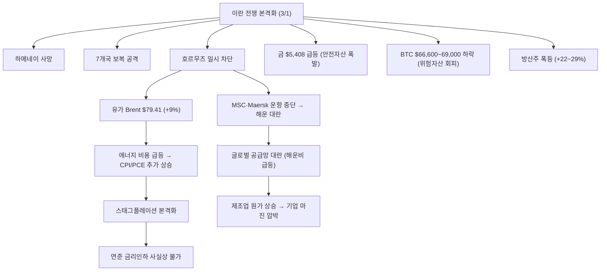
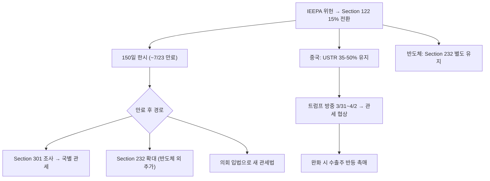

> **관련 글**: [2026년 투자 섹터 전망 (전체)](/knowledge/invest/2026/01/20/investment-sectors-outlook-2026.html)

2026년 3월 3일(월) 기준 업데이트입니다. **이란 전쟁이 본격화**되었습니다. 3월 1일 미국의 "Operation Epic Fury"와 이스라엘의 "Operation Roaring Lion"이 동시 개시되어 **최고지도자 하메네이가 사망**했습니다. 이란은 **이스라엘·UAE·카타르·쿠웨이트·바레인·요르단·사우디 7개국에 미사일·드론 보복 공격**을 감행했고, **호르무즈 해협은 일시 차단**(1,500만 배럴/일 수송 차질)되었습니다. **MSC는 중동 화물 전면 중단**, **Maersk는 호르무즈/수에즈 통행 정지**를 선언했습니다.

**한국 방산주가 폭등**했습니다: 한화에어로 **+22%**, 한화시스템즈 **+25.53%**, LIG넥스원 **+28.88%**. 유가는 **Brent $79.41(+9%), WTI $72.79(+8.6%)** 급등, 금은 **$5,338~5,408/oz**(JP모건 $6,300 목표), 비트코인은 **$66,600~69,000**(Fear 14)로 위험자산 회피가 지속됩니다. **스태그플레이션이 더욱 심화**되고 있으며, GDP 1.4% + Core PCE 3.0%에 유가 급등 충격까지 가세.

## 시장 현황 (2026년 3월 3일 기준)

### 글로벌 증시

| 지수 | 수준 | 변동 |
|------|------|------|
| S&P 500 | **6,878.88** | 선물 -0.8~1.2% (이란 전쟁) |
| Nasdaq | **~22,700** | 위험자산 매도 지속 |
| Dow Jones | **~49,080** | 방산 제외 전면 하락 |
| KOSPI | **6,307** (2/26 사상최고) → 조정 중 | 방산주 폭등(+22~29%), 삼성+SK = 순이익 56% |
| Nikkei 225 | **58,000+** | 사상최고 ('다카이치 트레이드') |

### 핵심 매크로 지표

| 항목 | 현황 | 방향 |
|------|------|------|
| 미국 Q4 GDP | **1.4%** (2/20 발표) | **예상 2.3% 대폭 하회**, Q3 4.4%에서 급락 |
| Core PCE | **3.0%** | **2025년 4월 이후 최고**, 유가 급등으로 추가 상승 우려 |
| 미국 CPI | **2.4%** | 유가 충격으로 상승 전환 가능성 |
| Core CPI | **2.5%** | 에너지 파급 효과 주시 |
| 미국 기준금리 | **3.50~3.75%** | FOMC 동결, 유가 급등으로 인하 사실상 불가 |
| **연준 의장** | **Powell 5/15 퇴임 확정** | 신임 의장 불확실성 부상 |
| 원/달러 환율 | **~1,450원** | 달러 강세 압력 vs WGBI 4월 편입 |
| **금(Gold)** | **$5,338~5,408/oz** | **JP모건 $6,300 목표, 골드만삭스 상향, 중앙은행 585톤/분기** |
| **은(Silver)** | **$93~96/oz** | **ATH $121.62 (1/29), 6년 연속 공급적자** |
| **비트코인** | **$66,600~69,000** | Fear & Greed 14 (극도의 공포), 위험자산 회피 |
| **유가(Brent)** | **$79.41** | **+9.0%, 호르무즈 일시 차단, 1,500만 배럴/일** |
| **유가(WTI)** | **$72.79** | **+8.6%, MSC·Maersk 운항 중단** |
| 한은 기준금리 | **2.50%** | 5회 연속 동결 |

### 지정학 리스크

| 항목 | 현황 | 긴급도 |
|------|------|--------|
| **이란 전쟁 본격화** | 합동 공습, 하메네이 사망, 7개국 보복, 호르무즈 일시 차단 | **최고** |
| **호르무즈 해협 차단** | 1,500만 배럴/일 수송 차질, MSC·Maersk 운항 중단 | **최고** |
| **한국 방산주 폭등** | 한화에어로 +22%, LIG넥스원 +28.88%, 한화시스템즈 +25.53% | **긍정적** |
| 러시아-우크라이나 | 평화 협상 결렬 | 높음 |

---

## 이란 전쟁 본격화: 하메네이 사망·7개국 보복·호르무즈 차단 (3/1~)

### 사건 전개

| 시점 | 사건 |
|------|------|
| **3/1** | 미국 "Operation Epic Fury" + 이스라엘 "Operation Roaring Lion" — 이란 합동 공습 |
| **3/1** | **하메네이 사망** (IRGC 참모총장, 아마디네자드 전 대통령 동시 사망) |
| **3/1** | 이란 보복: **7개국** (이스라엘·UAE·카타르·쿠웨이트·바레인·요르단·사우디)에 미사일·드론 공격 |
| **3/1~2** | **호르무즈 해협 일시 차단** — 1,500만 배럴/일 원유 수송 차질 |
| **3/1~2** | **MSC 중동 화물 전면 중단**, **Maersk 호르무즈/수에즈 통행 정지** |
| **3/3** | **한국 방산주 폭등** — 한화에어로 +22%, 한화시스템즈 +25.53%, LIG넥스원 +28.88% |

### 시장 영향 (3/3 기준)

| 자산 | 수준 | 변동 | 의미 |
|------|------|------|------|
| **유가(Brent)** | **$79.41** | **+9.0%** | 호르무즈 차단, 공급 위기 |
| **유가(WTI)** | **$72.79** | **+8.6%** | 해운 대란 가세 |
| **금(Gold)** | **$5,338~5,408** | **급등** | 안전자산 수요 폭발, JP모건 $6,300 |
| **은(Silver)** | **$93~96** | 강세 | ATH $121.62 (1/29), 6년 공급적자 |
| **비트코인** | **$66,600~69,000** | **하락** | Fear 14, 위험자산 회피 |
| **한국 방산주** | **+22~29%** | **폭등** | 전쟁 수혜 직접 확인 |
| **S&P 500 선물** | -0.8~1.2% | 하락 | 광범위 위험자산 회피 |

### 자산 상관관계 — 이란 전쟁 환경


```mermaid
graph TD
    A["이란 전쟁 본격화 (3/1)"] --> B["하메네이 사망"]
    A --> C["7개국 보복 공격"]
    A --> D["호르무즈 일시 차단"]
    D --> E["유가 Brent $79.41 (+9%)"]
    E --> F["에너지 비용 급등 → CPI/PCE 추가 상승"]
    F --> G["스태그플레이션 본격화"]
    G --> H["연준 금리인하 사실상 불가"]
    D --> I["MSC·Maersk 운항 중단 → 해운 대란"]
    I --> J["글로벌 공급망 대란 (해운비 급등)"]
    J --> K["제조업 원가 상승 → 기업 마진 압박"]
    A --> L["금 $5,408 급등 (안전자산 폭발)"]
    A --> M["BTC $66,600~69,000 하락 (위험자산 회피)"]
    A --> N["방산주 폭등 (+22~29%)"]
```

| 자산 | 방향 | 논리 |
|------|------|------|
| **금** | **상승** | 안전자산, 인플레 헤지, 중앙은행 매입 585톤/분기 |
| **유가** | **상승** | 공급 차단, 지정학 프리미엄 |
| **방산주** | **폭등** | 전쟁 = 무기 수요 폭발 |
| **비트코인** | **하락** | 위험자산, "디지털 금" 내러티브 실패 |
| **광범위 주식** | **하락** | 위험자산 회피, 변동성 확대 |

### 시나리오별 영향

| 시나리오 | 확률 | 유가 | 금 | 증시 |
|---------|------|------|-----|------|
| **장기전 + 간헐적 봉쇄** | **높음** | **$90-120** | **$5,500-6,000** | **방산 상승, 광범위 하락** |
| **봉쇄 장기화 (완전 차단)** | 중 | **$120-200** | **$6,000-6,500** | **폭락 (-10%+)** |
| **미국 군사적 해결 (해군 호위)** | 중 | **$80-100** | **$5,300-5,500** | **변동성 극대화** |
| **이란 정권 교체 → 안정화** | 중-저 | $70-80 | $5,000-5,200 | 반등 |
| **외교적 수습** | 낮음 | $65-70 복귀 | $4,800-5,000 | 강한 반등 |

> **투자 시사점**: 하메네이 사망으로 이란 지도부가 제거되었으나, 7개국 보복 공격으로 **확전 위험**이 존재합니다. 한국 방산주 폭등(+22~29%)이 시장의 판단을 명확히 보여줍니다. **방산·에너지·금 비중 최우선 확대, 현금 확보 필수**.

---

## 금 $5,338~5,408: 안전자산 수요 폭발

### 금 가격 현황

| 항목 | 내용 |
|------|------|
| 현재 가격 | **$5,338~5,408/oz** (3/3 기준) |
| 역대 고점 | **$5,595** (2026년 1월 29일) |
| **JP모건 목표** | **$6,300** |
| **골드만삭스** | **목표 상향** |
| **중앙은행 매입** | **585톤/분기 평균** |

### 금 가격 흐름

| 시점 | 가격 | 이벤트 |
|------|------|--------|
| 1/29 | **$5,595** | 사상최고 (이란 공습 우려) |
| 2/22~24 | **$5,072** | 이란 협상 진전 → 폭락 |
| 2/28 | **$5,464** | 이란 공습 임박 → 급반등 |
| **3/3** | **$5,338~5,408** | **이란 전쟁 본격화 → 안전자산 폭발** |

### 금 급등 촉매

| 요인 | 설명 |
|------|------|
| **이란 전쟁 본격화** | 하메네이 사망 + 7개국 보복 → 안전자산 수요 극대화 |
| **유가 급등 → 인플레 가속** | Brent $79.41 → 인플레 기대 상승 → 금 강세 |
| **스태그플레이션 심화** | GDP 1.4% + Core PCE 3.0% + 유가 충격 |
| **중앙은행 매입 지속** | 글로벌 중앙은행 **585톤/분기** 매입 |
| **JP모건 $6,300 목표** | 전쟁 장기화 시 조기 달성 가능 |

> **투자 시사점**: 금은 **$5,338~5,408**까지 급등. JP모건 $6,300 목표, 중앙은행 585톤/분기 매입이 구조적 지지. 이란 전쟁 장기화 시 **$6,000+ 조기 달성** 가능.

---

## 은(Silver) $93~96: 구조적 공급적자 + 지정학 프리미엄

### 은 가격 현황

| 항목 | 내용 |
|------|------|
| 현재 | **$93~96/oz** |
| **ATH** | **$121.62** (2026년 1월 29일) |
| **공급 상황** | **6년 연속 공급적자**, **COMEX 재고 -75%** |
| **촉매** | 이란 전쟁 → 안전자산 수요 + 공급망 리스크 |

### 은 급등 배경

| 요인 | 설명 |
|------|------|
| **이란 전쟁 → 안전자산 수요** | 금 동반 급등에 연동 |
| **6년 연속 공급적자** | 구조적 수급 불균형 심화 |
| **COMEX 재고 -75%** | 물리적 인도 가능 재고 고갈 수준 |
| **AI 산업수요 확대** | 태양광 패널, 전자기기, AI 서버 냉각 시스템 등 |
| **금 대비 저평가** | 금/은 비율 여전히 역사적 고평가 영역 |

> **투자 시사점**: 은 $93~96에서 거래 중(ATH $121.62). **6년 연속 공급적자 + COMEX 재고 -75%**라는 구조적 요인에 이란 전쟁 프리미엄이 가세. 중장기 상승 추세 강화.

---

## 유가 급등 + 해운 대란: Brent $79.41

### 유가 현황 (3/3)

| 항목 | 수치 | 변동 |
|------|------|------|
| **Brent** | **$79.41** | **+9.0%** |
| **WTI** | **$72.79** | **+8.6%** |
| 이란 공습 전 (2/27) | WTI ~$65, Brent ~$70 | |
| 호르무즈 차단 규모 | **1,500만 배럴/일** | 세계 해상 원유 수송 핵심 통로 |

### 해운 대란 상세

| 해운사 | 조치 | 영향 |
|--------|------|------|
| **MSC** | **중동 화물 전면 중단** | 세계 최대 컨테이너 해운사 운항 정지 |
| **Maersk** | **호르무즈/수에즈 통행 정지** | 글로벌 공급망 대란 확대 |

### 유가 시나리오

| 시나리오 | 유가 범위 | 확률 |
|---------|----------|------|
| **간헐적 봉쇄 (현재)** | **$80-120** | **높음** |
| **봉쇄 장기화·완전 차단** | **$120-200** | **중** |
| **미국 군사 호위** | **$80-100** (부분 완화) | 중 |
| **이란 정권 교체 → 안정** | $70-80 | 중-저 |
| **외교적 수습** | $65-70 복귀 | 낮음 |

### 유가 급등의 거시경제 영향

| 영향 | 설명 |
|------|------|
| **인플레이션 급가속** | Brent $79.41 → $100+ 시 CPI 0.5~1.0%p 추가 상승 가능 |
| **글로벌 공급망 대란** | MSC·Maersk 운항 중단 → 해운비 급등 → 물류비 전가 |
| **금리인하 사실상 불가** | 유가 급등 → 인플레 기대 급상승 → 연준 인하 불가 |
| **소비자 부담 폭증** | 휘발유/물류비 급등 → 소비 위축 → GDP 추가 하락 |
| **에너지 수입국 타격** | 한국·일본·유럽 — 에너지 적자 확대 + 통화 약세 |

> **투자 시사점**: 유가 Brent $79.41(+9%). 호르무즈 일시 차단(1,500만 배럴/일)과 해운 대란이 동시 진행. 봉쇄 장기화 시 $100-150+ 가능. **에너지 포지션 확대 필수**.

---

## 비트코인 $66,600~69,000: 위험자산 회피 지속

| 항목 | 내용 |
|------|------|
| 현재 가격 | **$66,600~69,000** |
| **Fear & Greed** | **14 (극도의 공포)** |
| **ETF 자금 흐름** | 유출 지속 |
| **핵심 하락 요인** | 이란 전쟁 + 호르무즈 차단 → 위험자산 회피, "디지털 금" 내러티브 실패 |
| **자산 상관관계** | 금 **상승** vs 비트코인 **하락** = 위험자산으로 거래 |

> **투자 시사점**: 비트코인은 이란 전쟁 환경에서 **위험자산으로 거래**되고 있습니다. 금은 올라가고 비트코인은 내려가는 상관관계가 명확. Fear 14 극공포 구간이며, **전쟁 종료 신호 전까지 추가 하락 리스크** 존재. 장기 관점 분할 매수 검토는 가능하나 레버리지 절대 금지.

---

## KOSPI 6,307 사상최고 → 이란 전쟁 후 방산주 폭등

KOSPI는 2/26 사상최고 6,307을 기록했으나, 이란 전쟁 충격과 방산주 폭등으로 **섹터 차별화**가 극대화되고 있습니다.

| 요인 | 영향 |
|------|------|
| **방산주 폭등** | **한화에어로 +22%, LIG넥스원 +28.88%** — 이란 전쟁 최대 수혜 |
| **유가 Brent $79.41** | **부정적**: 에너지 수입비 급증 → 무역수지 악화 |
| **해운 대란** | **부정적**: 물류비 상승 → 수출 기업 마진 압박 |
| **반도체** | **혼조**: AI 수요 유지 but 위험자산 회피 |
| **WGBI 4월 편입** | **지지**: $560-700억 유입 → 환율 안정 핵심 |
| **삼성+SK 비중** | **지지**: 순이익 56%(257.6조/457조) |
| **소비자심리** | **지지**: 88.2 → **112.4** 급격 회복 |

> **투자 시사점**: 이란 전쟁으로 KOSPI 내 **섹터 차별화 극심**. 방산주 폭등 vs 에너지 수입 부담. **WGBI 편입 + 반도체 초강세**가 지수를 지지하나, 변동성 확대 불가피.

---

## 관세: Section 122 15% + 트럼프 방중 (3/31~4/2)

### 관세 체제 현황

| 구분 | 근거법 | 세율 | 상태 |
|------|--------|------|------|
| 보편관세 | **Section 122** | **15%** (2/24 발효) | **150일 한시 (~7/23 만료), 상한 도달** |
| **중국 관세** | USTR | **35~50%** | **트럼프 방중 3/31~4/2 협상 변수** |
| 반도체 관세 | **Section 232** | 별도 | **유지** |
| 철강/알루미늄 | **Section 232** | 별도 | **유지 (3/12 발효)** |
| IEEPA 기반 관세 | IEEPA | - | **위헌 무효 (대법원 6:3)** |

### 향후 관세 경로


```mermaid
graph TD
    A["IEEPA 위헌 → Section 122 15% 전환"] --> B["150일 한시 (~7/23 만료)"]
    B --> C{"만료 후 경로"}
    C --> D["Section 301 조사 → 국별 관세"]
    C --> E["Section 232 확대 (반도체 외 추가)"]
    C --> F["의회 입법으로 새 관세법"]
    A --> G["중국: USTR 35-50% 유지"]
    G --> H["트럼프 방중 3/31~4/2 → 관세 협상"]
    H --> I["완화 시 수출주 반등 촉매"]
    A --> J["반도체: Section 232 별도 유지"]
```

> **투자 시사점**: Section 122 15% 발효 중, **7/23 만료** 예정. **트럼프 방중(3/31~4/2)**은 미중 관세 완화의 첫 기회. 중국 35~50% 관세 조정 여부가 핵심. 이란 전쟁에 따른 에너지 비용 상승 + 관세 부담의 **이중 타격**이 수출 기업에 부담.

---

## WGBI 4월 편입: $560-700억 유입 — 환율 안정 핵심

| 항목 | 내용 |
|------|------|
| 편입 시작 | **2026년 4월** |
| 비중 | **2.05%** (9위 규모) |
| 편입 방식 | 8개월 x 8회 균등 분할 (4~11월) |
| **예상 유입 규모** | **$560-700억** (약 80-100조원) |
| **추종 자금** | **$3.5조** |

> **투자 시사점**: 이란 전쟁으로 원화 약세 압력이 극대화되고 있으나, **WGBI 4월 편입($560-700억 유입)**이 환율 안정의 핵심 상쇄 요인. 26번째 편입 국가.

---

## 스태그플레이션 심화: GDP 1.4% + Core PCE 3.0% + 유가 $79.41 충격

### 스태그플레이션 신호 (3/3 업데이트)

| 지표 | 신호 | 의미 |
|------|------|------|
| GDP **1.4%** (급락) | 성장 둔화 | Q3 4.4% → Q4 1.4% 급락 |
| Core PCE **3.0%** | 인플레 재상승 | 2025년 4월 이후 최고 |
| **Brent $79.41 (+9%)** | **에너지 충격 현실화** | **이란 전쟁 → 유가 급등 → CPI 추가 상승** |
| **해운비 급등** | **공급망 비용 급등** | **MSC·Maersk 운항 중단 → 물류비 전가** |
| 관세 15% | 수입 물가 상승 | 관세 + 유가 + 해운비 3중 인플레 압력 |
| **조합** | **성장 둔화 + 인플레 가속 + 에너지 충격** | **스태그플레이션 본격화** |

### 연준 금리 전망: 인하 사실상 불가

| 시점 | 전망 | 근거 |
|------|------|------|
| 2월 초 | 6월 인하 기대 | CPI 2.4% (하락세) |
| 2/20 | 인하 후퇴 | Core PCE 3.0% (재가속) |
| **3/3** | **인하 사실상 불가** | **Brent $79.41 → 인플레 가속, 호르무즈 차단** |
| **Powell 퇴임** | **5/15 퇴임 확정** | 신임 의장 불확실성 |

> **투자 시사점**: 이란 전쟁으로 Brent $79.41까지 급등하면서, Core PCE 3.0%에 **에너지 충격이 직접 가세**. 관세 15% + 유가 + 해운비의 **3중 인플레 압력**. 연준 금리인하는 **사실상 불가**. **인플레 헤지 자산(금, 원자재, 에너지) 비중 확대 필수**.

---

## 환율: USD/KRW 1,450원 — 유가 충격 vs WGBI 편입

| 요인 | 방향 | 설명 |
|------|------|------|
| **유가 $79.41 + 해운 대란** | **원화 약세** | 에너지 수입비 급증 + 물류비 상승 → 무역수지 악화 |
| **이란 전쟁 → 달러 강세** | **원화 약세** | 안전자산 선호 극대화 |
| **WGBI 4월 편입** | **원화 강세** | $560-700억 유입 → 핵심 상쇄 요인 |
| **소비자심리 112.4** | **원화 강세** | 계엄 후유증 완전 탈피 |
| 한은 기준금리 | 2.50% (5회 연속 동결) | |

---

## 한국 경제: 계엄 후유증 탈피·경제도약의 해

| 항목 | 내용 |
|------|------|
| **소비자심리** | 88.2 → **112.4** (급격 회복) |
| **정부 선언** | **2026 경제도약의 해** |
| **GPU 확보 목표** | 2028년 **15,000개**, 2030년 **50,000개** |
| **삼성+SK 비중** | KOSPI 순이익 **56%** (257.6조/457조) |
| **WGBI 편입** | 4월 시작, 26번째 국가, 비중 2.05% |
| **수출** | 2월 **+44.4%**, 반도체 출하량 **+137.6%** |

---

## 주요 구조적 테마

### 1. 다카이치 총선 압승 + 닛케이 58,000 ('다카이치 트레이드')

다카이치 총리의 압승(자민당 316석, 연립 352석)으로 아베노믹스 2.0이 본격화. 식료품 소비세 면제, 재정 확장, 금리 인상 억제가 핵심이며, **엔캐리 트레이드 재개**로 글로벌 유동성 공급.

### 2. 삼성전자 HBM4 출하 + 주가 4배

삼성전자의 HBM4 출하 개시(2/12)와 함께 주가가 작년 초 대비 **4배** 상승. SK하이닉스는 **6배** 상승. 삼성+SK = KOSPI 순이익의 **56%**.

### 3. 한국 밸류업: 1980년대 일본 비유

| 항목 | 1980년대 일본 | 2026년 한국 |
|------|---------------|-------------|
| 미국 대통령 | 레이건 (보호무역) | 트럼프 (관세→양자협상) |
| 역할 | 미국의 핵심 제조업 파트너 | 미국의 대중국 제조업 파트너 |
| 밸류에이션 | 저평가→급격한 재평가 | 코리아 디스카운트→밸류업 |
| 핵심 산업 | 자동차, 전자 | 반도체(HBM4), AI, 배터리, 방산 |

### 4. 강세장 섹터 순환: 아직 미완성

| 순서 | 유형 | 상태 |
|------|------|------|
| 1 | 선도 섹터 (반도체, AI) | 이미 상승 |
| 2 | 대형 가치주 (금융, 통신) | 진행 중 |
| 2.5 | **방산/조선** (이란 전쟁 수혜) | **폭등 진행 중** |
| 3 | **국민주 (네이버, 카카오)** | **미개시** |
| 4 | **경기순환주 (화학, 철강, 건설)** | **미개시** |
| 5 | 소형주·테마주 | 마지막 단계 |

---

## 투자 전략

### 현 국면 진단: "이란 전쟁 본격화 + 방산주 폭등 + 스태그플레이션 심화"

이란 전쟁이 **본격화**되었습니다. 하메네이 사망 + 7개국 보복 + 호르무즈 일시 차단으로 **중동 전면전** 양상. 한국 방산주 폭등(+22~29%)이 시장의 판단을 보여줍니다. 유가 Brent $79.41(+9%) 급등, 금 $5,338~5,408 급등, 비트코인 하락. **스태그플레이션 리스크가 현실적 위협**이 되었습니다.

### 단기 전략 (3월): "이란 전쟁 대비 포트폴리오"

| 우선순위 | 전략 | 근거 |
|---------|------|------|
| 1 | **방산 포지션 유지/확대** | 한화에어로 +22%, LIG넥스원 +28.88% — 전쟁 장기화 시 추가 상승 |
| 2 | **에너지 포지션 확대** | Brent $79.41 → 봉쇄 장기화 시 $100-150, 에너지주/유가 ETF |
| 3 | **귀금속 비중 확대** | 금 $5,408, JP모건 $6,300 — 인플레 + 전쟁 최적 자산 |
| 4 | **해운주 주목** | MSC·Maersk 운항 중단 → 해운비 급등 → 대체 해운사 수혜 |
| 5 | **위험자산 비중 축소** | 비트코인 $66,600~69,000, 고성장주 — 극도의 공포 지속 |

### 중기 전략 (4~6월)

| 우선순위 | 전략 | 근거 |
|---------|------|------|
| 1 | **스태그플레이션 헤지 최우선** | 유가 $100+ 시 인플레 급가속 — 금/원자재/에너지 비중 유지 |
| 2 | **WGBI 편입 수혜** | 4월 편입 ($560-700억) — 환율 안정 + 외국인 매수 |
| 3 | **트럼프 방중 모니터링** | 3/31~4/2 — 미중 관세 완화 시 수출주 반등 |
| 4 | **관세 체제 재편 모니터링** | Section 122 7/23 만료 |
| 5 | **밸류업 수혜주** | 자사주 소각, 고배당 기업 |

### 포트폴리오 배분 제안 (이란 전쟁 반영)

```
귀금속·원자재·에너지: 30% (↑)
├── 금 ETF/실물: 12% (JP모건 $6,300, 중앙은행 585톤/분기)
├── 은 ETF/실물: 5% (6년 공급적자, ATH $121.62)
└── 에너지 (유가 ETF/에너지주): 13% (↑↑ 호르무즈 차단)

방산: 8%
├── 한국 방산주 (한화에어로, LIG넥스원 등): 5% (폭등 중)
└── 글로벌 방산 ETF: 3%

금리 인하 수혜: 5% (↓↓ 인하 사실상 불가)
├── 장기채 ETF: 2%
└── 리츠(REITs): 3%

섹터 순환·수출주: 15% (↓ 유가+관세 이중 부담)
├── 관세 과매도 수출주: 5%
├── 국민주 (네이버, 카카오): 4%
├── 경기순환주 (화학, 철강, 건설): 3%
└── 코스닥 저평가주: 3%

밸류업·배당: 12% (↓ 에너지 충격 반영)
├── 고배당 ETF (커버드콜 포함): 6%
├── 자사주 소각 기업: 3%
└── 배당성장주: 3%

반도체·AI: 10%
├── 삼성전자/SK하이닉스: 7%
└── HBM 후공정 장비·소재: 3%

현금/단기채: 20% (↑ 극심한 변동성 대비)
├── 현금: 12%
└── 단기국채 ETF: 8%
```

## 월별 체크포인트

| 월 | 이벤트 | 투자 시사점 |
|----|--------|------------|
| **3/1** | **이란 전쟁 본격화, 하메네이 사망** | 유가 $79.41 급등, 방산주 폭등, 해운 대란 |
| **3/3** | **월요일 시장 개장** | 방산주 폭등(+22~29%) 반영, 변동성 확대 |
| **3/12** | 철강/알루미늄 25% 관세 발효 | Section 232 |
| **3/15~19** | **GTC 2026** | Vera Rubin, HBM4, Feynman |
| **3/31~4/2** | **트럼프 방중, 시진핑 정상회담** | 미중 관세 협상 변수 |
| **4월** | **WGBI 인덱스 편입 시작** | $560-700억 유입 + 환율 안정 |
| **5/15** | Powell 퇴임 | 연준 리더십 전환 |
| **~7/23** | **Section 122 150일 만료** | 관세 재편 핵심 분기점 |
| 4~11월 | WGBI 8회 분할 편입 진행 | 매달 균등 편입 → 지속적 외국인 매수 |

## 리스크 요인 정리

| 리스크 | 심각도 | 확률 | 대응 |
|--------|--------|------|------|
| **이란 전쟁 장기화·확전** | **최고** | **높음** | 방산·에너지·금 비중 유지, 현금 확보 |
| **호르무즈 봉쇄 장기화** | **최고** | **중** | 에너지 포지션 확대, 유가 $100-150 대비 |
| **해운 대란 확대** | **최고** | **진행 중** | 해운주 주목, 공급망 영향 수출주 비중 조정 |
| **스태그플레이션 본격화** | **최고** | **매우 높음** | 금/원자재/에너지 비중 최우선, 금리인하 수혜 대폭 축소 |
| **관세 15% + 유가 급등 이중 부담** | **높음** | **높음** | 수출주 영향 재점검 |
| 원화 약세 압력 | 높음 | 높음 | 유가 급등 + 달러 강세 vs WGBI 편입 상쇄 |
| 비트코인 추가 하락 | 중간 | 높음 | Fear 14 극공포, 전쟁 종료 전 추가 하방 |

## 정리

| 항목 | 내용 |
|------|------|
| **이란 전쟁** | **합동 공습, 하메네이 사망, 7개국 보복, 호르무즈 일시 차단** |
| **방산주 폭등** | **한화에어로 +22%, 한화시스템즈 +25.53%, LIG넥스원 +28.88%** |
| **유가** | **Brent $79.41(+9%), WTI $72.79(+8.6%)** |
| **금(Gold)** | **$5,338~5,408, JP모건 $6,300 목표, 중앙은행 585톤/분기** |
| **은(Silver)** | **$93~96, ATH $121.62, 6년 연속 공급적자** |
| **스태그플레이션** | **GDP 1.4% + Core PCE 3.0% + 유가 $79.41 → 인플레 가속, 연준 인하 불가** |
| **비트코인** | **$66,600~69,000, Fear 14, 금 UP vs BTC DOWN** |
| **관세** | **Section 122 15% 발효 (~7/23 만료), 트럼프 방중 3/31~4/2** |
| **KOSPI** | **6,307 사상최고, 삼성+SK = 순이익 56%** |
| **WGBI** | **4월 편입 ($560-700억 유입) — 환율 안정 핵심** |
| **한국 경제** | **소비자심리 112.4, 수출 +44.4%, 2026 경제도약의 해** |

**핵심 투자 원칙:**
1. **이란 전쟁 = 게임 체인저** -- 방산주 폭등이 K-방산 수혜를 확인
2. **에너지 + 금 = 최적 자산** -- 유가 $79.41 + 금 $5,408 + 스태그플레이션
3. **자산 상관관계 주시** -- 금 UP, 유가 UP, 방산 UP, BTC DOWN, 광범위 주식 DOWN
4. **트럼프 방중(3/31~4/2) = 미중 관세 변수** -- 완화 시 수출주 반등
5. **스태그플레이션 대비 필수** -- GDP 1.4% + 유가 급등 → 인플레 재가속
6. **WGBI 4월 편입 = 한국 시장 최대 구조적 호재** -- $560-700억 유입
7. **현금 비중 확대** -- 극심한 변동성 속 기회 포착 여력 확보

**투자 결정은 본인의 리스크 허용 범위와 투자 기간을 고려하여 신중하게 내리시기 바랍니다.**
