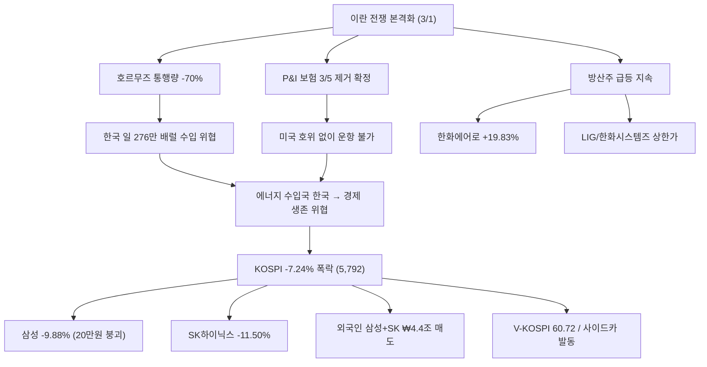
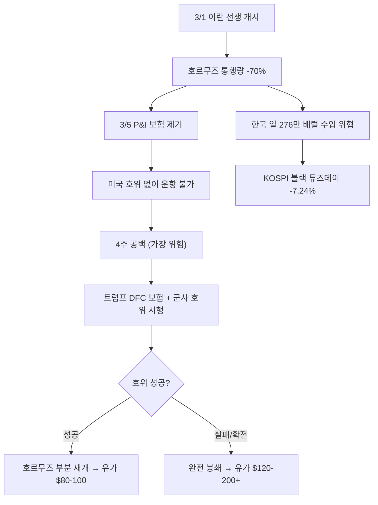
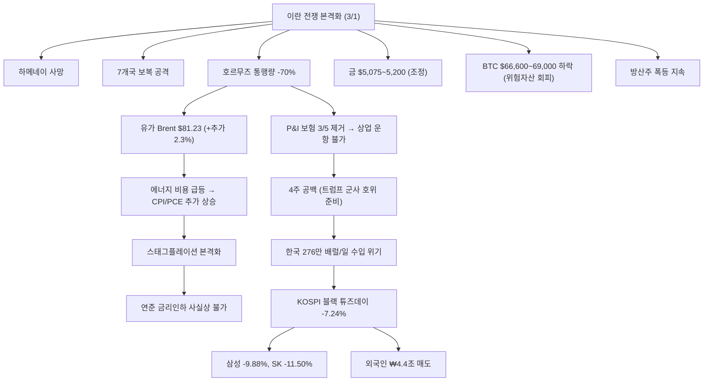
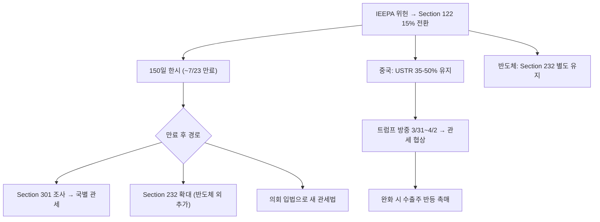

> **관련 글**: [2026년 투자 섹터 전망 (전체)](/knowledge/invest/2026/01/20/investment-sectors-outlook-2026.html)

2026년 3월 5일(수) 기준 업데이트입니다. **3월 4일 KOSPI가 -12.06% 폭락하며 한국 증시 사상 최대 일일 하락폭을 기록했습니다.** 이는 2001년 9/11 테러 당시의 -12.02%를 초과한 역사적 수치입니다. **서킷브레이커가 발동**되었고, 레버리지 포지션 강제 청산이 매도를 가속시켰습니다.

3/3 -7.24%에 이은 **2일 연속 대폭락으로 누적 약 -18.4%(~5,093)**. 삼성전자는 3/4 **-11.69%(~17.7만원, 2일 -20%)**, SK하이닉스 **-9.16%(~85.3만원, 2일 -19%)**, 현대차 **-16.05%(2일 -26%)**, 기아 **-13.82%(2일 -24%)**. 방산주는 **2일 연속 독보적 강세**를 유지했습니다.

트럼프의 DFC 보험 + 군사 호위 발표 이후 유가는 **Brent $78.41, WTI $72.01**로 소폭 하락했으나 여전히 높은 수준. **3월 5일 P&I 보험 제거 발효**로 미 해군 호위 없이는 운항 불가. 금 **$5,153**(조정 지속), **은 $83-86**(기존 $93-96에서 급락, $88.50 지지 하회), **비트코인 $71,680**(반등).

다음 주 **GTC 2026(3/16-19)**과 **FOMC(3/17-18)**가 시장 방향성의 핵심 변수입니다.

## 시장 현황 (2026년 3월 4일 기준)

### 글로벌 증시

| 지수 | 수준 | 변동 |
|------|------|------|
| S&P 500 | **6,878.88** | 선물 하락 지속 (이란 전쟁·유가 추가 상승) |
| Nasdaq | **~22,700** | 위험자산 매도 지속 |
| Dow Jones | **~49,080** | 방산 제외 전면 하락 |
| **KOSPI** | **5,792** (3/3 블랙 튜즈데이) | **-7.24% 폭락, 19개월 최악, 시총 377~390조 증발** |
| Nikkei 225 | **58,000+** | 사상최고 ('다카이치 트레이드') |

### 핵심 매크로 지표

| 항목 | 현황 | 방향 |
|------|------|------|
| 미국 Q4 GDP | **1.4%** (2/20 발표) | **예상 2.3% 대폭 하회**, Q3 4.4%에서 급락 |
| Core PCE | **3.0%** | **2025년 4월 이후 최고**, 유가 급등으로 추가 상승 우려 |
| 미국 CPI | **2.4%** | 유가 충격으로 상승 전환 가능성 |
| Core CPI | **2.5%** | 에너지 파급 효과 주시 |
| 미국 기준금리 | **3.50~3.75%** | FOMC 동결, 유가 급등으로 인하 사실상 불가 |
| **연준 의장** | **Powell 5/15 퇴임 확정** | 신임 의장 불확실성 부상 |
| 원/달러 환율 | **~1,450원** | 달러 강세 압력 vs WGBI 4월 편입 |
| **금(Gold)** | **$5,075~5,200/oz** | **조정 ($5,338~5,408 → $5,075~5,200), 고변동성** |
| **은(Silver)** | **$93~96/oz** | **ATH $121.62 (1/29), 6년 연속 공급적자** |
| **비트코인** | **$66,600~69,000** | Fear & Greed 14 (극도의 공포), 위험자산 회피 |
| **유가(Brent)** | **$81.23** | **+2.3% 추가 상승 (전일 $79.41), 바클레이즈 $100 전망** |
| **유가(WTI)** | **$73.78** | **호르무즈 통행량 -70%, P&I 보험 3/5 제거** |
| 한은 기준금리 | **2.50%** | 5회 연속 동결 |
| **KOSPI 변동성지수** | **60.72** | **2020년 이후 최고, 사이드카 발동** |

### 지정학 리스크

| 항목 | 현황 | 긴급도 |
|------|------|--------|
| **KOSPI 블랙 튜즈데이** | -7.24% 폭락, 시총 377~390조 증발, V-KOSPI 60.72 | **최고** |
| **이란 전쟁 본격화** | 합동 공습, 하메네이 사망, 7개국 보복, 호르무즈 차단 심화 | **최고** |
| **호르무즈 해협 통행량 -70%** | P&I 보험 3/5 제거, 미국 군사 호위 4주 소요 | **최고** |
| **트럼프 군사 호위 발표** | DFC 보험 + 군사 호위, 4주 후 시행 예정 | **핵심 변수** |
| **한국 호르무즈 의존도** | 일 276만 배럴 수입 — 경제 생존 위협 | **최고** |
| **방산주 급등 지속** | 한화에어로 +19.83%, LIG/한화시스템즈 상한가 | **긍정적** |
| 러시아-우크라이나 | 평화 협상 결렬 | 높음 |

---

## KOSPI "블랙 튜즈데이" (3/3): 7.24% 폭락, 19개월 최악

### 폭락 핵심 데이터

| 항목 | 수치 |
|------|------|
| **KOSPI 종가** | **5,792** (-7.24%) |
| **시총 증발** | **₩377~390조원 (약 $270B)** |
| **V-KOSPI (변동성지수)** | **60.72** (2020년 이후 최고) |
| **사이드카** | **발동** |
| **삼성전자** | **-9.88%** (20만원 붕괴) |
| **SK하이닉스** | **-11.50%** |
| **외국인 매도 (삼성+SK)** | **₩4.4조원** |
| **한화에어로** | **+19.83%** |
| **LIG넥스원** | **상한가** |
| **한화시스템즈** | **상한가** |

### 블랙 튜즈데이 원인 분석


```mermaid
graph TD
    A["이란 전쟁 본격화 (3/1)"] --> B["호르무즈 통행량 -70%"]
    A --> C["P&I 보험 3/5 제거 확정"]
    B --> D["한국 일 276만 배럴 수입 위협"]
    C --> E["미국 호위 없이 운항 불가"]
    D --> F["에너지 수입국 한국 → 경제 생존 위협"]
    E --> F
    F --> G["KOSPI -7.24% 폭락 (5,792)"]
    G --> H["삼성 -9.88% (20만원 붕괴)"]
    G --> I["SK하이닉스 -11.50%"]
    G --> J["외국인 삼성+SK ₩4.4조 매도"]
    G --> K["V-KOSPI 60.72 / 사이드카 발동"]
    A --> L["방산주 급등 지속"]
    L --> M["한화에어로 +19.83%"]
    L --> N["LIG/한화시스템즈 상한가"]
```

### 섹터별 영향

| 섹터 | 변동 | 의미 |
|------|------|------|
| **반도체** | **삼성 -9.88%, SK -11.50%** | 외국인 ₩4.4조 매도, 에너지 의존도 우려 |
| **방산** | **한화에어로 +19.83%, LIG·한화시스템즈 상한가** | 전쟁 수혜 지속, K-방산 글로벌 수주 기대 |
| **에너지·화학** | 혼조 | 유가 상승 수혜 vs 원가 부담 |
| **수출주** | 대폭 하락 | 해운 대란 + 관세 + 유가 3중 부담 |
| **금융** | 하락 | 시장 전체 위험회피 |

### 시장 전망: 애널리스트 밴드

| 전망 | KOSPI 밴드 | 근거 |
|------|-----------|------|
| **하단** | **5,900** | 극단적 공포 반영, V-KOSPI 60+ |
| **중앙** | **6,200** | 군사 호위 시행 후 부분 안정화 |
| **상단** | **6,600** | 호위 성공 + 전쟁 제한 + WGBI 편입 |

> **투자 시사점**: KOSPI 5,792는 19개월 최악의 하루. V-KOSPI 60.72는 극도의 공포를 반영. 삼성 20만원 붕괴, SK하이닉스 -11.50%는 외국인의 대규모 매도(₩4.4조)에 의한 것. **군사 호위 작전 4주 타임라인**이 핵심 변수로, 전쟁이 제한적으로 마무리된다면 **1~2개월 내 회복** 가능성 존재. 단, 확전 시 추가 하방 리스크.

---

## 트럼프 군사 호위 발표: DFC 보험 + 해군 호위 (4주 소요)

### 호위 작전 핵심

| 항목 | 내용 |
|------|------|
| **발표 내용** | DFC(개발금융공사) 보험 + 군사 호위함 제공 |
| **시행 시점** | "가능한 빨리" — 약 **4주 소요** 예상 |
| **대상** | 호르무즈 해협 통과 유조선 |
| **목적** | P&I 보험 대체 + 물리적 안전 보장 |

### P&I 보험 제거 (3/5 확정)

| 항목 | 내용 |
|------|------|
| **시행일** | **2026년 3월 5일** |
| **영향** | 미국 호위 없이는 **경제적으로 운항 불가** |
| **의미** | 보험사들이 전쟁 지역 리스크로 보장 철회 |

### 호르무즈 해협 현황

| 항목 | 수치 |
|------|------|
| **통행량 감소** | **-70%** (선박 추적 데이터 확인) |
| **일일 수송량 (정상)** | **1,500만 배럴/일** |
| **현재 수송량 (추정)** | **~450만 배럴/일** |
| **한국 호르무즈 의존** | **일 276만 배럴 수입** — **경제 생존 위협** |

### 한국의 호르무즈 의존도

한국은 호르무즈 해협을 통해 **하루 276만 배럴**을 수입하며, 이는 한국 경제의 **생존적 위협**에 해당합니다. 통행량 -70% 감소 상태에서 P&I 보험마저 제거되면, 미국 군사 호위가 시행되기까지의 **4주간 공백**이 가장 위험한 구간입니다.


```mermaid
graph TD
    A["3/1 이란 전쟁 개시"] --> B["호르무즈 통행량 -70%"]
    B --> C["3/5 P&I 보험 제거"]
    C --> D["미국 호위 없이 운항 불가"]
    D --> E["4주 공백 (가장 위험)"]
    E --> F["트럼프 DFC 보험 + 군사 호위 시행"]
    F --> G{"호위 성공?"}
    G -->|"성공"| H["호르무즈 부분 재개 → 유가 $80-100"]
    G -->|"실패/확전"| I["완전 봉쇄 → 유가 $120-200+"]
    B --> J["한국 일 276만 배럴 수입 위협"]
    J --> K["KOSPI 블랙 튜즈데이 -7.24%"]
```

> **투자 시사점**: 트럼프의 군사 호위 발표는 **중기적 안정 시그널**이나, **4주 공백기**가 핵심 리스크. P&I 보험 제거(3/5)로 상업 운항이 사실상 중단되면, 한국의 276만 배럴/일 수입에 직접 타격. 군사 호위 시행까지의 4주가 **시장 최대 변동성 구간**.

---

## 이란 전쟁 본격화: 하메네이 사망·7개국 보복·호르무즈 차단 심화 (3/1~)

### 사건 전개

| 시점 | 사건 |
|------|------|
| **3/1** | 미국 "Operation Epic Fury" + 이스라엘 "Operation Roaring Lion" — 이란 합동 공습 |
| **3/1** | **하메네이 사망** (IRGC 참모총장, 아마디네자드 전 대통령 동시 사망) |
| **3/1** | 이란 보복: **7개국** (이스라엘·UAE·카타르·쿠웨이트·바레인·요르단·사우디)에 미사일·드론 공격 |
| **3/1~2** | **호르무즈 해협 차단** — 1,500만 배럴/일 원유 수송 차질 |
| **3/1~2** | **MSC 중동 화물 전면 중단**, **Maersk 호르무즈/수에즈 통행 정지** |
| **3/3** | **KOSPI "블랙 튜즈데이" -7.24%** — 시총 377~390조 증발, V-KOSPI 60.72 |
| **3/3** | **삼성 -9.88%, SK하이닉스 -11.50%** — 외국인 ₩4.4조 매도 |
| **3/3** | **방산주 급등 지속** — 한화에어로 +19.83%, LIG·한화시스템즈 상한가 |
| **3/3~4** | **트럼프 DFC 보험 + 군사 호위 발표** (4주 소요) |
| **3/5** | **P&I(선박보험) 제거 확정** — 미국 호위 없이 운항 불가 |

### 시장 영향 (3/4 기준)

| 자산 | 수준 | 변동 | 의미 |
|------|------|------|------|
| **유가(Brent)** | **$81.23** | **+2.3% 추가** | 호르무즈 -70%, 바클레이즈 $100 전망 |
| **유가(WTI)** | **$73.78** | **추가 상승** | P&I 제거 + 4주 공백 |
| **금(Gold)** | **$5,075~5,200** | **조정** | $5,338~5,408에서 하락, 고변동성 |
| **은(Silver)** | **$93~96** | 강세 | ATH $121.62 (1/29), 6년 공급적자 |
| **비트코인** | **$66,600~69,000** | **하락** | Fear 14, 위험자산 회피 |
| **KOSPI** | **5,792** | **-7.24%** | 블랙 튜즈데이, 19개월 최악 |
| **방산주** | **급등 지속** | **한화에어로 +19.83%** | LIG·한화시스템즈 상한가 |

### 자산 상관관계 — 이란 전쟁 환경 (3/4 업데이트)


```mermaid
graph TD
    A["이란 전쟁 본격화 (3/1)"] --> B["하메네이 사망"]
    A --> C["7개국 보복 공격"]
    A --> D["호르무즈 통행량 -70%"]
    D --> E["유가 Brent $81.23 (+추가 2.3%)"]
    E --> F["에너지 비용 급등 → CPI/PCE 추가 상승"]
    F --> G["스태그플레이션 본격화"]
    G --> H["연준 금리인하 사실상 불가"]
    D --> I["P&I 보험 3/5 제거 → 상업 운항 불가"]
    I --> J["4주 공백 (트럼프 군사 호위 준비)"]
    J --> K["한국 276만 배럴/일 수입 위기"]
    K --> L["KOSPI 블랙 튜즈데이 -7.24%"]
    L --> M["삼성 -9.88%, SK -11.50%"]
    L --> N["외국인 ₩4.4조 매도"]
    A --> O["금 $5,075~5,200 (조정)"]
    A --> P["BTC $66,600~69,000 하락 (위험자산 회피)"]
    A --> Q["방산주 폭등 지속"]
```

| 자산 | 방향 | 논리 |
|------|------|------|
| **유가** | **상승** | 공급 차단 -70%, P&I 제거, 바클레이즈 $100 |
| **방산주** | **폭등** | 전쟁 = 무기 수요 폭발, K-방산 글로벌 수주 |
| **금** | **조정 후 상승** | 안전자산 수요 유지, 단기 차익 실현 후 재상승 전망 |
| **KOSPI (비방산)** | **폭락** | 에너지 수입 위기, 외국인 대량 매도 |
| **비트코인** | **하락** | 위험자산, "디지털 금" 내러티브 실패 |

### 시나리오별 영향 (3/4 업데이트)

| 시나리오 | 확률 | 유가 | 금 | KOSPI |
|---------|------|------|-----|-------|
| **4주 공백 → 군사 호위 성공** | **높음** | **$80-100** | **$5,200-5,500** | **5,900-6,200 회복** |
| **장기전 + 간헐적 봉쇄** | **중-높음** | **$90-120** | **$5,500-6,000** | **방산 상승, 비방산 하락** |
| **봉쇄 장기화 (완전 차단)** | 중 | **$120-200** | **$6,000-6,500** | **추가 폭락** |
| **이란 정권 교체 → 안정화** | 중-저 | $70-80 | $5,000-5,200 | 강한 반등 |
| **외교적 수습** | 낮음 | $65-70 복귀 | $4,800-5,000 | 급반등 |

> **투자 시사점**: 트럼프 군사 호위 발표로 **"4주 뒤 안정화" 시나리오**가 새롭게 부상. 전쟁이 제한적으로 마무리된다면 **1~2개월 내 KOSPI 회복** 가능. 하지만 P&I 보험 제거(3/5)부터 호위 시행까지의 **4주 공백이 가장 위험한 구간**.

---

## 유가 급등 심화: Brent $81.23, 바클레이즈 $100 전망

### 유가 현황 (3/4)

| 항목 | 수치 | 변동 |
|------|------|------|
| **Brent** | **$81.23** | **+2.3% 추가 (전일 $79.41)** |
| **WTI** | **$73.78** | **추가 상승** |
| 이란 공습 전 (2/27) | WTI ~$65, Brent ~$70 | |
| 호르무즈 차단 규모 | **1,500만 배럴/일** → 현재 **-70%** | |
| **바클레이즈 전망** | **$100 도달 가능** | |

### OPEC+ 증산 발표

| 항목 | 내용 |
|------|------|
| **증산 규모** | **20.6만 배럴/일** |
| **목적** | 호르무즈 차단에 따른 공급 부족 완화 |
| **효과** | 제한적 — 호르무즈 차단(-70%)은 1,050만 배럴/일 감소에 해당 |

### 해운 대란 상세

| 해운사 | 조치 | 영향 |
|--------|------|------|
| **MSC** | **중동 화물 전면 중단** | 세계 최대 컨테이너 해운사 운항 정지 |
| **Maersk** | **호르무즈/수에즈 통행 정지** | 글로벌 공급망 대란 확대 |
| **P&I 보험** | **3/5 제거 확정** | 미국 호위 없이 경제적 운항 불가 |

### 유가 시나리오 (3/4 업데이트)

| 시나리오 | 유가 범위 | 확률 |
|---------|----------|------|
| **4주 공백 (P&I 제거 ~ 호위 시행)** | **$85-100** | **높음** |
| **군사 호위 성공 → 부분 재개** | **$80-100** | 중-높음 |
| **봉쇄 장기화·완전 차단** | **$120-200** | 중 |
| **이란 정권 교체 → 안정** | $70-80 | 중-저 |
| **외교적 수습** | $65-70 복귀 | 낮음 |

### 유가 급등의 거시경제 영향

| 영향 | 설명 |
|------|------|
| **인플레이션 급가속** | Brent $81.23, 바클레이즈 $100 전망 → CPI 0.5~1.0%p 추가 상승 가능 |
| **글로벌 공급망 대란** | MSC·Maersk 운항 중단 + P&I 제거 → 물류비 폭등 |
| **금리인하 사실상 불가** | 유가 급등 → 인플레 기대 급상승 → 연준 인하 불가 |
| **소비자 부담 폭증** | 휘발유/물류비 급등 → 소비 위축 → GDP 추가 하락 |
| **한국 경제 생존 위협** | **276만 배럴/일 호르무즈 의존** → 에너지 적자 급확대 |

> **투자 시사점**: 유가 Brent $81.23(+2.3% 추가). 호르무즈 -70% + P&I 제거(3/5)로 **공급 차단이 더욱 심화**. OPEC+ 20.6만 배럴/일 증산은 **1,050만 배럴/일 감소 대비 미미**. 바클레이즈 $100 전망. **에너지 포지션 유지·확대**.

---

## 금 $5,075~5,200: 조정 국면, 고변동성

### 금 가격 현황

| 항목 | 내용 |
|------|------|
| 현재 가격 | **$5,075~5,200/oz** (3/4 기준) |
| 역대 고점 | **$5,595** (2026년 1월 29일) |
| **JP모건 목표** | **$6,300** |
| **골드만삭스** | **목표 상향** |
| **중앙은행 매입** | **585톤/분기 평균** |

### 금 가격 흐름

| 시점 | 가격 | 이벤트 |
|------|------|--------|
| 1/29 | **$5,595** | 사상최고 (이란 공습 우려) |
| 2/22~24 | **$5,072** | 이란 협상 진전 → 폭락 |
| 2/28 | **$5,464** | 이란 공습 임박 → 급반등 |
| 3/3 | **$5,338~5,408** | 이란 전쟁 본격화 → 급등 |
| **3/4** | **$5,075~5,200** | **차익 실현 → 조정, 고변동성** |

### 금 조정 요인

| 요인 | 설명 |
|------|------|
| **차익 실현** | $5,400+ 고점에서 단기 매도 물량 출회 |
| **달러 강세** | 안전자산 수요 → 달러 강세 → 금 상대적 약세 |
| **고변동성** | 전쟁 불확실성 → 양방향 급변동 |
| **구조적 지지** | 중앙은행 585톤/분기 매입 + JP모건 $6,300 → 하방 제한 |

> **투자 시사점**: 금은 $5,338~5,408에서 **$5,075~5,200으로 조정**. 전쟁 환경에서의 고변동성이 특징. 중앙은행 585톤/분기 매입, JP모건 $6,300 목표가 **구조적 하방 지지**. 조정 시 **분할 매수 기회**로 판단.

---

## 은(Silver) $93~96: 구조적 공급적자 + 지정학 프리미엄

### 은 가격 현황

| 항목 | 내용 |
|------|------|
| 현재 | **$93~96/oz** |
| **ATH** | **$121.62** (2026년 1월 29일) |
| **공급 상황** | **6년 연속 공급적자**, **COMEX 재고 -75%** |
| **촉매** | 이란 전쟁 → 안전자산 수요 + 공급망 리스크 |

### 은 급등 배경

| 요인 | 설명 |
|------|------|
| **이란 전쟁 → 안전자산 수요** | 금 동반 급등에 연동 |
| **6년 연속 공급적자** | 구조적 수급 불균형 심화 |
| **COMEX 재고 -75%** | 물리적 인도 가능 재고 고갈 수준 |
| **AI 산업수요 확대** | 태양광 패널, 전자기기, AI 서버 냉각 시스템 등 |
| **금 대비 저평가** | 금/은 비율 여전히 역사적 고평가 영역 |

> **투자 시사점**: 은 $93~96에서 거래 중(ATH $121.62). **6년 연속 공급적자 + COMEX 재고 -75%**라는 구조적 요인에 이란 전쟁 프리미엄이 가세. 중장기 상승 추세 강화.

---

## 비트코인 $66,600~69,000: 위험자산 회피 지속

| 항목 | 내용 |
|------|------|
| 현재 가격 | **$66,600~69,000** |
| **Fear & Greed** | **14 (극도의 공포)** |
| **ETF 자금 흐름** | 유출 지속 |
| **핵심 하락 요인** | 이란 전쟁 + 호르무즈 차단 → 위험자산 회피, "디지털 금" 내러티브 실패 |
| **자산 상관관계** | 금 **조정** vs 비트코인 **하락** = 위험자산으로 거래 |

> **투자 시사점**: 비트코인은 이란 전쟁 환경에서 **위험자산으로 거래**되고 있습니다. 금은 올라가고 비트코인은 내려가는 상관관계가 명확. Fear 14 극공포 구간이며, **전쟁 종료 신호 전까지 추가 하락 리스크** 존재. 장기 관점 분할 매수 검토는 가능하나 레버리지 절대 금지.

---

## KOSPI 5,792: 블랙 튜즈데이 이후 전망

KOSPI는 2/26 사상최고 6,307을 기록했으나, **3/3 블랙 튜즈데이에 7.24% 폭락**하여 5,792로 마감. 시총 377~390조원이 증발하고 V-KOSPI 60.72(2020년 이후 최고)를 기록.

| 요인 | 영향 |
|------|------|
| **블랙 튜즈데이 (-7.24%)** | **삼성 -9.88%, SK -11.50%, 외국인 ₩4.4조 매도** |
| **V-KOSPI 60.72** | **2020년 이후 최고, 극도의 공포, 사이드카 발동** |
| **방산주 급등 지속** | **한화에어로 +19.83%, LIG·한화시스템즈 상한가** |
| **유가 Brent $81.23** | **부정적**: 에너지 수입비 급증 → 무역수지 악화 |
| **한국 호르무즈 의존** | **치명적**: 일 276만 배럴 수입 → 경제 생존 위협 |
| **해운 대란** | **부정적**: 물류비 상승 → 수출 기업 마진 압박 |
| **WGBI 4월 편입** | **지지**: $560-700억 유입 → 환율 안정 핵심 |
| **군사 호위 4주 타임라인** | **핵심 변수**: 호위 성공 시 1~2개월 내 회복 가능 |
| **애널리스트 전망** | **KOSPI 5,900~6,600 밴드** |

> **투자 시사점**: 블랙 튜즈데이는 이란 전쟁에 따른 한국 에너지 수입 위기를 반영. **V-KOSPI 60.72는 2020년 코로나 팬데믹 수준**의 공포. 군사 호위 작전 4주 타임라인이 핵심이며, 전쟁 제한 시 **5,900-6,600 밴드** 예상. **방산주 외 비중 축소, 현금 확보 우선**.

---

## 관세: Section 122 15% + 트럼프 방중 (3/31~4/2)

### 관세 체제 현황

| 구분 | 근거법 | 세율 | 상태 |
|------|--------|------|------|
| 보편관세 | **Section 122** | **15%** (2/24 발효) | **150일 한시 (~7/23 만료), 상한 도달** |
| **중국 관세** | USTR | **35~50%** | **트럼프 방중 3/31~4/2 협상 변수** |
| 반도체 관세 | **Section 232** | 별도 | **유지** |
| 철강/알루미늄 | **Section 232** | 별도 | **유지 (3/12 발효)** |
| IEEPA 기반 관세 | IEEPA | - | **위헌 무효 (대법원 6:3)** |

### 향후 관세 경로


```mermaid
graph TD
    A["IEEPA 위헌 → Section 122 15% 전환"] --> B["150일 한시 (~7/23 만료)"]
    B --> C{"만료 후 경로"}
    C --> D["Section 301 조사 → 국별 관세"]
    C --> E["Section 232 확대 (반도체 외 추가)"]
    C --> F["의회 입법으로 새 관세법"]
    A --> G["중국: USTR 35-50% 유지"]
    G --> H["트럼프 방중 3/31~4/2 → 관세 협상"]
    H --> I["완화 시 수출주 반등 촉매"]
    A --> J["반도체: Section 232 별도 유지"]
```

> **투자 시사점**: Section 122 15% 발효 중, **7/23 만료** 예정. **트럼프 방중(3/31~4/2)**은 미중 관세 완화의 첫 기회. 중국 35~50% 관세 조정 여부가 핵심. 이란 전쟁에 따른 에너지 비용 상승 + 관세 부담의 **이중 타격**이 수출 기업에 부담.

---

## WGBI 4월 편입: $560-700억 유입 — 환율 안정 핵심

| 항목 | 내용 |
|------|------|
| 편입 시작 | **2026년 4월** |
| 비중 | **2.05%** (9위 규모) |
| 편입 방식 | 8개월 x 8회 균등 분할 (4~11월) |
| **예상 유입 규모** | **$560-700억** (약 80-100조원) |
| **추종 자금** | **$3.5조** |

> **투자 시사점**: 이란 전쟁과 블랙 튜즈데이로 원화 약세 압력이 극대화되고 있으나, **WGBI 4월 편입($560-700억 유입)**이 환율 안정의 핵심 상쇄 요인. 26번째 편입 국가.

---

## 스태그플레이션 심화: GDP 1.4% + Core PCE 3.0% + 유가 $81.23 충격

### 스태그플레이션 신호 (3/4 업데이트)

| 지표 | 신호 | 의미 |
|------|------|------|
| GDP **1.4%** (급락) | 성장 둔화 | Q3 4.4% → Q4 1.4% 급락 |
| Core PCE **3.0%** | 인플레 재상승 | 2025년 4월 이후 최고 |
| **Brent $81.23 (+추가 2.3%)** | **에너지 충격 심화** | **바클레이즈 $100 전망** |
| **호르무즈 -70%** | **공급 차단 심화** | **P&I 제거(3/5)로 추가 악화 예상** |
| **해운비 급등** | **공급망 비용 급등** | **MSC·Maersk 운항 중단 → 물류비 전가** |
| 관세 15% | 수입 물가 상승 | 관세 + 유가 + 해운비 3중 인플레 압력 |
| **조합** | **성장 둔화 + 인플레 가속 + 에너지 충격 심화** | **스태그플레이션 본격화** |

### 연준 금리 전망: 인하 사실상 불가

| 시점 | 전망 | 근거 |
|------|------|------|
| 2월 초 | 6월 인하 기대 | CPI 2.4% (하락세) |
| 2/20 | 인하 후퇴 | Core PCE 3.0% (재가속) |
| 3/3 | 인하 사실상 불가 | Brent $79.41 → 인플레 가속, 호르무즈 차단 |
| **3/4** | **인하 완전 불가** | **Brent $81.23 추가 상승, 바클레이즈 $100, P&I 제거** |
| **Powell 퇴임** | **5/15 퇴임 확정** | 신임 의장 불확실성 |

> **투자 시사점**: 유가 Brent $81.23(추가 +2.3%)으로 Core PCE 3.0%에 **에너지 충격이 직접 심화**. 관세 15% + 유가 + 해운비의 **3중 인플레 압력**. 바클레이즈 $100 전망까지 나온 상황. 연준 금리인하는 **완전 불가**. **인플레 헤지 자산(금, 원자재, 에너지) 비중 확대 필수**.

---

## 환율: USD/KRW 1,450원 — 유가 충격 vs WGBI 편입

| 요인 | 방향 | 설명 |
|------|------|------|
| **유가 $81.23 + 해운 대란** | **원화 약세** | 에너지 수입비 급증 + 물류비 상승 → 무역수지 악화 |
| **이란 전쟁 → 달러 강세** | **원화 약세** | 안전자산 선호 극대화 |
| **블랙 튜즈데이 → 외국인 매도** | **원화 약세** | ₩4.4조 매도 → 환전 수요 |
| **WGBI 4월 편입** | **원화 강세** | $560-700억 유입 → 핵심 상쇄 요인 |
| **소비자심리 112.4** | **원화 강세** | 계엄 후유증 완전 탈피 |
| 한은 기준금리 | 2.50% (5회 연속 동결) | |

---

## 한국 경제: 호르무즈 의존 — 경제 생존 위협

| 항목 | 내용 |
|------|------|
| **호르무즈 수입** | **일 276만 배럴** — 한국 원유 수입의 핵심 통로 |
| **호르무즈 통행량** | **-70% 감소** |
| **P&I 보험** | **3/5 제거** — 미국 호위 없이 운항 불가 |
| **소비자심리** | 88.2 → **112.4** (급격 회복, but 블랙 튜즈데이 이전) |
| **정부 선언** | **2026 경제도약의 해** |
| **GPU 확보 목표** | 2028년 **15,000개**, 2030년 **50,000개** |
| **삼성+SK 비중** | KOSPI 순이익 **56%** (257.6조/457조) — but 삼성 -9.88%, SK -11.50% |
| **WGBI 편입** | 4월 시작, 26번째 국가, 비중 2.05% |
| **수출** | 2월 **+44.4%**, 반도체 출하량 **+137.6%** |

---

## 주요 구조적 테마

### 1. 다카이치 총선 압승 + 닛케이 58,000 ('다카이치 트레이드')

다카이치 총리의 압승(자민당 316석, 연립 352석)으로 아베노믹스 2.0이 본격화. 식료품 소비세 면제, 재정 확장, 금리 인상 억제가 핵심이며, **엔캐리 트레이드 재개**로 글로벌 유동성 공급.

### 2. 삼성전자 HBM4 출하 + 블랙 튜즈데이 충격

삼성전자는 HBM4 출하 개시(2/12)로 주가가 작년 초 대비 **4배** 상승했으나, 블랙 튜즈데이에 **-9.88%**(20만원 붕괴)로 급락. SK하이닉스는 **-11.50%** 폭락. 삼성+SK = KOSPI 순이익의 **56%**이나, 외국인의 ₩4.4조원 대규모 매도가 충격.

### 3. 한국 밸류업: 1980년대 일본 비유

| 항목 | 1980년대 일본 | 2026년 한국 |
|------|---------------|-------------|
| 미국 대통령 | 레이건 (보호무역) | 트럼프 (관세→양자협상) |
| 역할 | 미국의 핵심 제조업 파트너 | 미국의 대중국 제조업 파트너 |
| 밸류에이션 | 저평가→급격한 재평가 | 코리아 디스카운트→밸류업 |
| 핵심 산업 | 자동차, 전자 | 반도체(HBM4), AI, 배터리, 방산 |

### 4. 강세장 섹터 순환: 블랙 튜즈데이로 리셋

| 순서 | 유형 | 상태 |
|------|------|------|
| 1 | 선도 섹터 (반도체, AI) | 급등 후 **블랙 튜즈데이 폭락** |
| 2 | 대형 가치주 (금융, 통신) | 진행 중 → 조정 |
| 2.5 | **방산/조선** (이란 전쟁 수혜) | **급등 지속 (유일한 상승 섹터)** |
| 3 | **국민주 (네이버, 카카오)** | **미개시** |
| 4 | **경기순환주 (화학, 철강, 건설)** | **미개시** |
| 5 | 소형주·테마주 | 마지막 단계 |

---

## 투자 전략

### 현 국면 진단: "블랙 튜즈데이 + 4주 공백 + 스태그플레이션 심화"

KOSPI "블랙 튜즈데이"로 **7.24% 폭락(5,792)**. 삼성 20만원 붕괴, SK하이닉스 -11.50%, 외국인 ₩4.4조 매도. V-KOSPI 60.72(2020년 이후 최고), 사이드카 발동. 유가 Brent $81.23(+추가 2.3%), 바클레이즈 $100 전망. 트럼프 군사 호위 발표(4주 소요)는 중기 안정 시그널이나, **P&I 보험 제거(3/5)~호위 시행까지 4주 공백**이 최대 리스크. 금은 $5,075~5,200으로 조정(고변동성).

### 단기 전략 (3월): "4주 공백 생존 + 방산·에너지 집중"

| 우선순위 | 전략 | 근거 |
|---------|------|------|
| 1 | **현금 비중 최대 확보** | V-KOSPI 60.72, 4주 공백 = 극단적 변동성 |
| 2 | **방산 포지션 유지** | 한화에어로 +19.83%, LIG·한화시스템즈 상한가 — 유일한 상승 섹터 |
| 3 | **에너지 포지션 유지·확대** | Brent $81.23, 바클레이즈 $100, P&I 제거 → 추가 상승 |
| 4 | **금 조정 시 분할 매수** | $5,075~5,200 조정, JP모건 $6,300, 중앙은행 585톤/분기 |
| 5 | **반도체 바닥 모니터링** | 삼성 20만원 붕괴, 외국인 ₩4.4조 매도 — 패닉 매도 후 반등 가능 |
| 6 | **위험자산 비중 최소화** | BTC $66,600~69,000, 고성장주 — 극도의 공포 지속 |

### 중기 전략 (4~6월)

| 우선순위 | 전략 | 근거 |
|---------|------|------|
| 1 | **군사 호위 시행 시 반도체 반등 포착** | 4주 후 호위 성공 → KOSPI 5,900-6,600 회복 |
| 2 | **스태그플레이션 헤지 유지** | 유가 $100+ 시 인플레 급가속 — 금/원자재/에너지 비중 유지 |
| 3 | **WGBI 편입 수혜** | 4월 편입 ($560-700억) — 환율 안정 + 외국인 매수 |
| 4 | **트럼프 방중 모니터링** | 3/31~4/2 — 미중 관세 완화 시 수출주 반등 |
| 5 | **관세 체제 재편 모니터링** | Section 122 7/23 만료 |
| 6 | **밸류업 수혜주** | 자사주 소각, 고배당 기업 |

### 포트폴리오 배분 제안 (블랙 튜즈데이 이후)

```
현금/단기채: 25% (↑↑ 극심한 변동성, V-KOSPI 60.72)
├── 현금: 15%
└── 단기국채 ETF: 10%

귀금속·원자재·에너지: 30% (유지)
├── 금 ETF/실물: 12% (JP모건 $6,300, $5,075~5,200 조정 시 매수)
├── 은 ETF/실물: 5% (6년 공급적자, ATH $121.62)
└── 에너지 (유가 ETF/에너지주): 13% (Brent $81.23, 바클레이즈 $100)

방산: 10% (↑ 유일한 상승 섹터)
├── 한국 방산주 (한화에어로, LIG넥스원 등): 7% (급등 지속)
└── 글로벌 방산 ETF: 3%

반도체·AI: 8% (↓ 블랙 튜즈데이 폭락, 반등 대기)
├── 삼성전자/SK하이닉스: 6% (패닉 매도 후 반등 포착)
└── HBM 후공정 장비·소재: 2%

섹터 순환·수출주: 10% (↓ 유가+관세+해운 3중 부담)
├── 관세 과매도 수출주: 3%
├── 국민주 (네이버, 카카오): 3%
├── 경기순환주 (화학, 철강, 건설): 2%
└── 코스닥 저평가주: 2%

밸류업·배당: 10% (↓ 에너지 충격 + 블랙 튜즈데이 반영)
├── 고배당 ETF (커버드콜 포함): 5%
├── 자사주 소각 기업: 3%
└── 배당성장주: 2%

금리 인하 수혜: 7% (↓ 인하 완전 불가)
├── 장기채 ETF: 3%
└── 리츠(REITs): 4%
```

## 월별 체크포인트

| 월 | 이벤트 | 투자 시사점 |
|----|--------|------------|
| **3/1** | **이란 전쟁 본격화, 하메네이 사망** | 유가 급등, 방산주 폭등, 해운 대란 |
| **3/3** | **KOSPI 블랙 튜즈데이 -7.24%** | V-KOSPI 60.72, 삼성 20만원 붕괴, 시총 377~390조 증발 |
| **3/4** | **트럼프 군사 호위 발표 (4주 소요)** | 중기 안정 시그널, but 4주 공백 리스크 |
| **3/5** | **P&I 보험 제거** | 미국 호위 없이 경제적 운항 불가 |
| **~3/12** | 철강/알루미늄 25% 관세 발효 | Section 232 |
| **3/15~19** | **GTC 2026** | Vera Rubin, HBM4, Feynman |
| **3/31~4/2** | **트럼프 방중, 시진핑 정상회담** | 미중 관세 협상 변수 |
| **~4월 초** | **군사 호위 시행 (4주 후)** | 호위 성공 시 유가 안정화, KOSPI 반등 |
| **4월** | **WGBI 인덱스 편입 시작** | $560-700억 유입 + 환율 안정 |
| **5/15** | Powell 퇴임 | 연준 리더십 전환 |
| **~7/23** | **Section 122 150일 만료** | 관세 재편 핵심 분기점 |
| 4~11월 | WGBI 8회 분할 편입 진행 | 매달 균등 편입 → 지속적 외국인 매수 |

## 리스크 요인 정리

| 리스크 | 심각도 | 확률 | 대응 |
|--------|--------|------|------|
| **4주 공백 (P&I 제거~호위 시행)** | **최고** | **확정** | 현금 확보 극대화, 에너지 포지션 유지 |
| **한국 호르무즈 의존 (276만 배럴/일)** | **최고** | **확정** | KOSPI 추가 하방 대비, 방산 외 비중 축소 |
| **이란 전쟁 장기화·확전** | **최고** | **높음** | 방산·에너지·금 비중 유지, 현금 확보 |
| **유가 $100+ (바클레이즈 전망)** | **최고** | **중-높음** | 에너지 포지션 유지·확대 |
| **스태그플레이션 본격화** | **최고** | **매우 높음** | 금/원자재/에너지 비중 최우선, 금리인하 수혜 대폭 축소 |
| **KOSPI 추가 폭락** | **최고** | **중** | V-KOSPI 60.72, 5,900 하단 지지 모니터링 |
| **관세 15% + 유가 급등 이중 부담** | **높음** | **높음** | 수출주 영향 재점검 |
| 원화 약세 압력 | 높음 | 높음 | 유가 급등 + 달러 강세 + 외국인 매도 vs WGBI 편입 상쇄 |
| 비트코인 추가 하락 | 중간 | 높음 | Fear 14 극공포, 전쟁 종료 전 추가 하방 |

## 정리

| 항목 | 내용 |
|------|------|
| **블랙 튜즈데이** | **KOSPI -7.24%(5,792), 19개월 최악, 시총 377~390조 증발, V-KOSPI 60.72, 사이드카 발동** |
| **삼성·SK** | **삼성 -9.88%(20만원 붕괴), SK -11.50%, 외국인 ₩4.4조 매도** |
| **방산주** | **한화에어로 +19.83%, LIG·한화시스템즈 상한가 — 유일한 상승 섹터** |
| **트럼프 호위** | **DFC 보험 + 군사 호위 "가능한 빨리", 4주 소요** |
| **P&I 보험** | **3/5 제거 확정 — 미국 호위 없이 운항 불가** |
| **호르무즈** | **통행량 -70%, 한국 일 276만 배럴 수입 — 경제 생존 위협** |
| **유가** | **Brent $81.23(+2.3% 추가), WTI $73.78, 바클레이즈 $100 전망** |
| **OPEC+** | **20.6만 배럴/일 증산 — 호르무즈 차단(-70%) 대비 미미** |
| **금(Gold)** | **$5,075~5,200 (조정), JP모건 $6,300 목표, 중앙은행 585톤/분기** |
| **은(Silver)** | **$93~96, ATH $121.62, 6년 연속 공급적자** |
| **스태그플레이션** | **GDP 1.4% + Core PCE 3.0% + 유가 $81.23 → 인플레 심화, 연준 인하 완전 불가** |
| **비트코인** | **$66,600~69,000, Fear 14, 금 조정 vs BTC DOWN** |
| **관세** | **Section 122 15% 발효 (~7/23 만료), 트럼프 방중 3/31~4/2** |
| **KOSPI 전망** | **애널리스트 5,900~6,600 밴드, 군사 호위 성공 시 1~2개월 내 회복** |
| **WGBI** | **4월 편입 ($560-700억 유입) — 환율 안정 핵심** |

**핵심 투자 원칙:**
1. **블랙 튜즈데이 = 패닉 매도** -- V-KOSPI 60.72는 극도의 공포, 반등 시 기회
2. **4주 공백이 최대 리스크** -- P&I 제거(3/5) ~ 군사 호위 시행까지 현금 확보 필수
3. **방산 = 유일한 상승 섹터** -- 한화에어로 +19.83%, 상한가 지속
4. **에너지 + 금 = 인플레 헤지** -- Brent $81.23, 바클레이즈 $100, 금 조정 시 매수
5. **군사 호위 4주 타임라인 = 핵심 변수** -- 성공 시 1~2개월 내 KOSPI 회복
6. **한국 호르무즈 의존(276만 배럴/일) = 경제 생존 위협** -- 에너지 수입 다변화 필수
7. **WGBI 4월 편입 = 한국 시장 최대 구조적 호재** -- $560-700억 유입
8. **현금 비중 25%↑** -- V-KOSPI 60.72 극변동성 대비

**투자 결정은 본인의 리스크 허용 범위와 투자 기간을 고려하여 신중하게 내리시기 바랍니다.**
