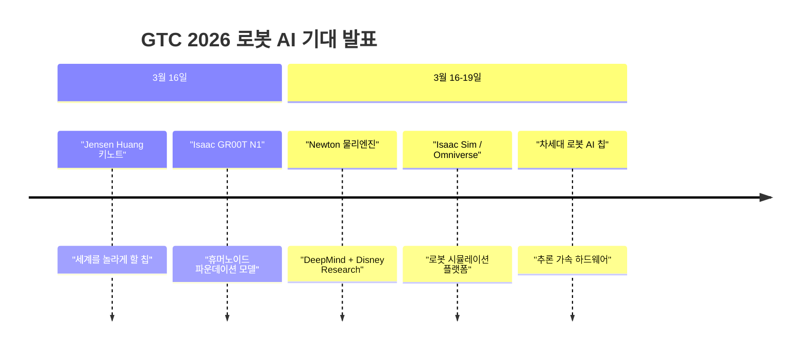
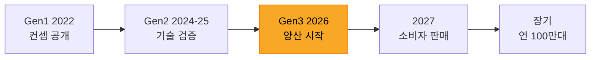
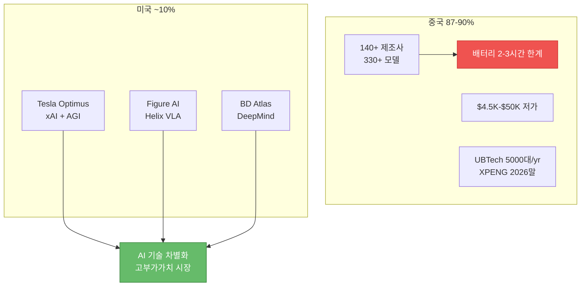

> **관련 글**: [2026년 투자 섹터 전망 (전체)](/knowledge/invest/2026/01/20/investment-sectors-outlook-2026.html) | [자동차/로봇 섹터 전망](/knowledge/invest/2026/01/21/automotive-robotics-sector-outlook-2026.html)

2026년 5월 5일 기준, 로봇 섹터는 **"피지컬 AI 본격화"** 단계로 진입했습니다. **FSD 100억 마일 달성**(5/3)으로 Tesla의 비감독 자율주행 기준점이 충족되었고, **로보택시가 오스틴 22대, 달라스 5대, 휴스턴 6대** 실운행 중입니다. 중국은 **84.7% 점유 + 올해 7~8배 생산 증가**로 물량 공세를 가속하고 있으며, **6월 코엑스 로봇 이벤트(6/10)**에서 한국 부품주 수주 뉴스 발표가 기대됩니다. **AI 인프라 → 전력 수요 → 조선 수혜** 연결 고리도 부각되고 있습니다.

## 5월 5일 핵심 업데이트

| 날짜 | 이벤트 | 투자 영향 |
|------|--------|---------|
| **5/3** | **FSD 100억 마일 달성** | 비감독 자율주행 기준점 충족, 로보택시 확장 가속 |
| **5/5** | **로보택시 실운행: 오스틴 22대, 달라스 5대, 휴스턴 6대** | 상용화 단계 진입 확인 |
| **5/5** | **중국 로봇 84.7% 점유 + 7~8배 생산** | 물량 공세, AI 차별화 필수 |
| **6/10** | **코엑스 로봇 이벤트** | 한국 부품주(SPG, 로보티즈, 하이젠) 수주 뉴스 기대 |

---

## 핵심 동향 요약

| 항목 | 내용 | 투자 영향 |
|------|------|---------|
| **FSD 100억 마일 (5/3)** | **비감독 자율주행 기준점** 충족, 530만 마일당 충돌 1건 | 로보택시 확장 가속 |
| **로보택시 실운행** | 오스틴 22대, 달라스 5대, 휴스턴 6대 | 상용화 단계 진입 확인 |
| **사이버캡 양산** | **3만달러 미만** 양산 진행 중 | 로보택시 네트워크 수익화 |
| **현대차 피지컬 AI** | BD 아틀라스 보유, 자율주행 레벨 2.5~3.5 | 테슬라 다음 자율주행 경쟁력 |
| **중국 84.7%** | **7~8배 생산 증가**, 140+ 제조사 | 저가 물량 공세, AI 차별화 필수 |
| **6월 코엑스 이벤트** | **6/10** 수주 뉴스 발표 기대 | 한국 부품주 모멘텀 |
| **한국 부품주** | **SPG**(감속기·액추에이터), **로보티즈**, **하이젠 R&M** | 로봇 핵심 부품 수혜 |
| **AI인프라→전력→조선** | 가스터빈 부족 → 선박엔진 대안 | 삼성중공업 FLNG 18조 기대 |
| **BOTZ ETF** | **$38.38** (-0.57%) | 모빌리티/로봇 비중 7%→8% |
| **BD Atlas** | 2026 매진, 2028 3만대 | DeepMind 통합, AI 로봇 최강 |
| **산업용 로봇** | 설치 **$16.7B 사상 최고** | AI 로봇 2030 **$124.8B** (CAGR 38.5%) |

---

## GTC 2026 -- D-9, 로봇 AI 최대 카탈리스트 (3/16-19)

| 항목 | 내용 |
|------|------|
| **일정** | **3/16~19 (D-9)** |
| **Isaac GR00T N1** | 휴머노이드 로봇 **파운데이션 모델** -- 범용 로봇 AI 기반 |
| **Newton 물리엔진** | **Google DeepMind + Disney Research** 공동 개발, Sim2Real 혁신 |
| **키노트** | Jensen Huang: "세계를 놀라게 할 칩" |

**Isaac GR00T N1**이 공개되면 로봇 학습의 패러다임이 변합니다. 개별 작업 학습이 아닌 **사전 학습된 범용 모델 위에 파인튜닝**하는 방식으로 전환되어, 모든 휴머노이드 개발사(Tesla, Figure AI, BD, 중국 업체 포함)가 활용할 수 있는 인프라가 됩니다. **Newton 물리엔진**은 시뮬레이션 정확도를 대폭 개선하여, 가상 환경에서 학습한 로봇이 현실에서도 동일하게 작동하는 **Sim2Real** 격차를 줄이는 핵심입니다.

**GTC는 로봇 섹터 전체의 단기 모멘텀을 좌우할 이벤트입니다.**

---

## 옵티머스 Gen3 -- 양산 시작, 그러나 "학습 중"

### 현재 상태 (3월 7일)

| 항목 | 내용 |
|------|------|
| **Gen3 양산** | 프리몬트 공장 양산 시작 (Model S/X 라인 전환) |
| **Gen3 손** | **50 액추에이터, 22 자유도** -- 인간 수준 정밀 작업 가능 설계 |
| **현재 단계** | **학습 및 데이터 수집 -- "유용한 작업은 아직 수행하지 않음"** |
| **CapEx** | **$20B** (전년 대비 **2배+**) |
| **소비자 판매** | **2027년 목표** (머스크 발언) |
| **AGI 선언** | "테슬라가 휴머노이드 형태의 AGI를 최초로 구축" (3/4) |

### Gen3 손 -- 50 액추에이터, 22 자유도

Gen3의 손은 이전 세대 대비 획기적으로 개선되었습니다. **50개의 액추에이터와 22 자유도(DoF)**로, 인간 손에 근접한 정밀 조작이 가능한 설계입니다. 이는 단순 그리핑을 넘어 부품 조립, 도구 사용, 섬세한 물체 핸들링에 필요한 수준입니다.

### 투자 시사점

1. **"유용한 작업 미수행"은 솔직한 현실 인정**: 양산은 시작했지만 실용 단계까지는 거리가 있음. 단기 수익화 기대는 시기상조
2. **$20B CapEx는 올인 신호**: 전년 대비 2배 이상 투자. Model S/X 라인 전환으로 "되돌릴 수 없는" 결정
3. **AGI 선언(3/4)은 장기 비전**: 머스크가 "휴머노이드 AGI"를 명시적으로 언급한 것은 로봇을 Tesla의 궁극적 미래로 포지셔닝하는 것
4. **2027 소비자 판매 목표**: 머스크 일정은 지연 이력 있으나, 양산 인프라가 갖춰진 상태에서의 목표이므로 이전보다 신뢰도 상승

---

## Figure AI -- Helix VLA + BMW 실전 배치

### Figure 03 + Helix AI

| 항목 | 내용 |
|------|------|
| **Figure 03** | **완전 재설계**, 업계 최고 평가 (2025년 10월) |
| **Helix AI** | **최초의 VLA(Vision-Language-Action) 모델** -- 전신 연속 제어 |
| **핵심 차별화** | 비전+언어+행동을 하나의 모델로 통합, 실시간 전신 제어 |
| **24/7 운영** | 배터리 부족 시 자동 도킹, 로봇 핸드오프 시스템 |

**Helix AI**는 Figure AI의 핵심 기술 차별화입니다. 기존 로봇 AI가 개별 모듈(시각, 판단, 제어)을 분리 처리했다면, Helix는 **시각-언어-행동(VLA)을 하나의 모델**로 통합하여 **전신의 연속적 제어**를 구현합니다. 이는 산업 현장에서 사전에 프로그래밍하지 않은 작업도 자연어 지시로 수행할 수 있는 가능성을 열어줍니다.

### BMW 공장 배치 현황

| 지표 | 수치 |
|------|------|
| **배치 공장** | **BMW 스파르탄버그** (활성 배치 중) |
| **BotQ 시설** | 연 **12,000대** 생산 용량 |
| **4년 목표** | **100,000대** |
| **확대 계획** | BMW 라이프치히 (2027년 2월) |

### 투자 시사점

1. **Helix VLA는 기술적 리더십 확보**: 전신 연속 제어 VLA 모델은 업계 최초. Tesla xAI, BD DeepMind와 차별화
2. **BMW 스파르탄버그 활성 배치**: 실전 데이터가 계속 축적되는 선순환 구조
3. **BotQ 연 12,000대**: 휴머노이드 전용 양산 시설. 비상장이지만 IPO 시 핵심 가치

---

## 중국 -- 84.7% 글로벌 점유, 올해 7~8배 생산 증가

### 핵심 현황 (5월 5일 업데이트)

| 항목 | 내용 |
|------|------|
| **글로벌 점유율** | **84.7%** (2026년 기준) |
| **생산 증가** | 올해 **7~8배** 생산 증가 |
| **제조사** | **140개 이상** |
| **제품 모델** | **330개 이상** |
| **UBTech** | 2026년 목표 **5,000대** |
| **XPENG** | 대량 생산 목표 **2026년 말** |
| **FSD 경쟁** | 샤오미 VLA 2.0 (하루 3,000만km 가상 데이터), 엔비디아 코스모스 |
| **최대 병목** | **배터리 수명 2-3시간** (산업용 확장의 가장 큰 장벽) |

### 중국 vs 미국 경쟁 구도

### 배터리 2-3시간 -- 산업용 확장의 최대 병목

중국 휴머노이드의 **배터리 수명은 2-3시간**으로, 이는 산업 현장에서의 실용성을 크게 제한합니다. 8시간 교대근무를 대체하려면 최소 2-3회의 충전/교체가 필요하며, 이는 **다운타임 증가 + 충전 인프라 비용**으로 이어져 ROI를 낮춥니다. Figure AI의 자동 도킹 시스템이 이 문제를 일부 해결하지만, 근본적으로 배터리 기술 혁신이 필요한 영역입니다.

### 투자 시사점

1. **87-90%는 이전 추정치(80%+)보다 높음**: 중국 압도적 우위가 더 명확해짐
2. **140+ 제조사는 과잉 경쟁**: 결국 소수 승자로 수렴할 것. 현재는 양적 성장기
3. **배터리 한계가 미국 기업에 기회**: AI 기술로 짧은 가동 시간 내 높은 생산성을 달성하면 가격이 아닌 가치로 경쟁 가능
4. **XPENG 2026말 양산 진입**: 자동차-로봇 수직통합(Tesla 모델 추종) 주시 필요

---

## 보스턴다이나믹스 Atlas -- 2026 매진 + DeepMind

### 핵심 현황

| 항목 | 내용 |
|------|------|
| **Atlas 상용 런칭** | CES 2026에서 공식 런칭 |
| **2026 배치** | **전량 매진** |
| **2028 목표** | **30,000대** |
| **AI 통합** | **Google DeepMind 파운데이션 모델** |
| **미국 투자** | **$260억** (공장 건설 포함) |
| **기업가치** | ~55조원 |

### 현대차 투자 계획

| 항목 | 내용 |
|------|------|
| **2026-2030 투자** | **50.5조원 ($35B)** |
| **미국 투자** | **$260억** (공장 건설 포함) |
| **Waymo + IONIQ 5** | 6세대 플랫폼 도로 테스트 |

### 투자 시사점

1. **2026 전량 매진 = 수요 > 공급 확인**: 상업적 성공의 가장 강력한 초기 신호
2. **DeepMind 통합 = AI 로봇 최강**: Google AI + BD 하드웨어 조합은 Tesla xAI + Optimus와 양대 축
3. **현대차 P/E 6-8x**: BD 55조원 가치가 시가총액에 충분히 반영되지 않은 저평가 상태

---

## 글로벌 로봇 시장 데이터

### 시장 규모

| 지표 | 수치 |
|------|------|
| **산업용 로봇 설치** | **$16.7B** (사상 최고) |
| **2026년 로봇 시장** | **$244.3B** |
| **2034년 로봇 시장** | **$773.6B** (CAGR 15.5%) |
| **AI 로봇 시장 2030** | **$124.77B** (CAGR 38.5%) |

### 산업 트렌드

| 트렌드 | 내용 |
|--------|------|
| **AI 기반 비전 시스템** | 로봇 인식 능력 대폭 향상, 비정형 환경 대응 |
| **예측 정비** | AI로 고장 사전 감지, 다운타임 최소화 |
| **RaaS** | Robots-as-a-Service, 초기 투자 부담 해소 → 중소기업 도입 가속 |
| **아시아-태평양** | 글로벌 시장의 **48.7%** 점유 |

### 세그먼트별 전망

| 카테고리 | CAGR | 핵심 동력 |
|----------|------|----------|
| **AI 로봇** | **38.5%** | 최고 성장. Tesla/BD/Figure AI |
| **휴머노이드** | **38.5%** | 대량 생산 시대 진입 |
| 협동로봇 | 20%+ | 중소기업 자동화 |
| 산업용 | 6.2% | 제조업 자동화 |
| **로봇 AI/SW** | **30%+** | 최고 마진. NVIDIA, xAI, DeepMind |

---

## 한국 로봇 기업

### 부품주 (5/5 신규 부각) -- 6월 코엑스 모멘텀

| 종목 | 핵심 포인트 | 기대 이벤트 |
|------|------------|------------|
| **SPG** | 감속기·액추에이터 — 로봇 핵심 구동 부품 | 6/10 코엑스 수주 뉴스 |
| **로보티즈** | 액추에이터 전문, 국내 로봇 부품 선두 | 6/10 코엑스 수주 뉴스 |
| **하이젠 R&M** | 스마트 액추에이터 | 6/10 코엑스 수주 뉴스 |

> **6월 코엑스 로봇 이벤트(6/10)**: 수주 뉴스 발표가 기대되는 한국 최대 로봇 행사. 이벤트 전후로 부품주 모멘텀 상승 가능.

### 로봇 SW 애프터 서비스 수혜

| 종목 | 수혜 포인트 |
|------|-----------|
| **현대오토에버** | 현대차 BD 아틀라스 연계 로봇 SW |
| **삼성SDS** | 삼성전자 레인보우로보틱스 연계 |
| **LG CNS** | LG 계열 로봇 솔루션 |

### 삼성전자 -- 레인보우로보틱스 자회사

| 항목 | 내용 |
|------|------|
| 지분율 | **35%** (최대주주) |
| 상태 | **자회사 편입** |
| 시사점 | 삼성 자금력/제조 노하우 + 국내 유일 이족보행 기술 |

### 두산로보틱스 -- CES 최고혁신상

| 항목 | 내용 |
|------|------|
| CES 2026 | **AI 최고혁신상** |
| 글로벌 순위 | **Top 10** |
| 과제 | 매출 성장 + 흑자 전환 시점 |

### 한화 -- 로봇/방산 복합

| 항목 | 내용 |
|------|------|
| 로봇 | 한화로보틱스 (협동로봇) |
| 차별화 | 로봇+방산 모두 보유한 유일한 한국 대기업 |

---

## 관련 종목 분석 (5월 5일)

### 공격형 (기대감)
| 종목 | 티커 | 핵심 포인트 | 리스크 |
|------|------|------------|--------|
| 현대차 | 005380 | BD 아틀라스, 자율주행 2.5~3.5, 피지컬 AI | 로봇 수익화 시점 |
| 두산로보틱스 | 454910 | CES 최고혁신상, Top 10 | 적자, 매출 |
| 레인보우로보틱스 | 277810 | 삼성 자회사, 이족보행 | 로봇 사업 초기 |
| 테슬라 | TSLA | FSD 100억 마일, 로보택시 33대 실운행, 사이버캡 $3만 | 중국 FSD 경쟁 |

### 안정형 (실적)
| 종목 | 티커 | 핵심 포인트 | 리스크 |
|------|------|------------|--------|
| SPG | - | 감속기·액추에이터 핵심 부품 | 수주 집중 |
| 로보티즈 | 108490 | 액추에이터 전문 | 매출 규모 |
| 하이젠 R&M | - | 스마트 액추에이터 | 중국 경쟁 |

### ETF
| ETF | 현재가 | 특징 |
|-----|--------|------|
| BOTZ | $38.38 | 글로벌 로봇/AI 분산 |
| KODEX 로봇 | - | 한국 로봇 집중 |

---

## 투자 전략 (5월 5일)

### 포트폴리오 배분

| 구분 | 비중 | 종목 | 핵심 근거 |
|------|------|------|-----------|
| 핵심 | 25% | 현대차 | BD 아틀라스 + 자율주행 2.5~3.5 + 피지컬 AI |
| 핵심 | 25% | 테슬라 | FSD 100억 마일 + 로보택시 33대 실운행 + 사이버캡 $3만 |
| AI 인프라 | 20% | 엔비디아 | 코스모스 물리엔진, 로봇 AI 인프라 |
| 한국 부품주 | 15% | SPG, 로보티즈, 하이젠 R&M | 6/10 코엑스 이벤트 + 실적 수혜 |
| 테마 | 10% | 두산로보틱스, 한화, 레인보우로보틱스 | 한국 로봇 테마 |
| ETF | 5% | BOTZ $38.38, KODEX 로봇 | 분산 투자 |

### 핵심 모니터링 포인트

1. **6/10 코엑스 로봇 이벤트** -- 한국 부품주(SPG, 로보티즈, 하이젠) 수주 뉴스 발표
2. **로보택시 운행 대수 확장** -- 현재 33대(오스틴 22+달라스 5+휴스턴 6) → 추가 도시 확장
3. **FSD 구독자 확대** -- 128만명(12%)에서 성장 속도
4. **중국 로봇 7~8배 생산** -- AI 차별화 없이는 한국/미국 기업 경쟁 어려움
5. **BD Atlas 2028 3만대 생산** -- 현대차 피지컬 AI 수익화 시점
6. **AI인프라→전력→조선 연결** -- 삼성중공업 FLNG 18조 수주 여부

---

## 리스크 요인

### 1. 중국 87-90% 글로벌 점유 (현실화 / 최고)
140+ 제조사, 330+ 모델로 시장 압도. EV에서의 BYD 패턴과 동일. **배터리 2-3시간 한계**가 유일한 제약이나, 이를 해결하면 고부가가치 시장까지 침투.

### 2. 옵티머스 "학습 중" 상태 (확률: 높음 / 영향: 높음)
양산은 시작했으나 **유용한 작업은 아직 미수행**. 머스크의 AGI 선언과 현재 기술 수준 사이의 간극이 큼. 2027 판매 목표 달성 여부가 핵심.

### 3. GTC 기대 미충족 (확률: 낮음 / 영향: 높음)
Isaac GR00T N1이 기대 이하일 경우 로봇 섹터 전반 조정. 단, NVIDIA의 GTC 트랙 레코드상 가능성 낮음.

### 4. 밸류에이션 과열 (확률: 중 / 영향: 중)
로봇 기업 대부분 적자 상태에서 높은 밸류에이션. 실적 미동반 시 조정 불가피.

### 5. 기술 격차 -- 한국 vs 미국 (확률: 중 / 영향: 중)
삼성(레인보우), 현대(BD)의 자체 AI 역량은 Tesla(xAI), Figure(Helix)에 비해 열위. BD는 DeepMind로 보완하지만, 레인보우는 AI 파트너 미확보.

---

## 결론

### 로봇 섹터 핵심 판단 (5월 5일)

| 항목 | 판단 |
|------|------|
| 전반적 전망 | **Strong Bullish** — 피지컬 AI 본격화, FSD 100억 마일 + 로보택시 실운행 |
| 단기 촉매 | **6/10 코엑스 로봇 이벤트** (한국 부품주 수주 뉴스) |
| 최선호주 | 현대차 (BD 아틀라스 + 피지컬 AI + P/E 6-8x) |
| 차선호주 | 테슬라 (FSD 100억 마일 + 로보택시 33대 + 사이버캡 $3만) |
| 한국 부품주 | SPG, 로보티즈, 하이젠 R&M (6/10 코엑스 모멘텀) |
| ETF | BOTZ $38.38, KODEX 로봇 |

### 핵심 메시지

1. **FSD 100억 마일(5/3) — 비감독 자율주행의 새 시대**: 530만 마일당 충돌 1건 = 미국 평균 8배 안전. 머스크가 설정한 기준점 충족으로 로보택시 본격 확장의 법적·기술적 근거 마련

2. **로보택시 실운행(33대) — 상용화 단계 진입**: 오스틴 22대, 달라스 5대, 휴스턴 6대로 개념 검증 완료. FSD 구독자 128만명(12%)은 잠재 시장의 시작일 뿐

3. **중국 84.7% + 7~8배 생산 — AI 차별화 필수**: 배터리 2~3시간 한계가 유일한 제약. 이 한계를 AI 효율로 극복하면 고부가가치 시장까지 침투. 미국/한국 기업은 AI 차별화 없이는 경쟁 어려움

4. **6월 코엑스 이벤트(6/10) — 한국 부품주 단기 모멘텀**: SPG, 로보티즈, 하이젠 R&M 등 부품주의 수주 뉴스 발표 기대. 이벤트 전후 포지션 관리 필요

5. **AI인프라 → 전력 → 조선 연결 수혜**: 가스터빈 공급 부족 → 선박엔진이 온사이트 파워 대안으로 부상. 삼성중공업 FLNG 최대 18조 수주 기대가 로봇/AI 섹터의 새로운 수혜 경로

6. **현대차 피지컬 AI — 저평가 재확인**: BD 아틀라스 보유, 자율주행 레벨 2.5~3.5(테슬라 다음), P/E 6-8x 저평가. 피지컬 AI 본격화 수혜 핵심 종목

---

*본 글은 투자 권유가 아닌 정보 제공 목적으로 작성되었습니다. 투자 결정은 본인의 판단과 책임하에 이루어져야 합니다. (2026년 5월 5일 업데이트)*
