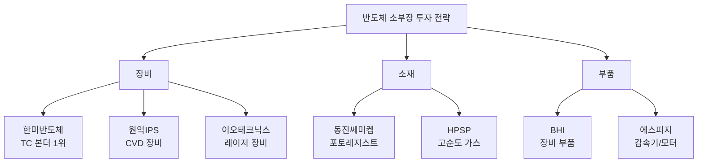

> **관련 글**: [2026년 투자 섹터 전망 (전체)](/knowledge/invest/2026/01/20/investment-sectors-outlook-2026.html) | [반도체 섹터 전망](/knowledge/invest/2026/01/21/semiconductor-sector-outlook-2026.html)

2026년은 반도체 산업의 슈퍼사이클이 본격화되는 해입니다. SK하이닉스와 삼성전자의 대규모 투자가 집행되면서 소부장(소재·부품·장비) 섹터에 대한 관심이 그 어느 때보다 높아지고 있습니다. 이 글에서는 반도체 소부장 섹터의 투자 전망과 관련 종목을 상세히 분석합니다.

## 시장 현황: 메모리 슈퍼사이클과 소부장 수혜

### 반도체 호황의 수혜

세계반도체무역통계기구(WSTS)는 2026년 글로벌 반도체 시장이 전년 대비 25% 이상 성장해 약 9,750억 달러에 이를 것으로 전망합니다. 특히 메모리 부문은 30%대의 성장이 예상되며, BofA(뱅크오브아메리카)는 2026년을 "1990년대 호황기와 유사한 슈퍼사이클"로 정의했습니다.

HBM 시장은 더욱 가파른 성장이 예상됩니다. BofA는 2026년 HBM 시장 규모를 전년 대비 58% 증가한 546억 달러로 추산했으며, 2025년부터 2030년까지 연평균 33%의 성장률이 예상됩니다.

### SK하이닉스 청주 19조원 패키징 공장 투자

SK하이닉스는 급증하는 AI 반도체 수요에 대응해 충북 청주에 19조원 규모의 최첨단 패키징 공장 'P&T7'을 건설합니다.

| 항목 | 내용 |
|------|------|
| 투자 규모 | 약 19조원 (130억 달러) |
| 위치 | 청주 테크노폴리스 산업단지 |
| 부지 규모 | 약 7만 평 |
| 착공 | 2026년 4월 |
| 완공 | 2027년 말 |
| 용도 | HBM 등 AI 메모리용 첨단 패키징 |

이 외에도 SK하이닉스는 2026년 설비투자(CapEx)를 30조원대 중반까지 확대할 계획이며, 청주 M15X 팹에 20조원 이상을 투입해 HBM3E와 HBM4 생산 거점으로 육성합니다. 미국 인디애나주에도 약 5.6조원 규모의 AI 메모리 패키징 시설을 건설해 2028년 가동을 목표로 합니다.

### 메모리 투자 확대와 소재/장비 업체 실적 개선

삼성전자와 SK하이닉스의 메모리 투자 재개로 내년 증설 규모가 각각 110K, 100K에 달할 것으로 전망됩니다. AI 수요 폭증에 따른 메모리 공급 부족 속에서 2027년까지 증설 사이클이 이어질 것으로 예상되며, 이에 따라 소재 및 장비 업체들의 실적 개선이 본격화될 전망입니다.

## 관련 종목 상세 분석

| 종목 | 티커 | 시장 | 사업영역 | 투자 포인트 |
|------|------|------|---------|------------|
| HPSP | 403870 | KOSDAQ | 고순도 공정 가스 | HBM 패키징 수혜, 고압수소 어닐링 장비 |
| BHI | 083650 | KOSDAQ | 반도체 부품 | 장비 부품 국산화, 삼성전자 협력사 |
| 에스피지 | 058610 | KOSDAQ | 반도체 장비 | 감속기/모터 전문, HBM 장비 핵심 부품 |
| 한미반도체 | 042700 | KOSPI | 본딩 장비 | HBM TC 본더 세계 점유율 71.2% |
| 이오테크닉스 | 039030 | KOSDAQ | 레이저 장비 | 하이브리드 본딩용 레이저 다이싱 |
| 피에스케이 | 319660 | KOSDAQ | 반도체 장비 | Dry Strip 세계 점유율 40% |
| 원익IPS | 240810 | KOSDAQ | CVD 장비 | 삼성전자 주요 공급사, 메모리/비메모리 모두 납품 |
| 동진쎄미켐 | 005290 | KOSPI | 반도체 소재 | EUV 포토레지스트, 미국 테일러 공장 수혜 |

### 한미반도체: HBM 패키징의 절대 강자

테크인사이츠에 따르면 2025년 3분기 기준 글로벌 HBM용 TC 본더 시장에서 한미반도체의 점유율은 **71.2%**에 달합니다. 사실상 HBM 양산 라인의 '표준 장비'로 자리매김했다는 평가입니다.

한미반도체는 인천 주안국가산업단지에 총 1,000억원을 투자해 하이브리드 본더 팩토리를 건립 중이며, 2026년 말 완공을 목표로 합니다. HBM용 TC 본더 시장은 2026년부터 다시 반등해 2030년까지 연평균 약 13%의 성장률(CAGR)을 기록할 것으로 전망됩니다.

### 원익IPS: 메모리 증설 사이클의 핵심 수혜주

원익IPS는 삼성전자 메모리와 비메모리, SK하이닉스 메모리 부문 모두에 납품하는 핵심 장비 공급사입니다. DRAM 단위당 수주 금액이 400억~500억원 수준으로 밸류체인 내 비중이 큽니다.

2026년 실적 전망은 다음과 같습니다:
- **매출**: 1조 3,230억원 (YoY +40.7%)
- **영업이익**: 1,690억원 (YoY +87.7%)

삼성전자 테일러 팹 관련 매출은 2026년 3분기부터 반영될 것으로 예상되며, NH투자증권은 목표가 53,000원을 제시했습니다.

### 동진쎄미켐: 2026년 퀀텀 점프 예고

국내 대표 반도체 소재 기업 동진쎄미켐은 2026년을 '글로벌 성장 가시화 원년'으로 정의했습니다. 주요 성장 동력은 다음과 같습니다:

1. **삼성전자 미국 테일러 공장 연계**: 미국 신너 법인이 2026년 2분기부터 평가용 샘플 출하 시작
2. **미국 황산 합작 법인**: 주요 고객사들과 샘플 평가 진행 중, 2026년부터 양산 매출 발생 전망
3. **차세대 기술 개발**: EUV 공정용 신규 소재, HBM 공정용 소재, 첨단 패키징 소재 등

김재현 사업부문장은 "2026년부터는 반도체 경기 상승과 고객사의 증설 효과가 맞물리면서 큰 폭의 성장을 기대하고 있다"고 밝혔습니다.

### 이오테크닉스: 하이브리드 본딩의 숨은 수혜주

이오테크닉스의 '레이저 스텔스 다이싱' 장비가 하이브리드 본딩 공정에 투입될 것으로 전망됩니다. 비접촉 방식으로 작업을 진행하며, 레이저 에너지로 웨이퍼를 절삭해 칩의 손상이 상대적으로 적다는 평가를 받습니다.

하이브리드 본딩은 범프 없이 칩을 접착시키는 차세대 패키징 기술로, HBM4E 이후 도입될 것으로 전망됩니다.

## 카테고리별 분류

### 1. 소재

| 종목 | 주요 제품 | 특징 |
|------|---------|------|
| HPSP | 고순도 공정 가스 | 고압수소 어닐링 장비 선두 |
| 피에스케이 | 반도체 전공정 장비 | Dry Strip 세계 점유율 40% |
| 동진쎄미켐 | 포토레지스트, 반사방지막 | EUV용 첨단 소재 개발 |

### 2. 부품

| 종목 | 주요 제품 | 특징 |
|------|---------|------|
| BHI | 반도체 장비 부품 | 삼성전자 협력사, 부품 국산화 |
| 마이크로투나노 | 미세 가공 부품 | 초정밀 가공 기술 |

### 3. 장비

| 종목 | 주요 제품 | 특징 |
|------|---------|------|
| 에스피지 | 감속기, 모터 | 반도체 장비 핵심 구동부 |
| 한미반도체 | TC 본더 | HBM 패키징 세계 1위 |
| 이오테크닉스 | 레이저 장비 | 패키징/마킹용 레이저 |
| 원익IPS | CVD 장비 | 삼성/하이닉스 동시 납품 |

## 투자 전략

### 대형주 고점 부담 시 소부장 대안

삼성전자, SK하이닉스 등 대형주의 밸류에이션 부담이 높아지는 시점에서 소부장 섹터는 매력적인 대안이 될 수 있습니다. 특히 실적 가시성이 높고 성장 모멘텀이 명확한 종목에 주목할 필요가 있습니다.

### HBM 패키징 관련 장비주 주목

HBM 시장의 폭발적 성장에 따라 패키징 장비 수요가 급증하고 있습니다. 한미반도체의 TC 본더, 이오테크닉스의 레이저 다이싱 장비 등 HBM 패키징에 필수적인 장비를 보유한 기업들이 수혜를 볼 것으로 예상됩니다.

### 국산화 수혜 기업 선별

반도체 공급망 안정화 정책에 따라 장비 및 부품의 국산화가 가속화되고 있습니다. 기존에 해외 의존도가 높았던 영역에서 국산화를 이뤄낸 기업들에 주목할 필요가 있습니다.

### 핵심 투자 포인트

## 리스크 요인

### 1. 대형주 조정 시 소부장 동반 조정

소부장 섹터는 반도체 대형주의 실적 및 주가에 연동되는 경향이 있습니다. 삼성전자나 SK하이닉스의 주가가 조정을 받을 경우 소부장 종목들도 동반 조정을 받을 수 있습니다.

### 2. 밸류에이션 과열 가능성

HBM 관련 기대감이 선반영되면서 일부 종목의 밸류에이션이 과열될 수 있습니다. 실적 대비 주가 수준을 지속적으로 점검할 필요가 있습니다.

### 3. 신규 진입 경쟁 심화

소부장 시장의 성장성이 부각되면서 신규 진입자들의 경쟁이 심화될 수 있습니다. 특히 중국 업체들의 기술 추격에 따른 시장 점유율 변화를 주시해야 합니다.

### 4. 기술 변화 리스크

하이브리드 본딩 등 차세대 기술 도입 시점에 따라 기존 장비 업체들의 수혜 정도가 달라질 수 있습니다. 기술 변화에 대응할 수 있는 R&D 역량을 갖춘 기업 선별이 중요합니다.

## 결론

2026년 반도체 소부장 섹터는 메모리 슈퍼사이클과 HBM 수요 급증의 최대 수혜 섹터로 부상하고 있습니다. SK하이닉스의 19조원 청주 패키징 공장 투자를 비롯한 대규모 설비 투자가 집행되면서 장비 및 소재 업체들의 실적 개선이 본격화될 전망입니다.

투자 시에는 실적 가시성이 높고 기술 경쟁력을 갖춘 기업을 선별하는 것이 중요합니다. 특히 HBM 패키징 관련 장비주(한미반도체, 이오테크닉스), 메모리 증설 수혜 장비주(원익IPS), 첨단 소재 업체(동진쎄미켐, HPSP)에 주목할 필요가 있습니다.

다만, 밸류에이션 과열과 대형주 연동 리스크에 유의하며 분할 매수 전략을 활용하는 것이 바람직합니다.

---

**면책 조항**: 이 글은 투자 정보 제공 목적으로 작성되었으며, 특정 종목의 매수 또는 매도를 권유하지 않습니다. 투자 결정은 본인의 판단과 책임 하에 이루어져야 합니다.
