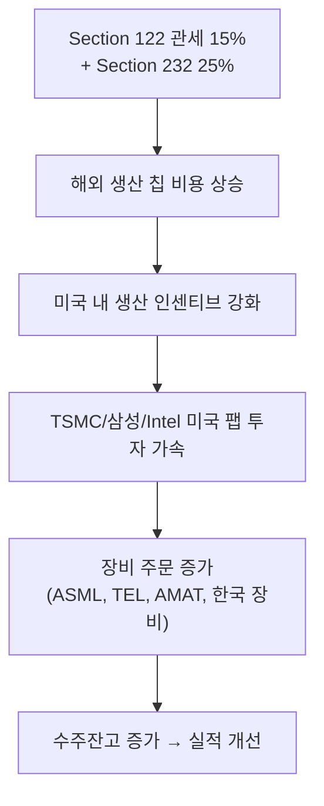

> **관련 글**: [2026년 투자 섹터 전망 (전체)](/knowledge/invest/2026/01/20/investment-sectors-outlook-2026.html) | [반도체 섹터 전망](/knowledge/invest/2026/01/21/semiconductor-sector-outlook-2026.html) | [파운드리 섹터 전망](/knowledge/invest/2026/01/21/foundry-sector-outlook-2026.html)

## 핵심 요약

2026년 소부장 섹터는 **ASML 기록적 수주 + 첨단 패키징 진출 + HBM4 양산 가속 + 글로벌 $975B 기가사이클**이 동시에 작용하는 강력한 모멘텀 국면입니다. ASML은 EUV 노광 장비를 넘어 **첨단 패키징 장비 시장 진출**을 탐색(3/2)하고 있으며, 이는 TAM 확대의 새로운 동력입니다.

---

## 3월 4일 핵심 업데이트

| 날짜 | 이벤트 | 소부장 영향 |
|------|--------|-----------|
| **3/3** | **블랙 튜즈데이 — KOSPI -7.24% 폭락** | 반도체 장비주 동반 급락, **그러나 구조적 수요(HBM4 양산, $975B 기가사이클, ASML 백로그 $388B)에는 변화 없음** |
| **3/3** | **삼성 -9.88%, SK하이닉스 -11.50%** | 고객사 급락이나 CapEx 축소 신호 없음, 장비 수주 사이클 영향 제한적 |

**투자 시사점**: 블랙 튜즈데이의 주가 급락은 관세·지정학 충격에 의한 시장 전체 급락이며, 반도체 소부장의 **구조적 수요 기반(HBM4 양산 가속, 삼성 Q1 OP 30조, SK하이닉스 CapEx 30조대, ASML 백로그 $388B)**은 그대로 유지되고 있습니다. 주가 급락으로 밸류에이션 부담이 해소되면서 오히려 매수 기회가 될 수 있습니다.

---

## 3월 핵심 업데이트

| 날짜 | 이벤트 | 소부장 영향 |
|------|--------|-----------|
| **3/2** | **ASML 첨단 패키징 장비 시장 진출 탐색** | TAM 확대, EUV 넘어 후공정 진출 |
| **3/3** | **SK하이닉스 목표가 일제 상향 (130-150만원)** | 장비 수주 사이클 연장 근거 |
| **3/3** | **삼성 Q1 OP 30조 전망** | 대규모 CapEx 집행 지속 |
| 2월 | ASML Q1 주문 **€132B(기록)**, 백로그 **$388B** | EUV 수요 사상 최대 |
| 2월 | **TEL FY2026 매출 2.6조엔(기록)**, Q3 YoY -15.7% | 일본 장비 업체 혼조세 |
| 2월 | High-NA EUV 2027-28 배치 경쟁 | Intel/Samsung/SK/TSMC 동시 추진 |
| 2/12 | 삼성 HBM4 출하 개시 | TC 본더, 어닐링, 테스트 장비 수요 |
| 2/12 | SK하이닉스 HBF 아키텍처 공개 | 후공정 장비 TAM 확대 |

---

## ASML: 기록적 수주 + 첨단 패키징 진출

### 핵심 수치

| 항목 | 수치 | 비고 |
|------|------|------|
| **Q1 주문** | **€132B** | **기록적 수준** |
| **누적 백로그** | **$388B** | **사상 최대** |
| EUV 지위 | **유일 공급자** | 독점 |
| **첨단 패키징 진출** | **3/2 탐색 보도** | TAM 확대 |

### 첨단 패키징 장비 시장 진출 (3/2)

ASML이 기존 EUV 노광 장비를 넘어 **첨단 패키징(Advanced Packaging) 장비 시장 진출**을 탐색하고 있습니다. HBM, CoWoS, 하이브리드 본딩 등 후공정 패키징의 중요성이 급증하면서, ASML이 리소그래피 기술을 패키징 공정에도 적용하려는 움직임입니다.

**투자 시사점**:
- ASML의 TAM이 전공정(리소그래피)에서 후공정(패키징)으로 확대
- 기존 후공정 장비 업체(한미반도체, HPSP 등)와의 경쟁/협력 관계 변화 가능
- 장기적으로 ASML의 매출 성장 동력 추가

### 기록적 수주의 배경

1. **AI 칩 수요 폭발**: 글로벌 반도체 $975B → EUV 수요 급증
2. **미국 팹 투자 가속**: TSMC $165B + 삼성 $389억 + Intel → 장비 주문 직결
3. **첨단 공정 경쟁**: TSMC 2nm + 삼성 2nm + Intel 18A → 다중 EUV 수요
4. **관세 효과**: 미국 내 팹 건설 인센티브 → 추가 장비 수주

---

## Tokyo Electron (TEL): 매출 기록 + 분기 혼조

| 항목 | 수치 | 비고 |
|------|------|------|
| **FY2026 매출 가이던스** | **2.6조엔 (기록)** | |
| **Q3 매출** | | **YoY -15.7%** |
| 포지션 | 글로벌 장비 2위 | ASML 다음 |

TEL은 연간 매출 가이던스가 기록적이나 Q3 분기 실적은 YoY -15.7%로 부진. 장비 업체들의 분기별 변동성이 큰 점에 유의.

---

## High-NA EUV: 2027-28년 배치 경쟁

### 배치 계획

| 업체 | 배치 전망 | 비고 |
|------|---------|------|
| **Intel** | **2027년** | 18A 공정, 수율 과제 |
| **Samsung** | **2027-28년** | 2nm GAA |
| **SK hynix** | **2027-28년** | HBM/메모리 |
| **TSMC** | **2027-28년** | N2 이후 |

High-NA EUV(0.55 NA)는 2nm 이하 공정의 핵심 장비. 4개사 동시 배치 경쟁은 ASML의 수주 파이프라인을 구조적으로 확대.

---

## HBM4 양산 가속: 후공정 장비 수요 신사이클

### 장비 수혜 분석

삼성 HBM4 출하(2/12) + SK하이닉스 M15X HBM4 양산으로 후공정 장비 수요의 **새로운 사이클** 시작.

| 장비 카테고리 | 수혜 기업 | 이유 |
|-------------|---------|------|
| **TC 본더** | **한미반도체** (71.2%) | HBM4 적층 핵심, 16단 대응 |
| **어닐링** | **HPSP** (영업이익률 55%) | 고압수소 어닐링 HBM4 필수 |
| **테스트** | **리노공업**, ISC | 첨단 패키지 테스트 소켓 |
| **레이저** | **이오테크닉스** | 하이브리드 본딩, 레이저 다이싱 |
| **CVD** | **원익IPS** | 삼성/하이닉스 동시 납품 |

### HBF: 후공정 장비 TAM 확대

SK하이닉스 HBF(High Bandwidth Flash, 2/12 공개)는 NAND를 HBM 방식으로 적층/패키징하는 새로운 아키텍처. **후공정 장비 TAM이 메모리에서 스토리지까지 확대**.

- **샘플**: H2 2026
- **양산**: 2027년
- 수혜: TC 본더, 어닐링, 테스트 장비 = HBM 장비 업체 그대로

---

## 미국 팹 투자 가속: 장비 수주 확대

| 기업 | 미국 투자 | 공정 |
|------|----------|------|
| **TSMC** | **$165B** | 3nm, 2nm |
| **삼성전자** | **$389억** | 파운드리 + 메모리 |
| **Intel** | 대규모 | 18A HVM |
| **SK하이닉스** | **$41억** | HBM |

```mermaid
flowchart TD
    A["Section 122 관세 15%<br/>+ Section 232 25%"] --> B["해외 생산 칩 비용 상승"]
    B --> C["미국 내 생산 인센티브 강화"]
    C --> D["TSMC/삼성/Intel 미국 팹 투자 가속"]
    D --> E["장비 주문 증가<br/>(ASML, TEL, AMAT, 한국 장비)"]
    E --> F["수주잔고 증가 → 실적 개선"]
```

---

## 장비 사이클 연장 시나리오

### 실적 전망이 뒷받침하는 장기 사이클

| 전망 | 내용 | 장비 영향 |
|------|------|---------|
| **삼성 Q1 OP** | ~30조원 (사상 첫) | CapEx 대규모 집행 |
| **삼성 2026 OP** | 170-201조원 | |
| **삼성 2027 OP (MS)** | 317조원 | 장비 사이클 2027년까지 연장 |
| **SK하이닉스 2026 OP** | 100-189조원 | M15X 투자 20조+ |
| **SK하이닉스 CAPEX** | 중반 30조대 | |

| 시나리오 | 피크 | 장비 수주 피크 | 전략 |
|---------|------|-------------|------|
| 기존 컨센서스 | 2026 중반 | 2026 H1 | 점진적 축소 |
| **IB 상향 (MS/노무라)** | **2027 이후** | **2026 H2~2027** | **보유 기간 연장** |

---

## 관련 종목

### 장비주

| 종목 | 핵심 투자 포인트 | 3월 업데이트 |
|------|---------------|------------|
| **ASML** | EUV 독점, Q1 €132B, 백로그 $388B | **첨단 패키징 진출 탐색 (3/2)** |
| **한미반도체** (042700) | TC 본더 71.2%, 영업이익률 50% | HBM4 출하 + 16단 → 추가 수요 |
| **HPSP** (403870) | 고압수소 어닐링 독보적, 이익률 55% | HBM4/HBF 모두 필수 |
| **리노공업** (058470) | IC 테스트 소켓 1위, 이익률 48% | 첨단 패키지 테스트 수혜 |
| **이오테크닉스** (039030) | 레이저 다이싱/본딩 | HBM4 공정 전환 수혜 |
| **ISC** (095340) | 테스트 인터커넥트 | HBM 테스트 수요 확대 |
| **원익IPS** (240810) | CVD, 삼성/하이닉스 동시 납품 | 대규모 CapEx 수혜 |
| **DB아이텍** (024950) | 후공정 패키징/테스트, PER 11배 | 저밸류 매력 |
| **TEL** (8035.TSE) | 글로벌 2위, FY2026 2.6조엔 | Q3 -15.7% 혼조 |

### 간접 투자

| 종목 | 핵심 |
|------|------|
| **SK스퀘어** (402340) | SK하이닉스 지주사 20%, 이중 할인 |

---

## 투자 전략

### 4가지 핵심 전략

**전략 1: ASML 기록적 수주 + 패키징 진출 (강화)**
- 백로그 $388B → 2-3년 매출 가시성
- 첨단 패키징 TAM 확대 → 장기 성장 동력 추가
- EUV 독점 + 가격 결정력

**전략 2: HBM4 + HBF 사이클 수혜**
- 삼성 HBM4 + SK M15X + HBF → 후공정 장비 수요 구조적 확대
- 한미반도체, HPSP, 이오테크닉스 중심
- 영업이익률 40-55% 기업 = 사이클 둔화 시에도 방어력

**전략 3: 미국 팹 투자 수혜**
- TSMC $165B + 삼성 $389억 + Intel → 장비 수주
- 관세가 미국 팹 건설 인센티브로 작용

**전략 4: 밸류에이션 분산**
- 고밸류(HPSP, 리노공업) + 저밸류(DB아이텍 PER 11배)
- SK스퀘어로 SK하이닉스 간접 투자
- ASML을 글로벌 핵심주로

---

## 핵심 모니터링

| 지표 | 의미 |
|------|------|
| **ASML 분기 수주** | €132B 유지 여부, 패키징 장비 진전 |
| **TEL 분기 실적** | Q3 부진 일시적 vs 구조적 판단 |
| **장비 기업 수주잔고** | 둔화 시작 = 가장 이른 경고 |
| **SK하이닉스/삼성 CapEx** | 투자 축소 or 연장 신호 |
| **HBF 양산 타임라인** | 구체적 일정 발표 여부 |
| **미국 팹 착공 진행** | 장비 설치 진행도 |

---

## 리스크 요인

| 리스크 | 내용 | 대응 |
|--------|------|------|
| **장비 수주 급감** | 메모리 실적보다 1-2분기 선행 | 분기 수주잔고 확인 |
| **관세 공급망 교란** | 수입 부품/소재 원가 부담 | 미국 팹 투자 수혜가 상쇄 |
| **밸류에이션 과열** | HBM 수혜 선반영 종목 주의 | 저밸류(DB아이텍) 분산 |
| **TEL 실적 부진** | Q3 -15.7% | 연간 가이던스 2.6조엔은 기록 |
| **HBF 양산 지연** | 아키텍처 공개 단계 | 양산 구체화 시점 확인 |
| **ASML 패키징 진출 불확실** | 탐색 단계 | 구체적 제품/시점 확인 |

---

## 결론

| 항목 | 내용 |
|------|------|
| **ASML** | Q1 €132B 기록, 백로그 $388B, **첨단 패키징 진출 탐색** |
| **장비 사이클** | 삼성 Q1 30조 + SK CapEx 30조대 + 2027 OP 상향 = **연장** |
| **HBM4/HBF** | 후공정 장비 수요 신사이클, TAM 확대 |
| **미국 팹** | $165B(TSMC) + $389억(삼성) → 장비 수주 확대 |
| **핵심 종목** | ASML, 한미반도체, HPSP, 리노공업, SK스퀘어 |
| **전략** | 수주잔고 둔화 전까지 보유, 저밸류(DB아이텍) 분산 |

---

**면책 조항**: 이 글은 투자 정보 제공 목적으로 작성되었으며, 특정 종목의 매수 또는 매도를 권유하지 않습니다. 투자 결정은 본인의 판단과 책임 하에 이루어져야 합니다. (2026년 3월 4일 업데이트)
