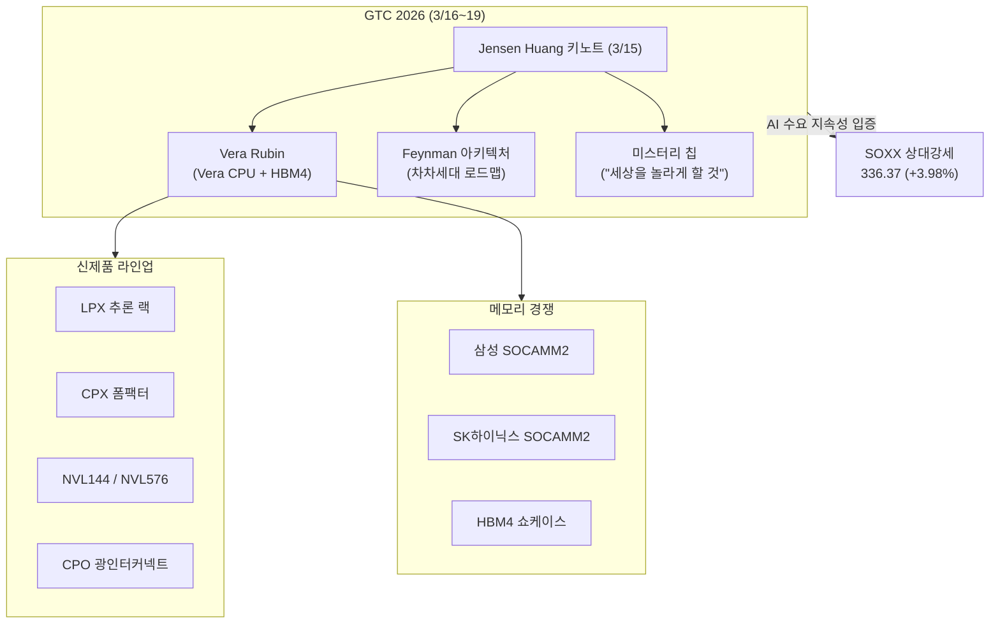
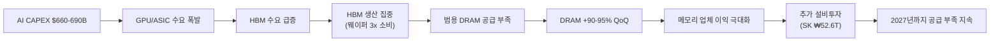
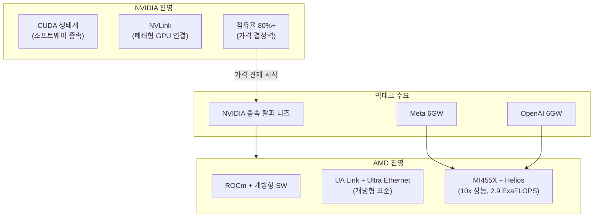

> **관련 글**: [2026년 투자 섹터 전망 (전체)](/knowledge/invest/2026/01/20/investment-sectors-outlook-2026.html)

2026년 반도체 섹터가 **사상 최초 $1T(1조 달러)** 시대를 향해 질주하고 있습니다. SIA(반도체산업협회)가 2026년 반도체 산업 $1T 돌파를 전망했으며(2025년 $791.7B), HBM TAM은 2028년 $100B에 달할 것으로 예상됩니다. 메모리 시장의 **"RAMmageddon"**은 DRAM 현물가가 계약가를 초과하는 이례적 상황으로 심화되고 있고, AI 인프라 투자는 **$660-690B**로 전년 대비 2배 규모입니다.

**3월 10일 핵심: 호르무즈 위기로 광범위한 시장 매도세에도 불구하고, SOXX가 336.37(+3.98%)로 반도체 섹터가 상대적 강세를 보이고 있습니다.** 반도체 공급망은 에너지 집약적 해운 경로에 의존하지 않아 전쟁 직접 영향이 제한적이며, GTC 2026(3/16)이 AI 수요 지속성을 입증할 "전환점(turning point)"으로 기대되고 있습니다.

**최대 카탈리스트: GTC 2026(3/16~19)이 6일 앞으로 다가왔습니다.** Jensen Huang이 "세상을 놀라게 하겠다"고 예고한 미스터리 칩, Vera Rubin 아키텍처(Grace CPU → Vera CPU + HBM4), Feynman 아키텍처 공개, LPX 추론 랙/CPX/NVL144/Rubin Ultra NVL576, CPO 광인터커넥트 등이 공개됩니다. 삼성과 SK하이닉스는 SOCAMM2(LPDDR 모듈, 전력 1/3)를 경쟁 출품합니다.

## 반도체 섹터 현황 (2026년 3월 10일 기준)

### 핵심 지표

| 항목 | 수치/현황 | 비고 |
|------|----------|------|
| **SOXX** | **336.37 (+3.98%)** | 시장 매도세에도 반도체 상대강세 |
| **BOTZ** | **36.09 (보합)** | AI/로봇 ETF |
| **KWEB** | **30.54 (+2.79%)** | 중국 인터넷 ETF |
| **글로벌 반도체 매출 (2026)** | **$1T 전망** | SIA, 2025년 $791.7B 대비 |
| **AI CAPEX (빅테크 합산)** | **$660-690B (~2x YoY)** | 75%($450B) AI 인프라 직접 투자 |
| **AMD+NVIDIA AI 칩 계약** | **12GW+ (OpenAI 6GW + Meta 6GW)** | AMD 최초 대규모 DC 계약 |
| **HBM TAM** | **$54.6B (2026) → $100B (2028)** | BofA/TrendForce |
| **DRAM Q1 가격** | **+90-95% QoQ** | 역대 최대폭, 현물가 > 계약가 |
| **공급 부족 전망** | **2027년까지 지속** | IDC/TrendForce |
| **NVIDIA FY27 매출** | **$66B 전망 (+68% YoY)** | Vera Rubin 플랫폼 |
| **AMD AI 점유율** | **9% → 18% (2026E)** | MI455X + 12GW 계약 기반 |
| **GTC 2026** | **3/16~19 (D-6)** | Vera Rubin, Feynman, HBM4, 미스터리 칩 |
| **전쟁 영향** | **제한적** | 반도체 공급망, 호르무즈 위기 직접 영향 미미 |
| **Section 122 관세** | **15% 발효 중** | IEEPA 25% 대비 순긍정 |

### 3월 10일 핵심 업데이트

| 항목 | 내용 |
|------|------|
| **★★★ SOXX +3.98% 상대강세** | 시장 광범위 매도세에도 반도체 섹터 강세. **AI 수요 지속성 + 전쟁 영향 제한적** |
| **★★★ GTC 2026 프리뷰 (D-6)** | Vera Rubin(Grace→Vera CPU+HBM4), Feynman 아키텍처, LPX/CPX/NVL144/NVL576, CPO 광인터커넥트, **미스터리 칩** |
| **★★★ 메모리 경쟁 at GTC** | 삼성 vs SK하이닉스 **SOCAMM2** 출품 (LPDDR 모듈, 전력 소비 1/3), HBM4 쇼케이스 |
| **★★ 전쟁 영향 제한적** | 반도체 공급망은 호르무즈 위기에 직접 노출 미미 (에너지 집약적 해운 경로 비의존) |
| **★★ GTC = AI 수요 전환점** | 애널리스트들, GTC를 AI 수요 지속성 입증의 **"turning point"**로 평가 |
| **이번 주 실적** | **Oracle, Adobe** 실적 발표 — AI SW/클라우드 수요 바로미터 |
| **S&P 500 리밸런싱** | **3/23** 예정 — 반도체 종목 편출입 주시 |
| **AMD MI455X + 12GW** | (기존) Meta 6GW + OpenAI 6GW, AI 칩 "독점→복점" 전환 중 |
| **AI 칩 수출규제** | (기존) 초안 단계, 최종 확정 시기 미정 |

---

## AI 칩 수출규제 초안 (3월 5일 발표, 초안 단계)

3월 5일 미 상무부가 모든 글로벌 AI 칩 수출에 정부 라이선스를 요구하는 규제 초안을 발표했습니다. **아직 초안 단계이며, 최종 확정 시기는 미정입니다.**

| 항목 | 내용 |
|------|------|
| **상태** | **초안 단계** (3/5 발표) |
| **규제 범위** | 모든 글로벌 AI 칩 수출 |
| **요구 사항** | 정부 라이선스 필수 |
| **영향 범위** | NVIDIA, AMD, Broadcom, Intel 등 모든 AI 칩 업체 |
| **글로벌 공급망 영향** | 확정 시 수출 병목 가능, 미국 내 제조 가속화 촉진 |

**투자 시사점**: 규제가 확정되면 AI 칩 수출에 단기적 병목이 생길 수 있으나, 미국 내 AI 인프라 투자($660-690B)는 영향 없음. 오히려 미국 내 제조 가속화(TSMC, 삼성 미국 팹)에 긍정적일 수 있음. 중국 제외 동맹국 면제 가능성도 존재. **초안 단계이므로 최종 규제 확정까지 모니터링 필요.**

---

## GTC 2026 프리뷰 (3/16~19, D-6)

GTC 2026이 6일 앞으로 다가왔습니다. 애널리스트들은 이번 GTC를 AI 수요의 지속성을 입증할 **"전환점(turning point)"**으로 평가하고 있으며, 전쟁으로 인한 시장 불확실성 속에서 반도체 섹터의 상대적 강세(SOXX +3.98%)를 뒷받침할 핵심 카탈리스트입니다.

### GTC 공개 예정 항목

| 항목 | 내용 | 의미 |
|------|------|------|
| **Vera Rubin 아키텍처** | Grace CPU → **Vera CPU** + **HBM4** 조합 | 차세대 플랫폼, 성능/와트 10x 개선 |
| **Feynman 아키텍처** | Vera Rubin 이후 로드맵 공개 | NVIDIA 기술 로드맵 2-3년 가시성 확보 |
| **미스터리 칩** | Jensen Huang "세상을 놀라게 하겠다" 예고 | 주가 촉매 가능성 최대 |
| **LPX 추론 랙** | 추론 특화 랙 시스템 | 추론 시장 본격 공략 |
| **CPX** | 새로운 폼팩터 | 데이터센터 유연성 확대 |
| **NVL144** | 기존 NVL72 확장 | 대규모 학습 클러스터 효율 향상 |
| **Rubin Ultra NVL576** | 최대 규모 GPU 클러스터 | 하이퍼스케일러 전용 |
| **CPO 광인터커넥트** | Co-Packaged Optics | 대역폭 병목 해소, 전력 효율 혁신 |
| **새 PCB 소재/냉각 기술** | 열관리 혁신 | 전력 밀도 증가 대응 |

### 메모리 업체 GTC 출품

| 업체 | 출품 | 의미 |
|------|------|------|
| **삼성전자** | **SOCAMM2** (LPDDR 모듈) | 전력 소비 1/3, 에지/추론 서버 타겟 |
| **SK하이닉스** | **SOCAMM2** (LPDDR 모듈) | 삼성과 직접 경쟁, HBM4 쇼케이스 병행 |
| **경쟁 포인트** | LPDDR vs HBM의 **용도별 분화** | 학습 = HBM, 추론 = LPDDR(SOCAMM2) 구도 형성 |

**투자 시사점**: GTC는 단순 제품 발표를 넘어, 현재 시장의 두 가지 핵심 질문에 답할 이벤트입니다 — (1) AI 수요가 진정으로 지속 가능한가? (2) NVIDIA의 기술 우위는 얼마나 유지되는가? 전쟁 환경에서 반도체의 상대적 방어력이 확인된 상태에서, GTC의 긍정적 결과는 섹터 추가 아웃퍼폼의 근거가 됩니다.

---

## 전쟁 영향: 반도체 공급망 상대적 절연

| 항목 | 내용 |
|------|------|
| **호르무즈 위기 직접 영향** | **제한적** — 반도체 운송은 항공화물 + 비에너지 해운 경로 중심 |
| **에너지 가격 간접 영향** | 팹 전력비 상승 가능, 그러나 매출 대비 미미 |
| **SOXX 반응** | **+3.98%** — 시장 매도세 대비 역행 강세 |
| **수혜 논리** | 전쟁 → 에너지 위기 → AI/자동화 투자 가속 → 반도체 수요 견조 |

**핵심**: 반도체 섹터는 원유/에너지 섹터와 달리 호르무즈 해협 봉쇄의 직접적 물류 리스크가 낮습니다. 오히려 전쟁이 장기화될 경우, 자율무기/AI 감시 등 군수용 반도체 수요가 추가 상승 요인이 될 수 있습니다.

---

## $1T 시대: 반도체 기가사이클

SIA(반도체산업협회)가 2026년 반도체 산업 **$1T 돌파**를 전망했습니다(2025년 $791.7B). 3대 성장 동력:

1. **AI 인프라 투자 폭발**: 빅테크 AI CAPEX $660-690B(~2x YoY), 75%가 AI 인프라 직접 투자
2. **RAMmageddon**: HBM 생산 집중 → 범용 DRAM 구조적 부족 → 전 메모리 가격 역사적 폭등
3. **HBM 과점 프리미엄**: SK하이닉스 62%, Micron #2, 삼성 #3 구조에서 가격 결정력 극대화

---

## AI CAPEX: $660-690B (전년비 ~2배)

### 하이퍼스케일러 AI 투자 현황

| 기업 | AI CAPEX (2026) | 비고 |
|------|----------------|------|
| **Amazon** | **$200B** | 최대 투자 |
| **Google** | **$175-185B** | |
| **Microsoft** | **$120B+** | |
| **Meta** | **$115-135B** | AMD 6GW $60B 딜 포함, MI455X 기반 |
| **합산** | **$660-690B** | **전년비 ~2배** |
| **AI 인프라 직접** | **~$450B (75%)** | GPU/ASIC/서버/네트워크 |

---

## AI 칩: AMD MI455X로 NVIDIA 독점 최초 구조적 도전

### AMD MI455X + Helios: 게임 체인저 (3/7)

AMD가 CES 2026에서 공개한 MI455X GPU와 Helios 렉 시스템은 NVIDIA 독점에 대한 **최초의 구조적 위협**입니다.

| 항목 | 내용 |
|------|------|
| **MI455X GPU** | HBM4 2GB, 전세대(MI355X) 대비 **10x 성능**, 칩렛 설계(2nm+3nm 혼합) |
| **Helios 시스템** | GPU 72개 + CPU 18개 단일 렉, **2.9 ExaFLOPS** (냉장고 크기 슈퍼컴퓨터) |
| **Meta 6GW 딜** | **~$60B (5년)**, 연간 $20-25B 매출 (2H 2026 시작) |
| **OpenAI 6GW 딜** | 기존 체결, 합산 **12GW = $300T+ 매출 추정** (AMD 연간 매출의 7-8배) |
| **AMD AI 점유율** | **9% → 18% (2026E)**, 개방형 전략으로 빅테크 수요 흡수 |
| **출하 일정** | Helios **2H 2026** 목표, 온타겟 |

**투자 시사점**: NVIDIA 점유율은 90%에서 장기적으로 60-70%로 하락 전망이나, **AI 데이터센터 시장 자체가 연 50% 성장**하므로 NVIDIA와 AMD 모두 수혜. AMD 개방형 표준(UA Link, Ultra Ethernet)이 빅테크의 CUDA 종속 탈피 수요와 맞물려 구조적 점유율 확대 중.

### NVIDIA: Vera Rubin 플랫폼 + GTC 2026

| 항목 | 내용 |
|------|------|
| **FY27 매출 전망** | **$66B (+68% YoY)** |
| **Vera Rubin** | Grace CPU → **Vera CPU + HBM4**, H2 2026 출하, 10x 성능/와트 |
| **Feynman** | Vera Rubin 이후 차차세대 아키텍처, GTC에서 로드맵 공개 |
| **GTC 2026 (D-6)** | **3/16~19**, LPX/CPX/NVL144/NVL576, CPO, **미스터리 칩** |
| **점유율** | **80%+** (여전히 압도적이나, AMD 12GW가 첫 구조적 위협) |
| **목표가** | Goldman $250, Morgan Stanley $260 |

### Broadcom (AVGO) Q1 FY2026

| 항목 | 내용 |
|------|------|
| **AI 매출** | **$8.4B (+74% YoY)** |
| **Q2 가이던스** | **$22B** |
| **AI 반도체** | **$10.7B** |
| **의미** | 커스텀 ASIC 시장 폭발적 성장 확인 |

### Marvell (MRVL) Q4 FY2026

| 항목 | 내용 |
|------|------|
| **매출** | **$2.219B** |
| **커스텀 AI ASIC** | **$0 → $1.5B/년** |
| **주가 반응** | **+16%** |
| **의미** | ASIC 시장 신규 진입 업체도 급성장 |

---

## RAMmageddon: DRAM 현물 > 계약, 512Gb TLC +14.7%

### 가격 동향

| 제품 | Q1 변동 | 최신 동향 |
|------|---------|----------|
| **범용 DRAM** | **+90-95% QoQ (역대 최대)** | 현물가 > 계약가 (이례적) |
| **512Gb TLC 웨이퍼 현물** | | **+14.7% (이번 주)** |
| **서버 DRAM (DDR5)** | **+105-110% QoQ** | 삼성/SK → 구글/MS 60-70% 인상 요구 |
| **64GB RDIMM DDR5** | | $255(Q3'25) → $450(Q4'25) → **$700+(3월)** |
| **NAND** | **+55-60% QoQ** | |
| **Enterprise SSD** | **+53-58% QoQ** | |

**현물 > 계약의 의미**: 통상 계약가가 현물가보다 높은데, 현재는 역전 상태. 이는 공급 부족이 극심하여 급한 수요가 프리미엄을 지불하고 있음을 의미. **Q2 계약 가격은 최소 +20% 추가 상승 컨센서스.**

### 공급 부족 전망

| 전망 기관 | 내용 |
|-----------|------|
| **IDC / TrendForce** | **2027년까지 공급 부족 지속** |
| **Micron** | DRAM 리드타임 **40주 이상**, 2028년까지 구조적 부족 |
| **의미 있는 완화** | SK하이닉스 M15X 팹 가동(2027년 말) 이후 |

**근본 원인**: HBM 생산이 GB당 **~3배의 웨이퍼 용량**을 소비 → 범용 DRAM 생산 라인 축소(crowding out) → 구조적 공급 부족

**수요 파괴 리스크**: 메모리 가격 급등 → PC/모바일 OEM 스펙 다운그레이드 가능성. 가격 폭등이 지속되면 수요 둔화로 이어질 수 있으나, 서버/AI 수요가 전체 DRAM의 40%+ 를 차지하므로 구조적 수요 기반은 견고.

---

## HBM: $100B(2028) TAM, 2026 전량 매진

### HBM 시장 점유율 (최신)

| 기업 | 점유율 | 주요 현황 |
|------|--------|----------|
| **SK하이닉스** | **62%** | 업계 1위, NVIDIA HBM4 수요의 ~2/3 공급 확정 |
| **Micron** | **#2 (삼성 추월)** | 2026 HBM 전량 매진 |
| **삼성전자** | **#3** | HBM4 PRA 완료, Q2 2026 인증 예상 |

### HBM 시장 규모

| 연도 | TAM |
|------|-----|
| **2026** | **$54.6B (+58% YoY)** |
| **2028** | **$100B** |

### SK하이닉스 대규모 투자

| 투자 | 금액 | 비고 |
|------|------|------|
| **용인 투자** | **₩31T** | 기존 발표 |
| **추가 투자 (2/25)** | **₩21.6T** | |
| **합계** | **₩52.6T** | HBM/첨단 DRAM 집중 |

- **HBM4 인증**: TrendForce 기준 Q2 2026 예상
- **NVIDIA 40% 생산 차질**: HBM 공급이 GPU 생산의 핵심 병목
- **GTC 2026**: 삼성·SK하이닉스 모두 HBM4 쇼케이스 예정

---

## 파운드리: TSMC N2 램프업, 삼성-인텔 동맹 논의

### TSMC N2 (2nm)

| 항목 | 내용 |
|------|------|
| **양산** | 램프업 진행 중 |
| **월 생산 목표** | **100K-140K 웨이퍼/월 (2026년 말)** |
| **미국 투자** | $165B → 관세 면제 확보 |

### 삼성-인텔 파운드리 동맹

| 항목 | 내용 |
|------|------|
| **이재용 인텔 면담** | 한미정상회담 시 논의 |
| **Intel Z990 칩셋** | 삼성 8nm에서 제조 |
| **의미** | 파운드리 시장 판도 변화 가능성 |

### 삼성전자 파운드리 현황

| 항목 | 내용 |
|------|------|
| **Taylor 텍사스 공장** | 양산 2027년 연기 (기존 2026년), 2nm GAA 집중 |
| **테슬라 AI6** | $16B+ (역대 최대 외부 파운드리 수주) |

---

## 장비: EUV 신모델 + 첨단 패키징 수요 급증

| 항목 | 내용 |
|------|------|
| **ASML EUV NXE:5000** | **2026년 1월 출하** |
| **ASML 백로그** | $388B, Q1 주문 €132B(기록) |
| **Applied Materials + Lam Research** | **차세대 식각/증착 전략적 협업** |
| **첨단 패키징 장비** | HBM/chiplet용 수요 급증 |

---

## 주요 종목 분석

### SK하이닉스 (000660) - ~941,000원, PER ~4.2배 극단적 저평가

| 항목 | 내용 |
|------|------|
| **주가** | **~941,000원** |
| **PER** | **~4.2배** (반도체 평균 15-20배 대비 극단적 저평가) |
| **영업이익률** | **67%** |
| **HBM 점유율** | **62% (#1)** |
| **HBM4 NVIDIA 공급** | **총 수요의 ~2/3** |
| **용인 총 투자** | **₩52.6T** |

**목표가**

| 증권사 | 목표가 | OP 전망 |
|--------|--------|---------|
| 키움증권 | **130만원** | OP 170조 |
| 하나증권 | **145만원** | OP 112조 |
| 대신증권 | **145만원** | OP 100.7조 |
| 시티/SK증권 | **140-150만원** | |
| 노무라 | 156만원 | OP 189조 |

**현재가 ~94.1만원 기준 업사이드**: 목표가 130만원은 **+38%**, 145만원은 **+54%**.

### 삼성전자 (005930) - ~195,100원, HBM4 PRA 완료

| 항목 | 내용 |
|------|------|
| **주가** | **~195,100원** |
| **Q1 2026 OP** | **~30조원 (사상 첫 분기 30조 돌파 전망)** |
| **2026 연간 OP** | **170-201조원** |
| **HBM4** | **PRA 완료, Q2 2026 인증 예상 (TrendForce)** |
| **Taylor 텍사스** | 양산 2027년 연기, 2nm GAA 집중 |

**HBM4 PRA 완료의 의미**: 삼성전자가 HBM4 Pre-Release Assessment를 완료했다는 것은 NVIDIA 인증 절차의 핵심 관문을 통과했음을 의미. Q2 인증 획득 시 HBM 점유율 회복의 전환점.

### NVIDIA (NVDA)

| 항목 | 내용 |
|------|------|
| **FY27 매출 전망** | $66B (+68%) |
| **Vera Rubin** | H2 2026, 10x 성능/와트 |
| **GTC 2026** | 3/16~19, "세상을 놀라게 할 칩" |
| **점유율** | **80%+** (AMD 12GW 계약이 첫 구조적 위협) |
| **목표가** | Goldman $250, Morgan Stanley $260 |

### AMD (AMD) - MI455X + 12GW 초대형 계약

| 항목 | 내용 |
|------|------|
| **MI455X** | HBM4 2GB, 10x 성능(vs MI355X), 칩렛 2nm+3nm |
| **Helios 시스템** | GPU 72개, 2.9 ExaFLOPS, 2H 2026 출하 |
| **Meta 6GW 딜** | ~$60B/5년, 연 $20-25B (2H 2026~) |
| **OpenAI 6GW 딜** | 합산 12GW, $300T+ 매출 추정 |
| **AI 점유율** | 9% → 18% (2026E) |
| **전략** | 개방형 표준(UA Link, Ultra Ethernet) vs NVIDIA CUDA 종속 |

### Broadcom / TSMC / ASML / Marvell

| 종목 | 핵심 | 최신 |
|------|------|------|
| **Broadcom** | ASIC 60-80% 점유 | **AI 매출 $8.4B (+74%), Q2 $22B 가이던스** |
| **Marvell** | 커스텀 ASIC 급성장 | **$0→$1.5B/년, 주가 +16%** |
| **TSMC** | 2nm 양산 램프 | 연말 100K-140K 웨이퍼/월, $165B 미국 투자 |
| **ASML** | EUV NXE:5000 출하 | 백로그 $388B, Q1 주문 €132B(기록) |

---

## 시장 지표

| 항목 | 수치 | 비고 |
|------|------|------|
| **SOXX** | **336.37 (+3.98%)** | 시장 매도세에도 반도체 상대강세 |
| **BOTZ** | **36.09 (보합)** | AI/로봇 ETF |
| **KWEB** | **30.54 (+2.79%)** | 중국 인터넷 ETF |
| **SOX 지수 ATH** | **8,498.10 (2/25)** | 사상최고치 기록 |
| **KOSPI** | **~5,585** | Black Tuesday 반등 후 안정화 |
| **삼성전자** | **~195,100원** | |
| **SK하이닉스** | **~941,000원** | |

---

## 관세 환경: Section 122 (15%)

| 관세 유형 | 세율 | 현황 | 반도체 영향 |
|----------|------|------|-----------|
| **IEEPA 상호관세** | 국가별 차등 | **위헌 무효** | 환급 가능 |
| **Section 122** | **15%** | **2/24 발효, 150일 한시** | IEEPA 25% 대비 하향 = **순긍정** |
| **Section 232** | **25%** | **유지** | 첨단 로직 대상, 메모리 직접 대상 아님 |

---

## 실적 전망

### 삼성전자

| 출처 | 2026 OP | 2027 OP |
|------|---------|---------|
| **Q1 전망** | **~30조 (사상 첫)** | |
| 하나증권 | 113조 | |
| 키움증권 | 120조 | |
| 노무라 | 135조 | |
| **연간 범위** | **170-201조** | |
| **모건스탠리** | | **317조** |

### SK하이닉스

| 출처 | 2026 OP | 목표가 |
|------|---------|--------|
| 대신증권 | 100.7조 | **145만원** |
| 하나증권 | 112조 | **145만원** |
| 키움증권 | 170조 | **130만원** |
| 노무라 | 189조 | 156만원 |
| 시티/SK증권 | | **140-150만원** |

---

## 투자 전략

### 액션 플랜

| 전략 | 내용 |
|------|------|
| **단기 (1-2주)** | **GTC 2026(3/16, D-6) 최대 카탈리스트.** Vera Rubin/Feynman/미스터리 칩 확인. Oracle/Adobe 실적(AI SW 수요). 전쟁 환경에서 반도체 상대강세 지속 여부 모니터링 |
| **중기 (1-3개월)** | 서버 DRAM 60-70% 인상 현실화 → Q2 실적 서프라이즈 기대. HBM4 인증 확인. S&P 500 리밸런싱(3/23) 반도체 편출입 |
| **장기 (6개월+)** | $1T 기가사이클, AI CAPEX $660-690B, HBM TAM $100B(2028), AMD+NVIDIA 12GW+ AI 칩 수요 구조적 성장 |

### 투자 근거

1. **전쟁에도 상대강세**: SOXX +3.98%, 반도체 공급망 호르무즈 위기 직접 영향 제한적
2. **GTC 2026 (D-6)**: Vera Rubin/Feynman/미스터리 칩/CPO/SOCAMM2 — AI 수요 "전환점" 기대
3. **$1T 시대 진입**: SIA 공식 전망, 2025년 $791.7B → 2026년 $1T
4. **AI 칩 12GW 시대**: AMD MI455X+Helios로 OpenAI/Meta 12GW 계약, AI 칩 시장 파이 자체가 확대
5. **PER 극단적 저평가**: SK하이닉스 PER ~4.2배 (업종 평균 15-20배 대비 73-79% 할인)
6. **현물 > 계약**: 공급 부족 심화 중, Q2 +20% 추가 상승 전망
7. **HBM TAM $100B (2028)**: 성장 여력 충분, 2026 전량 매진
8. **커스텀 ASIC 폭발**: Broadcom $8.4B(+74%), Marvell $0→$1.5B/년
9. **AI CAPEX 불변**: $660-690B, 빅테크 가이던스 변동 없음

### 매도 트리거 (감시 신호)

1. **DRAM 가격 하락 전환** -- 현재 67-70% 영업마진이 꺾이기 시작할 때
2. **AI 수출규제 최종 확정 시 범위** -- 동맹국 포함 여부, 시행 시기
3. **HBM 공급 과잉 신호** -- 3사 동시 증설 가속
4. **빅테크 CAPEX 가이던스 하향** -- AI 투자 모멘텀 둔화
5. **메모리 수요 파괴** -- PC/모바일 OEM 스펙 다운그레이드 현실화
6. **NVIDIA 가격 결정력 훼손** -- AMD 12GW 계약이 GPU ASP 하락으로 이어지는지 모니터링

### 핵심 일정

| 일정 | 내용 | 중요도 |
|------|------|--------|
| **이번 주** | **Oracle, Adobe 실적** — AI SW/클라우드 수요 바로미터 | 높음 |
| **3/12** | 철강/알루미늄 관세 25% 발효 | 중간 |
| **3/16~19** | **GTC 2026 (D-6): Vera Rubin, Feynman, HBM4, CPO, 미스터리 칩, SOCAMM2** | **최고** |
| **3/17~18** | **FOMC** | 높음 |
| **3/23** | **S&P 500 리밸런싱** — 반도체 종목 편출입 주시 | 중간 |
| **~7월** | Section 122 관세 150일 시한 | 높음 |
| **Q2 2026** | HBM4 인증 예상 (TrendForce) | 높음 |
| H2 2026 | Vera Rubin 출하, **AMD Helios/MI455X 출하**, HBM4E 샘플링 | 높음 |
| 2027년 말 | SK하이닉스 M15X 가동 → 공급 완화 시작 | 중간 |

---

## 리스크 요인

| 리스크 | 현황 | 평가 |
|--------|------|------|
| **★ 호르무즈 위기/전쟁** | 광범위 시장 매도세, 에너지 가격 급등 | **반도체 직접 영향 제한적**, SOXX +3.98% 상대강세 |
| **★ AI 칩 수출규제 초안 (3/5)** | 모든 AI 칩 수출에 정부 라이선스 요구 | **초안 단계**, 최종 확정 시기 미정 |
| **NVIDIA 가격 결정력 약화** | AMD 12GW 계약(OpenAI+Meta)으로 첫 구조적 경쟁 | 시장 파이 확대로 양사 수혜 가능, GPU ASP 추이 모니터링 |
| **메모리 수요 파괴** | 가격 급등 → PC/모바일 OEM 스펙 다운그레이드 가능성 | 서버/AI 수요가 40%+, 구조적 기반 견고 |
| **지정학 리스크** | 전쟁 장기화 → 글로벌 경기 둔화 가능 | 반도체 공급망 절연, 군수용 수요 추가 가능 |
| **삼성 Taylor 양산 연기** | 2026 → 2027, 2nm GAA 집중 | 메모리 호황이 상쇄 |
| **AI CAPEX 과잉 + FCF 급감** | $660-690B(~2x), 빅테크 FCF 급감 전망 | 분기별 CAPEX 가이던스 모니터링 |
| **Section 122 관세** | 15%, 150일 한시 | 정책 방향 모니터링 |

---

## 결론

| 항목 | 내용 |
|------|------|
| **전체 방향성** | **$1T 시대 진입**, AI CAPEX $660-690B, RAMmageddon 지속, **전쟁에도 반도체 상대강세** |
| **최대 카탈리스트** | **GTC 2026(3/16, D-6)**: Vera Rubin, Feynman, HBM4, CPO, 미스터리 칩, SOCAMM2 |
| **시장 포지션** | SOXX +3.98% — 전쟁 매도세에도 반도체 상대강세, AI 수요 지속성에 대한 시장 확신 |
| **리스크** | 전쟁(직접 영향 제한적), AI 수출규제(초안 단계), NVIDIA 가격 결정력 |
| **최대 수혜** | SK하이닉스(PER ~4.2배, 62% HBM, 목표가 130-150만원), 삼성전자(Q1 OP 30조, HBM4 PRA, GTC SOCAMM2) |
| **이번 주 주시** | Oracle/Adobe 실적(AI SW 수요), GTC 프리뷰 뉴스플로우, S&P 500 리밸런싱(3/23) |
| **투자 전략** | **GTC 카탈리스트 대기, 전쟁 환경 반도체 방어적 성격 활용, 극단적 저평가 유지** |

**호르무즈 위기로 광범위한 시장 매도세가 진행 중이지만, 반도체 섹터는 SOXX +3.98%로 역행 강세를 보이고 있습니다.** 반도체 공급망은 에너지 집약적 해운 경로에 비의존하여 전쟁 직접 영향이 제한적이며, 6일 앞으로 다가온 GTC 2026이 AI 수요 지속성을 입증할 "전환점"으로 기대됩니다. Vera Rubin(HBM4), Feynman 아키텍처, 미스터리 칩, 삼성/SK하이닉스 SOCAMM2 경쟁 등 강력한 뉴스플로우가 예정되어 있어, **전쟁 불확실성 속에서도 반도체는 가장 견조한 성장 섹터의 위치를 유지하고 있습니다.** SK하이닉스 PER ~4.2배는 여전히 역사적 저평가입니다.

**투자 결정은 본인의 리스크 허용 범위와 투자 기간을 고려하여 신중하게 내리시기 바랍니다.**

---

## 하위 섹터 상세 분석

- [HBM 투자 전망](/knowledge/invest/2026/01/21/hbm-sector-outlook-2026.html) - 고대역폭 메모리 심층 분석
- [DRAM/NAND 투자 전망](/knowledge/invest/2026/01/21/dram-nand-sector-outlook-2026.html) - 범용 메모리 분석
- [파운드리 투자 전망](/knowledge/invest/2026/01/21/foundry-sector-outlook-2026.html) - TSMC, 삼성전자 파운드리 분석
- [소부장 투자 전망](/knowledge/invest/2026/01/21/semiconductor-materials-equipment-outlook-2026.html) - 소재/부품/장비 분석
- [AI 소프트웨어/클라우드](/knowledge/invest/2026/03/07/ai-software-cloud-outlook-2026.html) - AI SW/클라우드 심층 분석
