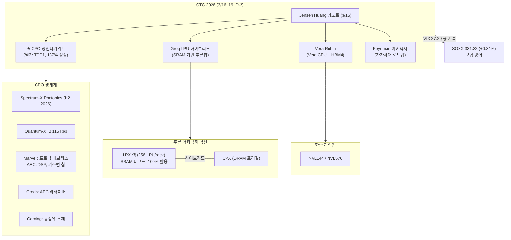
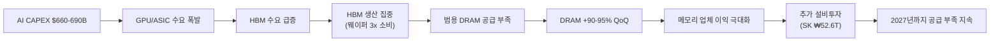
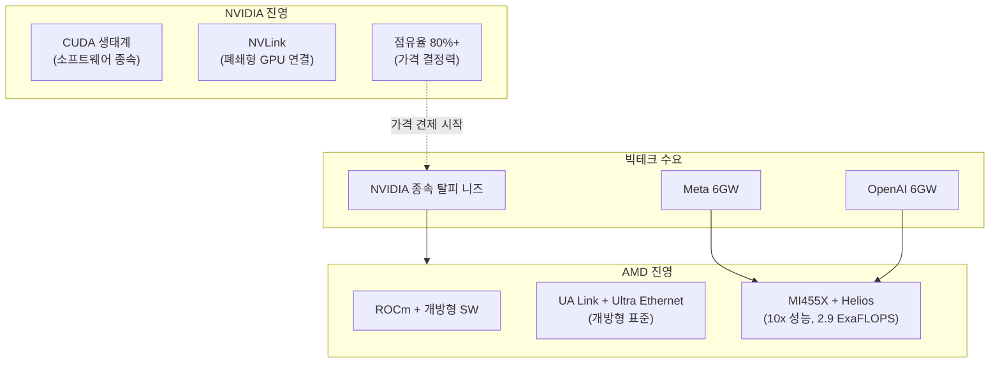

> **관련 글**: [2026년 투자 섹터 전망 (전체)](/knowledge/invest/2026/01/20/investment-sectors-outlook-2026.html)

2026년 글로벌 반도체 시장이 **~$975B(YoY +25%)**로 $1T 돌파를 눈앞에 두고 있습니다. 메모리 시장은 **+30%** 성장이 전망되며, HBM TAM은 2028년 $100B에 달할 것으로 예상됩니다. 메모리 시장의 **"RAMmageddon"**은 DRAM 현물가가 계약가를 초과하는 이례적 상황으로 심화되고 있고, AI 인프라 투자는 **$660-690B**로 전년 대비 2배 규모입니다.

**3월 14일 핵심: CPO(Co-Packaged Optics)가 2026년 월가 TOP1 투자 테마로 부상했습니다.** 구리선의 물리적 한계(224G SerDes에서 50cm)로 광 신호 전환이 불가피하며, 연간 **137% 성장** 시장으로 2026년 양산이 시작됩니다. NVIDIA Spectrum-X Photonics가 H2 2026 출시 예정이고, Quantum-X IB 115Tb/s가 대역폭 병목을 해소합니다. Marvell(광통신 포토닉 패브릭스·AEC·DSP·커스텀 칩, 고점 대비 **-30% 저평가**), Credo(AEC 리타이머), Corning(광섬유 소재)이 핵심 수혜주입니다.

**VIX 27.29로 공포가 급등하고 있습니다.** NVDA **$180(-1.59%)**로 하락했으나, SOXX **331.32(+0.34%)**로 보합 방어에 성공했습니다. GTC 2026(3/16~19)이 **2일 앞**으로 다가온 가운데, 시장 변동성 확대 속에서도 반도체 섹터는 상대적 강세를 유지하고 있습니다.

**HBM4 점유율이 확정되었습니다.** UBS 기준 SK하이닉스가 Rubin 향 **70% 점유**를 차지하고, 삼성전자 **mid-20%**(2/12 HBM4 출하 시작), Micron **~20%**입니다. HBM3E 가격은 삼성/SK 모두 **~20% 인상**을 추진 중입니다.

## 반도체 섹터 현황 (2026년 3월 14일 기준)

### 핵심 지표

| 항목 | 수치/현황 | 비고 |
|------|----------|------|
| **SOXX** | **331.32 (+0.34%)** | VIX 27.29 공포 속 보합 방어 |
| **NVDA** | **$180 (-1.59%)** | GTC D-2, 공포 속 조정 |
| **VIX** | **27.29** | 공포 급등 |
| **글로벌 반도체 매출 (2026)** | **~$975B (+25% YoY)** | 메모리 +30% |
| **AI CAPEX (빅테크 합산)** | **$660-690B (~2x YoY)** | 75%($450B) AI 인프라 직접 투자 |
| **HBM TAM** | **$54.6B (2026) → $100B (2028)** | BofA/TrendForce |
| **HBM4 점유율 (Rubin)** | **SK 70% / 삼성 mid-20% / Micron ~20%** | UBS 전망 |
| **HBM3E 가격** | **~20% 인상** | 삼성/SK 모두 |
| **GTC 2026** | **3/16~19 (D-2)** | CPO·Groq LPU 하이브리드·Vera Rubin·Feynman |
| **CPO 시장** | **연간 137% 성장** | 2026년 양산 시작, 월가 TOP1 테마 |
| **DRAM Q1 가격** | **+90-95% QoQ** | 역대 최대폭, 현물가 > 계약가 |
| **공급 부족 전망** | **2027년까지 지속** | IDC/TrendForce |
| **Section 122 관세** | **15% 발효 중** | IEEPA 25% 대비 순긍정 |

### 3월 14일 핵심 업데이트

| 항목 | 내용 |
|------|------|
| **★★★ CPO 월가 TOP1 테마** | **Co-Packaged Optics** 2026년 월가 TOP1 투자 테마. 구리선 물리적 한계(224G SerDes에서 50cm) → 광 신호 전환 불가피. 연간 **137% 성장** 시장, **2026년 양산 시작**. NVIDIA Spectrum-X Photonics H2 2026 출시, Quantum-X IB 115Tb/s |
| **★★★ CPO 수혜주** | **Marvell**: 광통신 포토닉 패브릭스·AEC·DSP·커스텀 칩, 고점 대비 **-30% 저평가**. **Credo**: AEC 리타이머. **Corning**: 광섬유 소재 |
| **★★★ VIX 공포 급등** | VIX **27.29** 공포 급등. NVDA **$180(-1.59%)** 하락. SOXX **331.32(+0.34%)** 보합 방어 — 공포 속 반도체 상대적 강세 |
| **★★ GTC 2026 (D-2)** | 3/16~19, **CPO**/Groq 하이브리드/Vera Rubin/Feynman/SOCAMM2. **핵심 촉매 임박** |
| **★★ HBM4 점유율 확정** | SK하이닉스 **70%**(UBS), 삼성 **mid-20%**, Micron **~20%**. HBM3E **~20% 인상** |
| **★★ 글로벌 반도체** | 2026년 **~$975B(+25% YoY)**, 메모리 **+30%** |

---

## AI 칩 수출규제 초안 (3월 5일 발표, 초안 단계)

3월 5일 미 상무부가 모든 글로벌 AI 칩 수출에 정부 라이선스를 요구하는 규제 초안을 발표했습니다. **아직 초안 단계이며, 최종 확정 시기는 미정입니다.**

| 항목 | 내용 |
|------|------|
| **상태** | **초안 단계** (3/5 발표) |
| **규제 범위** | 모든 글로벌 AI 칩 수출 |
| **요구 사항** | 정부 라이선스 필수 |
| **영향 범위** | NVIDIA, AMD, Broadcom, Intel 등 모든 AI 칩 업체 |
| **글로벌 공급망 영향** | 확정 시 수출 병목 가능, 미국 내 제조 가속화 촉진 |

**투자 시사점**: 규제가 확정되면 AI 칩 수출에 단기적 병목이 생길 수 있으나, 미국 내 AI 인프라 투자($660-690B)는 영향 없음. 오히려 미국 내 제조 가속화(TSMC, 삼성 미국 팹)에 긍정적일 수 있음. 중국 제외 동맹국 면제 가능성도 존재. **초안 단계이므로 최종 규제 확정까지 모니터링 필요.**

---

## GTC 2026 프리뷰 (3/16~19, D-2)

GTC 2026이 2일 앞으로 다가왔습니다. **CPO(Co-Packaged Optics)가 2026년 월가 TOP1 투자 테마**로 부상한 가운데, Groq LPU 하이브리드 추론칩과 함께 GTC의 양대 핵심 발표가 될 전망입니다.

### Groq LPU 하이브리드 추론칩 (GTC 최대 서프라이즈)

NVIDIA가 Groq의 SRAM 기반 LPU(Language Processing Unit) 기술을 결합한 **하이브리드 추론 프로세서**를 발표합니다.

| 항목 | 내용 |
|------|------|
| **아키텍처** | 프리필(**DRAM 기반 CPX**) + 디코드(**SRAM 기반 LPX**) 분리형 |
| **제조** | TSMC **A16 공정** + **3D 스태킹** (AMD X3D와 유사) |
| **LPX 랙** | **256 LPU/rack** (1세대 대비 4배 증가) |
| **GPU 활용률 혁신** | 기존 GPU 추론 **30-40%** → SRAM 결정론적 실행 모델로 **100%** |
| **첫 고객** | OpenAI — **3GW 전용 용량** 확보 |
| **핵심 전환** | AI 추론: HBM 단일 → **DRAM+SRAM 하이브리드 메모리** 구조 |
| **삼성 파운드리 수혜** | SRAM은 트랜지스터 6개 필요 → 면적 大 → **삼성 4나노 가성비 우위**. Groq 칩 이미 삼성 생산 중 |

**투자 시사점**: 이 하이브리드 아키텍처는 추론 시장의 게임 체인저입니다. GPU 활용률을 30-40%에서 100%로 끌어올리면 추론 인프라의 TCO가 근본적으로 바뀝니다. 삼성 파운드리의 SRAM 칩 생산 수혜, TSMC A16 수요 확대, 메모리 구조의 DRAM+SRAM 이원화 등 공급망 전반에 파급효과가 있습니다.

### GTC 공개 예정 항목

| 항목 | 내용 | 의미 |
|------|------|------|
| **★ Groq LPU 하이브리드** | SRAM 기반 추론칩, A16+3D 스태킹 | **추론 패러다임 전환** |
| **Vera Rubin 아키텍처** | Grace CPU → **Vera CPU** + **HBM4** 조합 | 차세대 플랫폼, 성능/와트 10x 개선 |
| **Feynman 아키텍처** | Vera Rubin 이후 로드맵 공개 | NVIDIA 기술 로드맵 2-3년 가시성 확보 |
| **LPX 추론 랙** | 256 LPU/rack, SRAM 기반 디코드 전용 | 추론 시장 본격 공략 |
| **CPX** | DRAM 기반 프리필 전용 폼팩터 | 프리필+디코드 분리 아키텍처 |
| **NVL144 / NVL576** | 대규모 학습 클러스터 | 하이퍼스케일러 전용 |
| **★ CPO 광인터커넥트** | Co-Packaged Optics, **Spectrum-X Photonics(H2 2026)**, Quantum-X IB 115Tb/s | **월가 TOP1 테마**, 137% 성장, 2026 양산, 구리선 한계 돌파 |

### 메모리 업체 GTC 출품

| 업체 | 출품 | 의미 |
|------|------|------|
| **삼성전자** | **SOCAMM2** (LPDDR 모듈) | 전력 소비 1/3, 에지/추론 서버 타겟 |
| **SK하이닉스** | **SOCAMM2** (LPDDR 모듈) | 삼성과 직접 경쟁, HBM4 쇼케이스 병행 |
| **경쟁 포인트** | LPDDR vs HBM의 **용도별 분화** | 학습 = HBM, 추론 = LPDDR(SOCAMM2) 구도 형성 |

**투자 시사점**: GTC 2026은 (1) CPO 광인터커넥트의 본격 양산 확인, (2) 추론 아키텍처의 패러다임 전환(GPU→하이브리드), (3) AI 수요 지속성에 답할 이벤트입니다. CPO는 구리선의 물리적 한계를 돌파하는 유일한 경로이며 연간 137% 성장 시장입니다. Marvell(-30% 저평가), Credo, Corning이 핵심 수혜주입니다.

---

## CPO(Co-Packaged Optics): 2026년 월가 TOP1 투자 테마 (3/14 신규)

데이터센터 내부 인터커넥트가 **구리선의 물리적 한계**에 도달했습니다. 224G SerDes에서 구리선 전송 거리는 **50cm**에 불과하며, AI 클러스터의 대역폭 수요가 폭발하면서 **광 신호로의 전환이 불가피**해졌습니다. CPO는 광학 부품을 스위치 칩에 직접 패키징하여 전력 소비를 줄이고 대역폭을 극대화하는 기술입니다.

### CPO 시장 현황

| 항목 | 내용 |
|------|------|
| **시장 성장률** | **연간 137%** 성장 |
| **양산 시점** | **2026년** 본격 양산 시작 |
| **구리선 한계** | 224G SerDes에서 **50cm** — 물리적 한계 도달 |
| **전환 방향** | 구리선(전기 신호) → **광 신호**(Co-Packaged Optics) |
| **월가 평가** | **2026년 TOP1 투자 테마** |

### NVIDIA CPO 제품 라인업

| 제품 | 내용 | 시기 |
|------|------|------|
| **Spectrum-X Photonics** | CPO 기반 이더넷 스위치 | **H2 2026 출시** |
| **Quantum-X IB** | InfiniBand **115Tb/s** | GTC 발표 예정 |

### CPO 핵심 수혜주

| 종목 | 포지션 | 비고 |
|------|--------|------|
| **Marvell (MRVL)** | 광통신 포토닉 패브릭스, AEC, DSP, 커스텀 칩 | 고점 대비 **-30% 저평가** |
| **Credo (CRDO)** | AEC(Active Electrical Cable) 리타이머 | CPO 전환기 수혜 |
| **Corning (GLW)** | 광섬유 소재 | 광 인프라 근간 |
| **NVIDIA** | Spectrum-X Photonics, Quantum-X | 플랫폼 주도 |

**투자 시사점**: CPO는 AI 인프라의 다음 병목(인터커넥트 대역폭)을 해소하는 핵심 기술입니다. 구리선의 물리적 한계는 소프트웨어로 해결할 수 없으며, 광 전환은 필연적입니다. 특히 **Marvell은 광통신·AEC·DSP·커스텀 칩을 모두 보유한 종합 플레이어임에도 고점 대비 -30% 저평가** 상태로 주목됩니다. GTC에서 NVIDIA CPO 제품 라인업이 구체화되면 관련 종목의 리레이팅이 기대됩니다.

---

## HBM4 점유율 확정 및 양산 가속 (3/12 업데이트)

HBM4 점유율이 확정되었습니다. UBS 기준 SK하이닉스가 Rubin 향 70%를 확보하며 압도적 1위를 유지하고, 삼성전자는 mid-20%로 2위, Micron은 ~20%입니다.

| 업체 | HBM4 점유율 | 현황 | 비고 |
|------|-----------|------|------|
| **SK하이닉스** | **~70%** (UBS) | Rubin 향 최대 공급 확정 | 업계 압도적 1위 |
| **삼성전자** | **mid-20%** | **2/12 HBM4 출하 시작** | 세계 최초 양산, 점유율 회복 중 |
| **Micron** | **~20%** | Q2 2026 **15K 웨이퍼/월 램프** | 11Gbps+, Applied Materials 공동 R&D |
| **HBM3E 가격** | — | 삼성/SK 모두 **~20% 인상** 추진 | 가격 결정력 강화 |
| **NVIDIA** | — | **16-Hi HBM4 Q4 2026 요청** | Vera Rubin 풀 프로덕션 진입 |

**핵심**: SK하이닉스의 70% 점유는 HBM4 시대에도 과점 구조가 유지됨을 의미합니다. 삼성전자는 세계 최초 양산(2/12)으로 점유율 회복의 전환점을 마련했고, HBM3E ~20% 인상은 메모리 업체 전체의 수익성을 더 끌어올릴 요인입니다. HBM TAM $100B(2028) 경로가 더욱 명확해지고 있습니다.

---

## 내부자 대규모 매수: AI 위기론 완화

AI 위기론이 "대체"에서 "협업" 내러티브로 전환되는 가운데, 빅테크·광고업계 내부자들의 대규모 매수가 잇따르고 있습니다.

| 내부자 | 매수 규모 | 의미 |
|--------|----------|------|
| **MSFT 내부자** | **26억원** (10년 만에 최대) | AI 인프라 투자 자신감 |
| **ServiceNow CEO** | **40억원** + 자동매도 전량 취소 | AI 엔터프라이즈 성장 확신 |
| **TradeDesk CEO** | **2,000억원** (광고업계 사상 최대) | AI+광고 공생 구조 베팅 |
| **마이클 버리** | **어도비 매수** | 가치투자자의 AI SW 관심 |

**AI 위기론 전환 배경**:
- **"대체" → "협업"**: AI가 기존 산업을 대체하는 것이 아니라 협업 도구로 자리매김
- **OpenAI → TradeDesk**: ChatGPT 광고를 TradeDesk에 위탁 — AI 기업도 기존 광고 인프라에 의존
- **투자 시사점**: 내부자 매수는 가장 강력한 강세 신호 중 하나. 특히 ServiceNow CEO의 자동매도 전량 취소는 이례적이며, AI 엔터프라이즈 성장에 대한 경영진의 강한 확신을 의미

---

## $1T 시대: 반도체 기가사이클

글로벌 반도체 시장이 2026년 **~$975B(YoY +25%)**로 $1T 돌파를 눈앞에 두고 있습니다(메모리 +30%). 3대 성장 동력:

1. **AI 인프라 투자 폭발**: 빅테크 AI CAPEX $660-690B(~2x YoY), 75%가 AI 인프라 직접 투자
2. **RAMmageddon**: HBM 생산 집중 → 범용 DRAM 구조적 부족 → 전 메모리 가격 역사적 폭등
3. **HBM 과점 프리미엄**: SK하이닉스 62%, Micron #2, 삼성 #3 구조에서 가격 결정력 극대화

---

## AI CAPEX: $660-690B (전년비 ~2배)

### 하이퍼스케일러 AI 투자 현황

| 기업 | AI CAPEX (2026) | 비고 |
|------|----------------|------|
| **Amazon** | **$200B** | 최대 투자 |
| **Google** | **$175-185B** | |
| **Microsoft** | **$120B+** | |
| **Meta** | **$115-135B** | AMD 6GW $60B 딜 포함, MI455X 기반 |
| **합산** | **$660-690B** | **전년비 ~2배** |
| **AI 인프라 직접** | **~$450B (75%)** | GPU/ASIC/서버/네트워크 |

---

## AI 칩: AMD MI455X로 NVIDIA 독점 최초 구조적 도전

### AMD MI455X + Helios: 게임 체인저 (3/7)

AMD가 CES 2026에서 공개한 MI455X GPU와 Helios 렉 시스템은 NVIDIA 독점에 대한 **최초의 구조적 위협**입니다.

| 항목 | 내용 |
|------|------|
| **MI455X GPU** | HBM4 2GB, 전세대(MI355X) 대비 **10x 성능**, 칩렛 설계(2nm+3nm 혼합) |
| **Helios 시스템** | GPU 72개 + CPU 18개 단일 렉, **2.9 ExaFLOPS** (냉장고 크기 슈퍼컴퓨터) |
| **Meta 6GW 딜** | **~$60B (5년)**, 연간 $20-25B 매출 (2H 2026 시작) |
| **OpenAI 6GW 딜** | 기존 체결, 합산 **12GW = $300T+ 매출 추정** (AMD 연간 매출의 7-8배) |
| **AMD AI 점유율** | **9% → 18% (2026E)**, 개방형 전략으로 빅테크 수요 흡수 |
| **출하 일정** | Helios **2H 2026** 목표, 온타겟 |

**투자 시사점**: NVIDIA 점유율은 90%에서 장기적으로 60-70%로 하락 전망이나, **AI 데이터센터 시장 자체가 연 50% 성장**하므로 NVIDIA와 AMD 모두 수혜. AMD 개방형 표준(UA Link, Ultra Ethernet)이 빅테크의 CUDA 종속 탈피 수요와 맞물려 구조적 점유율 확대 중.

### NVIDIA: Vera Rubin 플랫폼 + GTC 2026

| 항목 | 내용 |
|------|------|
| **FY27 매출 전망** | **$66B (+68% YoY)** |
| **Vera Rubin** | Grace CPU → **Vera CPU + HBM4**, H2 2026 출하, 10x 성능/와트 |
| **Feynman** | Vera Rubin 이후 차차세대 아키텍처, GTC에서 로드맵 공개 |
| **GTC 2026 (D-2)** | **3/16~19**, CPO Spectrum-X Photonics/Groq LPU 하이브리드/LPX/CPX/NVL144/NVL576 |
| **점유율** | **80%+** (여전히 압도적이나, AMD 12GW가 첫 구조적 위협) |
| **목표가** | Goldman $250, Morgan Stanley $260 |

### Broadcom (AVGO) Q1 FY2026

| 항목 | 내용 |
|------|------|
| **AI 매출** | **$8.4B (+74% YoY)** |
| **Q2 가이던스** | **$22B** |
| **AI 반도체** | **$10.7B** |
| **의미** | 커스텀 ASIC 시장 폭발적 성장 확인 |

### Marvell (MRVL) Q4 FY2026

| 항목 | 내용 |
|------|------|
| **매출** | **$2.219B** |
| **커스텀 AI ASIC** | **$0 → $1.5B/년** |
| **주가 반응** | **+16%** |
| **의미** | ASIC 시장 신규 진입 업체도 급성장 |

---

## RAMmageddon: DRAM 현물 > 계약, 512Gb TLC +14.7%

### 가격 동향

| 제품 | Q1 변동 | 최신 동향 |
|------|---------|----------|
| **범용 DRAM** | **+90-95% QoQ (역대 최대)** | 현물가 > 계약가 (이례적) |
| **512Gb TLC 웨이퍼 현물** | | **+14.7% (이번 주)** |
| **서버 DRAM (DDR5)** | **+105-110% QoQ** | 삼성/SK → 구글/MS 60-70% 인상 요구 |
| **64GB RDIMM DDR5** | | $255(Q3'25) → $450(Q4'25) → **$700+(3월)** |
| **NAND** | **+55-60% QoQ** | |
| **Enterprise SSD** | **+53-58% QoQ** | |

**현물 > 계약의 의미**: 통상 계약가가 현물가보다 높은데, 현재는 역전 상태. 이는 공급 부족이 극심하여 급한 수요가 프리미엄을 지불하고 있음을 의미. **Q2 계약 가격은 최소 +20% 추가 상승 컨센서스.**

### 공급 부족 전망

| 전망 기관 | 내용 |
|-----------|------|
| **IDC / TrendForce** | **2027년까지 공급 부족 지속** |
| **Micron** | DRAM 리드타임 **40주 이상**, 2028년까지 구조적 부족 |
| **의미 있는 완화** | SK하이닉스 M15X 팹 가동(2027년 말) 이후 |

**근본 원인**: HBM 생산이 GB당 **~3배의 웨이퍼 용량**을 소비 → 범용 DRAM 생산 라인 축소(crowding out) → 구조적 공급 부족

**수요 파괴 리스크**: 메모리 가격 급등 → PC/모바일 OEM 스펙 다운그레이드 가능성. 가격 폭등이 지속되면 수요 둔화로 이어질 수 있으나, 서버/AI 수요가 전체 DRAM의 40%+ 를 차지하므로 구조적 수요 기반은 견고.

---

## HBM: $100B(2028) TAM, 2026 전량 매진

### HBM 시장 점유율 (3/12 확정)

| 기업 | HBM4 점유율 (Rubin) | 주요 현황 |
|------|-----------|----------|
| **SK하이닉스** | **~70%** (UBS) | 업계 압도적 1위, Rubin 향 최대 공급 |
| **삼성전자** | **mid-20%** | 2/12 HBM4 출하 시작(세계 최초), 점유율 회복 중 |
| **Micron** | **~20%** | Q2 2026 램프, 2026 HBM 전량 매진 |
| **HBM3E 가격** | — | 삼성/SK 모두 **~20% 인상** |

### HBM 시장 규모

| 연도 | TAM |
|------|-----|
| **2026** | **$54.6B (+58% YoY)** |
| **2028** | **$100B** |

### SK하이닉스 대규모 투자

| 투자 | 금액 | 비고 |
|------|------|------|
| **용인 투자** | **₩31T** | 기존 발표 |
| **추가 투자 (2/25)** | **₩21.6T** | |
| **합계** | **₩52.6T** | HBM/첨단 DRAM 집중 |

- **HBM4 점유율 확정**: SK하이닉스 ~70%(UBS), 삼성 mid-20%, Micron ~20%
- **HBM3E 가격**: 삼성/SK 모두 **~20% 인상** 추진
- **GTC 2026 (D-4)**: 삼성·SK하이닉스 모두 HBM4 쇼케이스 예정

---

## 파운드리: TSMC N2 램프업, 삼성-인텔 동맹 논의

### TSMC N2 (2nm)

| 항목 | 내용 |
|------|------|
| **양산** | 램프업 진행 중 |
| **월 생산 목표** | **100K-140K 웨이퍼/월 (2026년 말)** |
| **미국 투자** | $165B → 관세 면제 확보 |

### 삼성-인텔 파운드리 동맹

| 항목 | 내용 |
|------|------|
| **이재용 인텔 면담** | 한미정상회담 시 논의 |
| **Intel Z990 칩셋** | 삼성 8nm에서 제조 |
| **의미** | 파운드리 시장 판도 변화 가능성 |

### 삼성전자 파운드리 현황

| 항목 | 내용 |
|------|------|
| **Taylor 텍사스 공장** | 양산 2027년 연기 (기존 2026년), 2nm GAA 집중 |
| **테슬라 AI6** | $16B+ (역대 최대 외부 파운드리 수주) |

---

## 장비: EUV 신모델 + 첨단 패키징 수요 급증

| 항목 | 내용 |
|------|------|
| **ASML EUV NXE:5000** | **2026년 1월 출하** |
| **ASML 백로그** | $388B, Q1 주문 €132B(기록) |
| **Applied Materials + Lam Research** | **차세대 식각/증착 전략적 협업** |
| **첨단 패키징 장비** | HBM/chiplet용 수요 급증 |

---

## 주요 종목 분석

### SK하이닉스 (000660) - ~941,000원, PER ~4.2배 극단적 저평가

| 항목 | 내용 |
|------|------|
| **주가** | **~941,000원** |
| **PER** | **~4.2배** (반도체 평균 15-20배 대비 극단적 저평가) |
| **영업이익률** | **67%** |
| **HBM4 점유율 (Rubin)** | **~70% (#1, UBS)** |
| **용인 총 투자** | **₩52.6T** |

**목표가**

| 증권사 | 목표가 | OP 전망 |
|--------|--------|---------|
| 키움증권 | **130만원** | OP 170조 |
| 하나증권 | **145만원** | OP 112조 |
| 대신증권 | **145만원** | OP 100.7조 |
| 시티/SK증권 | **140-150만원** | |
| 노무라 | 156만원 | OP 189조 |

**현재가 ~94.1만원 기준 업사이드**: 목표가 130만원은 **+38%**, 145만원은 **+54%**.

### 삼성전자 (005930) - ~195,100원, HBM4 양산 시작 + 파운드리 수혜

| 항목 | 내용 |
|------|------|
| **주가** | **~195,100원** |
| **Q1 2026 OP** | **~30조원 (사상 첫 분기 30조 돌파 전망)** |
| **2026 연간 OP** | **170-201조원** |
| **HBM4 점유율** | **mid-20%** (UBS), **2/12 출하 시작** (세계 최초) |
| **파운드리 수혜** | Groq SRAM 칩 삼성 4나노 생산 중, **GTC 하이브리드 추론칩 수혜 가능** |
| **Taylor 텍사스** | 양산 2027년 연기, 2nm GAA 집중 |

**삼성 파운드리 수혜 주목**: NVIDIA-Groq 하이브리드 추론칩의 SRAM 기반 LPU는 트랜지스터 6개를 사용하여 면적이 크므로, 삼성 4나노의 가성비가 TSMC 대비 우위입니다. Groq 칩은 이미 삼성에서 생산 중이며, 하이브리드 추론 시장 확대 시 삼성 파운드리의 구조적 수혜가 기대됩니다.

### NVIDIA (NVDA) - $180 (-1.59%)

| 항목 | 내용 |
|------|------|
| **주가** | **$180 (-1.59%)** — VIX 27.29 공포 속 조정 |
| **FY27 매출 전망** | $66B (+68%) |
| **Vera Rubin** | H2 2026, 10x 성능/와트 |
| **GTC 2026 (D-2)** | CPO Spectrum-X Photonics, Groq LPU 하이브리드, Vera Rubin, Feynman |
| **CPO** | Spectrum-X Photonics(H2 2026), Quantum-X IB 115Tb/s |
| **추론 혁신** | SRAM 기반 하이브리드로 활용률 30-40% → 100% |
| **점유율** | **80%+** (AMD 12GW 계약이 첫 구조적 위협) |
| **목표가** | Goldman $250, Morgan Stanley $260 |

### AMD (AMD) - MI455X + 12GW 초대형 계약

| 항목 | 내용 |
|------|------|
| **MI455X** | HBM4 2GB, 10x 성능(vs MI355X), 칩렛 2nm+3nm |
| **Helios 시스템** | GPU 72개, 2.9 ExaFLOPS, 2H 2026 출하 |
| **Meta 6GW 딜** | ~$60B/5년, 연 $20-25B (2H 2026~) |
| **OpenAI 6GW 딜** | 합산 12GW, $300T+ 매출 추정 |
| **AI 점유율** | 9% → 18% (2026E) |
| **전략** | 개방형 표준(UA Link, Ultra Ethernet) vs NVIDIA CUDA 종속 |

### Broadcom / TSMC / ASML / Marvell

| 종목 | 핵심 | 최신 |
|------|------|------|
| **Broadcom** | ASIC 60-80% 점유 | **AI 매출 $8.4B (+74%), Q2 $22B 가이던스** |
| **Marvell** | 커스텀 ASIC + **CPO 종합 플레이어** | **$0→$1.5B/년, 주가 +16%**, 광통신·AEC·DSP, 고점 대비 **-30%** |
| **TSMC** | 2nm 양산 램프 | 연말 100K-140K 웨이퍼/월, $165B 미국 투자 |
| **ASML** | EUV NXE:5000 출하 | 백로그 $388B, Q1 주문 €132B(기록) |

---

## 시장 지표

| 항목 | 수치 | 비고 |
|------|------|------|
| **SOXX** | **331.32 (+0.34%)** | VIX 27.29 공포 속 보합 방어 |
| **NVDA** | **$180 (-1.59%)** | GTC D-2, 공포 속 조정 |
| **VIX** | **27.29** | 공포 급등 |
| **글로벌 반도체 2026** | **~$975B (+25% YoY)** | 메모리 +30% |
| **SOX 지수 ATH** | **8,498.10 (2/25)** | 사상최고치 기록 |

---

## 관세 환경: Section 122 (15%)

| 관세 유형 | 세율 | 현황 | 반도체 영향 |
|----------|------|------|-----------|
| **IEEPA 상호관세** | 국가별 차등 | **위헌 무효** | 환급 가능 |
| **Section 122** | **15%** | **2/24 발효, 150일 한시** | IEEPA 25% 대비 하향 = **순긍정** |
| **Section 232** | **25%** | **유지** | 첨단 로직 대상, 메모리 직접 대상 아님 |

---

## 실적 전망

### 삼성전자

| 출처 | 2026 OP | 2027 OP |
|------|---------|---------|
| **Q1 전망** | **~30조 (사상 첫)** | |
| 하나증권 | 113조 | |
| 키움증권 | 120조 | |
| 노무라 | 135조 | |
| **연간 범위** | **170-201조** | |
| **모건스탠리** | | **317조** |

### SK하이닉스

| 출처 | 2026 OP | 목표가 |
|------|---------|--------|
| 대신증권 | 100.7조 | **145만원** |
| 하나증권 | 112조 | **145만원** |
| 키움증권 | 170조 | **130만원** |
| 노무라 | 189조 | 156만원 |
| 시티/SK증권 | | **140-150만원** |

---

## 투자 전략

### 액션 플랜

| 전략 | 내용 |
|------|------|
| **단기 (1-2주)** | **GTC 2026(3/16, D-2) 최대 카탈리스트.** CPO Spectrum-X Photonics 양산 확인, Groq LPU 하이브리드/Vera Rubin/Feynman. Marvell(-30% 저평가)/Credo/Corning CPO 수혜 주시. VIX 27.29 공포 속 변동성 관리 |
| **중기 (1-3개월)** | HBM4 점유율 확정(SK 70%/삼성 mid-20%/Micron 20%) → Q2 실적 서프라이즈 기대. 하이브리드 추론 아키텍처 파급효과 확인. S&P 500 리밸런싱(3/23) |
| **장기 (6개월+)** | ~$975B(+25%) 기가사이클, AI CAPEX $660-690B, HBM TAM $100B(2028), 추론 DRAM+SRAM 하이브리드 정착 |

### 투자 근거

1. **CPO 월가 TOP1 테마**: 구리선 물리적 한계(224G SerDes 50cm) → 광 전환 불가피, 137% 성장, 2026 양산 — Marvell(-30% 저평가)/Credo/Corning 수혜
2. **Groq LPU 하이브리드 추론칩**: GPU 활용률 100%, 추론 TCO 혁신 — 추론 시장 패러다임 전환, 삼성 파운드리 SRAM 칩 수혜
3. **HBM4 점유율 확정**: SK하이닉스 70%(UBS), 삼성 mid-20%, Micron ~20% — 과점 구조 유지, HBM3E ~20% 인상
4. **GTC 2026 (D-2)**: CPO/Groq 하이브리드/Vera Rubin/Feynman/SOCAMM2 — AI 수요 "전환점" + 인터커넥트 혁신
5. **~$975B(+25%) 기가사이클**: 메모리 +30%, $1T 돌파 눈앞
6. **AI 위기론→협업 전환**: OpenAI→TradeDesk 광고 위탁, "대체"→"협업" 내러티브 정착
7. **현물 > 계약**: 공급 부족 심화 중, Q2 +20% 추가 상승 전망
8. **HBM TAM $100B (2028)**: 성장 여력 충분, 2026 전량 매진
9. **AI CAPEX 불변**: $660-690B, 빅테크 가이던스 변동 없음
10. **DRAM+SRAM 하이브리드 메모리**: 추론 아키텍처 전환으로 메모리 전체 TAM 확대

### 매도 트리거 (감시 신호)

1. **DRAM 가격 하락 전환** -- 현재 67-70% 영업마진이 꺾이기 시작할 때
2. **AI 수출규제 최종 확정 시 범위** -- 동맹국 포함 여부, 시행 시기
3. **HBM 공급 과잉 신호** -- 3사 동시 증설 가속
4. **빅테크 CAPEX 가이던스 하향** -- AI 투자 모멘텀 둔화
5. **메모리 수요 파괴** -- PC/모바일 OEM 스펙 다운그레이드 현실화
6. **NVIDIA 가격 결정력 훼손** -- AMD 12GW 계약이 GPU ASP 하락으로 이어지는지 모니터링

### 핵심 일정

| 일정 | 내용 | 중요도 |
|------|------|--------|
| **이번 주** | **Oracle, Adobe 실적** — AI SW/클라우드 수요 바로미터 | 높음 |
| **3/12** | 철강/알루미늄 관세 25% 발효 | 중간 |
| **3/16~19** | **GTC 2026 (D-2): CPO Spectrum-X Photonics, Groq LPU 하이브리드, Vera Rubin, Feynman, SOCAMM2** | **최고** |
| **3/17~18** | **FOMC** | 높음 |
| **3/23** | **S&P 500 리밸런싱** — 반도체 종목 편출입 주시 | 중간 |
| **~7월** | Section 122 관세 150일 시한 | 높음 |
| **Q2 2026** | HBM4 인증 예상 (TrendForce) | 높음 |
| H2 2026 | Vera Rubin 출하, **AMD Helios/MI455X 출하**, HBM4E 샘플링 | 높음 |
| 2027년 말 | SK하이닉스 M15X 가동 → 공급 완화 시작 | 중간 |

---

## 리스크 요인

| 리스크 | 현황 | 평가 |
|--------|------|------|
| **★ VIX 27.29 공포 급등** | 시장 변동성 확대, 투자심리 위축 | SOXX 331.32(+0.34%) 보합 방어, GTC D-2 촉매 임박 |
| **★ 호르무즈 위기/전쟁** | 에너지 가격 급등, 글로벌 불확실성 | **반도체 직접 영향 제한적** |
| **★ AI 칩 수출규제 초안 (3/5)** | 모든 AI 칩 수출에 정부 라이선스 요구 | **초안 단계**, 최종 확정 시기 미정 |
| **NVIDIA 가격 결정력 약화** | AMD 12GW 계약(OpenAI+Meta)으로 첫 구조적 경쟁 | 시장 파이 확대로 양사 수혜 가능, GPU ASP 추이 모니터링 |
| **메모리 수요 파괴** | 가격 급등 → PC/모바일 OEM 스펙 다운그레이드 가능성 | 서버/AI 수요가 40%+, 구조적 기반 견고 |
| **지정학 리스크** | 전쟁 장기화 → 글로벌 경기 둔화 가능 | 반도체 공급망 절연, 군수용 수요 추가 가능 |
| **삼성 Taylor 양산 연기** | 2026 → 2027, 2nm GAA 집중 | 메모리 호황이 상쇄 |
| **AI CAPEX 과잉 + FCF 급감** | $660-690B(~2x), 빅테크 FCF 급감 전망 | 분기별 CAPEX 가이던스 모니터링 |
| **Section 122 관세** | 15%, 150일 한시 | 정책 방향 모니터링 |

---

## 결론

| 항목 | 내용 |
|------|------|
| **전체 방향성** | **~$975B(+25%)** 기가사이클, CPO 월가 TOP1 테마, AI 추론 DRAM+SRAM 하이브리드 전환, RAMmageddon 지속 |
| **최대 카탈리스트** | **GTC 2026(3/16, D-2)**: CPO Spectrum-X Photonics, Groq LPU 하이브리드, Vera Rubin, Feynman, SOCAMM2 |
| **3/14 핵심** | **CPO 월가 TOP1**(137% 성장, 2026 양산). VIX 27.29 공포 급등, NVDA $180(-1.59%). SOXX 331.32(+0.34%) 보합 방어. Marvell -30% 저평가 |
| **시장 포지션** | SOXX 331.32(+0.34%), NVDA $180(-1.59%), VIX 27.29 공포 |
| **리스크** | VIX 27.29 공포 급등, AI 수출규제(초안 단계), NVIDIA 가격 결정력, 전쟁(직접 영향 제한적) |
| **최대 수혜** | Marvell(CPO 종합, -30% 저평가), SK하이닉스(PER ~4.2배, HBM4 70%), 삼성전자(HBM4 양산 + 파운드리), Credo/Corning(CPO) |
| **이번 주 주시** | **GTC 2026(D-2)** CPO·하이브리드 추론 발표, S&P 500 리밸런싱(3/23), VIX 변동성 관리 |
| **투자 전략** | **GTC CPO/하이브리드 추론 발표 주시, Marvell -30% 저평가 기회, HBM4 수혜주 집중, VIX 공포 속 분할 매수 검토** |

**CPO가 2026년 월가 TOP1 투자 테마로 부상했습니다.** 구리선의 물리적 한계(224G SerDes에서 50cm)로 광 신호 전환이 불가피하며, 연간 137% 성장 시장에서 2026년 양산이 시작됩니다. NVIDIA Spectrum-X Photonics(H2 2026)와 Quantum-X IB 115Tb/s가 GTC에서 발표될 예정이며, **Marvell은 광통신·AEC·DSP·커스텀 칩을 모두 보유한 종합 플레이어임에도 고점 대비 -30% 저평가** 상태입니다. VIX 27.29 공포 속 NVDA $180(-1.59%)로 조정이 있으나, SOXX 331.32(+0.34%)로 반도체 섹터는 보합 방어에 성공했습니다. **HBM4 점유율도 확정되어** SK하이닉스 70%, 삼성 mid-20%, Micron ~20%로 과점 구조가 유지됩니다. **GTC D-2, 공포 속 기회를 주시합니다.**

**투자 결정은 본인의 리스크 허용 범위와 투자 기간을 고려하여 신중하게 내리시기 바랍니다.**

---

## 하위 섹터 상세 분석

- [HBM 투자 전망](/knowledge/invest/2026/01/21/hbm-sector-outlook-2026.html) - 고대역폭 메모리 심층 분석
- [DRAM/NAND 투자 전망](/knowledge/invest/2026/01/21/dram-nand-sector-outlook-2026.html) - 범용 메모리 분석
- [파운드리 투자 전망](/knowledge/invest/2026/01/21/foundry-sector-outlook-2026.html) - TSMC, 삼성전자 파운드리 분석
- [소부장 투자 전망](/knowledge/invest/2026/01/21/semiconductor-materials-equipment-outlook-2026.html) - 소재/부품/장비 분석
- [AI 소프트웨어/클라우드](/knowledge/invest/2026/03/07/ai-software-cloud-outlook-2026.html) - AI SW/클라우드 심층 분석
