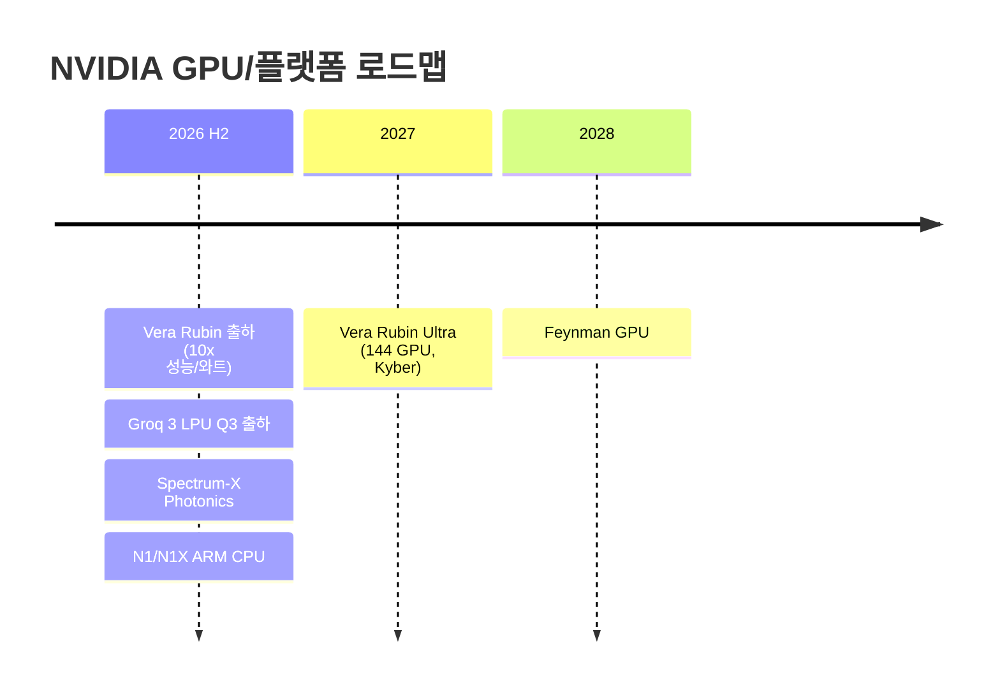
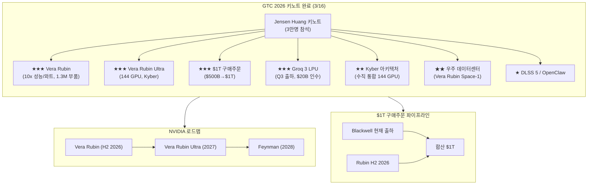
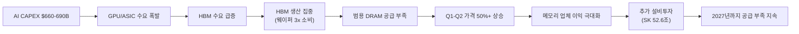
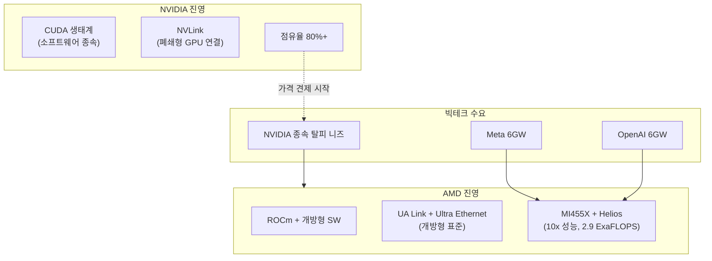

> **관련 글**: [2026년 투자 섹터 전망 (전체)](/knowledge/invest/2026/01/20/investment-sectors-outlook-2026.html)

2026년 글로벌 반도체 시장이 **~$975B(YoY +25%)**로 $1T 돌파를 눈앞에 두고 있습니다. 메모리 시장은 **$440B(+30%)** 성장이 전망되며, HBM TAM은 2028년 $100B에 달할 것으로 예상됩니다.

**3월 17일 핵심: GTC 2026 키노트가 완료되었습니다.** Jensen Huang이 공개한 핵심 내용:
- **Vera Rubin**: Grace Blackwell 대비 **10x 성능/와트**, 1.3M 부품
- **Vera Rubin Ultra**: **144 GPU 연결** 가능한 차세대 플래그십
- **블랙웰+루빈 $1T 구매주문** 전망 (기존 $500B에서 상향)
- **Groq 3 LPU**: $20B 인수 기업(Groq)의 첫 칩, Q3 출하, AI 추론 특화
- **Kyber**: 차세대 랙 아키텍처, 수직 통합 144 GPU, Vera Rubin Ultra(2027)에 적용
- **우주 데이터센터**: Vera Rubin Space-1, 궤도 데이터센터 목표

또한 **테슬라가 3/21 TeraFab 런칭**을 예고했습니다. $25B 투자, 2nm 공정, AI5 칩(자율주행/로봇 특화)으로 엔비디아 탈피 전략을 본격화합니다.

SK하이닉스는 **2026년 전체 HBM 출하량의 가격/물량 계약을 완료**했고, 삼성전자는 **HBM4 생산 50% 확대 계획(2026 하반기까지)**을 발표했습니다.

## 반도체 섹터 현황 (2026년 3월 17일 기준)

### 핵심 지표

| 항목 | 수치/현황 | 비고 |
|------|----------|------|
| **SOXX** | **337.83 (+1.96%)** | GTC 키노트 완료 후 반등 |
| **NVDA** | **$183.22 (+1.65%)** | 키노트 발표 수혜 |
| **KOSPI** | **5,683 (+3.57%)** | 삼성 +1.4%, SK하이닉스 +3.5% |
| **NASDAQ Tech** | **-1.18% (PE 44.1)** | 테크 조정 |
| **글로벌 반도체 매출 (2026)** | **~$975B (+25% YoY)** | 메모리 $440B (+30%) |
| **AI CAPEX (빅테크 합산)** | **$660-690B (~2x YoY)** | 75%($450B) AI 인프라 직접 투자 |
| **NVIDIA 구매주문 전망** | **블랙웰+루빈 $1T** | 기존 $500B에서 상향 |
| **HBM TAM** | **$54.6B (2026) → $100B (2028)** | BofA/TrendForce |
| **HBM4 점유율 (Rubin)** | **SK 70% / 삼성 mid-20% / Micron ~20%** | UBS 전망 |
| **HBM4 양산** | **2026년 2월 시작** | 삼성 세계 최초 출하 |
| **SK하이닉스 2026 HBM** | **전량 가격/물량 계약 완료** | 실적 가시성 확보 |
| **CPO 시장** | **연간 137% 성장** | 2026년 양산 시작, 월가 TOP1 테마 |
| **공급 부족 전망** | **2027년까지 지속** | IDC/TrendForce |

### 3월 17일 핵심 업데이트

| 항목 | 내용 |
|------|------|
| **★★★ GTC 키노트 완료** | Vera Rubin **10x 성능/와트**(1.3M 부품), Vera Rubin Ultra **144 GPU 연결**, 블랙웰+루빈 **$1T 구매주문** 전망 |
| **★★★ Groq 3 LPU** | $20B 인수 기업(Groq)의 첫 칩, **Q3 출하**. AI 추론 특화 |
| **★★★ Kyber 아키텍처** | 차세대 랙 아키텍처, **수직 통합 144 GPU**, Vera Rubin Ultra(2027)에 적용 |
| **★★ 우주 데이터센터** | **Vera Rubin Space-1**, 궤도 데이터센터 목표. NVIDIA TAM 확장의 극단적 비전 |
| **★★ 테슬라 TeraFab (3/21)** | **$25B 투자**, 2nm 공정 목표, 월 100만 웨이퍼(초기 10만 장), **AI5 칩**(자율주행/로봇 특화), 엔비디아 탈피 전략 |
| **★★ DLSS 5 / OpenClaw** | NVIDIA DLSS 5 공개, OpenClaw 파트너십 |
| **★ HBM4 양산 가속** | SK하이닉스 **전량 계약 완료**, 삼성 **50% 생산 확대**(H2까지) |

---

## GTC 2026 키노트 완료 (3/16)

GTC 2026 Jensen Huang 키노트가 완료되었습니다. 3만명이 참석한 역대 최대 규모에서 NVIDIA의 야심적인 로드맵이 확정되었습니다.

### 핵심 발표 사항

| 항목 | 내용 | 의미 |
|------|------|------|
| **★★★ Vera Rubin** | Grace Blackwell 대비 **10x 성능/와트**, **1.3M 부품** | 차세대 GPU 아키텍처의 압도적 성능 도약 |
| **★★★ Vera Rubin Ultra** | **144 GPU 연결** 가능 | Kyber 아키텍처와 결합, 초대규모 AI 훈련 가능 |
| **★★★ $1T 구매주문** | 블랙웰+루빈 합산 **$1T** (기존 $500B에서 상향) | GPU 수요의 구조적 폭발 확인 |
| **★★★ Groq 3 LPU** | $20B 인수(Groq)의 첫 칩, **Q3 출하** | AI 추론 특화, 추론 패러다임 전환 |
| **★★ Kyber** | 차세대 랙 아키텍처, **수직 통합 144 GPU** | Vera Rubin Ultra(2027)에 적용, 시스템 레벨 혁신 |
| **★★ 우주 데이터센터** | **Vera Rubin Space-1**, 궤도 데이터센터 | NVIDIA TAM 확장의 극단적 비전 |
| **★★ Thinking Machines Lab** | 다년 파트너십, **1GW+ Vera Rubin 시스템** | 단일 파트너 1GW+ 초대형 |
| **★★ NemoClaw** | **AI 에이전트 플랫폼** | 소프트웨어 생태계 확장 |
| **★ N1/N1X** | **ARM 기반 노트북 CPU** (Windows) | PC CPU 시장 진입, TAM 확대 |
| **★ DLSS 5** | 차세대 그래픽 업스케일링 | 게이밍/렌더링 혁신 |
| **★ OpenClaw** | 로보틱스 파트너십 | 물리 AI 생태계 확장 |

### NVIDIA 로드맵

### Kyber 아키텍처 + Vera Rubin Ultra

NVIDIA의 차세대 랙 아키텍처 **Kyber**는 수직 통합 방식으로 **144 GPU**를 단일 시스템으로 연결합니다. 2027년 출시 예정인 **Vera Rubin Ultra**에 적용되며, 기존 NVLink 대비 대폭 향상된 GPU 간 통신 대역폭을 제공합니다.

| 항목 | 내용 |
|------|------|
| **Kyber** | 차세대 랙 아키텍처, 수직 통합 **144 GPU** |
| **Vera Rubin Ultra** | Kyber 적용, **2027년** 출시 |
| **Vera Rubin** | **10x 성능/와트**, 1.3M 부품, **H2 2026** 출하 |
| **$1T 구매주문** | 블랙웰+루빈 합산, 기존 $500B에서 **2x 상향** |

### Groq 3 LPU

NVIDIA가 $20B에 인수한 Groq의 첫 칩 **Groq 3 LPU**가 Q3 출하 예정입니다. AI 추론에 특화된 아키텍처로, SRAM 기반 결정론적 실행을 통해 추론 TCO를 근본적으로 개선합니다.

| 항목 | 내용 |
|------|------|
| **인수 금액** | **$20B** |
| **출하 시기** | **Q3 2026** |
| **아키텍처** | SRAM 기반 LPU, AI 추론 특화 |
| **제조** | TSMC **A16 공정** + **3D 스태킹** |
| **삼성 수혜** | SRAM 트랜지스터 6개 → 면적 大 → **삼성 4나노 가성비 우위** |

**투자 시사점**: Groq 3 LPU는 추론 시장에서 GPU 보완재로 자리잡을 가능성이 높습니다. 삼성 파운드리의 SRAM 칩 생산 수혜와 메모리 구조의 DRAM+SRAM 이원화 등 공급망 전반에 파급효과가 있습니다.

### 우주 데이터센터

NVIDIA가 **Vera Rubin Space-1**으로 궤도 데이터센터를 목표로 합니다. 현재는 비전 단계이나, NVIDIA가 지구 밖 컴퓨팅 인프라까지 TAM을 확장하려는 야심을 보여줍니다.

---

## 테슬라 TeraFab (3/21 런칭)

테슬라가 3월 21일 **TeraFab** 런칭을 예고했습니다. 반도체 자체 제조를 통해 엔비디아 칩 의존도를 해소하려는 전략입니다.

| 항목 | 내용 |
|------|------|
| **투자 규모** | **$25B** |
| **공정** | **2nm** 목표 |
| **웨이퍼** | 월 **100만 장** 목표 (초기 10만 장) |
| **칩** | **AI5** (자율주행/로봇 특화) |
| **목적** | 엔비디아 탈피 — 영업이익률 70-80%인 엔비디아 칩 의존도 해소 |
| **마진 효과** | 성공 시 **7-8조원 마진** 확보 가능 |
| **런칭일** | **3/21** |

### 투자 시사점

| 구분 | 내용 |
|------|------|
| **긍정적** | 자체 칩 성공 시 테슬라 마진 대폭 개선, 반도체 산업 수요 총량 확대 |
| **리스크** | 반도체 제조 경험 **전무**, 도조(Dojo) **실패 전례**, 2nm 공정 난이도 극단적 |
| **NVIDIA 영향** | 단기 무관 — 테슬라 자체 칩 양산까지 수년 소요. 장기적으로 GPU 매출 일부 대체 가능 |

---

## CPO(Co-Packaged Optics): 2026년 월가 TOP1 투자 테마

데이터센터 내부 인터커넥트가 **구리선의 물리적 한계**에 도달했습니다. 224G SerDes에서 구리선 전송 거리는 **50cm**에 불과하며, 광 신호 전환이 불가피합니다.

### CPO 시장 현황

| 항목 | 내용 |
|------|------|
| **시장 성장률** | **연간 137%** 성장 |
| **양산 시점** | **2026년** 본격 양산 시작 |
| **구리선 한계** | 224G SerDes에서 **50cm** — 물리적 한계 도달 |
| **월가 평가** | **2026년 TOP1 투자 테마** |

### NVIDIA CPO 제품 라인업

| 제품 | 내용 | 시기 |
|------|------|------|
| **Spectrum-X Photonics** | CPO 기반 이더넷 스위치 | **H2 2026 출시** |
| **Quantum-X IB** | InfiniBand **115Tb/s** | GTC 발표 |

### CPO 핵심 수혜주

| 종목 | 포지션 | 비고 |
|------|--------|------|
| **Marvell (MRVL)** | 광통신 포토닉 패브릭스, AEC, DSP, 커스텀 칩 | 고점 대비 **-30% 저평가** |
| **Credo (CRDO)** | AEC(Active Electrical Cable) 리타이머 | CPO 전환기 수혜 |
| **Corning (GLW)** | 광섬유 소재 | 광 인프라 근간 |
| **NVIDIA** | Spectrum-X Photonics, Quantum-X | 플랫폼 주도 |

**투자 시사점**: CPO는 AI 인프라의 다음 병목(인터커넥트 대역폭)을 해소하는 핵심 기술입니다. 구리선의 물리적 한계는 소프트웨어로 해결할 수 없으며, 광 전환은 필연적입니다. **Marvell은 종합 플레이어임에도 고점 대비 -30% 저평가** 상태로 주목됩니다.

---

## HBM4 양산 가속 및 점유율 확정

HBM4 양산이 **2026년 2월부터** 시작되었습니다. SK하이닉스는 **2026년 전체 HBM 출하량의 가격/물량 계약을 완료**하여 실적 가시성이 확보되었고, 삼성전자는 **HBM4 생산 50% 확대**를 계획하고 있습니다.

| 업체 | HBM4 점유율 | 현황 | 비고 |
|------|-----------|------|------|
| **SK하이닉스** | **~70%** (UBS) | **2026 전체 HBM 가격/물량 계약 완료** | 업계 압도적 1위, 실적 확정 |
| **삼성전자** | **mid-20%** | **2/12 HBM4 출하 시작**(세계 최초), **H2까지 생산 50% 확대** | 점유율 회복 가속 |
| **Micron** | **~20%** | Q2 2026 **15K 웨이퍼/월 램프** | 2026 전량 매진 |
| **HBM3E 가격** | — | 삼성/SK 모두 **~20% 인상** 추진 | 가격 결정력 강화 |
| **NVIDIA** | — | **16-Hi HBM4 Q4 2026 요청** | Vera Rubin 풀 프로덕션 |

### HBM 시장 규모

| 연도 | TAM |
|------|-----|
| **2026** | **$54.6B (+58% YoY)** |
| **2028** | **$100B** |

### 소비자 메모리 부족 심화

HBM3E/HBM4/DDR7에 대한 수요가 범용 메모리 생산라인을 잠식하면서, 소비자 메모리 부족이 심화되고 있습니다.

| 항목 | 내용 |
|------|------|
| **원인** | HBM 생산이 GB당 **~3배 웨이퍼 용량** 소비 → 범용 DRAM 라인 축소 |
| **가격 영향** | **Q1-Q2 가격 50%+ 추가 상승 가능** |
| **공급 부족 기간** | **2027년까지 지속** (IDC/TrendForce) |
| **완화 시점** | SK하이닉스 M15X 팹 가동 (2027년 말) |

**핵심**: SK하이닉스의 2026년 전량 계약 완료는 실적 가시성 측면에서 매우 강력한 신호입니다. 삼성전자의 50% 생산 확대와 세계 최초 양산은 점유율 회복의 전환점이며, 소비자 메모리 부족으로 메모리 업체 전체의 수익성이 극대화되는 구조입니다.

---

## AI 칩 수출규제 초안 (3월 5일 발표, 초안 단계)

| 항목 | 내용 |
|------|------|
| **상태** | **초안 단계** (3/5 발표) |
| **규제 범위** | 모든 글로벌 AI 칩 수출에 정부 라이선스 요구 |
| **영향** | NVIDIA, AMD, Broadcom, Intel 등 모든 AI 칩 업체 |
| **투자 시사점** | 미국 내 AI 인프라 투자($660-690B)는 영향 없음. 미국 내 제조 가속화에 긍정적 가능. **초안 단계이므로 최종 확정까지 모니터링 필요** |

---

## $1T 시대: 반도체 기가사이클

글로벌 반도체 시장이 2026년 **~$975B(YoY +25%)**로 $1T 돌파를 눈앞에 두고 있습니다(메모리 $440B, +30%). 3대 성장 동력:

1. **AI 인프라 투자 폭발**: 빅테크 AI CAPEX $660-690B(~2x YoY), 75%가 AI 인프라 직접 투자
2. **RAMmageddon**: HBM 생산 집중 → 범용 DRAM 구조적 부족 → 전 메모리 가격 역사적 폭등
3. **HBM 과점 프리미엄**: SK하이닉스 70%, 삼성 mid-20%, Micron ~20% — 가격 결정력 극대화

---

## AI CAPEX: $660-690B (전년비 ~2배)

| 기업 | AI CAPEX (2026) | 비고 |
|------|----------------|------|
| **Amazon** | **$200B** | 최대 투자 |
| **Google** | **$175-185B** | |
| **Microsoft** | **$120B+** | |
| **Meta** | **$115-135B** | AMD 6GW $60B 딜 포함 |
| **합산** | **$660-690B** | **전년비 ~2배** |
| **AI 인프라 직접** | **~$450B (75%)** | GPU/ASIC/서버/네트워크 |

---

## AI 칩: AMD MI455X로 NVIDIA 독점 최초 구조적 도전

### AMD MI455X + Helios

| 항목 | 내용 |
|------|------|
| **MI455X GPU** | HBM4 2GB, 전세대 대비 **10x 성능**, 칩렛 설계(2nm+3nm) |
| **Helios 시스템** | GPU 72개 + CPU 18개 단일 렉, **2.9 ExaFLOPS** |
| **Meta 6GW 딜** | **~$60B (5년)**, 연간 $20-25B (2H 2026 시작) |
| **OpenAI 6GW 딜** | 합산 **12GW**, AMD AI 점유율 9% → 18% (2026E) |
| **출하 일정** | Helios **2H 2026** 목표, 온타겟 |

**투자 시사점**: NVIDIA 점유율은 장기적으로 60-70%로 하락 전망이나, **AI 데이터센터 시장 자체가 연 50% 성장**하므로 양사 모두 수혜.

### NVIDIA: Vera Rubin → Vera Rubin Ultra → Feynman

| 항목 | 내용 |
|------|------|
| **FY27 매출 전망** | **$66B (+68% YoY)** |
| **구매주문 전망** | 블랙웰+루빈 **$1T** (기존 $500B에서 상향) |
| **Vera Rubin** | **10x 성능/와트**, 1.3M 부품, **H2 2026** 출하 |
| **Vera Rubin Ultra** | **144 GPU 연결**, Kyber 아키텍처 적용, **2027년** 출시 |
| **Feynman GPU** | **2028년** 예정 — 차차세대 아키텍처 |
| **Groq 3 LPU** | $20B 인수, **Q3 2026** 출하, AI 추론 특화 |
| **Kyber** | 차세대 랙 아키텍처, 수직 통합 144 GPU |
| **N1/N1X** | **ARM 기반 노트북 CPU** (Windows) — PC TAM 확대 |
| **NemoClaw** | AI 에이전트 플랫폼 — 소프트웨어 생태계 확장 |
| **우주 DC** | Vera Rubin Space-1, 궤도 데이터센터 목표 |
| **점유율** | **80%+** (AMD 12GW가 첫 구조적 위협) |
| **목표가** | Goldman $250, Morgan Stanley $260 |

### Broadcom / Marvell

| 종목 | 핵심 | 최신 |
|------|------|------|
| **Broadcom** | ASIC 60-80% 점유 | **AI 매출 $8.4B (+74%), Q2 $22B 가이던스** |
| **Marvell** | 커스텀 ASIC + **CPO 종합 플레이어** | **$0→$1.5B/년, 주가 +16%**, 고점 대비 **-30%** |

---

## RAMmageddon: 소비자 메모리 부족 심화

### 가격 동향

| 제품 | Q1 변동 | 최신 동향 |
|------|---------|----------|
| **범용 DRAM** | **+90-95% QoQ (역대 최대)** | 현물가 > 계약가 (이례적) |
| **서버 DRAM (DDR5)** | **+105-110% QoQ** | 삼성/SK → 구글/MS 60-70% 인상 요구 |
| **64GB RDIMM DDR5** | | $255(Q3'25) → $450(Q4'25) → **$700+(3월)** |
| **소비자 메모리** | | HBM3E/HBM4/DDR7 수요 → **Q1-Q2 50%+ 추가 상승 가능** |
| **NAND** | **+55-60% QoQ** | |

**현물 > 계약의 의미**: 공급 부족이 극심하여 급한 수요가 프리미엄을 지불하는 상황. **Q2 계약 가격은 최소 +20% 추가 상승 컨센서스.**

### SK하이닉스 대규모 투자

| 투자 | 금액 | 비고 |
|------|------|------|
| **용인 투자** | **₩31T** | 기존 발표 |
| **추가 투자 (2/25)** | **₩21.6T** | |
| **합계** | **₩52.6T** | HBM/첨단 DRAM 집중 |

---

## 파운드리: TSMC N2 램프업, 삼성-인텔 동맹

| 항목 | 내용 |
|------|------|
| **TSMC N2 (2nm)** | 램프업 진행 중, **100K-140K 웨이퍼/월** (2026년 말), $165B 미국 투자 |
| **삼성-인텔** | 파운드리 동맹 논의, Intel Z990 삼성 8nm 제조 |
| **삼성 Taylor** | 양산 2027년 연기, 2nm GAA 집중 |
| **테슬라 AI6** | $16B+ (역대 최대 외부 파운드리 수주) |

---

## 장비: EUV 신모델 + 첨단 패키징

| 항목 | 내용 |
|------|------|
| **ASML EUV NXE:5000** | **2026년 1월 출하** |
| **ASML 백로그** | $388B, Q1 주문 €132B(기록) |
| **Applied Materials + Lam** | 차세대 식각/증착 협업 |
| **첨단 패키징 장비** | HBM/chiplet용 수요 급증 |

---

## 주요 종목 분석

### SK하이닉스 (000660) - ~941,000원, PER ~4.2배

| 항목 | 내용 |
|------|------|
| **주가** | **~941,000원** |
| **PER** | **~4.2배** (반도체 평균 15-20배 대비 극단적 저평가) |
| **영업이익률** | **67%** |
| **HBM4 점유율** | **~70% (#1, UBS)** |
| **2026 HBM** | **전량 가격/물량 계약 완료** |
| **용인 총 투자** | **₩52.6T** |

**목표가**

| 증권사 | 목표가 | OP 전망 |
|--------|--------|---------|
| 키움증권 | **130만원** | OP 170조 |
| 하나증권 | **145만원** | OP 112조 |
| 대신증권 | **145만원** | OP 100.7조 |
| 시티/SK증권 | **140-150만원** | |
| 노무라 | 156만원 | OP 189조 |

현재가 ~94.1만원 기준: 목표가 130만원은 **+38%**, 145만원은 **+54%**.

### 삼성전자 (005930) - ~195,100원

| 항목 | 내용 |
|------|------|
| **주가** | **~195,100원** |
| **Q1 2026 OP** | **~30조원 (사상 첫 분기 30조 돌파 전망)** |
| **2026 연간 OP** | **170-201조원** |
| **HBM4 점유율** | **mid-20%** (UBS), 2/12 세계 최초 출하, **H2까지 50% 생산 확대** |
| **파운드리 수혜** | Groq SRAM 칩 삼성 4나노 생산 중 |

### NVIDIA (NVDA) - $183.22 (+1.65%)

| 항목 | 내용 |
|------|------|
| **주가** | **$183.22 (+1.65%)** |
| **GTC 키노트 완료** | Vera Rubin **10x 성능/와트**, Vera Rubin Ultra **144 GPU**, **$1T 구매주문**, Groq 3 LPU, Kyber, 우주 데이터센터 |
| **FY27 매출** | $66B (+68%) |
| **로드맵** | Vera Rubin(H2 2026) → Vera Rubin Ultra(2027, Kyber) → Feynman(2028) |
| **목표가** | Goldman $250, Morgan Stanley $260 |

### AMD (AMD) - MI455X + 12GW 초대형 계약

| 항목 | 내용 |
|------|------|
| **MI455X** | HBM4 2GB, 10x 성능, 칩렛 2nm+3nm |
| **Helios** | 2.9 ExaFLOPS, 2H 2026 출하 |
| **계약** | Meta 6GW + OpenAI 6GW = 12GW |
| **AI 점유율** | 9% → 18% (2026E) |

---

## 시장 지표

| 항목 | 수치 | 비고 |
|------|------|------|
| **SOXX** | **337.83 (+1.96%)** | GTC 키노트 완료 후 반등 |
| **NVDA** | **$183.22 (+1.65%)** | 키노트 발표 수혜 |
| **KOSPI** | **5,683 (+3.57%)** | 삼성 +1.4%, SK하이닉스 +3.5% |
| **NASDAQ Tech** | **-1.18% (PE 44.1)** | 테크 조정 |
| **글로벌 반도체 2026** | **~$975B (+25% YoY)** | 메모리 $440B (+30%) |

---

## 관세 환경: Section 122 (15%)

| 관세 유형 | 세율 | 현황 | 반도체 영향 |
|----------|------|------|-----------|
| **IEEPA 상호관세** | 국가별 차등 | **위헌 무효** | 환급 가능 |
| **Section 122** | **15%** | **2/24 발효, 150일 한시** | IEEPA 25% 대비 하향 = **순긍정** |
| **Section 232** | **25%** | **유지** | 첨단 로직 대상 |

---

## 실적 전망

### 삼성전자

| 출처 | 2026 OP | 비고 |
|------|---------|------|
| **Q1 전망** | **~30조 (사상 첫)** | |
| 하나증권 | 113조 | |
| 키움증권 | 120조 | |
| 노무라 | 135조 | |
| **연간 범위** | **170-201조** | 모건스탠리 2027: 317조 |

### SK하이닉스

| 출처 | 2026 OP | 목표가 |
|------|---------|--------|
| 대신증권 | 100.7조 | **145만원** |
| 하나증권 | 112조 | **145만원** |
| 키움증권 | 170조 | **130만원** |
| 노무라 | 189조 | 156만원 |
| 시티/SK증권 | | **140-150만원** |

---

## 투자 전략

### 액션 플랜

| 전략 | 내용 |
|------|------|
| **단기 (1-2주)** | GTC 키노트 완료 — $1T 구매주문, Vera Rubin 10x, Groq 3 LPU 등 발표 수혜 확인. **테슬라 TeraFab 런칭(3/21)** 주시. FOMC(3/17-18). S&P 500 리밸런싱(3/23) |
| **중기 (1-3개월)** | HBM4 양산 가속(SK 전량 계약 완료, 삼성 50% 확대) → Q2 실적 서프라이즈 기대. Groq 3 LPU Q3 출하 대비 |
| **장기 (6개월+)** | ~$975B(+25%) 기가사이클, AI CAPEX $660-690B, HBM TAM $100B(2028), $1T 구매주문 실현 모니터링 |

### 투자 근거

1. **GTC 키노트 완료 — $1T 구매주문**: 블랙웰+루빈 합산 $1T(기존 $500B 대비 2배 상향). GPU 수요의 구조적 폭발 확인
2. **Vera Rubin 10x 성능/와트**: 1.3M 부품, H2 2026 출하. Vera Rubin Ultra 144 GPU + Kyber 아키텍처(2027)
3. **Groq 3 LPU Q3 출하**: $20B 인수 Groq의 첫 칩, AI 추론 패러다임 전환. 삼성 파운드리 SRAM 수혜
4. **테슬라 TeraFab 3/21**: $25B 투자, AI5 칩. 성공 시 반도체 수요 총량 확대. 리스크: 제조 경험 전무
5. **CPO 월가 TOP1 테마**: 구리선 물리적 한계 → 광 전환 불가피, 137% 성장 — Marvell(-30%)/Credo/Corning
6. **HBM4 양산 가속**: SK하이닉스 70% + 전량 계약 완료, 삼성 50% 확대
7. **~$975B(+25%) 기가사이클**: 메모리 $440B(+30%), $1T 돌파 눈앞
8. **AI CAPEX 불변**: $660-690B, 빅테크 가이던스 변동 없음

### 매도 트리거 (감시 신호)

1. **DRAM 가격 하락 전환** -- 67-70% 영업마진이 꺾이기 시작할 때
2. **AI 수출규제 최종 확정 시 범위** -- 동맹국 포함 여부, 시행 시기
3. **HBM 공급 과잉 신호** -- 3사 동시 증설 가속
4. **빅테크 CAPEX 가이던스 하향** -- AI 투자 모멘텀 둔화
5. **메모리 수요 파괴** -- PC/모바일 OEM 스펙 다운그레이드 현실화
6. **NVIDIA 가격 결정력 훼손** -- AMD 12GW + 테슬라 AI5 자체 칩으로 GPU ASP 하락 여부

### 핵심 일정

| 일정 | 내용 | 중요도 |
|------|------|--------|
| **3/17~18** | **FOMC** | 높음 |
| **3/21** | **테슬라 TeraFab 런칭** ($25B, 2nm, AI5 칩) | **최고** |
| **3/23** | **S&P 500 리밸런싱** — 반도체 종목 편출입 주시 | 중간 |
| **Q3 2026** | **Groq 3 LPU 출하** | 높음 |
| **~7월** | Section 122 관세 150일 시한 | 높음 |
| **Q2 2026** | HBM4 인증 예상 (TrendForce) | 높음 |
| H2 2026 | Vera Rubin 출하, AMD Helios/MI455X 출하, Spectrum-X Photonics | 높음 |
| 2027 | Vera Rubin Ultra + Kyber 아키텍처 | 높음 |
| 2027년 말 | SK하이닉스 M15X 가동 → 공급 완화 시작 | 중간 |
| 2028 | Feynman GPU | 높음 |

---

## 리스크 요인

| 리스크 | 현황 | 평가 |
|--------|------|------|
| **★ AI 칩 수출규제 초안** | 모든 AI 칩 수출에 정부 라이선스 요구 (3/5, 초안) | 최종 확정 시기 미정, 모니터링 |
| **★ 호르무즈 위기/전쟁** | 에너지 가격 급등, 글로벌 불확실성 | 반도체 직접 영향 제한적 |
| **NVIDIA 가격 결정력 약화** | AMD 12GW + 테슬라 AI5 자체 칩 | 시장 파이 확대로 양사 수혜 가능. 테슬라 양산까지 수년 소요 |
| **테슬라 TeraFab 리스크** | $25B 투자, 2nm 공정, 제조 경험 전무, Dojo 실패 전례 | 성공 시 반도체 수요 총량 확대, 실패 시 NVIDIA 수혜 지속 |
| **메모리 수요 파괴** | 가격 급등 → PC/모바일 OEM 스펙 다운그레이드 가능 | 서버/AI 수요 40%+, 기반 견고 |
| **AI CAPEX 과잉** | $660-690B(~2x), 빅테크 FCF 급감 전망 | 분기별 CAPEX 가이던스 모니터링 |
| **Section 122 관세** | 15%, 150일 한시 | 정책 방향 모니터링 |

---

## 결론

| 항목 | 내용 |
|------|------|
| **전체 방향성** | **~$975B(+25%)** 기가사이클. GTC 키노트 완료로 **$1T 구매주문**, Vera Rubin **10x**, Groq 3 LPU 등 확인. 테슬라 TeraFab 3/21 |
| **최대 카탈리스트** | **$1T 구매주문** (블랙웰+루빈, 기존 $500B에서 상향), **Groq 3 LPU Q3 출하**, **TeraFab 3/21 런칭** |
| **3/17 핵심** | GTC 키노트 완료. Vera Rubin 10x, Vera Rubin Ultra 144 GPU, $1T 구매주문, Groq 3, Kyber, 우주 DC. 테슬라 TeraFab 3/21 대기 |
| **시장 포지션** | SOXX 337.83(+1.96%), NVDA $183.22(+1.65%), KOSPI 5,683(+3.57%), NASDAQ Tech -1.18% |
| **최대 수혜** | SK하이닉스(PER ~4.2배, HBM4 70%, 전량 계약), 삼성전자(HBM4 양산 + 50% 확대 + Groq SRAM 파운드리), NVIDIA($1T 파이프라인), Marvell(CPO -30%) |
| **이번 주 주시** | **테슬라 TeraFab(3/21)**, FOMC(3/17-18), S&P 500 리밸런싱(3/23) |
| **투자 전략** | **GTC 발표 수혜 확인, $1T 파이프라인 신뢰 강화, TeraFab 런칭 영향 분석, SK하이닉스 전량 계약 + 삼성 확대 수혜** |

**GTC 2026 키노트가 완료되었습니다.** 핵심 발표: **Vera Rubin(10x 성능/와트, 1.3M 부품)**, **Vera Rubin Ultra(144 GPU, Kyber 아키텍처)**, **블랙웰+루빈 $1T 구매주문**(기존 $500B 대비 2배 상향), **Groq 3 LPU(Q3 출하, $20B 인수)**, **우주 데이터센터(Vera Rubin Space-1)**. NVIDIA의 3년 로드맵이 확정되면서 기술 우위와 수요의 구조적 폭발이 입증되었습니다. **테슬라는 3/21 TeraFab 런칭**으로 $25B 투자, 2nm AI5 칩 자체 제조를 본격화합니다.

**투자 결정은 본인의 리스크 허용 범위와 투자 기간을 고려하여 신중하게 내리시기 바랍니다.**

---

## 하위 섹터 상세 분석

- [HBM 투자 전망](/knowledge/invest/2026/01/21/hbm-sector-outlook-2026.html) - 고대역폭 메모리 심층 분석
- [DRAM/NAND 투자 전망](/knowledge/invest/2026/01/21/dram-nand-sector-outlook-2026.html) - 범용 메모리 분석
- [파운드리 투자 전망](/knowledge/invest/2026/01/21/foundry-sector-outlook-2026.html) - TSMC, 삼성전자 파운드리 분석
- [소부장 투자 전망](/knowledge/invest/2026/01/21/semiconductor-materials-equipment-outlook-2026.html) - 소재/부품/장비 분석
- [AI 소프트웨어/클라우드](/knowledge/invest/2026/03/07/ai-software-cloud-outlook-2026.html) - AI SW/클라우드 심층 분석
