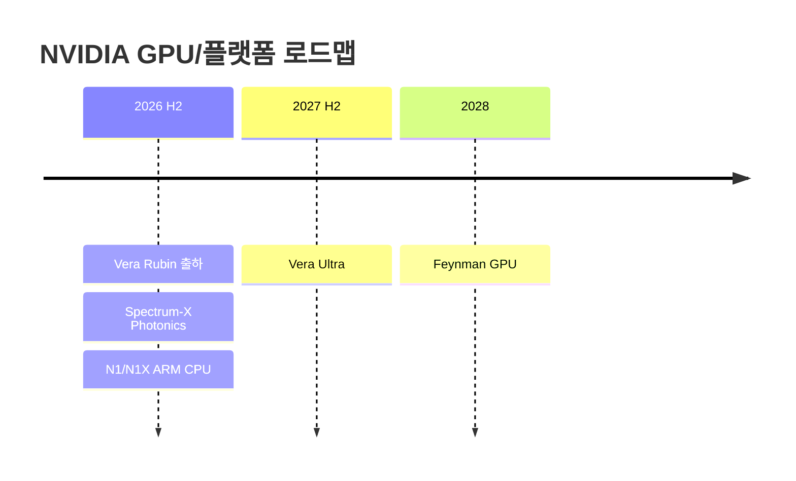
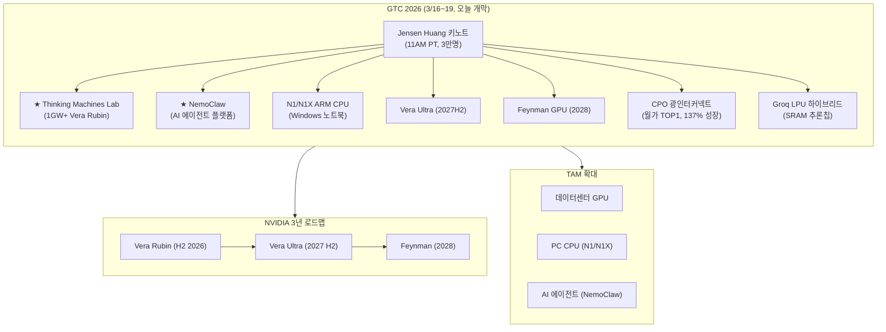
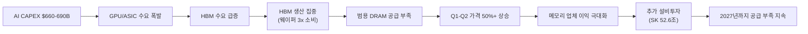
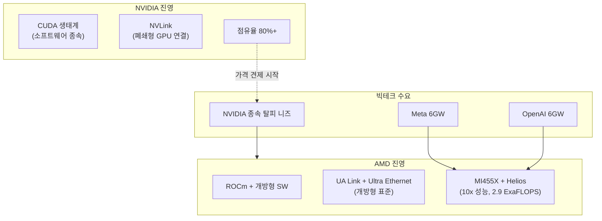

> **관련 글**: [2026년 투자 섹터 전망 (전체)](/knowledge/invest/2026/01/20/investment-sectors-outlook-2026.html)

2026년 글로벌 반도체 시장이 **~$975B(YoY +25%)**로 $1T 돌파를 눈앞에 두고 있습니다. 메모리 시장은 **$440B(+30%)** 성장이 전망되며, HBM TAM은 2028년 $100B에 달할 것으로 예상됩니다. HBM3E/HBM4/DDR7 수요로 소비자 메모리 부족이 심화되어 **Q1-Q2 가격 50%+ 추가 상승**이 가능한 상황입니다.

**3월 16일 핵심: GTC 2026이 오늘 개막했습니다.** Jensen Huang 키노트(11AM PT, 3만명 참석)에서 NVIDIA의 차세대 로드맵이 공개됩니다. **Thinking Machines Lab과 다년 파트너십(1GW+ Vera Rubin 시스템)**, **NemoClaw AI 에이전트 플랫폼**, **N1/N1X ARM 기반 노트북 CPU(Windows)**, **Vera Ultra(2027 H2)**, **Feynman GPU(2028)** 등이 핵심 발표 사항입니다.

SK하이닉스는 **2026년 전체 HBM 출하량의 가격/물량 계약을 완료**했고, 삼성전자는 **HBM4 생산 50% 확대 계획(2026 하반기까지)**을 발표했습니다.

## 반도체 섹터 현황 (2026년 3월 16일 기준)

### 핵심 지표

| 항목 | 수치/현황 | 비고 |
|------|----------|------|
| **SOXX** | **331.32 (+0.34%)** | 공포 속 보합 방어 |
| **NVDA** | **$180.25 (-1.59%)** | GTC 당일, 키노트 대기 |
| **BOTZ** | **34.83 (-2.14%)** | AI/로보틱스 ETF |
| **글로벌 반도체 매출 (2026)** | **~$975B (+25% YoY)** | 메모리 $440B (+30%) |
| **AI CAPEX (빅테크 합산)** | **$660-690B (~2x YoY)** | 75%($450B) AI 인프라 직접 투자 |
| **HBM TAM** | **$54.6B (2026) → $100B (2028)** | BofA/TrendForce |
| **HBM4 점유율 (Rubin)** | **SK 70% / 삼성 mid-20% / Micron ~20%** | UBS 전망 |
| **HBM4 양산** | **2026년 2월 시작** | 삼성 세계 최초 출하 |
| **SK하이닉스 2026 HBM** | **전량 가격/물량 계약 완료** | 실적 가시성 확보 |
| **CPO 시장** | **연간 137% 성장** | 2026년 양산 시작, 월가 TOP1 테마 |
| **공급 부족 전망** | **2027년까지 지속** | IDC/TrendForce |

### 3월 16일 핵심 업데이트

| 항목 | 내용 |
|------|------|
| **★★★ GTC 2026 오늘 개막** | Jensen Huang 키노트 **11AM PT, 3만명 참석**. Vera Ultra(2027H2)·Feynman(2028)·N1/N1X CPU·NemoClaw AI 에이전트·Thinking Machines Lab 1GW+ 파트너십 |
| **★★★ Thinking Machines Lab** | NVIDIA와 다년 파트너십: **1GW+ Vera Rubin 시스템** 구축. AI 인프라 수요의 규모 확인 |
| **★★★ NemoClaw** | NVIDIA **AI 에이전트 플랫폼** 공개. AI 에이전트 시장 본격 진출 |
| **★★ N1/N1X** | NVIDIA **ARM 기반 노트북 CPU** 출시 (Windows). Qualcomm/Intel PC CPU 시장 진입 |
| **★★ Vera Ultra / Feynman** | **Vera Ultra**: 2027 H2 출시. **Feynman GPU**: 2028년 예정. 로드맵 가시성 3년 확보 |
| **★★ HBM4 양산 가속** | 2026년 2월~ 양산 시작. 삼성 **50% 생산 확대**(H2까지). SK하이닉스 **전량 계약 완료** |
| **★★ 소비자 메모리 부족** | HBM3E/HBM4/DDR7 수요 → 소비자 메모리 부족 → **Q1-Q2 가격 50%+ 추가 상승 가능** |

---

## GTC 2026 (3/16~19, 오늘 개막)

GTC 2026이 오늘 개막했습니다. Jensen Huang 키노트가 오늘 11AM PT에 시작되며, **3만명**이 참석하는 사상 최대 규모입니다.

### 핵심 발표 사항

| 항목 | 내용 | 의미 |
|------|------|------|
| **★★★ Thinking Machines Lab** | NVIDIA와 다년 파트너십, **1GW+ Vera Rubin 시스템** 구축 | **AI 인프라 수요의 실체적 규모 확인** — 단일 파트너 1GW+는 초대형 |
| **★★★ NemoClaw** | NVIDIA **AI 에이전트 플랫폼** 공개 | AI 에이전트 시장 본격 진출, 소프트웨어 생태계 확장 |
| **★★ N1/N1X** | NVIDIA **ARM 기반 노트북 CPU** (Windows) | PC CPU 시장 진입 — Qualcomm Snapdragon X/Intel 직접 경쟁. NVIDIA TAM 확대 |
| **★★ Vera Ultra** | **2027 H2** 출시 | Vera Rubin 이후 차세대. 고객 로드맵 확정 |
| **★★ Feynman GPU** | **2028년** 예정 | 차차세대 아키텍처, 3년 로드맵 가시성 확보 |
| **★ Vera Rubin** | Grace CPU → **Vera CPU + HBM4**, H2 2026 출하 | 10x 성능/와트 개선 |
| **★ CPO 광인터커넥트** | **Spectrum-X Photonics(H2 2026)**, Quantum-X IB 115Tb/s | 월가 TOP1 테마, 137% 성장 |
| **★ Groq LPU 하이브리드** | SRAM 기반 추론칩, A16+3D 스태킹 | 추론 패러다임 전환 |

### NVIDIA 로드맵

### Thinking Machines Lab 파트너십

NVIDIA와 Thinking Machines Lab의 다년 파트너십은 **1GW 이상의 Vera Rubin 시스템** 구축을 목표로 합니다. 이는 단일 파트너십으로는 초대형 규모이며, AI 인프라 수요가 GW 단위로 확장되고 있음을 실증합니다.

| 항목 | 내용 |
|------|------|
| **파트너** | Thinking Machines Lab |
| **규모** | **1GW+** Vera Rubin 시스템 |
| **기간** | 다년 계약 |
| **의미** | AI 인프라 수요의 실체적 규모 확인, NVIDIA GPU 수요 안정성 |

### Groq LPU 하이브리드 추론칩

NVIDIA가 Groq의 SRAM 기반 LPU 기술을 결합한 **하이브리드 추론 프로세서**를 발표합니다.

| 항목 | 내용 |
|------|------|
| **아키텍처** | 프리필(**DRAM 기반 CPX**) + 디코드(**SRAM 기반 LPX**) 분리형 |
| **제조** | TSMC **A16 공정** + **3D 스태킹** |
| **LPX 랙** | **256 LPU/rack** (1세대 대비 4배) |
| **GPU 활용률** | 기존 **30-40%** → SRAM 결정론적 실행 **100%** |
| **첫 고객** | OpenAI — **3GW 전용 용량** 확보 |
| **삼성 수혜** | SRAM 트랜지스터 6개 → 면적 大 → **삼성 4나노 가성비 우위** |

**투자 시사점**: 하이브리드 아키텍처는 추론 TCO를 근본적으로 개선합니다. 삼성 파운드리의 SRAM 칩 생산 수혜, 메모리 구조의 DRAM+SRAM 이원화 등 공급망 전반에 파급효과가 있습니다.

### 메모리 업체 GTC 출품

| 업체 | 출품 | 의미 |
|------|------|------|
| **삼성전자** | **SOCAMM2** (LPDDR 모듈) | 전력 소비 1/3, 에지/추론 서버 타겟 |
| **SK하이닉스** | **SOCAMM2** (LPDDR 모듈) | 삼성과 직접 경쟁, HBM4 쇼케이스 병행 |

---

## CPO(Co-Packaged Optics): 2026년 월가 TOP1 투자 테마

데이터센터 내부 인터커넥트가 **구리선의 물리적 한계**에 도달했습니다. 224G SerDes에서 구리선 전송 거리는 **50cm**에 불과하며, 광 신호 전환이 불가피합니다.

### CPO 시장 현황

| 항목 | 내용 |
|------|------|
| **시장 성장률** | **연간 137%** 성장 |
| **양산 시점** | **2026년** 본격 양산 시작 |
| **구리선 한계** | 224G SerDes에서 **50cm** — 물리적 한계 도달 |
| **월가 평가** | **2026년 TOP1 투자 테마** |

### NVIDIA CPO 제품 라인업

| 제품 | 내용 | 시기 |
|------|------|------|
| **Spectrum-X Photonics** | CPO 기반 이더넷 스위치 | **H2 2026 출시** |
| **Quantum-X IB** | InfiniBand **115Tb/s** | GTC 발표 |

### CPO 핵심 수혜주

| 종목 | 포지션 | 비고 |
|------|--------|------|
| **Marvell (MRVL)** | 광통신 포토닉 패브릭스, AEC, DSP, 커스텀 칩 | 고점 대비 **-30% 저평가** |
| **Credo (CRDO)** | AEC(Active Electrical Cable) 리타이머 | CPO 전환기 수혜 |
| **Corning (GLW)** | 광섬유 소재 | 광 인프라 근간 |
| **NVIDIA** | Spectrum-X Photonics, Quantum-X | 플랫폼 주도 |

**투자 시사점**: CPO는 AI 인프라의 다음 병목(인터커넥트 대역폭)을 해소하는 핵심 기술입니다. 구리선의 물리적 한계는 소프트웨어로 해결할 수 없으며, 광 전환은 필연적입니다. **Marvell은 종합 플레이어임에도 고점 대비 -30% 저평가** 상태로 주목됩니다.

---

## HBM4 양산 가속 및 점유율 확정

HBM4 양산이 **2026년 2월부터** 시작되었습니다. SK하이닉스는 **2026년 전체 HBM 출하량의 가격/물량 계약을 완료**하여 실적 가시성이 확보되었고, 삼성전자는 **HBM4 생산 50% 확대**를 계획하고 있습니다.

| 업체 | HBM4 점유율 | 현황 | 비고 |
|------|-----------|------|------|
| **SK하이닉스** | **~70%** (UBS) | **2026 전체 HBM 가격/물량 계약 완료** | 업계 압도적 1위, 실적 확정 |
| **삼성전자** | **mid-20%** | **2/12 HBM4 출하 시작**(세계 최초), **H2까지 생산 50% 확대** | 점유율 회복 가속 |
| **Micron** | **~20%** | Q2 2026 **15K 웨이퍼/월 램프** | 2026 전량 매진 |
| **HBM3E 가격** | — | 삼성/SK 모두 **~20% 인상** 추진 | 가격 결정력 강화 |
| **NVIDIA** | — | **16-Hi HBM4 Q4 2026 요청** | Vera Rubin 풀 프로덕션 |

### HBM 시장 규모

| 연도 | TAM |
|------|-----|
| **2026** | **$54.6B (+58% YoY)** |
| **2028** | **$100B** |

### 소비자 메모리 부족 심화

HBM3E/HBM4/DDR7에 대한 수요가 범용 메모리 생산라인을 잠식하면서, 소비자 메모리 부족이 심화되고 있습니다.

| 항목 | 내용 |
|------|------|
| **원인** | HBM 생산이 GB당 **~3배 웨이퍼 용량** 소비 → 범용 DRAM 라인 축소 |
| **가격 영향** | **Q1-Q2 가격 50%+ 추가 상승 가능** |
| **공급 부족 기간** | **2027년까지 지속** (IDC/TrendForce) |
| **완화 시점** | SK하이닉스 M15X 팹 가동 (2027년 말) |

**핵심**: SK하이닉스의 2026년 전량 계약 완료는 실적 가시성 측면에서 매우 강력한 신호입니다. 삼성전자의 50% 생산 확대와 세계 최초 양산은 점유율 회복의 전환점이며, 소비자 메모리 부족으로 메모리 업체 전체의 수익성이 극대화되는 구조입니다.

---

## AI 칩 수출규제 초안 (3월 5일 발표, 초안 단계)

| 항목 | 내용 |
|------|------|
| **상태** | **초안 단계** (3/5 발표) |
| **규제 범위** | 모든 글로벌 AI 칩 수출에 정부 라이선스 요구 |
| **영향** | NVIDIA, AMD, Broadcom, Intel 등 모든 AI 칩 업체 |
| **투자 시사점** | 미국 내 AI 인프라 투자($660-690B)는 영향 없음. 미국 내 제조 가속화에 긍정적 가능. **초안 단계이므로 최종 확정까지 모니터링 필요** |

---

## $1T 시대: 반도체 기가사이클

글로벌 반도체 시장이 2026년 **~$975B(YoY +25%)**로 $1T 돌파를 눈앞에 두고 있습니다(메모리 $440B, +30%). 3대 성장 동력:

1. **AI 인프라 투자 폭발**: 빅테크 AI CAPEX $660-690B(~2x YoY), 75%가 AI 인프라 직접 투자
2. **RAMmageddon**: HBM 생산 집중 → 범용 DRAM 구조적 부족 → 전 메모리 가격 역사적 폭등
3. **HBM 과점 프리미엄**: SK하이닉스 70%, 삼성 mid-20%, Micron ~20% — 가격 결정력 극대화

---

## AI CAPEX: $660-690B (전년비 ~2배)

| 기업 | AI CAPEX (2026) | 비고 |
|------|----------------|------|
| **Amazon** | **$200B** | 최대 투자 |
| **Google** | **$175-185B** | |
| **Microsoft** | **$120B+** | |
| **Meta** | **$115-135B** | AMD 6GW $60B 딜 포함 |
| **합산** | **$660-690B** | **전년비 ~2배** |
| **AI 인프라 직접** | **~$450B (75%)** | GPU/ASIC/서버/네트워크 |

---

## AI 칩: AMD MI455X로 NVIDIA 독점 최초 구조적 도전

### AMD MI455X + Helios

| 항목 | 내용 |
|------|------|
| **MI455X GPU** | HBM4 2GB, 전세대 대비 **10x 성능**, 칩렛 설계(2nm+3nm) |
| **Helios 시스템** | GPU 72개 + CPU 18개 단일 렉, **2.9 ExaFLOPS** |
| **Meta 6GW 딜** | **~$60B (5년)**, 연간 $20-25B (2H 2026 시작) |
| **OpenAI 6GW 딜** | 합산 **12GW**, AMD AI 점유율 9% → 18% (2026E) |
| **출하 일정** | Helios **2H 2026** 목표, 온타겟 |

**투자 시사점**: NVIDIA 점유율은 장기적으로 60-70%로 하락 전망이나, **AI 데이터센터 시장 자체가 연 50% 성장**하므로 양사 모두 수혜.

### NVIDIA: Vera Rubin → Vera Ultra → Feynman

| 항목 | 내용 |
|------|------|
| **FY27 매출 전망** | **$66B (+68% YoY)** |
| **Vera Rubin** | Vera CPU + HBM4, **H2 2026** 출하, 10x 성능/와트 |
| **Vera Ultra** | **2027 H2** 출시 — Vera Rubin 후속 |
| **Feynman GPU** | **2028년** 예정 — 차차세대 아키텍처 |
| **N1/N1X** | **ARM 기반 노트북 CPU** (Windows) — PC TAM 확대 |
| **NemoClaw** | AI 에이전트 플랫폼 — 소프트웨어 생태계 확장 |
| **Thinking Machines Lab** | 다년 파트너십, **1GW+ Vera Rubin** 시스템 |
| **점유율** | **80%+** (AMD 12GW가 첫 구조적 위협) |
| **목표가** | Goldman $250, Morgan Stanley $260 |

### Broadcom / Marvell

| 종목 | 핵심 | 최신 |
|------|------|------|
| **Broadcom** | ASIC 60-80% 점유 | **AI 매출 $8.4B (+74%), Q2 $22B 가이던스** |
| **Marvell** | 커스텀 ASIC + **CPO 종합 플레이어** | **$0→$1.5B/년, 주가 +16%**, 고점 대비 **-30%** |

---

## RAMmageddon: 소비자 메모리 부족 심화

### 가격 동향

| 제품 | Q1 변동 | 최신 동향 |
|------|---------|----------|
| **범용 DRAM** | **+90-95% QoQ (역대 최대)** | 현물가 > 계약가 (이례적) |
| **서버 DRAM (DDR5)** | **+105-110% QoQ** | 삼성/SK → 구글/MS 60-70% 인상 요구 |
| **64GB RDIMM DDR5** | | $255(Q3'25) → $450(Q4'25) → **$700+(3월)** |
| **소비자 메모리** | | HBM3E/HBM4/DDR7 수요 → **Q1-Q2 50%+ 추가 상승 가능** |
| **NAND** | **+55-60% QoQ** | |

**현물 > 계약의 의미**: 공급 부족이 극심하여 급한 수요가 프리미엄을 지불하는 상황. **Q2 계약 가격은 최소 +20% 추가 상승 컨센서스.**

### SK하이닉스 대규모 투자

| 투자 | 금액 | 비고 |
|------|------|------|
| **용인 투자** | **₩31T** | 기존 발표 |
| **추가 투자 (2/25)** | **₩21.6T** | |
| **합계** | **₩52.6T** | HBM/첨단 DRAM 집중 |

---

## 파운드리: TSMC N2 램프업, 삼성-인텔 동맹

| 항목 | 내용 |
|------|------|
| **TSMC N2 (2nm)** | 램프업 진행 중, **100K-140K 웨이퍼/월** (2026년 말), $165B 미국 투자 |
| **삼성-인텔** | 파운드리 동맹 논의, Intel Z990 삼성 8nm 제조 |
| **삼성 Taylor** | 양산 2027년 연기, 2nm GAA 집중 |
| **테슬라 AI6** | $16B+ (역대 최대 외부 파운드리 수주) |

---

## 장비: EUV 신모델 + 첨단 패키징

| 항목 | 내용 |
|------|------|
| **ASML EUV NXE:5000** | **2026년 1월 출하** |
| **ASML 백로그** | $388B, Q1 주문 €132B(기록) |
| **Applied Materials + Lam** | 차세대 식각/증착 협업 |
| **첨단 패키징 장비** | HBM/chiplet용 수요 급증 |

---

## 주요 종목 분석

### SK하이닉스 (000660) - ~941,000원, PER ~4.2배

| 항목 | 내용 |
|------|------|
| **주가** | **~941,000원** |
| **PER** | **~4.2배** (반도체 평균 15-20배 대비 극단적 저평가) |
| **영업이익률** | **67%** |
| **HBM4 점유율** | **~70% (#1, UBS)** |
| **2026 HBM** | **전량 가격/물량 계약 완료** |
| **용인 총 투자** | **₩52.6T** |

**목표가**

| 증권사 | 목표가 | OP 전망 |
|--------|--------|---------|
| 키움증권 | **130만원** | OP 170조 |
| 하나증권 | **145만원** | OP 112조 |
| 대신증권 | **145만원** | OP 100.7조 |
| 시티/SK증권 | **140-150만원** | |
| 노무라 | 156만원 | OP 189조 |

현재가 ~94.1만원 기준: 목표가 130만원은 **+38%**, 145만원은 **+54%**.

### 삼성전자 (005930) - ~195,100원

| 항목 | 내용 |
|------|------|
| **주가** | **~195,100원** |
| **Q1 2026 OP** | **~30조원 (사상 첫 분기 30조 돌파 전망)** |
| **2026 연간 OP** | **170-201조원** |
| **HBM4 점유율** | **mid-20%** (UBS), 2/12 세계 최초 출하, **H2까지 50% 생산 확대** |
| **파운드리 수혜** | Groq SRAM 칩 삼성 4나노 생산 중 |

### NVIDIA (NVDA) - $180.25 (-1.59%)

| 항목 | 내용 |
|------|------|
| **주가** | **$180.25 (-1.59%)** |
| **GTC 2026** | **오늘 개막** — Thinking Machines Lab 1GW+, NemoClaw, N1/N1X, Vera Ultra, Feynman |
| **FY27 매출** | $66B (+68%) |
| **로드맵** | Vera Rubin(H2 2026) → Vera Ultra(2027H2) → Feynman(2028) |
| **목표가** | Goldman $250, Morgan Stanley $260 |

### AMD (AMD) - MI455X + 12GW 초대형 계약

| 항목 | 내용 |
|------|------|
| **MI455X** | HBM4 2GB, 10x 성능, 칩렛 2nm+3nm |
| **Helios** | 2.9 ExaFLOPS, 2H 2026 출하 |
| **계약** | Meta 6GW + OpenAI 6GW = 12GW |
| **AI 점유율** | 9% → 18% (2026E) |

---

## 시장 지표

| 항목 | 수치 | 비고 |
|------|------|------|
| **SOXX** | **331.32 (+0.34%)** | 보합 방어 |
| **NVDA** | **$180.25 (-1.59%)** | GTC 당일 |
| **BOTZ** | **34.83 (-2.14%)** | AI/로보틱스 |
| **글로벌 반도체 2026** | **~$975B (+25% YoY)** | 메모리 $440B (+30%) |

---

## 관세 환경: Section 122 (15%)

| 관세 유형 | 세율 | 현황 | 반도체 영향 |
|----------|------|------|-----------|
| **IEEPA 상호관세** | 국가별 차등 | **위헌 무효** | 환급 가능 |
| **Section 122** | **15%** | **2/24 발효, 150일 한시** | IEEPA 25% 대비 하향 = **순긍정** |
| **Section 232** | **25%** | **유지** | 첨단 로직 대상 |

---

## 실적 전망

### 삼성전자

| 출처 | 2026 OP | 비고 |
|------|---------|------|
| **Q1 전망** | **~30조 (사상 첫)** | |
| 하나증권 | 113조 | |
| 키움증권 | 120조 | |
| 노무라 | 135조 | |
| **연간 범위** | **170-201조** | 모건스탠리 2027: 317조 |

### SK하이닉스

| 출처 | 2026 OP | 목표가 |
|------|---------|--------|
| 대신증권 | 100.7조 | **145만원** |
| 하나증권 | 112조 | **145만원** |
| 키움증권 | 170조 | **130만원** |
| 노무라 | 189조 | 156만원 |
| 시티/SK증권 | | **140-150만원** |

---

## 투자 전략

### 액션 플랜

| 전략 | 내용 |
|------|------|
| **단기 (1-2주)** | **GTC 2026 오늘 개막.** Thinking Machines Lab 1GW+, NemoClaw, N1/N1X, Vera Ultra, Feynman 발표 주시. CPO Spectrum-X Photonics 양산 확인. FOMC(3/17-18) |
| **중기 (1-3개월)** | HBM4 양산 가속(SK 전량 계약 완료, 삼성 50% 확대) → Q2 실적 서프라이즈 기대. S&P 500 리밸런싱(3/23) |
| **장기 (6개월+)** | ~$975B(+25%) 기가사이클, AI CAPEX $660-690B, HBM TAM $100B(2028), 추론 DRAM+SRAM 하이브리드 정착 |

### 투자 근거

1. **GTC 2026 오늘 개막**: Thinking Machines Lab 1GW+ 파트너십은 AI 인프라 수요의 실체적 규모 확인. Vera Ultra(2027H2)/Feynman(2028) 로드맵 3년 가시성
2. **N1/N1X ARM CPU**: NVIDIA의 PC CPU 시장 진입 — TAM 대폭 확대. Qualcomm/Intel 경쟁 심화
3. **NemoClaw AI 에이전트**: AI 에이전트 시장 본격 진출 — 소프트웨어 생태계 확장
4. **CPO 월가 TOP1 테마**: 구리선 물리적 한계 → 광 전환 불가피, 137% 성장 — Marvell(-30%)/Credo/Corning
5. **HBM4 양산 가속**: SK하이닉스 70% + 전량 계약 완료, 삼성 50% 확대, 소비자 메모리 50%+ 추가 상승
6. **~$975B(+25%) 기가사이클**: 메모리 $440B(+30%), $1T 돌파 눈앞
7. **AI CAPEX 불변**: $660-690B, 빅테크 가이던스 변동 없음
8. **HBM TAM $100B (2028)**: SK 전량 매진, 성장 여력 충분

### 매도 트리거 (감시 신호)

1. **DRAM 가격 하락 전환** -- 67-70% 영업마진이 꺾이기 시작할 때
2. **AI 수출규제 최종 확정 시 범위** -- 동맹국 포함 여부, 시행 시기
3. **HBM 공급 과잉 신호** -- 3사 동시 증설 가속
4. **빅테크 CAPEX 가이던스 하향** -- AI 투자 모멘텀 둔화
5. **메모리 수요 파괴** -- PC/모바일 OEM 스펙 다운그레이드 현실화
6. **NVIDIA 가격 결정력 훼손** -- AMD 12GW로 GPU ASP 하락 여부

### 핵심 일정

| 일정 | 내용 | 중요도 |
|------|------|--------|
| **3/16~19** | **GTC 2026 (오늘 개막): Thinking Machines Lab 1GW+, NemoClaw, N1/N1X, Vera Ultra, Feynman, CPO, Groq 하이브리드** | **최고** |
| **3/17~18** | **FOMC** | 높음 |
| **3/23** | **S&P 500 리밸런싱** — 반도체 종목 편출입 주시 | 중간 |
| **~7월** | Section 122 관세 150일 시한 | 높음 |
| **Q2 2026** | HBM4 인증 예상 (TrendForce) | 높음 |
| H2 2026 | Vera Rubin 출하, AMD Helios/MI455X 출하, Spectrum-X Photonics | 높음 |
| 2027 H2 | Vera Ultra 출시 | 높음 |
| 2027년 말 | SK하이닉스 M15X 가동 → 공급 완화 시작 | 중간 |
| 2028 | Feynman GPU | 높음 |

---

## 리스크 요인

| 리스크 | 현황 | 평가 |
|--------|------|------|
| **★ AI 칩 수출규제 초안** | 모든 AI 칩 수출에 정부 라이선스 요구 (3/5, 초안) | 최종 확정 시기 미정, 모니터링 |
| **★ 호르무즈 위기/전쟁** | 에너지 가격 급등, 글로벌 불확실성 | 반도체 직접 영향 제한적 |
| **NVIDIA 가격 결정력 약화** | AMD 12GW 계약으로 첫 구조적 경쟁 | 시장 파이 확대로 양사 수혜 가능 |
| **메모리 수요 파괴** | 가격 급등 → PC/모바일 OEM 스펙 다운그레이드 가능 | 서버/AI 수요 40%+, 기반 견고 |
| **AI CAPEX 과잉** | $660-690B(~2x), 빅테크 FCF 급감 전망 | 분기별 CAPEX 가이던스 모니터링 |
| **Section 122 관세** | 15%, 150일 한시 | 정책 방향 모니터링 |

---

## 결론

| 항목 | 내용 |
|------|------|
| **전체 방향성** | **~$975B(+25%)** 기가사이클, GTC 2026 개막, HBM4 양산 가속, CPO 월가 TOP1, AI 추론 하이브리드 전환 |
| **최대 카탈리스트** | **GTC 2026 오늘 개막**: Thinking Machines Lab 1GW+, NemoClaw, N1/N1X, Vera Ultra(2027H2), Feynman(2028) |
| **3/16 핵심** | GTC 개막, 3만명 참석. NVIDIA 3년 로드맵 확정. SK하이닉스 전량 계약 완료. 삼성 HBM4 50% 확대 |
| **시장 포지션** | SOXX 331.32(+0.34%), NVDA $180.25(-1.59%), BOTZ 34.83(-2.14%) |
| **최대 수혜** | SK하이닉스(PER ~4.2배, HBM4 70%, 전량 계약), 삼성전자(HBM4 양산 + 50% 확대 + 파운드리), Marvell(CPO -30%), NVIDIA(GTC 로드맵) |
| **이번 주 주시** | **GTC 발표 내용**, FOMC(3/17-18), S&P 500 리밸런싱(3/23) |
| **투자 전략** | **GTC 발표 수혜주 집중, SK하이닉스 전량 계약 확인 기회, 삼성 HBM4 50% 확대 수혜, Marvell CPO 저평가** |

**GTC 2026이 오늘 개막했습니다.** Jensen Huang 키노트(11AM PT, 3만명)에서 **Thinking Machines Lab과 1GW+ Vera Rubin 파트너십**, **NemoClaw AI 에이전트 플랫폼**, **N1/N1X ARM 노트북 CPU**, **Vera Ultra(2027H2)**, **Feynman GPU(2028)** 이 발표됩니다. NVIDIA의 3년 로드맵이 확정되면서 기술 우위의 지속성이 입증될 전망입니다. SK하이닉스는 **2026년 전체 HBM 출하량을 전량 계약 완료**하여 실적 가시성이 확보되었고, 삼성전자는 **HBM4 생산 50% 확대**를 추진합니다. 소비자 메모리 부족으로 Q1-Q2 가격 50%+ 추가 상승이 가능한 상황입니다.

**투자 결정은 본인의 리스크 허용 범위와 투자 기간을 고려하여 신중하게 내리시기 바랍니다.**

---

## 하위 섹터 상세 분석

- [HBM 투자 전망](/knowledge/invest/2026/01/21/hbm-sector-outlook-2026.html) - 고대역폭 메모리 심층 분석
- [DRAM/NAND 투자 전망](/knowledge/invest/2026/01/21/dram-nand-sector-outlook-2026.html) - 범용 메모리 분석
- [파운드리 투자 전망](/knowledge/invest/2026/01/21/foundry-sector-outlook-2026.html) - TSMC, 삼성전자 파운드리 분석
- [소부장 투자 전망](/knowledge/invest/2026/01/21/semiconductor-materials-equipment-outlook-2026.html) - 소재/부품/장비 분석
- [AI 소프트웨어/클라우드](/knowledge/invest/2026/03/07/ai-software-cloud-outlook-2026.html) - AI SW/클라우드 심층 분석
