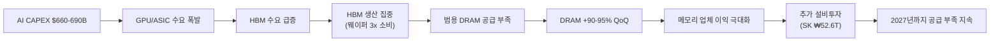

> **관련 글**: [2026년 투자 섹터 전망 (전체)](/knowledge/invest/2026/01/20/investment-sectors-outlook-2026.html)

2026년 반도체 섹터가 **사상 최초 $1T(1조 달러)** 시대를 향해 질주하고 있습니다. SIA(반도체산업협회)가 2026년 반도체 산업 $1T 돌파를 전망했으며(2025년 $791.7B), HBM TAM은 2028년 $100B에 달할 것으로 예상됩니다. 메모리 시장의 **"RAMmageddon"**은 DRAM 현물가가 계약가를 초과하는 이례적 상황으로 심화되고 있고, AI 인프라 투자는 **$660-690B**로 전년 대비 2배 규모입니다.

**가장 큰 단기 리스크는 3월 5일 미 상무부가 발표한 AI 칩 글로벌 수출규제 초안입니다.** 모든 AI 칩 수출에 정부 라이선스를 요구하는 내용으로, 시장은 규제 범위와 시행 시기를 주시하고 있습니다. 그러나 SOX 지수가 2/25에 사상최고치 8,498.10을 기록한 데서 보듯, 펀더멘털 강세는 압도적입니다.

## 반도체 섹터 현황 (2026년 3월 7일 기준)

### 핵심 지표

| 항목 | 수치/현황 | 비고 |
|------|----------|------|
| **글로벌 반도체 매출 (2026)** | **$1T 전망** | SIA, 2025년 $791.7B 대비 |
| **AI CAPEX (빅테크 합산)** | **$660-690B (~2x YoY)** | 75%($450B) AI 인프라 직접 투자 |
| **HBM TAM** | **$54.6B (2026) → $100B (2028)** | BofA/TrendForce |
| **DRAM Q1 가격** | **+90-95% QoQ** | 역대 최대폭, 현물가 > 계약가 |
| **512Gb TLC 웨이퍼 현물** | **+14.7% (이번 주)** | 추가 가속 중 |
| **NAND Q1** | **+55-60% QoQ** | Enterprise SSD +53-58% |
| **공급 부족 전망** | **2027년까지 지속** | IDC/TrendForce, SK하이닉스 M15X 가동(2027말) 이후 완화 |
| **NVIDIA FY27 매출** | **$66B 전망 (+68% YoY)** | Vera Rubin 플랫폼 |
| **SOX 지수 ATH** | **8,498.10 (2/25)** | 사상최고치 |
| **GTC 2026** | **3/16~19 (keynote 3/15)** | Vera Rubin, HBM4 쇼케이스 |
| **Section 122 관세** | **15% 발효 중** | IEEPA 25% 대비 순긍정 |

### 3월 7일 핵심 업데이트

| 항목 | 내용 |
|------|------|
| **★★★ 미 상무부 AI 칩 수출규제 초안 (3/5)** | 모든 글로벌 AI 칩 수출에 정부 라이선스 요구, **최대 단기 리스크** |
| **SIA: 반도체 $1T** | 2026년 반도체 산업 $1T 돌파 전망 (2025: $791.7B) |
| **SK하이닉스 HBM 62%** | 시장 점유율 62%, 삼성 추월한 Micron이 #2로 등극 |
| **삼성전자 HBM4 PRA 완료** | Pre-Release Assessment 완료, HBM4 인증 Q2 2026 예상 |
| **HBM TAM $100B (2028)** | 2026년 전량 매진, 2028년까지 TAM $100B |
| **SK하이닉스 용인 투자** | ₩31T + 추가 ₩21.6T (2/25), 총 ₩52.6T |
| **Broadcom Q1** | AI 매출 $8.4B (+74% YoY), Q2 가이던스 $22B, AI 반도체 $10.7B |
| **Marvell Q4** | 매출 $2.219B, 커스텀 ASIC $0→$1.5B/년, 주가 +16% |
| **TSMC N2 (2nm)** | 양산 램프업, 연말 100K-140K 웨이퍼/월 목표 |
| **삼성-인텔 파운드리 동맹** | 이재용 한미정상회담 시 인텔 면담, Intel Z990 칩셋 삼성 8nm |
| **ASML EUV NXE:5000** | 2026년 1월 출하 |
| **Applied Materials + Lam** | 차세대 식각/증착 전략적 협업 |
| **KOSPI 안정화** | ~5,585, Black Tuesday 반등 이후 안정 |

---

## 최대 리스크: 미 상무부 AI 칩 수출규제 초안 (3월 5일)

**3월 5일 미 상무부가 모든 글로벌 AI 칩 수출에 정부 라이선스를 요구하는 규제 초안을 발표했습니다.** 이는 현재 가장 큰 단기 리스크입니다.

| 항목 | 내용 |
|------|------|
| **규제 범위** | 모든 글로벌 AI 칩 수출 |
| **요구 사항** | 정부 라이선스 필수 |
| **영향 범위** | NVIDIA, AMD, Broadcom, Intel 등 모든 AI 칩 업체 |
| **시행 시기** | 초안 단계, 최종 확정 시기 미정 |

**투자 시사점**: 규제가 확정되면 AI 칩 수출에 단기적 병목이 생길 수 있으나, 미국 내 AI 인프라 투자($660-690B)는 영향 없음. 오히려 미국 내 제조 가속화(TSMC, 삼성 미국 팹)에 긍정적일 수 있음. 중국 제외 동맹국 면제 가능성도 존재. **초안 단계이므로 최종 규제 확정까지 모니터링 필요.**

---

## $1T 시대: 반도체 기가사이클

SIA(반도체산업협회)가 2026년 반도체 산업 **$1T 돌파**를 전망했습니다(2025년 $791.7B). 3대 성장 동력:

1. **AI 인프라 투자 폭발**: 빅테크 AI CAPEX $660-690B(~2x YoY), 75%가 AI 인프라 직접 투자
2. **RAMmageddon**: HBM 생산 집중 → 범용 DRAM 구조적 부족 → 전 메모리 가격 역사적 폭등
3. **HBM 과점 프리미엄**: SK하이닉스 62%, Micron #2, 삼성 #3 구조에서 가격 결정력 극대화

---

## AI CAPEX: $660-690B (전년비 ~2배)

### 하이퍼스케일러 AI 투자 현황

| 기업 | AI CAPEX (2026) | 비고 |
|------|----------------|------|
| **Amazon** | **$200B** | 최대 투자 |
| **Google** | **$175-185B** | |
| **Microsoft** | **$120B+** | |
| **Meta** | **$115-135B** | AMD $60B 딜 포함 (2/24) |
| **합산** | **$660-690B** | **전년비 ~2배** |
| **AI 인프라 직접** | **~$450B (75%)** | GPU/ASIC/서버/네트워크 |

---

## AI 칩: Broadcom·Marvell 실적이 증명하는 ASIC 성장

### Broadcom (AVGO) Q1 FY2026

| 항목 | 내용 |
|------|------|
| **AI 매출** | **$8.4B (+74% YoY)** |
| **Q2 가이던스** | **$22B** |
| **AI 반도체** | **$10.7B** |
| **의미** | 커스텀 ASIC 시장 폭발적 성장 확인 |

### Marvell (MRVL) Q4 FY2026

| 항목 | 내용 |
|------|------|
| **매출** | **$2.219B** |
| **커스텀 AI ASIC** | **$0 → $1.5B/년** |
| **주가 반응** | **+16%** |
| **의미** | ASIC 시장 신규 진입 업체도 급성장 |

### NVIDIA: Vera Rubin 플랫폼

| 항목 | 내용 |
|------|------|
| **FY27 매출 전망** | **$66B (+68% YoY)** |
| **Vera Rubin** | H2 2026 출하, Grace Blackwell 대비 **10x 성능/와트** |
| **GTC 2026** | **3/16~19**, "세상을 놀라게 할 칩" 예고 |
| **목표가** | Goldman $250, Morgan Stanley $260 |

### Meta-AMD $60B 파트너십 (2/24)

| 항목 | 내용 |
|------|------|
| **규모** | **$60B (5년)** |
| **제품** | Instinct MI450 GPU + 6세대 EPYC "Venice" CPU |
| **지분** | Meta가 AMD 주식 1.6억주(10%) 성과 연동 워런트 취득 |
| **의미** | AI 칩 시장 다변화 가속, 전체 파이 확대 |

---

## RAMmageddon: DRAM 현물 > 계약, 512Gb TLC +14.7%

### 가격 동향

| 제품 | Q1 변동 | 최신 동향 |
|------|---------|----------|
| **범용 DRAM** | **+90-95% QoQ (역대 최대)** | 현물가 > 계약가 (이례적) |
| **512Gb TLC 웨이퍼 현물** | | **+14.7% (이번 주)** |
| **서버 DRAM (DDR5)** | **+105-110% QoQ** | 삼성/SK → 구글/MS 60-70% 인상 요구 |
| **64GB RDIMM DDR5** | | $255(Q3'25) → $450(Q4'25) → **$700+(3월)** |
| **NAND** | **+55-60% QoQ** | |
| **Enterprise SSD** | **+53-58% QoQ** | |

**현물 > 계약의 의미**: 통상 계약가가 현물가보다 높은데, 현재는 역전 상태. 이는 공급 부족이 극심하여 급한 수요가 프리미엄을 지불하고 있음을 의미. **Q2 계약 가격은 최소 +20% 추가 상승 컨센서스.**

### 공급 부족 전망

| 전망 기관 | 내용 |
|-----------|------|
| **IDC / TrendForce** | **2027년까지 공급 부족 지속** |
| **Micron** | DRAM 리드타임 **40주 이상**, 2028년까지 구조적 부족 |
| **의미 있는 완화** | SK하이닉스 M15X 팹 가동(2027년 말) 이후 |

**근본 원인**: HBM 생산이 GB당 **~3배의 웨이퍼 용량**을 소비 → 범용 DRAM 생산 라인 축소(crowding out) → 구조적 공급 부족

**수요 파괴 리스크**: 메모리 가격 급등 → PC/모바일 OEM 스펙 다운그레이드 가능성. 가격 폭등이 지속되면 수요 둔화로 이어질 수 있으나, 서버/AI 수요가 전체 DRAM의 40%+ 를 차지하므로 구조적 수요 기반은 견고.

---

## HBM: $100B(2028) TAM, 2026 전량 매진

### HBM 시장 점유율 (최신)

| 기업 | 점유율 | 주요 현황 |
|------|--------|----------|
| **SK하이닉스** | **62%** | 업계 1위, NVIDIA HBM4 수요의 ~2/3 공급 확정 |
| **Micron** | **#2 (삼성 추월)** | 2026 HBM 전량 매진 |
| **삼성전자** | **#3** | HBM4 PRA 완료, Q2 2026 인증 예상 |

### HBM 시장 규모

| 연도 | TAM |
|------|-----|
| **2026** | **$54.6B (+58% YoY)** |
| **2028** | **$100B** |

### SK하이닉스 대규모 투자

| 투자 | 금액 | 비고 |
|------|------|------|
| **용인 투자** | **₩31T** | 기존 발표 |
| **추가 투자 (2/25)** | **₩21.6T** | |
| **합계** | **₩52.6T** | HBM/첨단 DRAM 집중 |

- **HBM4 인증**: TrendForce 기준 Q2 2026 예상
- **NVIDIA 40% 생산 차질**: HBM 공급이 GPU 생산의 핵심 병목
- **GTC 2026**: 삼성·SK하이닉스 모두 HBM4 쇼케이스 예정

---

## 파운드리: TSMC N2 램프업, 삼성-인텔 동맹 논의

### TSMC N2 (2nm)

| 항목 | 내용 |
|------|------|
| **양산** | 램프업 진행 중 |
| **월 생산 목표** | **100K-140K 웨이퍼/월 (2026년 말)** |
| **미국 투자** | $165B → 관세 면제 확보 |

### 삼성-인텔 파운드리 동맹

| 항목 | 내용 |
|------|------|
| **이재용 인텔 면담** | 한미정상회담 시 논의 |
| **Intel Z990 칩셋** | 삼성 8nm에서 제조 |
| **의미** | 파운드리 시장 판도 변화 가능성 |

### 삼성전자 파운드리 현황

| 항목 | 내용 |
|------|------|
| **Taylor 텍사스 공장** | 양산 2027년 연기 (기존 2026년), 2nm GAA 집중 |
| **테슬라 AI6** | $16B+ (역대 최대 외부 파운드리 수주) |

---

## 장비: EUV 신모델 + 첨단 패키징 수요 급증

| 항목 | 내용 |
|------|------|
| **ASML EUV NXE:5000** | **2026년 1월 출하** |
| **ASML 백로그** | $388B, Q1 주문 €132B(기록) |
| **Applied Materials + Lam Research** | **차세대 식각/증착 전략적 협업** |
| **첨단 패키징 장비** | HBM/chiplet용 수요 급증 |

---

## 주요 종목 분석

### SK하이닉스 (000660) - ~941,000원, PER ~4.2배 극단적 저평가

| 항목 | 내용 |
|------|------|
| **주가** | **~941,000원** |
| **PER** | **~4.2배** (반도체 평균 15-20배 대비 극단적 저평가) |
| **영업이익률** | **67%** |
| **HBM 점유율** | **62% (#1)** |
| **HBM4 NVIDIA 공급** | **총 수요의 ~2/3** |
| **용인 총 투자** | **₩52.6T** |

**목표가**

| 증권사 | 목표가 | OP 전망 |
|--------|--------|---------|
| 키움증권 | **130만원** | OP 170조 |
| 하나증권 | **145만원** | OP 112조 |
| 대신증권 | **145만원** | OP 100.7조 |
| 시티/SK증권 | **140-150만원** | |
| 노무라 | 156만원 | OP 189조 |

**현재가 ~94.1만원 기준 업사이드**: 목표가 130만원은 **+38%**, 145만원은 **+54%**.

### 삼성전자 (005930) - ~195,100원, HBM4 PRA 완료

| 항목 | 내용 |
|------|------|
| **주가** | **~195,100원** |
| **Q1 2026 OP** | **~30조원 (사상 첫 분기 30조 돌파 전망)** |
| **2026 연간 OP** | **170-201조원** |
| **HBM4** | **PRA 완료, Q2 2026 인증 예상 (TrendForce)** |
| **Taylor 텍사스** | 양산 2027년 연기, 2nm GAA 집중 |

**HBM4 PRA 완료의 의미**: 삼성전자가 HBM4 Pre-Release Assessment를 완료했다는 것은 NVIDIA 인증 절차의 핵심 관문을 통과했음을 의미. Q2 인증 획득 시 HBM 점유율 회복의 전환점.

### NVIDIA (NVDA)

| 항목 | 내용 |
|------|------|
| **FY27 매출 전망** | $66B (+68%) |
| **Vera Rubin** | H2 2026, 10x 성능/와트 |
| **GTC 2026** | 3/16~19, "세상을 놀라게 할 칩" |
| **목표가** | Goldman $250, Morgan Stanley $260 |

### Broadcom / TSMC / ASML / Marvell

| 종목 | 핵심 | 최신 |
|------|------|------|
| **Broadcom** | ASIC 60-80% 점유 | **AI 매출 $8.4B (+74%), Q2 $22B 가이던스** |
| **Marvell** | 커스텀 ASIC 급성장 | **$0→$1.5B/년, 주가 +16%** |
| **TSMC** | 2nm 양산 램프 | 연말 100K-140K 웨이퍼/월, $165B 미국 투자 |
| **ASML** | EUV NXE:5000 출하 | 백로그 $388B, Q1 주문 €132B(기록) |

---

## 시장 지표

| 항목 | 수치 | 비고 |
|------|------|------|
| **SOX 지수** | **ATH 8,498.10 (2/25)** | 사상최고치 |
| **KOSPI** | **~5,585** | Black Tuesday 반등 후 안정화 |
| **삼성전자** | **~195,100원** | |
| **SK하이닉스** | **~941,000원** | |

---

## 관세 환경: Section 122 (15%)

| 관세 유형 | 세율 | 현황 | 반도체 영향 |
|----------|------|------|-----------|
| **IEEPA 상호관세** | 국가별 차등 | **위헌 무효** | 환급 가능 |
| **Section 122** | **15%** | **2/24 발효, 150일 한시** | IEEPA 25% 대비 하향 = **순긍정** |
| **Section 232** | **25%** | **유지** | 첨단 로직 대상, 메모리 직접 대상 아님 |

---

## 실적 전망

### 삼성전자

| 출처 | 2026 OP | 2027 OP |
|------|---------|---------|
| **Q1 전망** | **~30조 (사상 첫)** | |
| 하나증권 | 113조 | |
| 키움증권 | 120조 | |
| 노무라 | 135조 | |
| **연간 범위** | **170-201조** | |
| **모건스탠리** | | **317조** |

### SK하이닉스

| 출처 | 2026 OP | 목표가 |
|------|---------|--------|
| 대신증권 | 100.7조 | **145만원** |
| 하나증권 | 112조 | **145만원** |
| 키움증권 | 170조 | **130만원** |
| 노무라 | 189조 | 156만원 |
| 시티/SK증권 | | **140-150만원** |

---

## 투자 전략

### 액션 플랜

| 전략 | 내용 |
|------|------|
| **단기 (1-2주)** | **GTC 2026(3/16) 최대 카탈리스트.** AI 수출규제 초안 확정 동향 모니터링 |
| **중기 (1-3개월)** | 서버 DRAM 60-70% 인상 현실화 → Q2 실적 서프라이즈 기대. HBM4 인증 확인 |
| **장기 (6개월+)** | $1T 기가사이클, AI CAPEX $660-690B, HBM TAM $100B(2028) 구조적 성장 |

### 투자 근거

1. **$1T 시대 진입**: SIA 공식 전망, 2025년 $791.7B → 2026년 $1T
2. **PER 극단적 저평가**: SK하이닉스 PER ~4.2배 (업종 평균 15-20배 대비 73-79% 할인)
3. **현물 > 계약 + 512Gb TLC +14.7%**: 공급 부족 심화 중, Q2 +20% 추가 상승 전망
4. **HBM TAM $100B (2028)**: 성장 여력 충분, 2026 전량 매진
5. **커스텀 ASIC 폭발**: Broadcom $8.4B(+74%), Marvell $0→$1.5B/년
6. **GTC 2026 (3/16)**: HBM4 쇼케이스 + Vera Rubin + 3만명 참석
7. **AI CAPEX 불변**: $660-690B, 빅테크 가이던스 변동 없음

### 매도 트리거 (감시 신호)

1. **DRAM 가격 하락 전환** -- 현재 67-70% 영업마진이 꺾이기 시작할 때
2. **AI 수출규제 최종 확정 시 범위** -- 동맹국 포함 여부, 시행 시기
3. **HBM 공급 과잉 신호** -- 3사 동시 증설 가속
4. **빅테크 CAPEX 가이던스 하향** -- AI 투자 모멘텀 둔화
5. **메모리 수요 파괴** -- PC/모바일 OEM 스펙 다운그레이드 현실화

### 핵심 일정

| 일정 | 내용 | 중요도 |
|------|------|--------|
| **3/12** | 철강/알루미늄 관세 25% 발효 | 중간 |
| **3/16~19** | **GTC 2026 (Vera Rubin, HBM4 쇼케이스, 3만명)** | **최고** |
| **3/17~18** | **FOMC** | 높음 |
| **~7월** | Section 122 관세 150일 시한 | 높음 |
| **Q2 2026** | HBM4 인증 예상 (TrendForce) | 높음 |
| H2 2026 | Vera Rubin 출하, HBM4E 샘플링 | 높음 |
| 2027년 말 | SK하이닉스 M15X 가동 → 공급 완화 시작 | 중간 |

---

## 리스크 요인

| 리스크 | 현황 | 평가 |
|--------|------|------|
| **★ AI 칩 수출규제 초안 (3/5)** | 모든 AI 칩 수출에 정부 라이선스 요구 | **최대 단기 리스크**, 초안 단계 |
| **메모리 수요 파괴** | 가격 급등 → PC/모바일 OEM 스펙 다운그레이드 가능성 | 서버/AI 수요가 40%+, 구조적 기반 견고 |
| **지정학 리스크** | Black Tuesday 이후 안정화 | 추가 확전 시 재하락 가능, 펀더멘털 불변 |
| **삼성 Taylor 양산 연기** | 2026 → 2027, 2nm GAA 집중 | 메모리 호황이 상쇄 |
| **AI CAPEX 과잉 + FCF 급감** | $660-690B(~2x), 빅테크 FCF 급감 전망 | 분기별 CAPEX 가이던스 모니터링 |
| **Section 122 관세** | 15%, 150일 한시 | 정책 방향 모니터링 |

---

## 결론

| 항목 | 내용 |
|------|------|
| **전체 방향성** | **$1T 시대 진입**, AI CAPEX $660-690B, RAMmageddon 지속 |
| **최대 모멘텀** | GTC 2026(3/16), HBM TAM $100B(2028), DRAM 현물>계약 가속 |
| **최대 리스크** | 미 상무부 AI 칩 수출규제 초안 (3/5) |
| **최대 수혜** | SK하이닉스(PER ~4.2배, 62% HBM, 목표가 130-150만원), 삼성전자(Q1 OP 30조, HBM4 PRA 완료) |
| **커스텀 ASIC** | Broadcom $8.4B(+74%), Marvell $0→$1.5B/년 — 시장 폭발 확인 |
| **투자 전략** | **GTC 카탈리스트 대기, 수출규제 모니터링, 극단적 저평가 유지** |

**2027년까지 공급 부족이 지속되고(IDC/TrendForce), HBM TAM이 2028년 $100B까지 성장하는 구조적 사이클에서, SK하이닉스 PER ~4.2배는 역사적 저평가입니다. AI 수출규제 초안이 단기 변동성을 높일 수 있으나, 초안 단계이며 미국 내 수요($660-690B)는 영향 없습니다. GTC 2026(3/16)이 다음 주요 카탈리스트입니다.**

**투자 결정은 본인의 리스크 허용 범위와 투자 기간을 고려하여 신중하게 내리시기 바랍니다.**

---

## 하위 섹터 상세 분석

- [HBM 투자 전망](/knowledge/invest/2026/01/21/hbm-sector-outlook-2026.html) - 고대역폭 메모리 심층 분석
- [DRAM/NAND 투자 전망](/knowledge/invest/2026/01/21/dram-nand-sector-outlook-2026.html) - 범용 메모리 분석
- [파운드리 투자 전망](/knowledge/invest/2026/01/21/foundry-sector-outlook-2026.html) - TSMC, 삼성전자 파운드리 분석
- [소부장 투자 전망](/knowledge/invest/2026/01/21/semiconductor-materials-equipment-outlook-2026.html) - 소재/부품/장비 분석
