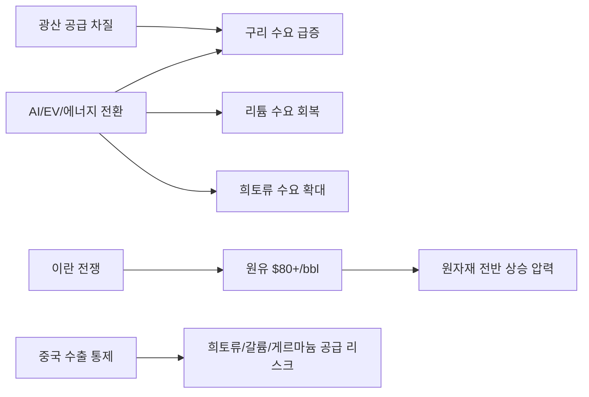
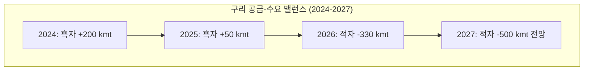
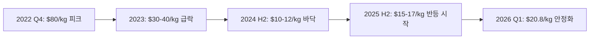
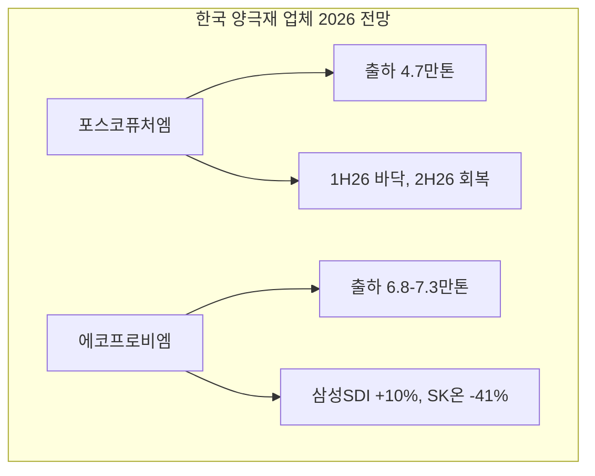
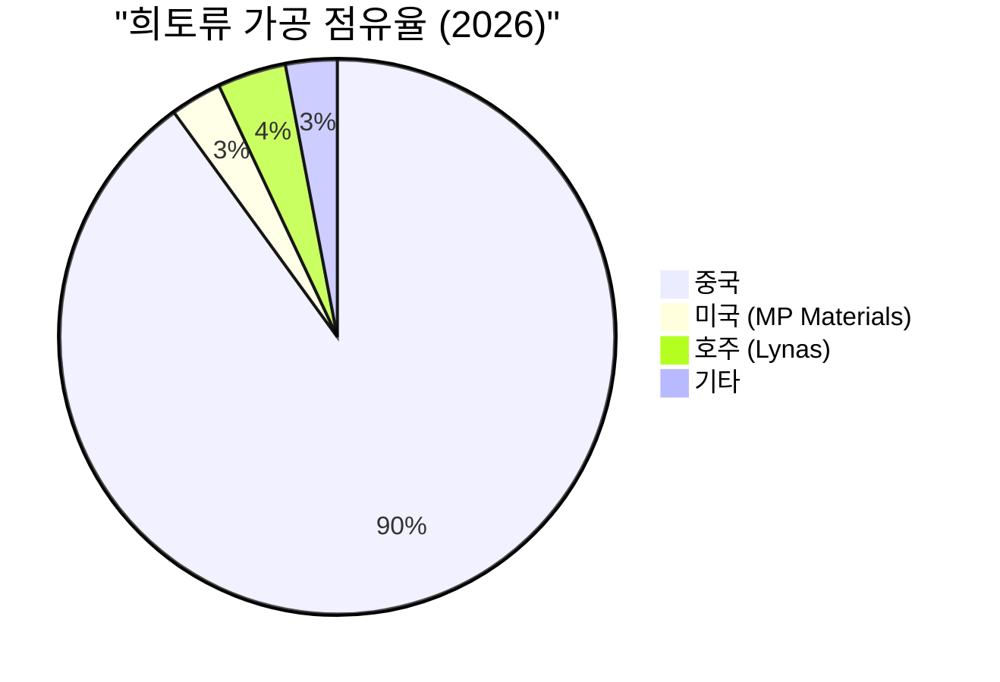
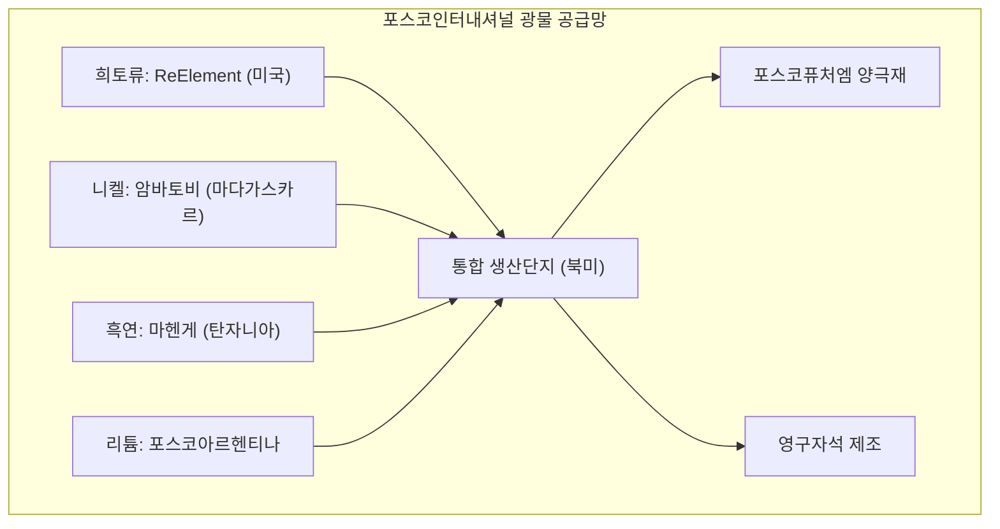
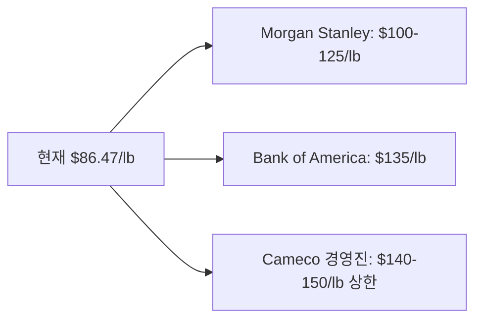
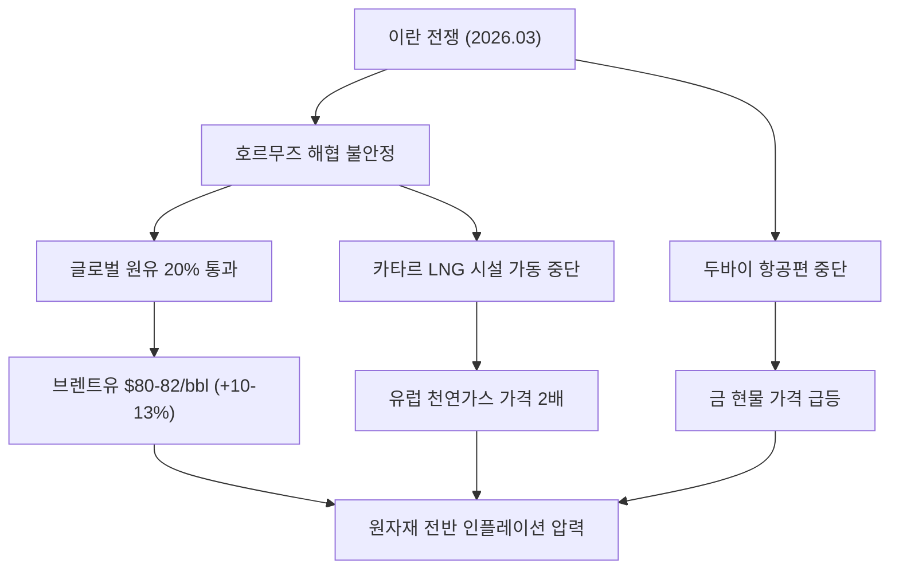
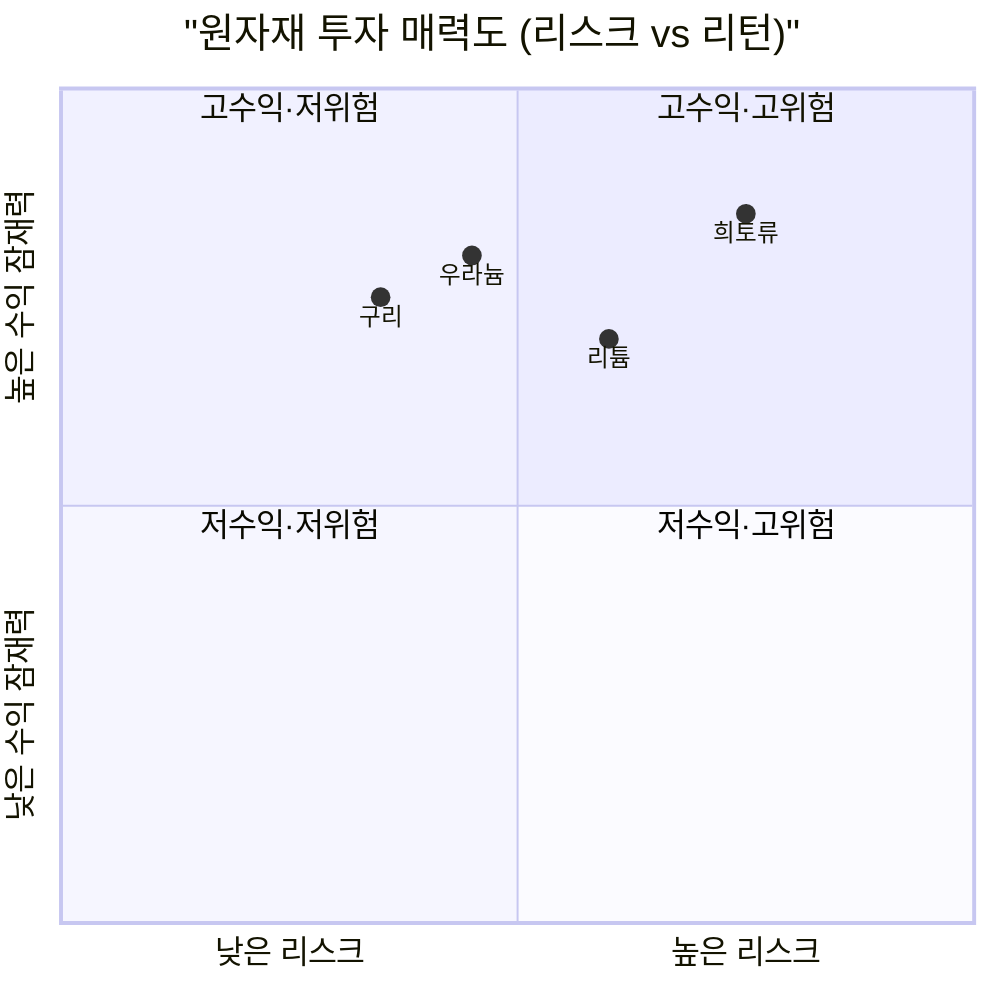

## 핵심 요약

2026년 원자재 시장은 **구조적 수요 확대**(AI 데이터센터, EV, 에너지 전환)와 **지정학적 공급 리스크**(이란 전쟁, 중국 수출 통제)가 동시에 작용하며 역사적 전환기를 맞고 있다. 구리는 톤당 $12,750로 사상 최고치 부근에서 거래되고, 리튬은 바닥을 확인한 후 반등 중이며, 우라늄은 파운드당 $86.47을 기록하고 있다. 이란 전쟁으로 호르무즈 해협이 불안정해지면서 원유가 배럴당 $80을 돌파했고, 이는 전체 원자재 복합체에 상방 압력을 가하고 있다.

---

## 1. 구리(Copper): AI와 EV가 만든 구조적 적자

### 현재 가격과 시장 상황

2026년 3월 기준 LME 구리 현물 가격은 **톤당 $12,750**으로, 2026년 1월에 기록한 사상 최고치 $13,310에서 소폭 조정된 수준이다. 불과 2년 전인 2024년 초 $8,500대였던 것과 비교하면 약 50% 상승한 것이다.

### 수요 동인: AI 데이터센터 + EV + 전력망

구리 수요의 구조적 확대는 세 가지 메가트렌드에서 비롯된다.

| 수요 동인 | 2025년 추정 | 2026년 전망 | 증가분 |
|-----------|-------------|-------------|--------|
| AI 데이터센터 | ~365 kmt | ~475 kmt | +110 kmt |
| EV 생산 (ICE 대비 3-4배) | ~1,200 kmt | ~1,450 kmt | +250 kmt |
| 전력망 인프라 | ~3,500 kmt | ~3,800 kmt | +300 kmt |

특히 AI 데이터센터는 막대한 전력을 소비하며, 이를 뒷받침하는 전력 인프라에도 구리가 대량으로 필요하다. 단일 대형 데이터센터에 최대 **3만 톤의 구리**가 투입될 수 있다.

### 공급: 구조적 적자 진입

J.P. Morgan은 2026년 글로벌 정제 구리 적자를 약 **33만 톤**으로 전망한다. 광산 공급 성장률은 연초 추정치 대비 약 500 kmt 하향 조정되어 **+1.4%**에 그칠 전망이다.

주요 공급 차질 요인:
- **Grasberg(인도네시아)**: 2025년 9월 치명적 산사태로 생산 중단, 2026년 Q2까지 재개 불투명
- **Kamoa-Kakula(DRC)**: 예상치 못한 조업 중단
- **칠레/페루**: 수자원 부족과 지역사회 갈등으로 확장 지연

### 주요 가격 전망

| 기관 | 2026년 평균 전망 | 비고 |
|------|------------------|------|
| J.P. Morgan | $12,075/ton | Q2 $12,500 피크 |
| Goldman Sachs | $10,710/ton (H1) | 소폭 흑자 160kt 전망 |
| Citi | $13,000-15,000/ton | 가장 낙관적 |

### 핵심 투자 종목

**Freeport-McMoRan (FCX)**
- 2025년 Q4 실적: EPS $0.47 (예상 대비 +67.86%), 매출 $5.63B (+6.63%)
- Grasberg 중단에도 불구하고 Morenci 광산 영업이익이 $396M으로 2배 이상 증가
- 2026년 EBITDA 전망: $11B~$19B (구리 가격에 따라 변동)
- Grasberg가 Q2에 재개되면 하반기 실적 급등 가능

**Southern Copper (SCCO)**
- 2025년 주가 약 66% 상승
- $150억 규모 자본투자 계획 (페루·멕시코의 안정적 관할권 중심)
- 2026년 이익 성장률 약 18% 전망
- 세계 최대 구리 매장량 보유 기업 중 하나

---

## 2. 리튬(Lithium): 바닥 확인 후 반등

### 가격 추이: $80에서 $10으로, 다시 $20으로

리튬 시장은 2022년 kg당 $80 이상의 역사적 고점에서 2024-2025년 $10 수준까지 폭락한 후, 2026년 초 **$20.8/kg**(탄산리튬 기준 톤당 $20,800)까지 회복했다. 이는 저점 대비 거의 2배 반등한 수준이다.

### 공급-수요 전환점

2024년을 괴롭혔던 **과잉공급 시대는 공식적으로 종료**되었다. 핵심 변화:

1. **중국/호주 한계 광산 폐쇄**: 저가 환경에서 생존 불가능한 고비용 광산들이 대거 퇴출
2. **EV 2차 물결**: 예상보다 강력한 전기차 보급 2차 물결이 수요를 견인
3. **ESS(에너지 저장장치) 폭발적 성장**: 재생에너지 간헐성 보완을 위한 대규모 배터리 저장 설비 수요

### 핵심 투자 종목

**Albemarle (ALB)**
- 52주 최고가 $206.00 달성 (2026년 2월)
- 2024-2025년 "리튬 겨울"에서 극적 회복
- 2026년 EPS 전망: $7.20 (근본적 턴어라운드 시그널)
- 세계 최대 리튬 생산업체로서 가격 회복의 최대 수혜주

**SQM (Sociedad Quimica y Minera)**
- **NovaAndino Litio** 파트너십: 칠레 국영 Codelco와 합작, Salar de Atacama 운영권 2060년까지 확보
- 주가 2025년 저점 대비 2배 상승
- 장기 공급 안정성 확보로 프리미엄 평가

### 한국 기업: 포스코퓨처엠

**포스코퓨처엠 (003670)**
- 양극재 출하량 전망: 2025년 4.3만톤 → 2026년 4.7만톤
- 미국 EV 보조금 폐지에 따른 EV향 출하량 충격 진행 중
- **1H26을 바닥**으로 2H26부터 점진적 회복 전망
- 목표주가: 평균 187,519원 (상단 300,000원 / 하단 96,000원)
- 투자의견: 매수 10명 vs 매도 12명 → **중립** 평가
- 인터배터리 2026에서 전고체·하이니켈 소재 기술 공개

**에코프로비엠 (247540)**
- 2025년 영업이익: 1,428억원 (2024년 영업손실 341억원에서 흑자 전환)
- 2026년 매출 전망: 2조 7,830억원 (+9.8% YoY)
- 2026년 영업이익 전망: 1,296억원 (-9.2% YoY, 소폭 감소)
- 양극재 판매량: 6.8만~7.3만톤 전망 (증권사별 상이)
- 삼성SDI향: 4.5만톤 (+10% YoY) / SK온향: 1.8만톤 (-41% YoY)
- 전고체 배터리용 양극재·고체 전해질 양산 준비 중
- 리튬 가격 $12-15/kg 구간 유지 시 마진 훼손 제한적

---

## 3. 희토류(Rare Earth): 지정학이 지배하는 시장

### 중국의 압도적 지배력

희토류 시장은 **중국이 채굴의 60%, 가공의 90% 이상**을 장악하고 있어, 지정학적 리스크가 곧 투자 리스크다.

### 중국 수출 통제: 유예 중이지만 불확실

2025년 하반기, 미중 무역 휴전의 일환으로 중국은 갈륨, 게르마늄, 안티모니, 흑연, 희토류 등에 대한 **미국 대상 강화 수출 통제를 일시 유예**했다.

| 광물 | 통제 상태 | 유예 기한 |
|------|-----------|-----------|
| 갈륨(Gallium) | 일시 유예 (표준 라이선스로 전환) | 2026년 11월 27일 |
| 게르마늄(Germanium) | 일시 유예 | 2026년 11월 27일 |
| 안티모니(Antimony) | 일시 유예 | 2026년 11월 27일 |
| 희토류 | 일시 유예 | 2026년 11월 27일 |
| 흑연(Graphite) | 일시 유예 | 2026년 11월 27일 |

**핵심 주의사항:**
- 중국 정부는 이를 "임시 조정"으로 규정 → **영구적 해제가 아님**
- 군사 최종사용자 대상 수출 금지는 여전히 유효
- 2026년 하반기 미중 관계에 따라 **재강화 가능성** 높음
- 반도체, 방위산업, EV 모터에 필수적인 이 광물들의 공급 불확실성은 비중국 공급원의 전략적 가치를 높임

### 핵심 투자 종목

**MP Materials (MP)**
- 애널리스트 13인 평균 평가: **Strong Buy**
- 12개월 목표주가: $70.92 (+21.79%)
- 미 국방부 지원 영구자석 시설 건설 추진 중 (2028년 가동 목표)
- 최근 3개월 주가 +13.4%
- 미국 유일의 희토류 채굴·분리 통합업체

**Lynas Rare Earths (LYC/LYSDY)**
- 최근 3개월 주가 **+63.5%** (MP Materials 대비 큰 폭 아웃퍼폼)
- "Towards 2030" 전략: 하류 가공 능력 확대, 금속·자석 공급망 진출
- 호주 Mt Weld + 말레이시아 가공시설의 안정적 운영
- 중국 외 가장 큰 규모의 희토류 생산업체

### 한국 기업: 포스코인터내셔널

**포스코인터내셔널 (047050)**
- 미국 **ReElement Technologies**와 협력하여 북미 희토류 통합 생산단지 조성 추진
- 2030년까지 연간 최대 **3,000톤** 규모의 희토류 산화물 공급 목표
- 원료 확보 → 정제 → 자석 제조 → 재활용을 연결하는 통합형 모델 구축
- 마다가스카르 암바토비 광산 지분(4%) 보유를 통한 니켈 공급망 확보
- 마헨게 광산 흑연: 2026년 말부터 연간 3만톤 수입 시작, 2028년 6만톤 확대 예정

---

## 4. 우라늄(Uranium): 원자력 르네상스의 연료

### 가격 동향

2026년 3월 초 기준 우라늄 스팟 가격은 **파운드당 $86.47**로, 1월 말 $94.28에서 조정을 받았다. 우즈베키스탄 원자력청의 예상보다 높은 생산량 데이터가 일시적 하방 압력을 가했다.

| 시점 | 가격 ($/lb) | 비고 |
|------|-------------|------|
| 2024년 3월 | ~$65 | |
| 2025년 말 | ~$78 | +20% YoY |
| 2026년 1월 | $94.28 | 52주 최고 |
| 2026년 3월 | $86.47 | 단기 조정 |

### 구조적 강세 요인

1. **원자력 발전 확대**: 세계원자력협회(WNA) 기준, 글로벌 원자력 설비용량이 현재 398 GWe에서 2040년 **746 GWe**로 거의 2배 확대 전망
2. **AI 데이터센터 전력 수요**: 안정적 기저 전력원으로서 원자력 수요 급증
3. **공급 부족**: 지난 10년간 신규 광산 투자 부재 → 향후 수급 적자 심화
4. **지정학적 리스크**: 러시아·카자흐스탄 의존도 축소 움직임

### 애널리스트 가격 전망

### 핵심 투자 종목

**Cameco (CCJ)**
- 세계 최대 우라늄 생산업체 중 하나
- 2025년 실적 호조 이후 주가 랠리
- 장기 계약 체결 능력과 생산 확대 역량이 핵심 강점
- 공급 적자와 가격 상승 국면의 최대 수혜주
- 글로벌 유틸리티들의 장기 핵연료 공급망 재평가가 Cameco에 유리하게 작용

---

## 5. 이란 전쟁과 원자재 복합체

### 전쟁의 원자재 파급 효과

2026년 3월 초 미-이스라엘 연합의 이란 공습은 글로벌 원자재 시장에 광범위한 충격을 가했다.

### 시나리오별 영향 분석

| 시나리오 | 유가 전망 | 원자재 영향 |
|----------|-----------|-------------|
| 단기 교전 후 휴전 | $75-80/bbl | 제한적 |
| 호르무즈 1개월 차단 | $90-95/bbl | 유럽 천연가스 74 EUR/MWh |
| 호르무즈 2개월+ 차단 | $100+/bbl | 유럽 천연가스 100+ EUR/MWh |
| 전면전 확대 | $120+/bbl | 글로벌 인플레이션 +0.8% |

### 원자재별 이란 전쟁 영향

- **구리**: 에너지 비용 상승 → 제련 비용 증가 → 가격 상방 압력. 동시에 경기침체 우려로 수요 불확실성도 존재
- **리튬**: 직접적 영향 제한적이나, 에너지 안보 우려가 EV·ESS 전환 가속화 가능
- **희토류**: 이란 전쟁이 중국의 자원 무기화 의지를 자극할 수 있음
- **우라늄**: 에너지 안보 재평가로 원자력 르네상스 가속 → 강한 상방 요인
- **금**: 안전자산 수요 급증, 두바이 물류 차단으로 아시아 시장 프리미엄 확대

트레이더들은 전쟁 전 대비 배럴당 약 **$14의 전쟁 프리미엄**을 유가에 반영하고 있다(3월 3일 기준). Goldman Sachs는 이란 분쟁의 장기화 시 유로존 성장률 0.1% 하락, 인플레이션 0.5% 상승을 전망했다.

---

## 6. 투자 전략 요약

### 원자재별 투자 매력도

### 핵심 종목 비교

| 섹터 | 종목 | 핵심 포인트 | 리스크 |
|------|------|-------------|--------|
| 구리 | Freeport-McMoRan (FCX) | Grasberg 재가동 시 실적 급등 | 광산 운영 리스크 |
| 구리 | Southern Copper (SCCO) | 최대 매장량, 안정적 성장 | 이미 높은 밸류에이션 |
| 리튬 | Albemarle (ALB) | 최대 생산업체, 턴어라운드 | 리튬 가격 재하락 가능성 |
| 리튬 | SQM | 2060년까지 확보된 운영권 | 칠레 정치 리스크 |
| 희토류 | MP Materials (MP) | 미국 유일 통합업체, 국방부 지원 | 아직 수익성 미달 |
| 희토류 | Lynas (LYSDY) | 중국 외 최대 생산, +63.5% 모멘텀 | 말레이시아 규제 리스크 |
| 우라늄 | Cameco (CCJ) | 장기계약 강점, 공급 적자 수혜 | 정치적 원자력 반대 |
| 양극재 | 포스코퓨처엠 (003670) | 1H26 바닥, 전고체 소재 기술력 | 미국 EV 보조금 폐지 |
| 양극재 | 에코프로비엠 (247540) | 삼성SDI 물량 회복, 흑자 전환 | SK온향 급감 |
| 희토류 | 포스코인터내셔널 (047050) | 북미 희토류 통합 생산단지 | 장기 투자 (2030년 목표) |

### 투자 시 주의 사항

1. **이란 전쟁의 불확실성**: 단기 변동성 확대는 불가피. 포지션 사이징에 유의
2. **중국 수출 통제 재강화 리스크**: 2026년 11월 유예 만료 후 재강화 시 희토류 공급 충격 가능
3. **리튬 가격 2차 하락 가능성**: 반등이 확인되었으나, 글로벌 EV 수요 둔화 시 재하락 위험 존재
4. **달러 강세/약세**: 원자재는 달러 표시 → 환율 변동이 실질 수익률에 직접 영향
5. **한국 기업의 구조적 한계**: 원자재 가격 변동에 직접 노출되면서도, 완성품 고객사(자동차·배터리)의 가격 전가 능력에 의존

---

## 7. 핵심 일정 (2026년 하반기)

| 시기 | 이벤트 | 영향 원자재 |
|------|--------|-------------|
| 2026 Q2 | Freeport Grasberg 재가동 예정 | 구리 |
| 2026 Q2 | 에코프로비엠 삼성SDI 헝가리 공장 가동 | 양극재 |
| 2026 H2 | 포스코퓨처엠 출하량 회복 전환 | 양극재 |
| 2026년 말 | 포스코인터내셔널 마헨게 흑연 수입 시작 | 흑연 |
| 2026.11.27 | 중국 수출 통제 유예 만료 | 희토류/갈륨/게르마늄 |
| 2028 초 | MP Materials 자석 시설 가동 | 희토류 |
| 2030 | 포스코인터내셔널 희토류 3,000톤/년 목표 | 희토류 |

---

## 마무리

2026년 원자재 시장은 **수요는 확실하고, 공급은 불확실한** 비대칭 구조가 심화되고 있다. AI·EV·에너지 전환이라는 거스를 수 없는 메가트렌드가 구리, 리튬, 희토류, 우라늄의 장기 수요를 구조적으로 끌어올리고 있으며, 이란 전쟁과 중국의 자원 무기화는 공급 측면의 불확실성을 더하고 있다.

한국 투자자에게는 포스코퓨처엠, 에코프로비엠, 포스코인터내셔널이 이 메가트렌드에 참여할 수 있는 통로가 되지만, 이들의 수익성은 글로벌 원자재 가격과 완성품 고객사의 수요에 복합적으로 의존한다는 점에서 **리스크 관리가 필수적**이다.

> **Disclaimer**: 이 글은 정보 제공 목적으로 작성되었으며, 특정 투자를 권유하지 않습니다. 투자 결정은 본인의 판단과 책임 하에 이루어져야 합니다.
