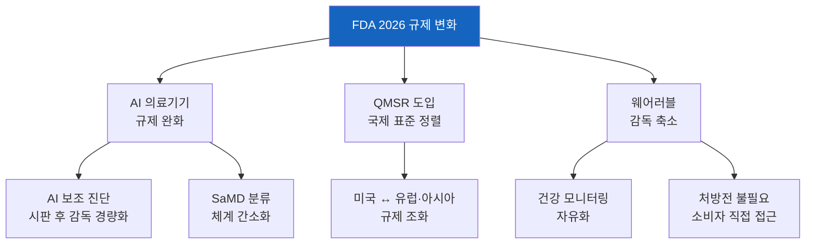
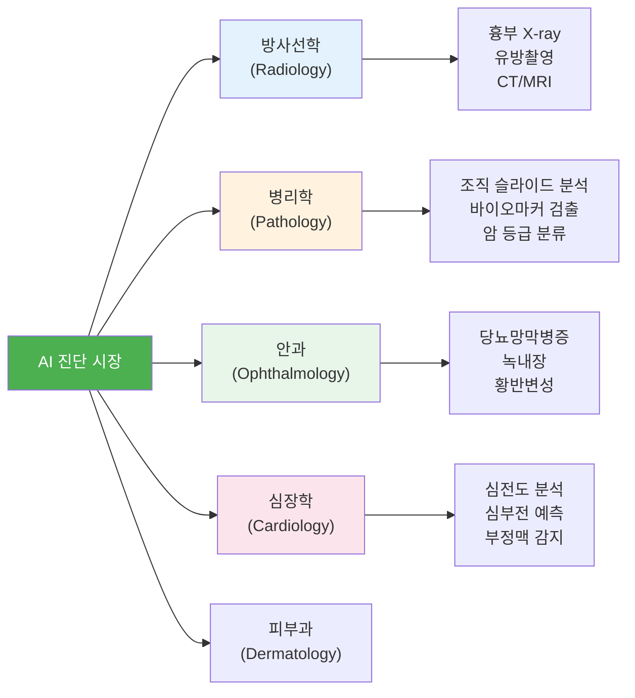
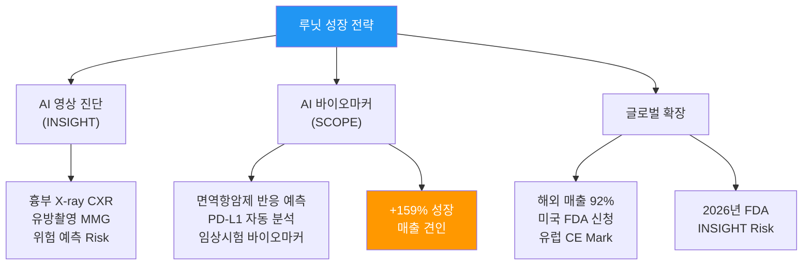
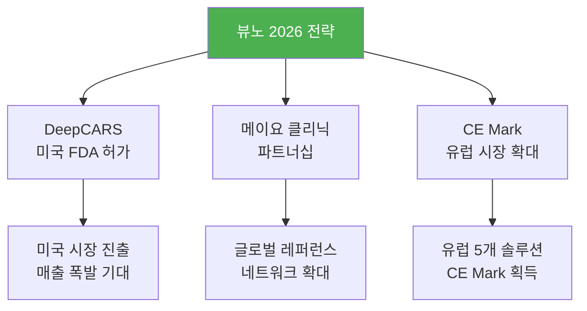
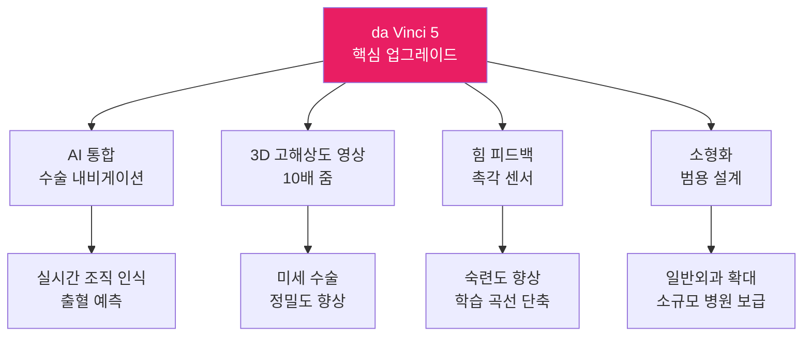
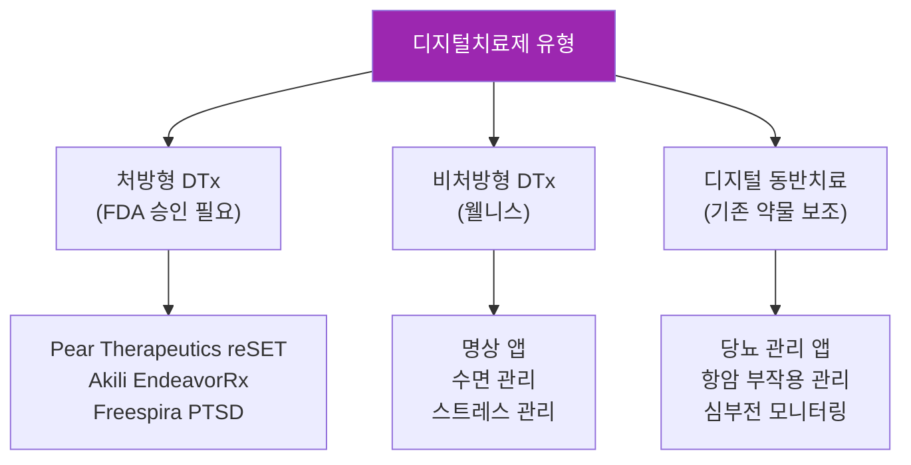
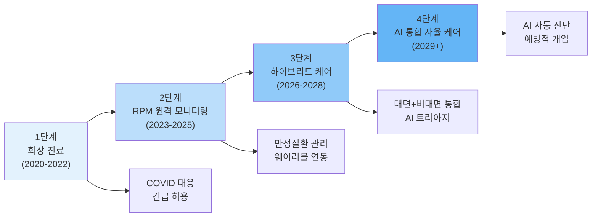
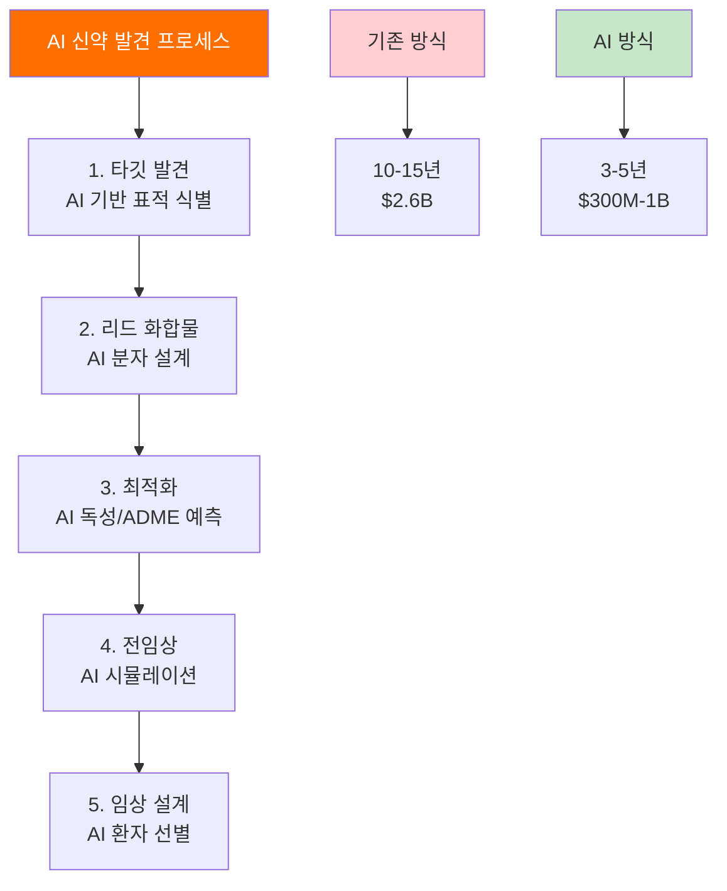
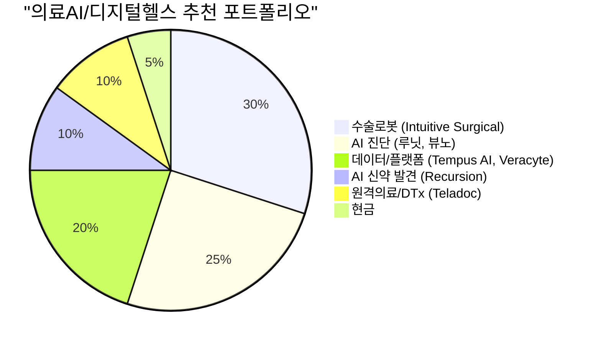
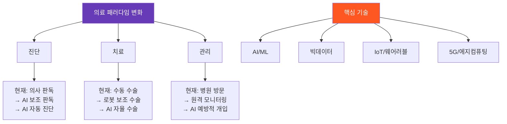

> **관련 글**: [2026년 바이오/헬스케어 섹터 종합 전망](/knowledge/invest/2026/03/07/bio-healthcare-sector-outlook-2026.html)

2026년은 의료AI/디지털헬스 산업의 **"수익화 원년(Revenue Era)"**입니다. FDA는 누적 **1,000건 이상**의 AI/ML 의료기기를 승인했고, 한국의 루닛과 뷰노는 사상 최대 매출을 경신하며 글로벌 의료AI 시장에서 존재감을 키우고 있습니다. 동시에 수술로봇 시장에서 Intuitive Surgical의 **da Vinci 5**가 본격 확산되고, 디지털치료제(DTx) 시장은 **$10.4B** 규모로 성장했으며, 원격의료는 하이브리드 케어 모델로 진화하고 있습니다.

특히 FDA가 2026년 1월 **AI·웨어러블 의료기기에 대한 규제 완화**를 발표하면서, 의료AI 산업은 파일럿 단계를 넘어 **전면적 상용화 단계**로 접어들고 있습니다.

## 의료AI 시장 현황

### 글로벌 의료AI 시장 규모

| 지표 | 수치 | 비고 |
|------|------|------|
| **FDA AI/ML 의료기기 승인 (누적)** | **1,000건+** | 방사선학 70%+ 비중 |
| **디지털치료제 시장 (2026)** | **$10.4B** | CAGR 18.5% |
| **원격의료 시장 (2026)** | **$124B** | 하이브리드 케어 모델 확산 |
| **AI 신약 발견 시장** | **$5B+** | Recursion, Insilico 등 |
| **수술로봇 시장 (2024)** | **$11.5B → $23.1B (2030)** | CAGR 12.4% |
| **디지털헬스 전체 시장** | **$85.5B (2025) → $180B (2031)** | AI·원격의료·DTx·웨어러블 포함 |

### FDA 규제 변화: 2026년 핵심 전환점

FDA는 2026년 1월 **AI 기반 의료기기와 웨어러블에 대한 감독을 대폭 완화**하는 방침을 발표했습니다.

| 규제 변화 | 영향 |
|----------|------|
| AI 의료기기 규제 완화 | 시장 진입 장벽 낮아짐, AI 진단 보급 가속 |
| QMSR (국제 표준) | 글로벌 동시 출시 용이, 한국 기업 수혜 |
| 웨어러블 감독 축소 | 소비자 직접 판매 확대, 데이터 수집 증가 |
| SaMD 경량 규제 | 소프트웨어 의료기기 혁신 가속 |

## AI 진단: 방사선학에서 병리학으로

### AI 진단 시장 구조

### 주요 AI 진단 기업 비교

| 기업 | 국가 | 주요 제품 | 2025년 매출 | 성장률 | 핵심 강점 |
|------|------|----------|-----------|--------|----------|
| **루닛 (Lunit)** | 한국 | INSIGHT CXR, INSIGHT MMG, SCOPE | **831억원** | **+53%** | 해외 92%, AI 바이오마커 |
| **뷰노 (VUNO)** | 한국 | DeepCARS, Med-LungCT | **348억원** | **+35%** | 심정지 예측 AI, 메이요 클리닉 |
| **Viz.ai** | 미국 | Viz LVO, Viz PE | - | - | 뇌졸중 AI 선도, FDA 다수 승인 |
| **Tempus AI** | 미국 | Tempus ONE, genomic platform | $1B+ | +40%+ | 유전체·임상 데이터 통합 |
| **Veracyte** | 미국 | Afirma, Decipher, Percepta | $500M+ | +20%+ | 분자 진단·AI 통합 |

### 루닛 (Lunit) 심층 분석

#### 2025년 실적: 사상 최대

| 지표 | 2024년 | 2025년 | 성장률 |
|------|--------|--------|--------|
| **매출** | 542억원 | **831억원** | **+53%** |
| **해외 매출 비중** | 85%+ | **92%** | 글로벌 확장 가속 |
| **SCOPE (AI 바이오마커)** | - | **+159%** | 최고 성장 제품 |

#### 핵심 제품 포트폴리오

| 제품 | 용도 | 시장 지위 | FDA/CE |
|------|------|----------|--------|
| **INSIGHT CXR** | 흉부 X-ray AI 분석 | 글로벌 리더 | FDA 510(k), CE |
| **INSIGHT MMG** | 유방촬영 AI 분석 | 주요 경쟁자 | CE Mark |
| **INSIGHT Risk** | 유방암 위험 예측 AI | **2026년 FDA 신청** | FDA 심사 예정 |
| **SCOPE** | AI 바이오마커 플랫폼 | 차별화 기술 | - |

#### 투자 포인트

| 항목 | 내용 |
|------|------|
| **강점** | AI 바이오마커 독보적, 해외 매출 92%, The Lancet/JAMA 게재 |
| **성장 동력** | SCOPE 159% 성장, INSIGHT Risk FDA 신청, 미국 시장 본격 진출 |
| **리스크** | 주가 2025년 -37.2% 하락, 흑자전환 시기 불확실 |
| **밸류에이션** | 적자 기업으로 PSR 기반 평가 |

### 뷰노 (VUNO) 심층 분석

#### 2025년 실적

| 지표 | 2024년 | 2025년 | 성장률 |
|------|--------|--------|--------|
| **매출** | 259억원 | **348억원** | **+35%** |
| **영업손실** | -XX억원 | **60% 감소** | 흑자전환 접근 |
| **DeepCARS 매출** | 218억원 | **257억원** | +18% |

#### 핵심 제품

| 제품 | 용도 | 특징 | 시장 지위 |
|------|------|------|----------|
| **DeepCARS** | 심정지 예측 AI | 국내 최초 일반 병동 AI | 국내 리더 |
| **Med-LungCT** | 폐 CT AI 분석 | 폐결절 검출 | 글로벌 확장 중 |
| **RetCAD** | 안저 사진 AI | 당뇨망막병증 | CE Mark 5개 취득 |

#### 2026년 전략

| 항목 | 내용 |
|------|------|
| **핵심 촉매** | DeepCARS 미국 FDA 허가 → 글로벌 매출 폭발 |
| **파트너십** | 메이요 클리닉 협력으로 미국 의료 네트워크 확보 |
| **CE Mark** | 5개 솔루션 유럽 CE Mark 취득, 유럽 시장 확대 |
| **흑자전환** | 영업손실 60% 감소, 2026-2027년 흑자전환 기대 |

### 한국 의료AI 산업 전망

2026년은 한국 의료AI 산업의 **"변곡점(Inflection Point)"**으로 평가받고 있습니다.

| 지표 | 현황 | 전망 |
|------|------|------|
| **루닛 + 뷰노 합산 매출** | 1,179억원 (2025) | 1,500억원+ (2026E) |
| **Seers Technology** | 첫 연간 흑자 달성 | 의료AI 수익화 모델 입증 |
| **보험 수가** | 제한적 | 확대 여부가 핵심 변수 |
| **글로벌 경쟁력** | 기술력 입증 | 상용화·수익화가 관건 |

## 수술로봇: Intuitive Surgical과 da Vinci 5

### da Vinci 5 본격 확산

| 지표 | 2024년 | 2025년 | 비고 |
|------|--------|--------|------|
| **da Vinci 5 설치** | 362대 | **870대** | +140% |
| **Q4 da Vinci 5 설치** | 174대 | **303대** | +74% |
| **글로벌 수술 건수** | 약 280만건 | **300만건+** | +18% |
| **2026 수술 성장 가이드** | - | **13-15%** | 일반외과·해외 확대 |

### Intuitive Surgical 투자 분석

| 지표 | 수치 | 비고 |
|------|------|------|
| **시가총액** | $200B+ | 의료기기 #1 |
| **시장 점유율** | ~60% | 글로벌 수술로봇 |
| **수술 건수 성장** | 18% (2025) | 연 300만건+ |
| **2026 가이드** | 13-15% 수술 성장 | 일반외과·해외 중심 |
| **CE Mark (유럽)** | 2025.07 획득 | 유럽 확산 가속 |
| **반복 매출 비중** | 70%+ | 장비·소모품·서비스 |

### 경쟁사 동향

| 기업 | 로봇 | 특징 | 시장 지위 |
|------|------|------|----------|
| **Intuitive Surgical** | da Vinci 5 | AI 통합, 힘 피드백 | **글로벌 #1 (60%)** |
| **Medtronic** | Hugo RAS | 가격 경쟁력, 모듈형 | #2, 확장 중 |
| **Johnson & Johnson** | Ottava | 차세대 플랫폼 | 개발 중 |
| **Stryker** | Mako | 정형외과 특화 | 정형외과 #1 |
| **미래컴퍼니** | Revo-i | 한국산 수술로봇 | 아시아 확대 |

## 디지털치료제 (Digital Therapeutics)

### 시장 개요

| 지표 | 수치 |
|------|------|
| **시장 규모 (2025)** | $8.95B |
| **시장 규모 (2026)** | **$10.4B** |
| **시장 규모 (2035)** | $48.9B |
| **CAGR** | 18.5% |
| **주요 적응증** | 정신건강, 불면증, 당뇨, 통증, 중독 |

### 디지털치료제 유형별 분류

### 디지털치료제 주요 트렌드 (2026)

| 트렌드 | 상세 |
|--------|------|
| **정신건강 집중** | 불안·우울·불면증·물질 중독 → DTx 주력 적응증 |
| **하이브리드 케어** | 원격의료 + DTx 통합 처방 |
| **웨어러블 연동** | 수면·활동·혈당·심박 데이터 실시간 수집 |
| **CMS 보험 수가** | RPM/RTM 새 코드 도입, SaaS 가격 모델 |
| **AI 개인화** | 환자별 맞춤 치료 프로그램 자동 생성 |

## 원격의료 (Telemedicine)

### 시장 현황

| 지표 | 수치 |
|------|------|
| **글로벌 시장 (2025)** | $85.5B |
| **글로벌 시장 (2026)** | **$124B** |
| **글로벌 시장 (2031)** | $180B |
| **CAGR** | 13-25% (출처별 차이) |

### 원격의료 발전 단계

### 주요 원격의료 기업

| 기업 | 시장 지위 | 주요 서비스 | 2026 전략 |
|------|----------|-----------|----------|
| **Teladoc Health** | 미국 #1 | 종합 원격의료 | AI 트리아지 통합 |
| **Amwell** | 미국 #2 | B2B 원격의료 플랫폼 | 병원 시스템 통합 |
| **MDLIVE (Cigna)** | 보험사 통합 | 보험 연계 원격진료 | 통합 케어 모델 |
| **닥터나우** | 한국 | 비대면 진료 | 규제 완화 수혜 |

## AI 신약 발견 (AI Drug Discovery)

### AI 신약 발견 시장

인공지능을 활용한 신약 발견은 **약물 개발 기간을 10-15년에서 3-5년으로 단축**하고, **비용을 $2.6B에서 수억 달러 수준으로 절감**할 잠재력이 있습니다.

### 주요 AI 신약 발견 기업

| 기업 | 기술 플랫폼 | 파이프라인 | 투자 포인트 |
|------|-----------|----------|-----------|
| **Recursion** | Recursion OS (자동화 생물학) | 다수 Phase 1-2 | Exscientia 합병, $450M 파트너 수익 |
| **Insilico Medicine** | Chemistry42 (생성 AI) | Phase 2 (섬유증) | 중국+미국 듀얼 시장 |
| **Isomorphic Labs (Google)** | AlphaFold 기반 | 초기 단계 | 구글 DeepMind 기술 |
| **Tempus AI** | 유전체+임상 데이터 | 다수 파트너십 | 데이터 자산 $1B+ 매출 |
| **BenevolentAI** | Knowledge Graph AI | Phase 2 (피부염) | 바이오마커 발견 |

### Recursion Pharmaceuticals 심층 분석

| 지표 | 내용 |
|------|------|
| **Exscientia 합병** | 2025년 양사 합병, AI 신약 발견 최대 기업 |
| **파트너 수익** | 누적 $450M (마일스톤 포함) |
| **잠재 마일스톤** | $20B+ (로열티 전) |
| **Tempus 파트너십** | 환자 데이터 통합, 정밀의학 AI |
| **Helix 파트너십** | 유전체 데이터 통합 |
| **핵심 리스크** | 수익화 타임라인, 임상 실패 가능성 |

### Eli Lilly-NVIDIA 파트너십

엘리릴리는 NVIDIA와 **분자 시뮬레이션용 슈퍼컴퓨터** 구축에 협력하며, AI를 **과학 인프라의 핵심**으로 채택했습니다. 이는 빅파마가 AI 신약 발견을 "실험"이 아닌 **"전략적 인프라"**로 격상시킨 상징적 사건입니다.

## 한국 디지털헬스 정책

### 2026년 핵심 정책 변화

| 정책 | 내용 | 영향 |
|------|------|------|
| **비대면 진료 확대** | 만성질환 중심 비대면 진료 허용 확대 | 원격의료 기업 수혜 |
| **AI 의료기기 보험 수가** | 선별적 보험 적용 확대 | 뷰노·루닛 국내 매출 증가 |
| **디지털치료제 허가** | DTx 허가 가이드라인 정비 | 국내 DTx 시장 형성 |
| **의료 데이터 활용** | 마이헬스웨이(MyHealthWay) 확대 | 데이터 기반 AI 개발 촉진 |

## 종목별 투자 전략

### 확신도별 분류

| 확신도 | 종목 | 투자 근거 | 리스크 |
|--------|------|----------|--------|
| ★★★★★ | **Intuitive Surgical** | 수술로봇 #1, da Vinci 5 확산, 70% 반복 매출 | 높은 밸류에이션 |
| ★★★★ | **Tempus AI** | 데이터 자산 독보적, $1B+ 매출, AI 신약 통합 | 흑자전환 시기 |
| ★★★★ | **루닛** | 해외 92%, AI 바이오마커 SCOPE +159% | 주가 변동성, 적자 |
| ★★★ | **뷰노** | DeepCARS FDA 허가 시 폭발적 성장, 메이요 협력 | 국내 매출 의존도 |
| ★★★ | **Recursion** | AI 신약 발견 #1, 파트너 $20B+ 마일스톤 | 수익화 불확실 |
| ★★★ | **Veracyte** | 분자 진단+AI 통합, 종양학 특화 | 경쟁 심화 |

### 포트폴리오 구성 제안

### 핵심 모니터링 이벤트

| 시기 | 이벤트 | 영향 |
|------|--------|------|
| 2026 Q1-Q2 | 뷰노 DeepCARS FDA 결정 | 뷰노 최대 촉매 |
| 2026 상반기 | 루닛 INSIGHT Risk FDA 신청 | 미국 시장 본격 진출 |
| 2026 상반기 | da Vinci 5 Q1 설치 실적 | Intuitive 성장 가속 확인 |
| 2026 연중 | 한국 AI 보험 수가 확대 | 국내 의료AI 매출 성장 |
| 2026 연중 | Recursion 파이프라인 업데이트 | AI 신약 발견 검증 |
| 2026 연중 | CMS RPM/RTM 수가 변화 | 원격의료·DTx 수익 모델 |
| 2026 연중 | 빅테크 헬스케어 AI 투자 | 시장 확대·M&A 촉매 |

## 장기 전망: 의료의 패러다임 변화

### 2030년 의료AI 비전

| 영역 | 현재 (2026) | 2030 전망 |
|------|-----------|----------|
| **AI 진단** | 보조 도구 (의사 판독 지원) | 1차 스크리닝 자동화 |
| **수술로봇** | 의사 조종 로봇 | AI 보조 반자율 수술 |
| **원격의료** | 화상 진료 + RPM | AI 통합 하이브리드 케어 |
| **디지털치료제** | 보험 수가 확보 중 | 만성질환 표준 치료 포함 |
| **AI 신약** | Phase 1-2 | 최초 AI 발견 약물 시판 |

## 리스크 요인

| 리스크 | 확률 | 영향도 | 모니터링 |
|--------|------|--------|---------|
| **보험 수가 미확보** | 중-상 | 상 | 한국·미국 보험 적용 정책 |
| **규제 변화** | 중 | 상 | FDA AI 가이던스, 의료법 개정 |
| **데이터 프라이버시** | 중 | 중-상 | HIPAA, GDPR, 한국 개인정보법 |
| **AI 정확도 이슈** | 낮음-중 | 상 | 오진·편향, 의료사고 소송 |
| **경쟁 과열** | 중-상 | 중 | AI 진단 기업 난립, 차별화 약화 |
| **흑자전환 지연** | 중-상 | 중 | 루닛·뷰노·Recursion 적자 지속 |
| **빅테크 진입** | 중 | 중 | Google, Apple, Microsoft 헬스케어 AI |
| **의료진 저항** | 중 | 중 | AI 도입에 대한 의료계 반발 |

---

> **면책 조항**: 본 글은 투자 정보 제공 목적이며, 특정 종목의 매수/매도를 권유하는 것이 아닙니다. 투자 결정은 본인의 판단과 책임하에 이루어져야 합니다.

---

*최종 업데이트: 2026년 3월 7일*
