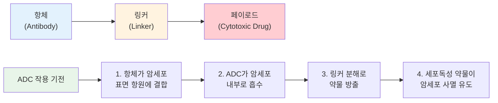
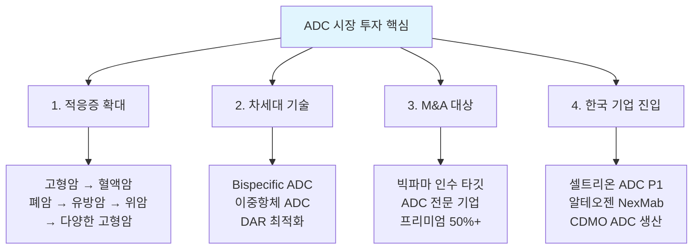
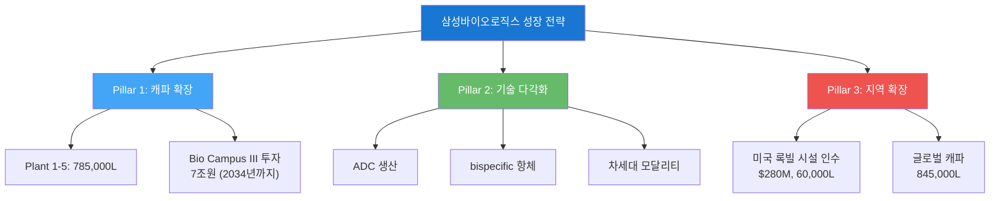
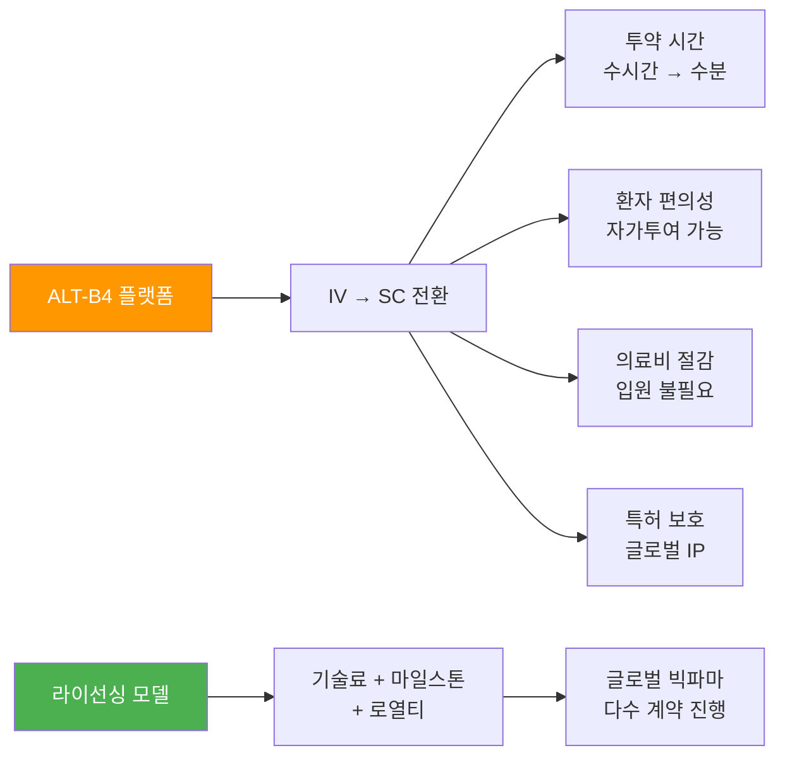
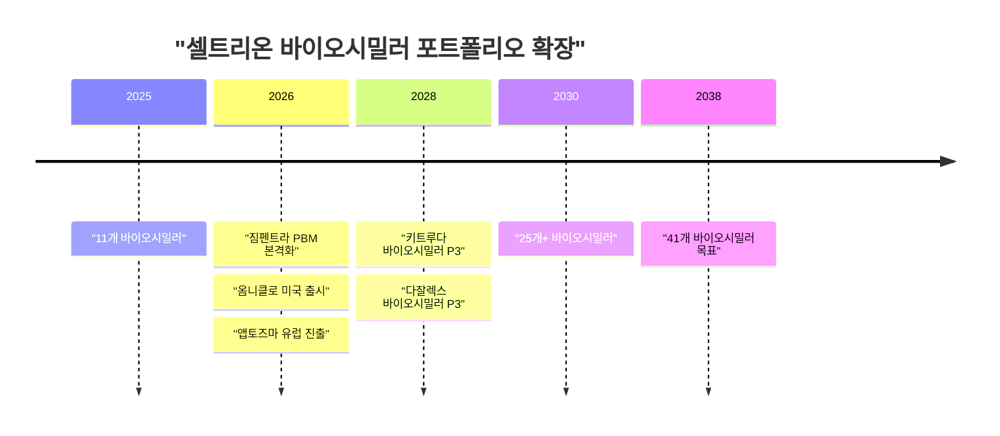
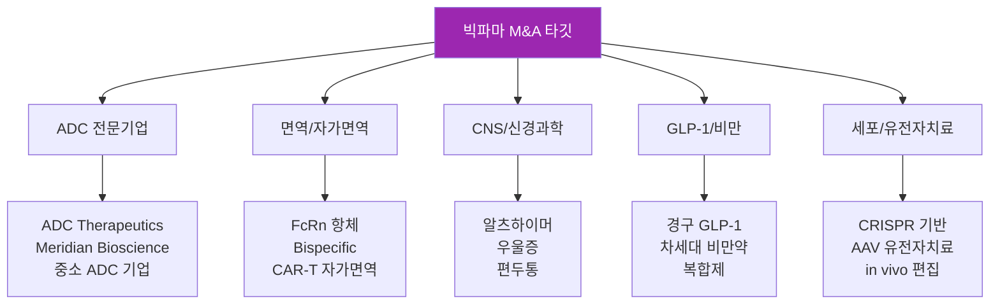

> **관련 글**: [2026년 바이오/헬스케어 섹터 종합 전망](/knowledge/invest/2026/03/07/bio-healthcare-sector-outlook-2026.html)

2026년 신약/바이오텍 섹터는 **ADC(항체-약물 접합체) 시장의 폭발적 성장**, **글로벌 CDMO 수요 급증**, 그리고 **빅파마의 역대급 M&A 사이클**이 삼중으로 교차하며 투자 기회의 황금기를 맞이하고 있습니다. 특히 한국 바이오 기업들은 삼성바이오로직스의 세계 1위 CDMO 지위, 셀트리온의 바이오시밀러 글로벌 리더십, 알테오젠의 피하주사 플랫폼 기술로 글로벌 시장에서 전례 없는 존재감을 발휘하고 있습니다.

## ADC(항체-약물 접합체) 시장 분석

### ADC란 무엇인가?

ADC(Antibody-Drug Conjugate)는 **항체의 표적 정밀성**과 **세포독성 약물의 강력한 살상력**을 결합한 차세대 항암제입니다. 암세포만을 정확히 표적하는 항체에 강력한 화학 약물을 연결(conjugation)하여, 정상 세포 손상을 최소화하면서 암세포를 효과적으로 파괴합니다.

### ADC 시장 규모 및 성장 전망

| 지표 | 수치 | 비고 |
|------|------|------|
| **글로벌 ADC 시장 (2025)** | $13.5B | 전년 대비 25%+ 성장 |
| **글로벌 ADC 시장 (2035)** | $32.7-39.2B | CAGR 9.2-9.3% |
| **진행 중 ADC 임상 (2026.1)** | 431건 | Phase 3: 83건 |
| **참여 기업 수** | 200개+ | 220개+ 치료제 개발 중 |
| **Enhertu 매출 (2024)** | $3.75B | 다이이찌산쿄-아스트라제네카 |

### ADC 주요 기업 및 파이프라인

#### 다이이찌산쿄 (Daiichi Sankyo) - ADC 시장의 절대 강자

다이이찌산쿄는 **DXd ADC 기술 플랫폼**을 기반으로 7개 ADC를 임상 개발 중이며, 2026년에 **5개 ADC 신제품 출시**를 예고하고 있습니다.

| ADC 후보물질 | 표적 항원 | 주요 적응증 | 단계 |
|-------------|----------|-----------|------|
| **Enhertu (T-DXd)** | HER2 | 유방암, 위암, 폐암 | **시판** ($3.75B) |
| **DATROWAY (Dato-DXd)** | TROP2 | TNBC, NSCLC | **Priority Review (미국)** |
| **Patritumab deruxtecan** | HER3 | NSCLC | Phase 3 |
| **Ifinatamab deruxtecan** | B7-H3 | SCLC | Phase 3 |
| 기타 3개 | 다양 | 다양 | Phase 1-2 |

#### 주요 글로벌 ADC 기업

| 기업 | 대표 ADC | 시장 지위 | 투자 포인트 |
|------|---------|----------|-----------|
| **다이이찌산쿄/AstraZeneca** | Enhertu | 시장 리더 | 5개 신규 출시 (2026) |
| **ADC Therapeutics** | Zynlonta | 혈액암 특화 | 인수 타깃 가능성 |
| **Seagen (Pfizer)** | Adcetris, Padcev | 통합 시너지 | Pfizer ADC 포트폴리오 확대 |
| **Gilead/Immunomedics** | Trodelvy | TNBC/방광암 | 적응증 확대 중 |
| **셀트리온** | CT-P70, P71, P73 | IND 승인/P1 | 한국 ADC 신규 진입 |
| **알테오젠** | ALT-Q5 (NexMab) | 전임상~P1 | NexMab ADC 기술 |

### ADC 투자 시사점

## CDMO 시장: 삼성바이오로직스의 독주

### 글로벌 CDMO 시장 현황

바이오의약품의 복잡성과 빅파마의 아웃소싱 전략 확대로 CDMO(Contract Development and Manufacturing Organization) 시장은 구조적 성장 중입니다.

| 지표 | 수치 |
|------|------|
| **글로벌 바이오 CDMO 시장** | $20B+ (2025) |
| **CAGR** | 10-12% |
| **아웃소싱 비중** | 35% → 50%+ (2030) |
| **주요 수요 동인** | ADC, bispecific, mRNA, 유전자치료 |

### 삼성바이오로직스 심층 분석

#### 실적 현황

| 지표 | 2024년 | 2025년 | 2026년 전망 |
|------|--------|--------|-----------|
| **매출** | 약 3.5조원 | **4.5조원** (+30%) | **5.2-5.4조원** (+15-20%) |
| **영업이익** | - | **57% 급증** | 수익성 개선 지속 |
| **총 캐파** | 604,000L | **785,000L** (Plant 5 가동) | **845,000L** (록빌 포함) |

#### 성장 전략: 3대 축

#### 경쟁사 비교

| CDMO | 총 캐파 | 강점 | 약점 |
|------|---------|------|------|
| **삼성바이오로직스** | **845,000L** | 세계 최대 캐파, 속도, 품질 | ADC/세포치료 경험 부족 |
| Lonza | 약 400,000L | ADC·세포치료 강점 | 캐파 삼성 대비 부족 |
| WuXi Biologics | 약 350,000L | 가격 경쟁력 | 미국 BIOSECURE Act 리스크 |
| Catalent/Novo Holdings | 약 200,000L | 제형·약물전달 | 통합 진행 중 |
| Fujifilm Diosynth | 약 150,000L | 유전자치료·mRNA | 규모 한계 |

**투자 핵심 포인트**: 미국 **BIOSECURE Act**로 인한 중국 CDMO(WuXi Biologics 등) 리스크가 삼성바이오로직스에 **최대 수혜**를 안겨주고 있습니다. 빅파마 고객들이 중국 CDMO에서 삼성·Lonza 등으로 물량을 전환하고 있으며, 삼성의 세계 최대 캐파는 이 수요를 흡수하기에 최적의 위치입니다.

### 삼성바이오로직스 밸류에이션

| 지표 | 수치 | 비고 |
|------|------|------|
| **시가총액** | 약 80조원 | KRX 상장 |
| **PER (2026E)** | 약 50-55x | 프리미엄 CDMO |
| **매출 성장률** | 15-20% (2026E) | 록빌 제외 |
| **영업이익률** | 25%+ | 개선 추세 |

## 알테오젠: 피하주사(SC) 플랫폼의 글로벌 가치

### 핵심 기술: ALT-B4 (Hyaluronidase)

알테오젠의 **ALT-B4**는 기존 정맥주사(IV) 바이오의약품을 **피하주사(SC)**로 전환하는 플랫폼 기술입니다. 환자 편의성 향상, 투약 시간 단축(수시간 → 수분), 의료비 절감 효과가 있어 글로벌 빅파마들의 수요가 폭발적입니다.

### 알테오젠 주요 파이프라인

| 파이프라인 | 설명 | 진행 상황 |
|-----------|------|----------|
| **ALT-B4** | IV→SC 전환 플랫폼 | 글로벌 빅파마 옵션 딜, IP 리뷰 2026년 6월 |
| **NexMab ADC (ALT-Q5)** | ADC 기술 플랫폼 | 난소암 대상 개발 중 |
| **기타 라이선싱** | 다수 글로벌 제약사 | 옵션 계약 → 라이선스 전환 기대 |

### 투자 포인트 및 리스크

| 항목 | 내용 |
|------|------|
| **현재 주가** | 361,000원 (2026.02) |
| **애널리스트 목표가** | 평균 435,000원 (고: 570,000원, 저: 250,000원) |
| **투자 의견** | 매수 3, 매도 1 → **매수** 우세 |
| **핵심 촉매** | ALT-B4 IP 리뷰 완료 (2026.06), 글로벌 라이선스 딜 |
| **주요 리스크** | IP 분쟁 결과, 라이선싱 타이밍, 경쟁 플랫폼 등장 |

## 셀트리온: 바이오시밀러에서 신약으로

### 2025년 실적: 사상 최대

| 지표 | 2024년 | 2025년 | 성장률 |
|------|--------|--------|--------|
| **매출** | 약 3.2조원 | **4.0조원** | +25% |
| **영업이익** | - | **1조원+** | 36% 영업이익률 |
| **2026년 매출 목표** | - | **5.3조원** | +33% |

### 바이오시밀러 포트폴리오 확장 전략

### 셀트리온 2026년 성장 동력

| 성장 동력 | 상세 | 매출 영향 |
|----------|------|----------|
| **짐펜트라** | PBM 등재 1년차 효과 반영 | 처방량 급증 → 대형 블록버스터 |
| **옴니클로** | 미국 시장 출시 | 신규 매출 기여 |
| **앱토즈마** | 유럽 시장 진출 | 지역 다각화 |
| **유플라이마** | 일본 시장 확대 | 아시아 성장 |
| **CMO 사업** | 미국 뉴저지 시설 (엘리릴리 공급) | 6,787억원 (3년 계약) |
| **ADC 파이프라인** | CT-P70/71/73 P1 결과 하반기 | 신약 가치 부여 |
| **허셉틴 SC** | 유럽·국내 허가 신청 임박 | 알테오젠 SC 기술 활용 |

### 셀트리온 신약 파이프라인 (ADC)

| 파이프라인 | 타깃 | 적응증 | 단계 | 결과 시기 |
|-----------|------|--------|------|----------|
| **CT-P70** | ADC | 항암 | Phase 1 | 2026년 하반기 |
| **CT-P71** | ADC | 항암 | Phase 1 | 2026년 하반기 |
| **CT-P72** | 다중항체 | 항암 | Phase 1 | 2026년 하반기 |
| **CT-P73** | ADC | 항암 | Phase 1 | 2026년 하반기 |

## 한올바이오파마: FcRn 항체의 글로벌 잠재력

### 핵심 파이프라인: 아이메로프루바트 (IMVT-1402)

한올바이오파마의 핵심 자산인 **아이메로프루바트**(HL161ANS, IMVT-1402)는 차세대 **FcRn 항체**로, 자가면역질환에서 병인성 IgG 항체를 선택적으로 제거합니다. 파트너사 Immunovant(IMVT)를 통해 글로벌 6개 적응증에서 임상 2상/등록임상을 진행 중입니다.

| 적응증 | 임상 단계 | 결과 시기 |
|--------|----------|----------|
| **갑상선안병증 (TED)** | Phase 3 (2건) | 2026년 |
| **난치성 류마티스관절염 (D2T RA)** | 등록임상 | 2026년 탑라인 |
| **피부 홍반성 루푸스 (CLE)** | PoC 임상 | 2026년 초기 결과 |
| **중증근무력증 (MG)** | Phase 2+ | 진행 중 |
| **기타 2개 적응증** | Phase 2 | 진행 중 |

### 한올바이오파마 투자 포인트

| 항목 | 내용 |
|------|------|
| **현재 주가** | 45,500원 |
| **목표가 (NH투자)** | 76,000원 (+67%) |
| **목표가 (다올투자)** | 53,000원 (+16%) |
| **2025년 매출** | 1,552억원 |
| **2026년 계획** | 8개 신제품 출시, 15개 적응증 추가 기대 |
| **핵심 촉매** | TED P3 결과, IMVT 시총 상승 연동 |
| **리스크** | 임상 실패, 파트너 의존도 |

## CAR-T 세포치료·유전자치료

### CAR-T 치료 시장

| 항목 | 현황 |
|------|------|
| **시판 CAR-T** | Kymriah, Yescarta, Tecartus, Breyanzi, Abecma, Carvykti |
| **시장 규모** | $5B+ (2025) |
| **차세대 트렌드** | 자가면역 CAR-T (AbbVie-Capstan $2.1B 인수) |
| **한국 기업** | 큐로셀, 이뮨온시아 등 초기 단계 |

### 유전자치료

| 항목 | 현황 |
|------|------|
| **Casgevy (CRISPR)** | 겸상적혈구병/베타지중해빈혈 시판 |
| **Vertex** | 유전자치료 리더, 통증·신장질환 파이프라인 |
| **Regeneron** | Dupixent 블록버스터 + 유전자치료 투자 |
| **시장 성장** | 희귀질환 중심 → 만성질환 확대 |

## 빅파마 M&A 타깃 분석

### 인수 가능성 높은 기업/영역

### 빅파마별 인수 전략

| 빅파마 | 특허 만료 위기 | 인수 초점 영역 | 예상 M&A 규모 |
|--------|-------------|-------------|-------------|
| **Merck** | Keytruda (2028) | 면역항암·ADC | $10-20B |
| **AbbVie** | Humira 대체 | 면역·자가면역·CNS | $5-15B |
| **J&J** | Stelara (2025) | CNS·면역 | $10-15B |
| **Pfizer** | COVID 매출 급감 | GLP-1·ADC | $5-10B |
| **Roche** | 경쟁 심화 | 면역항암·진단 | $5-15B |

## 종목별 투자 전략 요약

### 확신도별 분류

| 확신도 | 종목 | 투자 근거 | 리스크 |
|--------|------|----------|--------|
| ★★★★★ | **삼성바이오로직스** | 세계 1위 CDMO, BIOSECURE 수혜, 미국 진출 | 높은 밸류에이션 (PER 50x+) |
| ★★★★★ | **셀트리온** | 사상 최대 실적, 짐펜트라 성장, ADC 신규 | CMO 사업 실행 리스크 |
| ★★★★ | **알테오젠** | SC 플랫폼 독보적, ALT-B4 라이선싱 기대 | IP 리뷰 결과 불확실성 |
| ★★★★ | **한올바이오파마** | 아이메로프루바트 글로벌 임상 5건 결과 | 파트너 IMVT 의존도 |
| ★★★ | **다이이찌산쿄** | ADC 포트폴리오 최강 | 일본 기업 밸류에이션 |
| ★★★ | **AbbVie** | M&A 전략 명확, Humira 이후 성장 | 인수 프리미엄 부담 |

### 투자 타이밍 캘린더

| 시기 | 이벤트 | 관련 종목 |
|------|--------|----------|
| 2026 Q1 | 셀트리온 2025년 실적 발표 | 셀트리온 |
| 2026 Q1-Q2 | 삼성바이오 록빌 시설 통합 | 삼성바이오로직스 |
| 2026 상반기 | 알테오젠 ALT-B4 IP 리뷰 완료 | 알테오젠 |
| 2026 상반기 | 한올 TED P3 결과 | 한올바이오파마 |
| 2026 하반기 | 셀트리온 ADC P1 결과 | 셀트리온 |
| 2026 연중 | 다이이찌산쿄 ADC 5개 출시 | 다이이찌산쿄 |
| 2026 연중 | 빅파마 M&A 대형 딜 | ADC·면역·GLP-1 관련주 |

## 리스크 요인

| 리스크 | 확률 | 영향도 | 모니터링 |
|--------|------|--------|---------|
| **임상 실패** | 중 | 상 | 한올 TED P3, 셀트리온 ADC P1 |
| **약가 규제** | 중 | 상 | IRA 약가 협상 대상 확대 |
| **BIOSECURE Act 완화** | 하 | 중-상 | 중국 CDMO 규제 완화 시 삼성 수혜 감소 |
| **경쟁 심화** | 중-상 | 중 | CDMO 신규 캐파 증설 (Lonza, Fujifilm) |
| **환율 변동** | 중 | 중 | 원화 약세 시 수출 수혜, 강세 시 역풍 |
| **금리·유동성** | 중 | 중 | 바이오텍 밸류에이션 민감도 |

---

> **면책 조항**: 본 글은 투자 정보 제공 목적이며, 특정 종목의 매수/매도를 권유하는 것이 아닙니다. 투자 결정은 본인의 판단과 책임하에 이루어져야 합니다.

---

*최종 업데이트: 2026년 3월 7일*
