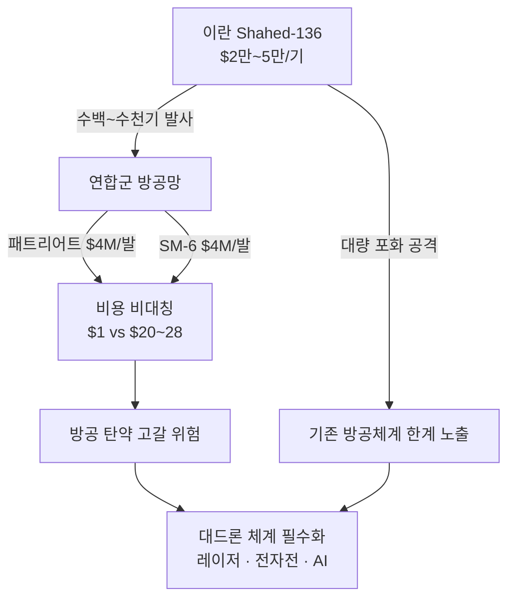
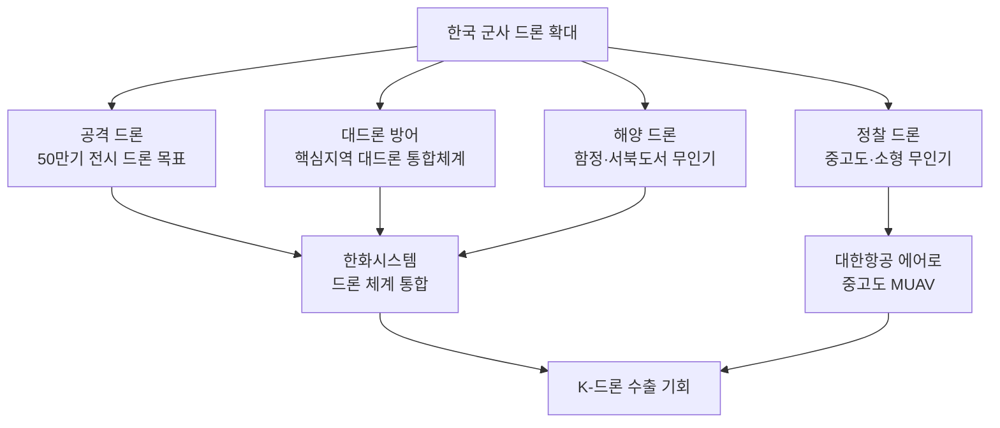
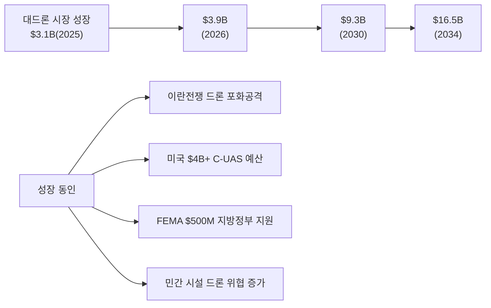
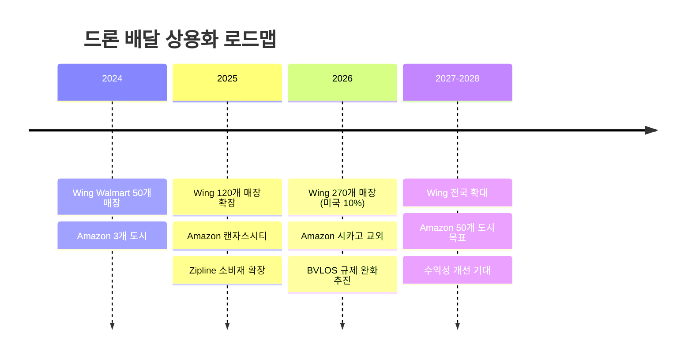
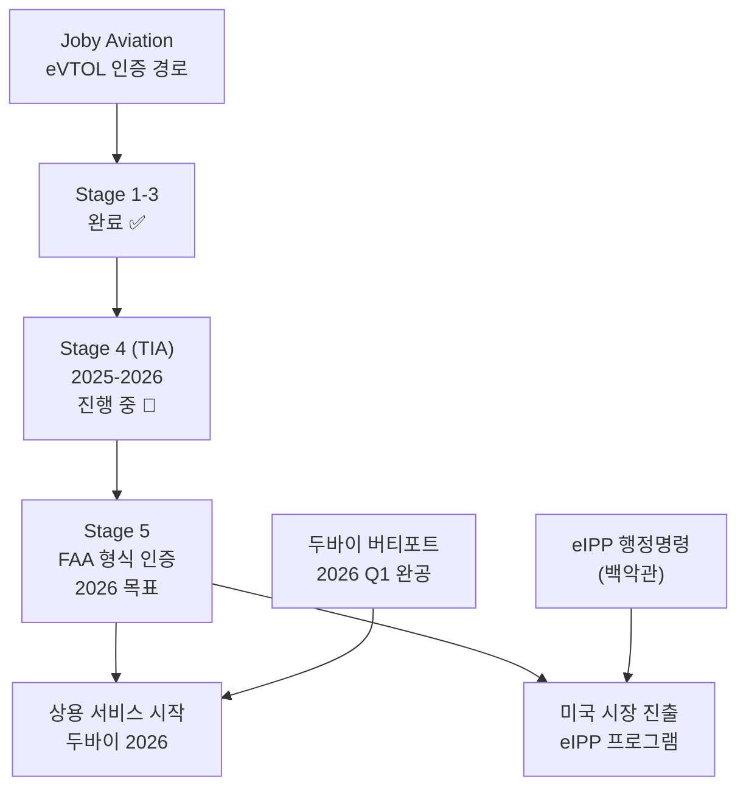

> **관련 글**: [방산/우주 섹터 종합 전망](/knowledge/invest/2026/03/07/defense-space-sector-outlook-2026.html) | [우주/위성 투자 전망](/knowledge/invest/2026/03/07/space-satellite-outlook-2026.html) | [방산 섹터 상세](/knowledge/invest/2026/01/21/defense-sector-outlook-2026.html)

---

## 핵심 요약 (2026년 3월 7일 기준)

| 항목 | 내용 |
|------|------|
| **이란 전쟁 드론 혁명** | 1,450+ 드론 공습, 전체 공격의 75% — 현대전의 패러다임 전환 |
| **비용 비대칭** | Shahed 드론 $2만 vs 요격 미사일 $100만+ — **20~50배 비용 우위** |
| **대드론(C-UAS) 시장** | $3.88B(2026) → $16.45B(2034), **CAGR 19.8%** |
| **한국 군사 드론** | 50만기 전시 드론 목표, 한화시스템 대드론 3,000억 수주 |
| **eVTOL 인증** | Joby Aviation FAA 4/5단계 완료, 2026년 상용 서비스 목표 |
| **드론 배달** | Wing: Walmart 270개 매장, Amazon: 시카고 확장 |

---

## 1. 이란 전쟁이 증명한 드론 혁명

### 1-1. 드론 전쟁의 규모

2025년 6월 시작된 미국-이란 전쟁은 **드론이 현대전의 핵심 전력**임을 입증하는 최대 규모의 실전 사례가 되었습니다.

| 항목 | 수치 | 비고 |
|------|------|------|
| **이란 드론 공습** | **1,450+ 회** | 전체 공격의 약 75% |
| **이란 미사일 발사** | **540+ 발** | 탄도미사일 + 순항미사일 |
| **이란 Shahed 드론 단가** | **$20,000~$50,000** | "가난한 자의 순항미사일" |
| **요격 미사일 단가** | **$1M~$4M** (패트리어트, SM-6) | 드론 대비 20~50배 |
| **이란 Artesh 신규 드론** | **1,000기** 일괄 전력화 | 2026년 3월 배치 완료 |

### 1-2. 비용 비대칭의 전략적 의미

이란 전쟁의 가장 충격적인 교훈은 **비용 비대칭**입니다.

> 이란이 드론 생산에 $1을 쓸 때, 걸프 국가들은 방어에 **$20~$28**을 지출합니다. 개별 요격탄의 비용이 $100만 이상인 경우가 대부분입니다. — Foreign Policy, 2026.3.5

이는 다음과 같은 투자 시사점을 만들어냅니다:

1. **저비용 요격 기술**: 레이저 무기(지향성 에너지), 전자전(재밍/스푸핑), AI 기반 자율 요격 시스템에 대한 수요 폭발
2. **대량 드론 생산**: 적은 비용으로 대량 투입 가능한 군사 드론 수요 급증
3. **대드론 방어 시스템**: 드론을 효과적으로 탐지/추적/무력화하는 C-UAS 시장 급성장

---

## 2. 군사 드론 시장 — 현대전의 게임 체인저

### 2-1. 주요국 군사 드론 프로그램

| 국가 | 프로그램 | 내용 | 규모 |
|------|---------|------|------|
| **한국** | 50만 전시 드론 | 3축 방위체계+드론 워리어 양성 | 2026년 예산 205억원 |
| **한국** | 한화시스템 해군 드론 | 함정·서북도서 무인기 체계 개발 | 1,433억원 (2023~2028) |
| **한국** | 핵심지역 대드론 체계 | 한화시스템 대드론 통합 시스템 | ~3,000억원 |
| **미국** | Replicator Initiative | AI 자율 드론 수천 기 배치 | 수십억 달러 |
| **이란** | Artesh 드론 전력화 | Shahed 변형 1,000기 일괄 배치 | 2026.3 완료 |

### 2-2. 한국 군사 드론 투자 현황

한국 정부는 이란 전쟁과 북한 드론 위협을 계기로 **군사 드론 역량을 대폭 강화**하고 있습니다.

**핵심 수혜 기업**:
- **한화시스템**: 해군 드론 체계 1,433억 + 대드론 통합 ~3,000억원 수주. 방산/위성/UAM/AI 4축 성장
- **대한항공 에어로스페이스**: 중고도 무인기(MUAV) 개발, 군용 드론 수출 노하우
- **LIG넥스원**: 드론 탑재 정밀유도탄, 대드론 요격체 개발

---

## 3. 대드론(Counter-UAS) 시장 — 가장 빠르게 성장하는 방산 하위 섹터

### 3-1. 시장 규모 및 전망

이란 전쟁은 대드론 시장의 폭발적 성장을 촉발했습니다.

| 지표 | 수치 |
|------|------|
| **2025년 시장 규모** | $3.11B |
| **2026년 시장 규모** | **$3.88B** |
| **2030년 전망** | **$9.3B** |
| **2034년 전망** | **$16.45B** |
| **CAGR** | **19.8%** (2026~2034) |
| **미국 C-UAS 예산** | **$4B+** (2026년) |
| **방어 부문 비중** | $2.5B (2024) → $25.65B (2035), CAGR 22.8% |

### 3-2. 대드론 기술 분류

| 기술 | 방식 | 장점 | 대표 기업 |
|------|------|------|----------|
| **전자전(EW)** | 재밍/스푸핑으로 제어 교란 | 저비용, 비운동학적 | DroneShield, L3Harris |
| **지향성 에너지(DE)** | 레이저/마이크로파 | 탄당 비용 $1~10, 무한 탄약 | Raytheon, Lockheed Martin |
| **운동학적 요격** | 소형 미사일/탄환 | 높은 파괴력 | Northrop Grumman |
| **네트워크 감지** | RF/레이더/광학 통합 탐지 | 조기 경보 | Dedrone, SkySafe |
| **AI 자율 요격** | AI 기반 자동 교전 | 반응 속도 극대화 | 개발 초기 단계 |

### 3-3. 대드론 투자 대상

| 종목 | 시장 | 핵심 포인트 | 리스크 |
|------|------|------------|--------|
| **DroneShield (DRO.AX)** | ASX | C-UAS 전문 기업, 미 국방부 마켓플레이스 등재 | 소형주 변동성 |
| **Raytheon (RTX)** | NYSE | 지향성 에너지 무기 개발, 대형 방산 | 밸류에이션 고평가 |
| **L3Harris (LHX)** | NYSE | 전자전 기술 리더, C-UAS 통합 솔루션 | |
| **한화시스템** | KOSPI | 핵심지역 대드론 ~3,000억 수주, 국내 독점 | |
| **LIG넥스원** | KOSPI | 대드론 요격체, 정밀유도탄 | |

---

## 4. 상업 드론 — 드론 배달의 규모 확대

### 4-1. 주요 드론 배달 서비스 현황 (2026년 3월 기준)

| 서비스 | 진행 상황 | 규모 |
|--------|---------|------|
| **Wing (Alphabet)** | Walmart 270개 매장 제휴, 달라스-포트워스 주간 수천 건 | 미국 인구 10% 커버리지 목표 |
| **Amazon Prime Air** | 시카고 교외 확장 (마탐·마크햄), 8마일 반경 | 캔자스시티 런칭 완료 |
| **Zipline** | 24개국 운영, 자율 배달 리더 | 의료물품 중심 → 소비재 확장 |

**현실적 평가**: 10년간의 약속 후에도 드론 배달은 "파일럿 이상, 패러다임 이하"의 상태입니다. 규제 제약(BVLOS 승인 부족), 페이로드 제한(2.5~5파운드), 수익성 미확보가 여전한 과제입니다.

그러나 **규제 완화 가속 신호**가 있습니다:
- 미국 FAA: BVLOS(시야 밖 비행) 규제 완화 추진 중
- Safer Skies Act 통과: 연방/지방 C-UAS 예산 확대
- 트럼프 행정부: 드론 산업 규제 완화 행정명령

---

## 5. eVTOL/UAM — 도심항공모빌리티의 인증 임계점

### 5-1. 2026년이 중요한 이유

2026년은 eVTOL(전기 수직이착륙기) 산업에서 **FAA 인증의 결정적 해**입니다.

| 기업 | 기체 | FAA 인증 단계 | 2026년 목표 |
|------|------|-------------|------------|
| **Joby Aviation** | S4 | **4/5단계** (TIA 테스트) | FAA 파일럿 비행 시작, 두바이 상용 서비스 |
| **Archer Aviation** | Midnight | 3~4단계 | 미 국방부 계약 이행, 인증 진행 |
| **Lilium** | Lilium Jet | 구조조정 후 재개 | EASA 인증 병행 |
| **한화시스템/Overair** | Butterfly | 인증 지연 | 상용화 2028년으로 재조정, 매각 검토 중 |

### 5-2. Joby Aviation — eVTOL 선두주자

Joby Aviation은 **eVTOL 인증에서 가장 앞서 있는 기업**으로, 2026년 상용 서비스를 목표로 하고 있습니다.

| 항목 | 내용 |
|------|------|
| **FAA 인증** | 5단계 중 4단계 완료 — 업계 최초 |
| **TIA 테스트** | 2025년 Joby 파일럿 비행 시작, 2026년 FAA 파일럿 비행 |
| **두바이 런칭** | 두바이 국제공항 버티포트 2026 Q1 완공, 에어택시 서비스 시작 |
| **eIPP 프로그램** | 백악관 행정명령 — 정식 인증 전 일부 시장에서 운영 허용 |
| **제조 역량** | 미국 내 제조 역량 2배 확대 계획 발표 |

### 5-3. 한국 UAM 로드맵

| 시기 | 목표 | 주요 내용 |
|------|------|----------|
| **2025년** | 실증 사업 | K-UAM Grand Challenge 완료 |
| **2026~2027년** | 시범 운영 | 서울~인천공항 노선 시범 |
| **2028~2030년** | 상용 서비스 | 요금 택시 수준, 일반인 이용 시작 |

**한국 UAM 관련 기업**:

| 기업 | 역할 | 현황 |
|------|------|------|
| **한화시스템** | Overair(Butterfly eVTOL) 자회사 | 상용화 2028년 재조정, **매각 검토 중** — 리스크 주의 |
| **대한항공** | UAM 운항 사업자 후보 | 에어택시 운영 검토 |
| **SKT/KT** | 통신 인프라 | UAM 통신/관제 시스템 |
| **현대건설** | 버티포트 인프라 | UAM 이착륙장 설계/건설 |
| **켄코아에어로스페이스** | eVTOL 부품/소재 | 탄소섬유 복합재, 경량 구조물 |

> **한화시스템 Overair 리스크**: 한화시스템이 최근 Overair CB(전환사채) 만기에 전환 대신 상환을 청구했으며, Overair 매각을 검토 중입니다. 이는 UAM 사업의 불확실성을 높이는 요인이므로, 한화시스템 투자 시 UAM이 아닌 **방산+위성 사업의 가치**에 주목해야 합니다.

---

## 6. 드론/UAM ETF 및 투자 수단

### 6-1. 관련 ETF

| ETF | 티커 | 핵심 내용 |
|-----|------|----------|
| **ARK Autonomous Technology & Robotics** | ARKQ | Joby, 드론 관련 기업 포함 |
| **SPDR S&P Kensho Future Security** | FITE | 드론/사이버보안/방산 기술 |
| **Global X Defense Tech** | SHLD | 방산 기술 집중 (대드론 포함) |
| **iShares U.S. Aerospace & Defense** | ITA | 미국 대형 방산 기업 (Raytheon, L3Harris) |

### 6-2. 투자 매력도 매트릭스

| 세부 섹터 | 단기 (6개월) | 중기 (1~2년) | 장기 (3년+) |
|----------|-------------|-------------|------------|
| **군사 드론** | ★★★★★ | ★★★★★ | ★★★★ |
| **대드론(C-UAS)** | ★★★★★ | ★★★★★ | ★★★★ |
| **드론 배달** | ★★ | ★★★ | ★★★★ |
| **eVTOL/UAM** | ★★★ | ★★★★ | ★★★★★ |

---

## 7. 종목별 투자 분석

### 7-1. 국내 종목

| 종목 | 핵심 사업 | 투자 포인트 | 리스크 | 투자 의견 |
|------|----------|------------|--------|----------|
| **한화시스템** | 방산+위성+UAM | 해군 드론 1,433억, 대드론 3,000억 수주, 방산 매출 4.2조 전망 | Overair 매각 리스크 | 방산+위성 가치에 주목 |
| **LIG넥스원** | 미사일+드론 | 대드론 요격체, 정밀유도탄, 수출비중 52% 확대 | 밸류에이션 부담 | 중장기 유망 |
| **대한항공** | 군용 드론 | MUAV 개발, 군사 드론 수출 노하우 | 항공 본업 변수 | 방산 부문 분리 기대 |
| **켄코아에어로** | eVTOL 부품 | 탄소섬유 복합재, UAM 핵심 소재 | 소형주 리스크 | 테마 투자 |

### 7-2. 해외 종목

| 종목 | 티커 | 핵심 사업 | 투자 포인트 | 리스크 |
|------|------|----------|------------|--------|
| **Joby Aviation** | JOBY | eVTOL | FAA 4/5단계, 두바이 2026 런칭 | 인증 지연 시 주가 급락 |
| **Archer Aviation** | ACHR | eVTOL | Midnight, 미 국방부 계약 | 적자 지속, 자금 소진 |
| **DroneShield** | DRO.AX | 대드론 | C-UAS 전문, 미 국방부 마켓플레이스 | 소형주 변동성 |
| **AeroVironment** | AVAV | 군사 드론 | Switchblade 전술 드론, 우크라 전쟁 수혜 | 이란전쟁 종전 리스크 |
| **Kratos Defense** | KTOS | 무인 전투기 | 자율 드론, Valkyrie 무인 전투기 | 수주 의존도 높음 |

---

## 8. 리스크 요인

| 리스크 | 영향 | 확률 |
|--------|------|------|
| **이란 전쟁 조기 종전** | 군사 드론/대드론 모멘텀 약화 | 중간 |
| **eVTOL FAA 인증 지연** | Joby/Archer 주가 급락, UAM 테마 냉각 | 중간~높음 |
| **드론 사고/안전 이슈** | 규제 강화, 상업화 지연 (Amazon 사고 사례) | 높음 |
| **BVLOS 규제 유지** | 드론 배달 확장 제한 | 중간 |
| **밸류에이션 조정** | eVTOL 기업 대부분 적자, 자금 소진 리스크 | 높음 |

---

## 9. 결론 — 드론은 선택이 아닌 필수

2026년 드론/UAM 섹터는 **이란 전쟁이 군사 드론의 필수성을 입증**하고, **FAA 인증이 민간 UAM의 상용화 임계점에 도달**하는 역사적 국면에 있습니다.

**투자 우선순위**:

1. **1순위: 대드론(C-UAS)** — 가장 확실한 수요(이란 전쟁 실전 수요), 가장 빠른 성장(CAGR 19.8%), 구체적 예산 배정(미국 $4B+)
2. **2순위: 군사 드론** — 한국 50만기 드론 프로그램, 글로벌 군비 경쟁, 한화시스템/대한항공 에어로 수혜
3. **3순위: eVTOL/UAM** — Joby FAA 인증 최종 단계, 두바이 2026 런칭 기대. 단, **인증 지연 리스크 및 적자 기업 밸류에이션 주의**
4. **4순위: 드론 배달** — 장기 성장 잠재력 높으나, 2026년 단기 수익 가시성 낮음

> 드론은 이제 "미래 기술"이 아니라 **"현재 전쟁에서 사용되는 핵심 무기"**입니다. 이란 전쟁에서 $2만짜리 드론이 $400만짜리 요격 미사일을 소진시키는 비용 비대칭은 전 세계 군대에 드론과 대드론 투자를 강제하고 있습니다. 이 구조적 변화에 투자하는 것이 2026년 드론/UAM 섹터의 핵심 논리입니다.

---

## 10. 관련 포스트

| 섹터 | 포스트 | 핵심 주제 |
|------|--------|----------|
| **종합** | [방산/우주 섹터 종합 전망](/knowledge/invest/2026/03/07/defense-space-sector-outlook-2026.html) | 3개 하위 섹터 비교, 투자 전략 |
| **우주/위성** | [우주/위성 투자 전망](/knowledge/invest/2026/03/07/space-satellite-outlook-2026.html) | Starlink, 발사체, 한국 우주산업 |
| **방산 상세** | [방산 섹터 상세 전망](/knowledge/invest/2026/01/21/defense-sector-outlook-2026.html) | 천궁-II, EU 재무장, K-방산 |
