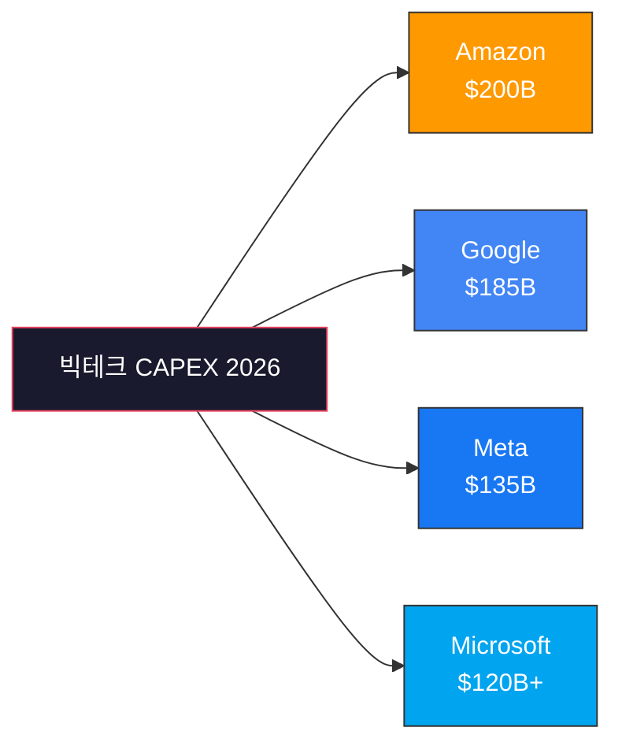
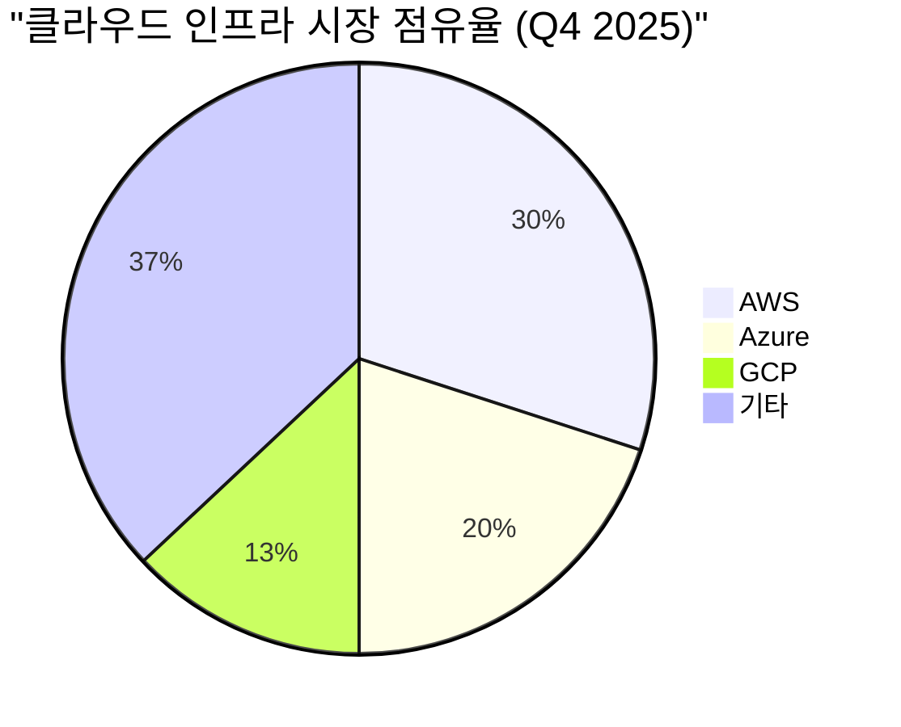
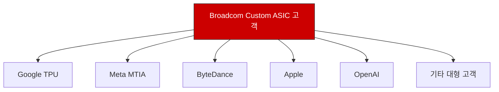
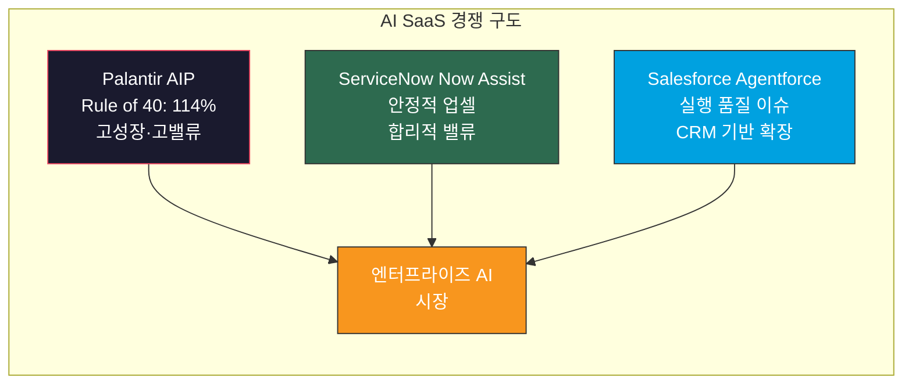
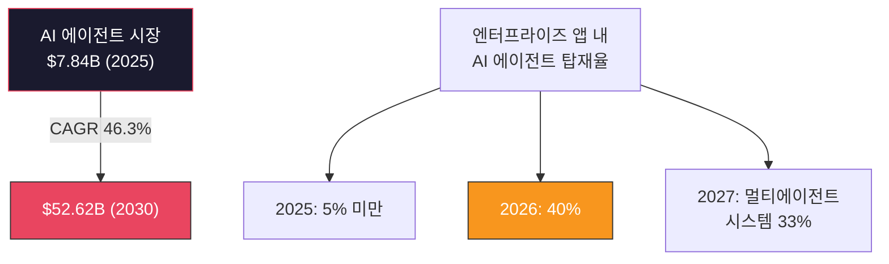
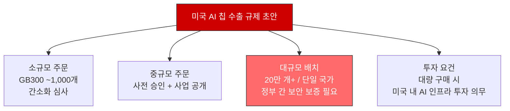
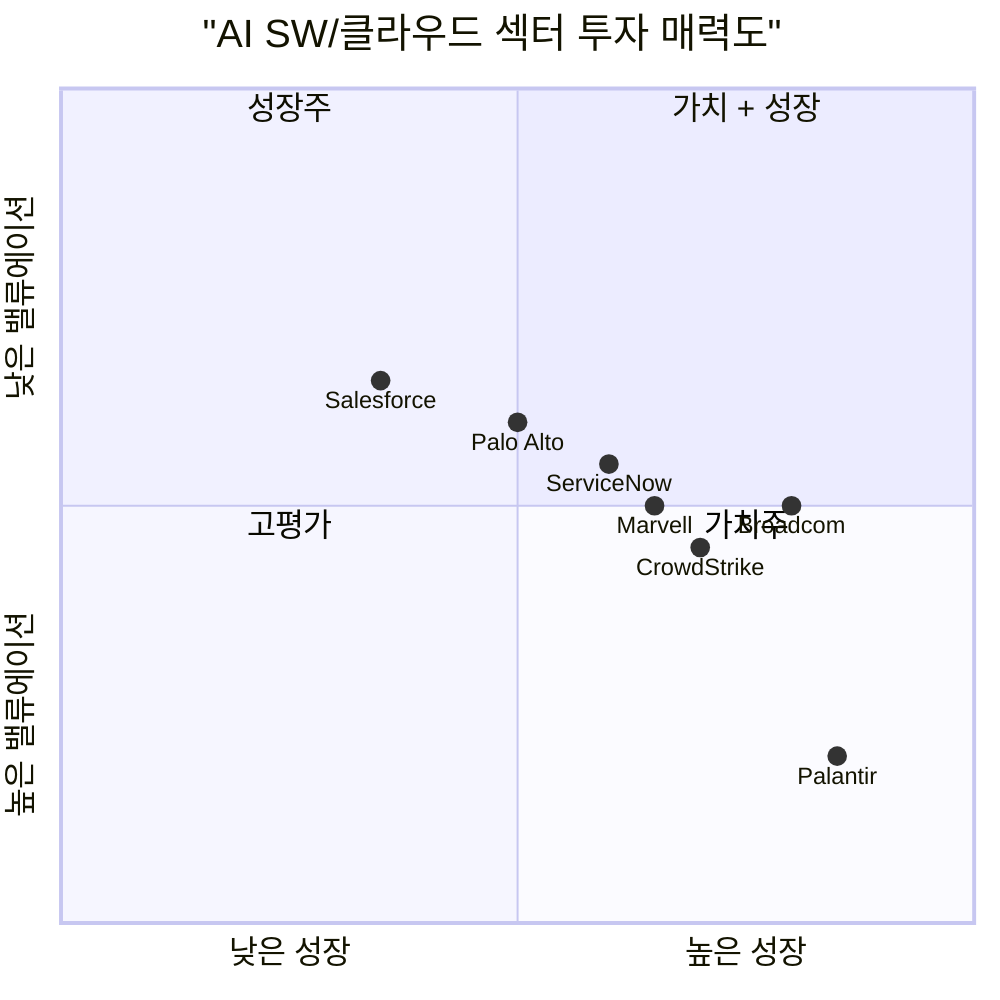

## 요약

2026년 AI 소프트웨어/클라우드 섹터는 **빅테크 CAPEX $690B 시대**에 진입했다. Amazon $200B, Google $185B, Meta $135B, Microsoft $120B 이상을 AI 인프라에 쏟아붓고 있으며, 이 투자의 수혜는 클라우드 3사(AWS/Azure/GCP), Custom ASIC(Broadcom/Marvell), AI SaaS(Palantir/ServiceNow), 사이버보안(CrowdStrike/Palo Alto) 전반에 걸쳐 나타나고 있다.

핵심 투자 포인트는 다음과 같다.

| 섹터 | 핵심 지표 | 투자 매력도 |
|------|-----------|-------------|
| 빅테크 CAPEX | 4사 합산 ~$690B (YoY +36%) | 인프라 수혜주 주목 |
| 클라우드 3사 | Azure +39%, GCP +32%, AWS +17% | Azure/GCP 고성장 |
| Custom ASIC | Broadcom AI $8.4B (+74%) | 고성장 지속 |
| AI SaaS | Palantir US 상업 +121% | 밸류에이션 리스크 |
| 사이버보안 | CrowdStrike ARR +47% 가속 | 구조적 성장 |
| AI 에이전트 | 엔터프라이즈 앱 40% AI 에이전트 탑재 예상 | Next Wave |

---

## 1. 빅테크 CAPEX: $690B 인프라 스프린트

### 1-1. 개별 기업 CAPEX 규모

2026년 빅테크 4사의 AI 인프라 투자 규모는 역사상 전례 없는 수준에 도달했다. 합산 CAPEX가 약 $690B에 달하며, 이는 전년 대비 36% 증가한 수치다.

| 기업 | 2026 CAPEX (가이던스) | 주요 용도 |
|------|----------------------|-----------|
| Amazon | ~$200B | AWS AI 인프라, 데이터센터 |
| Google (Alphabet) | ~$185B | GCP, Gemini 모델 학습 |
| Meta | ~$135B | AI 연구, 데이터센터 |
| Microsoft | $120B+ | Azure AI, OpenAI 파트너십 |

### 1-2. 투자 구조와 리스크

전체 CAPEX의 약 75%($450B 이상)가 AI 인프라(GPU, 서버, 데이터센터)에 직접 투입된다. 이로 인해 **잉여현금흐름(FCF) 압박**이 심화되고 있다.

- **Amazon**: Morgan Stanley 기준 2026년 FCF가 **-$17B~-$28B**로 전환 예상
- 나머지 3사도 FCF 마진 축소 불가피

투자자 관점에서 이 CAPEX가 실제 매출로 전환되는 속도(ROIC)가 핵심 모니터링 지표다. 현재까지는 클라우드 매출 성장률이 CAPEX 증가율을 하회하고 있어, **투자 회수 시차(J-커브)**에 대한 인내가 필요하다.

---

## 2. 클라우드 3사: AWS vs Azure vs GCP

### 2-1. 시장 점유율 현황

2025년 4분기 기준 글로벌 클라우드 인프라 시장 점유율은 다음과 같다.

| 클라우드 | 시장 점유율 | YoY 매출 성장률 | 핵심 전략 |
|----------|------------|----------------|-----------|
| AWS | 30% | +17% | AI 커스텀 칩(Trainium), Bedrock |
| Azure | 20% | +39% | OpenAI 통합, Copilot 생태계 |
| GCP | 13% | +32% | Gemini, 멀티클라우드 |

### 2-2. AI 매출 기여도 분석

Azure가 가장 공격적으로 AI 매출을 키우고 있다. Microsoft는 Azure AI 매출이 분기 $130억을 초과하는 런레이트에 진입했다고 밝혔으며, 이는 Azure 전체 매출의 약 16%에 해당한다.

GCP는 Gemini API 호출량이 전분기 대비 3배 증가했으며, AI/ML 관련 매출이 GCP 전체 성장의 40% 이상을 견인하고 있다.

AWS는 Bedrock과 SageMaker를 통한 AI 서비스 매출이 연간 $10B 런레이트를 돌파했으나, 전체 AWS 매출 대비 비중은 아직 10% 수준이다.

### 2-3. 투자 시사점

- **Azure**: AI 매출 비중이 가장 높고, 성장률도 가장 빠름. OpenAI 파트너십이 핵심 경쟁력
- **GCP**: 자체 Gemini 모델과 TPU로 차별화. 시장 점유율 15% 돌파 가능성
- **AWS**: 절대적 규모 1위지만 성장률 둔화. Trainium/Inferentia 등 자체 칩 전략이 관건

---

## 3. Custom ASIC: Broadcom과 Marvell의 질주

### 3-1. Broadcom AI 매출 급성장

Broadcom은 2026 회계연도 1분기 AI 관련 칩 매출 **$8.4B**(YoY +74%)을 기록하며 시장 기대를 크게 상회했다. 커스텀 AI ASIC 시장에서 약 **70% 점유율**을 차지하고 있다.

핵심 포인트:
- **6번째 대형 고객으로 OpenAI 확보**: Nvidia GPU 의존도를 낮추려는 OpenAI의 전략과 맞물림
- **FY2025 AI 매출 가이던스 $19.9B** (YoY +63%)
- VMware 인수 시너지로 소프트웨어 매출도 안정적 성장

### 3-2. Marvell의 추격

Marvell Technology는 데이터센터 매출이 YoY +39% 성장했으나, Broadcom과의 격차는 여전히 크다.

| 지표 | Broadcom | Marvell |
|------|----------|---------|
| Custom ASIC 점유율 | ~70% | ~20% |
| 주요 ASIC 고객 | Google, Meta, OpenAI 등 6사 | Amazon(AWS) 중심 |
| AI 매출 규모 | $8.4B/분기 | ~$1.5B/분기 |
| 고객 집중 리스크 | 분산됨 | AWS 의존도 높음 |

Marvell은 AWS와의 긴밀한 협력(Trainium 칩 관련)이 강점이지만, **고객 집중도 리스크**가 존재한다. Broadcom 대비 밸류에이션 할인이 존재하므로, 리스크 허용 범위에 따라 투자 접근이 달라질 수 있다.

---

## 4. AI SaaS: Palantir, ServiceNow, Salesforce

### 4-1. Palantir AIP - 엔터프라이즈 AI의 선두주자

Palantir는 AIP(Artificial Intelligence Platform)를 통해 엔터프라이즈 AI 시장을 선도하고 있다.

| 지표 | 수치 |
|------|------|
| 2025 Q3 매출 | $1.18B (YoY +63%) |
| 2025 연간 매출 가이던스 | $4.4B |
| 2026 매출 전망 (컨센서스) | $5.5B~$6.0B |
| US 상업 부문 성장률 | YoY +121% |
| Rule of 40 | 114% |

Palantir의 **US 상업 부문이 YoY +121%** 성장하며, AIP 부트캠프 전략이 성공적으로 작동하고 있음을 입증했다. Q3에만 총 계약 가치(TCV) $1.3B을 달성했다.

다만 **밸류에이션 리스크**가 존재한다. Forward P/S 기준 40x 이상으로 거래되고 있어, 성장 둔화 시 주가 조정 가능성이 크다.

### 4-2. ServiceNow - AI 업셀의 교과서

ServiceNow는 Now Assist AI 기능을 기존 고객에게 업셀하는 전략으로 안정적 성장을 이어가고 있다.

- AI가 딜 사이즈를 **20% 이상 확대**하는 효과
- 기존 ITSM/ITOM 고객 기반 위에 AI를 자연스럽게 확장
- 밸류에이션(Forward P/S ~18x)이 Palantir 대비 합리적

### 4-3. Salesforce Agentforce - 기대 vs 현실

Salesforce의 Agentforce 플랫폼은 출시 초기 높은 기대를 모았으나, **실행 품질 문제**가 드러났다.

- 복잡한 멀티턴 워크플로우(8단계 이상)에서 **성공률 35%** 수준
- 내부 감사 및 서드파티 리포트에서 신뢰성 문제 지적 (2025년 12월)
- CRM 시장 지배력은 여전하지만, AI 프리미엄 정당화에 시간 필요

---

## 5. 사이버보안: AI가 만드는 구조적 성장

### 5-1. CrowdStrike - AI 네이티브 플랫폼의 힘

CrowdStrike는 AI 네이티브 Falcon 플랫폼을 기반으로 사이버보안 시장을 선도하고 있다.

| 지표 | 수치 |
|------|------|
| FY2026 매출 가이던스 | $4.80B (YoY +21%) |
| 신규 순 ARR | $331M/분기 (YoY +47%) |
| ARR 가속 | 3분기 연속 가속 |
| FY2027 매출 전망 | $5.83B |

핵심 투자 포인트:
- **ARR 가속 3분기 연속**: 2024년 7월 글로벌 IT 장애 이후 우려를 완전히 불식
- **AI 기반 위협 탐지**: Charlotte AI가 SOC 분석가 생산성을 85% 향상
- **플랫폼 통합**: 평균 모듈 채택 수 8개 이상으로 확대

### 5-2. Palo Alto Networks - 플랫포미제이션 전략

Palo Alto Networks는 "플랫포미제이션(Platformization)" 전략으로 사이버보안 통합 플랫폼을 구축하고 있다.

| 지표 | 수치 |
|------|------|
| FY2026 Q1 매출 | $2.5B (YoY +16%) |
| 비-GAAP 순이익 | $662M (YoY +21%) |
| FY2026 매출 성장 전망 | +14.1% |

- AI 거버넌스와 보안 관제를 통합한 **Cortex XSIAM** 플랫폼이 핵심
- CrowdStrike 대비 성장률은 낮지만, 수익성과 안정성 측면에서 우위

### 5-3. 사이버보안 투자 논리

AI 시대 사이버보안은 **공격과 방어 양면에서 수요가 증가**하는 구조적 성장 섹터다.

- AI가 더 정교한 공격을 가능케 함 → 방어 솔루션 수요 증가
- 기업의 AI 인프라 확대 → 새로운 공격 표면(Attack Surface) 확대
- 클라우드·AI 워크로드 보호 수요 → 클라우드 네이티브 보안 시장 성장

---

## 6. AI 에이전트 플랫폼: 차세대 성장 동력

### 6-1. 시장 전망

Gartner에 따르면 **2026년 말까지 엔터프라이즈 애플리케이션의 40%**에 태스크 특화 AI 에이전트가 탑재될 전망이다. 이는 2025년 5% 미만에서 급격히 증가하는 수치다.

### 6-2. 주요 트렌드

| 트렌드 | 내용 |
|--------|------|
| 멀티에이전트 시스템 | 2027년까지 Agentic AI 구현의 1/3이 복수 에이전트 협업 방식 채택 |
| 자율적 의사결정 | 클라우드 비용 최적화, 보안 인시던트 대응 등 자율 수행 |
| 로우코드/노코드 | 15~60분 내 에이전트 배포 가능한 비주얼 빌더 |
| 거버넌스 | 에이전트 통제 프레임워크가 2026년 필수 요소로 부상 |

### 6-3. 실전 성숙도

McKinsey에 따르면 **실제로 AI 에이전트를 본격 확대(Scale)하는 기업은 23%**에 불과하며, 39%는 여전히 실험 단계에 머물러 있다. 약 절반의 Agentic AI 프로젝트가 파일럿 단계에서 정체되어 ROI 실현이 지연되고 있다.

투자 관점에서 AI 에이전트는 **2026~2027년이 본격 상용화 시작점**이며, Gartner는 2035년까지 엔터프라이즈 SW 매출의 30%($450B 이상)를 Agentic AI가 차지할 것으로 전망한다.

---

## 7. 한국 기업: 네이버 클라우드·삼성 SDS

### 7-1. 네이버 클라우드

네이버는 AI 인프라에 **1조 원 이상**을 투자하고 있으며, NVIDIA GPU 6만 개 이상을 확보해 엔터프라이즈 AI 워크로드를 지원하고 있다.

| 항목 | 내용 |
|------|------|
| GPU 인프라 | NVIDIA GPU 60,000개 이상 |
| AI 투자 규모 | 1조 원+ ($691M) |
| 2026 서비스 계획 | Q1 AI 쇼핑 에이전트, Q2 AI 검색 탭 |
| 전략 방향 | Agentic AI 서비스 상용화 |

네이버는 2026년 1분기 AI 쇼핑 에이전트, 2분기 AI 기반 검색 탭을 순차 출시할 예정이며, 카카오와 함께 **에이전틱 AI 경쟁**에 돌입했다.

### 7-2. 삼성 SDS

삼성 SDS는 2024년 매출 13.83조 원을 기록했으며, 클라우드 서비스 매출이 **YoY +23.5%** 성장한 2.32조 원을 달성했다.

| 항목 | 내용 |
|------|------|
| 2024 전체 매출 | 13.83조 원 |
| 클라우드 매출 | 2.32조 원 (YoY +23.5%) |
| 국가 AI 컴퓨팅 센터 | 컨소시엄 주도 (2.5조 원 프로젝트) |
| 파트너십 | NVIDIA, Dell Technologies 협업 |

특히 **국가 AI 컴퓨팅 센터** 프로젝트(2.5조 원, $1.7B 규모)에서 삼성 SDS 주도 컨소시엄이 수주 유력한 것으로 알려졌다. 이 프로젝트는 2028년까지 GPU 15,000개, 2030년까지 50,000개를 구축하는 대규모 사업이다.

### 7-3. 한국 AI 인프라 전략

한국 정부는 NVIDIA 최신 GPU **26만 개 이상**을 확보하여 AI 수요에 대응하고 있으며, 이 중 약 5만 개는 국내 AI 파운데이션 모델 개발과 국가 AI 데이터센터 등 공공 이니셔티브에 투입된다.

---

## 8. 리스크 요인: 미국 AI 칩 수출 규제 초안 (3월 5일)

### 8-1. 규제 개요

2026년 3월 5일, 미 상무부가 **AI 칩 수출에 대한 새로운 규제 초안**을 공개했다. 기존 중국 중심의 수출 통제에서 **전 세계를 대상으로 한 포괄적 라이선싱 시스템**으로의 전환을 모색하는 내용이다.

### 8-2. 단계별 규제 구조

| 규모 | 기준 | 심사 수준 |
|------|------|-----------|
| 소규모 | ~1,000개 (Nvidia GB300 기준) | 간소화 심사 |
| 중규모 | 1,000~200,000개 | 사전 승인 + 사업 활동 공개 |
| 대규모 | 200,000개+ (단일 국가) | 정부 간 보안 보증 필요 |

### 8-3. 시장 영향 분석

이 규제가 시행될 경우 가장 큰 영향을 받는 기업은 **Nvidia**와 **AMD**다. 전 세계 모든 AI 칩 출하에 미국 정부 허가가 필요해지므로, 수출 지연과 불확실성이 발생할 수 있다.

다만 현재 **백악관과 상무부 간 의견 불일치**가 존재한다. 트럼프 대통령은 바이든 행정부의 수출 규제 방식을 반대하는 입장이며, 백악관 관계자는 "이 초안은 대통령의 수출 통제에 대한 입장을 반영하지 않는다"고 밝혔다.

따라서 이 규제는 **대폭 수정되거나 철회될 가능성**도 있지만, 투자자는 다음을 주시해야 한다.

- Nvidia/AMD의 해외 매출 비중 (약 50% 이상)
- 한국, 일본, 유럽 등 동맹국에 대한 예외 적용 여부
- 대량 구매 기업의 미국 내 투자 의무화가 글로벌 AI 인프라 배치에 미치는 영향

---

## 9. 투자 전략 종합

### 9-1. 섹터별 투자 매력도

### 9-2. 핵심 투자 포인트

**높은 확신 (High Conviction)**
- **Broadcom**: Custom ASIC 시장 70% 점유, OpenAI 신규 고객, AI 매출 YoY +74%. 빅테크 CAPEX 수혜의 직접적 수혜주
- **CrowdStrike**: ARR 가속 3분기 연속, AI 기반 사이버보안 구조적 성장. IT 장애 이슈 완전 해소

**선택적 투자 (Selective)**
- **Palantir**: US 상업 부문 폭발적 성장(+121%)이지만, Forward P/S 40x 이상은 높은 기대치를 내포. 밸류에이션 조정 시 매수 기회
- **ServiceNow**: AI 업셀 전략 작동 중이나 성장률 가속 확인 필요
- **Marvell**: Broadcom 대비 할인된 밸류에이션이 매력적이나, AWS 의존도 리스크

**주의 (Caution)**
- **Salesforce**: Agentforce 품질 이슈 해결 전까지 AI 프리미엄 정당화 어려움

### 9-3. 모니터링 포인트

| 시기 | 이벤트 | 영향 |
|------|--------|------|
| 2026 Q1 | 미 상무부 AI 칩 수출 규제 최종안 | Nvidia/AMD 해외 매출 |
| 2026 상반기 | 빅테크 CAPEX 실제 집행 속도 | 인프라 수혜주 전반 |
| 2026 Q2~Q3 | AI 에이전트 상용화 진척 | AI SaaS 섹터 |
| 2026 하반기 | 클라우드 3사 AI 매출 비중 변화 | Azure/GCP 성장 지속성 |

---

## 결론

2026년 AI 소프트웨어/클라우드 섹터는 **"인프라 투자 → 플랫폼 수익화 → 에이전트 시대"**로의 전환이 가속화되는 구간이다.

빅테크의 $690B CAPEX는 단기적으로 FCF 압박을 가져오지만, 중장기적으로 클라우드·AI SaaS·사이버보안 전 밸류체인에 성장 동력을 제공한다. 미국 AI 칩 수출 규제 초안은 불확실성 요인이지만, 백악관의 반대 입장을 감안하면 최종 시행 형태는 크게 완화될 가능성이 높다.

투자자는 **밸류에이션 대비 성장의 질**을 따져야 하며, Custom ASIC(Broadcom)과 사이버보안(CrowdStrike)이 가장 매력적인 리스크-리워드 프로파일을 제공하고 있다.

---

*본 글은 투자 조언이 아닌 정보 공유 목적으로 작성되었습니다. 투자 판단은 본인의 책임하에 이루어져야 합니다.*
