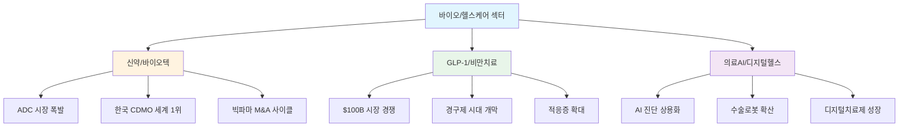
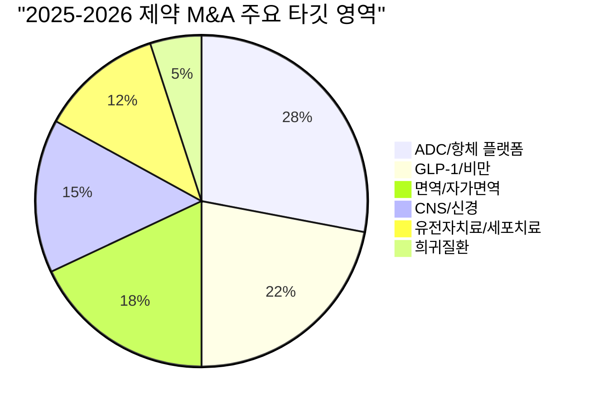
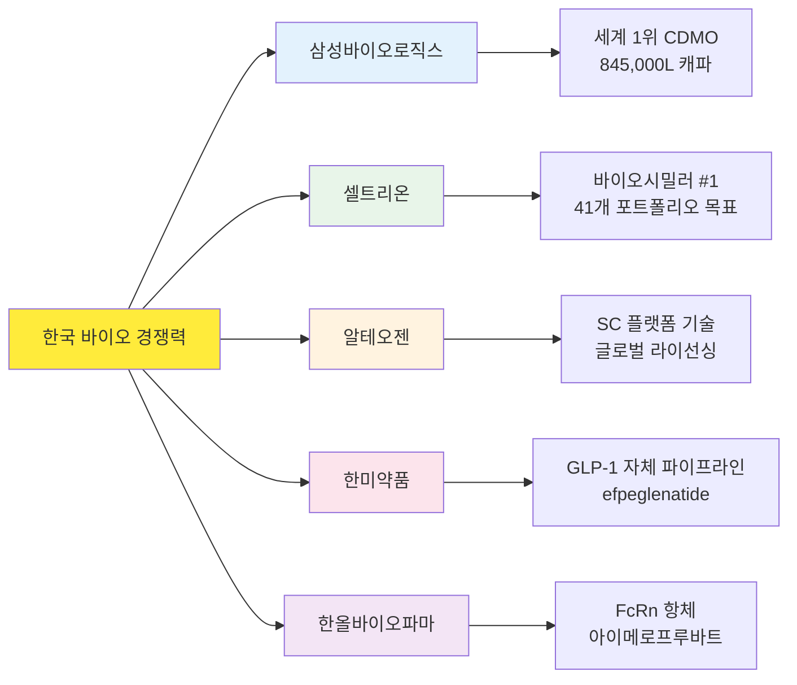
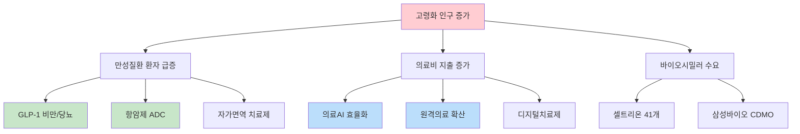
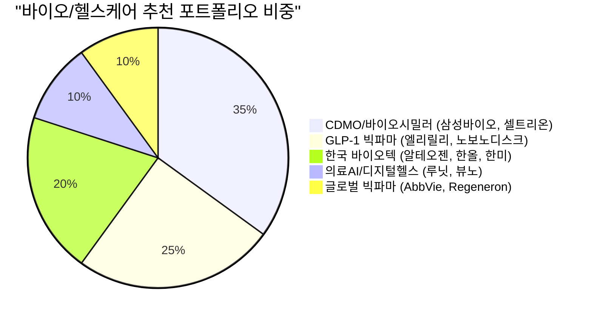

> **관련 글**: [2026년 투자 섹터 전망 (전체)](/knowledge/invest/2026/01/20/investment-sectors-outlook-2026.html)

2026년 바이오/헬스케어 섹터는 **ADC(항체-약물 접합체)**, **GLP-1 비만치료제**, **의료AI** 세 가지 메가트렌드가 동시에 폭발하며 역대급 투자 기회를 제공하고 있습니다. 글로벌 제약사 M&A는 Goldman Sachs가 "사상 최대"를 전망할 만큼 과열 중이고, 한국 바이오 기업들은 CDMO·피하주사 플랫폼·바이오시밀러에서 글로벌 시장을 선도하고 있습니다.

## 바이오/헬스케어 섹터 현황 (2026년 3월 7일 기준)

### 핵심 지표

| 항목 | 수치/현황 | 비고 |
|------|----------|------|
| **글로벌 ADC 시장** | **$13.5B (2025) → $32.7B (2035)** | CAGR 9.2%, 임상 431건 진행 중 |
| **GLP-1 시장** | **$50B+ (2025) → $100B+ (2030)** | 비만·당뇨·NASH·심혈관 적응증 확대 |
| **의료AI 시장** | **FDA AI/ML 의료기기 1,000건+** | 방사선학 중심, 2026년 규제 완화 |
| **글로벌 제약 M&A (2025)** | **$70B+** | 2026년 사상 최대 전망 (Goldman Sachs) |
| **삼성바이오로직스 매출** | **4.5조원 (2025)** | 전년 대비 30% 성장, 세계 #1 CDMO |
| **셀트리온 매출** | **4조원 (2025)** | 영업이익 1조원 돌파, 2026년 목표 5.3조원 |
| **디지털헬스 시장** | **$85.5B (2025) → $180B (2031)** | 원격의료·디지털치료제·웨어러블 |
| **빅테크 헬스케어 AI 투자** | **$660-690B AI CAPEX 중 헬스케어 비중 확대** | 엘리릴리-NVIDIA 슈퍼컴 파트너십 |

### 3월 7일 핵심 업데이트

| 항목 | 내용 |
|------|------|
| **Wegovy 경구제 FDA 승인** | 노보노디스크, 최초 경구 GLP-1 비만치료제 승인. 월 $149 공급 시작 |
| **CagriSema FDA 심사 중** | 노보노디스크 차세대 복합제, 2026년 내 FDA 승인 결정 예상 |
| **Eli Lilly 매출 가이던스** | 2026년 $80-83B 전망 (애널리스트 기대 $77.6B 상회) |
| **다이이찌산쿄 ADC 5개 출시** | 2026년 ADC 5개 신제품 출시 예정, Enhertu $3.75B 매출 (2024) |
| **삼성바이오로직스 미국 진출** | GSK 록빌 시설 $280M 인수, 글로벌 캐파 845,000L |
| **루닛 매출 831억원** | 전년 대비 53% 성장, 해외 매출 비중 92% |
| **한올바이오파마 임상 결과** | 2026년 5개 임상 결과 발표 예정, 아이메로프루바트 6개 적응증 |

## 3대 하위 섹터 비교 분석

### 하위 섹터별 투자 매력도

| 구분 | 신약/바이오텍 | GLP-1/비만치료 | 의료AI/디지털헬스 |
|------|-------------|--------------|-----------------|
| **시장 규모 (2026)** | ADC $13.5B+ | $50B+ | $10.4B (DTx) + $124B (원격의료) |
| **성장률 (CAGR)** | 9-12% | 20-25% | 18-25% |
| **수익 가시성** | 중 (파이프라인 의존) | 상 (매출 폭발 중) | 중-하 (흑자전환 진행 중) |
| **투자 리스크** | 중-고 (임상 실패) | 중 (경쟁·가격 압력) | 중 (규제·보험 수가) |
| **한국 기업 경쟁력** | **상** (CDMO·바이오시밀러) | **중** (한미약품 파이프라인) | **중-상** (루닛·뷰노 글로벌) |
| **대표 종목** | 삼성바이오로직스, 셀트리온, 알테오젠 | 노보노디스크, 엘리릴리, 한미약품 | 루닛, 뷰노, Intuitive Surgical |
| **투자 타이밍** | ★★★★ 지금 | ★★★★★ 적극 매수 | ★★★ 선별 매수 |

## 글로벌 제약 M&A 사이클

2025년 글로벌 제약 M&A는 **$70B 이상**을 기록했으며, Goldman Sachs는 2026년을 **"사상 최대 M&A 해"**로 전망하고 있습니다.

### 2025년 주요 M&A

| 인수기업 | 피인수기업 | 금액 | 영역 |
|---------|----------|------|------|
| Abbott | Exact Sciences | $21B | 종양학 진단 |
| J&J | Intra-Cellular Therapies | $14.6B | CNS (정신건강) |
| Novartis | Avidity | $12B | AOC 플랫폼 |
| Merck | Verona Pharma | $10B | COPD |
| Sanofi | Blueprint Medicines | $9.1B | 희귀 면역질환 |
| Pfizer | Metsera | $4.9B | GLP-1/비만 |
| AbbVie | Capstan Therapeutics | $2.1B | CAR-T 자가면역 |

### M&A 타깃 키워드

**투자 시사점**: 빅파마의 **특허 절벽(Patent Cliff)**이 M&A를 가속화하고 있습니다. AbbVie의 Humira(2023년 특허 만료), Merck의 Keytruda(2028년 만료), J&J의 Stelara(2025년 만료) 등으로 인해 파이프라인 보강이 절박하며, 이는 바이오텍 기업들의 **프리미엄 인수**로 이어지고 있습니다.

## 한국 바이오 글로벌 리더십

한국 바이오 산업은 **CDMO**, **바이오시밀러**, **피하주사(SC) 플랫폼**에서 글로벌 시장을 선도하고 있습니다.

### 주요 한국 바이오 기업 실적

| 기업 | 2025년 매출 | 성장률 | 2026년 전망 | 핵심 성장 동력 |
|------|-----------|--------|-----------|-------------|
| **삼성바이오로직스** | 4.5조원 | +30% | 5.2-5.4조원 (+15-20%) | Plant 5 가동, 미국 록빌 시설 |
| **셀트리온** | 4.0조원 | +25% | 5.3조원 (+33%) | 짐펜트라 PBM 등재, 옴니클로 미국 출시 |
| **알테오젠** | - | - | 주가 361,000원 | ALT-B4 글로벌 라이선싱, NexMab ADC |
| **한미약품** | - | - | 비만치료제 하반기 승인 | efpeglenatide, 멕시코 수출 계약 |
| **한올바이오파마** | 1,552억원 | - | 8개 신제품 출시 | 아이메로프루바트 6개 적응증 임상 |

## 고령화와 바이오/헬스케어 구조적 수요

### 글로벌 고령화 핵심 수치

| 지표 | 수치 | 투자 영향 |
|------|------|----------|
| 65세 이상 인구 (2030) | 약 10억명 | 만성질환 치료제 수요 폭발 |
| 글로벌 의료비 지출 (2026) | $10T+ | 원가 절감형 바이오시밀러·AI 수혜 |
| 비만 인구 (글로벌) | 10억명+ | GLP-1 시장 TAM $100B+ (2030) |
| 암 환자 (연간 신규) | 약 2,000만명 | ADC·CAR-T·면역항암제 수요 |

## 하위 섹터별 상세 분석 (링크)

각 하위 섹터에 대한 심층 분석은 아래 포스트를 참조하세요:

1. **[신약/바이오텍: ADC·CDMO·한국 바이오 글로벌 진출](/knowledge/invest/2026/03/07/biotech-pharma-outlook-2026.html)** - ADC 시장, 삼성바이오로직스 CDMO, 알테오젠 SC 플랫폼, 셀트리온 바이오시밀러, 빅파마 M&A 분석
2. **[GLP-1/비만치료제: $100B 시장의 주도권 경쟁](/knowledge/invest/2026/03/07/glp1-obesity-treatment-outlook-2026.html)** - 노보노디스크 vs 엘리릴리, 경구제 시대, 한미약품, 적응증 확대 분석
3. **[의료AI/디지털헬스: AI 진단·원격의료·디지털치료제](/knowledge/invest/2026/03/07/medical-ai-digital-health-outlook-2026.html)** - 루닛·뷰노, 수술로봇, 디지털치료제, AI 신약 발견 분석

## 투자 전략 종합

### 시나리오별 투자 전략

| 시나리오 | 확률 | 전략 |
|---------|------|------|
| **강세 (Bull)**: GLP-1 적응증 확대 + M&A 붐 + AI 규제 완화 | 40% | 엘리릴리·노보노디스크 비중 확대, 한국 CDMO·바이오시밀러 적극 매수 |
| **중립 (Base)**: GLP-1 경쟁 심화 + 가격 압력 + 바이오텍 선별적 M&A | 45% | 삼성바이오로직스·셀트리온 core, GLP-1 양사 분산, 의료AI 선별 |
| **약세 (Bear)**: 금리 인상 + 약가 규제 + 임상 실패 집중 | 15% | 현금 흐름 강한 삼성바이오·셀트리온 방어적 보유, 신약주 축소 |

### 포트폴리오 비중 제안

### 핵심 모니터링 이벤트 (2026 Q1-Q2)

| 시기 | 이벤트 | 영향 |
|------|--------|------|
| 2026년 Q1 | Wegovy 경구제 미국 출시 | 노보노디스크 매출 회복 여부 |
| 2026년 상반기 | CagriSema FDA 승인 여부 | 노보노디스크 차세대 성장 동력 |
| 2026년 상반기 | 알테오젠 ALT-B4 IP 리뷰 완료 (6월) | 글로벌 라이선스 딜 촉매 |
| 2026년 상반기 | 한올바이오 바토클리맙 TED P3 결과 | 주가 리레이팅 촉매 |
| 2026년 하반기 | 한미약품 efpeglenatide 비만 승인 | 한국 GLP-1 시장 진입 |
| 2026년 하반기 | 셀트리온 ADC 파이프라인 P1 결과 | 신약 사업 모멘텀 |
| 2026년 연중 | Eli Lilly orforglipron FDA 승인 신청 | 경구 GLP-1 경쟁 본격화 |
| 2026년 연중 | 다이이찌산쿄 ADC 5개 출시 | ADC 시장 확대 |

## 리스크 요인

| 리스크 | 영향도 | 모니터링 포인트 |
|--------|--------|---------------|
| **약가 규제 강화** | 상 | 미국 IRA 약가 협상 확대, 유럽 약가 정책 |
| **GLP-1 안전성 이슈** | 상 | 장기 부작용 데이터, FDA 경고 |
| **임상 실패** | 중-상 | CagriSema, 한올 바토클리맙, 한미 efpeglenatide |
| **금리·환율 변동** | 중 | 바이오텍 밸류에이션 민감도, 원화 약세 시 수출 유리 |
| **공급망 리스크** | 중 | GLP-1 공급 부족, CDMO 캐파 경쟁 |
| **규제 변화** | 중 | FDA AI 의료기기 규제 변경, 디지털치료제 보험 적용 |

---

> **면책 조항**: 본 글은 투자 정보 제공 목적이며, 특정 종목의 매수/매도를 권유하는 것이 아닙니다. 투자 결정은 본인의 판단과 책임하에 이루어져야 합니다.

---

*최종 업데이트: 2026년 3월 7일*
