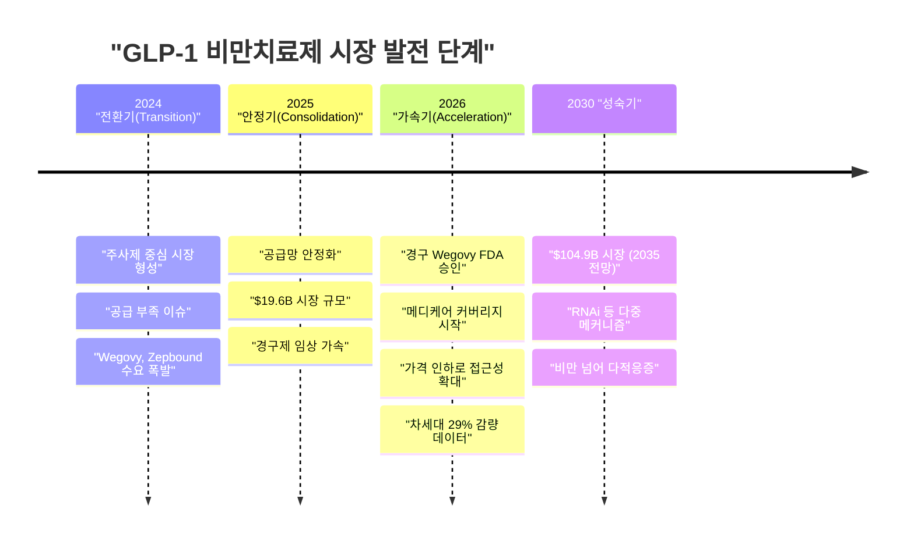
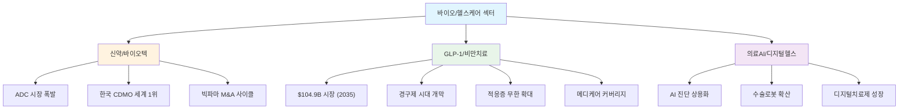
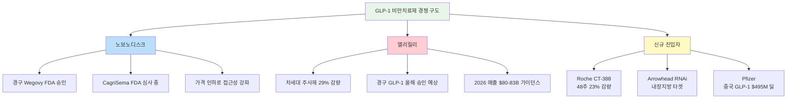
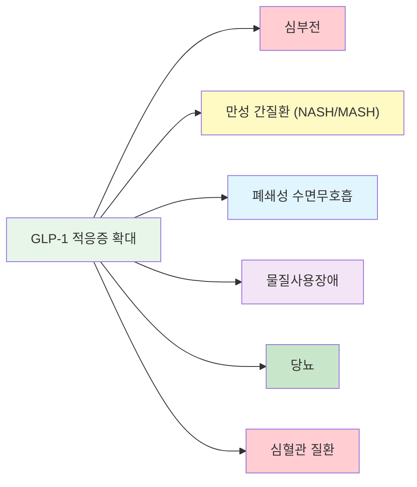
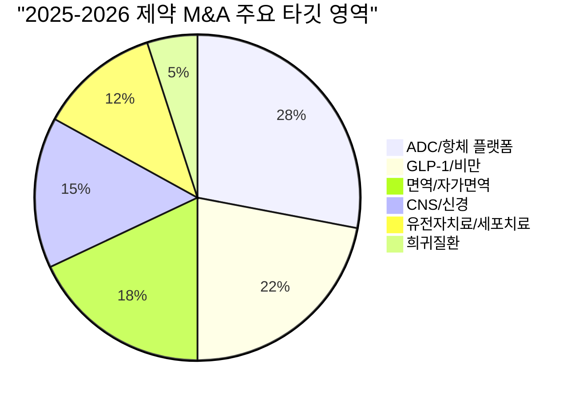
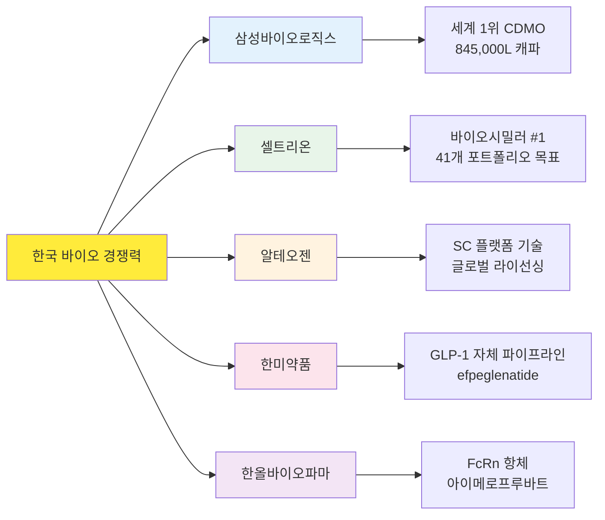
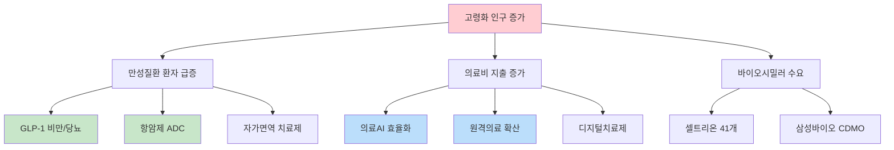
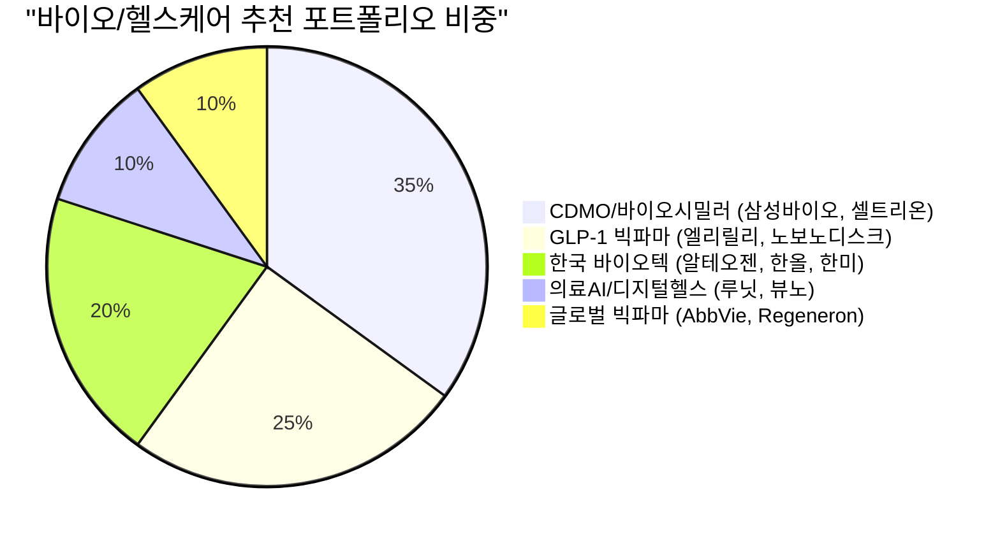

> **관련 글**: [2026년 투자 섹터 전망 (전체)](/knowledge/invest/2026/01/20/investment-sectors-outlook-2026.html)

2026년 바이오/헬스케어 섹터는 **GLP-1 비만치료제 시장 가속화**, **ADC(항체-약물 접합체)**, **의료AI** 세 가지 메가트렌드가 동시에 폭발하며 역대급 투자 기회를 제공하고 있습니다. 특히 GLP-1 시장은 2024년(전환기) → 2025년(안정기)을 거쳐 **2026년 "가속화의 해"**에 진입했으며, 경구제 FDA 승인과 메디케어 커버리지 확대로 접근성이 비약적으로 개선되고 있습니다. 한국 바이오 기업들은 CDMO·피하주사 플랫폼·바이오시밀러에서 글로벌 시장을 선도하고 있으며, 김작가TV에서 분석한 바와 같이 바이오는 반도체·엔터와 함께 **한국의 3대 핵심 투자 섹터**로 주목받고 있습니다.

## 바이오/헬스케어 섹터 현황 (2026년 3월 8일 기준)

### 핵심 지표

| 항목 | 수치/현황 | 비고 |
|------|----------|------|
| **글로벌 항비만 약물 시장** | **$19.6B (2025) → $104.9B (2035)** | CAGR 18.3% |
| **글로벌 ADC 시장** | **$13.5B (2025) → $32.7B (2035)** | CAGR 9.2%, 임상 431건 진행 중 |
| **의료AI 시장** | **FDA AI/ML 의료기기 1,000건+** | 방사선학 중심, 2026년 규제 완화 |
| **글로벌 제약 M&A (2025)** | **$70B+** | 2026년 사상 최대 전망 (Goldman Sachs) |
| **삼성바이오로직스 매출** | **4.5조원 (2025)** | 전년 대비 30% 성장, 세계 #1 CDMO |
| **셀트리온 매출** | **4조원 (2025)** | 영업이익 1조원 돌파, 2026년 목표 5.3조원 |
| **디지털헬스 시장** | **$85.5B (2025) → $180B (2031)** | 원격의료·디지털치료제·웨어러블 |
| **빅테크 헬스케어 AI 투자** | **$660-690B AI CAPEX 중 헬스케어 비중 확대** | 엘리릴리-NVIDIA 슈퍼컴 파트너십 |

### 3월 8일 핵심 업데이트

| 항목 | 내용 |
|------|------|
| **경구 Wegovy FDA 승인** | 노보노디스크, 최초 경구 GLP-1 비만치료제 승인. 2026년 광범위 공급 시작 |
| **Eli Lilly 차세대 주사제** | 실험 주사제 16개월간 체중 **~29% 감량** (GLP-1 역대 최고), 단 약물군 탈락률 18.2% vs 위약 4% |
| **메디케어 비만약 커버리지** | 트럼프 행정부 딜: 메디케어 비만치료제 커버리지 올해 시행 (역사상 최초) |
| **Roche CT-388** | Phase 2에서 48주간 체중 **23% 감량** - 새로운 경쟁자 부상 |
| **Arrowhead RNAi 치료제** | ARO-INHBE, ARO-ALK7: 내장지방·총지방·간지방 감소 (새로운 메커니즘) |
| **Pfizer 중국 GLP-1 진출** | Sciwind 승인 GLP-1 중국 마케팅 $495M 딜 |
| **GLP-1 적응증 확대** | 심부전, 만성 간질환, 폐쇄성 수면무호흡, 물질사용장애 탐색 중 |
| **가격 인하 경쟁** | 노보·릴리 모두 현금 가격 대폭 인하 |

## GLP-1 시장 진화 타임라인

## 3대 하위 섹터 비교 분석

### 하위 섹터별 투자 매력도

| 구분 | 신약/바이오텍 | GLP-1/비만치료 | 의료AI/디지털헬스 |
|------|-------------|--------------|-----------------|
| **시장 규모 (2025)** | ADC $13.5B+ | $19.6B | $10.4B (DTx) + $124B (원격의료) |
| **시장 규모 (2035)** | ADC $32.7B | **$104.9B** | 고성장 |
| **성장률 (CAGR)** | 9-12% | **18.3%** | 18-25% |
| **수익 가시성** | 중 (파이프라인 의존) | **상** (매출 폭발 + 메디케어) | 중-하 (흑자전환 진행 중) |
| **투자 리스크** | 중-고 (임상 실패) | 중 (경쟁·부작용·가격 압력) | 중 (규제·보험 수가) |
| **한국 기업 경쟁력** | **상** (CDMO·바이오시밀러) | **중** (한미약품 파이프라인) | **중-상** (루닛·뷰노 글로벌) |
| **대표 종목** | 삼성바이오로직스, 셀트리온, 알테오젠 | 노보노디스크, 엘리릴리, 한미약품 | 루닛, 뷰노, Intuitive Surgical |
| **투자 타이밍** | ★★★★ 지금 | ★★★★★ 적극 매수 | ★★★ 선별 매수 |

## GLP-1 비만치료제: 2026년 가속화의 해

### 경쟁 구도 심화

GLP-1 시장은 노보노디스크와 엘리릴리의 양강 구도에서 **다자 경쟁 체제**로 전환되고 있습니다.

### 주요 GLP-1 파이프라인 비교

| 기업 | 제품/후보물질 | 체중 감량 | 투여 형태 | 상태 | 차별점 |
|------|------------|----------|----------|------|--------|
| **노보노디스크** | 경구 Wegovy | - | **경구(알약)** | **FDA 승인** | 최초 경구 GLP-1 비만약 |
| **노보노디스크** | CagriSema | ~25% | 주사 | FDA 심사 중 | GLP-1 + 아밀린 복합 |
| **엘리릴리** | 차세대 주사제 | **~29%** | 주사 | 임상 | 역대 최고 감량률, 탈락률 18.2% 주의 |
| **엘리릴리** | 경구 GLP-1 | - | 경구 | 올해 승인 예상 | 노보에 이은 2번째 경구제 |
| **Roche** | CT-388 | **23%** | 주사 | Phase 2 | 새로운 빅파마 진입 |
| **Arrowhead** | ARO-INHBE / ARO-ALK7 | - | 주사 (RNAi) | 임상 | 내장지방·간지방 타겟, 새 메커니즘 |
| **한미약품** | efpeglenatide | - | 주사 | 승인 예상 | 한국 자체 GLP-1 |

### 접근성 혁명: 가격 인하와 메디케어

2026년 GLP-1 시장의 가장 큰 변화는 **접근성 확대**입니다:

- **가격 인하**: 노보노디스크·엘리릴리 모두 현금 가격 대폭 인하
- **경구제 등장**: 주사 거부감 해소 → TAM(총 시장 규모) 확대
- **메디케어 커버리지**: 트럼프 행정부, 역사상 최초로 메디케어에서 비만치료제 커버리지 시행 예정

이 세 가지가 동시에 진행되며 GLP-1 시장의 **수요 폭발 → 공급 정상화 → 접근성 확대 → 추가 수요 창출**의 선순환이 기대됩니다.

### 체중 감량을 넘어선 GLP-1

GLP-1의 투자 가치를 한 차원 높이는 것은 **비만 이외의 적응증 확대**입니다:

각 적응증이 승인될 때마다 TAM이 수십억 달러씩 확대되며, 이는 **$104.9B (2035)** 전망의 핵심 근거입니다.

## 글로벌 제약 M&A 사이클

2025년 글로벌 제약 M&A는 **$70B 이상**을 기록했으며, Goldman Sachs는 2026년을 **"사상 최대 M&A 해"**로 전망하고 있습니다.

### 2025년 주요 M&A

| 인수기업 | 피인수기업 | 금액 | 영역 |
|---------|----------|------|------|
| Abbott | Exact Sciences | $21B | 종양학 진단 |
| J&J | Intra-Cellular Therapies | $14.6B | CNS (정신건강) |
| Novartis | Avidity | $12B | AOC 플랫폼 |
| Merck | Verona Pharma | $10B | COPD |
| Sanofi | Blueprint Medicines | $9.1B | 희귀 면역질환 |
| Pfizer | Metsera | $4.9B | GLP-1/비만 |
| Pfizer | Sciwind (마케팅 딜) | $495M | GLP-1 중국 시장 |
| AbbVie | Capstan Therapeutics | $2.1B | CAR-T 자가면역 |

### M&A 타깃 키워드

**투자 시사점**: 빅파마의 **특허 절벽(Patent Cliff)**이 M&A를 가속화하고 있습니다. AbbVie의 Humira(2023년 특허 만료), Merck의 Keytruda(2028년 만료), J&J의 Stelara(2025년 만료) 등으로 인해 파이프라인 보강이 절박하며, 이는 바이오텍 기업들의 **프리미엄 인수**로 이어지고 있습니다.

## 한국 바이오: 글로벌 3대 핵심 섹터

김작가TV 분석에 따르면, 바이오는 **반도체·엔터테인먼트와 함께 한국의 3대 핵심 투자 섹터**입니다. 한국의 경쟁 우위는 **빠른 R&D 속도**, **경쟁적 추진력**, 그리고 **"차세대 산업"에 적합한 한국 근로자 특성**에 있습니다.

### 한국 바이오의 글로벌 경쟁 우위

| 경쟁 우위 | 설명 |
|----------|------|
| **빠른 R&D** | 글로벌 평균 대비 신속한 연구개발 사이클 |
| **경쟁적 추진력** | 한국 산업의 강점인 빠른 실행력과 집중 투자 |
| **CDMO 글로벌 1위** | 삼성바이오로직스, 세계 최대 바이오의약품 위탁생산 |
| **차세대 산업 적합성** | 한국 근로자 특성에 맞는 고부가가치 산업 |

### 주요 한국 바이오 기업 실적

| 기업 | 2025년 매출 | 성장률 | 2026년 전망 | 핵심 성장 동력 |
|------|-----------|--------|-----------|-------------|
| **삼성바이오로직스** | 4.5조원 | +30% | 5.2-5.4조원 (+15-20%) | Plant 5 가동, 미국 록빌 시설 |
| **셀트리온** | 4.0조원 | +25% | 5.3조원 (+33%) | 짐펜트라 PBM 등재, 옴니클로 미국 출시 |
| **알테오젠** | - | - | 주가 361,000원 | ALT-B4 글로벌 라이선싱, NexMab ADC |
| **한미약품** | - | - | 비만치료제 하반기 승인 | efpeglenatide, 멕시코 수출 계약 |
| **한올바이오파마** | 1,552억원 | - | 8개 신제품 출시 | 아이메로프루바트 6개 적응증 임상 |

## 고령화와 바이오/헬스케어 구조적 수요

### 글로벌 고령화 핵심 수치

| 지표 | 수치 | 투자 영향 |
|------|------|----------|
| 65세 이상 인구 (2030) | 약 10억명 | 만성질환 치료제 수요 폭발 |
| 글로벌 의료비 지출 (2026) | $10T+ | 원가 절감형 바이오시밀러·AI 수혜 |
| 비만 인구 (글로벌) | 10억명+ | 항비만 약물 시장 $19.6B → $104.9B (2035) |
| 암 환자 (연간 신규) | 약 2,000만명 | ADC·CAR-T·면역항암제 수요 |

## 하위 섹터별 상세 분석 (링크)

각 하위 섹터에 대한 심층 분석은 아래 포스트를 참조하세요:

1. **[신약/바이오텍: ADC·CDMO·한국 바이오 글로벌 진출](/knowledge/invest/2026/03/07/biotech-pharma-outlook-2026.html)** - ADC 시장, 삼성바이오로직스 CDMO, 알테오젠 SC 플랫폼, 셀트리온 바이오시밀러, 빅파마 M&A 분석
2. **[GLP-1/비만치료제: $100B 시장의 주도권 경쟁](/knowledge/invest/2026/03/07/glp1-obesity-treatment-outlook-2026.html)** - 노보노디스크 vs 엘리릴리, 경구제 시대, 한미약품, 적응증 확대 분석
3. **[의료AI/디지털헬스: AI 진단·원격의료·디지털치료제](/knowledge/invest/2026/03/07/medical-ai-digital-health-outlook-2026.html)** - 루닛·뷰노, 수술로봇, 디지털치료제, AI 신약 발견 분석

## 투자 전략 종합

### 시나리오별 투자 전략

| 시나리오 | 확률 | 전략 |
|---------|------|------|
| **강세 (Bull)**: GLP-1 메디케어 커버리지 + 적응증 확대 + M&A 붐 + AI 규제 완화 | 40% | 엘리릴리·노보노디스크 비중 확대, 한국 CDMO·바이오시밀러 적극 매수 |
| **중립 (Base)**: GLP-1 경쟁 심화 + 가격 인하 + 바이오텍 선별적 M&A | 45% | 삼성바이오로직스·셀트리온 core, GLP-1 양사 분산, 의료AI 선별 |
| **약세 (Bear)**: 금리 인상 + 약가 규제 + 임상 실패·부작용 이슈 | 15% | 현금 흐름 강한 삼성바이오·셀트리온 방어적 보유, 신약주 축소 |

### 포트폴리오 비중 제안

### 핵심 모니터링 이벤트 (2026 Q1-Q2)

| 시기 | 이벤트 | 영향 |
|------|--------|------|
| 2026년 Q1 | 경구 Wegovy 광범위 공급 시작 | 노보노디스크 매출 회복·경구 시장 개척 |
| 2026년 상반기 | CagriSema FDA 승인 여부 | 노보노디스크 차세대 성장 동력 |
| 2026년 상반기 | 알테오젠 ALT-B4 IP 리뷰 완료 (6월) | 글로벌 라이선스 딜 촉매 |
| 2026년 상반기 | 한올바이오 바토클리맙 TED P3 결과 | 주가 리레이팅 촉매 |
| 2026년 하반기 | 메디케어 비만치료제 커버리지 시행 | GLP-1 수요 폭발 촉매 (역사적 전환점) |
| 2026년 하반기 | 한미약품 efpeglenatide 비만 승인 | 한국 GLP-1 시장 진입 |
| 2026년 하반기 | 셀트리온 ADC 파이프라인 P1 결과 | 신약 사업 모멘텀 |
| 2026년 연중 | Eli Lilly 경구 GLP-1 FDA 승인 | 경구 GLP-1 경쟁 본격화 |
| 2026년 연중 | Eli Lilly 차세대 주사제 (29% 감량) 추가 데이터 | 부작용 프로파일 확인 핵심 |
| 2026년 연중 | Roche CT-388 Phase 3 진입 여부 | 신규 빅파마 경쟁자 확인 |
| 2026년 연중 | 다이이찌산쿄 ADC 5개 출시 | ADC 시장 확대 |

## 리스크 요인

| 리스크 | 영향도 | 모니터링 포인트 |
|--------|--------|---------------|
| **GLP-1 부작용 이슈** | **상** | Eli Lilly 차세대 주사제 탈락률 18.2% (위약 4%), 장기 안전성 데이터 |
| **약가 규제 강화** | 상 | 미국 IRA 약가 협상 확대, 유럽 약가 정책 |
| **GLP-1 경쟁 과열** | 상 | 노보·릴리·Roche·Arrowhead 등 다자 경쟁 → 마진 압박 |
| **임상 실패** | 중-상 | CagriSema, 한올 바토클리맙, 한미 efpeglenatide |
| **금리·환율 변동** | 중 | 바이오텍 밸류에이션 민감도, 원화 약세 시 수출 유리 |
| **공급망 리스크** | 중 | GLP-1 공급 정상화 진행 중, CDMO 캐파 경쟁 |
| **규제 변화** | 중 | FDA AI 의료기기 규제 변경, 디지털치료제 보험 적용 |

---

> **면책 조항**: 본 글은 투자 정보 제공 목적이며, 특정 종목의 매수/매도를 권유하는 것이 아닙니다. 투자 결정은 본인의 판단과 책임하에 이루어져야 합니다.

---

*최종 업데이트: 2026년 3월 8일*
