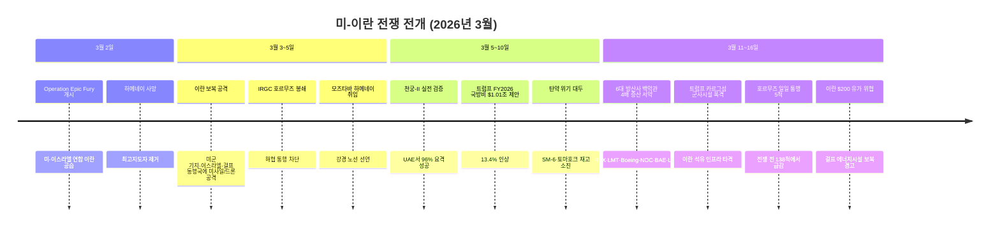
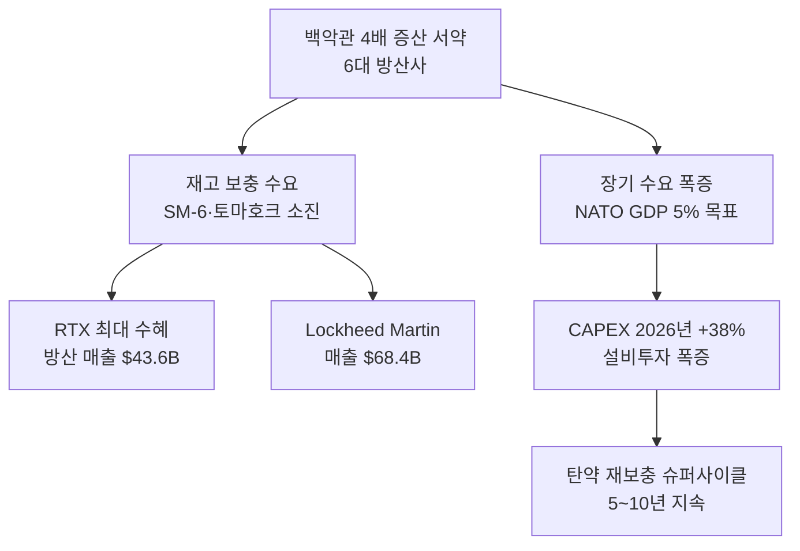
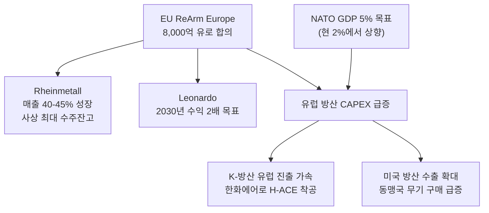
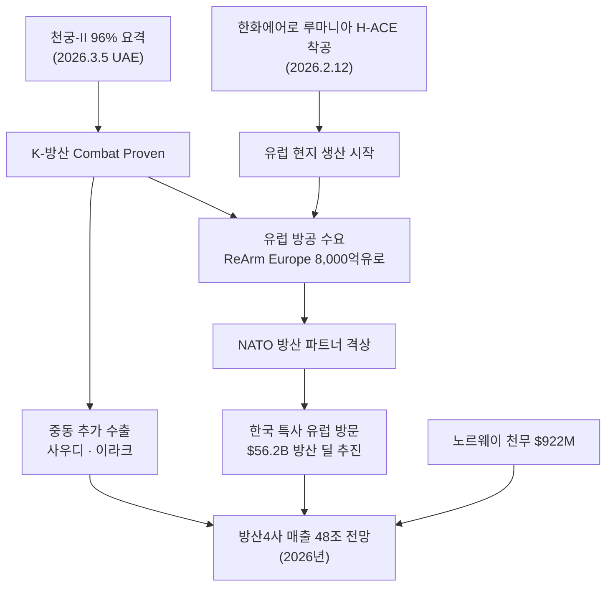
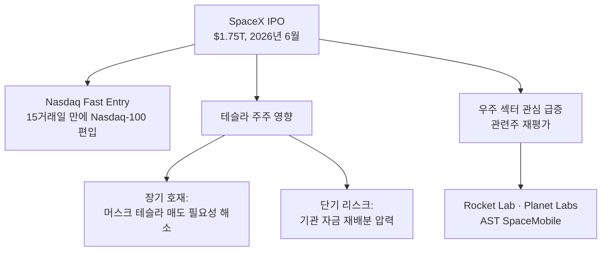
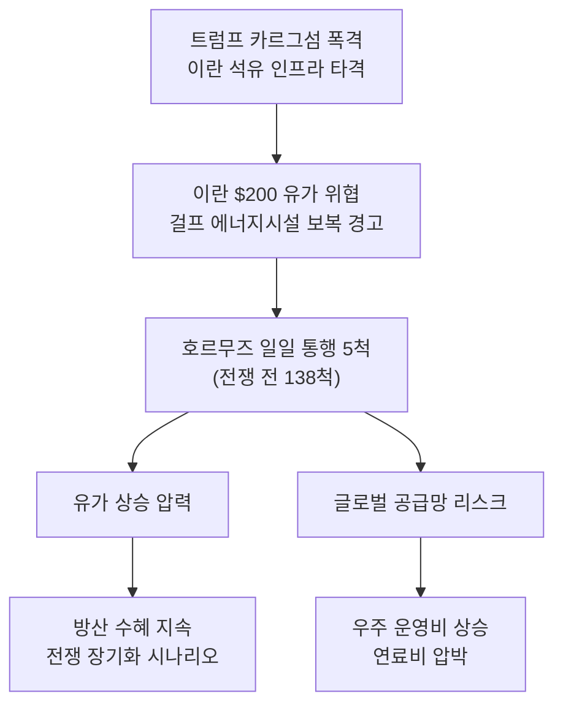
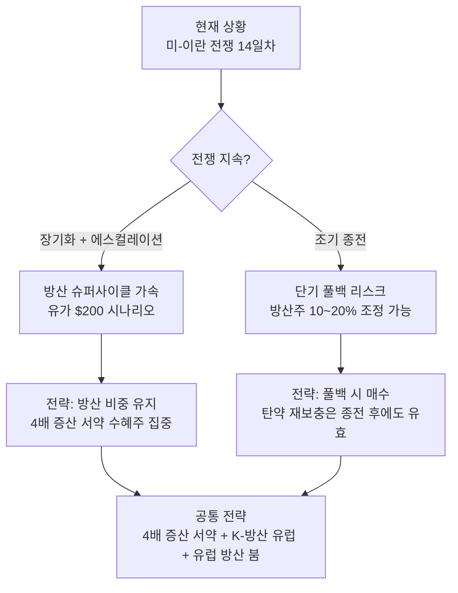

> **하위 섹터 상세 분석**: [드론/UAM 투자 전망](/knowledge/invest/2026/03/07/drone-uam-outlook-2026.html) | [우주/위성 투자 전망](/knowledge/invest/2026/03/07/space-satellite-outlook-2026.html)
>
> **관련 글**: [2026년 투자 섹터 전망 (전체)](/knowledge/invest/2026/01/20/investment-sectors-outlook-2026.html) | [방산 섹터 상세 전망](/knowledge/invest/2026/01/21/defense-sector-outlook-2026.html)

---

## 1. 핵심 상황 — 미-이란 전쟁과 글로벌 재무장

### 1-1. 전쟁 타임라인

### 1-2. 전쟁 핵심 현황 (3/16 업데이트)

| 항목 | 내용 |
|------|------|
| **작전명** | Operation Epic Fury (미-이스라엘 연합) |
| **전쟁 일수** | **14일차** (3/16 기준) |
| **호르무즈 해협** | **일일 통행 5척** (전쟁 전 138척, 96% 감소) |
| **이란 대응** | **$200 유가 위협**, 걸프 에너지시설 보복 경고 |
| **트럼프 최신 조치** | **카르그섬 군사시설 폭격** (이란 석유 인프라 직접 타격) |
| **방산 증산** | **6대 방산사 백악관 4배 증산 서약** (RTX, LMT, Boeing, NOC, BAE, L3Harris) |
| **탄약 위기** | SM-6, 토마호크 재고 소진 — 냉전 이후 최대 규모 재보충 필요 |
| **미국 국방비** | **$1.01조 (FY2026)**, 13.4% 인상 |

---

## 2. 방산 섹터 — 4배 증산 서약과 슈퍼사이클

### 2-1. 6대 방산사 백악관 4배 증산 서약 (3/16 핵심)

미국 6대 방산사(RTX, Lockheed Martin, Boeing, Northrop Grumman, BAE Systems, L3Harris)가 **백악관에서 무기 4배 증산을 서약**했습니다. Operation Epic Fury 이후 재고 보충 + 장기 수요 폭증에 대응하기 위한 역대급 조치입니다.

| 기업 | 방산 매출 규모 | 핵심 무기 체계 |
|------|--------------|---------------|
| **Lockheed Martin** | **$68.4B** (2024) | F-35, THAAD, JASSM, 이지스 |
| **RTX (Raytheon)** | **$43.6B** (방산 부문) | SM-6, 토마호크, 패트리어트 |
| **Boeing** | 방산 부문 | F-15EX, 폭격기, 급유기 |
| **Northrop Grumman** | - | B-21, ICBM, 미사일 방어 |
| **BAE Systems** | - | 전자전, 전투차량, 함정 |
| **L3Harris** | - | 전자전, 통신, ISR |

### 2-2. 시장 반응 (3/16 업데이트)

| 지표 | 수치 | 비고 |
|------|------|------|
| **ITA (미국 방산 ETF) YTD** | **+14%** | S&P500 대비 압도적 아웃퍼폼 |
| **Lockheed Martin** | **+6% 반등** | F-35·THAAD·JASSM, 매출 $68.4B |
| **RTX (Raytheon)** | **+5% YTD** | SM-6·토마호크·패트리어트, 방산 매출 $43.6B |
| **Northrop Grumman** | **+6% 반등** | 핵억제력·미사일 방어 핵심 |
| **한화에어로스페이스** | **+20~25% 급등** | 루마니아 H-ACE 착공, 유럽 수주 파이프라인 |
| **LIG넥스원** | **+30% 급등** | 천궁-II 실전 검증 최대 수혜 |
| **미국 국방비** | **$1.01조 (FY2026)** | 트럼프 제안, 13.4% 인상 |
| **글로벌 방산 CAPEX** | **2026년 +38%** | 업계 전체 설비투자 폭증 |

### 2-3. 유럽 방산 붐 — ReArm Europe 본격화

유럽이 **역대 최대 규모의 재무장**에 돌입했습니다. EU 정상들이 **8,000억 유로 ReArm Europe** 프로그램에 합의하며, 유럽 방산주가 역사적 강세를 보이고 있습니다.

| 항목 | 내용 |
|------|------|
| **EU ReArm Europe** | **8,000억 유로** — EU 정상 합의 |
| **Rheinmetall** | 2026년 매출 **40-45% 성장** 전망, **사상 최대 수주잔고** |
| **Leonardo** | **2030년까지 수익 2배** 목표 선언 |
| **NATO 방위비 목표** | **GDP 5%** (2035년까지, 현 2%에서 대폭 상향) |
| **글로벌 방산 지출** | **$2.63T** (2025년, 전년 $2.48T 대비 증가) |

### 2-4. 탄약 위기 — 핵심 투자 테마

이란 전쟁에서 **SM-6, 토마호크 미사일 재고가 소진**되며, 6대 방산사의 4배 증산 서약과 함께 **냉전 이후 최대 규모의 탄약 재보충**이 시작됩니다.

| 무기 체계 | 제조사 | 상황 | 투자 의미 |
|-----------|--------|------|----------|
| **SM-6** (함대공) | Raytheon (RTX) | 재고 소진 | 다년간 대량 발주 확정적 |
| **토마호크** (순항미사일) | Raytheon (RTX) | 재고 소진 | 4배 증산 서약으로 생산 라인 대폭 확대 |
| **패트리어트 PAC-3** | Raytheon (RTX) | 소모 가속 | 미국+동맹국 동시 수요 |
| **JASSM/LRASM** | Lockheed Martin | 대량 소모 중 | 장거리 정밀타격 수요 급증 |

> **핵심**: 탄약 재보충은 **전쟁 종료 후에도 5~10년간 지속**되는 구조적 수요입니다. 4배 증산 서약은 이를 뒷받침하는 공급 측 확인(supply-side confirmation)입니다.

### 2-5. K-방산 — 천궁-II 실전 검증 + 유럽 현지 생산 본격화

이란 전쟁에서 UAE에 배치된 **천궁-II가 96% 요격률을 기록**하며 K-방산 최초의 Combat Proven을 달성했습니다. **한화에어로스페이스의 루마니아 H-ACE 착공**과 함께 K-방산이 **NATO의 신뢰할 수 있는 방산 파트너**로 격상하고 있습니다.

| 항목 | 내용 |
|------|------|
| **천궁-II 요격률** | **96%** (이란 탄도미사일 대상, 2026.3.5) |
| **한화에어로 루마니아** | **H-ACE** 착공 (2026.2.12), 유럽 최초 현지 생산 |
| **노르웨이 천무** | K239 천무 **$922M** (16기 + 유도 로켓) |
| **K-방산 주가** | 한화에어로 **+20~25%**, LIG넥스원 **+30%** 급등 |
| **한국 특사 유럽 방문** | **$56.2B 규모 방산 딜** 추진 |
| **한국 방위비** | GDP 2.6% ($47.6B), 이재명 정부 **8.2% 인상** |
| **K-방산 수출** | $240억 (2025년, 세계 5위) |

### 2-6. 주요 방산주 투자 포인트

#### 미국 방산주

| 종목 | YTD | 핵심 포인트 | 전쟁 수혜 |
|------|-----|------------|----------|
| **RTX (Raytheon)** | +5% | SM-6·토마호크·패트리어트, 방산 매출 $43.6B, **4배 증산 서약** | ★★★★★ |
| **Lockheed Martin** | +6% 반등 | F-35·THAAD·JASSM, 매출 $68.4B, **4배 증산 서약** | ★★★★★ |
| **Northrop Grumman** | +6% 반등 | B-21·ICBM·미사일방어, **4배 증산 서약** | ★★★★ |
| **AeroVironment (AVAV)** | 상승 | **드론+우주+자율수중차**, BlueHalo 인수로 대형 드론·우주기술·사이버전 확장, 이란전 드론 실전 검증 | ★★★★★ |
| **L3Harris** | 상승 | 전자전·통신·ISR, **4배 증산 서약** | ★★★★ |
| **Boeing** | - | F-15EX·급유기·폭격기, **4배 증산 서약** | ★★★★ |
| **BAE Systems** | 상승 | 전자전·전투차량·함정, **4배 증산 서약** | ★★★★ |
| **Palantir (PLTR)** | 상승 | 방산 AI — 국방 AI 플랫폼 | ★★★★ |

#### 유럽 방산주

| 종목 | 전망 | 핵심 포인트 |
|------|------|------------|
| **Rheinmetall** | **매출 40-45% 성장** | 사상 최대 수주잔고, EU ReArm 최대 수혜 |
| **Leonardo** | **2030년 수익 2배** | 유럽 방산 통합 수혜, 항공·해양·전자 |

#### K-방산주

| 종목 | 주가 | 핵심 포인트 |
|------|------|------------|
| **한화에어로스페이스** | **+20~25% 급등** | 매출 31.8조, 루마니아 H-ACE, 노르웨이 천무 $922M |
| **LIG넥스원** | **+30% 급등** | 천궁-II 실전 검증 수혜, 수출비중 52% |
| **한화시스템** | 상승 | 방산+위성+UAM 4축 성장 |
| **현대로템** | 상승 | K2 전차 유럽 수출, 폴란드 K2PL |
| **한국항공우주(KAI)** | 상승 | KF-21 양산, FA-50 수출 확대 |

---

## 3. 드론 섹터 — AeroVironment의 부상과 실전 검증

### 3-1. AeroVironment — 드론+우주+자율수중차 통합 플랫폼 (3/16 핵심)

AeroVironment가 **BlueHalo 인수**를 통해 단순 전술 드론 기업에서 **대형 드론, 우주기술, 사이버전**까지 아우르는 방산 플랫폼 기업으로 확장했습니다. 이란전에서 드론의 실전 검증이 이 성장을 뒷받침합니다.

| 항목 | 내용 |
|------|------|
| **핵심 사업** | 드론(Switchblade·Puma) + 우주 + 자율수중차(AUV) |
| **BlueHalo 인수** | 대형 드론, 우주기술, 사이버전 역량 확보 |
| **이란전 검증** | Switchblade 등 전술 드론 실전 투입 확인 |
| **투자 의미** | 드론 단일 사업 → **방산 멀티도메인 플랫폼**으로 진화 |

### 3-2. 이란 전쟁의 드론 교훈: Distributed Lethality

이란 전쟁에서 드론은 **전체 공격의 75%**를 차지하며, **분산 살상력(Distributed Lethality)**이 핵심 전쟁 수행 개념으로 확립되었습니다.

| 지표 | 수치 | 의미 |
|------|------|------|
| **드론 투입** | **1,450+ 공습** (미사일 540+ 포함) | 전체 공격의 75%가 드론 |
| **비용 비대칭** | 드론 $20K~$50K vs 요격 미사일 $1M+ | 20~50배 비용 비대칭 |
| **대드론 시장** | **$3.88B** (2026) → **$16.45B** (2034) | CAGR 19.8% |

### 3-3. 드론 주요 투자 대상

| 분류 | 종목 | 핵심 포인트 |
|------|------|------------|
| **멀티도메인** | **AeroVironment (AVAV)** | 드론+우주+AUV, BlueHalo 인수, 이란전 실전 검증 |
| **무인전투기** | Kratos Defense (KTOS) | Valkyrie 무인전투기, 타겟드론 |
| **군사 드론** | 한화시스템 | 해군 드론 수주 1,433억, 대드론 체계 3,000억 |
| **대드론** | DroneShield (DRO.AX) | 카운터-UAS, 미 국방부 마켓플레이스 |
| **eVTOL/UAM** | Joby Aviation (JOBY) | FAA 인증 최종 단계, 두바이 2026 런칭 |
| **eVTOL/UAM** | Archer Aviation (ACHR) | Midnight eVTOL, 미 국방부 계약 |

> **상세 분석**: [드론/UAM 투자 전망](/knowledge/invest/2026/03/07/drone-uam-outlook-2026.html)

---

## 4. 우주/위성 섹터 — SpaceX IPO와 군사 수요 급증

### 4-1. SpaceX IPO — 우주 섹터 최대 이벤트

SpaceX가 **6월 IPO를 추진**하며 예상 시가총액 **$1.75T**으로 미국 6번째 대기업이 됩니다.

| 항목 | 내용 |
|------|------|
| **예상 시총** | **$1.75T** (미국 6번째 대기업) |
| **IPO 시기** | **2026년 6월** 예정 |
| **Nasdaq Fast Entry** | 상장 **15거래일 만에 Nasdaq-100 편입** 가능 |
| **테슬라 영향** | 장기 호재 (머스크 매도 압력 해소) / 단기 리스크 (기관 자금 재배분) |

### 4-2. 전쟁이 바꾼 우주 산업 지형

미-이란 전쟁으로 **군사 위성 수요가 급증**한 반면, 호르무즈 봉쇄(일일 통행 5척)로 **연료비 상승 압박**이 지속되고 있습니다.

| 지표 | 수치 | 의미 |
|------|------|------|
| **미국 우주군 예산** | **$40B** (FY2026, +30%) | 역대 최대 증액 |
| **Starlink 가입자** | **1,000만명** (2026.2) | 군사 통신 활용 확대 |
| **군사위성 수요** | 급증 | 정찰·통신·미사일경보 수요 폭발 |

### 4-3. 우주/위성 주요 투자 대상

| 분류 | 종목 | 핵심 포인트 |
|------|------|------------|
| **발사체** | Rocket Lab (RKLB) | 미 SDA $805M 계약, SpaceX 대안 1위 |
| **위성 영상** | Planet Labs (PL) | 독일 $260M 국방 계약, 수주잔고 +245% |
| **위성 인터넷** | AST SpaceMobile (ASTS) | 위성→스마트폰 직접 통신 |
| **한국 발사체** | 이노스페이스 (462350) | 한빛 하이브리드 발사체 |
| **한국 위성** | 쎄트렉아이 (099320) | 위성 영상 판매 본격화 |

> **상세 분석**: [우주/위성 투자 전망](/knowledge/invest/2026/03/07/space-satellite-outlook-2026.html)

---

## 5. 이란 전쟁 현황과 시장 영향 (3/16 업데이트)

### 5-1. 전쟁 에스컬레이션 — 카르그섬 폭격과 유가 위협

트럼프 대통령이 **카르그섬 군사시설을 폭격**하며 이란의 석유 인프라를 직접 타격했습니다. 이에 이란은 **$200 유가 위협**과 **걸프 에너지시설 보복 경고**로 맞서고 있습니다.

| 항목 | 내용 |
|------|------|
| **호르무즈 해협** | 일일 통행 **5척** (전쟁 전 138척) |
| **카르그섬** | 트럼프, 군사시설 폭격 (이란 석유 인프라 타격) |
| **이란 위협** | **$200 유가** 위협, 걸프 에너지시설 보복 경고 |
| **에너지 리스크** | 호르무즈 봉쇄 심화 → 유가·연료비 상승 지속 |

---

## 6. 투자 전략 — 섹터별 비교와 시나리오

### 6-1. 투자 매력도 비교

| 항목 | 방산 | 드론 | 우주/위성 |
|------|------|------|----------|
| **2026년 모멘텀** | ★★★★★ | ★★★★★ | ★★★★ |
| **전쟁 수혜도** | ★★★★★ | ★★★★★ | ★★★★ |
| **수익 가시성** | ★★★★★ (4배 증산 서약) | ★★★★ (AVAV 실적 가시성) | ★★★ (국방 높음, 상업 변동) |
| **종전 후 리스크** | 높음 (단기 풀백) | 중간 | 낮음 (구조적 수요) |
| **구조적 성장** | ★★★★★ (재보충 5~10년) | ★★★★★ (패러다임 전환) | ★★★★ (뉴스페이스) |

### 6-2. 전쟁 국면별 투자 전략

| 시나리오 | 전략 | 핵심 종목 |
|----------|------|----------|
| **전쟁 장기화** | 방산 비중 확대, 유가 리스크 헤지 | RTX, LMT, Rheinmetall, 한화에어로 |
| **조기 종전** | 풀백 대비, 구조적 테마 집중 | 탄약 재보충 (RTX, LMT), K-방산 유럽 진출 |
| **SpaceX IPO (6월)** | 우주 섹터 편입 타이밍 주시 | RKLB, PL, ASTS |
| **공통** | 4배 증산 서약 수혜 + 유럽 방산 붐 + K-방산 | RTX, AVAV, Rheinmetall, LIG넥스원, 한화에어로 |

---

## 7. 리스크 요인

| 리스크 | 내용 | 확률 | 영향 |
|--------|------|------|------|
| **이란 $200 유가/에너지 보복** | 걸프 에너지시설 공격 시 글로벌 에너지 위기 | 중간 | ★★★★★ |
| **종전 풀백** | 전쟁 종료 시 방산주 전쟁 프리미엄 소멸 | 중간 | ★★★★★ |
| **K-방산 고평가** | 급등 후 밸류에이션 부담 | 높음 | ★★★★ |
| **SpaceX IPO 자금 재배분** | Nasdaq-100 편입 시 기존 대형주에서 자금 이동 | 중간 | ★★★ |
| **호르무즈 봉쇄 장기화** | 유가·연료비 폭등, 우주 운영비 상승 | 높음 | ★★★★ |
| **에스컬레이션** | 이란 핵무기 사용, 제3국 참전 | 낮음 | ★★★★★ |
| **공급망 병목** | 4배 증산 목표 달성까지 수년 소요 | 높음 | ★★★ |

---

## 8. 결론 — 4배 증산 서약이 확인한 슈퍼사이클

**핵심 투자 논거 (3/16 업데이트)**:

1. **4배 증산 서약**: 6대 방산사(RTX $43.6B, LMT $68.4B 등)가 백악관에서 무기 4배 증산 서약 — 탄약 재보충 슈퍼사이클의 **공급 측 확인**
2. **유럽 방산 붐**: Rheinmetall 매출 40-45% 성장, Leonardo 2030년 수익 2배, **EU ReArm 8,000억 유로** 합의
3. **AeroVironment 확장**: BlueHalo 인수로 드론+우주+자율수중차+사이버전 → 방산 멀티도메인 플랫폼으로 진화
4. **이란 전쟁 에스컬레이션**: 호르무즈 일일 통행 5척(96% 감소), 카르그섬 폭격, 이란 $200 유가 위협
5. **K-방산 유럽 진출**: 천궁-II 실전 검증(96% 요격) + 루마니아 H-ACE + 한국 특사 $56.2B 딜
6. **SpaceX IPO**: 예상 시총 $1.75T, 6월 상장, 우주 섹터 전체 재평가 촉발

**최대 리스크**: 이란의 **$200 유가 위협과 걸프 에너지시설 보복 경고**가 에스컬레이션 리스크를 높이고 있으며, 반대로 종전 시 방산주 10~20% 풀백 가능. 단, 4배 증산 서약과 유럽 방산 붐은 **종전과 무관한 구조적 테마**.

> **투자 원칙**: **4배 증산 서약 수혜주**(RTX, LMT)와 **유럽 방산 붐**(Rheinmetall), **K-방산 유럽 진출**(한화에어로, LIG넥스원)은 종전 무관 핵심 보유. **AeroVironment**는 드론 섹터 멀티도메인 확장으로 신규 주목. **SpaceX IPO**(6월)는 우주 섹터 진입 타이밍의 핵심 변수.

---

## 9. 관련 포스트

| 섹터 | 포스트 | 핵심 주제 |
|------|--------|----------|
| **드론/UAM** | [2026년 드론/UAM 투자 전망](/knowledge/invest/2026/03/07/drone-uam-outlook-2026.html) | 이란전쟁 드론 혁명, eVTOL 인증, 대드론 시장 |
| **우주/위성** | [2026년 우주/위성 투자 전망](/knowledge/invest/2026/03/07/space-satellite-outlook-2026.html) | Starlink, 발사체 경쟁, 한국 우주산업 |
| **방산 상세** | [2026년 방산 투자 전망](/knowledge/invest/2026/01/21/defense-sector-outlook-2026.html) | 천궁-II, EU 재무장, K-방산 수출 |
| **전체 섹터** | [2026년 투자 섹터 전망](/knowledge/invest/2026/01/20/investment-sectors-outlook-2026.html) | 반도체, 자동차, 방산, 조선 등 전 섹터 |
