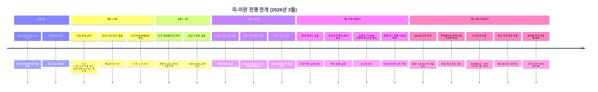
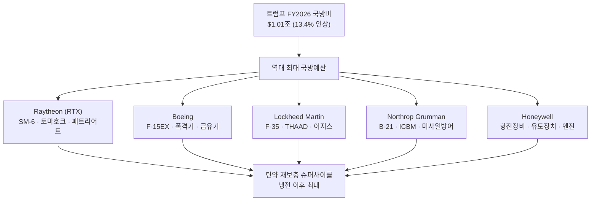
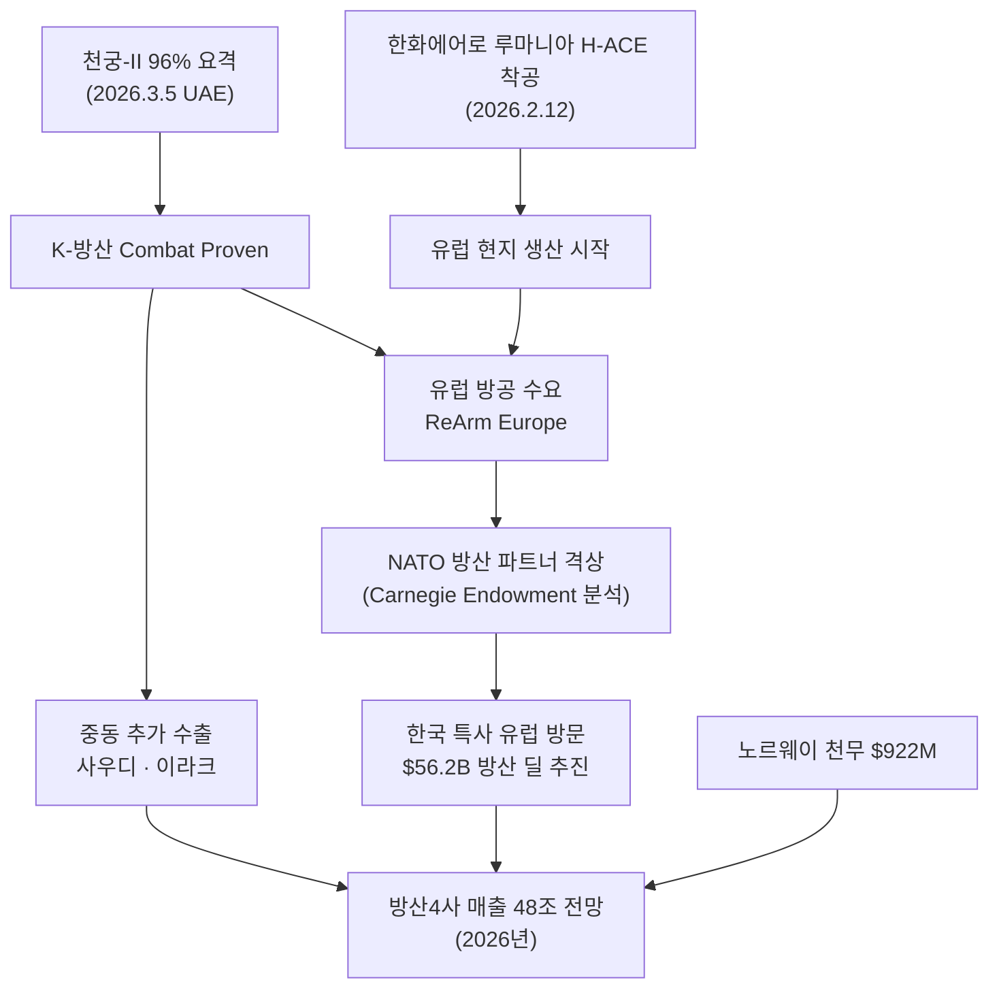
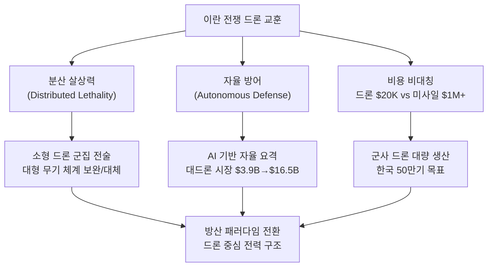
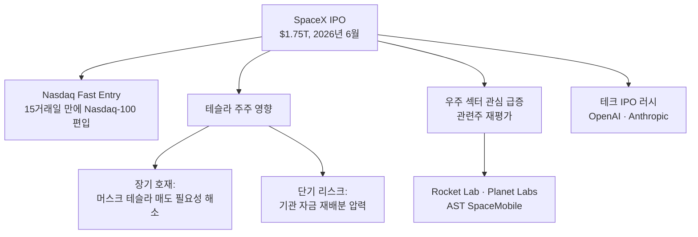
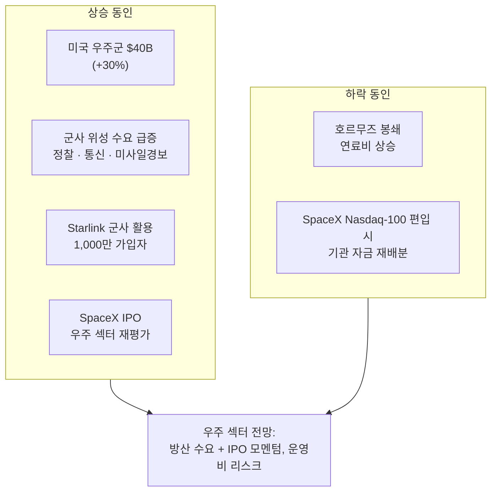
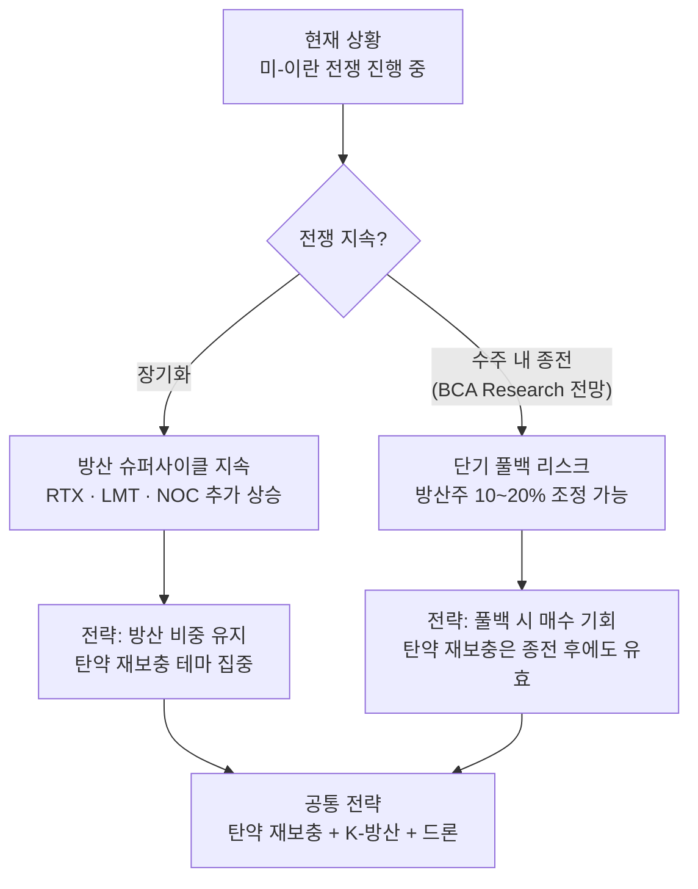
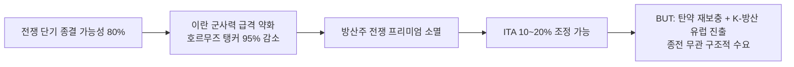

> **하위 섹터 상세 분석**: [드론/UAM 투자 전망](/knowledge/invest/2026/03/07/drone-uam-outlook-2026.html) | [우주/위성 투자 전망](/knowledge/invest/2026/03/07/space-satellite-outlook-2026.html)
>
> **관련 글**: [2026년 투자 섹터 전망 (전체)](/knowledge/invest/2026/01/20/investment-sectors-outlook-2026.html) | [방산 섹터 상세 전망](/knowledge/invest/2026/01/21/defense-sector-outlook-2026.html)

---

## 1. 핵심 상황 — 미-이란 전쟁 (Operation Epic Fury)

2026년 3월 2일, **미국-이스라엘 연합군이 이란을 공습(Operation Epic Fury)**하며 방산 섹터의 판도가 완전히 바뀌었습니다. 이란 최고지도자 하메네이 사망, 후임 모즈타바 하메네이(강경파)의 보복 선언, 호르무즈 해협 봉쇄까지 — **냉전 이후 가장 큰 규모의 군사적 충돌**이 진행 중입니다.

### 1-1. 전쟁 타임라인

### 1-2. 전쟁 핵심 현황 (3/12 업데이트)

| 항목 | 내용 |
|------|------|
| **작전명** | Operation Epic Fury (미-이스라엘 연합) |
| **전쟁 일수** | **10일차** (3/12 기준), 미 역대 최강도 공습 진행 중 |
| **미국 전략** | 레짐 체인지 — 경찰서, 공항, IRGC 시설 정밀 타격 |
| **이란 대응** | 미군 기지·이스라엘·걸프 동맹국에 미사일/드론 보복, 호르무즈 해협 봉쇄 |
| **호르무즈 해협** | **탱커 트래픽 95% 감소**, 기뢰 제거 작전 진행 중 |
| **이란 신지도자** | 모즈타바 하메네이 (강경파, 전임보다 공격적) |
| **트럼프 조치** | FY2026 국방비 **$1.01조 제안 (13.4% 인상)**, 방산 CEO 긴급 소집 |
| **탄약 위기** | SM-6, 토마호크 미사일 재고 소진 — **냉전 이후 최대 규모 재보충** 필요 |
| **종전 가능성** | **단기 종결 가능성 80%** — 이란 군사력 급격 약화 |
| **K-방산 주가** | 한화에어로스페이스 **+20~25%**, LIG넥스원 **+30%** 급등 (이란 전쟁 수혜) |
| **SpaceX IPO** | 예상 시총 **$1.75T**, 6월 상장 예정, Nasdaq Fast Entry 적용 가능 |

---

## 2. 방산 섹터 — 전쟁이 만든 슈퍼사이클

### 2-1. 시장 반응 (3/12 업데이트)

전쟁 발발 이후 방산 섹터는 **역사적 강세**를 보이고 있습니다. 특히 K-방산주가 이란 전쟁 수혜로 급등하고 있습니다.

| 지표 | 수치 | 비고 |
|------|------|------|
| **ITA (미국 방산 ETF) YTD** | **+14%** | S&P500 대비 월등한 아웃퍼폼 |
| **Lockheed Martin** | **+6% 반등** | F-35·THAAD·JASSM, 전쟁 수혜 본격화 |
| **Northrop Grumman** | **+6% 반등** | 핵억제력·미사일 방어 핵심 |
| **RTX (Raytheon) YTD** | **+5%** | SM-6·토마호크·패트리어트 |
| **한화에어로스페이스** | **+20~25% 급등** | 이란 전쟁 수혜, 루마니아 H-ACE 착공 |
| **LIG넥스원** | **+30% 급등** | 천궁-II 실전 검증 수혜 |
| **글로벌 방산 지출** | **$2.63T** (2025년) | 2024년 $2.48T 대비 증가 |
| **한국 방위비** | **GDP 2.6% ($47.6B)** | 이재명 정부 8.2% 인상 |
| **글로벌 방산 CAPEX** | **2026년 +38%** | 업계 전체 설비투자 폭증 |
| **미국 국방비** | **$1.01조 (FY2026)** | 트럼프 제안, 13.4% 인상 |
| **NATO 방위비 목표** | **GDP 5%** | 2035년까지, 현 2% 목표에서 대폭 상향 |
| **EU ReArm Europe** | **8,000억 유로** | 유럽 역대 최대 재무장 프로그램 |

### 2-2. 트럼프 FY2026 국방비 $1.01조 — 핵심 기업

트럼프 대통령이 **FY2026 국방비 $1.01조(13.4% 인상)**를 제안하며, NATO에도 **GDP 5% 방위비 목표**(2035년까지)를 요구했습니다. 방산 CEO 긴급 소집과 함께 **역대 최대 규모의 국방 투자 사이클**이 시작됩니다.

### 2-3. 탄약 위기 — 핵심 투자 테마

이란 전쟁에서 **SM-6, 토마호크 미사일 재고가 소진**되면서, 냉전 이후 최대 규모의 탄약 재보충(munitions replenishment)이 시작됩니다.

| 무기 체계 | 제조사 | 상황 | 투자 의미 |
|-----------|--------|------|----------|
| **SM-6** (함대공) | Raytheon (RTX) | 재고 소진 | 다년간 대량 발주 확정적 |
| **토마호크** (순항미사일) | Raytheon (RTX) | 재고 소진 | 생산 라인 대폭 확대 필요 |
| **패트리어트 PAC-3** | Raytheon (RTX) | 소모 가속 | 미국+동맹국 동시 수요 |
| **JASSM/LRASM** | Lockheed Martin | 대량 소모 중 | 장거리 정밀타격 수요 급증 |

> **핵심**: 탄약 재보충은 **전쟁 종료 후에도 5~10년간 지속**되는 구조적 수요입니다. 전쟁이 끝나도 이 테마는 유효합니다.

### 2-4. K-방산 — 천궁-II 실전 검증 + 유럽 현지 생산 본격화

이란 전쟁에서 UAE에 배치된 **천궁-II가 96% 요격률을 기록**하며 K-방산 최초의 Combat Proven을 달성했습니다. 동시에 **한화에어로스페이스가 루마니아에 유럽 최초 현지 생산 센터 H-ACE를 착공**(2026.2.12)하며, K-방산이 단순 무기 수출국에서 **NATO의 신뢰할 수 있는 방산 파트너**로 격상하고 있습니다.

| 항목 | 내용 |
|------|------|
| **요격 성공률** | **96%** (이란 탄도미사일 대상, 2026.3.5) |
| **UAE 계약** | $3.5B, 10개 포대 발주, 2개 포대 배치 완료 |
| **한화에어로 루마니아** | **H-ACE (Hanwha Armoured Centre of Excellence)** 착공 (2026.2.12), 유럽 최초 현지 생산 |
| **노르웨이 천무 계약** | K239 천무 **$922M** (16기 + 유도 로켓) |
| **K-방산 주가** | 한화에어로 **+20~25%**, LIG넥스원 **+30%** 급등 |
| **한국 특사 유럽 방문** | 2026년 예정, **$56.2B 규모 방산 딜** 추진 |
| **한국 방위비** | GDP 2.6% ($47.6B), 이재명 정부 **8.2% 인상** |
| **글로벌 국방비** | **$2.63T** (2024년 $2.48T → 2025년 $2.63T) |
| **NATO-한국** | 무기 수출국 → **신뢰할 수 있는 방산 파트너**로 전환 추진 (Carnegie Endowment 분석) |
| **K-방산 수출** | $240억 (2025년, 세계 5위) — 천궁-II 검증 + 유럽 현지 생산으로 **가속 전망** |
| **K-방산 수주잔고** | **100조원+** — 중동·유럽 추가 수주 기대 |

### 2-5. 주요 방산주 투자 포인트

#### 미국 방산주

| 종목 | YTD | 핵심 포인트 | 전쟁 수혜 |
|------|-----|------------|----------|
| **RTX (Raytheon)** | +5% | SM-6·토마호크·패트리어트 생산 | ★★★★★ (탄약 재보충 최대 수혜) |
| **Lockheed Martin** | **+6% 반등** | F-35·THAAD·JASSM | ★★★★★ (미사일·전투기) |
| **Northrop Grumman** | **+6% 반등** | B-21·ICBM·미사일방어 | ★★★★ (장기 핵억제력) |
| **AeroVironment (AVAV)** | 상승 | **드론 리더** — Switchblade·Puma, 우크라이나 실전 검증 | ★★★★★ (전술 드론 수요 폭증) |
| **Kratos Defense (KTOS)** | 상승 | **무인기·미사일 방어** — Valkyrie 무인전투기, 타겟드론 | ★★★★ (무인기 패러다임) |
| **Palantir (PLTR)** | 상승 | **방산 AI** — 피터 틸-일본 다카이치 총리 회담, 미일 방산 AI 협업 추진 | ★★★★ (국방 AI 플랫폼) |
| **Boeing** | - | F-15EX·급유기·폭격기 | ★★★★ (전투기·지원기) |
| **L3Harris** | 상승 | 전자전·통신·ISR | ★★★★ (정보전) |
| **General Dynamics** | 상승 | 잠수함·전투차량·IT | ★★★ (해군·육군) |
| **Honeywell** | - | 항전장비·유도장치 | ★★★ (부품 공급) |

#### K-방산주

| 종목 | 주가 | 핵심 포인트 |
|------|------|------------|
| **한화에어로스페이스** | **+20~25% 급등** | 매출 31.8조, OP 4.6조, **루마니아 H-ACE 착공**, 노르웨이 천무 $922M, 유럽 수주 파이프라인 |
| **LIG넥스원** | **+30% 급등** | 천궁-II 미사일 양산 본격화, 수출비중 52% 확대, 이란 전쟁 최대 수혜 |
| **한화시스템** | 상승 | 매출 4.2조, 방산+위성+UAM 4축 성장 |
| **현대로템** | 상승 | K2 전차 유럽 수출, 폴란드 K2PL 기대 |
| **한국항공우주(KAI)** | 상승 | KF-21 양산, FA-50 수출 확대 |

---

## 3. 드론/UAM 섹터 — 분산 살상력과 자율 전투의 시대

### 3-1. 이란 전쟁의 교훈: Distributed Lethality

이란 전쟁에서 드론은 **전체 공격의 75%**를 차지하며 **분산 살상력(Distributed Lethality)**과 **자율 방어(Autonomous Defense)**가 핵심 전쟁 수행 개념으로 부상했습니다.

| 지표 | 수치 | 의미 |
|------|------|------|
| **이란 전쟁 드론 투입** | **1,450+ 공습** (미사일 540+ 포함) | 전체 공격의 75%가 드론 |
| **Shahed 드론 단가** | **$20,000~$50,000** | 요격 미사일($1M+) 대비 20~50배 비용 비대칭 |
| **대드론 시장** | **$3.88B** (2026년) → **$16.45B** (2034년) | CAGR 19.8% |
| **핵심 교훈** | Distributed Lethality | 소형 분산 드론 군집이 대형 무기 체계 대체 |
| **자율 방어** | Autonomous Defense | AI 기반 자율 드론 요격 시스템 부상 |

### 3-2. 드론/UAM 주요 투자 대상

| 분류 | 종목 | 핵심 포인트 |
|------|------|------------|
| **군사 드론** | 한화시스템 | 1,433억 해군 드론 수주, 대드론 통합체계 3,000억 |
| **군사 드론** | 대한항공 에어로 | 중고도 무인기(MUAV) 개발, 군용 드론 수출 |
| **eVTOL/UAM** | Joby Aviation (JOBY) | FAA 인증 최종 단계, 두바이 2026 런칭 |
| **eVTOL/UAM** | Archer Aviation (ACHR) | Midnight eVTOL, 미 국방부 계약 |
| **대드론** | DroneShield (DRO.AX) | 카운터-UAS 전문, 미 국방부 마켓플레이스 — **전쟁으로 수요 폭증** |
| **드론 배달** | Zipline | 자율 배달 리더, 24개국 운영 |

> **상세 분석**: [드론/UAM 투자 전망](/knowledge/invest/2026/03/07/drone-uam-outlook-2026.html)

---

## 4. 우주/위성 섹터 — SpaceX IPO와 군사 수요 급증

### 4-1. SpaceX IPO — 우주 섹터 최대 이벤트 (3/12 신규)

SpaceX가 **6월 IPO를 추진**하며 우주 섹터 최대 이벤트로 부상했습니다. 예상 시가총액 **$1.75T**으로 미국 6번째 대기업이 됩니다.

| 항목 | 내용 |
|------|------|
| **예상 시총** | **$1.75T** (미국 6번째 대기업) |
| **IPO 시기** | **2026년 6월** 예정 |
| **Nasdaq Fast Entry** | 상장 **15거래일 만에 Nasdaq-100 편입** 가능 |
| **경쟁 IPO** | OpenAI, Anthropic도 IPO 준비 중 |
| **테슬라 영향 (장기 호재)** | 머스크의 **테슬라 주식 매도 필요성 해소** — SpaceX 지분으로 유동성 확보 가능 |
| **테슬라 영향 (단기 리스크)** | 기관 자금 재배분 압력 — SpaceX 편입 시 기존 대형주에서 자금 이동 가능 |

> **투자 시사점**: SpaceX IPO는 우주 섹터 전체의 밸류에이션 재평가를 촉발할 수 있습니다. 특히 Rocket Lab, Planet Labs 등 SpaceX 대안/보완 기업들이 수혜를 받을 가능성이 높습니다. 테슬라 주주 입장에서는 머스크의 테슬라 주식 매도 압력이 해소되는 장기 호재이지만, Nasdaq-100 편입 시 기관 자금 재배분은 단기 변동성 요인입니다.

### 4-2. 전쟁이 바꾼 우주 산업 지형

미-이란 전쟁으로 **군사 위성 수요가 급증**한 반면, 연료비 상승(호르무즈 봉쇄)으로 **운영 수익성은 압박**을 받고 있습니다.

| 지표 | 수치 | 의미 |
|------|------|------|
| **미국 우주군 예산** | **$40B** (FY2026, +30%) | 역대 최대 증액 |
| **Starlink 가입자** | **1,000만명** (2026.2) | 군사 통신 활용 확대 |
| **Starship V3 위성** | 발사당 60기, 용량 10x 향상 | 2026년 배치 시작 |
| **군사위성 수요** | 급증 | 이란전쟁 → 정찰·통신·미사일경보 수요 폭발 |

### 4-3. 우주/위성 주요 투자 대상

| 분류 | 종목 | 핵심 포인트 |
|------|------|------------|
| **발사체** | Rocket Lab (RKLB) | 미 SDA $805M 계약, SpaceX 대안 1위 |
| **위성 영상** | Planet Labs (PL) | 독일 $260M 국방 계약, 수주잔고 +245% — **전쟁 정찰 수요** |
| **위성 인터넷** | AST SpaceMobile (ASTS) | 위성→스마트폰 직접 통신 |
| **한국 발사체** | 이노스페이스 (462350) | 한빛 하이브리드 발사체, 국내 유일 상장 발사체 기업 |
| **한국 위성** | 쎄트렉아이 (099320) | 위성 영상 판매 본격화, 2026년 매출 급증 전망 |
| **우주 방산** | 한화에어로스페이스 | 누리호 엔진, 차세대 메탄 발사체 참여 |

> **상세 분석**: [우주/위성 투자 전망](/knowledge/invest/2026/03/07/space-satellite-outlook-2026.html)

---

## 5. 섹터별 비교 — 어디에 투자할 것인가

### 5-1. 투자 매력도 비교 (전쟁 상황 반영)

| 항목 | 방산 | 드론/UAM | 우주/위성 |
|------|------|---------|----------|
| **2026년 모멘텀** | ★★★★★ | ★★★★ | ★★★★ (방산 수요) / ★★★ (운영) |
| **전쟁 수혜도** | ★★★★★ | ★★★★★ | ★★★★ |
| **수익 가시성** | ★★★★★ (탄약 재보충 확정) | ★★★ (군사 높음, UAM 낮음) | ★★★ (국방 높음, 상업 변동) |
| **종전 후 리스크** | 높음 (단기 풀백) | 중간 | 낮음 (구조적 수요) |
| **구조적 성장** | ★★★★★ (재보충 5~10년) | ★★★★ (패러다임 전환) | ★★★★ (뉴스페이스) |
| **밸류에이션** | 높음 (전쟁 프리미엄) | 극히 높음 (대부분 적자) | 높음 (성장 프리미엄) |

### 5-2. 투자 전략 — 전쟁 국면별 시나리오

**전쟁 국면별 전략**:

| 시나리오 | 전략 | 핵심 종목 |
|----------|------|----------|
| **전쟁 장기화** | 방산 비중 확대, 탄약 재보충 테마 집중 | RTX, LMT, NOC, 한화에어로 |
| **단기 종전 (80%)** | 풀백 대비, 종전 후 매수 기회 대기 | 구조적 수요 (탄약 재보충, K-방산 유럽 진출) |
| **SpaceX IPO (6월)** | 우주 섹터 편입 타이밍 주시, 관련주 사전 포지셔닝 | RKLB, PL, ASTS |
| **공통** | 탄약 재보충 + K-방산 유럽 진출은 종전 무관 | RTX, LIG넥스원, 한화에어로 |

---

## 6. 리스크 요인 — 가장 큰 리스크는 '종전'

### 6-1. 단기 종전 가능성 80% — 풀백 리스크 상승

3/12 기준(10일차), 미 역대 최강도 공습과 이란 군사력 급격 약화로 **전쟁 단기 종결 가능성이 80%**로 평가됩니다. BCA Research의 경고와 맞물려 **방산주 풀백 리스크가 높아진 상황**입니다.

### 6-2. 전체 리스크 매트릭스

| 리스크 | 내용 | 확률 | 영향 |
|--------|------|------|------|
| **종전 풀백** | 단기 종결 가능성 80%, 전쟁 종료 시 방산주 급격 조정 | **높음** | ★★★★★ |
| **K-방산 고평가** | 한화에어로 +25%, LIG넥스원 +30% 급등 후 밸류에이션 부담 | 높음 | ★★★★ |
| **SpaceX IPO 자금 재배분** | Nasdaq-100 편입 시 기존 대형주에서 자금 이동 | 중간 | ★★★ |
| **호르무즈 봉쇄 장기화** | 유가·연료비 폭등, 우주 운영비 상승 | 중간 | ★★★★ |
| **에스컬레이션** | 이란 핵무기 사용, 제3국 참전 | 낮음 | ★★★★★ |
| **공급망 병목** | 탄약 생산 확대에 수년 소요 | 높음 | ★★★ |
| **정치/외교 변수** | 트럼프 정책 변화, 동맹국 이탈 | 낮음 | ★★★ |
| **기술 리스크** | eVTOL 인증 지연, 발사 실패 | 중간 | ★★★ |

---

## 7. 결론 — 전쟁이 만든 기회와 그 이후

2026년 3월, 미-이란 전쟁(Operation Epic Fury)은 방산/우주 섹터에 **냉전 이후 가장 강력한 투자 모멘텀**을 만들었습니다.

**핵심 투자 논거 (3/12 업데이트)**:

1. **탄약 재보충 슈퍼사이클**: SM-6·토마호크 재고 소진으로 **냉전 이후 최대 규모의 재보충**이 시작. **전쟁 종료 후에도 5~10년 지속** — RTX가 최대 수혜
2. **SpaceX IPO**: 예상 시총 **$1.75T**, 6월 상장 예정. Nasdaq Fast Entry로 **15거래일 만에 Nasdaq-100 편입** 가능. 테슬라 주주에게 장기 호재(머스크 매도 압력 해소), 우주 섹터 전체 재평가 촉발
3. **K-방산 주가 급등**: 한화에어로스페이스 **+20~25%**, LIG넥스원 **+30%** — 이란 전쟁 수혜 + 유럽 현지 생산 본격화
4. **한화에어로 유럽 진출**: 루마니아 **H-ACE 착공**(2026.2.12), 노르웨이 천무 **$922M** 계약 — K-방산이 NATO 방산 파트너로 격상
5. **글로벌 방산 지출 확대**: 2025년 **$2.63T**, 한국 방위비 GDP 2.6% ($47.6B, 이재명 정부 8.2% 인상), 한국 특사 유럽 방문으로 **$56.2B 딜** 추진
6. **$1.01조 국방예산**: 트럼프 FY2026 국방비 $1.01조 제안 (13.4% 인상), NATO GDP 5% 목표
7. **NATO-한국 방산 파트너십**: 단순 무기 수출국에서 **신뢰할 수 있는 방산 파트너**로 전환 추진 (Carnegie Endowment 분석)
8. **우주 군사화 + IPO 모멘텀**: 우주군 $40B(+30%), SpaceX IPO로 Rocket Lab·Planet Labs 등 관련주 재평가

**최대 리스크**: **전쟁 단기 종결 가능성 80%** — 10일차 역대 최강도 공습으로 이란 군사력 급격 약화. 전쟁 프리미엄 소멸 시 방산주 10~20% 풀백 가능. 단, 탄약 재보충과 K-방산 유럽 진출은 구조적 테마로 종전과 무관하게 유효.

> **투자 원칙**: 현재 포지션은 "전쟁 지속"과 "조기 종전" 양 시나리오에 모두 대비하는 구조로 구성해야 합니다. **탄약 재보충 테마**(RTX, LMT)와 **K-방산 유럽 진출**(한화에어로)은 종전 무관 핵심 보유, **전쟁 프리미엄 종목**은 익절/비중 조절 준비가 필요합니다. **SpaceX IPO**(6월)는 우주 섹터 진입 타이밍 판단의 핵심 변수입니다.

---

## 8. 관련 포스트

| 섹터 | 포스트 | 핵심 주제 |
|------|--------|----------|
| **드론/UAM** | [2026년 드론/UAM 투자 전망](/knowledge/invest/2026/03/07/drone-uam-outlook-2026.html) | 이란전쟁 드론 혁명, eVTOL 인증, 대드론 시장 |
| **우주/위성** | [2026년 우주/위성 투자 전망](/knowledge/invest/2026/03/07/space-satellite-outlook-2026.html) | Starlink, 발사체 경쟁, 한국 우주산업 |
| **방산 상세** | [2026년 방산 투자 전망](/knowledge/invest/2026/01/21/defense-sector-outlook-2026.html) | 천궁-II, EU 재무장, K-방산 수출 |
| **전체 섹터** | [2026년 투자 섹터 전망](/knowledge/invest/2026/01/20/investment-sectors-outlook-2026.html) | 반도체, 자동차, 방산, 조선 등 전 섹터 |
