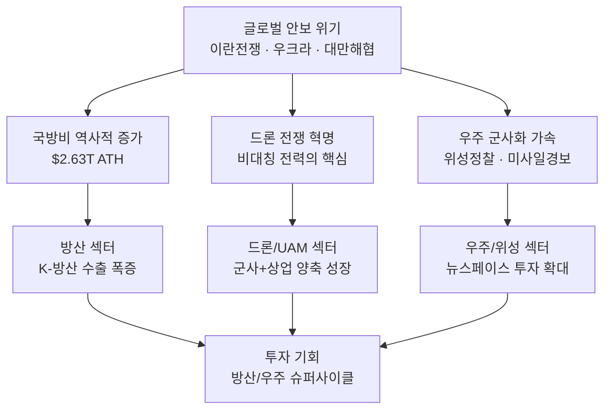
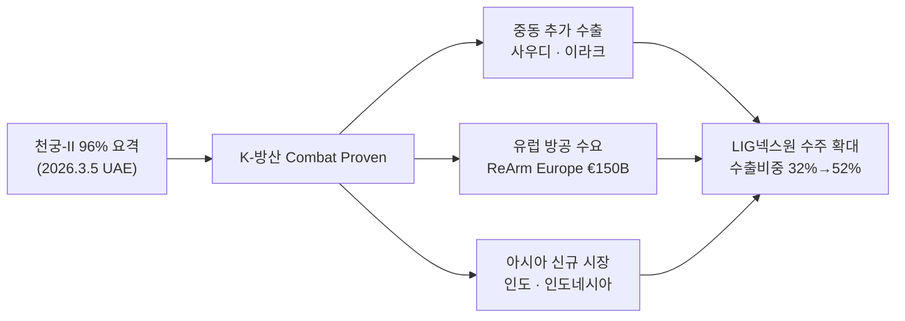
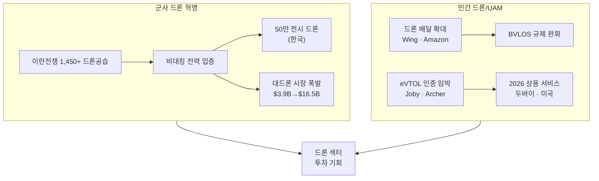
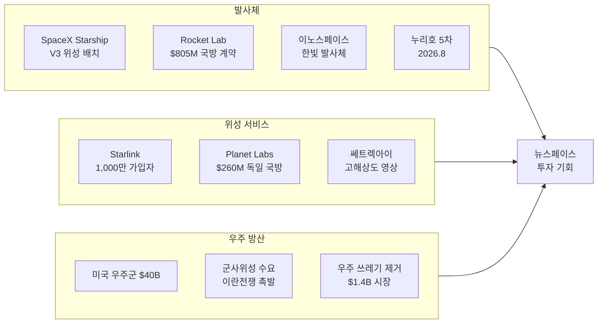
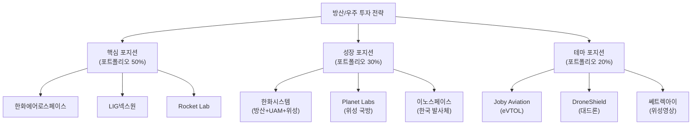

> **하위 섹터 상세 분석**: [드론/UAM 투자 전망](/knowledge/invest/2026/03/07/drone-uam-outlook-2026.html) | [우주/위성 투자 전망](/knowledge/invest/2026/03/07/space-satellite-outlook-2026.html)
>
> **관련 글**: [2026년 투자 섹터 전망 (전체)](/knowledge/invest/2026/01/20/investment-sectors-outlook-2026.html) | [방산 섹터 상세 전망](/knowledge/invest/2026/01/21/defense-sector-outlook-2026.html)

---

## 1. 왜 방산/우주인가 — 2026년 메가트렌드

2026년은 **방산/우주 섹터가 역사적 전환점을 맞이하는 해**입니다. 세 가지 거시적 동인이 동시에 작용하고 있습니다.

| 메가트렌드 | 핵심 내용 | 투자 영향 |
|-----------|----------|----------|
| **글로벌 재무장(ReArm)** | 글로벌 국방비 $2.63T 사상 최대, EU €150B 방산대출, NATO GDP 3.5% 서약 | 방산 기업 수주 잔고 역대급 |
| **이란 전쟁 & 드론 혁명** | 10,000+ 드론 투입, 비대칭 전력의 핵심으로 부상, 대드론 시장 폭발 | 군사 드론/대드론 기업 급성장 |
| **뉴스페이스 혁명** | Starlink 1,000만 가입자, Starship 상용화, 군사위성 수요 급증 | 발사체/위성/우주인터넷 투자 확대 |

---

## 2. 섹터별 핵심 요약

### 2-1. 방산 섹터 — K-방산의 황금기

**한 줄 요약**: 천궁-II 실전 검증(96% 명중률)으로 K-방산 신뢰도가 역사적으로 도약했고, EU 재무장 + 이란 전쟁이 구조적 수요를 만들고 있습니다.

| 지표 | 수치 | 의미 |
|------|------|------|
| **글로벌 국방비** | **$2.63T** (2025년 실적, YoY +6%) | 평시 사상 최대 기록 |
| **유럽 국방비** | **$563B** (YoY +$100B, +12.6% 실질) | 글로벌 비중 21%로 상승 |
| **EU 방산대출 (SAFE)** | **€150B** (2026년 Q1 집행 시작) | 폴란드 €43.7B 최대 수혜 |
| **미국 FY2026 국방예산** | **$1.5T** (우주군 $40B, +30%) | 우주/미사일방어 집중 |
| **한국 국방예산** | **66.3조원** (+7.6%, 방위력개선비 20.2조) | K-방산 내수 기반 강화 |
| **방산4사 매출** | **40.5조원** (2025년, 사상 최초 40조 돌파) | 2026년 48조 전망 |
| **K-방산 수출** | **$240억** (2025년, 세계 5위) | 천궁-II 실전 검증으로 가속 |

#### 천궁-II 실전 검증 — 게임 체인저

2026년 3월 5일, UAE에 배치된 **천궁-II가 이란 탄도미사일을 96% 명중률로 요격**하며 K-방산 최초의 실전 검증(Combat Proven)을 달성했습니다.

| 항목 | 내용 |
|------|------|
| **요격 성공률** | **96%** (서울경제 보도, 이란 탄도미사일 대상) |
| **UAE 계약** | $3.5B (2022년 체결), 10개 포대 발주, 2개 포대 배치 완료 |
| **핵심 수혜** | LIG넥스원(미사일), 한화시스템(사격통제 레이더), 한화에어로(발사대) |
| **의미** | 패트리어트/아이언돔과 동급 신뢰도 확보, **가격 경쟁력까지 겸비** |

#### 주요 방산주 투자 포인트

| 종목 | 현재가 (3/7) | 목표주가 | 핵심 포인트 |
|------|-------------|---------|------------|
| **한화에어로스페이스** | ~1,481,000원 | 1,484,773원 (평균) | 매출 31.8조, OP 4.6조, 유럽 수주 파이프라인 |
| **LIG넥스원** | ~650,000원 | 710,000원 (하나) | 천궁-II 양산 본격화, 수출비중 52% 확대 |
| **한화시스템** | - | - | 매출 4.2조, 방산+위성+UAM 4축 성장 |
| **현대로템** | - | 299,000원 (평균) | K2 전차 유럽 수출, 폴란드 K2PL 기대 |
| **한국항공우주(KAI)** | - | - | KF-21 양산, FA-50 수출 확대 |

> **상세 분석**: [방산 섹터 전망](/knowledge/invest/2026/01/21/defense-sector-outlook-2026.html)에서 기업별 실적, 수주 파이프라인, 밸류에이션 비교를 확인하세요.

---

### 2-2. 드론/UAM 섹터 — 전쟁이 증명한 미래 전력

**한 줄 요약**: 이란 전쟁에서 드론이 핵심 전력으로 입증되었고, 대드론 시장이 폭발적으로 성장하며, 민간 UAM은 2026년 인증 임계점에 도달합니다.

| 지표 | 수치 | 의미 |
|------|------|------|
| **이란 전쟁 드론 투입** | **1,450+ 공습** (미사일 540+ 포함) | 전체 공격의 75%가 드론 |
| **Shahed 드론 단가** | **$20,000~$50,000** | 요격 미사일($1M+) 대비 20~50배 비용 비대칭 |
| **대드론 시장** | **$3.88B** (2026년) → $16.45B (2034년) | CAGR 19.8% |
| **한국 군사 드론** | **50만기** 전시 드론 목표 | 2026년 예산 205억원 |
| **Joby Aviation** | FAA 인증 4/5단계 완료 | 2026년 에어택시 상용 서비스 시작 목표 |
| **상업 드론 배달** | Wing: 주간 수천 건, Amazon: 시카고 확장 | 규제 완화 가속 |

#### 드론/UAM 관련 주요 투자 대상

| 분류 | 종목 | 핵심 포인트 |
|------|------|------------|
| **군사 드론** | 한화시스템 | 1,433억 해군 드론 수주, 대드론 통합체계 3,000억 |
| **군사 드론** | 대한항공 에어로 | 중고도 무인기(MUAV) 개발, 군용 드론 수출 |
| **eVTOL/UAM** | Joby Aviation (JOBY) | FAA 인증 최종 단계, 두바이 2026 런칭 |
| **eVTOL/UAM** | Archer Aviation (ACHR) | Midnight eVTOL, 미 국방부 계약 |
| **대드론** | DroneShield (DRO.AX) | 카운터-UAS 전문, 미 국방부 마켓플레이스 |
| **드론 배달** | Zipline | 자율 배달 리더, 24개국 운영 |

> **상세 분석**: [드론/UAM 투자 전망](/knowledge/invest/2026/03/07/drone-uam-outlook-2026.html)에서 이란 전쟁 드론 혁명, eVTOL 인증 현황, 대드론 시장을 심층 분석합니다.

---

### 2-3. 우주/위성 섹터 — 뉴스페이스 혁명의 티핑포인트

**한 줄 요약**: Starlink 1,000만 가입자 돌파, Starship V3 위성 배치 시작, 군사위성 수요 급증이 뉴스페이스 투자의 티핑포인트를 만들고 있습니다.

| 지표 | 수치 | 의미 |
|------|------|------|
| **Starlink 가입자** | **1,000만명** (2026.2) | 2025년만 460만명 순증 |
| **Starship V3 위성** | 발사당 **60기**, 용량 10x 향상 | 2026년 배치 시작 |
| **미국 우주군 예산** | **$40B** (FY2026, +30%) | 역대 최대 증액 |
| **한국 우주 R&D** | **1조 1,605억원** (2026년) | 우주청 예산 1조 시대 |
| **누리호 5차 발사** | 2026년 8월 예정 | 초소형 군집위성 5기 탑재 |
| **우주 쓰레기 제거 시장** | **$1.4B** (2026년) | CAGR 7.1%, Astroscale 선도 |

#### 우주/위성 관련 주요 투자 대상

| 분류 | 종목 | 핵심 포인트 |
|------|------|------------|
| **발사체** | Rocket Lab (RKLB) | 미 SDA $805M 계약, SpaceX 대안 1위 |
| **위성 영상** | Planet Labs (PL) | 독일 $260M 국방 계약, 수주잔고 +245% |
| **위성 인터넷** | AST SpaceMobile (ASTS) | 위성→스마트폰 직접 통신 |
| **한국 발사체** | 이노스페이스 (462350) | 한빛 하이브리드 발사체, 국내 유일 상장 발사체 기업 |
| **한국 위성** | 쎄트렉아이 (099320) | 위성 영상 판매 본격화, 2026년 매출 급증 전망 |
| **우주 방산** | 한화에어로스페이스 | 누리호 엔진, 차세대 메탄 발사체 참여 |

> **상세 분석**: [우주/위성 투자 전망](/knowledge/invest/2026/03/07/space-satellite-outlook-2026.html)에서 Starlink 성장, 발사체 경쟁, 한국 우주산업을 심층 분석합니다.

---

## 3. 섹터별 비교 — 어디에 투자할 것인가

### 3-1. 투자 매력도 비교

| 항목 | 방산 | 드론/UAM | 우주/위성 |
|------|------|---------|----------|
| **시장 성숙도** | 성숙기 (고속 성장) | 초기 성장기 | 초기~성장기 |
| **2026년 모멘텀** | ★★★★★ | ★★★★ | ★★★★ |
| **수익 가시성** | ★★★★★ (수주잔고 확정) | ★★★ (군사 높음, UAM 낮음) | ★★★ (국방 높음, 상업 변동) |
| **밸류에이션** | 높음 (K-방산 3x 록히드마틴) | 극히 높음 (대부분 적자) | 높음 (성장 프리미엄) |
| **리스크** | 정치/외교 변수 | 기술/규제 리스크 | 기술/발사 실패 리스크 |
| **촉매** | 천궁-II 검증, 이란전쟁 | eVTOL 인증, 드론전쟁 | Starship 상용화, 군사위성 |

### 3-2. 투자 전략 제안

**전략별 특성**:

| 전략 | 대상 | 리스크 | 기대 수익 |
|------|------|--------|----------|
| **핵심 포지션** | 수주잔고 확정된 대형 방산/우주주 | 낮음 (밸류에이션 부담은 있음) | 안정적 20~30% |
| **성장 포지션** | 다중 사업 포트폴리오 보유 기업 | 중간 | 30~50% |
| **테마 포지션** | 신기술/신시장 선도 기업 | 높음 (인증/규제 변수) | 50~100%+ 또는 -30% |

---

## 4. 리스크 요인

방산/우주 섹터 투자 시 반드시 고려해야 할 리스크입니다.

| 리스크 | 내용 | 영향 |
|--------|------|------|
| **밸류에이션 부담** | K-방산 PER이 록히드마틴 대비 3배 수준 | 단기 조정 가능성 |
| **정치/외교 변수** | 이란 전쟁 종전 가능성, 트럼프 정책 변화 | 방산 모멘텀 약화 |
| **기술 리스크** | eVTOL 인증 지연, 발사 실패 | 신기술 기업 주가 변동 |
| **규제 리스크** | 드론 BVLOS 규제, 우주 쓰레기 규제 강화 | 상업화 지연 |
| **환율 변동** | 원/달러 환율 변동 | K-방산 수출 수익성 영향 |
| **공급망 리스크** | 반도체/희토류 공급 이슈 | 방산 부품 조달 차질 |

---

## 5. 결론 — 방산/우주 슈퍼사이클의 초입

2026년 방산/우주 섹터는 **세 가지 구조적 동인(글로벌 재무장, 드론 혁명, 뉴스페이스)이 동시에 작용**하는 역사적 국면에 있습니다.

**핵심 투자 논거**:

1. **방산**: 천궁-II 실전 검증으로 K-방산이 Combat Proven 클럽에 진입. EU €150B + NATO 3.5% + 이란 전쟁 = **구조적 수요 10년 이상 지속**
2. **드론/UAM**: 이란 전쟁이 드론의 비대칭 전력 가치를 입증. 대드론 시장 $3.9B→$16.5B(2034). eVTOL 2026년 인증 임계점
3. **우주/위성**: Starlink 1,000만 가입자가 위성인터넷의 상업성 증명. 미국 우주군 $40B(+30%). 한국 우주 예산 1조 시대

> 밸류에이션 부담에도 불구하고, **구조적 성장이 밸류에이션을 정당화할 수 있는 몇 안 되는 섹터**입니다. 방산은 수주잔고 기반의 확실한 수익 가시성, 드론/UAM은 전쟁이 증명한 필수 전력, 우주는 Starlink가 보여준 상업적 가능성이 각각의 투자 논거를 뒷받침합니다.

---

## 6. 관련 포스트

| 섹터 | 포스트 | 핵심 주제 |
|------|--------|----------|
| **드론/UAM** | [2026년 드론/UAM 투자 전망](/knowledge/invest/2026/03/07/drone-uam-outlook-2026.html) | 이란전쟁 드론 혁명, eVTOL 인증, 대드론 시장 |
| **우주/위성** | [2026년 우주/위성 투자 전망](/knowledge/invest/2026/03/07/space-satellite-outlook-2026.html) | Starlink, 발사체 경쟁, 한국 우주산업 |
| **방산 상세** | [2026년 방산 투자 전망](/knowledge/invest/2026/01/21/defense-sector-outlook-2026.html) | 천궁-II, EU 재무장, K-방산 수출 |
| **전체 섹터** | [2026년 투자 섹터 전망](/knowledge/invest/2026/01/20/investment-sectors-outlook-2026.html) | 반도체, 자동차, 방산, 조선 등 전 섹터 |
