> **시리즈 안내**: 이 글은 에너지 섹터 종합 전망입니다. 하위 섹터별 상세 분석은 아래 링크를 참고하세요.
> - [재생에너지 (태양광/풍력) 상세 분석](/knowledge/invest/2026/03/07/renewable-energy-outlook-2026.html)
> - [ESS (에너지 저장 시스템) 상세 분석](/knowledge/invest/2026/03/07/ess-energy-storage-outlook-2026.html)
> - [수소 에너지 상세 분석](/knowledge/invest/2026/03/07/hydrogen-energy-outlook-2026.html)
> - [원전/SMR 상세 분석](/knowledge/invest/2026/01/21/nuclear-power-sector-outlook-2026.html)

---

## 4/9 핵심 요약: WTI $97.62(-13%)·이란-미 2주 휴전·이스라엘 레바논 공습→호르무즈 재차단·사우디 $19.5 프리미엄

WTI **$97.62(-13%)**, Brent **$97.39(-13%)**로 급락했습니다. 파키스탄 중재로 **이란-미 2주 휴전 합의** 소식에 유가가 폭락했으나, 직후 **이스라엘이 레바논 대규모 공습(10분간 100회+, 112명 사망)**을 감행. 트럼프/네타냐후는 "레바논은 휴전에 포함되지 않음"을 명시. 이란은 이스라엘 공습 보복으로 **호르무즈 유조선 통행을 다시 차단**했으며, 이란 국영통신은 공습 후 수시간 내 통행 중단을 보도했습니다.

**핵심: 휴전은 매우 취약(fragile)**. 2주 유예기간일 뿐, 3가지 핵심 쟁점(이란 비공격 보장, 우라늄 농축 권리, 호르무즈 통제권) 미해결. 사우디는 5월 아시아 수출용 원유에 배럴당 **$19.5 역대급 프리미엄**을 부과. 이란이 호르무즈 통행료(선박 1척당 $200만)를 징수 중이며, 트럼프는 미-이란 합작 통행료(배럴당 $1 + 선박 $200만)를 검토 중. 순비용 전가 시 배럴당 +$1~3, 리스크 프리미엄 포함 시 +$10~15 추가 부담.

WTI > Brent 역전이 해소(이전: WTI $111 > Brent $109 → 현재: WTI $97.62 < Brent $97.39). 유가 하락으로 EV 전환 속도 둔화 가능(고유가→EV 전환 가속의 역방향). 원전은 AI 전력 수요로 구조적 강세 유지(유가와 무관). ESS/배터리 강세 지속(LG에솔/LNF 신고가 이후에도 상승).

| 항목 | 4/3 | **4/9** | 변화 |
|------|------|---------|------|
| **WTI** | $103.36 | **$97.62 (-13%)** | ★ 2주 휴전 합의→급락, WTI>Brent 역전 해소 |
| **Brent** | $105.58 | **$97.39 (-13%)** | ★ 휴전 뉴스+호르무즈 재차단 혼재 |
| **핵심 이벤트** | 트럼프 "석기시대" | **이란-미 2주 휴전 + 이스라엘 레바논 공습** | 휴전 취약, 핵심 쟁점 미해결 |
| **호르무즈** | 130→6척/일 | **이란 보복으로 유조선 통행 재차단** | 이스라엘 공습→재차단 |
| **사우디 프리미엄** | - | **5월 아시아향 배럴당 $19.5 역대급** | 공급 경색 반영 |
| **호르무즈 통행료** | 위안화 통행료 | **선박 $200만 + 미-이란 합작 검토(배럴당 $1)** | 순비용 +$1~3, 리스크 포함 +$10~15 |
| **미해결 쟁점** | 15항목 거부 | **① 비공격 보장 ② 농축 권리 ③ 호르무즈 통제** | 2주 내 타결 불투명 |
| **XLE** | $58.97 (-3.74%) | **$58.05 (-3.5%)** | 유가 하락 반영 |
| **LIT** | $74.44 (+0.12%) | **$76.71 (+4.0%)** | 배터리/ESS 강세 |
| **ICLN** | $18.25 (-0.22%) | **$18.52 (+3.8%)** | 클린에너지 강세 |
| **EV 전환** | 한국 +172%, 유럽 급증 | **유가 하락→EV 전환 속도 둔화 가능** | 고유가 프리미엄 약화 |
| **원전** | AI DC 전력 5x | **구조적 강세 유지 (유가 무관)** | AI 전력 수요 불변 |
| **ESS/배터리** | LIT 안정 | **LG에솔/LNF 신고가 후 상승 지속** | 강세 유지 |

---

## 에너지 섹터 구조: 이란-미 2주 휴전·이스라엘 레바논 공습·호르무즈 재차단·취약한 휴전

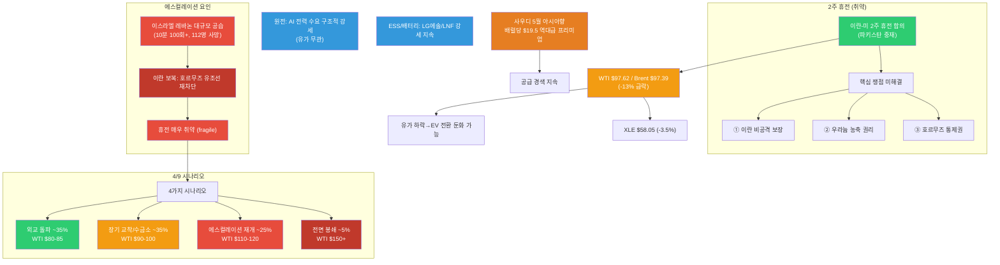

---

## 1. 중동 위기: 이란-미 2주 휴전·이스라엘 레바논 공습·호르무즈 재차단 (4/9)

### 1.0 신규 이벤트: 2주 휴전 합의 + 이스라엘 레바논 공습 + 호르무즈 재차단

4월 9일, 파키스탄 중재로 **이란-미 2주 휴전**이 합의되어 유가가 13% 급락했으나, **이스라엘이 레바논을 대규모 공습(10분간 100회+, 112명 사망)**하면서 상황이 다시 불안정해졌습니다. 트럼프/네타냐후는 "레바논은 휴전에 포함되지 않음"을 명시. 이란은 이스라엘 공습에 대한 보복으로 **호르무즈 유조선 통행을 다시 차단**했습니다(이란 국영통신: 공습 후 수시간 내 통행 중단 보도).

**사우디**는 5월 아시아 수출용 원유에 배럴당 **$19.5 역대급 프리미엄**을 부과 — 공급 경색 심각성을 반영. 이란은 선박 1척당 **$200만 통행료**를 징수 중이며, 트럼프는 **미-이란 합작 통행료(배럴당 $1 + 선박 $200만)**를 검토. 순비용 전가 시 배럴당 +$1~3, 리스크 프리미엄 포함 시 +$10~15.

WTI > Brent 역전이 해소(이전: WTI $111 > Brent $109 → 현재: WTI $97.62 < Brent $97.39). EIA는 2026년 Q1 원유/석유제품 가격 급등을 확인했습니다.

| 항목 | 내용 |
|------|------|
| **이란-미 2주 휴전** | 파키스탄 중재, BUT 핵심 쟁점 미해결 |
| **이스라엘 레바논 공습** | 10분간 100회+, 112명 사망. "레바논은 휴전 미포함" |
| **호르무즈 재차단** | 이란 보복: 이스라엘 공습→유조선 통행 재차단 |
| **미해결 핵심 쟁점 3가지** | ① 이란 비공격 보장 ② 우라늄 농축 권리 ③ 호르무즈 통제권 |
| **WTI** | **$97.62 (-13%)** — 휴전 뉴스에 급락 |
| **Brent** | **$97.39 (-13%)** — WTI > Brent 역전 해소 |
| **사우디 프리미엄** | 5월 아시아향 배럴당 **$19.5 역대급** |
| **호르무즈 통행료** | 이란: 선박 $200만, 트럼프: 미-이란 합작(배럴당 $1+선박 $200만) 검토 |
| **XLE** | **$58.05 (-3.5%)** — 유가 하락 반영 |
| **LIT** | **$76.71 (+4.0%)** — 배터리/ESS 강세 |
| **ICLN** | **$18.52 (+3.8%)** — 클린에너지 강세 |

> **취약한 휴전**: 2주 휴전은 유예기간일 뿐이며, 3가지 핵심 쟁점(비공격 보장, 농축 권리, 호르무즈 통제)이 모두 미해결. 이스라엘의 레바논 공습과 이란의 호르무즈 재차단이 보여주듯, 휴전은 매우 취약합니다. 사우디 $19.5 역대급 프리미엄은 실물 시장의 공급 경색이 유가 하락에도 불구하고 지속됨을 시사합니다.

### 1.1 상황 변화 타임라인

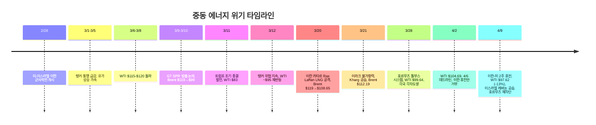

### 1.2 유가 변동 요인 (4/9)

| 요인 | 방향 | 내용 |
|------|:----:|------|
| **이스라엘 레바논 공습** | 상승 | 10분 100회+, 112명 사망 → 이란 보복 유발 |
| **호르무즈 유조선 재차단** | 상승 | 이란 보복: 이스라엘 공습→유조선 통행 중단 재개 |
| **사우디 $19.5 역대급 프리미엄** | 상승 | 5월 아시아향 원유, 실물 공급 경색 반영 |
| **미해결 핵심 쟁점 3가지** | 상승 | 비공격 보장, 농축 권리, 호르무즈 통제 → 2주 내 타결 불투명 |
| **호르무즈 통행료** | 상승 | 순비용 배럴당 +$1~3, 리스크 프리미엄 포함 +$10~15 |
| **이란-미 2주 휴전** | 하락 | 파키스탄 중재, 유가 -13% 급락 촉발 |
| **WTI > Brent 역전 해소** | 하락 | 공급 왜곡 일부 완화 신호 |
| **유가 하락→EV 전환 둔화 가능** | 상승(석유수요) | 고유가→EV 전환 가속의 역방향 |
| **원전 구조적 강세** | - | AI 전력 수요, 유가 무관 |

### 1.3 핵심 리스크: 취약한 휴전 + 이스라엘 독주 + 호르무즈 재차단

- **취약한 2주 휴전**: 파키스탄 중재로 합의되었으나, 3가지 핵심 쟁점(비공격 보장, 농축 권리, 호르무즈 통제) 미해결. 2주 유예기간일 뿐
- **이스라엘 독주 리스크**: 레바논 대규모 공습(10분 100회+, 112명 사망). "레바논은 휴전 미포함" 명시 → 이란의 보복 유발, 에스컬레이션 재개 확률 상향
- **호르무즈 재차단**: 이스라엘 공습→이란 보복으로 유조선 통행 재차단. 휴전에도 불구하고 호르무즈 리스크 지속
- **사우디 $19.5 역대급 프리미엄**: 유가 -13% 급락에도 실물 시장 공급 경색 지속. 선물 가격과 현물 괴리
- **호르무즈 통행료 구조화**: 이란 선박 $200만, 트럼프 미-이란 합작(배럴당 $1 + 선박 $200만) 검토. 호르무즈가 사실상 유료 수로화
- **유가 하락→EV 전환 둔화**: 고유가가 EV 전환 가속의 트리거였으나, 유가 -13% 하락으로 전환 인센티브 약화 가능
- **원전/ESS 강세 독립적**: 원전(AI 전력), ESS/배터리(LG에솔/LNF 강세 지속)는 유가와 무관한 구조적 강세

### 1.4 산유국 대규모 감산: 600만 배럴

저장시설 포화로 인해 산유국들이 **역대급 감산**에 돌입했습니다.

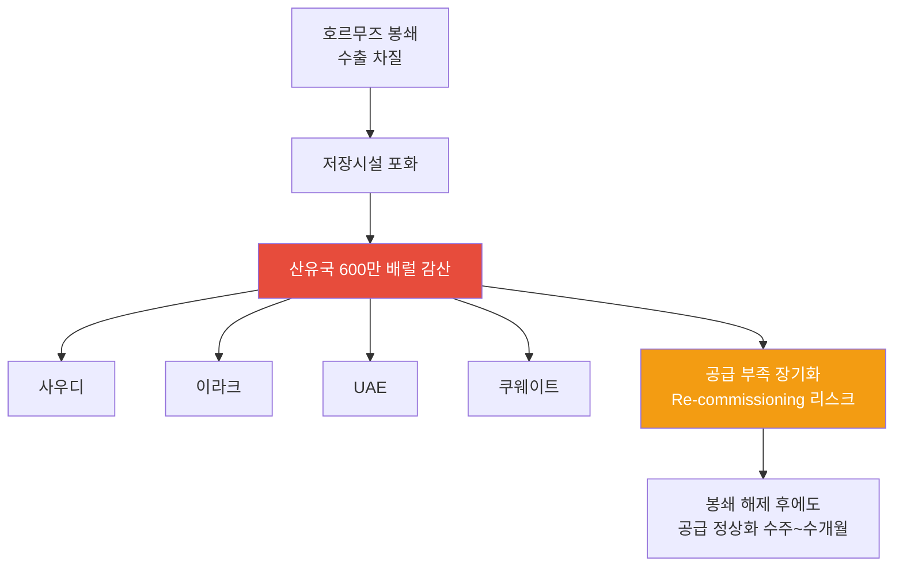

| 국가 | 감산 참여 | 상황 |
|------|:--------:|------|
| **사우디** | O | 최대 규모 감산, 저장시설 포화 대응 |
| **이라크** | O | **3/21 불가항력 선언** — 이란전 여파로 수출 중단, 저장 잔여 극소 |
| **UAE** | O | 생산 감축 지속 |
| **쿠웨이트** | O | 저장 포화 대응 중 |
| **합계** | - | **총 600만 배럴/일 감산** |

> **투자 시사점**: 600만 배럴 감산은 단순 봉쇄 대응이 아니라, **Re-commissioning 리스크**를 수반합니다. 유정 셧다운 후 재가동에 수주~수개월이 소요되므로, 전쟁이 종결되더라도 공급 정상화에는 시간이 필요합니다. 중기적으로 유가 $70-80 레벨이 하한선이 될 가능성이 있습니다.

### 1.5 국가별 에너지 취약성

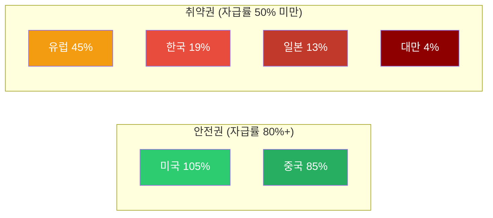

| 국가 | 에너지 자급률 | 호르무즈 영향 | GS 분석 |
|------|:-----------:|------------|---------|
| **미국** | 105% | 매우 낮음 | 순 수출국, 유가 상승 수혜, 제조업 노출 제한적 |
| **중국** | 85% | **가장 적음** | 석유 의존도 9%, 러시아 대체 루트 (Goldman Sachs) |
| **유럽** | 45% | 높음 | LNG 의존, 가스가격 +60% |
| **한국** | 19% | **매우 높음** | 중동 원유 70% 의존 |
| **일본** | 13% | **매우 높음** | 중동 원유 90%+ 의존 |
| **대만** | 4% | **극심** | 거의 전량 수입 |

> **Goldman Sachs 핵심 분석**: 중국이 이번 오일 쇼크에서 **가장 적은 영향**을 받을 것으로 전망. 자급률 85%에 석유 의존도 9%, 러시아 파이프라인 대체 루트까지 확보. 호르무즈 톨부스 시스템에서도 중국 선박은 **통과 허용**. 반면 **한국·일본·대만이 실질적 피해국**입니다.

> **4/9 휴전과 취약국**: 2주 휴전으로 유가가 -13% 급락했으나, **사우디 $19.5 역대급 프리미엄**이 보여주듯 실물 공급 경색은 지속 중. 한국·일본·대만의 에너지 취약성은 여전하며, 이란의 호르무즈 재차단(이스라엘 공습 보복)은 휴전에도 불구하고 통행 리스크가 해소되지 않았음을 의미합니다. 호르무즈 통행료(선박 $200만, 배럴당 +$1~3 순비용)는 에너지 수입국에 추가 부담 구조를 고착화하고 있습니다.

### 1.6 원자재 사이클: 에너지 다음은 식량

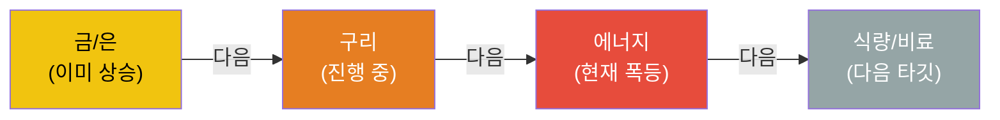

원자재 상승 사이클은 통상 **금/은 → 구리 → 에너지 → 식량/비료** 순서로 전파됩니다. 현재 에너지 단계에서 폭등이 진행 중이며, 다음은 식량/비료 섹터 상승이 예상됩니다.

---

## 2. 하위 섹터 1: Oil & Gas (단기 최대 수혜, 중기 불확실)

### 2.1 XLE $58.05 (-3.5%): 유가 급락(-13%) 반영, 휴전 취약성 잔존

XLE이 **$58.05(-3.5%)**로 하락했습니다. WTI가 $97.62(-13%)로 급락하면서 에너지주도 동반 하락. 2주 휴전 합의로 유가가 급락했으나, 이스라엘 레바논 공습→이란 호르무즈 재차단이 상방 리스크로 작용 중. 한편 LIT **$76.71(+4.0%)**, ICLN **$18.52(+3.8%)**로 배터리/클린에너지는 강세.

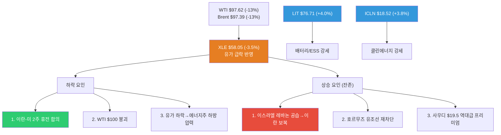

| 요인 | 방향 | 설명 |
|------|:----:|------|
| **이란-미 2주 휴전** | 하락 | 유가 -13% 급락 → 에너지주 하방 압력 |
| **WTI $100 붕괴** | 하락 | 심리적 지지선 이탈 |
| **이스라엘 레바논 공습** | 상승 | 10분 100회+, 이란 보복 유발 → 에스컬레이션 리스크 |
| **호르무즈 재차단** | 상승 | 이란 보복, 유조선 통행 재중단 |
| **사우디 $19.5 프리미엄** | 상승 | 실물 공급 경색 지속, 유가-현물 괴리 |
| **통행료 구조화** | 상승(장기) | 배럴당 +$1~3(순비용), +$10~15(리스크 포함) |
| **LIT/ICLN 강세** | - | 배터리/ESS/클린에너지는 유가 하락과 무관하게 상승 |

> **핵심 판단**: 휴전으로 유가가 급락했으나, 이스라엘의 독주(레바논 공습)와 이란의 호르무즈 재차단이 보여주듯 **휴전은 매우 취약**합니다. 사우디 $19.5 역대급 프리미엄은 실물 시장의 공급 경색이 유가 하락에도 지속됨을 시사. **2주 휴전 종료 후 시나리오에 따라 유가가 급등 또는 추가 하락할 수 있으므로**, 방향성 베팅보다 시나리오별 대응이 필요합니다.

### 2.2 Oil & Gas 업스트림/미드스트림/다운스트림

| 세그먼트 | 현재 상황 | 수혜/위험 | 주요 종목 |
|---------|---------|---------|---------|
| **업스트림 (탐사/생산)** | 미국 셰일 풀가동 인센티브 | **최대 수혜**: 유가 상승 직접 반영 | ExxonMobil (XOM), Chevron (CVX), ConocoPhillips (COP) |
| **미드스트림 (파이프/저장)** | 저장 수요 급증, 미국 LNG 수출 증가 | **수혜**: 물류/저장 수수료 증가 | Enterprise Products (EPD), Kinder Morgan (KMI) |
| **다운스트림 (정유)** | 원유 조달 차질, 크랙 스프레드 확대 | **혼재**: 마진 확대 vs 원유 확보 어려움 | Valero (VLO), Marathon Petroleum (MPC) |

### 2.3 미국 에너지 독립의 의미

미국은 에너지 자급률 105%로 이번 위기에서 **상대적 안전지대**입니다.

- **미국 생산자**: 유가 상승으로 직접 수혜, 수출 증가
- **제조업**: 에너지 비용 상승 영향 제한적 (자체 생산으로 충당)
- **소비자**: 가솔린 17% 상승했으나 아시아/유럽 대비 충격 제한적
- **전략적 위치**: 글로벌 에너지 위기에서 미국 패권 강화

### 2.4 Oil & Gas 투자 전략 (4/9 업데이트)

| 시나리오 | 확률 | 유가 전망 | 전략 |
|---------|:---:|---------|------|
| **외교 돌파 (핵심 쟁점 타결)** | **~35%** ↓ | WTI $80-85 | Oil 대폭 축소, 클린에너지/ESS/EV 전환 |
| **장기 교착/수금소 (이란 선별적 통제)** | **~35%** ↑ | WTI $90-100 | 현 포지션 유지, 사우디 프리미엄 수혜주 |
| **에스컬레이션 재개 (이스라엘 독주→이란 보복)** | **~25%** ↑ | WTI $110-120 | 업스트림 확대, 에너지 인플레 수혜주 |
| **전면 봉쇄** | **~5%** | WTI $150+ | 에너지 올인 + 방어주 |

> **4/9 시나리오 변경 사항**: 이란-미 2주 휴전이 합의되었으나, **이스라엘 레바논 대규모 공습(10분 100회+, 112명 사망)**과 이란의 호르무즈 재차단으로 **외교 돌파 확률 하향, 장기 교착/에스컬레이션 확률 상향**. 기존 4가지 시나리오를 재조정: ① 외교 돌파 ~35%(이스라엘 공습으로 하향), ② 장기 교착/수금소 ~35%(이란 선별적 통제 지속), ③ 에스컬레이션 재개 ~25%(이스라엘 독주 반영 상향), ④ 전면 봉쇄 ~5%. 사우디 $19.5 프리미엄은 실물 경색 지속을 의미하며, **2주 휴전 종료 시점이 다음 분기점**.

---

## 3. 하위 섹터 2: 원전/SMR (최상위 투자 매력 - 에너지 안보 핵심)

> **상세 분석**: [2026년 원전 투자 전망](/knowledge/invest/2026/01/21/nuclear-power-sector-outlook-2026.html)

### 3.1 원전/SMR: 정책·기술·수요 3박자 강세

호르무즈 위기가 원전의 에너지 안보 가치를 증명한 데 이어, **미국 $80B 신규 원전 펀딩**과 **NuScale SMR 규제 승인** 등 정책·기술 측면에서도 강력한 모멘텀이 추가되었습니다.

| 항목 | 내용 |
|------|------|
| **미국 $80B 원전 펀딩** | 신규 원전 건설을 위한 대규모 연방 펀딩 발표 (3/11) |
| **AI DC 전력 5x 성장** | AI 데이터센터 전력 수요 **2030년까지 5배 성장** 전망 |
| **NuScale SMR 규제 승인** | NRC 인증에 이어 **규제 승인** 획득, 상용화 가속 |
| **Cameco EPS +55%** | 우라늄 수요 급증으로 Cameco 실적 전망 대폭 상향 |
| **URA ETF 상승 지속** | 우라늄 가격 상승과 원전 투자 확대 반영 |
| **SMR 상용화 가시화** | 중국 링롱원 세계 최초 상업용 육상 SMR **2026년 상반기 가동** |
| **글로벌 원전 확대** | 2026년 신규 원자로 15기(12GW) 가동 예정 |
| **에너지 안보** | 호르무즈 위기 → 자급률 19% 한국에 원전 필수불가결 |
| **SMR 특별법** | 2026.2.12 국회 통과 → i-SMR 상용화 가속 |
| **우라늄 전망** | Goldman Sachs 목표가 $91/lb (2026년 말) |

### 3.2 2026년 원전 가동 타임라인

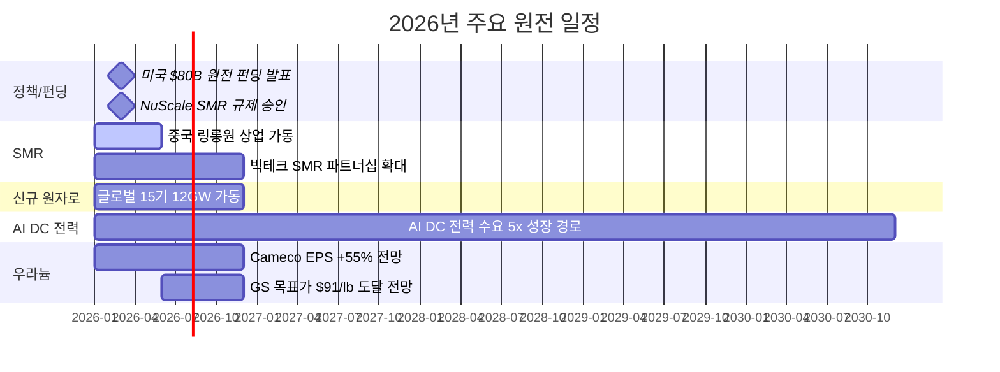

### 3.3 주요 종목

| 종목 | 시장 | 핵심 포인트 | 리스크 |
|------|------|-----------|--------|
| **두산에너빌리티** | KRX | **대장주**. SMR 기자재 독점, 원전 EPC, xAI 가스터빈 5기 수주 | 건설 지연 |
| **BH** | KRX | 가스터빈과 세트 (보일러/스팀), 두산에너빌리티 동반 수혜 | 가스터빈 수주 의존 |
| **한전기술** | KRX | i-SMR 설계 주관사 | 매출 인식 시점 |
| **현대일렉트릭** | KRX | **765kV 초고압 변압기** 생산 가능 극소수 기업, 수작업 필수 | 납기 지연 |
| **효성중공업** | KRX | 초고압 변압기 핵심 기업, 글로벌 수요 급증 | 원자재 가격 |
| **NuScale (SMR)** | NYSE | NRC 인증 유일 SMR | 상용화 지연 |
| **Cameco (CCJ)** | NYSE | 우라늄 채굴 1위, GS 목표가 $91/lb | 우라늄 가격 변동 |
| **Oklo (OKLO)** | NYSE | Meta 1.2GW PPA 체결 | 기술 검증 미완 |

> **변압기 투자 포인트**: 데이터센터·원전·재생에너지 모두 변압기가 필수이며, 특히 765kV급 초고압 변압기는 전 세계에서 **극소수 기업만 생산 가능**하고, 자동화가 불가능한 **수작업** 공정으로 공급 병목이 심각합니다.

---

## 4. 하위 섹터 3: 재생에너지 (대안 에너지 수혜 + 구조적 성장)

> **상세 분석**: [2026년 재생에너지 투자 전망](/knowledge/invest/2026/03/07/renewable-energy-outlook-2026.html)

### 4.1 고유가 → EV 전환 가속 + 청정에너지 전환 강화

4/9 유가 급락(-13%)으로 EV 전환 인센티브가 일부 약화될 가능성이 있습니다. 이전까지 고유가가 **EV 전환을 가속**시켜 왔으나(한국 +172%, 유럽 급증), 유가 하락 시 전환 속도가 둔화될 수 있습니다. 다만 원전은 AI 전력 수요로 유가와 무관한 구조적 강세를 유지하고, ESS/배터리는 LG에솔/LNF 신고가 이후에도 상승세가 지속되고 있어 **클린에너지 구조적 전환은 여전히 유효**합니다.

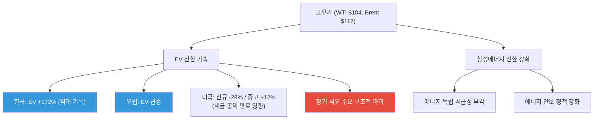

### 4.2 핵심 투자 포인트

| 항목 | 내용 |
|------|------|
| **EV 전환 가속** | 한국 +172%, 유럽 급증 — 고유가가 비미국 시장에서 EV 전환 결정적 트리거 |
| **미국 신규 용량 99%** | 2026년 신규 발전의 99%가 재생에너지+ESS |
| **태양광 44.5GW** | 미국 역대 최대 유틸리티 태양광 설치 |
| **IRA AMPC** | 미국 내 제조 보조금으로 리쇼어링 가속 |
| **ICLN** | $18.52 (+3.8%) — 클린에너지 강세, 유가 하락에도 상승 |

### 4.3 주요 종목

| 종목 | 시장 | 핵심 포인트 |
|------|------|-----------|
| **한화솔루션** | KRX | 미국 수직계열화, AMPC 수혜, 2026 판매 9GW 목표 |
| **First Solar (FSLR)** | NASDAQ | 미국 유일 대규모 태양광 제조 |
| **NextEra Energy (NEE)** | NYSE | 세계 최대 재생에너지 유틸리티, EPS $3.92~4.02 |
| **CS윈드** | KRX | 풍력 타워 글로벌 1위, **미국/유럽 현지 공장** 보유 (관세 리스크 낮음) |
| **Vestas (VWS)** | CPH | 풍력 터빈 세계 1위, 백로그 EUR 31.6B |

---

## 5. 하위 섹터 4: ESS (그리드 불안정 → 필수 인프라)

> **상세 분석**: [2026년 ESS 투자 전망](/knowledge/invest/2026/03/07/ess-energy-storage-outlook-2026.html)

### 5.1 에너지 위기가 ESS 필요성을 극대화

호르무즈 봉쇄로 인한 에너지 공급 불안정은 **그리드 안정화를 위한 ESS 수요를 폭발적으로 증가**시키고 있습니다. 재생에너지 비중 확대와 맞물려 ESS는 선택이 아닌 필수 인프라가 되었습니다.

| 항목 | 내용 |
|------|------|
| **시장 규모** | $146B(2025) → $521B(2035), CAGR 13.6% |
| **미국 신규** | 2026년 24.3GW 배터리 신규 설치 |
| **LFP 주도** | 비용/안전/수명 우위로 그리드 ESS 표준 |
| **ESS 마진 우위** | ESS 마진 20%+ vs EV 배터리 8% |
| **LIT $76.71 (+4.0%)** | 리튬/배터리 ETF 강세 = ESS/배터리 수요 견조 |

### 5.2 주요 종목

| 종목 | 시장 | 핵심 포인트 |
|------|------|-----------|
| **삼성SDI** | KRX | SBB ESS 라인업, 전고체 2027~2028 |
| **LG에너지솔루션** | KRX | 미국 ESS 90GWh 목표, LFP 30GWh, **ESS 매출 비중 20%로 확대** |
| **Tesla (TSLA)** | NASDAQ | Megapack 3, Megablock, 미국 LFP 생산 |
| **BYD** | HKEX | 나트륨이온 ESS, 30GWh 공장 착공 |
| **CATL** | SHE | 나트륨이온 2026 본격 양산, 175Wh/kg |

> **ESS 마진 우위**: LG에너지솔루션 기준 ESS 매출 비중이 10%→20%로 확대 중이며, ESS 마진(20%+)이 EV 배터리 마진(8%)을 크게 상회합니다. ESS가 배터리 기업의 수익성 개선 핵심 동력입니다.

---

## 6. 하위 섹터 5: 수소 에너지 (장기 에너지 독립 수단)

> **상세 분석**: [2026년 수소 에너지 투자 전망](/knowledge/invest/2026/03/07/hydrogen-energy-outlook-2026.html)

### 6.1 호르무즈 위기 → 에너지 독립 수단으로서의 수소 가치 재조명

수소는 단기적 수혜보다는 **장기적 에너지 독립** 수단으로 전략적 가치가 부각되고 있습니다. 호르무즈 사태가 보여주듯 화석연료 의존의 지정학적 리스크가 현실화되면서, 자국 생산 가능한 그린수소의 전략적 중요성이 높아지고 있습니다.

| 항목 | 내용 |
|------|------|
| **NEOM 프로젝트** | $8.4B, 세계 최대 그린수소, 2026~2027 완공 |
| **45V 세액공제** | 그린수소 $3/kg 보조금 (IRA) |
| **두산퓨얼셀** | SOFC 양산, 미국 DC 시장 진출 |
| **전략적 가치** | 에너지 자급을 위한 장기 솔루션 |

### 6.2 고려아연 수소 진출 (3/12 신규)

EU CBAM(탄소국경조정메커니즘) 2026.1 시행으로 **그린메탈** 전환이 필수가 되면서, 고려아연이 수소 사업에 본격 진출하고 있습니다.

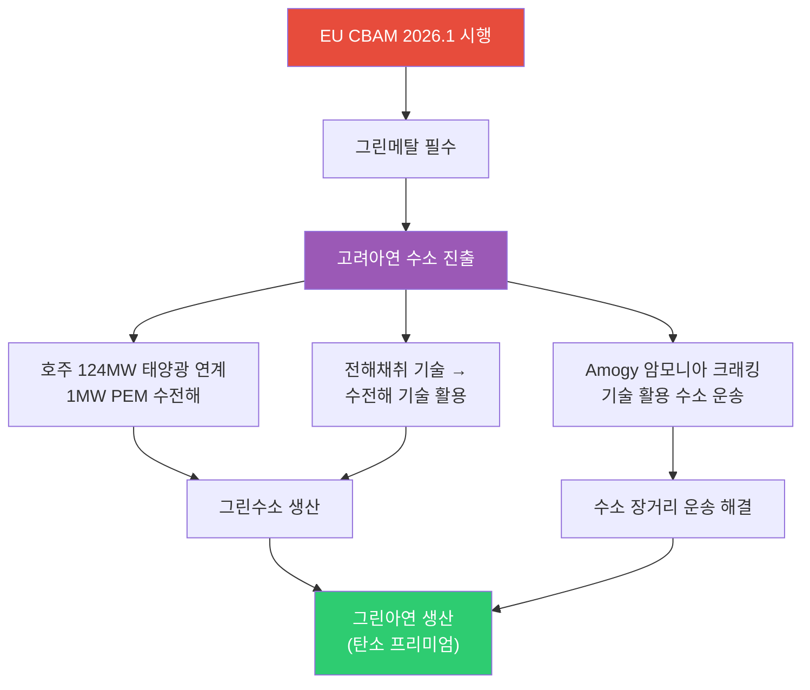

| 항목 | 내용 |
|------|------|
| **EU CBAM** | 2026.1 시행 → 탄소 배출 높은 금속에 관세 부과, 그린메탈 전환 필수 |
| **호주 PEM 수전해** | 124MW 태양광 연계 1MW PEM 수전해 설비 → 그린수소 생산 |
| **전해채취 → 수전해** | 아연 전해채취(electrolytic extraction) 기술을 수전해(water electrolysis)에 활용 |
| **Amogy 암모니아 크래킹** | 수소를 암모니아로 변환 후 운송, 도착지에서 크래킹으로 수소 추출 → 장거리 운송 해결 |

> **투자 시사점**: 고려아연의 수소 진출은 단순 에너지 사업이 아니라 **CBAM 대응을 위한 그린메탈 전환 전략**입니다. 전해채취 기술 노하우를 수전해에 활용하는 것은 기술적 시너지가 크며, Amogy 암모니아 크래킹을 통한 수소 운송은 수소 인프라 부재의 근본 과제를 해결하는 접근입니다.

### 6.3 주요 종목

| 종목 | 시장 | 핵심 포인트 |
|------|------|-----------|
| **고려아연** | KRX | EU CBAM 대응, 호주 PEM 수전해, 그린메탈 전환 (3/12 신규) |
| **두산퓨얼셀** | KRX | SOFC 양산, 2026 매출 6,900억 목표 |
| **효성첨단소재** | KRX | 탄소섬유 수소탱크 핵심 소재 |
| **Plug Power (PLUG)** | NASDAQ | 전해조+운송+충전 수직계열화 |
| **Bloom Energy (BE)** | NYSE | SOFC 2GW 생산 확대 |
| **Air Products (APD)** | NYSE | NEOM 그린수소 독점 오프테이커 |

---

## 7. AI 데이터센터 전력 수요 (구조적 메가트렌드 지속)

호르무즈 위기에도 불구하고 AI 전력 수요라는 구조적 메가트렌드는 **변함없이 진행** 중입니다.

### 7.1 빅테크 CAPEX: 역대 최대 $690B

| 기업 | 2026 CAPEX (추정) | 주요 프로젝트 | 전력 관련 이슈 |
|------|-----------------|-------------|-------------|
| **Amazon** | ~$200B | 역대 최대 단일 연도 기업 투자 | 원전 PPA 적극 추진 |
| **Google** | $175~185B | 2025년 $91B 대비 2배 | 소형원전(SMR) 투자 |
| **Meta** | $115~135B | 오하이오 1GW DC, 루이지애나 5GW 규모 DC | 재생에너지 PPA 확대 |
| **Microsoft** | ~$120B+ | Azure $80B 수주잔고(전력 부족으로 미이행) | **전력 병목이 성장 제약** |
| **합계** | **~$690B** | AI 인프라 역대 최대 | 전력이 핵심 병목 |

### 7.2 전력 수요 전망

- **데이터센터 전력 소비**: 2026년 **1000TWh**에 도달 전망 → 글로벌 원전 발전량의 **1/3** 수준
- **Deloitte 전망**: 미국 AI 데이터센터 전력 수요 4GW(2024) → 123GW(2035)
- **IEA 전망**: 글로벌 데이터센터 전력 소비 2024~2030년 **2배 이상 증가**
- **xAI/Tesla**: 두산에너빌리티로부터 가스터빈 5기 수주, 추가 15기 예상

---

## 8. 에너지 하위 섹터별 투자 매력도 비교

### 8.1 종합 평가표 (4/9 업데이트)

| 하위 섹터 | 단기 모멘텀 (6M) | 중기 성장성 (2~3Y) | 장기 구조적 (5Y+) | 리스크 | 종합 투자 매력도 |
|----------|:-:|:-:|:-:|---------|:-:|
| **Oil & Gas** | ★★★☆ | ★★★★ | ★★★ | 휴전 취약, 이스라엘 독주, 호르무즈 재차단 vs 유가 -13% 급락 | **A (A+→A 하향, 방향 불확실)** |
| **원전/SMR** | ★★★★★ | ★★★★★ | ★★★★★ | 인허가 지연, 건설 초과비용 | **S (최상, AI 전력 수요 구조적)** |
| **ESS/EV** | ★★★★★ | ★★★★★ | ★★★★★ | 유가 하락→EV 전환 둔화 가능, LFP 공급과잉 | **S (유지, LIT +4.0% 강세)** |
| **재생에너지** | ★★★★★ | ★★★★ | ★★★★ | 중국 과잉공급, 정책 불확실성 | **A+ (A→A+ 상향, ICLN +3.8%)** |
| **수소** | ★★★☆ | ★★★★ | ★★★★★ | 높은 생산비용, 인프라 부재 | **A-** |

> **4/9 평가 변경 사항**:
> - **Oil & Gas (A+ → A 하향)**: 2주 휴전 합의로 유가 -13% 급락. 이스라엘 레바논 공습(10분 100회+)→이란 호르무즈 재차단으로 **휴전이 매우 취약**. 외교 돌파 확률 하향, 에스컬레이션 확률 상향. 사우디 $19.5 프리미엄은 실물 경색 지속 시사. 방향 불확실성으로 추가 하향.
> - **ESS/EV (S 유지)**: LIT $76.71(+4.0%)로 배터리/ESS 강세 지속. 유가 하락으로 EV 전환 속도 둔화 가능성 있으나, 구조적 전환 추세는 불변. LG에솔/LNF 신고가 이후에도 상승.
> - **재생에너지 (A → A+ 상향)**: ICLN $18.52(+3.8%)로 클린에너지 강세. 유가 하락에도 에너지 독립·기후 정책 모멘텀 지속.

### 8.2 섹터별 시장 규모 전망

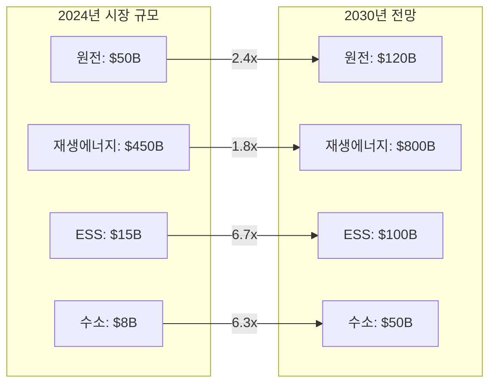

---

## 9. 투자 전략: 호르무즈 시나리오별 대응

### 9.1 포트폴리오 구성 제안

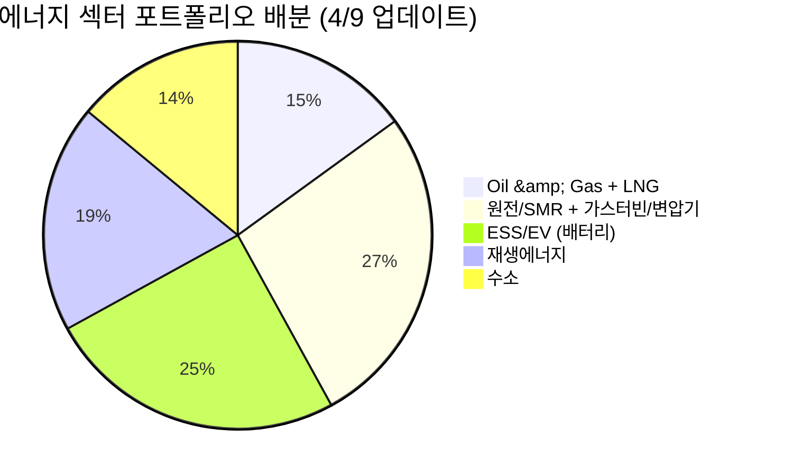

### 9.2 시나리오별 전략 (4/9 업데이트)

| 시나리오 | 확률 | 유가 전망 | 최적 전략 |
|---------|:---:|---------|---------|
| **외교 돌파 (핵심 쟁점 타결)** | **~35%** ↓ | WTI $80-85 | Oil 최소, 원전/ESS/EV 집중 |
| **장기 교착/수금소** | **~35%** ↑ | WTI $90-100 | 현 포지션 유지, 사우디 프리미엄 수혜주 |
| **에스컬레이션 재개** | **~25%** ↑ | WTI $110-120 | Oil 업스트림 확대, 에너지 인플레 수혜주 |
| **전면 봉쇄** | **~5%** | WTI $150+ | 에너지 올인 + 방어주 + 현금 확대 |

> **4/9 전략 변경**: 2주 휴전으로 유가 -13% 급락. Oil & Gas 비중 20%→15%로 추가 하향, 원전/ESS/EV 비중 확대. **이스라엘 레바논 공습→이란 호르무즈 재차단**으로 외교 돌파 확률 하향, 에스컬레이션 확률 상향. 사우디 $19.5 역대급 프리미엄은 실물 경색 지속. **2주 휴전 종료 시점(~4/23)이 다음 분기점**. 원전(AI 전력, 유가 무관)과 ESS/배터리(LIT +4.0%, ICLN +3.8%)가 시나리오 무관 안전 섹터. 호르무즈 통행료 구조화(배럴당 +$1~3)는 장기 에너지 비용 상승 요인.

### 9.3 리스크 요인

| 리스크 | 영향 | 대응 |
|--------|------|------|
| **2주 휴전 종료 후 에스컬레이션** | 핵심 쟁점 미해결→휴전 붕괴→유가 급등 | 2주 휴전 종료(~4/23) 전후 포지션 재조정 |
| **이스라엘 독주 리스크** | 레바논 공습 지속→이란 보복→호르무즈 완전 봉쇄 | 에스컬레이션 시나리오(~25%) 대비 업스트림 일부 보유 |
| **호르무즈 재차단 장기화** | 유조선 통행 재중단→실물 공급 경색 심화 | 사우디 프리미엄 수혜주, 대체 루트 수혜주 |
| **사우디 프리미엄 장기화** | 배럴당 $19.5 프리미엄→실질 유가 $115+ 효과 | 유가 선물과 현물 괴리에 주의 |
| **호르무즈 통행료 구조화** | 배럴당 +$1~3(순비용), +$10~15(리스크 포함) → 장기 에너지 비용 상승 | 에너지 수입국 취약성 지속 |
| **유가 하락→EV 전환 둔화** | 고유가 프리미엄 약화→EV 전환 인센티브 감소 | ESS/배터리는 구조적 강세 유지(LIT +4.0%) |
| **Re-commissioning 장기화** | 600만 배럴 감산 후 재가동에 수주~수개월 | 원유 업스트림 일부 보유 유지 |
| **경기침체 (수요 파괴)** | 에너지 비용 부담 → 인플레 → 수요 감소 | 고배당 유틸리티, 현금흐름 우수 기업 |
| **IRA 축소/폐지** | 재생에너지, 수소, ESS 타격 | 미국 외 지역 분산 |

---

## 핵심 데이터 요약

| 지표 | 수치 | 출처/기준 |
|------|------|----------|
| **WTI 유가** | **$97.62 (-13%)** | 2026.4.9, 이란-미 2주 휴전→급락 |
| **Brent 유가** | **$97.39 (-13%)** | 2026.4.9, WTI > Brent 역전 해소 |
| **이란-미 2주 휴전** | **파키스탄 중재, 핵심 쟁점 미해결** | 비공격 보장, 농축 권리, 호르무즈 통제 |
| **이스라엘 레바논 공습** | **10분 100회+, 112명 사망** | 트럼프/네타냐후: 레바논은 휴전 미포함 |
| **호르무즈 재차단** | **이란 보복: 유조선 통행 재중단** | 이란 국영통신: 공습 후 수시간 내 |
| **사우디 프리미엄** | **5월 아시아향 배럴당 $19.5 역대급** | 실물 공급 경색 반영 |
| **호르무즈 통행료** | **선박 $200만, 배럴당 +$1~3(순비용)** | 트럼프: 미-이란 합작(배럴당 $1) 검토 |
| **시나리오 확률** | **외교 ~35%↓, 교착 ~35%↑, 에스컬 ~25%↑, 봉쇄 ~5%** | 이스라엘 공습→확률 재조정 |
| **XLE** | **$58.05 (-3.5%)** | 유가 하락 반영 |
| **LIT** | **$76.71 (+4.0%)** | 배터리/ESS 강세 |
| **ICLN** | **$18.52 (+3.8%)** | 클린에너지 강세 |
| **EV 전환** | **유가 하락→전환 둔화 가능** | 고유가 프리미엄 약화 |
| **카타르 LNG** | **17% 파괴, 복구 3-5년** | 구조적 공급 부족 |
| **산유국 감산** | **600만 배럴/일** | 사우디·이라크·UAE·쿠웨이트 |
| **미국 원전 펀딩** | **$80B** | 신규 원전 건설 |
| **AI DC 전력 성장** | **5x** | 2030년까지 |
| 빅테크 2026 CAPEX | ~$690B | Futurum |
| DC 전력 소비 (2026) | 1000TWh | 글로벌 원전의 1/3 |
| 미국 2026 태양광 신규 | 44.5GW | EIA |
| 미국 2026 ESS 신규 | 24.3GW | EIA |
| ESS 시장 규모 (2035) | $521B | 시장조사 |
| 2026 신규 원자로 | 15기 (12GW) | 글로벌 |
| 우라늄 GS 목표가 | $91/lb (2026말) | Goldman Sachs |
| 한국 에너지 자급률 | 19% | 중동 원유 70% + 카타르 LNG 수입 |
| ESS 마진 | 20%+ (vs EV 8%) | LG에너지솔루션 |

---

## 결론

2026년 4월 9일, 파키스탄 중재로 **이란-미 2주 휴전**이 합의되면서 WTI **$97.62(-13%)**, Brent **$97.39(-13%)**로 급락했습니다. 그러나 **이스라엘이 레바논 대규모 공습(10분 100회+, 112명 사망)**을 감행하고, 이란이 보복으로 **호르무즈 유조선 통행을 재차단**하면서 **휴전은 매우 취약(fragile)**한 상태입니다. 3가지 핵심 쟁점(이란 비공격 보장, 우라늄 농축 권리, 호르무즈 통제권) 미해결.

**4/9 핵심 변화**:
- **이란-미 2주 휴전** — 파키스탄 중재, 유가 -13% 급락 촉발. BUT 핵심 쟁점 미해결, 2주 유예기간일 뿐
- **이스라엘 레바논 대규모 공습** — 10분 100회+, 112명 사망. "레바논은 휴전 미포함" 명시
- **호르무즈 재차단** — 이란 보복: 이스라엘 공습→유조선 통행 재중단(이란 국영통신 보도)
- **사우디 역대급 프리미엄** — 5월 아시아향 배럴당 $19.5, 실물 공급 경색 지속
- **호르무즈 통행료** — 선박 $200만, 트럼프 미-이란 합작(배럴당 $1) 검토. 순비용 +$1~3, 리스크 +$10~15
- **시나리오 확률 조정** — 외교 돌파 ~35%↓(이스라엘 공습), 장기 교착 ~35%↑, 에스컬레이션 ~25%↑
- **ESS/배터리 강세** — LIT $76.71(+4.0%), ICLN $18.52(+3.8%), 원전 구조적 강세(유가 무관)

**투자 우선순위** (4/9 업데이트):
1. **원전/SMR + 가스터빈/변압기** (27%, 상향): 두산에너빌리티, BH, 현대일렉트릭, 효성중공업, Cameco — AI 전력 수요 구조적, **유가 시나리오 무관 최안전**
2. **ESS/EV (배터리)** (25%, 상향): LG에너지솔루션, 삼성SDI — LIT +4.0% 강세, 마진 20%+ 우위. **구조적 성장 불변**
3. **재생에너지** (19%, 상향): CS윈드, 한화솔루션, First Solar — ICLN +3.8%, 에너지 독립 모멘텀
4. **Oil & Gas + LNG** (15%, 하향): ExxonMobil, ConocoPhillips — 유가 -13% 급락, 방향 불확실. 에스컬레이션 시 재확대
5. **수소** (14%): 고려아연, 두산퓨얼셀 — EU CBAM 대응 + 장기 에너지 독립 수단

> **핵심 전략**: 2주 휴전은 유예기간일 뿐이며, 이스라엘의 독주(레바논 공습)와 이란의 호르무즈 재차단이 보여주듯 **상황은 언제든 급변할 수 있습니다**. 원전(AI 전력, 유가 무관)과 ESS/배터리(LIT +4.0%)가 시나리오 무관 최안전 섹터. Oil & Gas는 15%로 하향하되, 에스컬레이션 재개(~25%) 시 재확대 대비. **2주 휴전 종료(~4/23)가 다음 결정적 분기점**입니다.
