> **시리즈 안내**: 이 글은 에너지 섹터 종합 전망입니다. 하위 섹터별 상세 분석은 아래 링크를 참고하세요.
> - [재생에너지 (태양광/풍력) 상세 분석](/knowledge/invest/2026/03/07/renewable-energy-outlook-2026.html)
> - [ESS (에너지 저장 시스템) 상세 분석](/knowledge/invest/2026/03/07/ess-energy-storage-outlook-2026.html)
> - [수소 에너지 상세 분석](/knowledge/invest/2026/03/07/hydrogen-energy-outlook-2026.html)
> - [원전/SMR 상세 분석](/knowledge/invest/2026/01/21/nuclear-power-sector-outlook-2026.html)

---

## 3/21 핵심 요약: 이라크 불가항력 선언·Brent $112·Kharg Island 공습 — 위기 장기화

이라크가 이란전 여파로 석유 수출에 **불가항력(force majeure)**을 선언하면서 Brent가 **$112.19**(2022년 이후 최고)까지 급등했습니다. 미군이 **Kharg Island**(이란 원유 수출의 90%, 1.5M bpd)를 공습했고, **해병대 2,500명 + 군함 3척**을 추가 배치했습니다. 트럼프 행정부는 Kharg Island **점령**까지 검토 중입니다(Axios). 분석가들은 기본 시나리오 **$120/bbl**(1-3개월), 강세 시나리오 **$150/bbl**을 제시하며 분쟁 시작 이후 유가가 **80% 급등**했습니다. IEA는 **"역사상 최대 글로벌 에너지 안보 위협"**이라 경고했고, 걸프 복구에 **6개월**이 걸릴 수 있다고 전망했습니다. FOMC는 PCE를 **2.7%**로 상향했으며(원유 30% + 관세 70%), CPI가 유가 $100+ 지속 시 **3%+** 재진입 가능성이 있습니다. CME 기준 10월까지 **금리인상 확률 50%**입니다. 금은 **$4,492(-2.36%, 주간 -10%)**로 급락 — "higher-for-longer가 금을 죽인다"는 내러티브가 형성되고 있습니다.

| 항목 | 3/20 | **3/21** | 변화 |
|------|------|---------|------|
| **Brent** | $108.65 | **$112.19 (+3.26%)** | 2022년 이후 최고, 이라크 불가항력 |
| **WTI** | $96.45 | **$98.32 (+1.94%)** | $100 돌파 임박 |
| **핵심 이벤트** | 카타르 LNG 공격 | **이라크 불가항력 + Kharg Island 공습** | 위기 추가 확전 |
| **이라크** | 감산 참여 | **불가항력 선언 (수출 중단)** | 이란전 여파 직접 타격 |
| **Kharg Island** | - | **미군 공습 (이란 원유 90%, 1.5M bpd)** | 직접 타격 시 공급 차질 |
| **미군 배치** | - | **해병대 2,500명 + 군함 3척 추가** (WSJ) | 군사적 확전 |
| **트럼프** | - | **Kharg Island 점령 검토** (Axios) | 미확정, 최대 리스크 |
| **분석가 전망** | GS $100-200 | **기본 $120 (1-3개월), 강세 $150** | 상방 리스크 확대 |
| **IEA 경고** | - | **"역사상 최대 에너지 안보 위협"** | 걸프 복구 6개월 |
| **FOMC 인플레** | - | **PCE 2.7% 상향** (원유 30%+관세 70%) | CPI 3%+ 재진입 가능 |
| **금리인상 확률** | - | **CME 50% (10월까지)** | 전쟁 지속 시 |
| **금** | - | **$4,492 (-2.36%, 주간 -10%)** | higher-for-longer 내러티브 |
| **XLE** | +1.59% | **$59.31 (-0.08%)** | 상대적 안정 |
| **유가 누적 상승** | - | **분쟁 시작 이후 +80%** | 구조적 상승 |

---

## 에너지 섹터 구조: 이라크 불가항력·Kharg Island 공습 — 위기 장기화

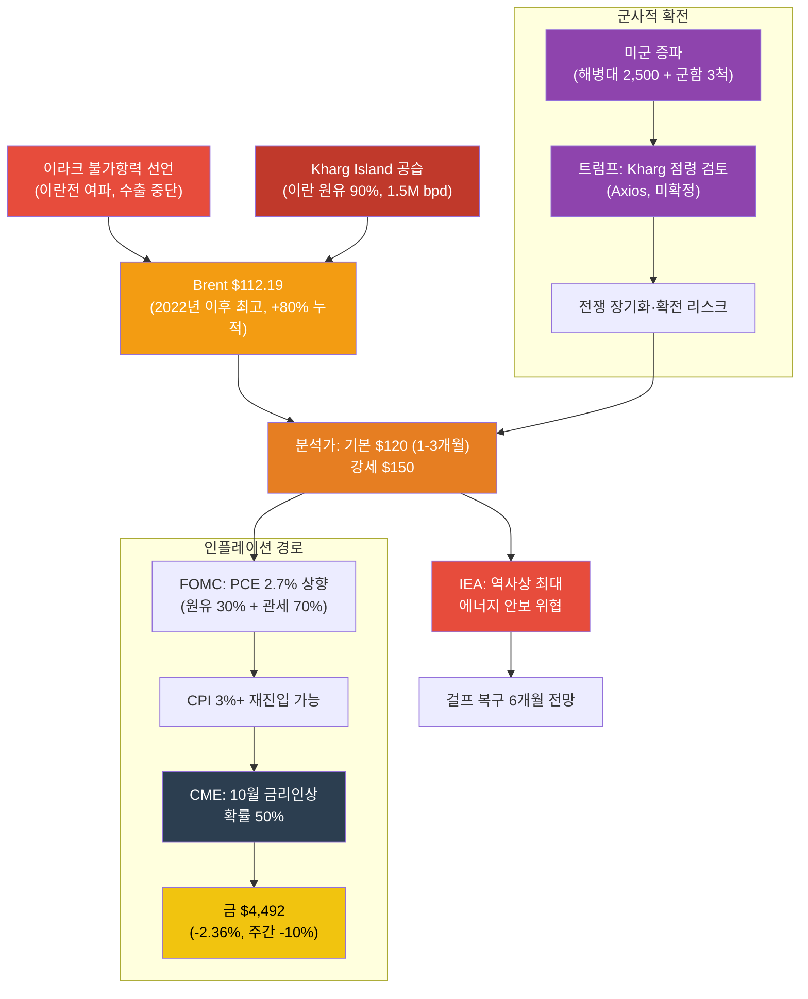

---

## 1. 중동 위기 장기화: 이라크 불가항력·Kharg Island·미군 증파 (3/21)

### 1.0 신규 이벤트: 이라크 불가항력 + Kharg Island 공습 + 미군 증파

3월 21일, 중동 에너지 위기가 **다중 전선으로 확전**되었습니다. 이라크가 이란전 여파로 석유 수출에 불가항력을 선언했고, 미군이 Kharg Island(이란 원유 수출의 90%)를 공습했으며, 추가 병력을 배치했습니다. 분쟁 시작 이후 유가는 **80% 급등**했습니다.

| 항목 | 내용 |
|------|------|
| **이라크 불가항력** | 이란전 여파로 석유 수출에 force majeure 선언 → Brent $112 돌파 |
| **Kharg Island 공습** | 이란 원유 수출의 90% 처리 (1.5M bpd), 직접 타격 시 공급 대폭 차질 |
| **미군 추가 배치** | 해병대 2,500명 + 군함 3척 추가 (WSJ) |
| **Kharg 점령 검토** | 트럼프 행정부, Kharg Island 점령 검토 중 (Axios, 미확정) |
| **유가** | Brent $112.19 (2022년 이후 최고), WTI $98.32, 분쟁 이후 +80% |
| **분석가 전망** | 기본 $120/bbl (1-3개월), 강세 $150/bbl |
| **IEA 경고** | "역사상 최대 글로벌 에너지 안보 위협", 걸프 복구 6개월 |
| **FOMC 영향** | PCE 2.7% 상향 (원유 30% + 관세 70%), CPI 3%+ 재진입 가능 |
| **금리인상** | CME 기준 10월까지 금리인상 확률 50% (전쟁 지속 시) |
| **금 급락** | $4,492 (-2.36%, 주간 -10%) — higher-for-longer가 금 매도 촉발 |
| **XLE** | $59.31 (-0.08%) — 상대적 안정 |

> **3/20 카타르 LNG 공격 (전일)**: 이란이 카타르 Ras Laffan LNG 시설(세계 최대)을 공격, LNG 용량 17% 파괴(12.8M톤/년), 복구 3-5년, 연간 $20B 손실. Brent 장중 $119 → $108.65 마감.

### 1.1 상황 변화 타임라인

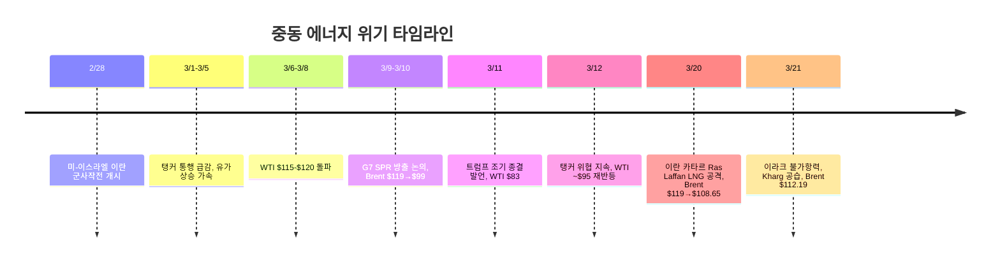

### 1.2 유가 변동 요인 (3/21)

| 요인 | 방향 | 내용 |
|------|:----:|------|
| **이라크 불가항력 선언** | 상승 | 이란전 여파로 석유 수출 중단 → Brent $112 돌파 |
| **Kharg Island 공습** | 상승 | 이란 원유 수출 90% 처리 시설, 직접 타격 시 1.5M bpd 차질 |
| **미군 2,500명 + 군함 3척** | 상승 | 군사적 확전 신호, 전쟁 장기화 우려 |
| **Kharg 점령 검토** | 상승 | 트럼프 행정부 내부 논의 (Axios), 실현 시 이란 원유 수출 완전 차단 |
| **분석가 $120/$150 전망** | 상승 | 기본 $120 (1-3개월), 강세 $150, 분쟁 이후 +80% |
| **IEA "역사상 최대 위협"** | 상승 | 걸프 복구 6개월 전망, 에너지 안보 위기 격상 |
| **카타르 LNG 17% 파괴 (전일)** | 상승 | 세계 LNG 공급 구조적 부족, 복구 3-5년 |
| **FOMC PCE 2.7%** | 혼재 | 원유 30% + 관세 70% → CPI 3%+ 가능, 금리인상 확률 50% |
| **금 급락 ($4,492)** | 혼재 | 주간 -10%, higher-for-longer 내러티브 → 안전자산 약화 |
| **호르무즈 봉쇄 지속** | 상승 | 봉쇄 해제 불확실, 이스라엘 개방 지원 발언 효과 제한적 |

### 1.3 핵심 리스크: 다중 전선 확전 + 인플레이션 경로

- **상방 리스크 극대화**: 이라크 불가항력 + Kharg Island 공습 + 미군 증파로 공급 차질 다중화. 분석가 기본 $120, 강세 $150. 분쟁 이후 누적 **+80%** 상승. IEA "역사상 최대 에너지 안보 위협"
- **Kharg Island 리스크**: 이란 원유 수출의 90%(1.5M bpd)를 처리하는 핵심 시설. 직접 타격 또는 점령 시 이란 원유 완전 차단 → $150+ 시나리오 현실화
- **인플레이션 경로 확대**: FOMC PCE 2.7% 상향(원유 30%+관세 70%), CPI 3%+ 재진입 가능, CME 금리인상 확률 50%(10월), 금 주간 -10%
- **하방 요인 약화**: 이전의 호르무즈 개방 기대·이란 제재 완화 효과가 이라크 불가항력과 미군 증파로 **상쇄**됨
- **질적 변화**: 단순 해상 봉쇄 → 에너지 인프라 파괴(카타르 LNG) → **복수 산유국 수출 중단(이라크) + 적국 핵심 시설 공습(Kharg)**으로 위기 단계가 지속 격상

### 1.4 산유국 대규모 감산: 600만 배럴

저장시설 포화로 인해 산유국들이 **역대급 감산**에 돌입했습니다.

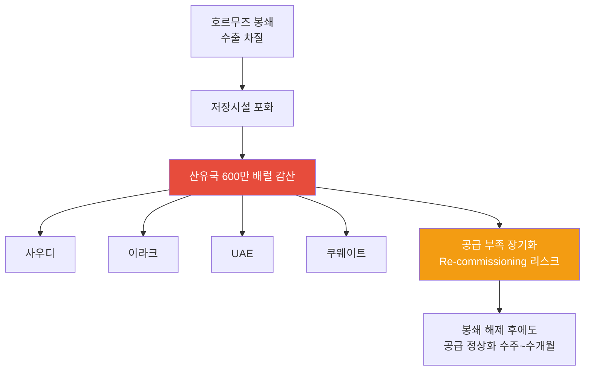

| 국가 | 감산 참여 | 상황 |
|------|:--------:|------|
| **사우디** | O | 최대 규모 감산, 저장시설 포화 대응 |
| **이라크** | O | **3/21 불가항력 선언** — 이란전 여파로 수출 중단, 저장 잔여 극소 |
| **UAE** | O | 생산 감축 지속 |
| **쿠웨이트** | O | 저장 포화 대응 중 |
| **합계** | - | **총 600만 배럴/일 감산** |

> **투자 시사점**: 600만 배럴 감산은 단순 봉쇄 대응이 아니라, **Re-commissioning 리스크**를 수반합니다. 유정 셧다운 후 재가동에 수주~수개월이 소요되므로, 전쟁이 종결되더라도 공급 정상화에는 시간이 필요합니다. 중기적으로 유가 $70-80 레벨이 하한선이 될 가능성이 있습니다.

### 1.5 국가별 에너지 취약성

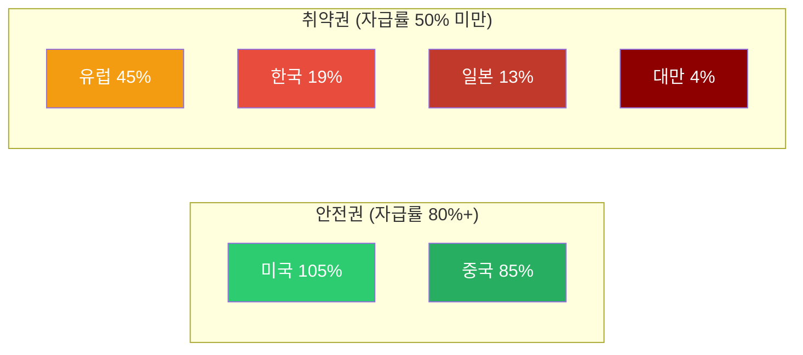

| 국가 | 에너지 자급률 | 호르무즈 영향 | GS 분석 |
|------|:-----------:|------------|---------|
| **미국** | 105% | 매우 낮음 | 순 수출국, 유가 상승 수혜, 제조업 노출 제한적 |
| **중국** | 85% | **가장 적음** | 석유 의존도 9%, 러시아 대체 루트 (Goldman Sachs) |
| **유럽** | 45% | 높음 | LNG 의존, 가스가격 +60% |
| **한국** | 19% | **매우 높음** | 중동 원유 70% 의존 |
| **일본** | 13% | **매우 높음** | 중동 원유 90%+ 의존 |
| **대만** | 4% | **극심** | 거의 전량 수입 |

> **Goldman Sachs 핵심 분석**: 중국이 이번 오일 쇼크에서 **가장 적은 영향**을 받을 것으로 전망. 자급률 85%에 석유 의존도 9%, 러시아 파이프라인 대체 루트까지 확보. 반면 **한국·일본·대만이 실질적 피해국**입니다.

> **3/20 카타르 LNG 공격 추가 영향**: Ras Laffan LNG 시설 17% 파괴로 **중국·한국·이탈리아·벨기에**가 직접 피해국에 추가되었습니다. 특히 한국은 중동 원유 70% 의존 + 카타르 LNG 수입국으로 **이중 타격**을 받는 구조입니다. GS는 유가 $100/bbl 도달 시 글로벌 인플레이션이 **+0.8%** 추가될 것으로 전망합니다.

### 1.6 원자재 사이클: 에너지 다음은 식량

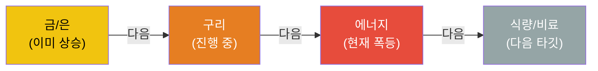

원자재 상승 사이클은 통상 **금/은 → 구리 → 에너지 → 식량/비료** 순서로 전파됩니다. 현재 에너지 단계에서 폭등이 진행 중이며, 다음은 식량/비료 섹터 상승이 예상됩니다.

---

## 2. 하위 섹터 1: Oil & Gas (단기 최대 수혜, 중기 불확실)

### 2.1 XLE $59.31 (-0.08%): 유가 급등에도 보합 — 인플레 우려 상쇄

Brent가 $112까지 급등했으나 XLE은 **$59.31(-0.08%)**로 보합에 그쳤습니다. 유가 상승 수혜와 FOMC 금리인상 우려(인플레 → 수요 둔화)가 상쇄된 결과입니다.

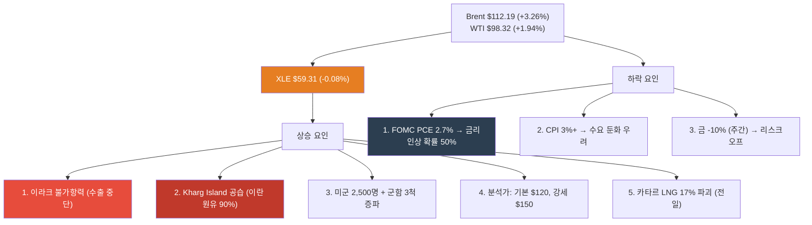

| 요인 | 방향 | 설명 |
|------|:----:|------|
| **이라크 불가항력** | 상승 | 이란전 여파로 수출 중단 → Brent $112 돌파 |
| **Kharg Island 공습** | 상승 | 이란 원유 90% 처리, 직접 타격 시 1.5M bpd 차질 |
| **미군 증파** | 상승 | 해병대 2,500명 + 군함 3척, 전쟁 장기화 신호 |
| **분석가 $120/$150** | 상승 | 기본 $120(1-3개월), 강세 $150, 누적 +80% |
| **카타르 LNG 파괴 (전일)** | 상승 | 세계 LNG 17% 차질, 복구 3-5년, 구조적 부족 |
| **IEA 경고** | 상승 | "역사상 최대 에너지 안보 위협", 걸프 복구 6개월 |
| **FOMC 인플레** | 하락 | PCE 2.7%, 원유 30%+관세 70%, CPI 3%+ 가능 |
| **금리인상 확률 50%** | 하락 | CME 10월 기준, 전쟁 지속 시 → 수요 둔화·경기침체 우려 |
| **금 급락** | 하락 | $4,492(-2.36%, 주간 -10%), higher-for-longer 내러티브 |

> **핵심 판단**: 이라크 불가항력 + Kharg Island 공습 + 미군 증파로 공급 차질이 **다중화**되었습니다. 기본 시나리오가 $100-120에서 **$100-120 → $120 기본**으로 상향되었고, IEA가 "역사상 최대 위협"으로 격상했습니다. 다만 FOMC 인플레 경로(PCE 2.7%, 금리인상 50%)가 새로운 하방 리스크로 부상 — 유가 $100+ 지속 시 수요 파괴(demand destruction)를 통한 자기 조정 가능성이 있습니다.

### 2.2 Oil & Gas 업스트림/미드스트림/다운스트림

| 세그먼트 | 현재 상황 | 수혜/위험 | 주요 종목 |
|---------|---------|---------|---------|
| **업스트림 (탐사/생산)** | 미국 셰일 풀가동 인센티브 | **최대 수혜**: 유가 상승 직접 반영 | ExxonMobil (XOM), Chevron (CVX), ConocoPhillips (COP) |
| **미드스트림 (파이프/저장)** | 저장 수요 급증, 미국 LNG 수출 증가 | **수혜**: 물류/저장 수수료 증가 | Enterprise Products (EPD), Kinder Morgan (KMI) |
| **다운스트림 (정유)** | 원유 조달 차질, 크랙 스프레드 확대 | **혼재**: 마진 확대 vs 원유 확보 어려움 | Valero (VLO), Marathon Petroleum (MPC) |

### 2.3 미국 에너지 독립의 의미

미국은 에너지 자급률 105%로 이번 위기에서 **상대적 안전지대**입니다.

- **미국 생산자**: 유가 상승으로 직접 수혜, 수출 증가
- **제조업**: 에너지 비용 상승 영향 제한적 (자체 생산으로 충당)
- **소비자**: 가솔린 17% 상승했으나 아시아/유럽 대비 충격 제한적
- **전략적 위치**: 글로벌 에너지 위기에서 미국 패권 강화

### 2.4 Oil & Gas 투자 전략 (3/21 업데이트)

| 시나리오 | 확률 | 유가 전망 | 전략 |
|---------|:---:|---------|------|
| **봉쇄 지속 + LNG 부족 (현재)** | **40%** | Brent $100-120 | 업스트림 + LNG 관련주 보유, 천연가스 노출 확대, 인플레 헤지 |
| **위기 확전·장기화** | **35%** ↑ | 기본 $120, 강세 $150 | 에너지 전체 강세, 경기침체 헤지(방어주), 금리인상 대비 |
| **호르무즈 개방 + 제재 완화** | 15% ↓ | Brent $80-91 (BNEF) | Oil 비중 축소, LNG/클린에너지 유지 (카타르 LNG 부족 지속) |
| **외교적 해결 (1-2개월)** | 10% | WTI $70-80 | Oil 대폭 축소, 클린에너지/원전 집중 (LNG 부족은 구조적) |

> **3/21 시나리오 변경 사항**: 미군 증파 + Kharg 점령 검토 + 이라크 불가항력으로 **"위기 확전·장기화" 확률 25%→35%로 상향**, **"호르무즈 개방 + 제재 완화" 20%→15%로 하향**. 기본 유가 전망이 $90-120에서 **$100-120**으로 하한 상향. 인플레이션 경로(FOMC PCE 2.7%, 금리인상 50%)가 새로운 변수로 추가.

---

## 3. 하위 섹터 2: 원전/SMR (최상위 투자 매력 - 에너지 안보 핵심)

> **상세 분석**: [2026년 원전 투자 전망](/knowledge/invest/2026/01/21/nuclear-power-sector-outlook-2026.html)

### 3.1 원전/SMR: 정책·기술·수요 3박자 강세

호르무즈 위기가 원전의 에너지 안보 가치를 증명한 데 이어, **미국 $80B 신규 원전 펀딩**과 **NuScale SMR 규제 승인** 등 정책·기술 측면에서도 강력한 모멘텀이 추가되었습니다.

| 항목 | 내용 |
|------|------|
| **미국 $80B 원전 펀딩** | 신규 원전 건설을 위한 대규모 연방 펀딩 발표 (3/11) |
| **AI DC 전력 5x 성장** | AI 데이터센터 전력 수요 **2030년까지 5배 성장** 전망 |
| **NuScale SMR 규제 승인** | NRC 인증에 이어 **규제 승인** 획득, 상용화 가속 |
| **Cameco EPS +55%** | 우라늄 수요 급증으로 Cameco 실적 전망 대폭 상향 |
| **URA ETF 상승 지속** | 우라늄 가격 상승과 원전 투자 확대 반영 |
| **SMR 상용화 가시화** | 중국 링롱원 세계 최초 상업용 육상 SMR **2026년 상반기 가동** |
| **글로벌 원전 확대** | 2026년 신규 원자로 15기(12GW) 가동 예정 |
| **에너지 안보** | 호르무즈 위기 → 자급률 19% 한국에 원전 필수불가결 |
| **SMR 특별법** | 2026.2.12 국회 통과 → i-SMR 상용화 가속 |
| **우라늄 전망** | Goldman Sachs 목표가 $91/lb (2026년 말) |

### 3.2 2026년 원전 가동 타임라인

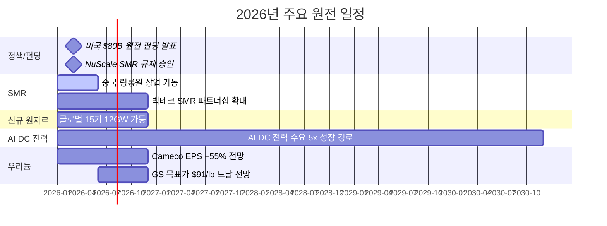

### 3.3 주요 종목

| 종목 | 시장 | 핵심 포인트 | 리스크 |
|------|------|-----------|--------|
| **두산에너빌리티** | KRX | **대장주**. SMR 기자재 독점, 원전 EPC, xAI 가스터빈 5기 수주 | 건설 지연 |
| **BH** | KRX | 가스터빈과 세트 (보일러/스팀), 두산에너빌리티 동반 수혜 | 가스터빈 수주 의존 |
| **한전기술** | KRX | i-SMR 설계 주관사 | 매출 인식 시점 |
| **현대일렉트릭** | KRX | **765kV 초고압 변압기** 생산 가능 극소수 기업, 수작업 필수 | 납기 지연 |
| **효성중공업** | KRX | 초고압 변압기 핵심 기업, 글로벌 수요 급증 | 원자재 가격 |
| **NuScale (SMR)** | NYSE | NRC 인증 유일 SMR | 상용화 지연 |
| **Cameco (CCJ)** | NYSE | 우라늄 채굴 1위, GS 목표가 $91/lb | 우라늄 가격 변동 |
| **Oklo (OKLO)** | NYSE | Meta 1.2GW PPA 체결 | 기술 검증 미완 |

> **변압기 투자 포인트**: 데이터센터·원전·재생에너지 모두 변압기가 필수이며, 특히 765kV급 초고압 변압기는 전 세계에서 **극소수 기업만 생산 가능**하고, 자동화가 불가능한 **수작업** 공정으로 공급 병목이 심각합니다.

---

## 4. 하위 섹터 3: 재생에너지 (대안 에너지 수혜 + 구조적 성장)

> **상세 분석**: [2026년 재생에너지 투자 전망](/knowledge/invest/2026/03/07/renewable-energy-outlook-2026.html)

### 4.1 카타르 LNG 공격 → 청정에너지 수혜 확대

카타르 LNG 시설 공격으로 화석연료 공급 리스크가 **석유 + 천연가스**로 확대되면서, ICLN(클린에너지 ETF) **+2.07%**로 에너지 섹터 내 가장 높은 상승률을 기록했습니다. LNG 공급 구조적 부족(복구 3-5년)은 청정에너지 전환을 가속시키는 강력한 촉매입니다. 다만 LIT(리튬 ETF)는 **-1.02%**로 경기침체 우려가 반영되었습니다.

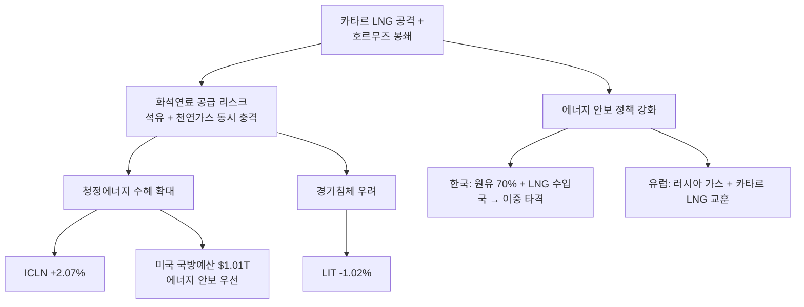

### 4.2 핵심 투자 포인트

| 항목 | 내용 |
|------|------|
| **미국 신규 용량 99%** | 2026년 신규 발전의 99%가 재생에너지+ESS |
| **태양광 44.5GW** | 미국 역대 최대 유틸리티 태양광 설치 |
| **IRA AMPC** | 미국 내 제조 보조금으로 리쇼어링 가속 |
| **호르무즈 수혜** | 에너지 안보 인식 전환, ICLN 18.51 (+1.42%) |

### 4.3 주요 종목

| 종목 | 시장 | 핵심 포인트 |
|------|------|-----------|
| **한화솔루션** | KRX | 미국 수직계열화, AMPC 수혜, 2026 판매 9GW 목표 |
| **First Solar (FSLR)** | NASDAQ | 미국 유일 대규모 태양광 제조 |
| **NextEra Energy (NEE)** | NYSE | 세계 최대 재생에너지 유틸리티, EPS $3.92~4.02 |
| **CS윈드** | KRX | 풍력 타워 글로벌 1위, **미국/유럽 현지 공장** 보유 (관세 리스크 낮음) |
| **Vestas (VWS)** | CPH | 풍력 터빈 세계 1위, 백로그 EUR 31.6B |

---

## 5. 하위 섹터 4: ESS (그리드 불안정 → 필수 인프라)

> **상세 분석**: [2026년 ESS 투자 전망](/knowledge/invest/2026/03/07/ess-energy-storage-outlook-2026.html)

### 5.1 에너지 위기가 ESS 필요성을 극대화

호르무즈 봉쇄로 인한 에너지 공급 불안정은 **그리드 안정화를 위한 ESS 수요를 폭발적으로 증가**시키고 있습니다. 재생에너지 비중 확대와 맞물려 ESS는 선택이 아닌 필수 인프라가 되었습니다.

| 항목 | 내용 |
|------|------|
| **시장 규모** | $146B(2025) → $521B(2035), CAGR 13.6% |
| **미국 신규** | 2026년 24.3GW 배터리 신규 설치 |
| **LFP 주도** | 비용/안전/수명 우위로 그리드 ESS 표준 |
| **ESS 마진 우위** | ESS 마진 20%+ vs EV 배터리 8% |
| **LIT 72.99 (+1.35%)** | 리튬/배터리 ETF 상승 지속 = ESS 수혜 반영 |

### 5.2 주요 종목

| 종목 | 시장 | 핵심 포인트 |
|------|------|-----------|
| **삼성SDI** | KRX | SBB ESS 라인업, 전고체 2027~2028 |
| **LG에너지솔루션** | KRX | 미국 ESS 90GWh 목표, LFP 30GWh, **ESS 매출 비중 20%로 확대** |
| **Tesla (TSLA)** | NASDAQ | Megapack 3, Megablock, 미국 LFP 생산 |
| **BYD** | HKEX | 나트륨이온 ESS, 30GWh 공장 착공 |
| **CATL** | SHE | 나트륨이온 2026 본격 양산, 175Wh/kg |

> **ESS 마진 우위**: LG에너지솔루션 기준 ESS 매출 비중이 10%→20%로 확대 중이며, ESS 마진(20%+)이 EV 배터리 마진(8%)을 크게 상회합니다. ESS가 배터리 기업의 수익성 개선 핵심 동력입니다.

---

## 6. 하위 섹터 5: 수소 에너지 (장기 에너지 독립 수단)

> **상세 분석**: [2026년 수소 에너지 투자 전망](/knowledge/invest/2026/03/07/hydrogen-energy-outlook-2026.html)

### 6.1 호르무즈 위기 → 에너지 독립 수단으로서의 수소 가치 재조명

수소는 단기적 수혜보다는 **장기적 에너지 독립** 수단으로 전략적 가치가 부각되고 있습니다. 호르무즈 사태가 보여주듯 화석연료 의존의 지정학적 리스크가 현실화되면서, 자국 생산 가능한 그린수소의 전략적 중요성이 높아지고 있습니다.

| 항목 | 내용 |
|------|------|
| **NEOM 프로젝트** | $8.4B, 세계 최대 그린수소, 2026~2027 완공 |
| **45V 세액공제** | 그린수소 $3/kg 보조금 (IRA) |
| **두산퓨얼셀** | SOFC 양산, 미국 DC 시장 진출 |
| **전략적 가치** | 에너지 자급을 위한 장기 솔루션 |

### 6.2 고려아연 수소 진출 (3/12 신규)

EU CBAM(탄소국경조정메커니즘) 2026.1 시행으로 **그린메탈** 전환이 필수가 되면서, 고려아연이 수소 사업에 본격 진출하고 있습니다.

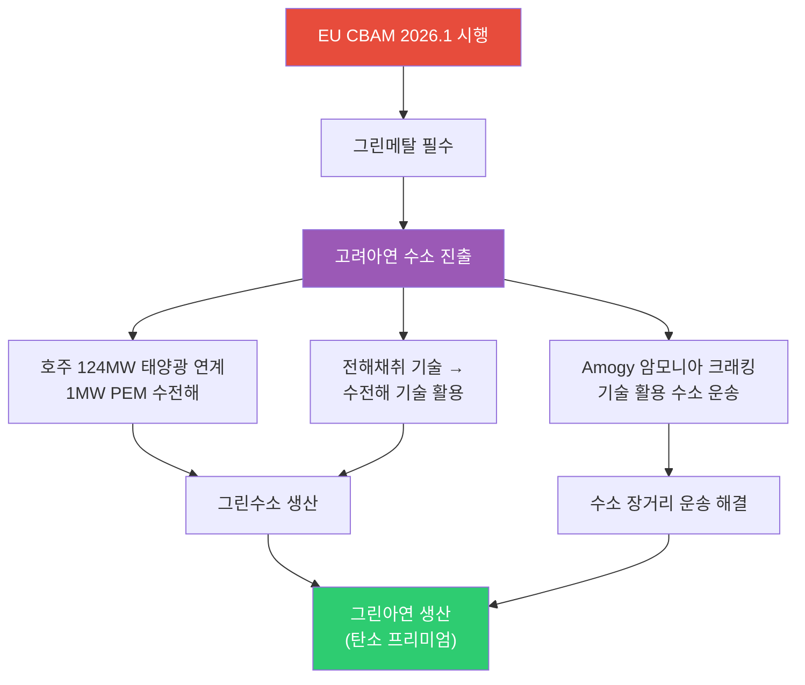

| 항목 | 내용 |
|------|------|
| **EU CBAM** | 2026.1 시행 → 탄소 배출 높은 금속에 관세 부과, 그린메탈 전환 필수 |
| **호주 PEM 수전해** | 124MW 태양광 연계 1MW PEM 수전해 설비 → 그린수소 생산 |
| **전해채취 → 수전해** | 아연 전해채취(electrolytic extraction) 기술을 수전해(water electrolysis)에 활용 |
| **Amogy 암모니아 크래킹** | 수소를 암모니아로 변환 후 운송, 도착지에서 크래킹으로 수소 추출 → 장거리 운송 해결 |

> **투자 시사점**: 고려아연의 수소 진출은 단순 에너지 사업이 아니라 **CBAM 대응을 위한 그린메탈 전환 전략**입니다. 전해채취 기술 노하우를 수전해에 활용하는 것은 기술적 시너지가 크며, Amogy 암모니아 크래킹을 통한 수소 운송은 수소 인프라 부재의 근본 과제를 해결하는 접근입니다.

### 6.3 주요 종목

| 종목 | 시장 | 핵심 포인트 |
|------|------|-----------|
| **고려아연** | KRX | EU CBAM 대응, 호주 PEM 수전해, 그린메탈 전환 (3/12 신규) |
| **두산퓨얼셀** | KRX | SOFC 양산, 2026 매출 6,900억 목표 |
| **효성첨단소재** | KRX | 탄소섬유 수소탱크 핵심 소재 |
| **Plug Power (PLUG)** | NASDAQ | 전해조+운송+충전 수직계열화 |
| **Bloom Energy (BE)** | NYSE | SOFC 2GW 생산 확대 |
| **Air Products (APD)** | NYSE | NEOM 그린수소 독점 오프테이커 |

---

## 7. AI 데이터센터 전력 수요 (구조적 메가트렌드 지속)

호르무즈 위기에도 불구하고 AI 전력 수요라는 구조적 메가트렌드는 **변함없이 진행** 중입니다.

### 7.1 빅테크 CAPEX: 역대 최대 $690B

| 기업 | 2026 CAPEX (추정) | 주요 프로젝트 | 전력 관련 이슈 |
|------|-----------------|-------------|-------------|
| **Amazon** | ~$200B | 역대 최대 단일 연도 기업 투자 | 원전 PPA 적극 추진 |
| **Google** | $175~185B | 2025년 $91B 대비 2배 | 소형원전(SMR) 투자 |
| **Meta** | $115~135B | 오하이오 1GW DC, 루이지애나 5GW 규모 DC | 재생에너지 PPA 확대 |
| **Microsoft** | ~$120B+ | Azure $80B 수주잔고(전력 부족으로 미이행) | **전력 병목이 성장 제약** |
| **합계** | **~$690B** | AI 인프라 역대 최대 | 전력이 핵심 병목 |

### 7.2 전력 수요 전망

- **데이터센터 전력 소비**: 2026년 **1000TWh**에 도달 전망 → 글로벌 원전 발전량의 **1/3** 수준
- **Deloitte 전망**: 미국 AI 데이터센터 전력 수요 4GW(2024) → 123GW(2035)
- **IEA 전망**: 글로벌 데이터센터 전력 소비 2024~2030년 **2배 이상 증가**
- **xAI/Tesla**: 두산에너빌리티로부터 가스터빈 5기 수주, 추가 15기 예상

---

## 8. 에너지 하위 섹터별 투자 매력도 비교

### 8.1 종합 평가표 (3/21 업데이트)

| 하위 섹터 | 단기 모멘텀 (6M) | 중기 성장성 (2~3Y) | 장기 구조적 (5Y+) | 리스크 | 종합 투자 매력도 |
|----------|:-:|:-:|:-:|---------|:-:|
| **원전/SMR** | ★★★★★ | ★★★★★ | ★★★★★ | 인허가 지연, 건설 초과비용 | **S (최상)** |
| **ESS** | ★★★★★ | ★★★★★ | ★★★★ | 안전성, LFP 공급과잉 | **A+** |
| **Oil & Gas** | ★★★★★ | ★★★★ | ★★ | 유가 $100-120 기본, $150 강세, 금리인상 리스크 | **A (상향)** |
| **재생에너지** | ★★★★★ | ★★★★ | ★★★★ | 중국 과잉공급, 정책 불확실성 | **A (상향 모멘텀)** |
| **수소** | ★★★☆ | ★★★★ | ★★★★★ | 높은 생산비용, 인프라 부재 | **A-** |

> **3/21 평가 변경 사항**:
> - **Oil & Gas (A- → A 상향)**: 이라크 불가항력 + Kharg Island 공습 + 미군 증파로 다중 공급 차질. 기본 시나리오 $120(1-3개월), 강세 $150. 분쟁 이후 +80% 누적 상승. IEA "역사상 최대 에너지 안보 위협". 다만 FOMC 인플레 경로(PCE 2.7%, 금리인상 50%)가 수요 파괴 통한 자기 조정 리스크.
> - **인플레이션 경로 신규 리스크**: FOMC PCE 2.7% 상향, CPI 3%+ 재진입 가능, CME 금리인상 확률 50%(10월). 금 $4,492(-10% 주간) — "higher-for-longer가 금을 죽인다." 에너지 인플레가 매파적 연준을 강제하면서 모든 자산군에 영향.
> - **금 급락과의 연관**: 에너지발 인플레 → 금리인상 기대 → 금 매도(-10% 주간). 유가 $100+ 장기 지속 시 금리인상이 현실화되면 성장주·기술주·부동산 전반에 하방 압력.

### 8.2 섹터별 시장 규모 전망

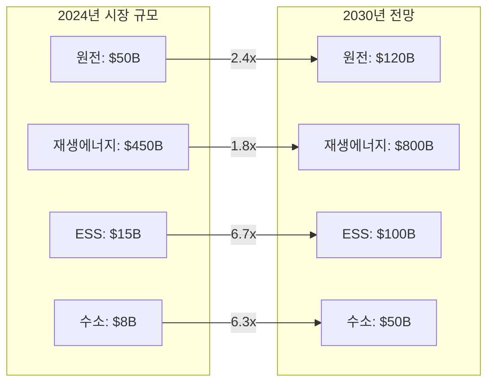

---

## 9. 투자 전략: 호르무즈 시나리오별 대응

### 9.1 포트폴리오 구성 제안

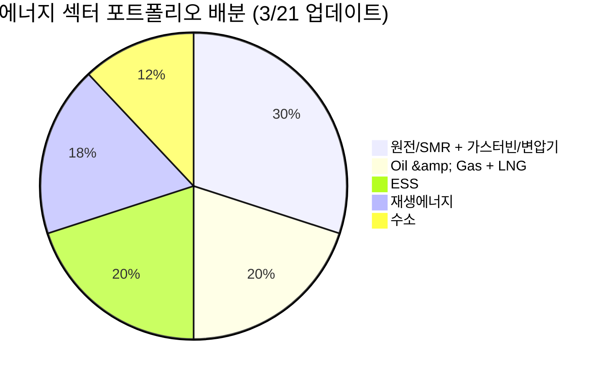

### 9.2 시나리오별 전략 (3/21 업데이트)

| 시나리오 | 확률 | 유가 전망 | 최적 전략 |
|---------|:---:|---------|---------|
| **봉쇄 지속 + LNG 부족** | **40%** | Brent $100-120 | 원전/ESS 중심, Oil/LNG 노출 확대, 인플레 헤지 필수 |
| **위기 확전·장기화** | **35%** ↑ | 기본 $120, 강세 $150 | 에너지 전체 강세, 방어주 병행, 금리인상 대비(듀레이션 축소) |
| **호르무즈 개방 + 제재 완화** | 15% ↓ | Brent $80-91 (BNEF) | Oil 축소, LNG 유지 (카타르 부족 구조적), 클린에너지 확대 |
| **외교적 해결 (1-2개월)** | 10% | WTI $70-80 | Oil 대폭 축소, 원전/클린에너지 집중, LNG 구조적 부족 유지 |

> **3/21 전략 변경**: "위기 확전·장기화" 확률 상향(25%→35%)으로 **인플레이션 경로 대비**가 핵심. 금리인상 확률 50% → 듀레이션이 긴 자산(장기채, 성장주) 비중 점검 필요. 금(-10% 주간)이 보여주듯 "higher-for-longer" 환경에서는 전통적 안전자산도 약세 가능. **에너지 인플레 수혜주(업스트림) + 단기 듀레이션 + 방어주**가 최적 조합.

### 9.3 리스크 요인

| 리스크 | 영향 | 대응 |
|--------|------|------|
| **Kharg Island 점령/파괴** | 이란 원유 90%(1.5M bpd) 완전 차단 → $150+ 시나리오 | 에너지 업스트림 최대 비중, 경기침체 헤지 병행 |
| **FOMC 금리인상 (10월)** | 에너지 인플레 → 매파적 연준, 성장주·장기채·부동산 하방 | 듀레이션 축소, 단기채, 에너지 인플레 수혜주 집중 |
| **CPI 3%+ 재진입** | PCE 2.7%에서 추가 상승, 스태그플레이션 리스크 | 에너지+방어주 조합, 금은 higher-for-longer에 취약 |
| **이라크 불가항력 장기화** | 산유국 수출 중단 도미노, 추가 공급 차질 | 업스트림+미드스트림 비중 확대 |
| **카타르 LNG 복구 지연 (3-5년)** | LNG 구조적 부족 장기화, 천연가스 가격 상승 지속 | LNG 대체 공급원(미국 LNG 수출) 관련주, 천연가스 노출 |
| **호르무즈 폐쇄 지속** | 분석가 강세 시나리오 $150, 걸프 복구 6개월(IEA) | 에너지 전체 강세, 방어주 병행 |
| **Re-commissioning 장기화** | 봉쇄 해제 후에도 공급 부족 지속 (600만 배럴 감산) | 원유 업스트림 장기 보유 |
| **경기침체 (수요 파괴)** | 유가 $100+ → 인플레 → 금리인상 → 수요 감소 | 고배당 유틸리티, 현금흐름 우수 기업 |
| **IRA 축소/폐지** | 재생에너지, 수소, ESS 타격 | 미국 외 지역 분산 |

---

## 핵심 데이터 요약

| 지표 | 수치 | 출처/기준 |
|------|------|----------|
| **Brent 유가** | **$112.19 (+3.26%)** | 2026.3.21, 2022년 이후 최고 |
| **WTI 유가** | **$98.32 (+1.94%)** | 2026.3.21, $100 돌파 임박 |
| **유가 누적 상승** | **+80%** | 분쟁 시작 이후 |
| **이라크** | **불가항력 선언** | 이란전 여파로 수출 중단 |
| **Kharg Island** | **미군 공습** | 이란 원유 수출 90% (1.5M bpd) |
| **미군 증파** | **해병대 2,500명 + 군함 3척** | WSJ |
| **Kharg 점령 검토** | **트럼프 행정부 내부 논의** | Axios (미확정) |
| **분석가 전망** | **기본 $120 (1-3개월), 강세 $150** | 컨센서스 |
| **IEA 경고** | **"역사상 최대 에너지 안보 위협"** | 걸프 복구 6개월 |
| **FOMC PCE** | **2.7% 상향** | 원유 30% + 관세 70% |
| **CPI 전망** | **3%+ 재진입 가능** | 유가 $100+ 지속 시 |
| **금리인상 확률** | **CME 50% (10월까지)** | 전쟁 지속 시 |
| **금 (Gold)** | **$4,492 (-2.36%, 주간 -10%)** | higher-for-longer 매도 |
| **카타르 LNG 공격 (3/20)** | 17% 파괴 (12.8M톤/년), 복구 3-5년 | 이란 보복, 연간 $20B 손실 |
| **산유국 감산** | **600만 배럴/일** | 사우디·이라크·UAE·쿠웨이트 |
| **미국 국방예산** | **$1.01T (+13.4%)** | 에너지 안보 우선 |
| **미국 원전 펀딩** | **$80B** | 신규 원전 건설 |
| **AI DC 전력 성장** | **5x** | 2030년까지 |
| XLE | **$59.31 (-0.08%)** | 상대적 안정 |
| 빅테크 2026 CAPEX | ~$690B | Futurum |
| DC 전력 소비 (2026) | 1000TWh | 글로벌 원전의 1/3 |
| 미국 AI DC 전력 (2035) | 123GW | Deloitte |
| 미국 2026 태양광 신규 | 44.5GW | EIA |
| 미국 2026 ESS 신규 | 24.3GW | EIA |
| ESS 시장 규모 (2035) | $521B | 시장조사 |
| 2026 신규 원자로 | 15기 (12GW) | 글로벌 |
| 우라늄 GS 목표가 | $91/lb (2026말) | Goldman Sachs |
| 한국 에너지 자급률 | 19% | 중동 원유 70% + 카타르 LNG 수입 |
| ESS 마진 | 20%+ (vs EV 8%) | LG에너지솔루션 |

---

## 결론

2026년 3월 21일, 이라크 불가항력 선언 + Kharg Island 공습 + 미군 증파로 중동 에너지 위기가 **다중 전선으로 확전**되었습니다. Brent는 **$112.19**(2022년 이후 최고)에 도달했고, 분쟁 시작 이후 **80% 급등**했습니다. IEA는 **"역사상 최대 글로벌 에너지 안보 위협"**이라 경고했습니다.

**3/21 핵심 변화**:
- **이라크 불가항력 선언** — 이란전 여파로 석유 수출 중단, 산유국 수출 도미노 리스크
- **Kharg Island 공습** — 이란 원유 수출의 90%(1.5M bpd) 처리 시설, 직접 타격/점령 시 이란 원유 완전 차단
- **미군 증파** — 해병대 2,500명 + 군함 3척 추가(WSJ), 트럼프 Kharg 점령 검토(Axios)
- **유가**: Brent $112.19(+3.26%), WTI $98.32(+1.94%), 분쟁 이후 +80%
- **분석가 전망**: 기본 $120/bbl(1-3개월), 강세 $150/bbl
- **IEA**: "역사상 최대 에너지 안보 위협", 걸프 복구 6개월
- **FOMC 인플레**: PCE 2.7% 상향(원유 30%+관세 70%), CPI 3%+ 재진입 가능
- **금리인상**: CME 50% 확률(10월까지, 전쟁 지속 시)
- **금 급락**: $4,492(-2.36%, 주간 -10%) — higher-for-longer가 금 매도 촉발

**투자 우선순위** (3/21 업데이트):
1. **원전/SMR + 가스터빈/변압기** (30%): 두산에너빌리티, BH, 현대일렉트릭, 효성중공업, Cameco — **$80B 펀딩 + AI DC 5x**, 에너지 안보 핵심
2. **Oil & Gas + LNG** (20%, 상향): ExxonMobil, ConocoPhillips, 미국 LNG 수출 — 이라크 불가항력 + Kharg 공습, 기본 $120, 강세 $150. 인플레 수혜
3. **ESS** (20%): LG에너지솔루션, 삼성SDI — 그리드 안정화 필수, 마진 20%+ 우위
4. **재생에너지** (18%): CS윈드, 한화솔루션, First Solar — 화석연료 다중 충격으로 에너지 전환 가속
5. **수소** (12%): 고려아연, 두산퓨얼셀 — EU CBAM 대응 + Amogy 운송 솔루션

> **신규 리스크 경고**: 에너지 인플레 → FOMC 매파 → 금리인상(50% 확률) 경로가 형성 중. 유가 $100+ 장기 지속 시 금(-10% 주간)뿐 아니라 **성장주·장기채·부동산** 전반에 하방 압력. 포트폴리오 듀레이션 점검 필요.
