> **시리즈 안내**: 이 글은 에너지 섹터 종합 전망입니다. 하위 섹터별 상세 분석은 아래 링크를 참고하세요.
> - [재생에너지 (태양광/풍력) 상세 분석](/knowledge/invest/2026/03/07/renewable-energy-outlook-2026.html)
> - [ESS (에너지 저장 시스템) 상세 분석](/knowledge/invest/2026/03/07/ess-energy-storage-outlook-2026.html)
> - [수소 에너지 상세 분석](/knowledge/invest/2026/03/07/hydrogen-energy-outlook-2026.html)
> - [원전/SMR 상세 분석](/knowledge/invest/2026/01/21/nuclear-power-sector-outlook-2026.html)

---

## 5/5 핵심 요약: WTI ~$102·Brent $126·이란 저장고 포화 임박·협상 교착·OPEC+ 6월 증산·UAE OPEC 탈퇴

WTI **~$102**(실시간, FRED $99.89 지연), Brent **$126**으로 반등했습니다. **이란 원유 저장고 포화가 임박**했습니다 — 총 1억 배럴 용량 중 5천만 배럴이 이미 채워졌고, 하루 100~150만 배럴씩 채워져 **1~2개월 내 포화** 상태가 됩니다. 이란은 노후 유전 특성상 생산 중단이 불가능(중단 시 물층 침입→복구 수백억 달러, 생산량 20~30% 영구 감소 위험).

**핵심: 협상 교착 지속**. 이란 "종전+호르무즈 재개" vs 미국 "핵 먼저" 딜레마 구조. 이란 핵협상에서 우라늄 농축 동결 15년 + 3.5~5% 상한이 시사되었으나(2015 핵합의와 유사), 최종 합의까지 갈 길이 멉니다. **역봉쇄 효과**: 이란 혁명수비대 연간 40~50조원 자금줄 차단, 헤즈볼라/후티/하마스 자금 고갈.

**OPEC+ 6월 증산** 발표로 유가 하락 기대가 있으나, **UAE OPEC 탈퇴**(쿼터 300만→실제 생산 능력 500만 배럴 목표)가 변수. **카타르 LNG 17% 손상**(복구 3~5년)으로 한국 전기료 구조적 위협(한국 카타르 의존도 20%). 미국 LNG 패권 강화 중(헨리허브 안정 + 수출 LNG 가격 상승: 2026년 $17→2027년 $19).

| 항목 | 4/9 | **5/5** | 변화 |
|------|------|---------|------|
| **WTI** | $97.62 | **~$102** | 반등, FRED $99.89 지연 |
| **Brent** | $97.39 | **$126** | 중동 리스크 프리미엄 확대 |
| **핵심 이벤트** | 이란-미 2주 휴전 + 이스라엘 레바논 공습 | **이란 저장고 포화 임박 + 협상 교착** | 1~2개월 내 포화 →협상 압력 상승 |
| **이란 생산** | 호르무즈 재차단 | **생산 중단 불가(노후 유전 특성)** | 영구 감소 리스크로 중단 못해 |
| **역봉쇄 효과** | - | **연 40~50조원 자금줄 차단** | 헤즈볼라/후티/하마스 자금 고갈 |
| **OPEC+ 증산** | - | **6월 7개국 증산 발표** | 유가 하락 압력 |
| **UAE** | OPEC 쿼터 준수 | **OPEC 탈퇴 (500만 배럴 목표)** | 실제 생산 능력으로 증산 |
| **카타르 LNG** | 17% 파괴 | **복구 3~5년, 한국 전기료 위협** | 한국 카타르 의존도 20% |
| **미국 LNG** | - | **$17(2026)→$19(2027)** | 수출 LNG 가격 상승 |
| **XLE** | $58.05 (-3.5%) | **$59.39 (+0.92%)** | 에너지 섹터 +1.42% (NASDAQ) |
| **시나리오** | 외교 ~35%, 교착 ~35%, 에스컬 ~25%, 봉쇄 ~5% | **교착+군사 55%, 외교 돌파 25%, 재에스컬 20%** | 저장고 포화 → 1~2개월 내 협상 압력 |

---

## 에너지 섹터 구조: 이란 저장고 포화 임박·협상 교착·OPEC+ 증산·UAE 탈퇴

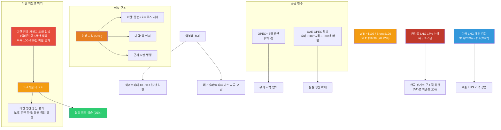

---

## 1. 중동 위기: 이란 저장고 포화 임박·협상 교착·역봉쇄 효과 (5/5)

### 1.0 핵심 업데이트: 이란 저장고 포화 + 협상 딜레마 + 역봉쇄 효과

5월 5일 기준, **이란 원유 저장고 포화가 1~2개월 내로 임박**했습니다. 총 1억 배럴 용량 중 이미 5천만 배럴이 채워진 상태이며, 하루 100~150만 배럴씩 쌓이고 있어 빠르면 6~7월 포화 상태에 도달합니다. 이란은 노후 유전 특성상 **생산 중단이 사실상 불가능** — 중단 시 물층이 침입해 복구에 수백억 달러가 필요하고 생산량 20~30%의 영구 감소 위험이 있습니다.

**협상 구조적 교착**: 이란 "종전+호르무즈 재개" vs 미국 "핵 먼저" 딜레마. 이란 핵협상에서 우라늄 농축 동결 15년 + 3.5~5% 상한이 시사되었으나(2015 핵합의 수준), 양측의 선결 조건이 충돌하며 협상이 막혀 있습니다. 한편 **역봉쇄의 실질적 효과**가 가시화되고 있습니다 — 이란 혁명수비대의 연간 40~50조원 자금줄이 차단되면서 헤즈볼라, 후티, 하마스의 자금도 고갈되고 있습니다.

| 항목 | 내용 |
|------|------|
| **이란 저장고** | 총 1억배럴 중 5천만 이미 채움, 하루 100~150만 배럴 증가 → 1~2개월 내 포화 |
| **이란 생산 중단 불가** | 노후 유전: 중단 시 물층 침입, 복구 수백억 달러, 생산량 20~30% 영구 감소 위험 |
| **협상 교착** | 이란 "종전+호르무즈 재개" vs 미국 "핵 먼저" — 선결 조건 충돌 |
| **이란 핵협상** | 우라늄 농축 동결 15년 + 3.5~5% 상한 시사 (2015 핵합의와 유사) |
| **역봉쇄 효과** | 혁명수비대 연 40~50조원 자금줄 차단, 헤즈볼라/후티/하마스 자금 고갈 |
| **WTI** | **~$102** (실시간, FRED $99.89 지연) |
| **Brent** | **$126** |
| **OPEC+ 증산** | 6월 7개국 증산 발표 → 유가 하락 압력 |
| **UAE OPEC 탈퇴** | 쿼터 300만 배럴 → 실제 생산 능력 500만 배럴 목표 |
| **카타르 LNG** | 17% 손상, 복구 3~5년, 한국 전기료 구조적 위협 (카타르 의존도 20%) |
| **미국 LNG** | 헨리허브 안정 + 수출 가격 $17(2026)→$19(2027) |
| **XLE** | **$59.39 (+0.92%)** — 에너지 섹터 +1.42% (NASDAQ) |

> **핵심**: 이란 저장고 포화(1~2개월 내)가 협상의 새로운 압박 요인입니다. 생산을 멈출 수도, 무한정 계속 저장할 수도 없는 이란의 딜레마가 외교 돌파(25%)의 시간표를 만들고 있습니다. 그러나 협상 교착 구조가 여전히 강해 단기 타결보다 교착+군사 작전 병행(55%)이 기본 시나리오입니다.

### 1.1 상황 변화 타임라인

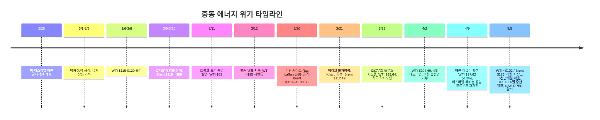

### 1.2 유가 변동 요인 (5/5)

| 요인 | 방향 | 내용 |
|------|:----:|------|
| **이란 저장고 포화 임박** | 상승(단기) | 1~2개월 내 포화 → 협상 압박 증가, Brent $126 지지 |
| **이란 생산 중단 불가** | 상승(구조) | 노후 유전 특성: 물층 침입 위험 → 공급 감소 쉽지 않아 |
| **협상 교착** | 상승 | 이란 "종전+호르무즈" vs 미국 "핵 먼저" 딜레마 |
| **역봉쇄 효과** | 상승(중기) | 혁명수비대 자금줄 차단 → 친이란 무장 세력 약화 |
| **OPEC+ 6월 증산** | 하락 | 7개국 증산 발표 → 유가 하락 압력 |
| **UAE OPEC 탈퇴** | 하락(장기) | 실제 생산 능력(500만 배럴)으로 증산 목표 |
| **카타르 LNG 손상** | 상승(LNG) | 17% 파괴, 복구 3~5년 → LNG 가격 구조적 상승 |
| **미국 LNG 패권** | - | 수출 가격 상승($17→$19), 미국 수혜 |
| **원전 구조적 강세** | - | AI 전력 수요, 유가 무관 |

### 1.3 핵심 리스크: 이란 저장고 포화 + 협상 교착 + OPEC+ 공급 변수

- **이란 저장고 포화 시계**: 1~2개월 내 포화 상태. 이란의 선택지는 ① 협상 타결, ② 밀수/우회 수출 확대, ③ 군사적 돌파 중 하나. 모두 시장 변동성 확대 요인
- **이란 생산 중단 불가 딜레마**: 저장고가 포화되어도 생산을 멈출 수 없는 노후 유전 특성 → 공급 감소보다 협상 타결 가능성 높아짐 (외교 돌파 25% 근거)
- **협상 교착 구조**: 이란 "종전+호르무즈 재개" vs 미국 "핵 먼저" 선결 조건 충돌. 단기 타결 가능성 낮고 교착+군사 55%가 기본 시나리오
- **OPEC+ 증산 불확실성**: 6월 증산 발표가 실제 유가를 얼마나 낮출지 불투명. UAE 탈퇴 변수까지 더해 OPEC 공조 약화 가능
- **카타르 LNG 구조적 손상**: 복구 3~5년. 한국 등 카타르 의존국은 대체 소스 확보 필요. 한국 전기료 장기 상승 압력
- **역봉쇄 지속 효과**: 이란 혁명수비대 자금 차단 → 중동 불안정 요인 약화 중이나 즉각적 협상 타결로 이어지지는 않음

### 1.4 산유국 대규모 감산: 600만 배럴

저장시설 포화로 인해 산유국들이 **역대급 감산**에 돌입했습니다.

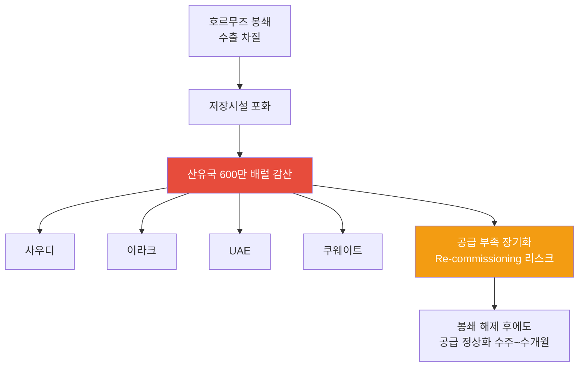

| 국가 | 감산 참여 | 상황 |
|------|:--------:|------|
| **사우디** | O | 최대 규모 감산, 저장시설 포화 대응 |
| **이라크** | O | **3/21 불가항력 선언** — 이란전 여파로 수출 중단, 저장 잔여 극소 |
| **UAE** | O | 생산 감축 지속 |
| **쿠웨이트** | O | 저장 포화 대응 중 |
| **합계** | - | **총 600만 배럴/일 감산** |

> **투자 시사점**: 600만 배럴 감산은 단순 봉쇄 대응이 아니라, **Re-commissioning 리스크**를 수반합니다. 유정 셧다운 후 재가동에 수주~수개월이 소요되므로, 전쟁이 종결되더라도 공급 정상화에는 시간이 필요합니다. 중기적으로 유가 $70-80 레벨이 하한선이 될 가능성이 있습니다.

### 1.5 국가별 에너지 취약성

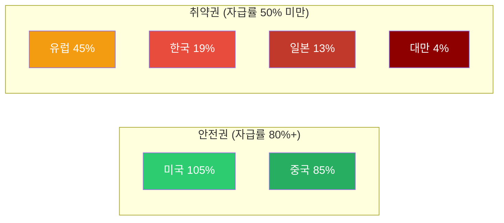

| 국가 | 에너지 자급률 | 호르무즈 영향 | GS 분석 |
|------|:-----------:|------------|---------|
| **미국** | 105% | 매우 낮음 | 순 수출국, 유가 상승 수혜, 제조업 노출 제한적 |
| **중국** | 85% | **가장 적음** | 석유 의존도 9%, 러시아 대체 루트 (Goldman Sachs) |
| **유럽** | 45% | 높음 | LNG 의존, 가스가격 +60% |
| **한국** | 19% | **매우 높음** | 중동 원유 70% 의존 |
| **일본** | 13% | **매우 높음** | 중동 원유 90%+ 의존 |
| **대만** | 4% | **극심** | 거의 전량 수입 |

> **Goldman Sachs 핵심 분석**: 중국이 이번 오일 쇼크에서 **가장 적은 영향**을 받을 것으로 전망. 자급률 85%에 석유 의존도 9%, 러시아 파이프라인 대체 루트까지 확보. 호르무즈 톨부스 시스템에서도 중국 선박은 **통과 허용**. 반면 **한국·일본·대만이 실질적 피해국**입니다.

> **4/9 휴전과 취약국**: 2주 휴전으로 유가가 -13% 급락했으나, **사우디 $19.5 역대급 프리미엄**이 보여주듯 실물 공급 경색은 지속 중. 한국·일본·대만의 에너지 취약성은 여전하며, 이란의 호르무즈 재차단(이스라엘 공습 보복)은 휴전에도 불구하고 통행 리스크가 해소되지 않았음을 의미합니다. 호르무즈 통행료(선박 $200만, 배럴당 +$1~3 순비용)는 에너지 수입국에 추가 부담 구조를 고착화하고 있습니다.

### 1.6 원자재 사이클: 에너지 다음은 식량

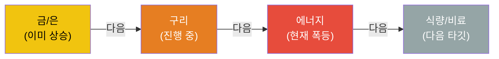

원자재 상승 사이클은 통상 **금/은 → 구리 → 에너지 → 식량/비료** 순서로 전파됩니다. 현재 에너지 단계에서 폭등이 진행 중이며, 다음은 식량/비료 섹터 상승이 예상됩니다.

---

## 2. 하위 섹터 1: Oil & Gas (유가 $100+ 구간 지속, 협상 변수 주시)

### 2.1 XLE $59.39 (+0.92%): 유가 $100+ 구간 회복, 이란 저장고 포화 → 협상 가능성

XLE이 **$59.39(+0.92%)**로 상승했습니다. WTI ~$102, Brent $126으로 유가가 $100+ 구간을 유지하며 에너지주도 반등. 이란 저장고 포화 임박(1~2개월)이 협상 압박을 높이고 있으나, OPEC+ 6월 증산 발표와 UAE OPEC 탈퇴가 유가 하락 압력으로 작용 중. 에너지 섹터 +1.42%(NASDAQ).

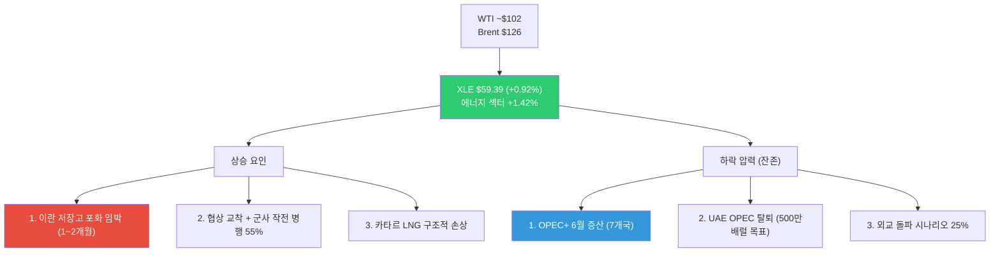

| 요인 | 방향 | 설명 |
|------|:----:|------|
| **이란 저장고 포화 임박** | 상승 | 1~2개월 내 포화 → 협상 또는 군사 압박 강화 |
| **협상 교착 + 군사 55%** | 상승 | 기본 시나리오: 교착+군사 작전 병행 |
| **카타르 LNG 손상** | 상승(LNG) | 17% 파괴, 복구 3~5년, LNG 가격 구조적 상승 |
| **OPEC+ 6월 증산** | 하락 | 7개국 증산 발표, 유가 하락 압력 |
| **UAE OPEC 탈퇴** | 하락(장기) | 쿼터(300만)→실제 능력(500만) 증산 목표 |
| **외교 돌파 가능성** | 하락 | 이란 저장고 포화 → 협상 압박 25% |

> **핵심 판단**: 이란 저장고 포화(1~2개월 내)가 단기 변동성의 핵심 트리거입니다. 포화 도달 시 협상 타결(유가 급락) 또는 군사적 돌파(유가 급등) 양방향 리스크가 확대됩니다. 현재는 교착+군사 55% 기본 시나리오에서 유가 $100+ 구간 유지 중. XLE 보유 유효하나, **이란 저장고 포화 시점(6~7월)이 다음 결정적 분기점**.

### 2.2 Oil & Gas 업스트림/미드스트림/다운스트림

| 세그먼트 | 현재 상황 | 수혜/위험 | 주요 종목 |
|---------|---------|---------|---------|
| **업스트림 (탐사/생산)** | 미국 셰일 풀가동 인센티브 | **최대 수혜**: 유가 상승 직접 반영 | ExxonMobil (XOM), Chevron (CVX), ConocoPhillips (COP) |
| **미드스트림 (파이프/저장)** | 저장 수요 급증, 미국 LNG 수출 증가 | **수혜**: 물류/저장 수수료 증가 | Enterprise Products (EPD), Kinder Morgan (KMI) |
| **다운스트림 (정유)** | 원유 조달 차질, 크랙 스프레드 확대 | **혼재**: 마진 확대 vs 원유 확보 어려움 | Valero (VLO), Marathon Petroleum (MPC) |

### 2.3 미국 에너지 독립의 의미

미국은 에너지 자급률 105%로 이번 위기에서 **상대적 안전지대**입니다.

- **미국 생산자**: 유가 상승으로 직접 수혜, 수출 증가
- **제조업**: 에너지 비용 상승 영향 제한적 (자체 생산으로 충당)
- **소비자**: 가솔린 17% 상승했으나 아시아/유럽 대비 충격 제한적
- **전략적 위치**: 글로벌 에너지 위기에서 미국 패권 강화

### 2.4 Oil & Gas 투자 전략 (5/5 업데이트)

| 시나리오 | 확률 | 유가 전망 | 전략 |
|---------|:---:|---------|------|
| **협상 교착 + 군사 작전 병행** | **55%** | WTI $100-110 | 현 포지션 유지, 업스트림/LNG 수혜주 보유 |
| **외교 돌파 (이란 저장고 포화 후 협상)** | **25%** | WTI $75-85 | Oil 대폭 축소, 클린에너지/ESS 전환 (1~2개월 내) |
| **재에스컬레이션** | **20%** | WTI $120-140 | 업스트림 확대, 에너지 인플레 수혜주 |

> **5/5 시나리오**: 이란 저장고 포화 임박(1~2개월)으로 **외교 돌파 시간표가 형성** — 생산을 멈출 수 없는 이란이 저장고 포화 후 협상에 나올 가능성(25%). 그러나 협상 교착 구조(이란 "종전+호르무즈" vs 미국 "핵 먼저")가 강해 기본 시나리오는 교착+군사 55%. OPEC+ 6월 증산과 UAE 탈퇴가 추가 하락 압력으로 작용할 수 있으나, Brent $126의 중동 리스크 프리미엄은 당분간 유지 전망. **6~7월 이란 저장고 포화 시점이 다음 결정적 분기점**.

---

## 3. 하위 섹터 2: 원전/SMR (최상위 투자 매력 - 에너지 안보 핵심)

> **상세 분석**: [2026년 원전 투자 전망](/knowledge/invest/2026/01/21/nuclear-power-sector-outlook-2026.html)

### 3.1 원전/SMR: 정책·기술·수요 3박자 강세

호르무즈 위기가 원전의 에너지 안보 가치를 증명한 데 이어, **미국 $80B 신규 원전 펀딩**과 **NuScale SMR 규제 승인** 등 정책·기술 측면에서도 강력한 모멘텀이 추가되었습니다.

| 항목 | 내용 |
|------|------|
| **미국 $80B 원전 펀딩** | 신규 원전 건설을 위한 대규모 연방 펀딩 발표 (3/11) |
| **AI DC 전력 5x 성장** | AI 데이터센터 전력 수요 **2030년까지 5배 성장** 전망 |
| **NuScale SMR 규제 승인** | NRC 인증에 이어 **규제 승인** 획득, 상용화 가속 |
| **Cameco EPS +55%** | 우라늄 수요 급증으로 Cameco 실적 전망 대폭 상향 |
| **URA ETF 상승 지속** | 우라늄 가격 상승과 원전 투자 확대 반영 |
| **SMR 상용화 가시화** | 중국 링롱원 세계 최초 상업용 육상 SMR **2026년 상반기 가동** |
| **글로벌 원전 확대** | 2026년 신규 원자로 15기(12GW) 가동 예정 |
| **에너지 안보** | 호르무즈 위기 → 자급률 19% 한국에 원전 필수불가결 |
| **SMR 특별법** | 2026.2.12 국회 통과 → i-SMR 상용화 가속 |
| **우라늄 전망** | Goldman Sachs 목표가 $91/lb (2026년 말) |

### 3.2 2026년 원전 가동 타임라인

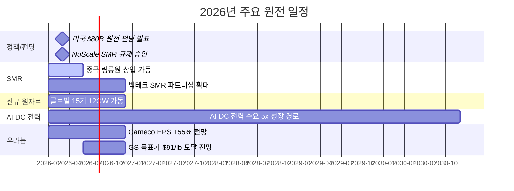

### 3.3 주요 종목

| 종목 | 시장 | 핵심 포인트 | 리스크 |
|------|------|-----------|--------|
| **두산에너빌리티** | KRX | **대장주**. SMR 기자재 독점, 원전 EPC, xAI 가스터빈 5기 수주 | 건설 지연 |
| **BH** | KRX | 가스터빈과 세트 (보일러/스팀), 두산에너빌리티 동반 수혜 | 가스터빈 수주 의존 |
| **한전기술** | KRX | i-SMR 설계 주관사 | 매출 인식 시점 |
| **현대일렉트릭** | KRX | **765kV 초고압 변압기** 생산 가능 극소수 기업, 수작업 필수 | 납기 지연 |
| **효성중공업** | KRX | 초고압 변압기 핵심 기업, 글로벌 수요 급증 | 원자재 가격 |
| **NuScale (SMR)** | NYSE | NRC 인증 유일 SMR | 상용화 지연 |
| **Cameco (CCJ)** | NYSE | 우라늄 채굴 1위, GS 목표가 $91/lb | 우라늄 가격 변동 |
| **Oklo (OKLO)** | NYSE | Meta 1.2GW PPA 체결 | 기술 검증 미완 |

> **변압기 투자 포인트**: 데이터센터·원전·재생에너지 모두 변압기가 필수이며, 특히 765kV급 초고압 변압기는 전 세계에서 **극소수 기업만 생산 가능**하고, 자동화가 불가능한 **수작업** 공정으로 공급 병목이 심각합니다.

---

## 4. 하위 섹터 3: 재생에너지 (대안 에너지 수혜 + 구조적 성장)

> **상세 분석**: [2026년 재생에너지 투자 전망](/knowledge/invest/2026/03/07/renewable-energy-outlook-2026.html)

### 4.1 고유가 → EV 전환 가속 + 청정에너지 전환 강화

4/9 유가 급락(-13%)으로 EV 전환 인센티브가 일부 약화될 가능성이 있습니다. 이전까지 고유가가 **EV 전환을 가속**시켜 왔으나(한국 +172%, 유럽 급증), 유가 하락 시 전환 속도가 둔화될 수 있습니다. 다만 원전은 AI 전력 수요로 유가와 무관한 구조적 강세를 유지하고, ESS/배터리는 LG에솔/LNF 신고가 이후에도 상승세가 지속되고 있어 **클린에너지 구조적 전환은 여전히 유효**합니다.

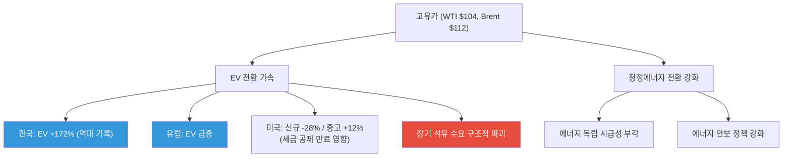

### 4.2 핵심 투자 포인트

| 항목 | 내용 |
|------|------|
| **EV 전환 가속** | 한국 +172%, 유럽 급증 — 고유가가 비미국 시장에서 EV 전환 결정적 트리거 |
| **미국 신규 용량 99%** | 2026년 신규 발전의 99%가 재생에너지+ESS |
| **태양광 44.5GW** | 미국 역대 최대 유틸리티 태양광 설치 |
| **IRA AMPC** | 미국 내 제조 보조금으로 리쇼어링 가속 |
| **ICLN** | $18.52 (+3.8%) — 클린에너지 강세, 유가 하락에도 상승 |

### 4.3 주요 종목

| 종목 | 시장 | 핵심 포인트 |
|------|------|-----------|
| **한화솔루션** | KRX | 미국 수직계열화, AMPC 수혜, 2026 판매 9GW 목표 |
| **First Solar (FSLR)** | NASDAQ | 미국 유일 대규모 태양광 제조 |
| **NextEra Energy (NEE)** | NYSE | 세계 최대 재생에너지 유틸리티, EPS $3.92~4.02 |
| **CS윈드** | KRX | 풍력 타워 글로벌 1위, **미국/유럽 현지 공장** 보유 (관세 리스크 낮음) |
| **Vestas (VWS)** | CPH | 풍력 터빈 세계 1위, 백로그 EUR 31.6B |

---

## 5. 하위 섹터 4: ESS (그리드 불안정 → 필수 인프라)

> **상세 분석**: [2026년 ESS 투자 전망](/knowledge/invest/2026/03/07/ess-energy-storage-outlook-2026.html)

### 5.1 에너지 위기가 ESS 필요성을 극대화

호르무즈 봉쇄로 인한 에너지 공급 불안정은 **그리드 안정화를 위한 ESS 수요를 폭발적으로 증가**시키고 있습니다. 재생에너지 비중 확대와 맞물려 ESS는 선택이 아닌 필수 인프라가 되었습니다.

| 항목 | 내용 |
|------|------|
| **시장 규모** | $146B(2025) → $521B(2035), CAGR 13.6% |
| **미국 신규** | 2026년 24.3GW 배터리 신규 설치 |
| **LFP 주도** | 비용/안전/수명 우위로 그리드 ESS 표준 |
| **ESS 마진 우위** | ESS 마진 20%+ vs EV 배터리 8% |
| **LIT $76.71 (+4.0%)** | 리튬/배터리 ETF 강세 = ESS/배터리 수요 견조 |

### 5.2 주요 종목

| 종목 | 시장 | 핵심 포인트 |
|------|------|-----------|
| **삼성SDI** | KRX | SBB ESS 라인업, 전고체 2027~2028 |
| **LG에너지솔루션** | KRX | 미국 ESS 90GWh 목표, LFP 30GWh, **ESS 매출 비중 20%로 확대** |
| **Tesla (TSLA)** | NASDAQ | Megapack 3, Megablock, 미국 LFP 생산 |
| **BYD** | HKEX | 나트륨이온 ESS, 30GWh 공장 착공 |
| **CATL** | SHE | 나트륨이온 2026 본격 양산, 175Wh/kg |

> **ESS 마진 우위**: LG에너지솔루션 기준 ESS 매출 비중이 10%→20%로 확대 중이며, ESS 마진(20%+)이 EV 배터리 마진(8%)을 크게 상회합니다. ESS가 배터리 기업의 수익성 개선 핵심 동력입니다.

---

## 6. 하위 섹터 5: 수소 에너지 (장기 에너지 독립 수단)

> **상세 분석**: [2026년 수소 에너지 투자 전망](/knowledge/invest/2026/03/07/hydrogen-energy-outlook-2026.html)

### 6.1 호르무즈 위기 → 에너지 독립 수단으로서의 수소 가치 재조명

수소는 단기적 수혜보다는 **장기적 에너지 독립** 수단으로 전략적 가치가 부각되고 있습니다. 호르무즈 사태가 보여주듯 화석연료 의존의 지정학적 리스크가 현실화되면서, 자국 생산 가능한 그린수소의 전략적 중요성이 높아지고 있습니다.

| 항목 | 내용 |
|------|------|
| **NEOM 프로젝트** | $8.4B, 세계 최대 그린수소, 2026~2027 완공 |
| **45V 세액공제** | 그린수소 $3/kg 보조금 (IRA) |
| **두산퓨얼셀** | SOFC 양산, 미국 DC 시장 진출 |
| **전략적 가치** | 에너지 자급을 위한 장기 솔루션 |

### 6.2 고려아연 수소 진출 (3/12 신규)

EU CBAM(탄소국경조정메커니즘) 2026.1 시행으로 **그린메탈** 전환이 필수가 되면서, 고려아연이 수소 사업에 본격 진출하고 있습니다.

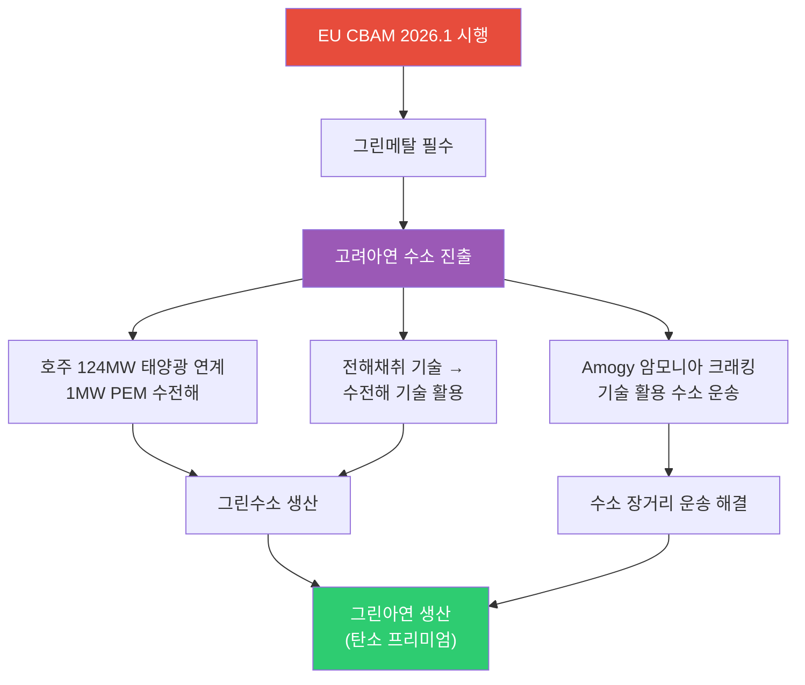

| 항목 | 내용 |
|------|------|
| **EU CBAM** | 2026.1 시행 → 탄소 배출 높은 금속에 관세 부과, 그린메탈 전환 필수 |
| **호주 PEM 수전해** | 124MW 태양광 연계 1MW PEM 수전해 설비 → 그린수소 생산 |
| **전해채취 → 수전해** | 아연 전해채취(electrolytic extraction) 기술을 수전해(water electrolysis)에 활용 |
| **Amogy 암모니아 크래킹** | 수소를 암모니아로 변환 후 운송, 도착지에서 크래킹으로 수소 추출 → 장거리 운송 해결 |

> **투자 시사점**: 고려아연의 수소 진출은 단순 에너지 사업이 아니라 **CBAM 대응을 위한 그린메탈 전환 전략**입니다. 전해채취 기술 노하우를 수전해에 활용하는 것은 기술적 시너지가 크며, Amogy 암모니아 크래킹을 통한 수소 운송은 수소 인프라 부재의 근본 과제를 해결하는 접근입니다.

### 6.3 주요 종목

| 종목 | 시장 | 핵심 포인트 |
|------|------|-----------|
| **고려아연** | KRX | EU CBAM 대응, 호주 PEM 수전해, 그린메탈 전환 (3/12 신규) |
| **두산퓨얼셀** | KRX | SOFC 양산, 2026 매출 6,900억 목표 |
| **효성첨단소재** | KRX | 탄소섬유 수소탱크 핵심 소재 |
| **Plug Power (PLUG)** | NASDAQ | 전해조+운송+충전 수직계열화 |
| **Bloom Energy (BE)** | NYSE | SOFC 2GW 생산 확대 |
| **Air Products (APD)** | NYSE | NEOM 그린수소 독점 오프테이커 |

---

## 7. AI 데이터센터 전력 수요 (구조적 메가트렌드 지속)

호르무즈 위기에도 불구하고 AI 전력 수요라는 구조적 메가트렌드는 **변함없이 진행** 중입니다.

### 7.1 빅테크 CAPEX: 역대 최대 $690B

| 기업 | 2026 CAPEX (추정) | 주요 프로젝트 | 전력 관련 이슈 |
|------|-----------------|-------------|-------------|
| **Amazon** | ~$200B | 역대 최대 단일 연도 기업 투자 | 원전 PPA 적극 추진 |
| **Google** | $175~185B | 2025년 $91B 대비 2배 | 소형원전(SMR) 투자 |
| **Meta** | $115~135B | 오하이오 1GW DC, 루이지애나 5GW 규모 DC | 재생에너지 PPA 확대 |
| **Microsoft** | ~$120B+ | Azure $80B 수주잔고(전력 부족으로 미이행) | **전력 병목이 성장 제약** |
| **합계** | **~$690B** | AI 인프라 역대 최대 | 전력이 핵심 병목 |

### 7.2 전력 수요 전망

- **데이터센터 전력 소비**: 2026년 **1000TWh**에 도달 전망 → 글로벌 원전 발전량의 **1/3** 수준
- **Deloitte 전망**: 미국 AI 데이터센터 전력 수요 4GW(2024) → 123GW(2035)
- **IEA 전망**: 글로벌 데이터센터 전력 소비 2024~2030년 **2배 이상 증가**
- **xAI/Tesla**: 두산에너빌리티로부터 가스터빈 5기 수주, 추가 15기 예상

---

## 8. 에너지 하위 섹터별 투자 매력도 비교

### 8.1 종합 평가표 (5/5 업데이트)

| 하위 섹터 | 단기 모멘텀 (6M) | 중기 성장성 (2~3Y) | 장기 구조적 (5Y+) | 리스크 | 종합 투자 매력도 |
|----------|:-:|:-:|:-:|---------|:-:|
| **Oil & Gas** | ★★★★ | ★★★★ | ★★★ | 이란 저장고 포화(외교 돌파 25%), OPEC+ 증산, UAE 탈퇴 | **A (유지, $100+ 구간 + 협상 변수 주시)** |
| **원전/SMR** | ★★★★★ | ★★★★★ | ★★★★★ | 인허가 지연, 건설 초과비용 | **S (최상, AI 전력 수요 구조적)** |
| **ESS/EV** | ★★★★★ | ★★★★★ | ★★★★★ | LFP 공급과잉 | **S (유지, 구조적 성장 불변)** |
| **재생에너지** | ★★★★★ | ★★★★ | ★★★★ | 중국 과잉공급, 정책 불확실성 | **A+ (유지)** |
| **수소** | ★★★☆ | ★★★★ | ★★★★★ | 높은 생산비용, 인프라 부재 | **A-** |

> **5/5 평가 변경 사항**:
> - **Oil & Gas (A 유지)**: WTI ~$102, Brent $126으로 $100+ 구간 회복. 이란 저장고 포화(1~2개월 내)가 협상 압박 → 외교 돌파 25% 가능성 내포. 기본 시나리오는 교착+군사 55%로 유가 $100-110 유지. OPEC+ 증산과 UAE 탈퇴가 하방 압력이나 당분간 Brent $126 중동 프리미엄 지지. **6~7월 저장고 포화 시점 전후로 방향성 결정**.
> - **ESS/EV (S 유지)**: 구조적 성장 지속. 카타르 LNG 손상으로 전기 가격 상승 → ESS 수요 증가로 이어질 수 있음.
> - **원전/SMR (S 유지)**: AI 전력 수요 + 에너지 안보 + 카타르 LNG 손상으로 원전 필요성 더욱 부각.

### 8.2 섹터별 시장 규모 전망

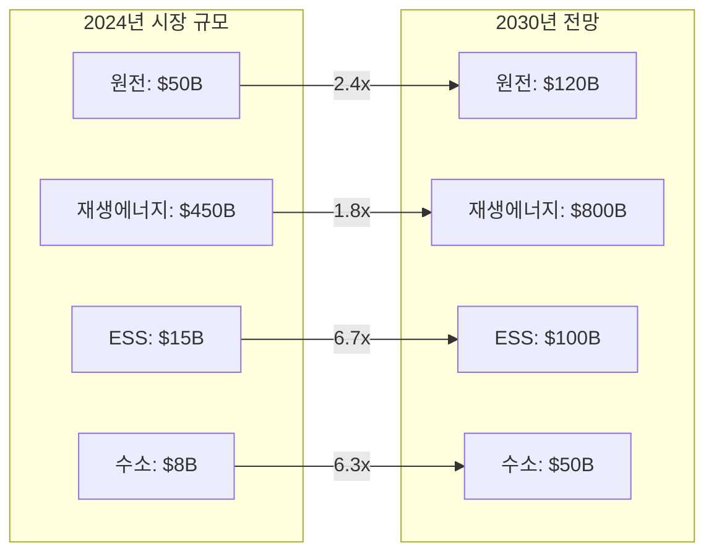

---

## 9. 투자 전략: 호르무즈 시나리오별 대응

### 9.1 포트폴리오 구성 제안

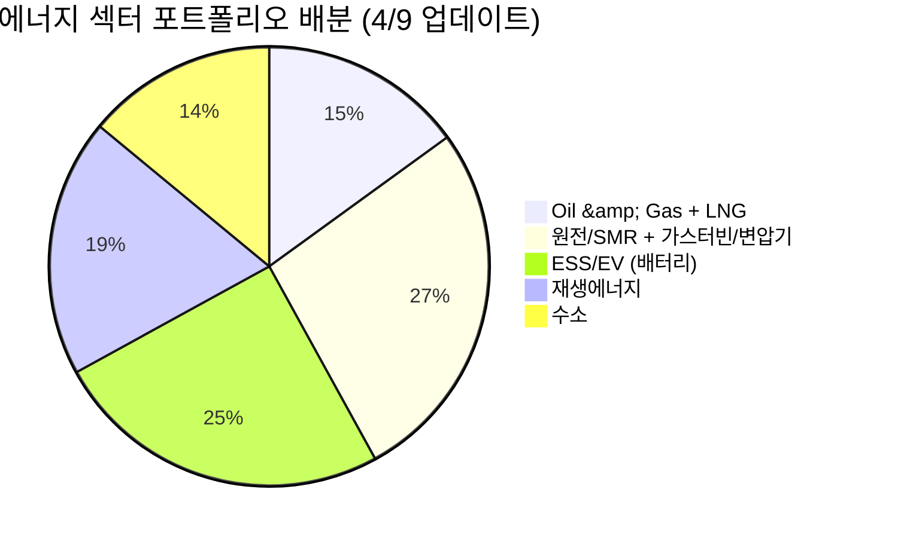

### 9.2 시나리오별 전략 (5/5 업데이트)

| 시나리오 | 확률 | 유가 전망 | 최적 전략 |
|---------|:---:|---------|---------|
| **협상 교착 + 군사 작전 병행** | **55%** | WTI $100-110 | Oil & Gas 비중 유지, 업스트림/LNG 수혜주 |
| **외교 돌파 (이란 저장고 포화 후 협상)** | **25%** | WTI $75-85 | Oil 대폭 축소, 원전/ESS/클린에너지 집중 |
| **재에스컬레이션** | **20%** | WTI $120-140 | Oil 업스트림 확대, 에너지 인플레 수혜주 |

> **5/5 전략**: 이란 저장고 포화(1~2개월 내)로 시나리오 구조가 단순화 — ① 교착+군사 55% (유가 $100-110 유지), ② 저장고 포화 후 협상 타결 25% (유가 급락 가능), ③ 재에스컬레이션 20% (유가 급등). Oil & Gas 비중 15% 유지, OPEC+ 증산 발표를 감안해 포지션 축소 준비 필요. **6~7월 이란 저장고 포화 시점이 결정적 분기점** — 이 시점 전후로 포지션 재조정 필요. 원전(AI 전력, 유가 무관)과 미국 LNG($17→$19 가격 상승)가 시나리오 무관 구조적 강세.

### 9.3 리스크 요인

| 리스크 | 영향 | 대응 |
|--------|------|------|
| **이란 저장고 포화 → 외교 돌파** | 6~7월 포화 후 협상 타결 시 유가 급락(WTI $75-85) | 6~7월 전후 Oil 포지션 축소 준비 |
| **이란 저장고 포화 → 재에스컬레이션** | 포화 돌파구로 군사 행동 택할 경우 유가 급등($120-140) | 업스트림 일부 보유 유지 |
| **OPEC+ 증산 실제 효과** | 6월 증산이 예상보다 클 경우 유가 하락 압력 | 증산 규모 발표 시 포지션 조정 |
| **UAE OPEC 탈퇴 가속** | 실질 생산 능력(500만) 활용 시 공급 과잉 가능 | LNG/미국 업스트림으로 포커스 이동 |
| **카타르 LNG 복구 지연** | 3~5년 손상 지속 → 한국 등 의존국 전기료 상승 | 미국 LNG 수혜주 (헨리허브 안정) |
| **협상 교착 장기화** | 교착이 6개월+ 지속 시 경기 침체 가능성 | 원전/ESS/방어주 비중 확대 |
| **Re-commissioning 리스크** | 600만 배럴 감산 후 재가동에 수주~수개월 소요 | 원유 업스트림 일부 보유 유지 |
| **IRA 축소/폐지** | 재생에너지, 수소, ESS 타격 | 미국 외 지역 분산 |

---

## 핵심 데이터 요약

| 지표 | 수치 | 출처/기준 |
|------|------|----------|
| **WTI 유가** | **~$102** | 2026.5.5, 실시간 (FRED $99.89 지연) |
| **Brent 유가** | **$126** | 2026.5.5, 중동 리스크 프리미엄 반영 |
| **이란 저장고** | **5천만/1억 배럴 채움** | 하루 100~150만 배럴 증가, 1~2개월 내 포화 |
| **이란 생산 중단 불가** | **물층 침입 위험** | 복구 수백억 달러, 생산량 20~30% 영구 감소 |
| **협상 교착** | **이란 "종전+호르무즈" vs 미국 "핵 먼저"** | 선결 조건 충돌, 단기 타결 가능성 낮음 |
| **이란 핵협상** | **농축 동결 15년 + 3.5~5% 상한 시사** | 2015 핵합의 수준 |
| **역봉쇄 효과** | **혁명수비대 연 40~50조원 자금 차단** | 헤즈볼라/후티/하마스 자금 고갈 |
| **시나리오 확률** | **교착+군사 55%, 외교 돌파 25%, 재에스컬 20%** | 저장고 포화 → 외교 압박 상승 |
| **OPEC+ 증산** | **6월 7개국 증산 발표** | 유가 하락 압력 |
| **UAE OPEC 탈퇴** | **쿼터 300만 → 목표 500만 배럴** | 실제 생산 능력으로 증산 |
| **카타르 LNG** | **17% 손상, 복구 3~5년** | 한국 카타르 의존도 20%, 전기료 위협 |
| **미국 LNG** | **$17(2026) → $19(2027)** | 헨리허브 안정 + 수출 가격 상승 |
| **XLE** | **$59.39 (+0.92%)** | 에너지 섹터 +1.42% (NASDAQ) |
| **산유국 감산** | **600만 배럴/일** | 사우디·이라크·UAE·쿠웨이트 |
| **미국 원전 펀딩** | **$80B** | 신규 원전 건설 |
| **AI DC 전력 성장** | **5x** | 2030년까지 |
| 빅테크 2026 CAPEX | ~$690B | Futurum |
| DC 전력 소비 (2026) | 1000TWh | 글로벌 원전의 1/3 |
| 미국 2026 태양광 신규 | 44.5GW | EIA |
| 미국 2026 ESS 신규 | 24.3GW | EIA |
| ESS 시장 규모 (2035) | $521B | 시장조사 |
| 2026 신규 원자로 | 15기 (12GW) | 글로벌 |
| 우라늄 GS 목표가 | $91/lb (2026말) | Goldman Sachs |
| 한국 에너지 자급률 | 19% | 중동 원유 70% + 카타르 LNG 수입 |
| ESS 마진 | 20%+ (vs EV 8%) | LG에너지솔루션 |

---

## 결론

2026년 5월 5일 기준, WTI **~$102**(실시간), Brent **$126**으로 유가 $100+ 구간을 유지하고 있습니다. **이란 원유 저장고 포화가 1~2개월 내로 임박** — 총 1억 배럴 중 5천만 배럴이 채워진 상태이며, 이란은 노후 유전 특성상 생산을 중단할 수 없습니다. 이 구조적 딜레마가 다음 협상의 시간표를 만들고 있습니다.

**5/5 핵심 변화**:
- **이란 저장고 포화 임박** — 1억배럴 중 5천만 채움, 하루 100~150만 배럴 → 6~7월 포화
- **이란 생산 중단 불가** — 노후 유전: 물층 침입 위험, 복구 수백억 달러, 20~30% 영구 감소
- **협상 교착** — 이란 "종전+호르무즈" vs 미국 "핵 먼저" 딜레마, 우라늄 농축 동결 15년+3.5~5% 상한 시사
- **역봉쇄 효과** — 혁명수비대 40~50조원/년 자금 차단, 헤즈볼라/후티/하마스 자금 고갈
- **OPEC+ 6월 증산** — 7개국 증산, 유가 하락 압력
- **UAE OPEC 탈퇴** — 쿼터(300만)→실제 생산 능력(500만) 목표
- **카타르 LNG 구조적 손상** — 17% 파괴, 복구 3~5년, 미국 LNG 패권 강화($17→$19)
- **시나리오 재조정** — 교착+군사 55%, 외교 돌파 25%(저장고 포화 후), 재에스컬 20%

**투자 우선순위** (5/5 업데이트):
1. **원전/SMR + 가스터빈/변압기** (27%): 두산에너빌리티, BH, 현대일렉트릭, 효성중공업, Cameco — AI 전력 수요 구조적, **유가 시나리오 무관 최안전**. 카타르 LNG 손상→원전 필요성 추가 부각
2. **ESS/EV (배터리)** (25%): LG에너지솔루션, 삼성SDI — 구조적 성장 불변, 마진 20%+ 우위
3. **재생에너지** (19%): CS윈드, 한화솔루션, First Solar — 에너지 독립 모멘텀 지속
4. **Oil & Gas + LNG** (15%): ExxonMobil, ConocoPhillips, 미국 LNG 수혜주 — $100+ 구간 유지. **6~7월 이란 저장고 포화 시점 전후로 방향성 결정**
5. **수소** (14%): 고려아연, 두산퓨얼셀 — EU CBAM 대응 + 장기 에너지 독립 수단

> **핵심 전략**: 이란 저장고 포화(1~2개월 내)가 다음 결정적 분기점입니다. 기본 시나리오(교착+군사 55%)에서 유가 $100-110 구간 유지 중이며, XLE 보유 유효. **6~7월 포화 도달 시 협상 타결(유가 급락) 또는 재에스컬레이션(유가 급등) 양방향 대비 필요**. 원전(AI 전력)과 미국 LNG(구조적 수혜)가 시나리오 무관 안전 섹터입니다.
