> **시리즈 안내**: 이 글은 에너지 섹터 종합 전망입니다. 하위 섹터별 상세 분석은 아래 링크를 참고하세요.
> - [재생에너지 (태양광/풍력) 상세 분석](/knowledge/invest/2026/03/07/renewable-energy-outlook-2026.html)
> - [ESS (에너지 저장 시스템) 상세 분석](/knowledge/invest/2026/03/07/ess-energy-storage-outlook-2026.html)
> - [수소 에너지 상세 분석](/knowledge/invest/2026/03/07/hydrogen-energy-outlook-2026.html)
> - [원전/SMR 상세 분석](/knowledge/invest/2026/01/21/nuclear-power-sector-outlook-2026.html)

---

## 4/2 핵심 요약: WTI $104 돌파·호르무즈 4/6 데드라인·바이너리 시나리오·EV 전환 가속

WTI가 **$104.69(+3.4%)**로 **$100을 돌파**했습니다. Brent는 **$112.57(+45% YTD)**로 고공행진 중입니다. 핵심 이벤트는 **4월 6일 호르무즈 데드라인**입니다. 트럼프가 이란에 대한 에너지 공격 중단을 4/6까지 연장했고, 이란에 호르무즈 재개방을 요구했습니다. 이란은 15개 항목 휴전 제안을 **거부**했습니다. 트럼프는 이란이 휴전을 원한다고 주장하나, 이란은 부인 중입니다. 선박 통행은 **하루 130척→6척**으로 급감. Macquarie는 **전면 봉쇄 지속 시 6월까지 Brent $200**, **외교적 돌파 시 수일 내 $25-30 급락하여 $80-90** 시나리오를 제시했습니다. 이란 국내 상황도 악화 중으로 **인터넷 차단 30일+, 수도 이전 논의, 수자원/인프라 위기**가 진행 중이며, 전쟁 지속 가능 시한은 **4월 말**로 추정됩니다.

한편 XLE는 **$58.97(-3.74%)**로 하락했는데, 유가 상승에도 불구하고 **시장이 휴전 기대와 유가 하락 가능성을 선반영**한 것으로 보입니다. EV 시장에서는 한국 EV 등록이 **+172%(역대 기록)**를 기록하고 유럽도 유사한 급증세를 보이며, 고유가가 **비미국 시장에서 EV 전환을 가속**시키고 있습니다. 미국은 세금 공제 만료로 신규 EV -28%이나 중고 EV +12%로 수요 이전이 관찰됩니다. 이란의 위안화 통행료 징수는 **페트로달러→페트로위안** 구조적 전환을 심화시키고 있습니다.

| 항목 | 3/28 | **4/2** | 변화 |
|------|------|---------|------|
| **WTI** | $99.64 | **$104.69 (+3.4%)** | $100 돌파, 상승 지속 |
| **Brent** | $112.57 | **$112.57 (+45% YTD)** | 고수준 유지 |
| **핵심 이벤트** | 호르무즈 톨부스 + 1973년 오일쇼크 유사성 | **4/6 호르무즈 데드라인 + 바이너리 시나리오** | 휴전 vs 확전 분기점 |
| **호르무즈** | 톨부스 시스템 | **130→6척/일, 4/6 재개방 데드라인** | 이란 15항목 휴전안 거부 |
| **Macquarie 시나리오** | - | **전면 봉쇄→$200, 외교 돌파→$80-90** | 바이너리 결과 |
| **XLE** | $62.56 (+1.69%) | **$58.97 (-3.74%)** | 휴전 기대 선반영 하락 |
| **LIT** | - | **$74.44 (+0.12%)** | EV/배터리 안정 |
| **ICLN** | $18.51 (+1.42%) | **$18.25 (-0.22%)** | 소폭 조정 |
| **EV 수요** | - | **한국 +172%, 유럽 급증, 미국 신규 -28%/중고 +12%** | 고유가→EV 전환 가속 |
| **이란 내부** | - | **인터넷 30일+ 차단, 수도 이전 논의, 인프라 위기** | 전쟁 지속 한계 4월 말 |
| **페트로위안** | 위안화 통행료 징수 | **달러 헤게모니 도전 구조적 전환** | 장기 구조 변화 |

---

## 에너지 섹터 구조: 호르무즈 4/6 데드라인·바이너리 시나리오·EV 전환 가속

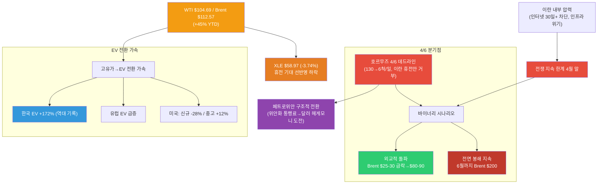

---

## 1. 중동 위기: 호르무즈 4/6 데드라인·바이너리 시나리오·이란 내부 압력 (4/2)

### 1.0 신규 이벤트: 4/6 데드라인 + Macquarie 시나리오 + 이란 국내 위기

4월 2일, 중동 에너지 위기가 **4월 6일 분기점**을 앞두고 있습니다. 트럼프가 이란에 대한 에너지 시설 공격 중단을 4/6까지 연장하면서, 이란에 호르무즈 재개방을 요구했습니다. 이란은 15개 항목 휴전 제안을 **거부**했으며, 트럼프는 이란이 휴전을 원한다고 주장하나 이란은 이를 **부인** 중입니다. 선박 통행은 **하루 130척→6척**으로 급감했습니다. Macquarie는 **전면 봉쇄 6월 지속 시 Brent $200**, **외교적 돌파 시 수일 내 $25-30 급락하여 $80-90** 시나리오를 제시하며 **바이너리 결과**를 경고했습니다.

| 항목 | 내용 |
|------|------|
| **호르무즈 4/6 데드라인** | 트럼프 에너지 공격 중단 4/6 연장, 이란에 재개방 요구 |
| **이란 휴전안 거부** | 15개 항목 휴전 제안 거부. 트럼프 "이란 휴전 원해" 주장 vs 이란 부인 |
| **선박 통행** | 하루 130척→6척 급감 |
| **WTI** | $104.69 (+3.4%) — $100 돌파 |
| **Brent** | $112.57 (+45% YTD) |
| **Macquarie 시나리오** | 전면 봉쇄 지속→Brent $200, 외교 돌파→$25-30 급락→$80-90 |
| **XLE** | $58.97 (-3.74%) — 휴전 기대 선반영 하락 |
| **이란 내부** | 인터넷 30일+ 차단, 수도 이전 논의, 수자원/인프라 위기 |
| **전쟁 지속 한계** | 4월 말 추정 |
| **페트로위안** | 위안화 통행료 → 페트로달러→페트로위안 구조적 전환 |
| **EV 수요 급증** | 한국 +172%(역대 기록), 유럽 유사, 고유가→EV 전환 가속 |

> **바이너리 시나리오**: 4/6 데드라인을 기점으로 유가는 **극단적 이분법**에 놓여 있습니다. 이란 내부 압력(인터넷 차단 30일+, 인프라 위기)으로 전쟁 지속 가능 시한이 4월 말로 추정되나, 15항목 휴전안 거부로 단기 타결은 불투명합니다. XLE가 유가 상승에도 -3.74% 하락한 것은 시장이 **휴전 기대와 유가 급락 가능성을 선반영**한 결과입니다.

### 1.1 상황 변화 타임라인

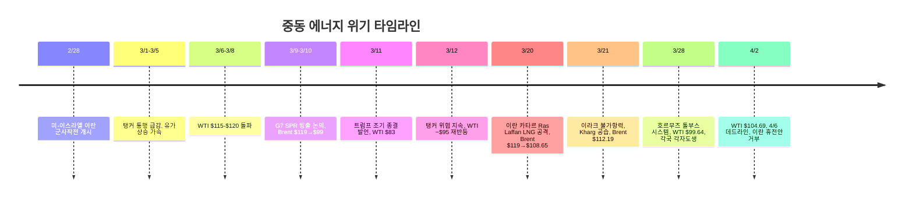

### 1.2 유가 변동 요인 (4/2)

| 요인 | 방향 | 내용 |
|------|:----:|------|
| **4/6 호르무즈 데드라인** | 상승 | 이란 재개방 거부 시 전면 봉쇄 장기화, 130→6척/일 |
| **Macquarie: 전면 봉쇄→$200** | 상승 | 6월까지 봉쇄 지속 시 Brent $200 전망 |
| **이란 15항목 휴전안 거부** | 상승 | 외교적 해결 불투명, 트럼프 주장 vs 이란 부인 |
| **페트로위안 구조적 전환** | 상승 | 위안화 통행료 → 달러 헤게모니 도전, 장기 구조 변화 |
| **이란 내부 압력** | 하락 | 인터넷 30일+ 차단, 인프라 위기 → 전쟁 지속 한계 4월 말 |
| **Macquarie: 외교 돌파→$80-90** | 하락 | 수일 내 $25-30 급락 가능, 시장 휴전 기대 선반영 |
| **XLE -3.74% 하락** | 하락 | 유가 상승에도 휴전 기대 선반영으로 에너지주 하락 |
| **EV 전환 가속** | 하락(장기) | 한국 +172%, 유럽 급증 → 고유가가 장기 석유 수요 파괴 |

### 1.3 핵심 리스크: 바이너리 시나리오 + 이란 내부 한계

- **바이너리 결과 구조**: 4/6 데드라인을 기점으로 유가는 **극단적 이분법**. Macquarie 전면 봉쇄→$200 vs 외교 돌파→$80-90. 중간 시나리오 확률이 축소
- **이란 내부 한계**: 인터넷 차단 30일+, 수도 이전 논의, 수자원/인프라 위기. 전쟁 지속 가능 시한 4월 말 추정 → 이란의 협상 압력 증가 가능성
- **휴전 기대 vs 현실**: 트럼프 "이란 휴전 원해" 주장 vs 이란 15항목 거부 + 부인. 시장은 휴전 기대를 선반영(XLE -3.74%)하나, 실제 타결은 불투명
- **페트로위안 구조적 전환**: 이란의 위안화 통행료 징수가 지속되면서 달러 헤게모니에 대한 구조적 도전. 단기 유가와 무관한 장기 리스크
- **고유가→EV 전환 가속**: 한국 EV +172%, 유럽 급증. 고유가가 비미국 시장에서 EV 전환을 가속시키며, 이는 장기적 석유 수요 파괴 요인
- **XLE 디커플링**: 유가 $104에도 XLE -3.74% 하락. 시장이 유가 조정 가능성을 가격에 반영 → 에너지주 진입 시점 판단 주의 필요

### 1.4 산유국 대규모 감산: 600만 배럴

저장시설 포화로 인해 산유국들이 **역대급 감산**에 돌입했습니다.

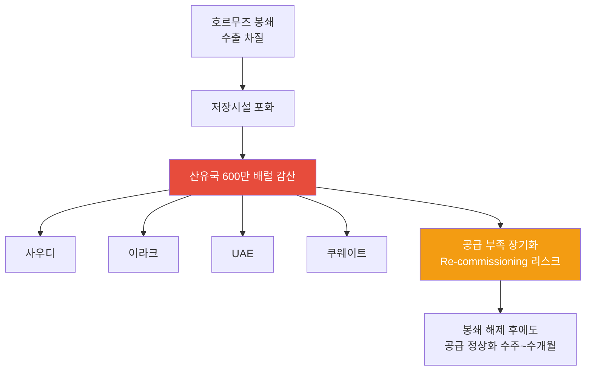

| 국가 | 감산 참여 | 상황 |
|------|:--------:|------|
| **사우디** | O | 최대 규모 감산, 저장시설 포화 대응 |
| **이라크** | O | **3/21 불가항력 선언** — 이란전 여파로 수출 중단, 저장 잔여 극소 |
| **UAE** | O | 생산 감축 지속 |
| **쿠웨이트** | O | 저장 포화 대응 중 |
| **합계** | - | **총 600만 배럴/일 감산** |

> **투자 시사점**: 600만 배럴 감산은 단순 봉쇄 대응이 아니라, **Re-commissioning 리스크**를 수반합니다. 유정 셧다운 후 재가동에 수주~수개월이 소요되므로, 전쟁이 종결되더라도 공급 정상화에는 시간이 필요합니다. 중기적으로 유가 $70-80 레벨이 하한선이 될 가능성이 있습니다.

### 1.5 국가별 에너지 취약성

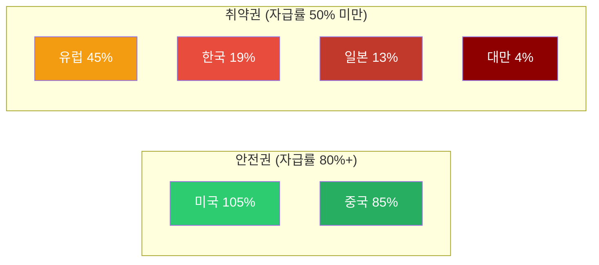

| 국가 | 에너지 자급률 | 호르무즈 영향 | GS 분석 |
|------|:-----------:|------------|---------|
| **미국** | 105% | 매우 낮음 | 순 수출국, 유가 상승 수혜, 제조업 노출 제한적 |
| **중국** | 85% | **가장 적음** | 석유 의존도 9%, 러시아 대체 루트 (Goldman Sachs) |
| **유럽** | 45% | 높음 | LNG 의존, 가스가격 +60% |
| **한국** | 19% | **매우 높음** | 중동 원유 70% 의존 |
| **일본** | 13% | **매우 높음** | 중동 원유 90%+ 의존 |
| **대만** | 4% | **극심** | 거의 전량 수입 |

> **Goldman Sachs 핵심 분석**: 중국이 이번 오일 쇼크에서 **가장 적은 영향**을 받을 것으로 전망. 자급률 85%에 석유 의존도 9%, 러시아 파이프라인 대체 루트까지 확보. 호르무즈 톨부스 시스템에서도 중국 선박은 **통과 허용**. 반면 **한국·일본·대만이 실질적 피해국**입니다.

> **4/2 바이너리 시나리오와 취약국**: 4/6 데드라인의 바이너리 결과에서 **한국·일본·대만이 가장 큰 피해**를 받는 구조는 변함없습니다. 봉쇄 지속 시 Brent $200 시나리오에서 이들 국가의 에너지 비용 부담은 극심해질 전망. 한편 중국은 호르무즈 톨부스에서도 선박 통과가 허용되어 상대적 수혜국입니다. 이란의 위안화 통행료 징수는 **페트로위안 체제의 구조적 기반**이 되고 있습니다.

### 1.6 원자재 사이클: 에너지 다음은 식량

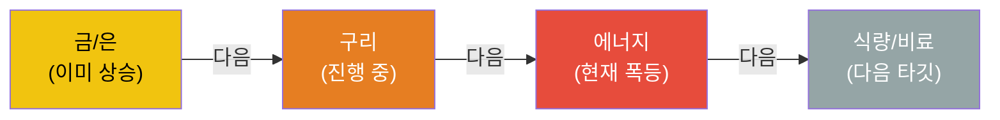

원자재 상승 사이클은 통상 **금/은 → 구리 → 에너지 → 식량/비료** 순서로 전파됩니다. 현재 에너지 단계에서 폭등이 진행 중이며, 다음은 식량/비료 섹터 상승이 예상됩니다.

---

## 2. 하위 섹터 1: Oil & Gas (단기 최대 수혜, 중기 불확실)

### 2.1 XLE $58.97 (-3.74%): 유가 상승에도 하락 — 휴전 기대 선반영

XLE이 **$58.97(-3.74%)**로 하락했습니다. WTI가 $104.69로 $100을 돌파했음에도 불구하고, **시장이 휴전 기대와 유가 급락 가능성을 선반영**한 것으로 분석됩니다. Macquarie의 외교적 돌파 시 Brent $25-30 급락 시나리오가 에너지주 투자 심리를 압박하고 있습니다.

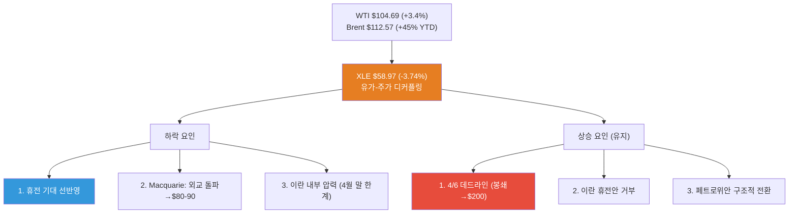

| 요인 | 방향 | 설명 |
|------|:----:|------|
| **휴전 기대 선반영** | 하락 | 시장이 외교적 해결 가능성을 가격에 반영 |
| **Macquarie 급락 시나리오** | 하락 | 외교 돌파 시 Brent $25-30 급락→$80-90 |
| **이란 내부 한계 4월 말** | 하락 | 인터넷 차단, 인프라 위기 → 이란 협상 압력 |
| **4/6 데드라인 봉쇄 지속** | 상승 | 이란 재개방 거부 시 Brent $200 전망 |
| **이란 15항목 거부** | 상승 | 단기 타결 불투명 |
| **페트로위안** | 상승(장기) | 위안화 통행료 → 달러 헤게모니 도전 |
| **고유가→EV 전환 가속** | 하락(장기) | 석유 수요 구조적 파괴 |

> **핵심 판단**: XLE의 유가-주가 디커플링은 시장이 **바이너리 시나리오의 하방 리스크**를 반영한 결과입니다. 4/6 데드라인 결과에 따라 급등(봉쇄 지속) 또는 급락(외교 돌파) 중 하나가 실현될 가능성이 높아, **방향성 베팅보다는 시나리오별 대응 전략**이 필요합니다.

### 2.2 Oil & Gas 업스트림/미드스트림/다운스트림

| 세그먼트 | 현재 상황 | 수혜/위험 | 주요 종목 |
|---------|---------|---------|---------|
| **업스트림 (탐사/생산)** | 미국 셰일 풀가동 인센티브 | **최대 수혜**: 유가 상승 직접 반영 | ExxonMobil (XOM), Chevron (CVX), ConocoPhillips (COP) |
| **미드스트림 (파이프/저장)** | 저장 수요 급증, 미국 LNG 수출 증가 | **수혜**: 물류/저장 수수료 증가 | Enterprise Products (EPD), Kinder Morgan (KMI) |
| **다운스트림 (정유)** | 원유 조달 차질, 크랙 스프레드 확대 | **혼재**: 마진 확대 vs 원유 확보 어려움 | Valero (VLO), Marathon Petroleum (MPC) |

### 2.3 미국 에너지 독립의 의미

미국은 에너지 자급률 105%로 이번 위기에서 **상대적 안전지대**입니다.

- **미국 생산자**: 유가 상승으로 직접 수혜, 수출 증가
- **제조업**: 에너지 비용 상승 영향 제한적 (자체 생산으로 충당)
- **소비자**: 가솔린 17% 상승했으나 아시아/유럽 대비 충격 제한적
- **전략적 위치**: 글로벌 에너지 위기에서 미국 패권 강화

### 2.4 Oil & Gas 투자 전략 (4/2 업데이트)

| 시나리오 | 확률 | 유가 전망 | 전략 |
|---------|:---:|---------|------|
| **전면 봉쇄 장기화 (4/6 후)** | **35%** | Brent $150-200 (Macquarie) | 업스트림 최대 비중, 에너지 인플레 수혜주 집중 |
| **톨부스 지속 + 제한적 교착** | **25%** | Brent $110-130 | 현 포지션 유지, 모멘텀 추종 |
| **외교적 돌파 (부분 합의)** | **25%** ↑ | Brent $80-90 (수일 내 $25-30 급락) | Oil 대폭 축소, 클린에너지/EV 전환 |
| **전면 외교적 해결** | **15%** ↑ | WTI $70-80 | Oil 최소, 원전/ESS/EV 집중 |

> **4/2 시나리오 변경 사항**: 이란 내부 압력(인터넷 30일+, 인프라 위기, 전쟁 지속 한계 4월 말)으로 **외교적 해결 확률 상향(30%→40%)**, 반면 이란 15항목 거부로 **단기 타결은 불투명**. Macquarie 바이너리 시나리오(봉쇄→$200 vs 돌파→$80-90)를 반영하여 **극단 시나리오 확률 증가**. XLE -3.74% 하락은 시장이 하방 리스크를 선반영한 것. **4/6 데드라인 결과에 따라 포지션 전면 재조정 필요**.

---

## 3. 하위 섹터 2: 원전/SMR (최상위 투자 매력 - 에너지 안보 핵심)

> **상세 분석**: [2026년 원전 투자 전망](/knowledge/invest/2026/01/21/nuclear-power-sector-outlook-2026.html)

### 3.1 원전/SMR: 정책·기술·수요 3박자 강세

호르무즈 위기가 원전의 에너지 안보 가치를 증명한 데 이어, **미국 $80B 신규 원전 펀딩**과 **NuScale SMR 규제 승인** 등 정책·기술 측면에서도 강력한 모멘텀이 추가되었습니다.

| 항목 | 내용 |
|------|------|
| **미국 $80B 원전 펀딩** | 신규 원전 건설을 위한 대규모 연방 펀딩 발표 (3/11) |
| **AI DC 전력 5x 성장** | AI 데이터센터 전력 수요 **2030년까지 5배 성장** 전망 |
| **NuScale SMR 규제 승인** | NRC 인증에 이어 **규제 승인** 획득, 상용화 가속 |
| **Cameco EPS +55%** | 우라늄 수요 급증으로 Cameco 실적 전망 대폭 상향 |
| **URA ETF 상승 지속** | 우라늄 가격 상승과 원전 투자 확대 반영 |
| **SMR 상용화 가시화** | 중국 링롱원 세계 최초 상업용 육상 SMR **2026년 상반기 가동** |
| **글로벌 원전 확대** | 2026년 신규 원자로 15기(12GW) 가동 예정 |
| **에너지 안보** | 호르무즈 위기 → 자급률 19% 한국에 원전 필수불가결 |
| **SMR 특별법** | 2026.2.12 국회 통과 → i-SMR 상용화 가속 |
| **우라늄 전망** | Goldman Sachs 목표가 $91/lb (2026년 말) |

### 3.2 2026년 원전 가동 타임라인

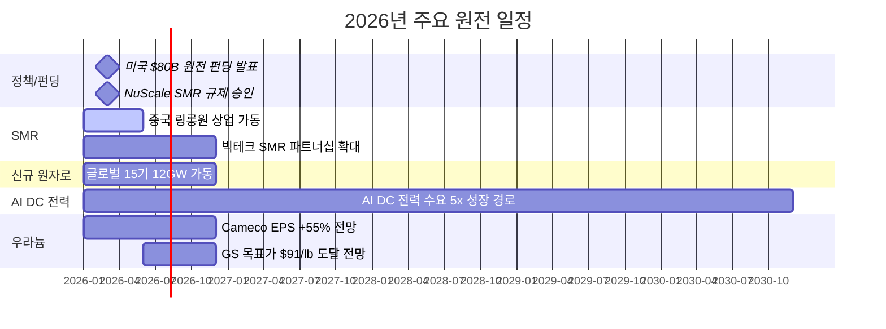

### 3.3 주요 종목

| 종목 | 시장 | 핵심 포인트 | 리스크 |
|------|------|-----------|--------|
| **두산에너빌리티** | KRX | **대장주**. SMR 기자재 독점, 원전 EPC, xAI 가스터빈 5기 수주 | 건설 지연 |
| **BH** | KRX | 가스터빈과 세트 (보일러/스팀), 두산에너빌리티 동반 수혜 | 가스터빈 수주 의존 |
| **한전기술** | KRX | i-SMR 설계 주관사 | 매출 인식 시점 |
| **현대일렉트릭** | KRX | **765kV 초고압 변압기** 생산 가능 극소수 기업, 수작업 필수 | 납기 지연 |
| **효성중공업** | KRX | 초고압 변압기 핵심 기업, 글로벌 수요 급증 | 원자재 가격 |
| **NuScale (SMR)** | NYSE | NRC 인증 유일 SMR | 상용화 지연 |
| **Cameco (CCJ)** | NYSE | 우라늄 채굴 1위, GS 목표가 $91/lb | 우라늄 가격 변동 |
| **Oklo (OKLO)** | NYSE | Meta 1.2GW PPA 체결 | 기술 검증 미완 |

> **변압기 투자 포인트**: 데이터센터·원전·재생에너지 모두 변압기가 필수이며, 특히 765kV급 초고압 변압기는 전 세계에서 **극소수 기업만 생산 가능**하고, 자동화가 불가능한 **수작업** 공정으로 공급 병목이 심각합니다.

---

## 4. 하위 섹터 3: 재생에너지 (대안 에너지 수혜 + 구조적 성장)

> **상세 분석**: [2026년 재생에너지 투자 전망](/knowledge/invest/2026/03/07/renewable-energy-outlook-2026.html)

### 4.1 고유가 → EV 전환 가속 + 청정에너지 전환 강화

고유가가 **EV 전환을 가속**시키고 있습니다. 한국은 EV 등록 **+172%(역대 기록)**를 기록했고, 유럽도 유사한 급증세를 보이고 있습니다. 미국은 세금 공제 만료로 신규 EV가 -28% 감소했으나, 중고 EV가 +12% 증가하며 수요가 이전되는 양상입니다. 비미국 시장에서 고유가가 EV 전환의 결정적 트리거로 작용하면서, **장기적 석유 수요 구조적 파괴**가 현실화되고 있습니다.

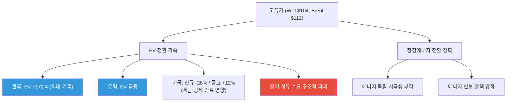

### 4.2 핵심 투자 포인트

| 항목 | 내용 |
|------|------|
| **EV 전환 가속** | 한국 +172%, 유럽 급증 — 고유가가 비미국 시장에서 EV 전환 결정적 트리거 |
| **미국 신규 용량 99%** | 2026년 신규 발전의 99%가 재생에너지+ESS |
| **태양광 44.5GW** | 미국 역대 최대 유틸리티 태양광 설치 |
| **IRA AMPC** | 미국 내 제조 보조금으로 리쇼어링 가속 |
| **ICLN** | $18.25 (-0.22%) — 소폭 조정, 방향성 유지 |

### 4.3 주요 종목

| 종목 | 시장 | 핵심 포인트 |
|------|------|-----------|
| **한화솔루션** | KRX | 미국 수직계열화, AMPC 수혜, 2026 판매 9GW 목표 |
| **First Solar (FSLR)** | NASDAQ | 미국 유일 대규모 태양광 제조 |
| **NextEra Energy (NEE)** | NYSE | 세계 최대 재생에너지 유틸리티, EPS $3.92~4.02 |
| **CS윈드** | KRX | 풍력 타워 글로벌 1위, **미국/유럽 현지 공장** 보유 (관세 리스크 낮음) |
| **Vestas (VWS)** | CPH | 풍력 터빈 세계 1위, 백로그 EUR 31.6B |

---

## 5. 하위 섹터 4: ESS (그리드 불안정 → 필수 인프라)

> **상세 분석**: [2026년 ESS 투자 전망](/knowledge/invest/2026/03/07/ess-energy-storage-outlook-2026.html)

### 5.1 에너지 위기가 ESS 필요성을 극대화

호르무즈 봉쇄로 인한 에너지 공급 불안정은 **그리드 안정화를 위한 ESS 수요를 폭발적으로 증가**시키고 있습니다. 재생에너지 비중 확대와 맞물려 ESS는 선택이 아닌 필수 인프라가 되었습니다.

| 항목 | 내용 |
|------|------|
| **시장 규모** | $146B(2025) → $521B(2035), CAGR 13.6% |
| **미국 신규** | 2026년 24.3GW 배터리 신규 설치 |
| **LFP 주도** | 비용/안전/수명 우위로 그리드 ESS 표준 |
| **ESS 마진 우위** | ESS 마진 20%+ vs EV 배터리 8% |
| **LIT $74.44 (+0.12%)** | 리튬/배터리 ETF 안정세 = EV/ESS 수혜 반영 |

### 5.2 주요 종목

| 종목 | 시장 | 핵심 포인트 |
|------|------|-----------|
| **삼성SDI** | KRX | SBB ESS 라인업, 전고체 2027~2028 |
| **LG에너지솔루션** | KRX | 미국 ESS 90GWh 목표, LFP 30GWh, **ESS 매출 비중 20%로 확대** |
| **Tesla (TSLA)** | NASDAQ | Megapack 3, Megablock, 미국 LFP 생산 |
| **BYD** | HKEX | 나트륨이온 ESS, 30GWh 공장 착공 |
| **CATL** | SHE | 나트륨이온 2026 본격 양산, 175Wh/kg |

> **ESS 마진 우위**: LG에너지솔루션 기준 ESS 매출 비중이 10%→20%로 확대 중이며, ESS 마진(20%+)이 EV 배터리 마진(8%)을 크게 상회합니다. ESS가 배터리 기업의 수익성 개선 핵심 동력입니다.

---

## 6. 하위 섹터 5: 수소 에너지 (장기 에너지 독립 수단)

> **상세 분석**: [2026년 수소 에너지 투자 전망](/knowledge/invest/2026/03/07/hydrogen-energy-outlook-2026.html)

### 6.1 호르무즈 위기 → 에너지 독립 수단으로서의 수소 가치 재조명

수소는 단기적 수혜보다는 **장기적 에너지 독립** 수단으로 전략적 가치가 부각되고 있습니다. 호르무즈 사태가 보여주듯 화석연료 의존의 지정학적 리스크가 현실화되면서, 자국 생산 가능한 그린수소의 전략적 중요성이 높아지고 있습니다.

| 항목 | 내용 |
|------|------|
| **NEOM 프로젝트** | $8.4B, 세계 최대 그린수소, 2026~2027 완공 |
| **45V 세액공제** | 그린수소 $3/kg 보조금 (IRA) |
| **두산퓨얼셀** | SOFC 양산, 미국 DC 시장 진출 |
| **전략적 가치** | 에너지 자급을 위한 장기 솔루션 |

### 6.2 고려아연 수소 진출 (3/12 신규)

EU CBAM(탄소국경조정메커니즘) 2026.1 시행으로 **그린메탈** 전환이 필수가 되면서, 고려아연이 수소 사업에 본격 진출하고 있습니다.

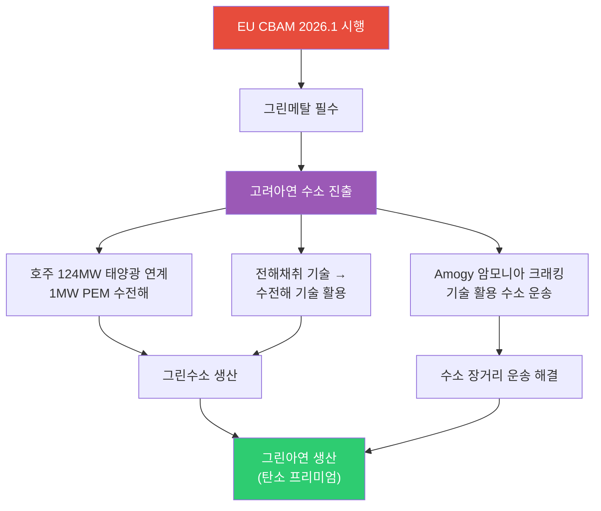

| 항목 | 내용 |
|------|------|
| **EU CBAM** | 2026.1 시행 → 탄소 배출 높은 금속에 관세 부과, 그린메탈 전환 필수 |
| **호주 PEM 수전해** | 124MW 태양광 연계 1MW PEM 수전해 설비 → 그린수소 생산 |
| **전해채취 → 수전해** | 아연 전해채취(electrolytic extraction) 기술을 수전해(water electrolysis)에 활용 |
| **Amogy 암모니아 크래킹** | 수소를 암모니아로 변환 후 운송, 도착지에서 크래킹으로 수소 추출 → 장거리 운송 해결 |

> **투자 시사점**: 고려아연의 수소 진출은 단순 에너지 사업이 아니라 **CBAM 대응을 위한 그린메탈 전환 전략**입니다. 전해채취 기술 노하우를 수전해에 활용하는 것은 기술적 시너지가 크며, Amogy 암모니아 크래킹을 통한 수소 운송은 수소 인프라 부재의 근본 과제를 해결하는 접근입니다.

### 6.3 주요 종목

| 종목 | 시장 | 핵심 포인트 |
|------|------|-----------|
| **고려아연** | KRX | EU CBAM 대응, 호주 PEM 수전해, 그린메탈 전환 (3/12 신규) |
| **두산퓨얼셀** | KRX | SOFC 양산, 2026 매출 6,900억 목표 |
| **효성첨단소재** | KRX | 탄소섬유 수소탱크 핵심 소재 |
| **Plug Power (PLUG)** | NASDAQ | 전해조+운송+충전 수직계열화 |
| **Bloom Energy (BE)** | NYSE | SOFC 2GW 생산 확대 |
| **Air Products (APD)** | NYSE | NEOM 그린수소 독점 오프테이커 |

---

## 7. AI 데이터센터 전력 수요 (구조적 메가트렌드 지속)

호르무즈 위기에도 불구하고 AI 전력 수요라는 구조적 메가트렌드는 **변함없이 진행** 중입니다.

### 7.1 빅테크 CAPEX: 역대 최대 $690B

| 기업 | 2026 CAPEX (추정) | 주요 프로젝트 | 전력 관련 이슈 |
|------|-----------------|-------------|-------------|
| **Amazon** | ~$200B | 역대 최대 단일 연도 기업 투자 | 원전 PPA 적극 추진 |
| **Google** | $175~185B | 2025년 $91B 대비 2배 | 소형원전(SMR) 투자 |
| **Meta** | $115~135B | 오하이오 1GW DC, 루이지애나 5GW 규모 DC | 재생에너지 PPA 확대 |
| **Microsoft** | ~$120B+ | Azure $80B 수주잔고(전력 부족으로 미이행) | **전력 병목이 성장 제약** |
| **합계** | **~$690B** | AI 인프라 역대 최대 | 전력이 핵심 병목 |

### 7.2 전력 수요 전망

- **데이터센터 전력 소비**: 2026년 **1000TWh**에 도달 전망 → 글로벌 원전 발전량의 **1/3** 수준
- **Deloitte 전망**: 미국 AI 데이터센터 전력 수요 4GW(2024) → 123GW(2035)
- **IEA 전망**: 글로벌 데이터센터 전력 소비 2024~2030년 **2배 이상 증가**
- **xAI/Tesla**: 두산에너빌리티로부터 가스터빈 5기 수주, 추가 15기 예상

---

## 8. 에너지 하위 섹터별 투자 매력도 비교

### 8.1 종합 평가표 (4/2 업데이트)

| 하위 섹터 | 단기 모멘텀 (6M) | 중기 성장성 (2~3Y) | 장기 구조적 (5Y+) | 리스크 | 종합 투자 매력도 |
|----------|:-:|:-:|:-:|---------|:-:|
| **Oil & Gas** | ★★★★☆ | ★★★★ | ★★★ | 바이너리 시나리오(봉쇄→$200 vs 돌파→$80-90), XLE 디커플링 | **A+ (S→A+ 하향, 불확실성 증가)** |
| **원전/SMR** | ★★★★★ | ★★★★★ | ★★★★★ | 인허가 지연, 건설 초과비용 | **S (최상)** |
| **ESS/EV** | ★★★★★ | ★★★★★ | ★★★★★ | 안전성, LFP 공급과잉 | **S (A+→S 상향, EV 전환 가속)** |
| **재생에너지** | ★★★★★ | ★★★★ | ★★★★ | 중국 과잉공급, 정책 불확실성 | **A (에너지 독립 모멘텀)** |
| **수소** | ★★★☆ | ★★★★ | ★★★★★ | 높은 생산비용, 인프라 부재 | **A-** |

> **4/2 평가 변경 사항**:
> - **Oil & Gas (S → A+ 하향)**: 바이너리 시나리오(Macquarie: 봉쇄→$200 vs 돌파→$80-90)로 **방향성 불확실성 극대화**. XLE -3.74%로 유가-주가 디커플링 발생, 시장이 휴전 기대를 선반영. 이란 내부 압력(전쟁 지속 한계 4월 말)으로 외교적 해결 확률 상승. 4/6 결과 확인 전까지 신규 진입 주의.
> - **ESS/EV (A+ → S 상향)**: 한국 EV +172%(역대 기록), 유럽 급증으로 **고유가가 EV 전환의 결정적 트리거**로 확인. 휴전/봉쇄 어느 시나리오에서도 EV 전환 추세는 되돌릴 수 없음. 장기 석유 수요 구조적 파괴의 수혜 섹터.
> - **페트로위안 구조적 전환**: 이란 위안화 통행료 → 달러 헤게모니 도전. 에너지 결제 통화 다변화가 장기 구조 변화로 고착화 중.

### 8.2 섹터별 시장 규모 전망

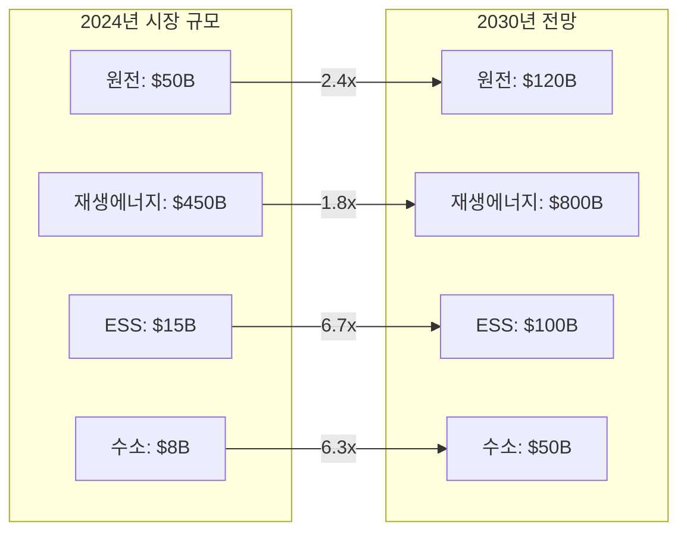

---

## 9. 투자 전략: 호르무즈 시나리오별 대응

### 9.1 포트폴리오 구성 제안

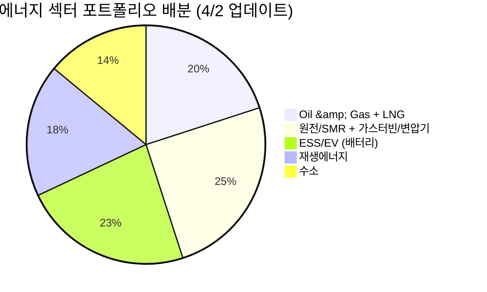

### 9.2 시나리오별 전략 (4/2 업데이트)

| 시나리오 | 확률 | 유가 전망 | 최적 전략 |
|---------|:---:|---------|---------|
| **전면 봉쇄 장기화** | **35%** | Brent $150-200 | Oil 업스트림 최대 비중, 에너지 인플레 수혜주, 식량 섹터 |
| **톨부스 지속 + 제한적 교착** | **25%** | Brent $110-130 | 현 포지션 유지, EV/ESS 비중 확대 |
| **외교적 돌파 (부분 합의)** | **25%** ↑ | Brent $80-90 (급락) | Oil 대폭 축소, EV/ESS/클린에너지 전환 |
| **전면 외교적 해결** | **15%** ↑ | WTI $70-80 | Oil 최소, 원전/ESS/EV 집중 |

> **4/2 전략 변경**: 이란 내부 압력(전쟁 지속 한계 4월 말)으로 **외교적 해결 확률 합산 40%로 상향**. Oil & Gas 비중을 30%→20%로 하향하고, ESS/EV를 18%→23%로 상향. **바이너리 시나리오에서는 방향성 베팅보다 양쪽에서 수혜 가능한 ESS/EV/원전 비중 확대가 핵심**. 한국 EV +172%, 유럽 EV 급증은 유가 시나리오와 무관한 구조적 전환을 확인. 4/6 데드라인 결과 확인 후 포지션 전면 재조정 예정.

### 9.3 리스크 요인

| 리스크 | 영향 | 대응 |
|--------|------|------|
| **4/6 데드라인 바이너리 결과** | 봉쇄→$200 or 돌파→$80-90, 극단적 이분법 | 4/6 전까지 방향성 베팅 축소, 시나리오별 대응 준비 |
| **외교적 돌파 시 유가 급락** | Brent $25-30 급락→$80-90, Oil 포지션 대규모 손실 | Oil 비중 30%→20% 하향 완료, 추가 축소 준비 |
| **전면 봉쇄 장기화 ($200)** | 글로벌 경기침체, 에너지 슈퍼스파이크 | 에너지 올인 + 방어주 + 현금 비중 확대 |
| **XLE 디커플링 지속** | 유가 상승에도 에너지주 하락, 투자 심리 악화 | 개별 종목 vs ETF 선별, 실적 기반 접근 |
| **고유가→EV 전환 가속** | 장기 석유 수요 구조적 파괴, Oil 장기 전망 악화 | ESS/EV 비중 확대 (23%), 장기 포지션 전환 |
| **페트로위안 구조적 전환** | 달러 헤게모니 약화, 에너지 결제 통화 다변화 | 위안화 자산 분산, 금 보유 |
| **이란 내부 붕괴 리스크** | 인터넷 30일+ 차단, 인프라 위기 → 급격한 정권 변화 가능 | 예측 불가 → 포지션 경량화 |
| **Re-commissioning 장기화** | 봉쇄 해제 후에도 공급 부족 지속 (600만 배럴 감산) | 원유 업스트림 일부 보유 유지 |
| **경기침체 (수요 파괴)** | 유가 $100+ → 인플레 → 금리인상 → 수요 감소 | 고배당 유틸리티, 현금흐름 우수 기업 |
| **IRA 축소/폐지** | 재생에너지, 수소, ESS 타격 | 미국 외 지역 분산 |

---

## 핵심 데이터 요약

| 지표 | 수치 | 출처/기준 |
|------|------|----------|
| **WTI 유가** | **$104.69 (+3.4%)** | 2026.4.2, $100 돌파 |
| **Brent 유가** | **$112.57 (+45% YTD)** | 2026.4.2 |
| **호르무즈 4/6 데드라인** | **이란 재개방 요구, 15항목 거부** | 130→6척/일 |
| **Macquarie 시나리오** | **봉쇄→$200 / 외교 돌파→$80-90** | 바이너리 결과 |
| **이란 내부** | **인터넷 30일+ 차단, 인프라 위기** | 전쟁 지속 한계 4월 말 |
| **페트로위안** | **위안화 통행료 → 달러 헤게모니 도전** | 구조적 전환 |
| **XLE** | **$58.97 (-3.74%)** | 휴전 기대 선반영 하락 |
| **LIT** | **$74.44 (+0.12%)** | EV/배터리 안정 |
| **ICLN** | **$18.25 (-0.22%)** | 소폭 조정 |
| **EV 전환** | **한국 +172%, 유럽 급증** | 고유가→EV 전환 가속 |
| **미국 EV** | **신규 -28% / 중고 +12%** | 세금 공제 만료 영향 |
| **카타르 LNG** | **17% 파괴, 복구 3-5년** | 구조적 공급 부족 |
| **산유국 감산** | **600만 배럴/일** | 사우디·이라크·UAE·쿠웨이트 |
| **미국 원전 펀딩** | **$80B** | 신규 원전 건설 |
| **AI DC 전력 성장** | **5x** | 2030년까지 |
| 빅테크 2026 CAPEX | ~$690B | Futurum |
| DC 전력 소비 (2026) | 1000TWh | 글로벌 원전의 1/3 |
| 미국 2026 태양광 신규 | 44.5GW | EIA |
| 미국 2026 ESS 신규 | 24.3GW | EIA |
| ESS 시장 규모 (2035) | $521B | 시장조사 |
| 2026 신규 원자로 | 15기 (12GW) | 글로벌 |
| 우라늄 GS 목표가 | $91/lb (2026말) | Goldman Sachs |
| 한국 에너지 자급률 | 19% | 중동 원유 70% + 카타르 LNG 수입 |
| ESS 마진 | 20%+ (vs EV 8%) | LG에너지솔루션 |

---

## 결론

2026년 4월 2일, 중동 에너지 위기가 **4월 6일 호르무즈 데드라인**이라는 **결정적 분기점**을 앞두고 있습니다. WTI **$104.69(+3.4%)**로 $100을 돌파했고, Brent **$112.57(+45% YTD)**로 고공행진 중입니다. 그러나 Macquarie의 **바이너리 시나리오**(전면 봉쇄→$200 vs 외교 돌파→$80-90)가 보여주듯, 유가는 **극단적 이분법** 구간에 진입했습니다.

**4/2 핵심 변화**:
- **4/6 호르무즈 데드라인** — 트럼프 에너지 공격 중단 4/6 연장, 이란에 재개방 요구. 이란 15항목 거부
- **바이너리 시나리오** — Macquarie: 봉쇄 지속→Brent $200, 외교 돌파→수일 내 $25-30 급락→$80-90
- **XLE $58.97(-3.74%)** — 유가 상승에도 하락, 시장이 휴전 기대·유가 급락 가능성 선반영
- **EV 전환 가속** — 한국 +172%(역대 기록), 유럽 급증, 미국 신규 -28%/중고 +12%
- **이란 내부 압력** — 인터넷 30일+ 차단, 수도 이전 논의, 인프라 위기, 전쟁 지속 한계 4월 말
- **페트로위안** — 위안화 통행료 → 달러 헤게모니 도전, 구조적 전환 심화

**투자 우선순위** (4/2 업데이트):
1. **원전/SMR + 가스터빈/변압기** (25%): 두산에너빌리티, BH, 현대일렉트릭, 효성중공업, Cameco — $80B 펀딩 + AI DC 5x + 에너지 독립 핵심. **시나리오 무관 안전**
2. **ESS/EV (배터리)** (23%, 상향): LG에너지솔루션, 삼성SDI — EV 전환 가속(한국 +172%), 마진 20%+ 우위. **시나리오 무관 구조적 성장**
3. **Oil & Gas + LNG** (20%, 하향): ExxonMobil, ConocoPhillips — 4/6 결과 확인 전 비중 축소. 봉쇄 지속 시 재확대
4. **재생에너지** (18%): CS윈드, 한화솔루션, First Solar — 에너지 독립 투자 가속
5. **수소** (14%): 고려아연, 두산퓨얼셀 — EU CBAM 대응 + 장기 에너지 독립 수단

> **핵심 전략**: 4/6 데드라인의 바이너리 결과 구조에서는 **방향성 베팅보다 양쪽 시나리오에서 수혜 가능한 섹터(원전/ESS/EV)에 비중을 집중**하는 것이 최적입니다. Oil & Gas는 봉쇄 지속 시 최대 수혜이나, 외교 돌파 시 급락 리스크가 있으므로 4/6 결과 확인 후 포지션 재조정이 필요합니다. 한편 EV 전환 가속(한국 +172%)은 유가 시나리오와 무관한 **구조적 추세**로, 장기 석유 수요 파괴의 명확한 신호입니다.
