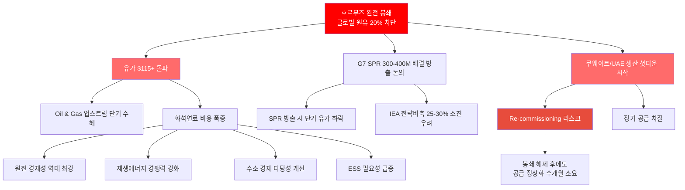
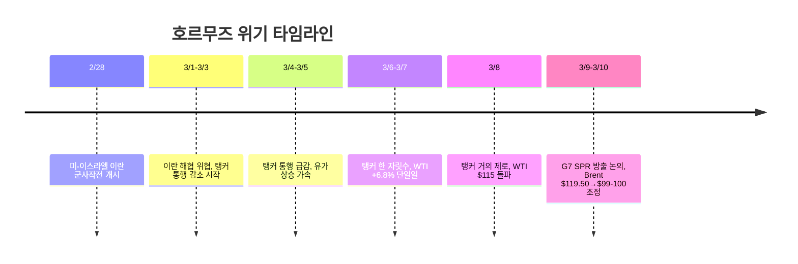
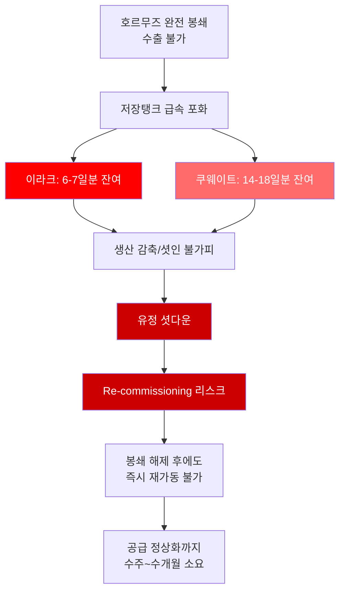
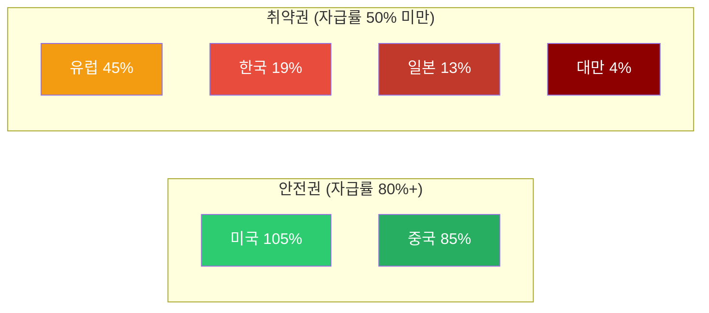
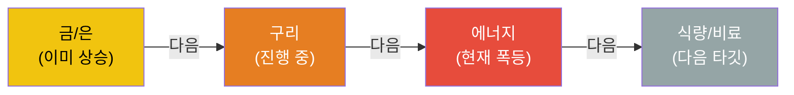
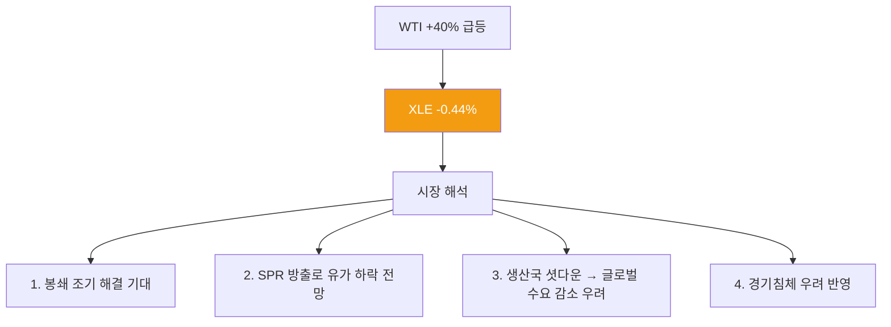
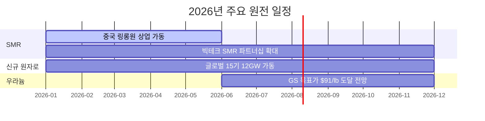
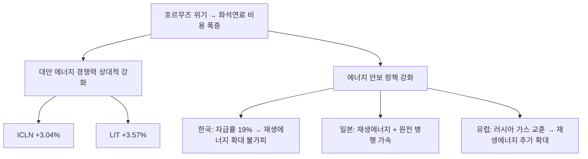
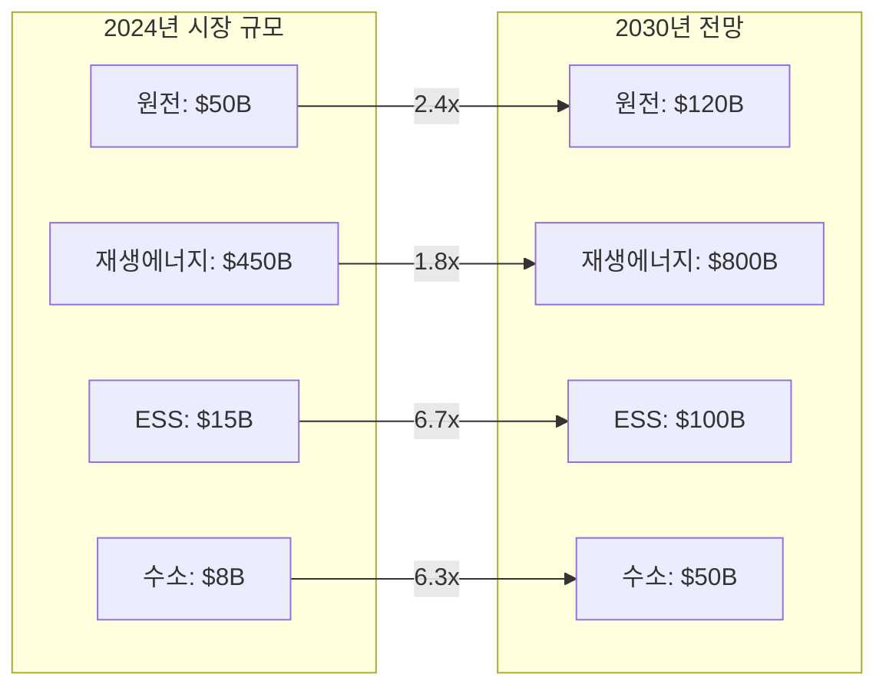
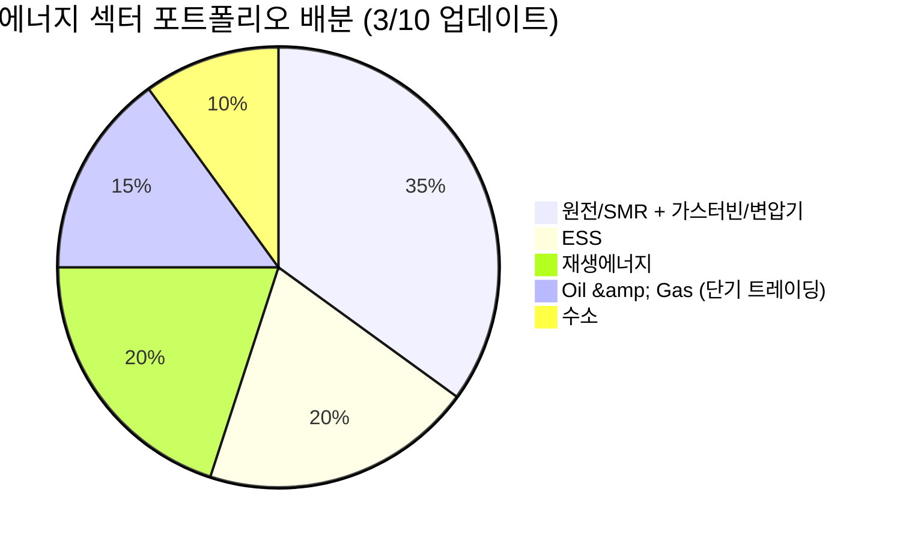

> **시리즈 안내**: 이 글은 에너지 섹터 종합 전망입니다. 하위 섹터별 상세 분석은 아래 링크를 참고하세요.
> - [재생에너지 (태양광/풍력) 상세 분석](/knowledge/invest/2026/03/07/renewable-energy-outlook-2026.html)
> - [ESS (에너지 저장 시스템) 상세 분석](/knowledge/invest/2026/03/07/ess-energy-storage-outlook-2026.html)
> - [수소 에너지 상세 분석](/knowledge/invest/2026/03/07/hydrogen-energy-outlook-2026.html)
> - [원전/SMR 상세 분석](/knowledge/invest/2026/01/21/nuclear-power-sector-outlook-2026.html)

---

## 3/10 핵심 요약: 역사적 오일 쇼크 진행 중

호르무즈 해협이 사실상 **완전 봉쇄**되면서 글로벌 원유 공급의 20%가 차단되었습니다. WTI는 1주일 만에 **40% 급등하여 $115를 돌파**했고, Brent는 $119.50까지 치솟은 뒤 G7 SPR 방출 논의 소식에 **$99-100 수준으로 조정** 중입니다.

| 항목 | 3/8 | **3/10** | 변화 |
|------|-----|---------|------|
| **탱커 통행량** | 한 자릿수 | **거의 제로** | 완전 봉쇄 |
| **WTI** | $86.57 | **$115+** | **+33%** (1주) |
| **Brent** | $100 돌파 전망 | **$119.50→$99-100** | G7 SPR 효과 |
| **전쟁 후 총 상승폭** | +30% | **+40%+** | 가속 |
| **G7 SPR** | 미언급 | **300-400M 배럴 방출 논의** | 3개국 지지 |
| **생산국 상황** | 저장탱크 2-3주 | **쿠웨이트/UAE 생산 감축 시작** | 위기 심화 |
| **XLE** | - | **-0.44%** | 해결 기대 반영? |
| **ICLN** | - | **+3.04%** | 대안 에너지 수혜 |

---

## 에너지 섹터 구조: 호르무즈 위기가 모든 것을 바꾸고 있다

---

## 1. 호르무즈 위기: 역사적 오일 쇼크

### 1.1 봉쇄 현황 (3/10)

2026년 2월 28일 미국-이스라엘의 이란 군사작전 개시 이후, 호르무즈 해협 탱커 통행량이 **70% 감소에서 거의 제로 수준**으로 급락했습니다. 글로벌 원유 공급의 **20%가 차단**된 상태입니다.

### 1.2 유가 충격 규모

WTI가 1주일 만에 **40% 급등**하여 $115를 돌파했습니다. 이는 1973년 오일 쇼크, 1990년 걸프전 이후 가장 급격한 유가 상승입니다.

- **Brent**: $119.50까지 치솟은 뒤, G7 SPR 방출 논의 소식에 **$99-100으로 조정**
- **Rystad Energy 전망**: 봉쇄가 **4개월 지속**되면 Brent **$135** 도달 가능
- **Goldman Sachs**: 중국이 오일 쇼크 영향 **가장 적음** (자급률 85%, 러시아 루트)
- **미국 가솔린**: 전쟁 시작 이후 이미 **17% 상승**

### 1.3 G7 SPR (전략비축유) 방출 논의

유가 급등에 대응하여 G7이 역대 최대 규모의 SPR 방출을 논의 중입니다.

| 항목 | 내용 |
|------|------|
| **방출 규모** | 300-400M 배럴 (3-4억 배럴) |
| **IEA 비축 대비** | 전체 비축의 **25-30%** |
| **지지 국가** | 3개국 (미국 포함 추정) |
| **시장 반응** | Brent $119.50 → $99-100 (논의만으로 -17%) |
| **지속 가능성** | 근본 해결 아님, 수개월 후 비축 고갈 우려 |

> **투자 시사점**: SPR 방출은 **시간 벌기**에 불과합니다. 300-400M 배럴은 글로벌 일일 원유 소비량(약 100M 배럴) 기준 3-4일분에 해당하며, IEA 전략비축의 25-30%를 한 번에 소진하는 것이므로 **향후 위기 대응 능력이 크게 약화**됩니다. 봉쇄가 장기화되면 SPR 방출 효과는 빠르게 소멸합니다.

### 1.4 생산국 셧다운 위기: 돌이킬 수 없는 피해

호르무즈 봉쇄로 인해 중동 산유국들의 **저장 공간이 포화**되면서 생산 감축이 시작되었습니다.

| 국가 | 저장 잔여 기간 | 상황 |
|------|:----------:|------|
| **이라크** | **6-7일** | 가장 위급, 수일 내 셧인 불가피 |
| **쿠웨이트** | **14-18일** | 2-3주 내 셧인 |
| **UAE** | 생산 감축 시작 | 저장 포화 대응 중 |
| **사우디** | 2-3주 추정 | 최대 규모 비축 보유 |

**Re-commissioning(재가동) 리스크가 핵심입니다**:
- 유정은 한번 셧다운되면 **즉시 재가동이 불가능**
- 파이프라인 내 원유 응고, 유정 압력 변화 등으로 복구에 **수주~수개월** 소요
- 1991년 쿠웨이트 전쟁 시 유전 복구에 **5년** 소요 (극단적 케이스)
- 즉, **봉쇄가 내일 해제되더라도** 공급 정상화에는 상당한 시간이 필요

### 1.5 국가별 에너지 취약성

| 국가 | 에너지 자급률 | 호르무즈 영향 | GS 분석 |
|------|:-----------:|------------|---------|
| **미국** | 105% | 매우 낮음 | 순 수출국, 유가 상승 수혜, 제조업 노출 제한적 |
| **중국** | 85% | **가장 적음** | 석유 의존도 9%, 러시아 대체 루트 (Goldman Sachs) |
| **유럽** | 45% | 높음 | LNG 의존, 가스가격 +60% |
| **한국** | 19% | **매우 높음** | 중동 원유 70% 의존 |
| **일본** | 13% | **매우 높음** | 중동 원유 90%+ 의존 |
| **대만** | 4% | **극심** | 거의 전량 수입 |

> **Goldman Sachs 핵심 분석**: 중국이 이번 오일 쇼크에서 **가장 적은 영향**을 받을 것으로 전망. 자급률 85%에 석유 의존도 9%, 러시아 파이프라인 대체 루트까지 확보. 반면 **한국·일본·대만이 실질적 피해국**입니다.

### 1.6 원자재 사이클: 에너지 다음은 식량

원자재 상승 사이클은 통상 **금/은 → 구리 → 에너지 → 식량/비료** 순서로 전파됩니다. 현재 에너지 단계에서 폭등이 진행 중이며, 다음은 식량/비료 섹터 상승이 예상됩니다.

---

## 2. 하위 섹터 1: Oil & Gas (단기 최대 수혜, 중기 불확실)

### 2.1 XLE의 역설: 유가 급등에도 -0.44%

에너지 ETF XLE가 유가 40% 급등에도 불구하고 **-0.44%** 하락한 것은 매우 의미심장합니다.

| 해석 | 설명 | 투자 함의 |
|------|------|---------|
| **봉쇄 조기 해결 기대** | 시장이 외교적 해결을 가격에 반영 | 해결 시 유가 급락 → Oil 종목 하락 |
| **SPR 방출 효과** | G7 300-400M 배럴 방출 논의만으로 Brent -17% | 실제 방출 시 추가 하락 |
| **경기침체 우려** | 유가 급등 → 수요 파괴 → 역설적 유가 하락 | Oil 기업 수익 하락 |
| **Re-commissioning 지연** | 봉쇄 해제 후에도 생산 정상화 지연 | 공급 부족 장기화 가능 |

> **핵심 판단**: XLE의 미미한 반응은 시장이 **봉쇄의 단기 해결을 상당 부분 가격에 반영**하고 있음을 시사합니다. 그러나 re-commissioning 리스크를 감안하면 **공급 정상화에 수개월이 소요**될 수 있어, 중기적으로 유가 $90+ 레벨이 유지될 가능성이 있습니다.

### 2.2 Oil & Gas 업스트림/미드스트림/다운스트림

| 세그먼트 | 현재 상황 | 수혜/위험 | 주요 종목 |
|---------|---------|---------|---------|
| **업스트림 (탐사/생산)** | 미국 셰일 풀가동 인센티브 | **최대 수혜**: 유가 상승 직접 반영 | ExxonMobil (XOM), Chevron (CVX), ConocoPhillips (COP) |
| **미드스트림 (파이프/저장)** | 저장 수요 급증, 미국 LNG 수출 증가 | **수혜**: 물류/저장 수수료 증가 | Enterprise Products (EPD), Kinder Morgan (KMI) |
| **다운스트림 (정유)** | 원유 조달 차질, 크랙 스프레드 확대 | **혼재**: 마진 확대 vs 원유 확보 어려움 | Valero (VLO), Marathon Petroleum (MPC) |

### 2.3 미국 에너지 독립의 의미

미국은 에너지 자급률 105%로 이번 위기에서 **상대적 안전지대**입니다.

- **미국 생산자**: 유가 상승으로 직접 수혜, 수출 증가
- **제조업**: 에너지 비용 상승 영향 제한적 (자체 생산으로 충당)
- **소비자**: 가솔린 17% 상승했으나 아시아/유럽 대비 충격 제한적
- **전략적 위치**: 글로벌 에너지 위기에서 미국 패권 강화

### 2.4 Oil & Gas 투자 전략

| 시나리오 | 확률 | 유가 전망 | 전략 |
|---------|:---:|---------|------|
| **봉쇄 1-2주 내 해결** | 30% | WTI $80-90 | 유가 관련주 이익 실현, 클린에너지로 이동 |
| **봉쇄 1-3개월 지속** | 40% | WTI $100-120 | 미국 업스트림 + SPR 소진 후 추가 상승 대비 |
| **봉쇄 4개월+ 장기화** | 30% | Brent $135 (Rystad) | 에너지 전체 초강세, 경기침체 동반 가능 |

---

## 3. 하위 섹터 2: 원전/SMR (최상위 투자 매력 - 에너지 안보 핵심)

> **상세 분석**: [2026년 원전 투자 전망](/knowledge/invest/2026/01/21/nuclear-power-sector-outlook-2026.html)

### 3.1 호르무즈 위기가 원전 투자 테제를 극적으로 강화

유가 $115 시대에 원전의 경제성이 **역대 최강**을 기록하고 있습니다. 호르무즈 위기는 원전이 단순한 '깨끗한 에너지'가 아니라 **에너지 안보의 핵심 인프라**임을 증명하고 있습니다.

| 항목 | 내용 |
|------|------|
| **AI DC 전원 최적** | 24시간 안정적 기저전력, 빅테크 원전 파트너십 $10B+ 투입, 22GW 개발 중 |
| **SMR 상용화 가시화** | 중국 링롱원(Linglong One) 세계 최초 상업용 육상 SMR **2026년 상반기 가동** |
| **글로벌 원전 확대** | 2026년 신규 원자로 15기(12GW) 가동 예정 |
| **유가 $115+** | 원전 LCOE 경쟁력 압도적: 원전 $60-80/MWh vs 가스 $100+/MWh (현재 유가) |
| **에너지 안보** | 호르무즈 위기 → 자급률 19% 한국에 원전 필수불가결 |
| **SMR 특별법** | 2026.2.12 국회 통과 → i-SMR 상용화 가속 |
| **우라늄 전망** | Goldman Sachs 목표가 $91/lb (2026년 말) |

### 3.2 2026년 원전 가동 타임라인

### 3.3 주요 종목

| 종목 | 시장 | 핵심 포인트 | 리스크 |
|------|------|-----------|--------|
| **두산에너빌리티** | KRX | **대장주**. SMR 기자재 독점, 원전 EPC, xAI 가스터빈 5기 수주 | 건설 지연 |
| **BH** | KRX | 가스터빈과 세트 (보일러/스팀), 두산에너빌리티 동반 수혜 | 가스터빈 수주 의존 |
| **한전기술** | KRX | i-SMR 설계 주관사 | 매출 인식 시점 |
| **현대일렉트릭** | KRX | **765kV 초고압 변압기** 생산 가능 극소수 기업, 수작업 필수 | 납기 지연 |
| **효성중공업** | KRX | 초고압 변압기 핵심 기업, 글로벌 수요 급증 | 원자재 가격 |
| **NuScale (SMR)** | NYSE | NRC 인증 유일 SMR | 상용화 지연 |
| **Cameco (CCJ)** | NYSE | 우라늄 채굴 1위, GS 목표가 $91/lb | 우라늄 가격 변동 |
| **Oklo (OKLO)** | NYSE | Meta 1.2GW PPA 체결 | 기술 검증 미완 |

> **변압기 투자 포인트**: 데이터센터·원전·재생에너지 모두 변압기가 필수이며, 특히 765kV급 초고압 변압기는 전 세계에서 **극소수 기업만 생산 가능**하고, 자동화가 불가능한 **수작업** 공정으로 공급 병목이 심각합니다.

---

## 4. 하위 섹터 3: 재생에너지 (대안 에너지 수혜 + 구조적 성장)

> **상세 분석**: [2026년 재생에너지 투자 전망](/knowledge/invest/2026/03/07/renewable-energy-outlook-2026.html)

### 4.1 클린에너지가 호르무즈 위기의 명확한 수혜자

ICLN(클린에너지 ETF) **+3.04%**, LIT(리튬 ETF) **+3.57%**로, 시장이 호르무즈 위기에서 대안 에너지로의 전환을 적극 가격에 반영하고 있습니다.

### 4.2 핵심 투자 포인트

| 항목 | 내용 |
|------|------|
| **미국 신규 용량 99%** | 2026년 신규 발전의 99%가 재생에너지+ESS |
| **태양광 44.5GW** | 미국 역대 최대 유틸리티 태양광 설치 |
| **IRA AMPC** | 미국 내 제조 보조금으로 리쇼어링 가속 |
| **호르무즈 수혜** | 화석연료 대비 경쟁력 극대화, ICLN +3.04% |

### 4.3 주요 종목

| 종목 | 시장 | 핵심 포인트 |
|------|------|-----------|
| **한화솔루션** | KRX | 미국 수직계열화, AMPC 수혜, 2026 판매 9GW 목표 |
| **First Solar (FSLR)** | NASDAQ | 미국 유일 대규모 태양광 제조 |
| **NextEra Energy (NEE)** | NYSE | 세계 최대 재생에너지 유틸리티, EPS $3.92~4.02 |
| **CS윈드** | KRX | 풍력 타워 글로벌 1위, **미국/유럽 현지 공장** 보유 (관세 리스크 낮음) |
| **Vestas (VWS)** | CPH | 풍력 터빈 세계 1위, 백로그 EUR 31.6B |

---

## 5. 하위 섹터 4: ESS (그리드 불안정 → 필수 인프라)

> **상세 분석**: [2026년 ESS 투자 전망](/knowledge/invest/2026/03/07/ess-energy-storage-outlook-2026.html)

### 5.1 에너지 위기가 ESS 필요성을 극대화

호르무즈 봉쇄로 인한 에너지 공급 불안정은 **그리드 안정화를 위한 ESS 수요를 폭발적으로 증가**시키고 있습니다. 재생에너지 비중 확대와 맞물려 ESS는 선택이 아닌 필수 인프라가 되었습니다.

| 항목 | 내용 |
|------|------|
| **시장 규모** | $146B(2025) → $521B(2035), CAGR 13.6% |
| **미국 신규** | 2026년 24.3GW 배터리 신규 설치 |
| **LFP 주도** | 비용/안전/수명 우위로 그리드 ESS 표준 |
| **ESS 마진 우위** | ESS 마진 20%+ vs EV 배터리 8% |
| **LIT +3.57%** | 리튬/배터리 ETF 상승 = ESS 수혜 반영 |

### 5.2 주요 종목

| 종목 | 시장 | 핵심 포인트 |
|------|------|-----------|
| **삼성SDI** | KRX | SBB ESS 라인업, 전고체 2027~2028 |
| **LG에너지솔루션** | KRX | 미국 ESS 90GWh 목표, LFP 30GWh, **ESS 매출 비중 20%로 확대** |
| **Tesla (TSLA)** | NASDAQ | Megapack 3, Megablock, 미국 LFP 생산 |
| **BYD** | HKEX | 나트륨이온 ESS, 30GWh 공장 착공 |
| **CATL** | SHE | 나트륨이온 2026 본격 양산, 175Wh/kg |

> **ESS 마진 우위**: LG에너지솔루션 기준 ESS 매출 비중이 10%→20%로 확대 중이며, ESS 마진(20%+)이 EV 배터리 마진(8%)을 크게 상회합니다. ESS가 배터리 기업의 수익성 개선 핵심 동력입니다.

---

## 6. 하위 섹터 5: 수소 에너지 (장기 에너지 독립 수단)

> **상세 분석**: [2026년 수소 에너지 투자 전망](/knowledge/invest/2026/03/07/hydrogen-energy-outlook-2026.html)

### 6.1 호르무즈 위기 → 에너지 독립 수단으로서의 수소 가치 재조명

수소는 단기적 수혜보다는 **장기적 에너지 독립** 수단으로 전략적 가치가 부각되고 있습니다. 호르무즈 사태가 보여주듯 화석연료 의존의 지정학적 리스크가 현실화되면서, 자국 생산 가능한 그린수소의 전략적 중요성이 높아지고 있습니다.

| 항목 | 내용 |
|------|------|
| **NEOM 프로젝트** | $8.4B, 세계 최대 그린수소, 2026~2027 완공 |
| **45V 세액공제** | 그린수소 $3/kg 보조금 (IRA) |
| **두산퓨얼셀** | SOFC 양산, 미국 DC 시장 진출 |
| **전략적 가치** | 에너지 자급을 위한 장기 솔루션 |

### 6.2 주요 종목

| 종목 | 시장 | 핵심 포인트 |
|------|------|-----------|
| **두산퓨얼셀** | KRX | SOFC 양산, 2026 매출 6,900억 목표 |
| **효성첨단소재** | KRX | 탄소섬유 수소탱크 핵심 소재 |
| **Plug Power (PLUG)** | NASDAQ | 전해조+운송+충전 수직계열화 |
| **Bloom Energy (BE)** | NYSE | SOFC 2GW 생산 확대 |
| **Air Products (APD)** | NYSE | NEOM 그린수소 독점 오프테이커 |

---

## 7. AI 데이터센터 전력 수요 (구조적 메가트렌드 지속)

호르무즈 위기에도 불구하고 AI 전력 수요라는 구조적 메가트렌드는 **변함없이 진행** 중입니다.

### 7.1 빅테크 CAPEX: 역대 최대 $690B

| 기업 | 2026 CAPEX (추정) | 주요 프로젝트 | 전력 관련 이슈 |
|------|-----------------|-------------|-------------|
| **Amazon** | ~$200B | 역대 최대 단일 연도 기업 투자 | 원전 PPA 적극 추진 |
| **Google** | $175~185B | 2025년 $91B 대비 2배 | 소형원전(SMR) 투자 |
| **Meta** | $115~135B | 오하이오 1GW DC, 루이지애나 5GW 규모 DC | 재생에너지 PPA 확대 |
| **Microsoft** | ~$120B+ | Azure $80B 수주잔고(전력 부족으로 미이행) | **전력 병목이 성장 제약** |
| **합계** | **~$690B** | AI 인프라 역대 최대 | 전력이 핵심 병목 |

### 7.2 전력 수요 전망

- **데이터센터 전력 소비**: 2026년 **1000TWh**에 도달 전망 → 글로벌 원전 발전량의 **1/3** 수준
- **Deloitte 전망**: 미국 AI 데이터센터 전력 수요 4GW(2024) → 123GW(2035)
- **IEA 전망**: 글로벌 데이터센터 전력 소비 2024~2030년 **2배 이상 증가**
- **xAI/Tesla**: 두산에너빌리티로부터 가스터빈 5기 수주, 추가 15기 예상

---

## 8. 에너지 하위 섹터별 투자 매력도 비교

### 8.1 종합 평가표 (3/10 업데이트)

| 하위 섹터 | 단기 모멘텀 (6M) | 중기 성장성 (2~3Y) | 장기 구조적 (5Y+) | 리스크 | 종합 투자 매력도 |
|----------|:-:|:-:|:-:|---------|:-:|
| **원전/SMR** | ★★★★★ | ★★★★★ | ★★★★★ | 인허가 지연, 건설 초과비용 | **S (최상)** |
| **ESS** | ★★★★★ | ★★★★★ | ★★★★ | 안전성, LFP 공급과잉 | **A+** |
| **재생에너지** | ★★★★☆ | ★★★★ | ★★★★ | 중국 과잉공급, 정책 불확실성 | **A** |
| **Oil & Gas** | ★★★★★ | ★★★ | ★★ | 봉쇄 조기 해결 시 급락, 장기 구조적 하락 | **A- (단기)** |
| **수소** | ★★★ | ★★★ | ★★★★★ | 높은 생산비용, 인프라 부재 | **B+** |

> **Oil & Gas 평가 주의**: 단기 모멘텀은 최고이나, XLE -0.44%가 보여주듯 시장은 **봉쇄 해결을 선반영** 중입니다. 봉쇄 장기화 시 수혜이나, 장기적으로는 에너지 전환 흐름에서 구조적 하락 섹터입니다. **트레이딩 관점에서는 매력적이나, 장기 투자 관점에서는 클린에너지가 우월**합니다.

### 8.2 섹터별 시장 규모 전망

---

## 9. 투자 전략: 호르무즈 시나리오별 대응

### 9.1 포트폴리오 구성 제안

### 9.2 시나리오별 전략

| 시나리오 | 확률 | 유가 전망 | 최적 전략 |
|---------|:---:|---------|---------|
| **봉쇄 1-2주 내 해결** | 30% | WTI $80-90 | Oil 이익실현, 클린에너지 비중 확대 |
| **봉쇄 1-3개월 + SPR 소진** | 40% | WTI $100-120 | 미국 업스트림 + 원전/ESS 유지 |
| **봉쇄 4개월+ 장기화** | 20% | Brent $135 (Rystad) | 원전/재생에너지 극대화, Oil 선별 보유 |
| **유전 영구 파괴** | 10% | $150+ 장기 | 에너지 자립 관련주 올인, 경기침체 헤지 |

### 9.3 리스크 요인

| 리스크 | 영향 | 대응 |
|--------|------|------|
| **봉쇄 조기 해결** | Oil 급락, 클린에너지 모멘텀 약화 | 장기 구조적 테마(AI 전력)에 집중 |
| **유전 영구 파괴** | 초대형 공급 충격, 글로벌 경기침체 | 원전/재생에너지 극대화, 방어주 병행 |
| **SPR 고갈** | 향후 위기 대응력 약화, 유가 재폭등 | SPR 소진 속도 모니터링 |
| **Re-commissioning 장기화** | 봉쇄 해제 후에도 공급 부족 지속 | 원유 업스트림 장기 보유 |
| **IRA 축소/폐지** | 재생에너지, 수소, ESS 타격 | 미국 외 지역 분산 |
| **경기침체** | 에너지 수요 감소 | 고배당 유틸리티, 현금흐름 우수 기업 |

---

## 핵심 데이터 요약

| 지표 | 수치 | 출처/기준 |
|------|------|----------|
| **WTI 유가** | **$115+** | 2026.3.10 (1주 +40%) |
| **Brent 유가** | **$119.50→$99-100** | G7 SPR 논의 후 조정 |
| **G7 SPR 방출 논의** | **300-400M 배럴** | IEA 비축 25-30% |
| 이라크 저장 잔여 | **6-7일** | 셧인 임박 |
| 쿠웨이트 저장 잔여 | **14-18일** | 2-3주 내 셧인 |
| 미국 가솔린 상승 | **+17%** | 전쟁 시작 이후 |
| Rystad Brent 전망 | **$135** | 4개월 봉쇄 지속 시 |
| XLE | **-0.44%** | 해결 기대 반영? |
| ICLN | **+3.04%** | 대안 에너지 수혜 |
| LIT | **+3.57%** | 배터리/리튬 수혜 |
| 빅테크 2026 CAPEX | ~$690B | Futurum |
| DC 전력 소비 (2026) | 1000TWh | 글로벌 원전의 1/3 |
| 미국 AI DC 전력 (2035) | 123GW | Deloitte |
| 호르무즈 탱커 통행 | **거의 제로** | 정상 138척/24h |
| 미국 2026 태양광 신규 | 44.5GW | EIA |
| 미국 2026 ESS 신규 | 24.3GW | EIA |
| ESS 시장 규모 (2035) | $521B | 시장조사 |
| 2026 신규 원자로 | 15기 (12GW) | 글로벌 |
| 우라늄 GS 목표가 | $91/lb (2026말) | Goldman Sachs |
| 한국 에너지 자급률 | 19% | - |
| ESS 마진 | 20%+ (vs EV 8%) | LG에너지솔루션 |

---

## 결론

2026년 3월 10일, 에너지 섹터는 **호르무즈 완전봉쇄라는 역사적 오일 쇼크** 한가운데에 있습니다.

**3/10 핵심 변화**:
- WTI **1주일 만에 40% 급등하여 $115 돌파** — 1973년 이후 최대급 오일 쇼크
- G7이 **300-400M 배럴 SPR 방출**을 논의 중이나, 이는 시간 벌기에 불과
- **쿠웨이트/UAE가 생산 감축을 시작**했으며, 이라크는 **6-7일 내 셧인** 임박
- Re-commissioning 리스크: **봉쇄가 해제되어도 공급 정상화에 수주~수개월** 소요
- XLE -0.44%는 시장이 **봉쇄 조기 해결을 선반영**하고 있음을 시사
- ICLN +3.04%, LIT +3.57%는 **대안 에너지로의 구조적 전환**을 확인

**투자 우선순위** (3/10 업데이트):
1. **원전/SMR + 가스터빈/변압기**: 두산에너빌리티, BH, 현대일렉트릭, 효성중공업 — 에너지 안보 + AI 전력 이중 수혜, **호르무즈 위기에서 가장 강한 구조적 수혜**
2. **ESS**: LG에너지솔루션, 삼성SDI — 그리드 안정화 필수, 마진 20%+ 우위
3. **재생에너지**: CS윈드, 한화솔루션, First Solar — ICLN +3.04%가 증명하는 대안 에너지 수혜
4. **Oil & Gas (단기 트레이딩)**: ExxonMobil, ConocoPhillips — 봉쇄 장기화 시 수혜이나, XLE의 미미한 반응에 주의
5. **수소**: 장기 에너지 독립 수단으로 소규모 비중 유지
