> **시리즈 안내**: 이 글은 에너지 섹터 종합 전망입니다. 하위 섹터별 상세 분석은 아래 링크를 참고하세요.
> - [재생에너지 (태양광/풍력) 상세 분석](/knowledge/invest/2026/03/07/renewable-energy-outlook-2026.html)
> - [ESS (에너지 저장 시스템) 상세 분석](/knowledge/invest/2026/03/07/ess-energy-storage-outlook-2026.html)
> - [수소 에너지 상세 분석](/knowledge/invest/2026/03/07/hydrogen-energy-outlook-2026.html)
> - [원전/SMR 상세 분석](/knowledge/invest/2026/01/21/nuclear-power-sector-outlook-2026.html)

---

## 3/28 핵심 요약: WTI $100 돌파 초읽기·호르무즈 톨부스·1973년 오일쇼크 유사성·각국 각자도생

WTI가 **$99.64(+5.46%)**로 **$100 돌파 초읽기**에 들어갔습니다. **2022년 이후 최고 종가**입니다. Brent는 **$112.57(+4.22%)**로 역시 2022년 이후 최고치를 갈아치웠습니다. 이란이 호르무즈 해협에 **'톨부스(Tollbooth)' 시스템**을 가동하여 **중국·러시아 선박만 통과**시키고, **위안화로 통행료를 징수**하면서 **17.8M bpd**가 교란되고 있습니다. Goldman Sachs는 지정학 프리미엄이 **$14-18/bbl**에 달하며, **장기 교란 시 2008년 ATH($147) 돌파**를 경고했습니다. 게임이론 분석에서 이란의 **우월전략(Dominant Strategy)**은 호르무즈 통제 유지로, 미국이 휴전하든 확전하든 이란이 이득인 구조입니다. 유가 전망은 **$120-150(휴전)**, **$200-300(전면전)**입니다. IEA는 **"역대 최대 공급 교란"**을 선언했고, 각국은 **각자도생**에 돌입했습니다(일본 비축유 국내전용, 호주 500+ 주유소 연료 바닥, 한국 나프타 수출금지). XLE **$62.56(+1.69%)**로 **유일한 양수 섹터**입니다.

| 항목 | 3/21 | **3/28** | 변화 |
|------|------|---------|------|
| **WTI** | $98.32 | **$99.64 (+5.46%)** | $100 돌파 초읽기, 2022년 이후 최고 종가 |
| **Brent** | $112.19 | **$112.57 (+4.22%)** | 2022년 이후 최고 |
| **핵심 이벤트** | 이라크 불가항력 + Kharg 공습 | **호르무즈 톨부스 + 1973년 오일쇼크 유사성** | 구조적 위기 확인 |
| **호르무즈** | 봉쇄 지속 | **톨부스 시스템 (중국·러시아만 통과, 위안화 통행료)** | 17.8M bpd 교란 |
| **GS 전망** | 기본 $120, 강세 $150 | **지정학 프리미엄 $14-18/bbl, ATH $147 돌파 경고** | 장기 교란 시 |
| **게임이론** | - | **이란 우월전략 = 호르무즈 통제 유지** | 휴전·확전 무관하게 이란 이득 |
| **유가 시나리오** | $120-$150 | **$120-150(휴전), $200-300(전면전)** | 상방 리스크 극대화 |
| **IEA** | "역사상 최대 위협" | **"역대 최대 공급 교란"** | 지속 경고 |
| **각국 대응** | - | **일본 비축유 국내전용, 호주 주유소 바닥, 한국 나프타 수출금지** | 각자도생 |
| **XLE** | $59.31 (-0.08%) | **$62.56 (+1.69%)** | 유일한 양수 섹터 |
| **LNG** | 카타르 17% 파괴 | **구조적 공급 부족 지속 (복구 3-5년)** | 장기 리스크 |

---

## 에너지 섹터 구조: 호르무즈 톨부스·1973년 오일쇼크 유사성·각국 각자도생

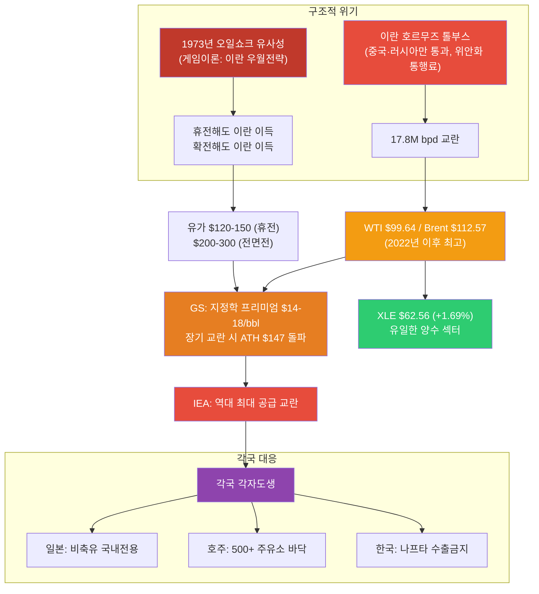

---

## 1. 중동 위기 심화: 호르무즈 톨부스·1973년 오일쇼크 구조·각국 각자도생 (3/28)

### 1.0 신규 이벤트: 호르무즈 톨부스 + 게임이론 분석 + 각국 각자도생

3월 28일, 중동 에너지 위기가 **구조적 장기화 국면**에 진입했습니다. 이란이 호르무즈 해협에 **'톨부스(Tollbooth)' 시스템**을 가동하여 중국·러시아 선박만 통과시키고 위안화로 통행료를 징수하면서, 단순 봉쇄가 아닌 **선별적 통제** 체제로 전환했습니다. 게임이론 분석상 이란의 **우월전략(Dominant Strategy)**은 호르무즈 통제 유지이며, 이는 **1973년 오일쇼크와 구조적으로 유사**합니다.

| 항목 | 내용 |
|------|------|
| **호르무즈 톨부스** | 중국·러시아 선박만 통과, 위안화로 통행료 징수, 17.8M bpd 교란 |
| **WTI** | $99.64 (+5.46%) — $100 돌파 초읽기, 2022년 이후 최고 종가 |
| **Brent** | $112.57 (+4.22%) — 2022년 이후 최고 |
| **GS 지정학 프리미엄** | $14-18/bbl. 장기 교란 시 2008년 ATH($147) 돌파 경고 |
| **게임이론** | 이란 우월전략 = 호르무즈 통제 유지 (미국 휴전·확전 무관하게 이란 이득) |
| **유가 시나리오** | $120-150 (휴전), $200-300 (전면전) |
| **IEA** | "역대 최대 공급 교란" |
| **일본** | 비축유 국내전용 선언 |
| **호주** | 500+ 주유소 연료 바닥 |
| **한국** | 나프타 수출금지 |
| **XLE** | $62.56 (+1.69%) — 유일한 양수 섹터 |
| **LNG** | 카타르 LNG 17% 파괴, 복구 3-5년, 구조적 공급 부족 |

> **1973년 오일쇼크 구조적 유사성**: 당시 OPEC의 석유 무기화와 현재 이란의 호르무즈 통제는 **산유국이 지정학적 레버리지로 에너지를 무기화**한다는 점에서 동일합니다. 게임이론상 이란이 호르무즈를 개방할 인센티브가 없으며(개방 시 군사적 약점 노출 + 협상력 상실), 미국의 대응과 무관하게 통제 유지가 이란의 우월전략입니다.

### 1.1 상황 변화 타임라인

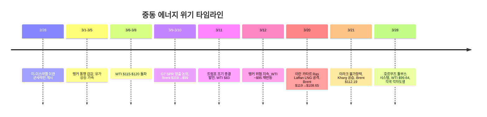

### 1.2 유가 변동 요인 (3/28)

| 요인 | 방향 | 내용 |
|------|:----:|------|
| **호르무즈 톨부스 시스템** | 상승 | 중국·러시아 선박만 통과, 위안화 통행료, 17.8M bpd 교란 |
| **GS 지정학 프리미엄 $14-18/bbl** | 상승 | 장기 교란 시 2008년 ATH($147) 돌파 경고 |
| **1973년 오일쇼크 구조적 유사성** | 상승 | 게임이론상 이란 우월전략 = 호르무즈 통제 유지 |
| **유가 시나리오** | 상승 | 휴전 $120-150, 전면전 $200-300 |
| **IEA "역대 최대 공급 교란"** | 상승 | 공급 교란 장기화 공식 인정 |
| **각국 각자도생** | 상승 | 일본 비축유 국내전용, 호주 주유소 바닥, 한국 나프타 수출금지 |
| **카타르 LNG 구조적 부족** | 상승 | 17% 파괴, 복구 3-5년, LNG 공급 부족 장기화 |
| **WTI $100 돌파 임박** | 상승 | $99.64(+5.46%), 심리적 저항선 돌파 시 추가 급등 가능 |

### 1.3 핵심 리스크: 구조적 장기화 + 게임이론적 교착

- **구조적 장기화 확정**: 이란의 호르무즈 톨부스 시스템은 단순 봉쇄가 아닌 **선별적 통제 체제**. 중국·러시아와의 경제 동맹을 강화하면서 서방 제재를 우회하는 구조
- **게임이론적 교착**: 이란의 우월전략이 호르무즈 통제 유지인 이상, 외교적 해결 가능성이 극히 낮음. 미국이 휴전해도 이란은 톨부스로 수익 창출, 확전해도 유가 급등으로 이란 협상력 증가
- **GS 경고**: 지정학 프리미엄 $14-18/bbl. 장기 교란 시 2008년 ATH($147) 돌파 가능. 전면전 시 $200-300 시나리오
- **각국 각자도생**: 국제 공조 실패 → 일본 비축유 국내전용, 호주 500+ 주유소 연료 바닥, 한국 나프타 수출금지. 에너지 민족주의 확산
- **LNG 구조적 부족 장기화**: 카타르 LNG 17% 파괴(복구 3-5년)와 호르무즈 교란이 결합하여 LNG 공급 부족이 수년간 지속 전망
- **$100 심리적 저항선**: WTI $99.64로 $100 돌파 초읽기. 돌파 시 투기적 매수 + 헤지 수요 폭증으로 추가 급등 가능

### 1.4 산유국 대규모 감산: 600만 배럴

저장시설 포화로 인해 산유국들이 **역대급 감산**에 돌입했습니다.

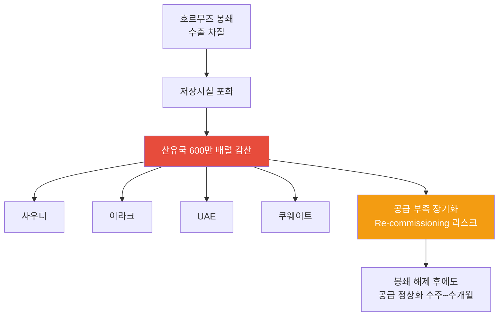

| 국가 | 감산 참여 | 상황 |
|------|:--------:|------|
| **사우디** | O | 최대 규모 감산, 저장시설 포화 대응 |
| **이라크** | O | **3/21 불가항력 선언** — 이란전 여파로 수출 중단, 저장 잔여 극소 |
| **UAE** | O | 생산 감축 지속 |
| **쿠웨이트** | O | 저장 포화 대응 중 |
| **합계** | - | **총 600만 배럴/일 감산** |

> **투자 시사점**: 600만 배럴 감산은 단순 봉쇄 대응이 아니라, **Re-commissioning 리스크**를 수반합니다. 유정 셧다운 후 재가동에 수주~수개월이 소요되므로, 전쟁이 종결되더라도 공급 정상화에는 시간이 필요합니다. 중기적으로 유가 $70-80 레벨이 하한선이 될 가능성이 있습니다.

### 1.5 국가별 에너지 취약성

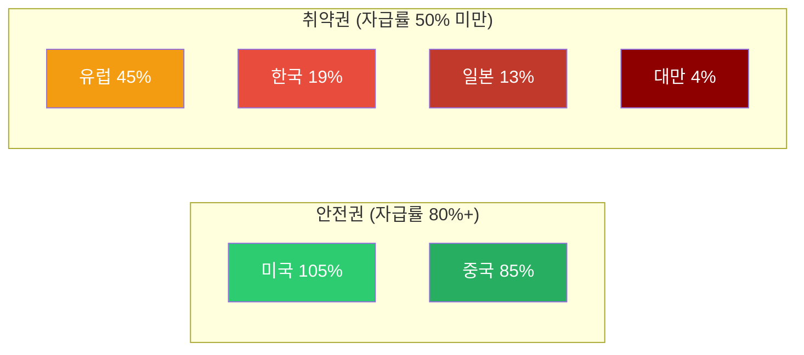

| 국가 | 에너지 자급률 | 호르무즈 영향 | GS 분석 |
|------|:-----------:|------------|---------|
| **미국** | 105% | 매우 낮음 | 순 수출국, 유가 상승 수혜, 제조업 노출 제한적 |
| **중국** | 85% | **가장 적음** | 석유 의존도 9%, 러시아 대체 루트 (Goldman Sachs) |
| **유럽** | 45% | 높음 | LNG 의존, 가스가격 +60% |
| **한국** | 19% | **매우 높음** | 중동 원유 70% 의존 |
| **일본** | 13% | **매우 높음** | 중동 원유 90%+ 의존 |
| **대만** | 4% | **극심** | 거의 전량 수입 |

> **Goldman Sachs 핵심 분석**: 중국이 이번 오일 쇼크에서 **가장 적은 영향**을 받을 것으로 전망. 자급률 85%에 석유 의존도 9%, 러시아 파이프라인 대체 루트까지 확보. 호르무즈 톨부스 시스템에서도 중국 선박은 **통과 허용**. 반면 **한국·일본·대만이 실질적 피해국**입니다.

> **3/28 각자도생 현실화**: 국제 에너지 공조가 사실상 붕괴. 일본은 비축유를 국내전용으로 전환, 호주는 500개 이상 주유소에서 연료가 바닥나는 사태, 한국은 나프타 수출을 금지. 각국이 자국 에너지 확보에만 집중하면서 **에너지 민족주의**가 확산 중입니다. GS는 지정학 프리미엄 $14-18/bbl을 산정하며, 장기 교란 지속 시 **2008년 ATH($147) 돌파**를 경고했습니다.

### 1.6 원자재 사이클: 에너지 다음은 식량

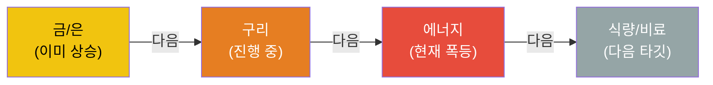

원자재 상승 사이클은 통상 **금/은 → 구리 → 에너지 → 식량/비료** 순서로 전파됩니다. 현재 에너지 단계에서 폭등이 진행 중이며, 다음은 식량/비료 섹터 상승이 예상됩니다.

---

## 2. 하위 섹터 1: Oil & Gas (단기 최대 수혜, 중기 불확실)

### 2.1 XLE $62.56 (+1.69%): 유일한 양수 섹터 — 에너지 슈퍼사이클

XLE이 **$62.56(+1.69%)**로 전체 시장에서 **유일한 양수 섹터**를 기록했습니다. WTI $99.64, Brent $112.57로 유가가 2022년 이후 최고치를 경신하면서 에너지 업스트림 기업들이 직접적인 수혜를 받고 있습니다.

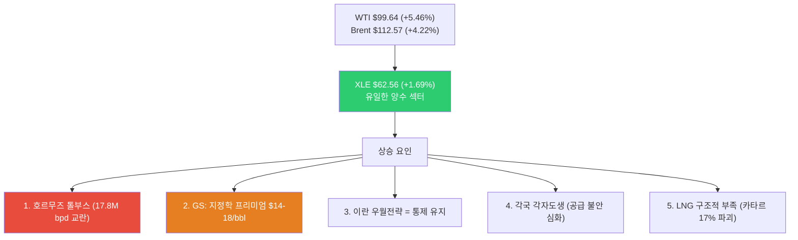

| 요인 | 방향 | 설명 |
|------|:----:|------|
| **호르무즈 톨부스** | 상승 | 17.8M bpd 교란, 선별적 통제로 장기화 구조 |
| **GS 지정학 프리미엄** | 상승 | $14-18/bbl, 장기 교란 시 ATH $147 돌파 경고 |
| **이란 우월전략** | 상승 | 게임이론상 통제 유지가 최적 → 해제 가능성 낮음 |
| **각국 각자도생** | 상승 | 일본·호주·한국 에너지 민족주의, 국제 공조 붕괴 |
| **LNG 구조적 부족** | 상승 | 카타르 17% 파괴, 복구 3-5년 |
| **IEA 경고** | 상승 | "역대 최대 공급 교란" |
| **WTI $100 돌파 임박** | 상승 | 심리적 저항선, 돌파 시 투기적 매수 폭증 |

> **핵심 판단**: 호르무즈 톨부스 + 게임이론적 교착 + 각국 각자도생으로 에너지 위기의 **구조적 장기화**가 확정적입니다. GS의 지정학 프리미엄 $14-18/bbl 산정과 ATH $147 돌파 경고는 현재 유가에 아직 상당한 **상방 여력**이 있음을 시사합니다. WTI $100 돌파 시 심리적 모멘텀까지 가세하여 급등 가능성이 높습니다.

### 2.2 Oil & Gas 업스트림/미드스트림/다운스트림

| 세그먼트 | 현재 상황 | 수혜/위험 | 주요 종목 |
|---------|---------|---------|---------|
| **업스트림 (탐사/생산)** | 미국 셰일 풀가동 인센티브 | **최대 수혜**: 유가 상승 직접 반영 | ExxonMobil (XOM), Chevron (CVX), ConocoPhillips (COP) |
| **미드스트림 (파이프/저장)** | 저장 수요 급증, 미국 LNG 수출 증가 | **수혜**: 물류/저장 수수료 증가 | Enterprise Products (EPD), Kinder Morgan (KMI) |
| **다운스트림 (정유)** | 원유 조달 차질, 크랙 스프레드 확대 | **혼재**: 마진 확대 vs 원유 확보 어려움 | Valero (VLO), Marathon Petroleum (MPC) |

### 2.3 미국 에너지 독립의 의미

미국은 에너지 자급률 105%로 이번 위기에서 **상대적 안전지대**입니다.

- **미국 생산자**: 유가 상승으로 직접 수혜, 수출 증가
- **제조업**: 에너지 비용 상승 영향 제한적 (자체 생산으로 충당)
- **소비자**: 가솔린 17% 상승했으나 아시아/유럽 대비 충격 제한적
- **전략적 위치**: 글로벌 에너지 위기에서 미국 패권 강화

### 2.4 Oil & Gas 투자 전략 (3/28 업데이트)

| 시나리오 | 확률 | 유가 전망 | 전략 |
|---------|:---:|---------|------|
| **톨부스 지속 + 구조적 교착 (현재)** | **50%** ↑ | Brent $120-150 (휴전 시) | 업스트림 최대 비중, LNG 노출 확대, 에너지 인플레 수혜주 집중 |
| **전면전 확전** | **20%** | $200-300 | 에너지 전체 올인, 경기침체 헤지 필수, 방어주 병행 |
| **협상 통한 톨부스 해제** | 20% ↓ | Brent $80-100 | Oil 비중 점진 축소, LNG 유지 (카타르 구조적 부족), 클린에너지 |
| **외교적 전면 해결** | 10% | WTI $70-80 | Oil 대폭 축소, 원전/클린에너지 집중 |

> **3/28 시나리오 변경 사항**: 게임이론 분석상 이란 우월전략 = 호르무즈 통제 유지로 **"톨부스 지속 + 구조적 교착" 확률 40%→50%로 상향**. GS의 ATH $147 돌파 경고와 유가 시나리오($120-150 휴전, $200-300 전면전)를 반영하여 전망 상향. 각국 각자도생(에너지 민족주의)으로 국제 공조 기반 해결 가능성 하락.

---

## 3. 하위 섹터 2: 원전/SMR (최상위 투자 매력 - 에너지 안보 핵심)

> **상세 분석**: [2026년 원전 투자 전망](/knowledge/invest/2026/01/21/nuclear-power-sector-outlook-2026.html)

### 3.1 원전/SMR: 정책·기술·수요 3박자 강세

호르무즈 위기가 원전의 에너지 안보 가치를 증명한 데 이어, **미국 $80B 신규 원전 펀딩**과 **NuScale SMR 규제 승인** 등 정책·기술 측면에서도 강력한 모멘텀이 추가되었습니다.

| 항목 | 내용 |
|------|------|
| **미국 $80B 원전 펀딩** | 신규 원전 건설을 위한 대규모 연방 펀딩 발표 (3/11) |
| **AI DC 전력 5x 성장** | AI 데이터센터 전력 수요 **2030년까지 5배 성장** 전망 |
| **NuScale SMR 규제 승인** | NRC 인증에 이어 **규제 승인** 획득, 상용화 가속 |
| **Cameco EPS +55%** | 우라늄 수요 급증으로 Cameco 실적 전망 대폭 상향 |
| **URA ETF 상승 지속** | 우라늄 가격 상승과 원전 투자 확대 반영 |
| **SMR 상용화 가시화** | 중국 링롱원 세계 최초 상업용 육상 SMR **2026년 상반기 가동** |
| **글로벌 원전 확대** | 2026년 신규 원자로 15기(12GW) 가동 예정 |
| **에너지 안보** | 호르무즈 위기 → 자급률 19% 한국에 원전 필수불가결 |
| **SMR 특별법** | 2026.2.12 국회 통과 → i-SMR 상용화 가속 |
| **우라늄 전망** | Goldman Sachs 목표가 $91/lb (2026년 말) |

### 3.2 2026년 원전 가동 타임라인

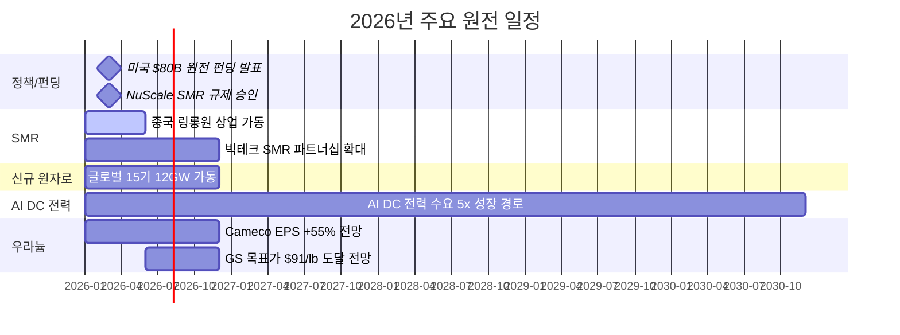

### 3.3 주요 종목

| 종목 | 시장 | 핵심 포인트 | 리스크 |
|------|------|-----------|--------|
| **두산에너빌리티** | KRX | **대장주**. SMR 기자재 독점, 원전 EPC, xAI 가스터빈 5기 수주 | 건설 지연 |
| **BH** | KRX | 가스터빈과 세트 (보일러/스팀), 두산에너빌리티 동반 수혜 | 가스터빈 수주 의존 |
| **한전기술** | KRX | i-SMR 설계 주관사 | 매출 인식 시점 |
| **현대일렉트릭** | KRX | **765kV 초고압 변압기** 생산 가능 극소수 기업, 수작업 필수 | 납기 지연 |
| **효성중공업** | KRX | 초고압 변압기 핵심 기업, 글로벌 수요 급증 | 원자재 가격 |
| **NuScale (SMR)** | NYSE | NRC 인증 유일 SMR | 상용화 지연 |
| **Cameco (CCJ)** | NYSE | 우라늄 채굴 1위, GS 목표가 $91/lb | 우라늄 가격 변동 |
| **Oklo (OKLO)** | NYSE | Meta 1.2GW PPA 체결 | 기술 검증 미완 |

> **변압기 투자 포인트**: 데이터센터·원전·재생에너지 모두 변압기가 필수이며, 특히 765kV급 초고압 변압기는 전 세계에서 **극소수 기업만 생산 가능**하고, 자동화가 불가능한 **수작업** 공정으로 공급 병목이 심각합니다.

---

## 4. 하위 섹터 3: 재생에너지 (대안 에너지 수혜 + 구조적 성장)

> **상세 분석**: [2026년 재생에너지 투자 전망](/knowledge/invest/2026/03/07/renewable-energy-outlook-2026.html)

### 4.1 호르무즈 톨부스 + LNG 구조적 부족 → 청정에너지 전환 가속

호르무즈 톨부스 시스템으로 화석연료 공급이 **구조적으로 불안정**해지면서, 각국의 에너지 독립을 위한 청정에너지 전환이 가속되고 있습니다. 카타르 LNG 17% 파괴(복구 3-5년)와 결합하여 화석연료 의존의 위험성이 극명하게 드러났습니다. 각국의 각자도생(일본 비축유 국내전용, 한국 나프타 수출금지)은 에너지 독립의 시급성을 더욱 부각시키고 있습니다.

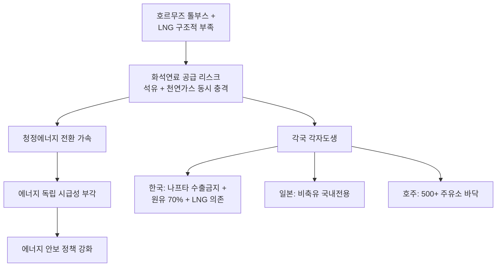

### 4.2 핵심 투자 포인트

| 항목 | 내용 |
|------|------|
| **미국 신규 용량 99%** | 2026년 신규 발전의 99%가 재생에너지+ESS |
| **태양광 44.5GW** | 미국 역대 최대 유틸리티 태양광 설치 |
| **IRA AMPC** | 미국 내 제조 보조금으로 리쇼어링 가속 |
| **호르무즈 수혜** | 에너지 안보 인식 전환, ICLN 18.51 (+1.42%) |

### 4.3 주요 종목

| 종목 | 시장 | 핵심 포인트 |
|------|------|-----------|
| **한화솔루션** | KRX | 미국 수직계열화, AMPC 수혜, 2026 판매 9GW 목표 |
| **First Solar (FSLR)** | NASDAQ | 미국 유일 대규모 태양광 제조 |
| **NextEra Energy (NEE)** | NYSE | 세계 최대 재생에너지 유틸리티, EPS $3.92~4.02 |
| **CS윈드** | KRX | 풍력 타워 글로벌 1위, **미국/유럽 현지 공장** 보유 (관세 리스크 낮음) |
| **Vestas (VWS)** | CPH | 풍력 터빈 세계 1위, 백로그 EUR 31.6B |

---

## 5. 하위 섹터 4: ESS (그리드 불안정 → 필수 인프라)

> **상세 분석**: [2026년 ESS 투자 전망](/knowledge/invest/2026/03/07/ess-energy-storage-outlook-2026.html)

### 5.1 에너지 위기가 ESS 필요성을 극대화

호르무즈 봉쇄로 인한 에너지 공급 불안정은 **그리드 안정화를 위한 ESS 수요를 폭발적으로 증가**시키고 있습니다. 재생에너지 비중 확대와 맞물려 ESS는 선택이 아닌 필수 인프라가 되었습니다.

| 항목 | 내용 |
|------|------|
| **시장 규모** | $146B(2025) → $521B(2035), CAGR 13.6% |
| **미국 신규** | 2026년 24.3GW 배터리 신규 설치 |
| **LFP 주도** | 비용/안전/수명 우위로 그리드 ESS 표준 |
| **ESS 마진 우위** | ESS 마진 20%+ vs EV 배터리 8% |
| **LIT 72.99 (+1.35%)** | 리튬/배터리 ETF 상승 지속 = ESS 수혜 반영 |

### 5.2 주요 종목

| 종목 | 시장 | 핵심 포인트 |
|------|------|-----------|
| **삼성SDI** | KRX | SBB ESS 라인업, 전고체 2027~2028 |
| **LG에너지솔루션** | KRX | 미국 ESS 90GWh 목표, LFP 30GWh, **ESS 매출 비중 20%로 확대** |
| **Tesla (TSLA)** | NASDAQ | Megapack 3, Megablock, 미국 LFP 생산 |
| **BYD** | HKEX | 나트륨이온 ESS, 30GWh 공장 착공 |
| **CATL** | SHE | 나트륨이온 2026 본격 양산, 175Wh/kg |

> **ESS 마진 우위**: LG에너지솔루션 기준 ESS 매출 비중이 10%→20%로 확대 중이며, ESS 마진(20%+)이 EV 배터리 마진(8%)을 크게 상회합니다. ESS가 배터리 기업의 수익성 개선 핵심 동력입니다.

---

## 6. 하위 섹터 5: 수소 에너지 (장기 에너지 독립 수단)

> **상세 분석**: [2026년 수소 에너지 투자 전망](/knowledge/invest/2026/03/07/hydrogen-energy-outlook-2026.html)

### 6.1 호르무즈 위기 → 에너지 독립 수단으로서의 수소 가치 재조명

수소는 단기적 수혜보다는 **장기적 에너지 독립** 수단으로 전략적 가치가 부각되고 있습니다. 호르무즈 사태가 보여주듯 화석연료 의존의 지정학적 리스크가 현실화되면서, 자국 생산 가능한 그린수소의 전략적 중요성이 높아지고 있습니다.

| 항목 | 내용 |
|------|------|
| **NEOM 프로젝트** | $8.4B, 세계 최대 그린수소, 2026~2027 완공 |
| **45V 세액공제** | 그린수소 $3/kg 보조금 (IRA) |
| **두산퓨얼셀** | SOFC 양산, 미국 DC 시장 진출 |
| **전략적 가치** | 에너지 자급을 위한 장기 솔루션 |

### 6.2 고려아연 수소 진출 (3/12 신규)

EU CBAM(탄소국경조정메커니즘) 2026.1 시행으로 **그린메탈** 전환이 필수가 되면서, 고려아연이 수소 사업에 본격 진출하고 있습니다.

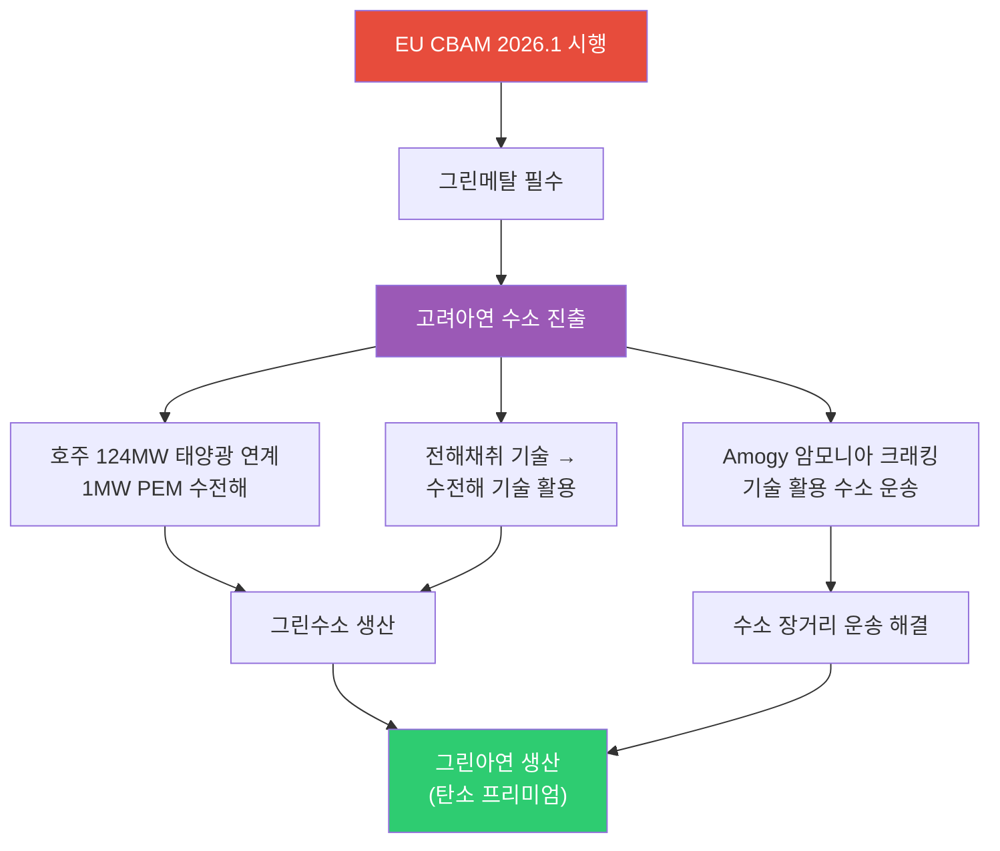

| 항목 | 내용 |
|------|------|
| **EU CBAM** | 2026.1 시행 → 탄소 배출 높은 금속에 관세 부과, 그린메탈 전환 필수 |
| **호주 PEM 수전해** | 124MW 태양광 연계 1MW PEM 수전해 설비 → 그린수소 생산 |
| **전해채취 → 수전해** | 아연 전해채취(electrolytic extraction) 기술을 수전해(water electrolysis)에 활용 |
| **Amogy 암모니아 크래킹** | 수소를 암모니아로 변환 후 운송, 도착지에서 크래킹으로 수소 추출 → 장거리 운송 해결 |

> **투자 시사점**: 고려아연의 수소 진출은 단순 에너지 사업이 아니라 **CBAM 대응을 위한 그린메탈 전환 전략**입니다. 전해채취 기술 노하우를 수전해에 활용하는 것은 기술적 시너지가 크며, Amogy 암모니아 크래킹을 통한 수소 운송은 수소 인프라 부재의 근본 과제를 해결하는 접근입니다.

### 6.3 주요 종목

| 종목 | 시장 | 핵심 포인트 |
|------|------|-----------|
| **고려아연** | KRX | EU CBAM 대응, 호주 PEM 수전해, 그린메탈 전환 (3/12 신규) |
| **두산퓨얼셀** | KRX | SOFC 양산, 2026 매출 6,900억 목표 |
| **효성첨단소재** | KRX | 탄소섬유 수소탱크 핵심 소재 |
| **Plug Power (PLUG)** | NASDAQ | 전해조+운송+충전 수직계열화 |
| **Bloom Energy (BE)** | NYSE | SOFC 2GW 생산 확대 |
| **Air Products (APD)** | NYSE | NEOM 그린수소 독점 오프테이커 |

---

## 7. AI 데이터센터 전력 수요 (구조적 메가트렌드 지속)

호르무즈 위기에도 불구하고 AI 전력 수요라는 구조적 메가트렌드는 **변함없이 진행** 중입니다.

### 7.1 빅테크 CAPEX: 역대 최대 $690B

| 기업 | 2026 CAPEX (추정) | 주요 프로젝트 | 전력 관련 이슈 |
|------|-----------------|-------------|-------------|
| **Amazon** | ~$200B | 역대 최대 단일 연도 기업 투자 | 원전 PPA 적극 추진 |
| **Google** | $175~185B | 2025년 $91B 대비 2배 | 소형원전(SMR) 투자 |
| **Meta** | $115~135B | 오하이오 1GW DC, 루이지애나 5GW 규모 DC | 재생에너지 PPA 확대 |
| **Microsoft** | ~$120B+ | Azure $80B 수주잔고(전력 부족으로 미이행) | **전력 병목이 성장 제약** |
| **합계** | **~$690B** | AI 인프라 역대 최대 | 전력이 핵심 병목 |

### 7.2 전력 수요 전망

- **데이터센터 전력 소비**: 2026년 **1000TWh**에 도달 전망 → 글로벌 원전 발전량의 **1/3** 수준
- **Deloitte 전망**: 미국 AI 데이터센터 전력 수요 4GW(2024) → 123GW(2035)
- **IEA 전망**: 글로벌 데이터센터 전력 소비 2024~2030년 **2배 이상 증가**
- **xAI/Tesla**: 두산에너빌리티로부터 가스터빈 5기 수주, 추가 15기 예상

---

## 8. 에너지 하위 섹터별 투자 매력도 비교

### 8.1 종합 평가표 (3/28 업데이트)

| 하위 섹터 | 단기 모멘텀 (6M) | 중기 성장성 (2~3Y) | 장기 구조적 (5Y+) | 리스크 | 종합 투자 매력도 |
|----------|:-:|:-:|:-:|---------|:-:|
| **Oil & Gas** | ★★★★★ | ★★★★★ | ★★★ | GS ATH $147 경고, 전면전 시 $200-300, 톨부스 장기화 | **S (최상, 상향)** |
| **원전/SMR** | ★★★★★ | ★★★★★ | ★★★★★ | 인허가 지연, 건설 초과비용 | **S (최상)** |
| **ESS** | ★★★★★ | ★★★★★ | ★★★★ | 안전성, LFP 공급과잉 | **A+** |
| **재생에너지** | ★★★★★ | ★★★★ | ★★★★ | 중국 과잉공급, 정책 불확실성 | **A (에너지 독립 모멘텀)** |
| **수소** | ★★★☆ | ★★★★ | ★★★★★ | 높은 생산비용, 인프라 부재 | **A-** |

> **3/28 평가 변경 사항**:
> - **Oil & Gas (A → S 상향)**: 호르무즈 톨부스 시스템으로 구조적 장기화 확정. GS 지정학 프리미엄 $14-18/bbl, ATH $147 돌파 경고. 게임이론상 이란 우월전략 = 통제 유지 → 외교적 해결 가능성 극히 낮음. WTI $100 돌파 초읽기. XLE이 시장 유일한 양수 섹터.
> - **에너지 민족주의 확산**: 각국 각자도생(일본 비축유 국내전용, 호주 주유소 바닥, 한국 나프타 수출금지)으로 국제 에너지 공조 붕괴. 에너지 독립이 생존 문제로 격상 → 원전/재생에너지/수소 모든 에너지 하위 섹터에 장기 수혜.
> - **1973년 오일쇼크 유사성**: 산유국의 에너지 무기화, 선별적 공급 통제, 각국 각자도생 — 구조적으로 동일한 패턴. 당시 유가는 4배 상승했으며, 현재도 유사한 경로 진행 중.

### 8.2 섹터별 시장 규모 전망

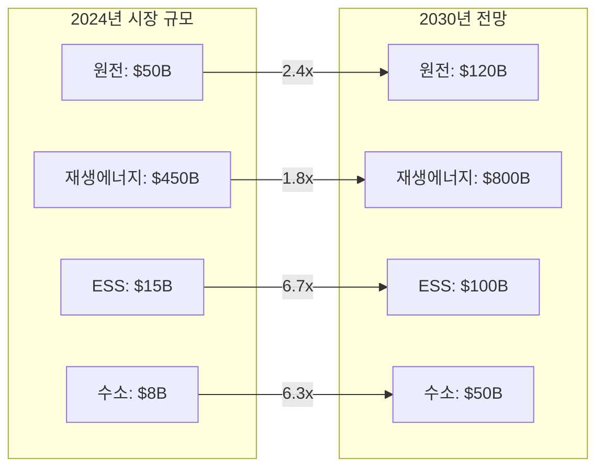

---

## 9. 투자 전략: 호르무즈 시나리오별 대응

### 9.1 포트폴리오 구성 제안

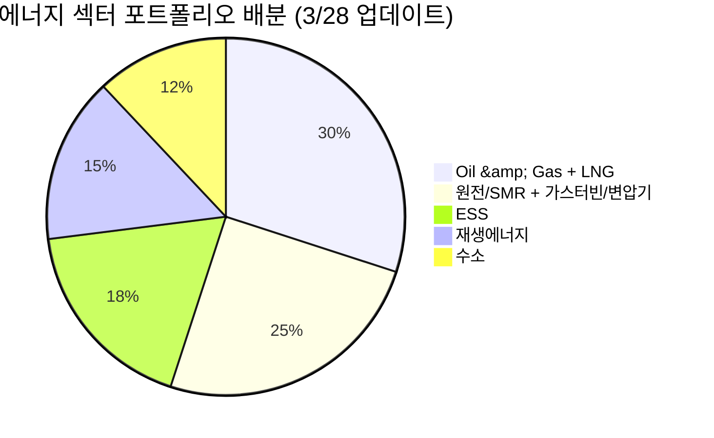

### 9.2 시나리오별 전략 (3/28 업데이트)

| 시나리오 | 확률 | 유가 전망 | 최적 전략 |
|---------|:---:|---------|---------|
| **톨부스 지속 + 구조적 교착** | **50%** ↑ | Brent $120-150 (휴전 시) | Oil 업스트림 최대 비중, LNG 확대, 에너지 인플레 수혜주 집중 |
| **전면전 확전** | **20%** | $200-300 | 에너지 전체 올인, 경기침체 헤지 필수(방어주·현금), 식량 섹터 |
| **협상 통한 톨부스 해제** | 20% ↓ | Brent $80-100 | Oil 점진 축소, LNG 유지(카타르 구조적 부족), 클린에너지 확대 |
| **외교적 전면 해결** | 10% | WTI $70-80 | Oil 대폭 축소, 원전/클린에너지 집중 |

> **3/28 전략 변경**: 게임이론 분석상 이란 우월전략 = 통제 유지로 **"톨부스 지속" 확률 50%로 상향**. Oil & Gas 비중을 20%→30%로 상향하고 포트폴리오 1순위로 격상. GS ATH $147 돌파 경고, 각국 각자도생으로 에너지 민족주의 확산. **WTI $100 돌파 시 추가 급등 모멘텀**이 예상되므로 업스트림 비중 극대화가 핵심.

### 9.3 리스크 요인

| 리스크 | 영향 | 대응 |
|--------|------|------|
| **호르무즈 톨부스 장기화** | 17.8M bpd 교란 지속, 이란 우월전략으로 해제 가능성 낮음 | 업스트림 최대 비중, 에너지 인플레 수혜주 집중 |
| **전면전 확전 ($200-300)** | 글로벌 경기침체, 에너지 슈퍼스파이크, 식량 위기 동반 | 에너지 올인 + 방어주 + 현금 비중 확대 |
| **GS ATH $147 돌파** | 지정학 프리미엄 $14-18/bbl, 장기 교란 시 현실화 | Oil 업스트림 비중 유지, 수요 파괴 리스크 모니터링 |
| **각국 에너지 민족주의** | 국제 공조 붕괴, 수출 제한(한국 나프타), 비축유 국내전용(일본) | 에너지 자급률 높은 국가 기업 투자, 미국 에너지주 선호 |
| **카타르 LNG 구조적 부족** | 17% 파괴, 복구 3-5년, LNG 가격 장기 상승 | 미국 LNG 수출 관련주, 천연가스 노출 확대 |
| **WTI $100 돌파** | 심리적 저항선 돌파 시 투기적 매수 + 헤지 수요 폭증 | 돌파 전 포지션 구축, 모멘텀 추종 |
| **Re-commissioning 장기화** | 봉쇄 해제 후에도 공급 부족 지속 (600만 배럴 감산) | 원유 업스트림 장기 보유 |
| **경기침체 (수요 파괴)** | 유가 $100+ → 인플레 → 금리인상 → 수요 감소 | 고배당 유틸리티, 현금흐름 우수 기업 |
| **IRA 축소/폐지** | 재생에너지, 수소, ESS 타격 | 미국 외 지역 분산 |

---

## 핵심 데이터 요약

| 지표 | 수치 | 출처/기준 |
|------|------|----------|
| **WTI 유가** | **$99.64 (+5.46%)** | 2026.3.28, $100 돌파 초읽기, 2022년 이후 최고 종가 |
| **Brent 유가** | **$112.57 (+4.22%)** | 2026.3.28, 2022년 이후 최고 |
| **호르무즈 톨부스** | **중국·러시아만 통과, 위안화 통행료** | 17.8M bpd 교란 |
| **GS 지정학 프리미엄** | **$14-18/bbl** | 장기 교란 시 ATH $147 돌파 경고 |
| **게임이론 분석** | **이란 우월전략 = 호르무즈 통제 유지** | 휴전·확전 무관하게 이란 이득 |
| **유가 시나리오** | **$120-150(휴전), $200-300(전면전)** | 1973년 오일쇼크 유사 구조 |
| **IEA 경고** | **"역대 최대 공급 교란"** | 공급 교란 장기화 |
| **일본** | **비축유 국내전용** | 에너지 민족주의 |
| **호주** | **500+ 주유소 연료 바닥** | 공급 부족 현실화 |
| **한국** | **나프타 수출금지** | 에너지 민족주의 |
| **XLE** | **$62.56 (+1.69%)** | 유일한 양수 섹터 |
| **카타르 LNG** | **17% 파괴, 복구 3-5년** | 구조적 공급 부족 |
| **산유국 감산** | **600만 배럴/일** | 사우디·이라크·UAE·쿠웨이트 |
| **미국 원전 펀딩** | **$80B** | 신규 원전 건설 |
| **AI DC 전력 성장** | **5x** | 2030년까지 |
| 빅테크 2026 CAPEX | ~$690B | Futurum |
| DC 전력 소비 (2026) | 1000TWh | 글로벌 원전의 1/3 |
| 미국 2026 태양광 신규 | 44.5GW | EIA |
| 미국 2026 ESS 신규 | 24.3GW | EIA |
| ESS 시장 규모 (2035) | $521B | 시장조사 |
| 2026 신규 원자로 | 15기 (12GW) | 글로벌 |
| 우라늄 GS 목표가 | $91/lb (2026말) | Goldman Sachs |
| 한국 에너지 자급률 | 19% | 중동 원유 70% + 카타르 LNG 수입 |
| ESS 마진 | 20%+ (vs EV 8%) | LG에너지솔루션 |

---

## 결론

2026년 3월 28일, 이란의 호르무즈 **'톨부스' 시스템** 가동으로 중동 에너지 위기가 **구조적 장기화 국면**에 진입했습니다. WTI **$99.64(+5.46%)**로 **$100 돌파 초읽기**이며, Brent **$112.57(+4.22%)**로 2022년 이후 최고치입니다. 게임이론 분석상 이란의 우월전략은 호르무즈 통제 유지이며, 이는 **1973년 오일쇼크와 구조적으로 유사**합니다.

**3/28 핵심 변화**:
- **호르무즈 톨부스** — 중국·러시아 선박만 통과, 위안화 통행료, 17.8M bpd 교란
- **GS 경고** — 지정학 프리미엄 $14-18/bbl, 장기 교란 시 2008년 ATH($147) 돌파
- **게임이론** — 이란 우월전략 = 통제 유지 (휴전·확전 무관하게 이란 이득)
- **유가 시나리오** — $120-150(휴전), $200-300(전면전)
- **IEA** — "역대 최대 공급 교란"
- **각국 각자도생** — 일본 비축유 국내전용, 호주 500+ 주유소 바닥, 한국 나프타 수출금지
- **XLE $62.56(+1.69%)** — 시장 유일한 양수 섹터
- **LNG 구조적 부족** — 카타르 LNG 17% 파괴, 복구 3-5년

**투자 우선순위** (3/28 업데이트):
1. **Oil & Gas + LNG** (30%, 1순위 격상): ExxonMobil, ConocoPhillips, 미국 LNG 수출 — 톨부스 장기화 + GS ATH 경고 + WTI $100 돌파 임박. 에너지 인플레 최대 수혜
2. **원전/SMR + 가스터빈/변압기** (25%): 두산에너빌리티, BH, 현대일렉트릭, 효성중공업, Cameco — $80B 펀딩 + AI DC 5x + 에너지 독립 핵심
3. **ESS** (18%): LG에너지솔루션, 삼성SDI — 그리드 안정화 필수, 마진 20%+ 우위
4. **재생에너지** (15%): CS윈드, 한화솔루션, First Solar — 에너지 민족주의 → 에너지 독립 투자 가속
5. **수소** (12%): 고려아연, 두산퓨얼셀 — EU CBAM 대응 + 장기 에너지 독립 수단

> **핵심 경고**: 1973년 오일쇼크 당시 유가는 **4배 상승**했습니다. 현재 이란의 호르무즈 톨부스 시스템은 당시 OPEC의 석유 무기화와 구조적으로 동일하며, 게임이론상 이란의 우월전략이 통제 유지인 이상 외교적 해결 가능성은 극히 낮습니다. WTI $100 돌파 시 심리적 모멘텀까지 가세하여 **급등 가속**이 예상됩니다.
