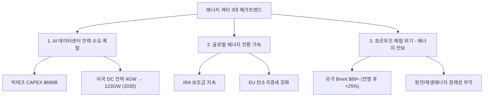
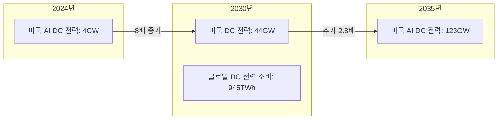
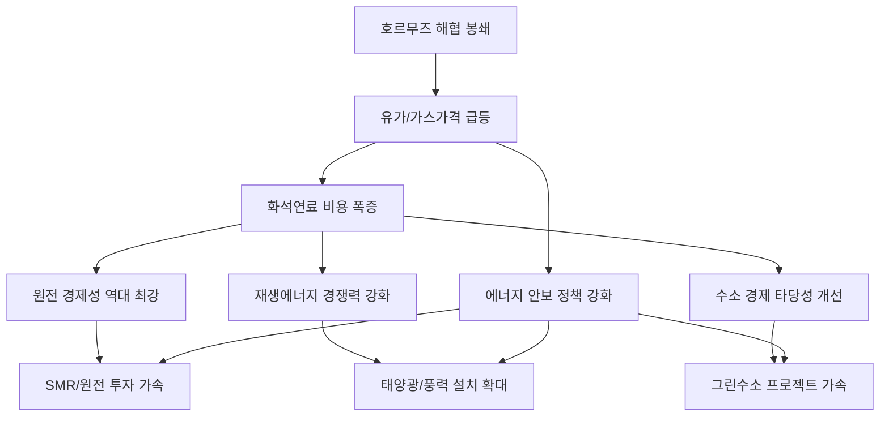
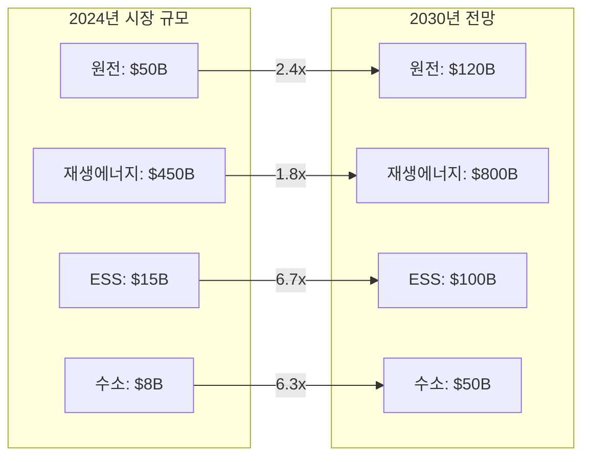
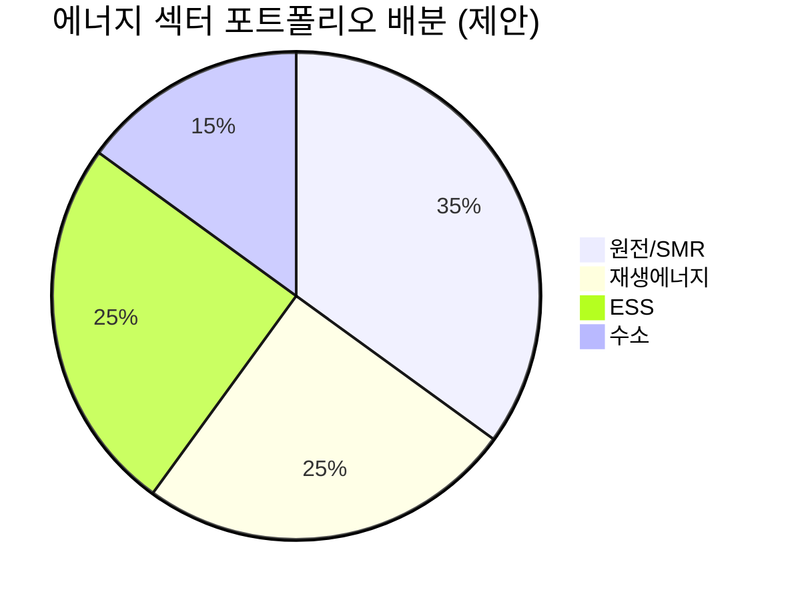

> **시리즈 안내**: 이 글은 에너지 섹터 종합 전망입니다. 하위 섹터별 상세 분석은 아래 링크를 참고하세요.
> - [재생에너지 (태양광/풍력) 상세 분석](/knowledge/invest/2026/03/07/renewable-energy-outlook-2026.html)
> - [ESS (에너지 저장 시스템) 상세 분석](/knowledge/invest/2026/03/07/ess-energy-storage-outlook-2026.html)
> - [수소 에너지 상세 분석](/knowledge/invest/2026/03/07/hydrogen-energy-outlook-2026.html)
> - [원전/SMR 상세 분석](/knowledge/invest/2026/01/21/nuclear-power-sector-outlook-2026.html)

---

## 에너지 섹터 3대 메가트렌드

2026년 에너지 섹터는 세 가지 거대한 구조적 변화가 동시에 진행되고 있습니다.

---

## 1. AI 데이터센터 전력 수요 폭발

### 빅테크 CAPEX: 역대 최대 $690B

2026년 주요 빅테크 기업들의 인프라 투자 규모가 역대 최대치를 경신하고 있습니다. 그 대부분이 AI 컴퓨팅, 데이터센터, 네트워킹에 집중되고 있습니다.

| 기업 | 2026 CAPEX (추정) | 주요 프로젝트 | 전력 관련 이슈 |
|------|-----------------|-------------|-------------|
| **Amazon** | ~$200B | 역대 최대 단일 연도 기업 투자 | 원전 PPA 적극 추진 |
| **Google** | $175~185B | 2025년 $91B 대비 2배 | 소형원전(SMR) 투자 |
| **Meta** | $115~135B | 오하이오 1GW DC, 루이지애나 5GW 규모 DC | 재생에너지 PPA 확대 |
| **Microsoft** | ~$120B+ | Azure $80B 수주잔고(전력 부족으로 미이행) | **전력 병목이 성장 제약** |
| **합계** | **~$690B** | AI 인프라 역대 최대 | 전력이 핵심 병목 |

Microsoft의 사례가 특히 시사적입니다. Azure 주문 $80B 백로그가 **전력 제약** 때문에 이행되지 못하고 있어, 전력 공급이 AI 산업 성장의 핵심 병목이 되고 있습니다.

### 전력 수요 전망: 일본 전체 전력에 맞먹는 규모

- **Deloitte 전망**: 미국 AI 데이터센터 전력 수요 4GW(2024) → 123GW(2035)
- **IEA 전망**: 글로벌 데이터센터 전력 소비 2024~2030년 **2배 이상 증가**, 2030년 945TWh 도달 (일본 전체 전력 소비량에 해당)
- **Nvidia CEO 젠슨 황**: AI 인프라에 2030년까지 **$3~4조** 투자 예상

### 투자 시사점

AI 전력 수요 폭발은 에너지 섹터 전체에 구조적 수혜를 제공합니다:

1. **원전/SMR**: 24시간 안정적 기저 전력 → 데이터센터 최적 전원
2. **재생에너지**: 빅테크 RE100 이행 + PPA 확대
3. **ESS**: 재생에너지 간헐성 보완 필수
4. **수소**: 장기 에너지 저장 및 연료전지 DC 전원

---

## 2. 글로벌 에너지 전환 가속

### IRA (Inflation Reduction Act) 보조금 효과

미국 IRA 보조금은 2026년에도 에너지 섹터의 핵심 촉매로 작동하고 있습니다.

| IRA 주요 혜택 | 내용 | 수혜 섹터 |
|-------------|------|---------|
| **ITC (Investment Tax Credit)** | 태양광/ESS 투자세액공제 30%+ | 태양광, ESS |
| **PTC (Production Tax Credit)** | 풍력/원전 생산세액공제 | 풍력, 원전 |
| **AMPC (Advanced Manufacturing)** | 미국 내 제조 보조금 | 태양광 셀/모듈, 배터리 |
| **45V 수소 세액공제** | 그린수소 $3/kg | 수소 |
| **48C 세액공제** | 청정에너지 제조시설 투자 | 전체 에너지 |

### 미국 신규 발전 용량: 99%+ 재생에너지

EIA에 따르면 2026년 미국 신규 발전 용량의 **99% 이상**이 태양광, 풍력, 배터리 저장 시스템입니다.

| 에너지원 | 2026 신규 용량 | 비중 |
|---------|-------------|------|
| **태양광** | 44,470MW | 51% |
| **배터리 저장** | 24,269MW | 28% |
| **풍력 (육상+해상)** | 11,884MW | 14% |
| **기타 재생** | ~6% | 6% |
| **화석연료** | <1% | <1% |

### 한국 에너지 정책

- **제11차 전력수급기본계획**: 원전 비중 확대, SMR 육성
- **SMR 특별법** 국회 통과 (2026.2.12): 한국형 SMR(i-SMR) 상용화 가속
- **재생에너지 3020**: 2030년 재생에너지 비중 21.6% 목표 (현실적으로 하향 조정 가능성)
- **수소경제 로드맵**: 2030년 수소차 10만 대, 수소 발전 확대

---

## 3. 호르무즈 해협 위기 → 에너지 안보 부각

### 위기 상황

2026년 2월 28일, 미국-이스라엘의 이란 군사작전 개시 이후 호르무즈 해협이 사실상 봉쇄 상태에 진입했습니다.

| 항목 | 내용 |
|------|------|
| **위기 시작** | 2026.2.28 (미-이스라엘 대이란 군사작전) |
| **해협 통과 물량** | 글로벌 원유 20%, LNG 20% |
| **유가 영향** | Brent $89.44 (전쟁 전 대비 **+25%**) |
| **천연가스** | 유럽 가스가격 **+60%** 급등 |
| **주요 피해국** | 한국, 일본, 중국, 인도 (아시아 원유의 70%) |

### 에너지 안보 → 에너지 전환 가속

호르무즈 위기는 역설적으로 에너지 전환을 가속시키는 촉매제가 되고 있습니다:

1. **원전**: 유가 $89+ → 원전 LCOE 경쟁력 극대화, SMR 투자 가속
2. **재생에너지**: 화석연료 가격 상승 → 태양광/풍력 상대 경쟁력 강화
3. **ESS**: 에너지 자립 필요성 → 분산형 전원 + ESS 수요 급증
4. **수소**: LNG 의존도 축소 → 그린수소 전환 논의 확대

---

## 에너지 하위 섹터별 투자 매력도 비교

### 종합 평가표

| 하위 섹터 | 단기 모멘텀 (6M) | 중기 성장성 (2~3Y) | 장기 구조적 (5Y+) | 리스크 | 종합 투자 매력도 |
|----------|:-:|:-:|:-:|---------|:-:|
| **원전/SMR** | ★★★★★ | ★★★★★ | ★★★★★ | 인허가 지연, 건설 초과비용 | **S (최상)** |
| **재생에너지** | ★★★★ | ★★★★ | ★★★★ | 중국 과잉공급, 정책 불확실성 | **A** |
| **ESS** | ★★★★★ | ★★★★★ | ★★★★ | 안전성, LFP 공급과잉 | **A+** |
| **수소** | ★★★ | ★★★ | ★★★★★ | 높은 생산비용, 인프라 부재 | **B+** |

### 섹터별 시장 규모 전망

---

## 하위 섹터 1: 원전/SMR (최상위 투자 매력)

> **상세 분석**: [2026년 원전 투자 전망](/knowledge/invest/2026/01/21/nuclear-power-sector-outlook-2026.html)

### 핵심 투자 포인트

| 항목 | 내용 |
|------|------|
| **AI DC 전원 최적** | 24시간 안정적 기저전력, 빅테크 PPA 급증 |
| **SMR 특별법** | 2026.2.12 국회 통과 → i-SMR 상용화 가속 |
| **유가 급등** | Brent $89+ → 원전 경제성 역대 최강 |
| **에너지 안보** | 호르무즈 위기 → 원전 에너지 자립 필수론 |
| **글로벌 확장** | KHNP 필리핀/싱가포르/태국 MOU 연속 체결 |

### 주요 종목

| 종목 | 시장 | 핵심 포인트 | 리스크 |
|------|------|-----------|--------|
| **두산에너빌리티** | KRX | SMR 기자재 독점, 원전 EPC | 건설 지연 |
| **한전기술** | KRX | i-SMR 설계 주관사 | 매출 인식 시점 |
| **NuScale (SMR)** | NYSE | NRC 인증 유일 SMR | 상용화 지연 |
| **Cameco (CCJ)** | NYSE | 우라늄 채굴 1위, $86/lb | 우라늄 가격 변동 |
| **Oklo (OKLO)** | NYSE | Meta 1.2GW PPA 체결 | 기술 검증 미완 |

---

## 하위 섹터 2: 재생에너지 (구조적 성장)

> **상세 분석**: [2026년 재생에너지 투자 전망](/knowledge/invest/2026/03/07/renewable-energy-outlook-2026.html)

### 핵심 투자 포인트

| 항목 | 내용 |
|------|------|
| **미국 신규 용량 99%** | 2026년 신규 발전의 99%가 재생에너지+ESS |
| **태양광 44.5GW** | 미국 역대 최대 유틸리티 태양광 설치 |
| **IRA AMPC** | 미국 내 제조 보조금으로 리쇼어링 가속 |
| **한화솔루션** | 2026 판매 9GW 목표, AMPC ~9,500억 원 |

### 주요 종목

| 종목 | 시장 | 핵심 포인트 |
|------|------|-----------|
| **한화솔루션** | KRX | 미국 수직계열화, AMPC 수혜 |
| **First Solar (FSLR)** | NASDAQ | 미국 유일 대규모 태양광 제조 |
| **NextEra Energy (NEE)** | NYSE | 세계 최대 재생에너지 유틸리티, EPS $3.92~4.02 |
| **씨에스윈드** | KRX | 풍력 타워 글로벌 1위 |
| **Vestas (VWS)** | CPH | 풍력 터빈 세계 1위, 백로그 EUR 31.6B |

---

## 하위 섹터 3: ESS (폭발적 성장)

> **상세 분석**: [2026년 ESS 투자 전망](/knowledge/invest/2026/03/07/ess-energy-storage-outlook-2026.html)

### 핵심 투자 포인트

| 항목 | 내용 |
|------|------|
| **시장 규모** | $146B(2025) → $521B(2035), CAGR 13.6% |
| **미국 신규** | 2026년 24.3GW 배터리 신규 설치 |
| **LFP 주도** | 비용/안전/수명 우위로 그리드 ESS 표준 |
| **Tesla Megapack 3** | + Megablock으로 1GWh 20일 배치 가능 |
| **LG에너지솔루션** | 미국 ESS 90GWh 수주 목표 |

### 주요 종목

| 종목 | 시장 | 핵심 포인트 |
|------|------|-----------|
| **삼성SDI** | KRX | SBB ESS 라인업, 전고체 2027~2028 |
| **LG에너지솔루션** | KRX | 미국 ESS 90GWh 목표, LFP 30GWh |
| **Tesla (TSLA)** | NASDAQ | Megapack 3, Megablock, 미국 LFP 생산 |
| **BYD** | HKEX | 나트륨이온 ESS, 30GWh 공장 착공 |
| **CATL** | SHE | 나트륨이온 2026 본격 양산, 175Wh/kg |

---

## 하위 섹터 4: 수소 에너지 (장기 성장)

> **상세 분석**: [2026년 수소 에너지 투자 전망](/knowledge/invest/2026/03/07/hydrogen-energy-outlook-2026.html)

### 핵심 투자 포인트

| 항목 | 내용 |
|------|------|
| **NEOM 프로젝트** | $8.4B, 세계 최대 그린수소, 2026~2027 완공 |
| **45V 세액공제** | 그린수소 $3/kg 보조금 (IRA) |
| **두산퓨얼셀** | SOFC 양산, 미국 DC 시장 진출 |
| **적용 분야** | 철강/화학/장거리 물류 (난탈탄소 섹터) |

### 주요 종목

| 종목 | 시장 | 핵심 포인트 |
|------|------|-----------|
| **두산퓨얼셀** | KRX | SOFC 양산, 2026 매출 6,900억 목표 |
| **효성첨단소재** | KRX | 탄소섬유 수소탱크 핵심 소재 |
| **Plug Power (PLUG)** | NASDAQ | 전해조+운송+충전 수직계열화 |
| **Bloom Energy (BE)** | NYSE | SOFC 2GW 생산 확대 |
| **Air Products (APD)** | NYSE | NEOM 그린수소 독점 오프테이커 |

---

## 에너지 섹터 투자 전략

### 포트폴리오 구성 제안

### 투자 시나리오별 전략

| 시나리오 | 확률 | 유망 섹터 | 전략 |
|---------|------|---------|------|
| **호르무즈 장기 봉쇄** | 30% | 원전, 재생에너지, ESS | 에너지 자립 관련주 비중 확대 |
| **AI 전력 수요 초과** | 50% | 원전/SMR, ESS | DC 직접 전원 공급 기업 집중 |
| **에너지 전환 가속** | 70% | 재생에너지, ESS, 수소 | IRA 수혜주 + 장기 성장주 |
| **금리 인하 본격화** | 40% | 유틸리티, 재생에너지 | 고배당 유틸리티 + 성장주 |

### 리스크 요인

| 리스크 | 영향 섹터 | 대응 |
|--------|---------|------|
| **IRA 축소/폐지** | 재생에너지, 수소, ESS | 미국 외 지역 분산 |
| **중국 과잉공급** | 태양광, ESS(LFP) | 미국 내 제조 기업 선호 |
| **금리 고수준 지속** | 전체 (자본집약 산업) | 현금흐름 우수 기업 |
| **기술 지연** | SMR, 전고체, 그린수소 | 기술 검증 완료 기업 |
| **호르무즈 조기 해결** | 원전 (단기 모멘텀 약화) | 장기 구조적 테마에 집중 |

---

## 핵심 데이터 요약

| 지표 | 수치 | 출처 |
|------|------|------|
| 빅테크 2026 CAPEX | ~$690B | Futurum |
| 미국 AI DC 전력 (2035) | 123GW | Deloitte |
| 글로벌 DC 전력 (2030) | 945TWh | IEA |
| Brent 유가 | $89.44 | 2026.3.5 기준 |
| 미국 2026 태양광 신규 | 44.5GW | EIA |
| 미국 2026 ESS 신규 | 24.3GW | EIA |
| ESS 시장 규모 (2035) | $521B | 시장조사 |
| NEOM 그린수소 투자 | $8.4B | NEOM |
| 우라늄 가격 | $86.20/lb | 2026.3 기준 |

---

## 결론

2026년 에너지 섹터는 **AI 전력 수요 폭발 + 에너지 전환 가속 + 에너지 안보 위기**라는 세 가지 메가트렌드가 동시에 작동하면서, **투자 매력도가 역대 최고 수준**에 달하고 있습니다.

특히 원전/SMR은 단기~장기 모든 시간 축에서 가장 강력한 투자 모멘텀을 보유하고 있으며, ESS는 재생에너지 확대의 필수 보완재로서 폭발적 성장이 예상됩니다. 재생에너지는 IRA 수혜와 구조적 성장이 지속되나 중국 과잉공급 리스크에 주의가 필요하고, 수소는 장기 성장 잠재력은 크지만 상용화까지 시간이 필요한 섹터입니다.

**핵심 전략**: 원전/SMR과 ESS를 핵심 비중으로, 재생에너지를 안정 성장 축으로, 수소를 장기 옵션으로 포트폴리오를 구성하는 것이 바람직합니다.
