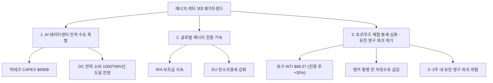
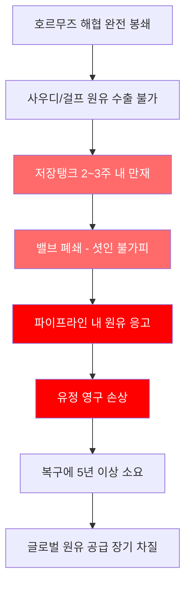
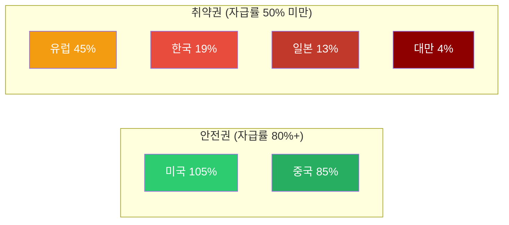
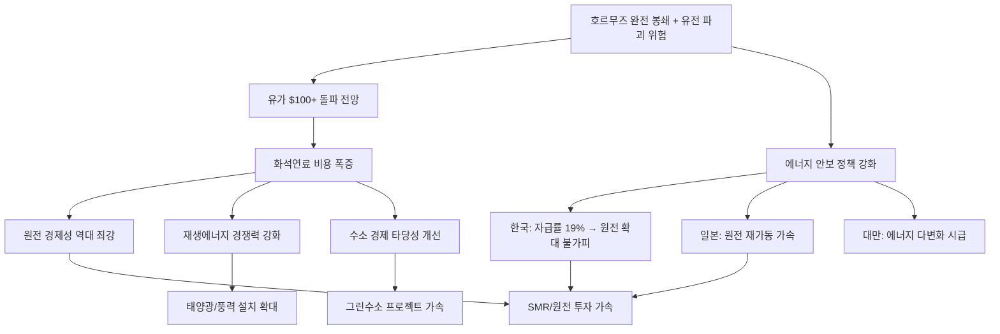
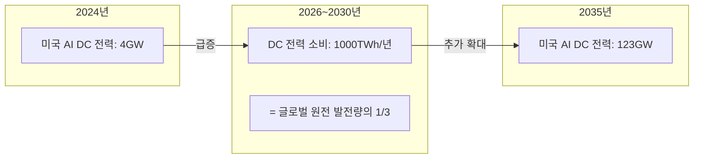
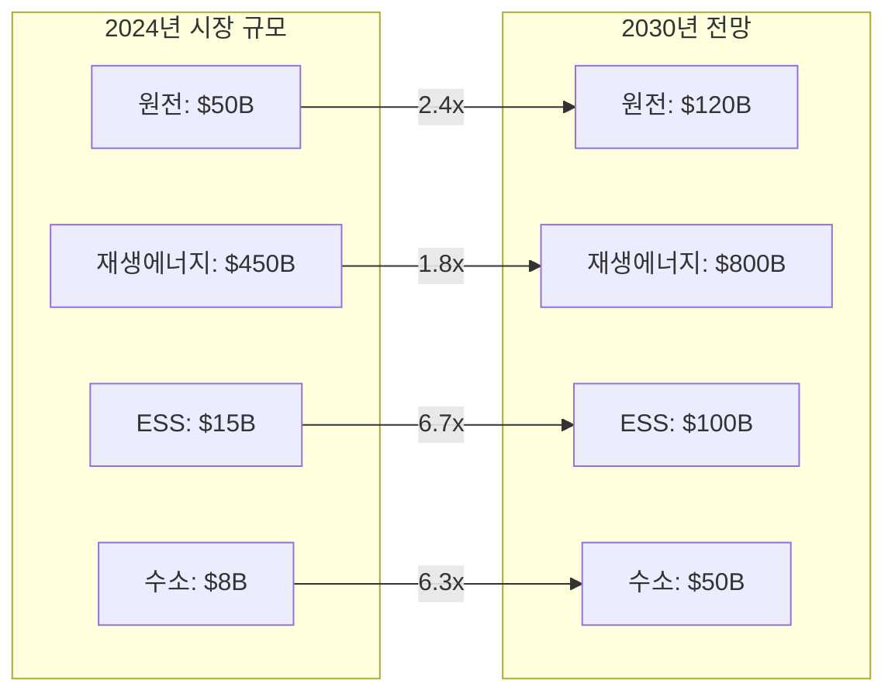
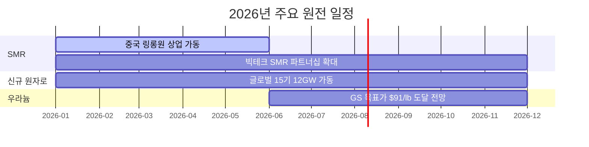
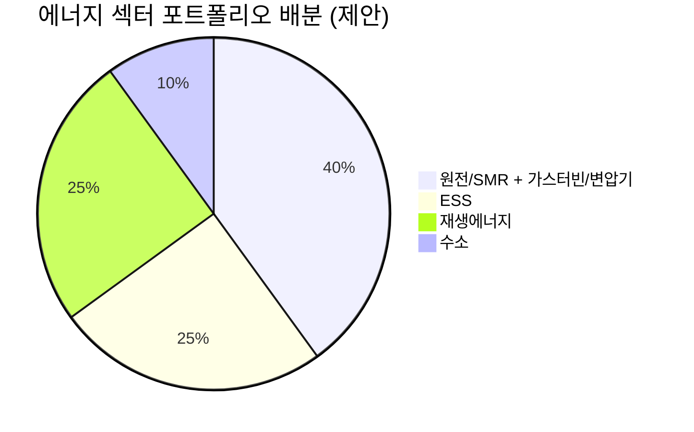

> **시리즈 안내**: 이 글은 에너지 섹터 종합 전망입니다. 하위 섹터별 상세 분석은 아래 링크를 참고하세요.
> - [재생에너지 (태양광/풍력) 상세 분석](/knowledge/invest/2026/03/07/renewable-energy-outlook-2026.html)
> - [ESS (에너지 저장 시스템) 상세 분석](/knowledge/invest/2026/03/07/ess-energy-storage-outlook-2026.html)
> - [수소 에너지 상세 분석](/knowledge/invest/2026/03/07/hydrogen-energy-outlook-2026.html)
> - [원전/SMR 상세 분석](/knowledge/invest/2026/01/21/nuclear-power-sector-outlook-2026.html)

---

## 에너지 섹터 3대 메가트렌드

2026년 에너지 섹터는 세 가지 거대한 구조적 변화가 동시에 진행되고 있으며, 특히 호르무즈 해협 위기가 3월 첫째 주를 기점으로 **급격히 악화**되고 있습니다.

---

## 1. 호르무즈 해협 위기 → 에너지 안보 비상

### 위기 상황 (3/8 업데이트)

2026년 2월 28일 미국-이스라엘의 이란 군사작전 개시 이후, 호르무즈 해협 상황이 **급격히 악화**되고 있습니다. 3월 7일 기준 탱커 통행량이 한 자릿수로 떨어지며 사실상 **완전 봉쇄** 수준에 진입했습니다.

| 항목 | 이전 (3/5) | 현재 (3/8) |
|------|-----------|-----------|
| **탱커 통행량** | 감소 추세 | **한 자릿수** (정상: 138척/24시간) |
| **이란 대응** | 해협 위협 | **유조선 미사일 타격 주장** |
| **WTI 유가** | $81 수준 | **$86.57** (금요일 +6.8%) |
| **Brent 유가** | $89.44 | **$100 돌파 전망** (TD Securities) |
| **전쟁 후 상승폭** | +25% | **+30%** |
| **해협 통과 물량** | 글로벌 원유 20%, LNG 20% | 동일 |

### 유전 영구 파괴 위험: 2~3주 타임라인

호르무즈 봉쇄가 장기화되면 단순한 유가 상승을 넘어 **중동 유전의 영구적 파괴**라는 최악의 시나리오가 현실화될 수 있습니다.

**핵심 메커니즘** (지식한방 유튜브 분석):
- 사우디/걸프 국가 저장탱크가 **2~3주 내 가득 찰 전망**
- 저장 공간 소진 시 밸브 폐쇄(shut-in) → 파이프라인 내 원유가 **응고**
- 응고된 원유는 유정 자체를 **영구적으로 파괴**
- 1991년 쿠웨이트 전쟁 시 유전 복구에 **5년** 소요
- 현재 시점에서 **2주가 돌이킬 수 없는 피해의 임계점**

### 국가별 에너지 자급률: 한국의 취약성

호르무즈 위기에서 각국의 피해 정도는 **에너지 자급률**에 의해 결정됩니다.

| 국가 | 에너지 자급률 | 호르무즈 영향 | 비고 |
|------|:-----------:|------------|------|
| **미국** | 105% | 매우 낮음 | 순 에너지 수출국, 유가 상승 수혜 |
| **중국** | 85% | 제한적 | 석유 의존도 9%, 러시아 대체 루트 확보 |
| **유럽** | 45% | 높음 | LNG 의존, 가스가격 +60% |
| **한국** | 19% | **매우 높음** | 중동 원유 70% 의존 |
| **일본** | 13% | **매우 높음** | 중동 원유 90%+ 의존 |
| **대만** | 4% | **극심** | 거의 전량 수입 |

> **투자 시사점**: 중국은 자급률 85%에 석유 의존도 9%, 러시아 대체 루트까지 확보하여 실질 피해가 제한적입니다. 반면 **한국·일본·대만이 호르무즈 봉쇄의 실질적 피해국**이며, 이들 국가의 에너지 전환(원전, 재생에너지) 정책이 가속될 수밖에 없습니다.

### 에너지 안보 → 에너지 전환 가속

---

## 2. AI 데이터센터 전력 수요 폭발

### 빅테크 CAPEX: 역대 최대 $690B

2026년 주요 빅테크 기업들의 인프라 투자 규모가 역대 최대치를 경신하고 있습니다. 그 대부분이 AI 컴퓨팅, 데이터센터, 네트워킹에 집중되고 있습니다.

| 기업 | 2026 CAPEX (추정) | 주요 프로젝트 | 전력 관련 이슈 |
|------|-----------------|-------------|-------------|
| **Amazon** | ~$200B | 역대 최대 단일 연도 기업 투자 | 원전 PPA 적극 추진 |
| **Google** | $175~185B | 2025년 $91B 대비 2배 | 소형원전(SMR) 투자 |
| **Meta** | $115~135B | 오하이오 1GW DC, 루이지애나 5GW 규모 DC | 재생에너지 PPA 확대 |
| **Microsoft** | ~$120B+ | Azure $80B 수주잔고(전력 부족으로 미이행) | **전력 병목이 성장 제약** |
| **합계** | **~$690B** | AI 인프라 역대 최대 | 전력이 핵심 병목 |

Microsoft의 사례가 특히 시사적입니다. Azure 주문 $80B 백로그가 **전력 제약** 때문에 이행되지 못하고 있어, 전력 공급이 AI 산업 성장의 핵심 병목이 되고 있습니다.

### 전력 수요 전망: 글로벌 원전 발전량의 1/3

- **데이터센터 전력 소비**: 2026년 **1000TWh**에 도달 전망 → 글로벌 원전 발전량의 **1/3** 수준
- **Deloitte 전망**: 미국 AI 데이터센터 전력 수요 4GW(2024) → 123GW(2035)
- **IEA 전망**: 글로벌 데이터센터 전력 소비 2024~2030년 **2배 이상 증가**, 2030년 945TWh (일본 전체 전력 소비량)
- **Nvidia CEO 젠슨 황**: AI 인프라에 2030년까지 **$3~4조** 투자 예상

### xAI/Tesla의 가스터빈 확보 사례

AI 전력 수요의 긴급성을 보여주는 사례로, xAI가 **두산에너빌리티로부터 가스터빈 5기를 수주**했으며, Tesla 규모 확장을 위해 **추가 15기가 예상**됩니다. 원전/SMR이 상용화되기까지의 브릿지 전원으로 가스터빈 수요가 급증하고 있습니다.

### 투자 시사점

AI 전력 수요 폭발은 에너지 섹터 전체에 구조적 수혜를 제공합니다:

1. **원전/SMR**: 24시간 안정적 기저 전력 → 데이터센터 최적 전원
2. **가스터빈**: 원전 상용화 전 브릿지 전원 → 두산에너빌리티, BH 수혜
3. **재생에너지**: 빅테크 RE100 이행 + PPA 확대
4. **ESS**: 재생에너지 간헐성 보완 필수, **마진 20%+** (EV 배터리 8% 대비 압도적)
5. **수소**: 장기 에너지 저장 및 연료전지 DC 전원

> **ESS 마진 우위**: LG에너지솔루션 기준 ESS 매출 비중이 10%→20%로 확대 중이며, ESS 마진(20%+)이 EV 배터리 마진(8%)을 크게 상회합니다. ESS가 배터리 기업의 수익성 개선 핵심 동력입니다.

---

## 3. 글로벌 에너지 전환 가속

### IRA (Inflation Reduction Act) 보조금 효과

미국 IRA 보조금은 2026년에도 에너지 섹터의 핵심 촉매로 작동하고 있습니다.

| IRA 주요 혜택 | 내용 | 수혜 섹터 |
|-------------|------|---------|
| **ITC (Investment Tax Credit)** | 태양광/ESS 투자세액공제 30%+ | 태양광, ESS |
| **PTC (Production Tax Credit)** | 풍력/원전 생산세액공제 | 풍력, 원전 |
| **AMPC (Advanced Manufacturing)** | 미국 내 제조 보조금 | 태양광 셀/모듈, 배터리 |
| **45V 수소 세액공제** | 그린수소 $3/kg | 수소 |
| **48C 세액공제** | 청정에너지 제조시설 투자 | 전체 에너지 |

### 미국 신규 발전 용량: 99%+ 재생에너지

EIA에 따르면 2026년 미국 신규 발전 용량의 **99% 이상**이 태양광, 풍력, 배터리 저장 시스템입니다.

| 에너지원 | 2026 신규 용량 | 비중 |
|---------|-------------|------|
| **태양광** | 44,470MW | 51% |
| **배터리 저장** | 24,269MW | 28% |
| **풍력 (육상+해상)** | 11,884MW | 14% |
| **기타 재생** | ~6% | 6% |
| **화석연료** | <1% | <1% |

### 한국 에너지 정책

- **제11차 전력수급기본계획**: 원전 비중 확대, SMR 육성
- **SMR 특별법** 국회 통과 (2026.2.12): 한국형 SMR(i-SMR) 상용화 가속
- **에너지 자급률 19%**: 호르무즈 위기로 에너지 안보 시급성 부각 → 원전 확대 불가피
- **수소경제 로드맵**: 2030년 수소차 10만 대, 수소 발전 확대

---

## 에너지 하위 섹터별 투자 매력도 비교

### 종합 평가표

| 하위 섹터 | 단기 모멘텀 (6M) | 중기 성장성 (2~3Y) | 장기 구조적 (5Y+) | 리스크 | 종합 투자 매력도 |
|----------|:-:|:-:|:-:|---------|:-:|
| **원전/SMR** | ★★★★★ | ★★★★★ | ★★★★★ | 인허가 지연, 건설 초과비용 | **S (최상)** |
| **ESS** | ★★★★★ | ★★★★★ | ★★★★ | 안전성, LFP 공급과잉 | **A+** |
| **재생에너지** | ★★★★ | ★★★★ | ★★★★ | 중국 과잉공급, 정책 불확실성 | **A** |
| **수소** | ★★★ | ★★★ | ★★★★★ | 높은 생산비용, 인프라 부재 | **B+** |

### 섹터별 시장 규모 전망

---

## 하위 섹터 1: 원전/SMR (최상위 투자 매력)

> **상세 분석**: [2026년 원전 투자 전망](/knowledge/invest/2026/01/21/nuclear-power-sector-outlook-2026.html)

### 핵심 투자 포인트

| 항목 | 내용 |
|------|------|
| **AI DC 전원 최적** | 24시간 안정적 기저전력, 빅테크 원전 파트너십 $10B+ 투입, 22GW 개발 중 |
| **SMR 상용화 가시화** | 중국 링롱원(Linglong One) 세계 최초 상업용 육상 SMR **2026년 상반기 가동** |
| **글로벌 원전 확대** | 2026년 신규 원자로 15기(12GW) 가동 예정 |
| **유가 급등** | WTI $86.57 → 원전 경제성 역대 최강 |
| **우라늄 전망** | Goldman Sachs 목표가 $91/lb (2026년 말) |
| **에너지 안보** | 호르무즈 위기 → 자급률 19% 한국에 원전 필수 |
| **SMR 특별법** | 2026.2.12 국회 통과 → i-SMR 상용화 가속 |
| **첫 SMR 데이터센터** | 2030년까지 SMR 직접 전력 공급 DC 상용화 전망 |

### 2026년 원전 가동 타임라인

### 주요 종목

| 종목 | 시장 | 핵심 포인트 | 리스크 |
|------|------|-----------|--------|
| **두산에너빌리티** | KRX | **대장주**. SMR 기자재 독점, 원전 EPC, xAI 가스터빈 5기 수주 | 건설 지연 |
| **BH** | KRX | 가스터빈과 세트 (보일러/스팀), 두산에너빌리티 동반 수혜 | 가스터빈 수주 의존 |
| **한전기술** | KRX | i-SMR 설계 주관사 | 매출 인식 시점 |
| **현대일렉트릭** | KRX | **765kV 초고압 변압기** 생산 가능 극소수 기업, 수작업 필수 | 납기 지연 |
| **효성중공업** | KRX | 초고압 변압기 핵심 기업, 글로벌 수요 급증 | 원자재 가격 |
| **NuScale (SMR)** | NYSE | NRC 인증 유일 SMR | 상용화 지연 |
| **Cameco (CCJ)** | NYSE | 우라늄 채굴 1위, GS 목표가 $91/lb | 우라늄 가격 변동 |
| **Oklo (OKLO)** | NYSE | Meta 1.2GW PPA 체결 | 기술 검증 미완 |

> **변압기 투자 포인트**: 데이터센터·원전·재생에너지 모두 변압기가 필수이며, 특히 765kV급 초고압 변압기는 전 세계에서 **극소수 기업만 생산 가능**하고, 자동화가 불가능한 **수작업** 공정으로 공급 병목이 심각합니다. 현대일렉트릭과 효성중공업이 핵심 수혜주입니다.

---

## 하위 섹터 2: 재생에너지 (구조적 성장)

> **상세 분석**: [2026년 재생에너지 투자 전망](/knowledge/invest/2026/03/07/renewable-energy-outlook-2026.html)

### 핵심 투자 포인트

| 항목 | 내용 |
|------|------|
| **미국 신규 용량 99%** | 2026년 신규 발전의 99%가 재생에너지+ESS |
| **태양광 44.5GW** | 미국 역대 최대 유틸리티 태양광 설치 |
| **IRA AMPC** | 미국 내 제조 보조금으로 리쇼어링 가속 |
| **한화솔루션** | 2026 판매 9GW 목표, AMPC ~9,500억 원 |

### 주요 종목

| 종목 | 시장 | 핵심 포인트 |
|------|------|-----------|
| **한화솔루션** | KRX | 미국 수직계열화, AMPC 수혜 |
| **First Solar (FSLR)** | NASDAQ | 미국 유일 대규모 태양광 제조 |
| **NextEra Energy (NEE)** | NYSE | 세계 최대 재생에너지 유틸리티, EPS $3.92~4.02 |
| **CS윈드** | KRX | 풍력 타워 글로벌 1위, **미국/유럽 현지 공장** 보유 (관세 리스크 낮음) |
| **Vestas (VWS)** | CPH | 풍력 터빈 세계 1위, 백로그 EUR 31.6B |

---

## 하위 섹터 3: ESS (폭발적 성장)

> **상세 분석**: [2026년 ESS 투자 전망](/knowledge/invest/2026/03/07/ess-energy-storage-outlook-2026.html)

### 핵심 투자 포인트

| 항목 | 내용 |
|------|------|
| **시장 규모** | $146B(2025) → $521B(2035), CAGR 13.6% |
| **미국 신규** | 2026년 24.3GW 배터리 신규 설치 |
| **LFP 주도** | 비용/안전/수명 우위로 그리드 ESS 표준 |
| **Tesla Megapack 3** | + Megablock으로 1GWh 20일 배치 가능 |
| **ESS 마진 우위** | ESS 마진 20%+ vs EV 배터리 8% |
| **LG에너지솔루션** | 미국 ESS 90GWh 수주 목표, ESS 매출 비중 10%→20% 확대 |

### 주요 종목

| 종목 | 시장 | 핵심 포인트 |
|------|------|-----------|
| **삼성SDI** | KRX | SBB ESS 라인업, 전고체 2027~2028 |
| **LG에너지솔루션** | KRX | 미국 ESS 90GWh 목표, LFP 30GWh, **ESS 매출 비중 20%로 확대** |
| **Tesla (TSLA)** | NASDAQ | Megapack 3, Megablock, 미국 LFP 생산 |
| **BYD** | HKEX | 나트륨이온 ESS, 30GWh 공장 착공 |
| **CATL** | SHE | 나트륨이온 2026 본격 양산, 175Wh/kg |

---

## 하위 섹터 4: 수소 에너지 (장기 성장)

> **상세 분석**: [2026년 수소 에너지 투자 전망](/knowledge/invest/2026/03/07/hydrogen-energy-outlook-2026.html)

### 핵심 투자 포인트

| 항목 | 내용 |
|------|------|
| **NEOM 프로젝트** | $8.4B, 세계 최대 그린수소, 2026~2027 완공 |
| **45V 세액공제** | 그린수소 $3/kg 보조금 (IRA) |
| **두산퓨얼셀** | SOFC 양산, 미국 DC 시장 진출 |
| **적용 분야** | 철강/화학/장거리 물류 (난탈탄소 섹터) |

### 주요 종목

| 종목 | 시장 | 핵심 포인트 |
|------|------|-----------|
| **두산퓨얼셀** | KRX | SOFC 양산, 2026 매출 6,900억 목표 |
| **효성첨단소재** | KRX | 탄소섬유 수소탱크 핵심 소재 |
| **Plug Power (PLUG)** | NASDAQ | 전해조+운송+충전 수직계열화 |
| **Bloom Energy (BE)** | NYSE | SOFC 2GW 생산 확대 |
| **Air Products (APD)** | NYSE | NEOM 그린수소 독점 오프테이커 |

---

## 에너지 섹터 투자 전략

### 포트폴리오 구성 제안

### 투자 시나리오별 전략

| 시나리오 | 확률 | 유망 섹터 | 전략 |
|---------|------|---------|------|
| **호르무즈 장기 봉쇄 + 유전 파괴** | 40% | 원전, 재생에너지, ESS | 에너지 자립 관련주 최대 비중, 유가 상승 수혜주 |
| **AI 전력 수요 초과** | 50% | 원전/SMR, 가스터빈, 변압기, ESS | DC 직접 전원 공급 기업 + 전력 인프라 집중 |
| **에너지 전환 가속** | 70% | 재생에너지, ESS, 수소 | IRA 수혜주 + 장기 성장주 |
| **금리 인하 본격화** | 40% | 유틸리티, 재생에너지 | 고배당 유틸리티 + 성장주 |

### 리스크 요인

| 리스크 | 영향 섹터 | 대응 |
|--------|---------|------|
| **호르무즈 조기 해결** | 유가 관련 모멘텀 약화 | 장기 구조적 테마(AI 전력, 에너지 전환)에 집중 |
| **유전 영구 파괴 현실화** | 전체 에너지 (초대형 공급 충격) | 원전/재생에너지 비중 극대화 |
| **IRA 축소/폐지** | 재생에너지, 수소, ESS | 미국 외 지역 분산 |
| **중국 과잉공급** | 태양광, ESS(LFP) | 미국/유럽 현지 제조 기업 선호 (CS윈드 등) |
| **금리 고수준 지속** | 전체 (자본집약 산업) | 현금흐름 우수 기업 |
| **기술 지연** | SMR, 전고체, 그린수소 | 기술 검증 완료 기업 |

---

## 핵심 데이터 요약

| 지표 | 수치 | 출처/기준 |
|------|------|----------|
| 빅테크 2026 CAPEX | ~$690B | Futurum |
| 미국 AI DC 전력 (2035) | 123GW | Deloitte |
| DC 전력 소비 (2026) | 1000TWh | 글로벌 원전의 1/3 |
| **WTI 유가** | **$86.57** | 2026.3.7 금요일 (+6.8%) |
| **Brent 유가** | **$100 돌파 전망** | TD Securities |
| 전쟁 후 유가 상승폭 | +30% | 2026.2.28~ |
| 호르무즈 탱커 통행 | 한 자릿수 | 정상 138척/24h |
| 저장탱크 만재 시점 | 2~3주 내 | 사우디/걸프 |
| 미국 2026 태양광 신규 | 44.5GW | EIA |
| 미국 2026 ESS 신규 | 24.3GW | EIA |
| ESS 시장 규모 (2035) | $521B | 시장조사 |
| 2026 신규 원자로 | 15기 (12GW) | 글로벌 |
| 우라늄 GS 목표가 | $91/lb (2026말) | Goldman Sachs |
| 빅테크 원전 투자 | $10B+, 22GW 개발 | 복수 |
| 한국 에너지 자급률 | 19% | - |
| ESS 마진 | 20%+ (vs EV 8%) | LG에너지솔루션 |

---

## 결론

2026년 에너지 섹터는 **호르무즈 봉쇄 심화(유전 파괴 위기) + AI 전력 수요 폭발 + 에너지 전환 가속**이라는 세 가지 메가트렌드가 동시에 작동하면서, **투자 매력도가 역대 최고 수준**에 달하고 있습니다.

**3/8 핵심 변화**:
- 호르무즈 탱커 통행이 한 자릿수로 급감하며 사실상 완전 봉쇄 상태. Brent $100 돌파 전망
- **2~3주 내 저장탱크 만재 → 유전 영구 파괴 위험**이라는 최악의 시나리오가 부상
- 한국(자급률 19%)은 호르무즈의 직접적 피해국으로, 원전 확대가 불가피
- 중국 링롱원(세계 최초 상업 SMR) 2026 상반기 가동, 글로벌 15기 신규 원자로 가동
- 빅테크 원전 파트너십 $10B+, AI DC 전력 1000TWh 도달

**투자 우선순위**:
1. **원전/SMR + 가스터빈/변압기**: 두산에너빌리티(대장주), BH, 현대일렉트릭, 효성중공업 — 에너지 안보 + AI 전력 이중 수혜
2. **ESS**: LG에너지솔루션(ESS 마진 20%+), 삼성SDI — 마진 우위 구조적 성장
3. **재생에너지**: CS윈드(미국/유럽 현지 공장), 한화솔루션 — IRA 수혜 지속
4. **수소**: 장기 옵션으로 소규모 비중 유지
