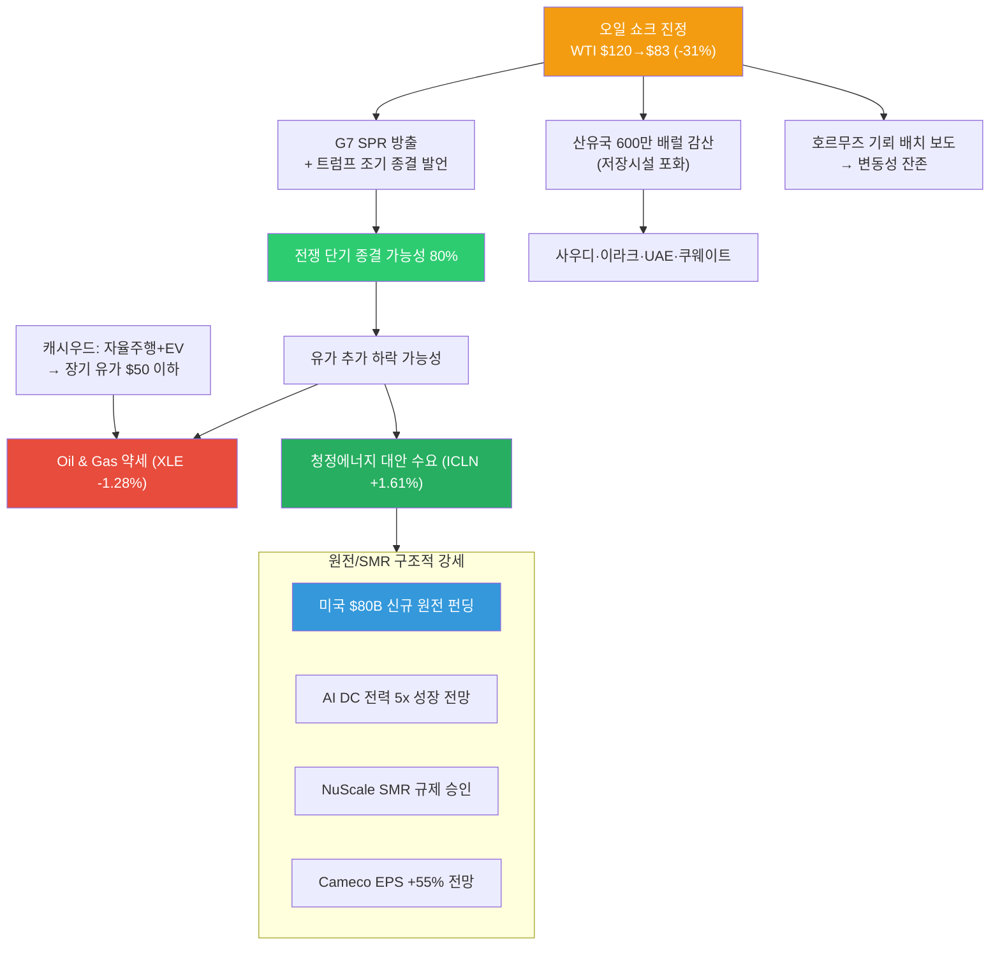
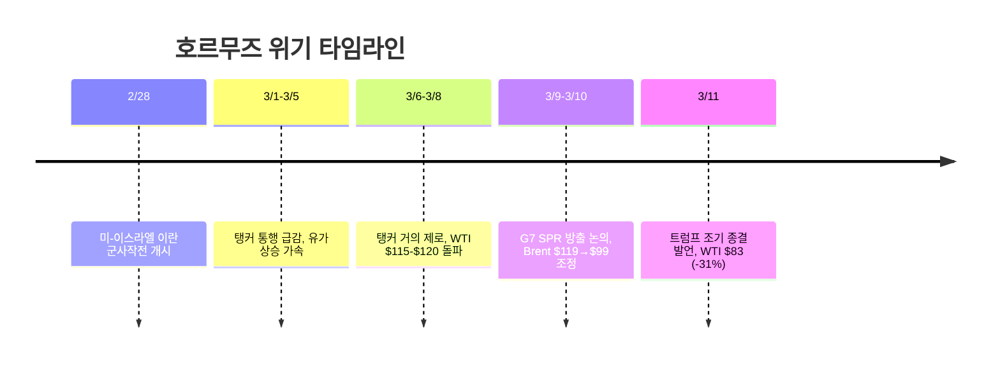
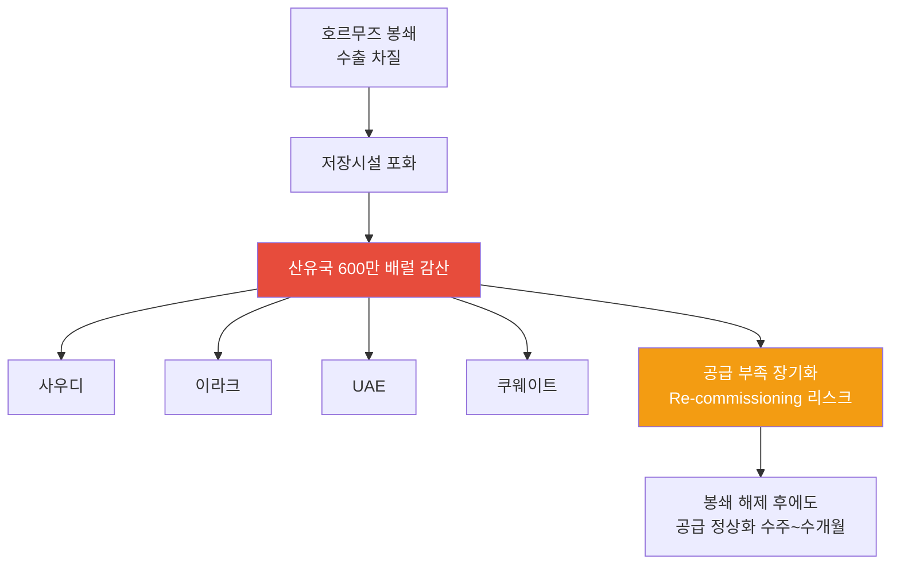
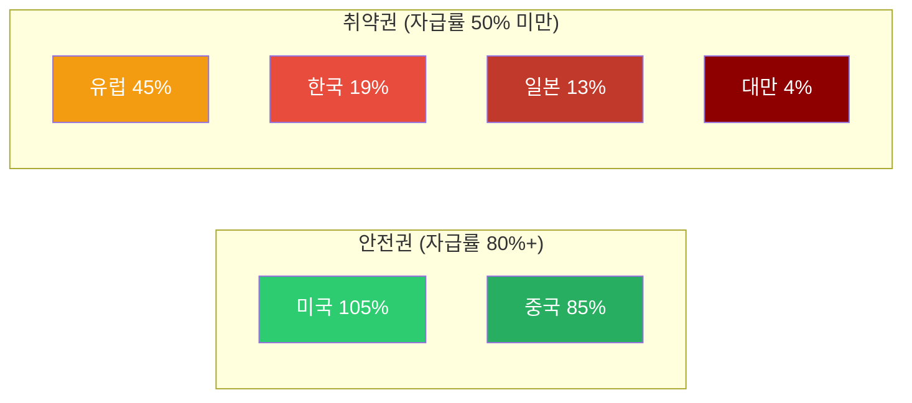
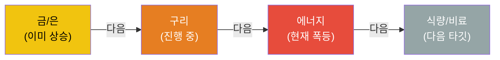
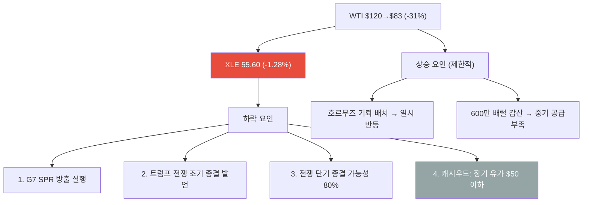
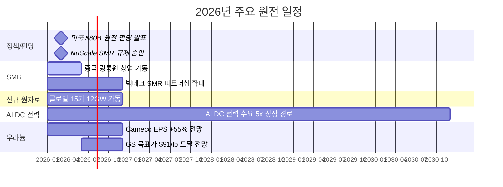
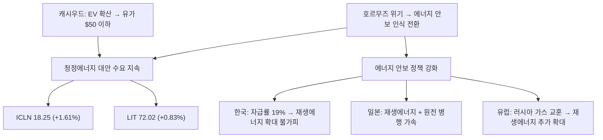
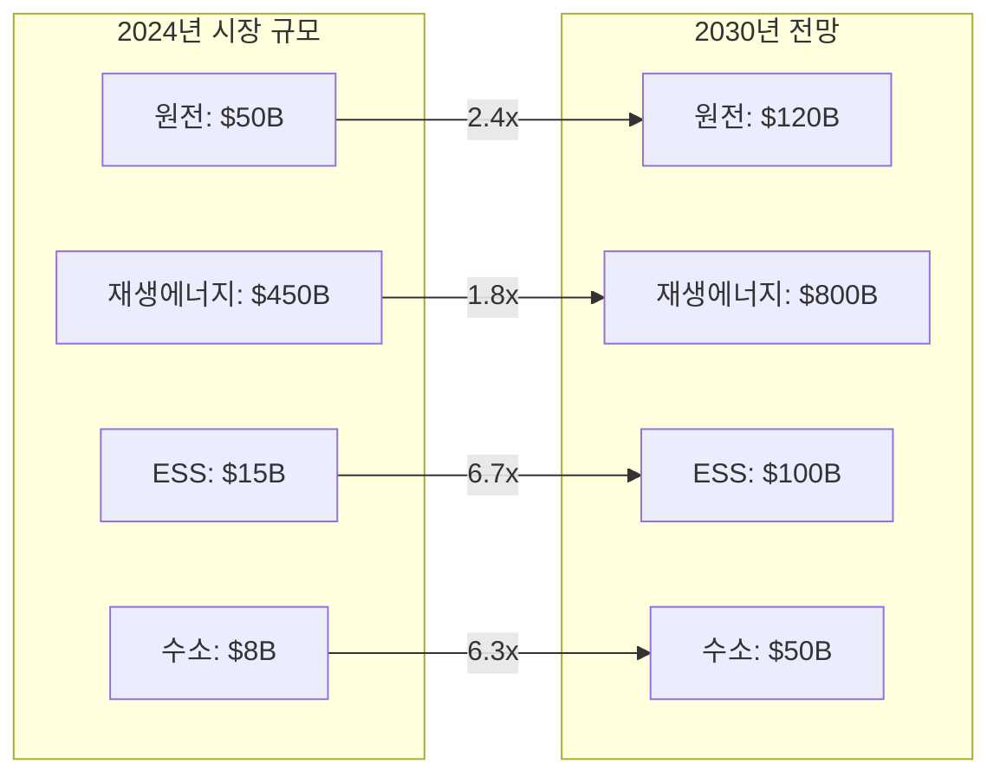
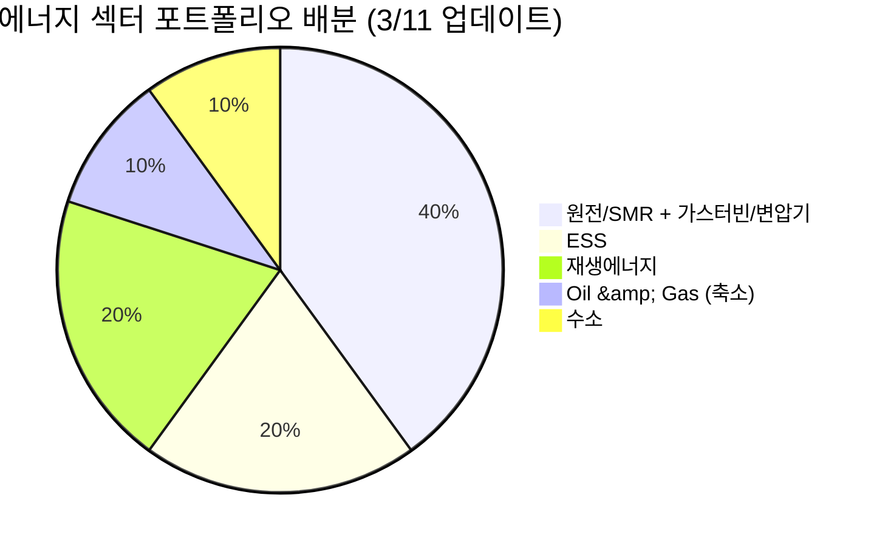

> **시리즈 안내**: 이 글은 에너지 섹터 종합 전망입니다. 하위 섹터별 상세 분석은 아래 링크를 참고하세요.
> - [재생에너지 (태양광/풍력) 상세 분석](/knowledge/invest/2026/03/07/renewable-energy-outlook-2026.html)
> - [ESS (에너지 저장 시스템) 상세 분석](/knowledge/invest/2026/03/07/ess-energy-storage-outlook-2026.html)
> - [수소 에너지 상세 분석](/knowledge/invest/2026/03/07/hydrogen-energy-outlook-2026.html)
> - [원전/SMR 상세 분석](/knowledge/invest/2026/01/21/nuclear-power-sector-outlook-2026.html)

---

## 3/11 핵심 요약: 오일 쇼크 진정 국면 진입

G7 SPR 방출과 트럼프 대통령의 전쟁 조기 종결 발언으로 유가가 **급격히 하락**하고 있습니다. WTI는 고점 $120에서 **$83까지 -31% 급락**했으며, 시장은 전쟁 단기 종결 가능성을 **80%**로 반영 중입니다. 다만 호르무즈 기뢰 배치 보도로 일시 반등하는 등 **변동성은 잔존**합니다.

| 항목 | 3/10 | **3/11** | 변화 |
|------|------|---------|------|
| **WTI** | $115+ | **$83** | **-31%** (고점 $120 대비) |
| **유가 하락 요인** | - | G7 SPR 방출 + 트럼프 조기 종결 발언 | 진정 국면 |
| **변동성** | - | 호르무즈 기뢰 배치 보도 → 일시 반등 | 잔존 |
| **산유국 감산** | 쿠웨이트/UAE 생산 감축 시작 | **사우디·이라크·UAE·쿠웨이트 총 600만 배럴 감산** | 저장시설 포화 |
| **전쟁 전망** | - | **단기 종결 가능성 80%** | 모든 참여 주체 장기전 원하지 않음 |
| **원전** | - | 미국 **$80B 신규 원전 펀딩** 발표 | 구조적 강세 |
| **XLE** | -0.44% | **55.60 (-1.28%)** | 유가 하락으로 에너지 주 약세 |
| **ICLN** | +3.04% | **18.25 (+1.61%)** | 청정에너지 대안 수요 지속 |
| **LIT** | +3.57% | **72.02 (+0.83%)** | 배터리/리튬 |
| **URA** | - | **상승 지속** | 우라늄 ETF |
| **장기 유가 전망** | - | 캐시우드: 자율주행+EV 확산 → **$50 이하** | 구조적 하락 전망 |

---

## 에너지 섹터 구조: 오일 쇼크 진정, 구조적 전환 가속

---

## 1. 호르무즈 위기: 오일 쇼크 진정 국면 (3/11)

### 1.1 상황 변화 (3/10 → 3/11)

G7 SPR 방출과 트럼프 대통령의 전쟁 조기 종결 발언으로, WTI는 고점 $120에서 **$83까지 -31% 급락**하며 진정 국면에 진입했습니다. 다만 호르무즈 기뢰 배치 보도로 일시 반등하는 등 변동성은 잔존합니다.

### 1.2 유가 급락 요인

| 요인 | 내용 |
|------|------|
| **G7 SPR 방출** | 300-400M 배럴 방출 실행, 단기 공급 완화 |
| **트럼프 전쟁 조기 종결 발언** | 시장이 전쟁 단기 종결 가능성 **80%**로 반영 |
| **모든 참여 주체** | 장기전을 원하지 않음 — 미국·이란·이스라엘 모두 조기 해결 인센티브 |
| **캐시우드 장기 전망** | 자율주행 + EV 확산으로 **장기 유가 $50 이하** 전망 |

### 1.3 잔존 리스크: 변동성 지속

- **호르무즈 기뢰 배치 보도**: 일시 반등 유발, 완전 해결까지 변동성 잔존
- WTI $83은 전쟁 전 대비 여전히 높은 수준 — 완전 정상화에는 시간 필요
- **Rystad Energy**: 봉쇄 재격화 시 Brent $135 도달 가능성은 여전히 존재

### 1.4 산유국 대규모 감산: 600만 배럴

저장시설 포화로 인해 산유국들이 **역대급 감산**에 돌입했습니다.

| 국가 | 감산 참여 | 상황 |
|------|:--------:|------|
| **사우디** | O | 최대 규모 감산, 저장시설 포화 대응 |
| **이라크** | O | 저장 잔여 극소, 감산 불가피 |
| **UAE** | O | 생산 감축 지속 |
| **쿠웨이트** | O | 저장 포화 대응 중 |
| **합계** | - | **총 600만 배럴/일 감산** |

> **투자 시사점**: 600만 배럴 감산은 단순 봉쇄 대응이 아니라, **Re-commissioning 리스크**를 수반합니다. 유정 셧다운 후 재가동에 수주~수개월이 소요되므로, 전쟁이 종결되더라도 공급 정상화에는 시간이 필요합니다. 중기적으로 유가 $70-80 레벨이 하한선이 될 가능성이 있습니다.

### 1.5 국가별 에너지 취약성

| 국가 | 에너지 자급률 | 호르무즈 영향 | GS 분석 |
|------|:-----------:|------------|---------|
| **미국** | 105% | 매우 낮음 | 순 수출국, 유가 상승 수혜, 제조업 노출 제한적 |
| **중국** | 85% | **가장 적음** | 석유 의존도 9%, 러시아 대체 루트 (Goldman Sachs) |
| **유럽** | 45% | 높음 | LNG 의존, 가스가격 +60% |
| **한국** | 19% | **매우 높음** | 중동 원유 70% 의존 |
| **일본** | 13% | **매우 높음** | 중동 원유 90%+ 의존 |
| **대만** | 4% | **극심** | 거의 전량 수입 |

> **Goldman Sachs 핵심 분석**: 중국이 이번 오일 쇼크에서 **가장 적은 영향**을 받을 것으로 전망. 자급률 85%에 석유 의존도 9%, 러시아 파이프라인 대체 루트까지 확보. 반면 **한국·일본·대만이 실질적 피해국**입니다.

### 1.6 원자재 사이클: 에너지 다음은 식량

원자재 상승 사이클은 통상 **금/은 → 구리 → 에너지 → 식량/비료** 순서로 전파됩니다. 현재 에너지 단계에서 폭등이 진행 중이며, 다음은 식량/비료 섹터 상승이 예상됩니다.

---

## 2. 하위 섹터 1: Oil & Gas (단기 최대 수혜, 중기 불확실)

### 2.1 XLE -1.28%: 유가 하락이 에너지 주에 직격

WTI $120→$83(-31%) 급락과 함께 XLE도 **55.60(-1.28%)**으로 하락세를 보이고 있습니다.

| 요인 | 방향 | 설명 |
|------|:----:|------|
| **전쟁 조기 종결 기대** | 하락 | 시장이 80% 확률로 반영, 유가 추가 하락 가능 |
| **SPR 방출** | 하락 | G7 300-400M 배럴 방출로 단기 공급 완화 |
| **캐시우드 전망** | 하락 | 자율주행+EV 확산 → 장기 유가 $50 이하 |
| **호르무즈 기뢰** | 상승 | 완전 해결까지 변동성 잔존, 일시 반등 유발 |
| **600만 배럴 감산** | 상승 | Re-commissioning 지연 → 중기 공급부족 |

> **핵심 판단**: 오일 쇼크 진정으로 Oil & Gas 섹터의 **단기 모멘텀이 약화**되고 있습니다. 다만 600만 배럴 감산과 re-commissioning 리스크로 **중기적으로 유가 $70-80 하한선**이 형성될 가능성이 있습니다. 장기적으로는 캐시우드의 $50 이하 전망처럼 에너지 전환이 구조적 하락 요인입니다.

### 2.2 Oil & Gas 업스트림/미드스트림/다운스트림

| 세그먼트 | 현재 상황 | 수혜/위험 | 주요 종목 |
|---------|---------|---------|---------|
| **업스트림 (탐사/생산)** | 미국 셰일 풀가동 인센티브 | **최대 수혜**: 유가 상승 직접 반영 | ExxonMobil (XOM), Chevron (CVX), ConocoPhillips (COP) |
| **미드스트림 (파이프/저장)** | 저장 수요 급증, 미국 LNG 수출 증가 | **수혜**: 물류/저장 수수료 증가 | Enterprise Products (EPD), Kinder Morgan (KMI) |
| **다운스트림 (정유)** | 원유 조달 차질, 크랙 스프레드 확대 | **혼재**: 마진 확대 vs 원유 확보 어려움 | Valero (VLO), Marathon Petroleum (MPC) |

### 2.3 미국 에너지 독립의 의미

미국은 에너지 자급률 105%로 이번 위기에서 **상대적 안전지대**입니다.

- **미국 생산자**: 유가 상승으로 직접 수혜, 수출 증가
- **제조업**: 에너지 비용 상승 영향 제한적 (자체 생산으로 충당)
- **소비자**: 가솔린 17% 상승했으나 아시아/유럽 대비 충격 제한적
- **전략적 위치**: 글로벌 에너지 위기에서 미국 패권 강화

### 2.4 Oil & Gas 투자 전략 (3/11 업데이트)

| 시나리오 | 확률 | 유가 전망 | 전략 |
|---------|:---:|---------|------|
| **전쟁 단기 종결 (1-2주)** | **80%** | WTI $65-75 | Oil 비중 축소, 클린에너지/원전으로 이동 |
| **봉쇄 재격화 (1-3개월)** | 15% | WTI $90-110 | 미국 업스트림 선별 보유 |
| **장기 교착** | 5% | Brent $135 (Rystad) | 에너지 전체 강세, 경기침체 헤지 병행 |

---

## 3. 하위 섹터 2: 원전/SMR (최상위 투자 매력 - 에너지 안보 핵심)

> **상세 분석**: [2026년 원전 투자 전망](/knowledge/invest/2026/01/21/nuclear-power-sector-outlook-2026.html)

### 3.1 원전/SMR: 정책·기술·수요 3박자 강세 (3/11 업데이트)

호르무즈 위기가 원전의 에너지 안보 가치를 증명한 데 이어, **미국 $80B 신규 원전 펀딩**과 **NuScale SMR 규제 승인** 등 정책·기술 측면에서도 강력한 모멘텀이 추가되었습니다.

| 항목 | 내용 |
|------|------|
| **미국 $80B 원전 펀딩** | 신규 원전 건설을 위한 대규모 연방 펀딩 발표 (3/11) |
| **AI DC 전력 5x 성장** | AI 데이터센터 전력 수요 **2030년까지 5배 성장** 전망 |
| **NuScale SMR 규제 승인** | NRC 인증에 이어 **규제 승인** 획득, 상용화 가속 |
| **Cameco EPS +55%** | 우라늄 수요 급증으로 Cameco 실적 전망 대폭 상향 |
| **URA ETF 상승 지속** | 우라늄 가격 상승과 원전 투자 확대 반영 |
| **SMR 상용화 가시화** | 중국 링롱원 세계 최초 상업용 육상 SMR **2026년 상반기 가동** |
| **글로벌 원전 확대** | 2026년 신규 원자로 15기(12GW) 가동 예정 |
| **에너지 안보** | 호르무즈 위기 → 자급률 19% 한국에 원전 필수불가결 |
| **SMR 특별법** | 2026.2.12 국회 통과 → i-SMR 상용화 가속 |
| **우라늄 전망** | Goldman Sachs 목표가 $91/lb (2026년 말) |

### 3.2 2026년 원전 가동 타임라인

### 3.3 주요 종목

| 종목 | 시장 | 핵심 포인트 | 리스크 |
|------|------|-----------|--------|
| **두산에너빌리티** | KRX | **대장주**. SMR 기자재 독점, 원전 EPC, xAI 가스터빈 5기 수주 | 건설 지연 |
| **BH** | KRX | 가스터빈과 세트 (보일러/스팀), 두산에너빌리티 동반 수혜 | 가스터빈 수주 의존 |
| **한전기술** | KRX | i-SMR 설계 주관사 | 매출 인식 시점 |
| **현대일렉트릭** | KRX | **765kV 초고압 변압기** 생산 가능 극소수 기업, 수작업 필수 | 납기 지연 |
| **효성중공업** | KRX | 초고압 변압기 핵심 기업, 글로벌 수요 급증 | 원자재 가격 |
| **NuScale (SMR)** | NYSE | NRC 인증 유일 SMR | 상용화 지연 |
| **Cameco (CCJ)** | NYSE | 우라늄 채굴 1위, GS 목표가 $91/lb | 우라늄 가격 변동 |
| **Oklo (OKLO)** | NYSE | Meta 1.2GW PPA 체결 | 기술 검증 미완 |

> **변압기 투자 포인트**: 데이터센터·원전·재생에너지 모두 변압기가 필수이며, 특히 765kV급 초고압 변압기는 전 세계에서 **극소수 기업만 생산 가능**하고, 자동화가 불가능한 **수작업** 공정으로 공급 병목이 심각합니다.

---

## 4. 하위 섹터 3: 재생에너지 (대안 에너지 수혜 + 구조적 성장)

> **상세 분석**: [2026년 재생에너지 투자 전망](/knowledge/invest/2026/03/07/renewable-energy-outlook-2026.html)

### 4.1 오일 쇼크 진정에도 청정에너지 수요 지속

유가 급락에도 불구하고 ICLN(클린에너지 ETF) **18.25(+1.61%)**, LIT(리튬 ETF) **72.02(+0.83%)**로 청정에너지 대안 수요가 지속되고 있습니다. 호르무즈 위기가 에너지 안보의 중요성을 각인시킨 결과, 유가 하락과 무관하게 **구조적 전환 흐름**이 유지되고 있습니다.

### 4.2 핵심 투자 포인트

| 항목 | 내용 |
|------|------|
| **미국 신규 용량 99%** | 2026년 신규 발전의 99%가 재생에너지+ESS |
| **태양광 44.5GW** | 미국 역대 최대 유틸리티 태양광 설치 |
| **IRA AMPC** | 미국 내 제조 보조금으로 리쇼어링 가속 |
| **호르무즈 수혜** | 에너지 안보 인식 전환, ICLN 18.25 (+1.61%) |

### 4.3 주요 종목

| 종목 | 시장 | 핵심 포인트 |
|------|------|-----------|
| **한화솔루션** | KRX | 미국 수직계열화, AMPC 수혜, 2026 판매 9GW 목표 |
| **First Solar (FSLR)** | NASDAQ | 미국 유일 대규모 태양광 제조 |
| **NextEra Energy (NEE)** | NYSE | 세계 최대 재생에너지 유틸리티, EPS $3.92~4.02 |
| **CS윈드** | KRX | 풍력 타워 글로벌 1위, **미국/유럽 현지 공장** 보유 (관세 리스크 낮음) |
| **Vestas (VWS)** | CPH | 풍력 터빈 세계 1위, 백로그 EUR 31.6B |

---

## 5. 하위 섹터 4: ESS (그리드 불안정 → 필수 인프라)

> **상세 분석**: [2026년 ESS 투자 전망](/knowledge/invest/2026/03/07/ess-energy-storage-outlook-2026.html)

### 5.1 에너지 위기가 ESS 필요성을 극대화

호르무즈 봉쇄로 인한 에너지 공급 불안정은 **그리드 안정화를 위한 ESS 수요를 폭발적으로 증가**시키고 있습니다. 재생에너지 비중 확대와 맞물려 ESS는 선택이 아닌 필수 인프라가 되었습니다.

| 항목 | 내용 |
|------|------|
| **시장 규모** | $146B(2025) → $521B(2035), CAGR 13.6% |
| **미국 신규** | 2026년 24.3GW 배터리 신규 설치 |
| **LFP 주도** | 비용/안전/수명 우위로 그리드 ESS 표준 |
| **ESS 마진 우위** | ESS 마진 20%+ vs EV 배터리 8% |
| **LIT 72.02 (+0.83%)** | 리튬/배터리 ETF 상승 지속 = ESS 수혜 반영 |

### 5.2 주요 종목

| 종목 | 시장 | 핵심 포인트 |
|------|------|-----------|
| **삼성SDI** | KRX | SBB ESS 라인업, 전고체 2027~2028 |
| **LG에너지솔루션** | KRX | 미국 ESS 90GWh 목표, LFP 30GWh, **ESS 매출 비중 20%로 확대** |
| **Tesla (TSLA)** | NASDAQ | Megapack 3, Megablock, 미국 LFP 생산 |
| **BYD** | HKEX | 나트륨이온 ESS, 30GWh 공장 착공 |
| **CATL** | SHE | 나트륨이온 2026 본격 양산, 175Wh/kg |

> **ESS 마진 우위**: LG에너지솔루션 기준 ESS 매출 비중이 10%→20%로 확대 중이며, ESS 마진(20%+)이 EV 배터리 마진(8%)을 크게 상회합니다. ESS가 배터리 기업의 수익성 개선 핵심 동력입니다.

---

## 6. 하위 섹터 5: 수소 에너지 (장기 에너지 독립 수단)

> **상세 분석**: [2026년 수소 에너지 투자 전망](/knowledge/invest/2026/03/07/hydrogen-energy-outlook-2026.html)

### 6.1 호르무즈 위기 → 에너지 독립 수단으로서의 수소 가치 재조명

수소는 단기적 수혜보다는 **장기적 에너지 독립** 수단으로 전략적 가치가 부각되고 있습니다. 호르무즈 사태가 보여주듯 화석연료 의존의 지정학적 리스크가 현실화되면서, 자국 생산 가능한 그린수소의 전략적 중요성이 높아지고 있습니다.

| 항목 | 내용 |
|------|------|
| **NEOM 프로젝트** | $8.4B, 세계 최대 그린수소, 2026~2027 완공 |
| **45V 세액공제** | 그린수소 $3/kg 보조금 (IRA) |
| **두산퓨얼셀** | SOFC 양산, 미국 DC 시장 진출 |
| **전략적 가치** | 에너지 자급을 위한 장기 솔루션 |

### 6.2 주요 종목

| 종목 | 시장 | 핵심 포인트 |
|------|------|-----------|
| **두산퓨얼셀** | KRX | SOFC 양산, 2026 매출 6,900억 목표 |
| **효성첨단소재** | KRX | 탄소섬유 수소탱크 핵심 소재 |
| **Plug Power (PLUG)** | NASDAQ | 전해조+운송+충전 수직계열화 |
| **Bloom Energy (BE)** | NYSE | SOFC 2GW 생산 확대 |
| **Air Products (APD)** | NYSE | NEOM 그린수소 독점 오프테이커 |

---

## 7. AI 데이터센터 전력 수요 (구조적 메가트렌드 지속)

호르무즈 위기에도 불구하고 AI 전력 수요라는 구조적 메가트렌드는 **변함없이 진행** 중입니다.

### 7.1 빅테크 CAPEX: 역대 최대 $690B

| 기업 | 2026 CAPEX (추정) | 주요 프로젝트 | 전력 관련 이슈 |
|------|-----------------|-------------|-------------|
| **Amazon** | ~$200B | 역대 최대 단일 연도 기업 투자 | 원전 PPA 적극 추진 |
| **Google** | $175~185B | 2025년 $91B 대비 2배 | 소형원전(SMR) 투자 |
| **Meta** | $115~135B | 오하이오 1GW DC, 루이지애나 5GW 규모 DC | 재생에너지 PPA 확대 |
| **Microsoft** | ~$120B+ | Azure $80B 수주잔고(전력 부족으로 미이행) | **전력 병목이 성장 제약** |
| **합계** | **~$690B** | AI 인프라 역대 최대 | 전력이 핵심 병목 |

### 7.2 전력 수요 전망

- **데이터센터 전력 소비**: 2026년 **1000TWh**에 도달 전망 → 글로벌 원전 발전량의 **1/3** 수준
- **Deloitte 전망**: 미국 AI 데이터센터 전력 수요 4GW(2024) → 123GW(2035)
- **IEA 전망**: 글로벌 데이터센터 전력 소비 2024~2030년 **2배 이상 증가**
- **xAI/Tesla**: 두산에너빌리티로부터 가스터빈 5기 수주, 추가 15기 예상

---

## 8. 에너지 하위 섹터별 투자 매력도 비교

### 8.1 종합 평가표 (3/11 업데이트)

| 하위 섹터 | 단기 모멘텀 (6M) | 중기 성장성 (2~3Y) | 장기 구조적 (5Y+) | 리스크 | 종합 투자 매력도 |
|----------|:-:|:-:|:-:|---------|:-:|
| **원전/SMR** | ★★★★★ | ★★★★★ | ★★★★★ | 인허가 지연, 건설 초과비용 | **S (최상)** |
| **ESS** | ★★★★★ | ★★★★★ | ★★★★ | 안전성, LFP 공급과잉 | **A+** |
| **재생에너지** | ★★★★☆ | ★★★★ | ★★★★ | 중국 과잉공급, 정책 불확실성 | **A** |
| **Oil & Gas** | ★★★ | ★★★ | ★★ | 유가 급락, 캐시우드 장기 $50 전망, 에너지 전환 | **B+ (하향)** |
| **수소** | ★★★ | ★★★ | ★★★★★ | 높은 생산비용, 인프라 부재 | **B+** |

> **Oil & Gas 평가 변경 (A- → B+)**: 오일 쇼크 진정과 전쟁 단기 종결 전망(80%)으로 **단기 모멘텀이 크게 약화**되었습니다. WTI $120→$83(-31%) 급락이 이를 반영합니다. 캐시우드의 자율주행+EV 확산으로 장기 유가 $50 이하 전망까지 감안하면, **장기 투자 매력도가 더욱 낮아졌습니다**. 반면 **원전/SMR은 $80B 펀딩, AI DC 5x 성장, NuScale 승인** 등 구조적 강세 요인이 추가되며 S 등급을 유지합니다.

### 8.2 섹터별 시장 규모 전망

---

## 9. 투자 전략: 호르무즈 시나리오별 대응

### 9.1 포트폴리오 구성 제안

### 9.2 시나리오별 전략 (3/11 업데이트)

| 시나리오 | 확률 | 유가 전망 | 최적 전략 |
|---------|:---:|---------|---------|
| **전쟁 단기 종결 (1-2주)** | **80%** | WTI $65-75 | Oil 비중 축소, 원전/클린에너지 비중 극대화 |
| **봉쇄 재격화 (기뢰 등)** | 15% | WTI $90-110 | 미국 업스트림 선별 보유, 원전/ESS 유지 |
| **장기 교착** | 5% | Brent $135 (Rystad) | 에너지 전체 강세, 경기침체 헤지 병행 |

### 9.3 리스크 요인

| 리스크 | 영향 | 대응 |
|--------|------|------|
| **봉쇄 조기 해결** | Oil 급락, 클린에너지 모멘텀 약화 | 장기 구조적 테마(AI 전력)에 집중 |
| **유전 영구 파괴** | 초대형 공급 충격, 글로벌 경기침체 | 원전/재생에너지 극대화, 방어주 병행 |
| **SPR 고갈** | 향후 위기 대응력 약화, 유가 재폭등 | SPR 소진 속도 모니터링 |
| **Re-commissioning 장기화** | 봉쇄 해제 후에도 공급 부족 지속 | 원유 업스트림 장기 보유 |
| **IRA 축소/폐지** | 재생에너지, 수소, ESS 타격 | 미국 외 지역 분산 |
| **경기침체** | 에너지 수요 감소 | 고배당 유틸리티, 현금흐름 우수 기업 |

---

## 핵심 데이터 요약

| 지표 | 수치 | 출처/기준 |
|------|------|----------|
| **WTI 유가** | **$83** | 2026.3.11 (고점 $120 대비 -31%) |
| **유가 하락 요인** | G7 SPR 방출 + 트럼프 조기 종결 발언 | 3/11 |
| **전쟁 종결 확률** | **80%** | 모든 참여 주체 장기전 원하지 않음 |
| **산유국 감산** | **600만 배럴/일** | 사우디·이라크·UAE·쿠웨이트 (저장시설 포화) |
| **G7 SPR 방출** | **300-400M 배럴** | IEA 비축 25-30% |
| **변동성** | 호르무즈 기뢰 배치 보도 → 일시 반등 | 잔존 |
| **캐시우드 전망** | 장기 유가 **$50 이하** | 자율주행+EV 확산 |
| **미국 원전 펀딩** | **$80B** | 신규 원전 건설 (3/11 발표) |
| **AI DC 전력 성장** | **5x** | 2030년까지 |
| **NuScale SMR** | **규제 승인** | 상용화 가속 |
| **Cameco EPS** | **+55% 전망** | 우라늄 수요 급증 |
| XLE | **55.60 (-1.28%)** | 유가 하락으로 에너지 주 약세 |
| ICLN | **18.25 (+1.61%)** | 청정에너지 대안 수요 |
| LIT | **72.02 (+0.83%)** | 배터리/리튬 |
| URA | **상승 지속** | 우라늄 ETF |
| 빅테크 2026 CAPEX | ~$690B | Futurum |
| DC 전력 소비 (2026) | 1000TWh | 글로벌 원전의 1/3 |
| 미국 AI DC 전력 (2035) | 123GW | Deloitte |
| 미국 2026 태양광 신규 | 44.5GW | EIA |
| 미국 2026 ESS 신규 | 24.3GW | EIA |
| ESS 시장 규모 (2035) | $521B | 시장조사 |
| 2026 신규 원자로 | 15기 (12GW) | 글로벌 |
| 우라늄 GS 목표가 | $91/lb (2026말) | Goldman Sachs |
| 한국 에너지 자급률 | 19% | - |
| ESS 마진 | 20%+ (vs EV 8%) | LG에너지솔루션 |

---

## 결론

2026년 3월 11일, 에너지 섹터는 **오일 쇼크 진정과 구조적 에너지 전환 가속**이라는 두 가지 흐름이 교차하고 있습니다.

**3/11 핵심 변화**:
- WTI **$120→$83(-31%) 급락** — G7 SPR 방출 + 트럼프 전쟁 조기 종결 발언
- **전쟁 단기 종결 가능성 80%** — 모든 참여 주체가 장기전을 원하지 않음
- 호르무즈 기뢰 배치 보도로 **일시 반등, 변동성 잔존**
- 산유국 **600만 배럴 대규모 감산** (사우디·이라크·UAE·쿠웨이트, 저장시설 포화)
- 미국 **$80B 신규 원전 펀딩** 발표 + **NuScale SMR 규제 승인**
- AI 데이터센터 전력 수요 **5x 성장 전망** (2030년까지)
- **캐시우드**: 자율주행+EV 확산으로 장기 유가 $50 이하 전망

**투자 우선순위** (3/11 업데이트):
1. **원전/SMR + 가스터빈/변압기** (비중 확대 40%): 두산에너빌리티, BH, 현대일렉트릭, 효성중공업, Cameco — **$80B 펀딩 + AI DC 5x + NuScale 승인**으로 구조적 최강 섹터
2. **ESS** (20%): LG에너지솔루션, 삼성SDI — 그리드 안정화 필수, 마진 20%+ 우위
3. **재생에너지** (20%): CS윈드, 한화솔루션, First Solar — 에너지 안보 인식 전환으로 ICLN 18.25(+1.61%) 지속
4. **Oil & Gas** (비중 축소 10%): ExxonMobil, ConocoPhillips — 유가 급락으로 단기 모멘텀 약화, 장기 $50 전망
5. **수소** (10%): 장기 에너지 독립 수단으로 소규모 비중 유지
