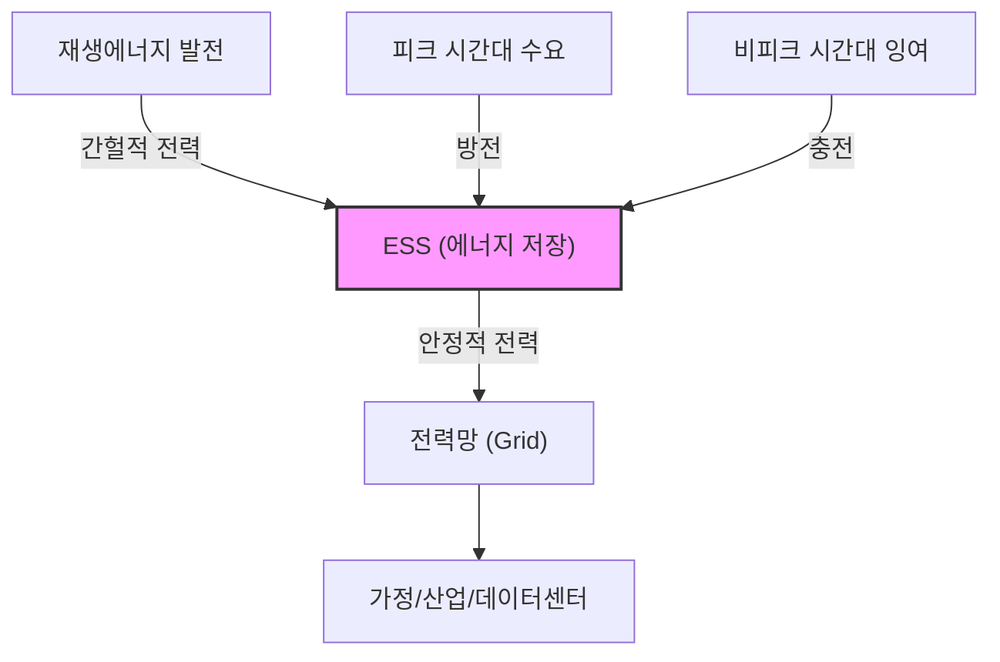
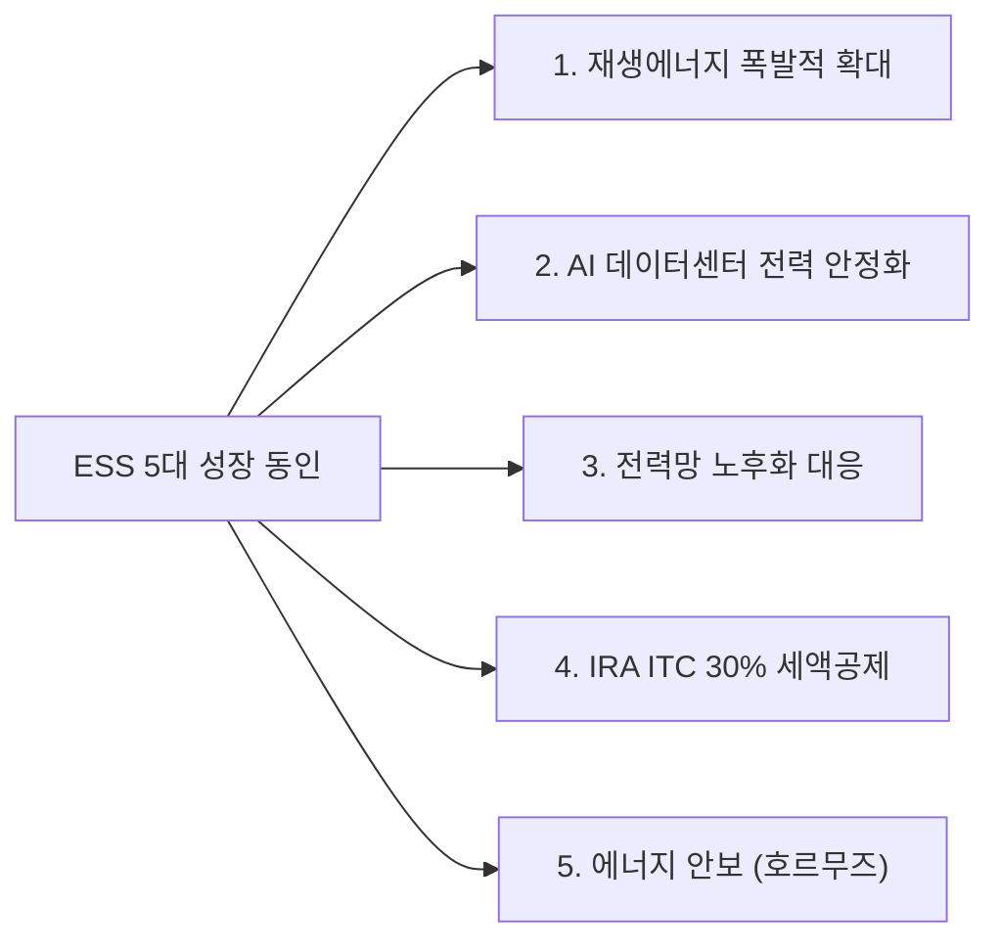
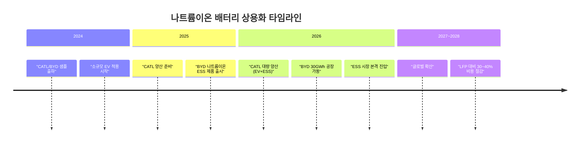
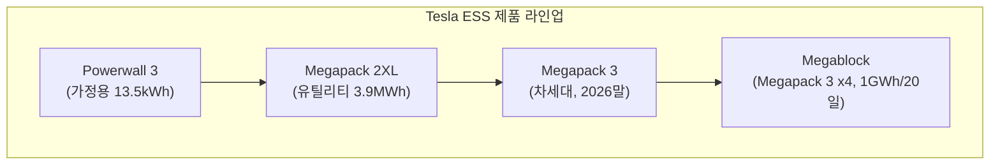
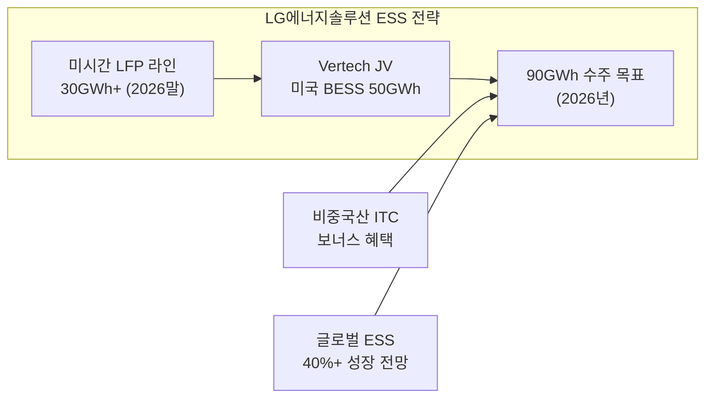
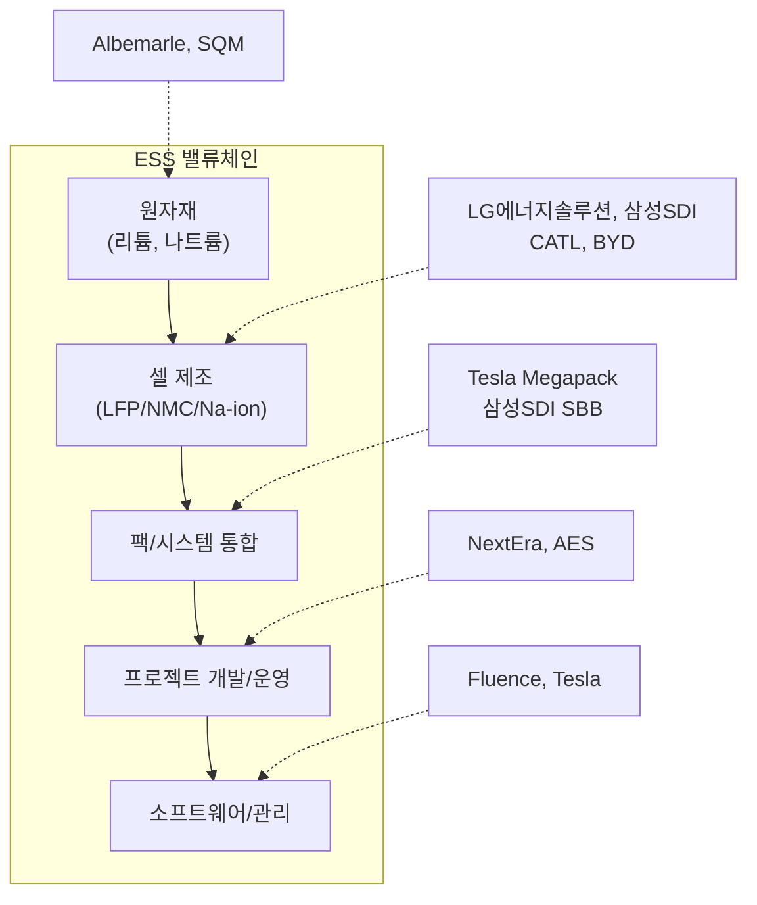

> **시리즈 안내**: [에너지 섹터 종합 전망](/knowledge/invest/2026/03/07/energy-sector-outlook-2026.html) |
> [재생에너지 상세 분석](/knowledge/invest/2026/03/07/renewable-energy-outlook-2026.html) |
> [수소 에너지 상세 분석](/knowledge/invest/2026/03/07/hydrogen-energy-outlook-2026.html) |
> [원전/SMR 상세 분석](/knowledge/invest/2026/01/21/nuclear-power-sector-outlook-2026.html)

---

## 핵심 요약

| 항목 | 내용 |
|------|------|
| **글로벌 ESS 시장** | $146B(2025) → $521B(2035), CAGR 13.6% |
| **미국 2026 신규 ESS** | 24,269MW (전년 대비 +57%) |
| **주도 기술** | LFP (비용/안전/수명 우위) |
| **Tesla Megapack 3** | + Megablock → 1GWh 20영업일 배치 |
| **LG에너지솔루션** | 미국 ESS 셀 생산 30GWh+ (2026말) |
| **삼성SDI** | SBB ESS 라인업 + 전고체 2027~2028 |
| **게임체인저** | 나트륨이온 배터리 (CATL/BYD 2026 양산) |

---

## ESS 시장 구조와 성장 동인

### ESS란?

ESS(Energy Storage System)는 전력을 저장했다가 필요할 때 방출하는 시스템입니다. 재생에너지의 간헐성(태양광은 낮에만, 풍력은 바람 불 때만)을 보완하는 **필수 인프라**로, 에너지 전환의 핵심 연결고리입니다.

### ESS 시장 성장 전망

| 지표 | 2024 | 2025 | 2026E | 2030E | 2035E |
|------|------|------|-------|-------|-------|
| **글로벌 시장 규모** | ~$100B | $146B | $180B+ | ~$350B | $521B |
| **미국 ESS 신규 설치** | ~10GW | ~15.5GW | 24.3GW | ~50GW | - |
| **CAGR** | - | - | - | ~20% | 13.6% |

### 5대 성장 동인

1. **재생에너지 확대**: 태양광/풍력 신규 설치 폭증 → ESS 동반 설치 필수
2. **AI 데이터센터**: 24/7 안정 전력 필요 → ESS + 재생에너지 조합 확대
3. **전력망 노후화**: 미국 전력망 평균 40년+ → 분산형 ESS로 보완
4. **IRA 보조금**: ESS 투자세액공제 30%+ (독립 ESS도 적용)
5. **에너지 안보**: 호르무즈 위기 → 에너지 자립/분산형 전원 필요성 급증

---

## 배터리 기술 심층 분석

### LFP vs NMC: ESS의 승자

ESS 시장에서 **LFP(리튬인산철)**가 사실상의 표준으로 자리잡고 있습니다.

| 항목 | LFP | NMC | 나트륨이온 |
|------|-----|-----|----------|
| **에너지 밀도** | 160~180 Wh/kg | 250~300 Wh/kg | 140~175 Wh/kg |
| **사이클 수명** | 6,000~10,000회 | 2,000~3,000회 | 3,000~10,000회 |
| **안전성** | 높음 (열폭주 위험 낮음) | 보통 | 높음 |
| **비용 (셀)** | $60~80/kWh | $100~130/kWh | $40~60/kWh |
| **원자재 의존** | 리튬, 철, 인 | 리튬, 니켈, 코발트, 망간 | 나트륨 (풍부) |
| **ESS 적합도** | ★★★★★ | ★★★ | ★★★★ (신규) |
| **주도 기업** | CATL, BYD, Tesla | 삼성SDI, LG에너지솔루션 | CATL, BYD |

Tesla는 2021년 Megapack에 LFP를 채택하면서 ESS 시장의 LFP 전환을 확정지었습니다. LFP의 **장수명(매일 충방전 가능)**, **높은 안전성**, **낮은 비용**이 그리드 스케일 ESS에 최적이기 때문입니다.

### 나트륨이온 배터리: 2026년의 게임체인저

MIT Technology Review가 2026년 10대 혁신 기술로 선정한 나트륨이온 배터리가 본격 상용화 단계에 진입했습니다.

| 기업 | 진행 상황 | 사양 |
|------|---------|------|
| **CATL** | 2026년 말 대량 양산 계획, ESS·EV·배터리 스왑 적용 | 175Wh/kg, -40~70도C |
| **BYD** | MC Cube SIB ESS 출시 (1,155kW / 2.3MWh) | 사이클 수명 10,000회 |
| **BYD** | 쉬저우 30GWh 나트륨이온 공장 착공 | 2026 가동 |

**투자 시사점**: 나트륨이온은 LFP를 완전히 대체하기보다, **저가형 ESS 시장**을 새로 창출하며 ESS 총 시장 규모를 확대할 전망입니다. 단, 한국 배터리 3사(삼성SDI, LG에너지솔루션, SK온)는 나트륨이온 양산 계획이 없어, 중국 기업(CATL, BYD)이 이 시장을 주도할 가능성이 높습니다.

### 전고체 배터리: 차세대 프리미엄

전고체 배터리는 ESS보다는 EV에 우선 적용될 전망이지만, 장기적으로 프리미엄 ESS 시장에도 영향을 줄 수 있습니다.

| 기업 | 기술 | 상용화 시점 | ESS 적용 |
|------|------|-----------|---------|
| **삼성SDI** | 황화물계, 900Wh/L | 2027 샘플 → 2028 양산 | 장기 가능 |
| **Toyota** | 황화물계 | 2027~2028 | 미정 |
| **Solid Power** | 삼성SDI/BMW 협업 | 2027~2028 검증 | 미정 |
| **QuantumScape** | 리튬 금속 | 2026~2027 소량 | 미정 |

삼성SDI는 InterBattery 2026에서 전고체 배터리 기술을 공개하며, **"AI thinks, Battery enables"**를 슬로건으로 AI 시대 배터리 비전을 제시했습니다. 초고출력 배터리로 AI/로봇/드론 등 신시장을 타깃하고 있습니다.

---

## 주요 기업 심층 분석

### Tesla (TSLA, NASDAQ) - Megapack 사업

| 항목 | 내용 |
|------|------|
| **제품** | Megapack 2XL → Megapack 3 → Megablock |
| **Megapack 3** | 2025.9 발표, 2026말 출시 예정 |
| **Megablock** | Megapack 3 x 4 + 변압기 + 스위치기어 |
| **핵심 혁신** | 1GWh를 20영업일 만에 배치 가능 |
| **LFP 내재화** | 미국 네바다 LFP 셀 자체 생산 (2025말~) |
| **최근 실적** | 캐나다 최대 BESS: 334대 Megapack 2XL (300MW/1,200MWh) |

**투자 판단**: Tesla의 에너지 사업은 EV 다음의 성장 엔진으로, Megapack 매출이 빠르게 증가 중입니다. 미국 내 LFP 셀 자체 생산으로 공급망 리스크도 축소. 다만 Tesla 주가는 EV 사업 평가가 지배적이라, ESS 전용 투자라면 순수 ESS 기업이 효율적일 수 있습니다.

### LG에너지솔루션 (373220.KS)

| 항목 | 내용 |
|------|------|
| **2026 ESS 목표** | 미국 ESS 90GWh 수주 목표 |
| **Vertech JV** | 2026년 미국 BESS 프로젝트 50GWh 납품 계획 |
| **미국 생산** | 미시간 LFP 라인, 2026말 30GWh+ |
| **총 ESS 생산** | 2026말 연 60GWh |
| **전략** | EV 부진 → ESS로 수익 다각화 |
| **비중국 ITC** | 비중국산 규정 충족 → ITC 보너스 혜택 |

**투자 판단**: LG에너지솔루션은 EV 배터리 시장 둔화를 ESS로 만회하는 전략을 추진 중입니다. 미국 내 LFP 생산 + 비중국산 ITC 보너스가 핵심 경쟁력. BESS 매출 급증이 2026년 실적 턴어라운드의 핵심입니다.

### 삼성SDI (006400.KS)

| 항목 | 내용 |
|------|------|
| **ESS 제품** | Samsung Battery Box (SBB) 통합 솔루션 |
| **시장** | 미국, 유럽 중심 |
| **차별화** | AI 기반 화재 예방 소프트웨어 (SBI) |
| **미국 ESS LFP** | 2조 원+ 규모 ESS LFP 공급 계약 체결 |
| **전고체** | 2027~2028 양산 목표, BMW 협업 |
| **BESS 실적** | BESS 매출 급증으로 손실 축소 |

**투자 판단**: 삼성SDI는 프리미엄 ESS + 전고체 기술 리더십이 장기 투자 포인트. SBB + AI 화재 예방(SBI)으로 차별화. 단기적으로는 EV 배터리 수익 악화가 리스크이나, ESS 매출 급증이 이를 상쇄 중.

### BYD (1211.HK / 002594.SZ)

| 항목 | 내용 |
|------|------|
| **ESS 제품** | MC Cube (LFP/나트륨이온) |
| **나트륨이온 ESS** | MC Cube SIB (1,155kW / 2.3MWh) |
| **나트륨이온 공장** | 쉬저우 30GWh 공장 착공 |
| **기술** | 나트륨이온 사이클 수명 10,000회 달성 |
| **전략** | 저가형 ESS 시장 개척 |

### CATL (300750.SZ)

| 항목 | 내용 |
|------|------|
| **글로벌 점유율** | 배터리 세계 1위 |
| **나트륨이온** | 2026년 말 대량 양산 (EV+ESS+배터리스왑) |
| **사양** | 175Wh/kg, -40~70도C, 500km 주행거리 |
| **ESS 전략** | LFP + 나트륨이온 이원화 |

### Fluence Energy (FLNC, NASDAQ)

| 항목 | 내용 |
|------|------|
| **사업** | 그리드 스케일 ESS 순수 플레이 |
| **기술** | AI 기반 에너지 관리 소프트웨어 |
| **시장** | 미국, 호주, 유럽 |
| **경쟁우위** | Siemens/AES 합작 → 글로벌 네트워크 |
| **투자 포인트** | 순수 ESS 기업으로 섹터 익스포저 극대화 |

---

## ESS 시장 미국 공급 과잉 리스크

2026년 초, 미국 ESS 셀 생산 능력이 **갑자기 공급 과잉** 상태에 진입하고 있다는 분석이 나오고 있습니다.

| 항목 | 내용 |
|------|------|
| **미국 ESS 셀 생산** | 2026말 50GWh (급증) |
| **수요** | 높지만 설치 지연 가능성 |
| **원인** | LG에너지솔루션, Tesla, 중국 업체 동시 증설 |
| **영향** | 셀 가격 하락 압력 → 시스템 비용 절감 → 설치 확대 |

**투자 시사점**: 공급 과잉은 단기적으로 마진 압박 요인이지만, ESS 시스템 비용 절감 → 설치량 확대라는 선순환으로 이어질 수 있습니다. **셀 제조사보다는 시스템 통합(Tesla Megapack, Fluence)이나 프로젝트 개발사**가 공급 과잉 환경에서 유리할 수 있습니다.

---

## ESS 투자 전략

### 밸류체인별 투자 접근

### 투자 시나리오

| 시나리오 | 유망 종목 | 이유 |
|---------|---------|------|
| **ESS 설치 폭발** | Tesla, Fluence, LG에너지솔루션 | 직접 수혜 |
| **LFP 가격 하락** | Fluence, NextEra (시스템/프로젝트) | 비용 절감 수혜 |
| **나트륨이온 확대** | CATL, BYD | 기술/생산 주도 |
| **전고체 상용화** | 삼성SDI | 프리미엄 시장 지배 |
| **미국 제조 프리미엄** | LG에너지솔루션, Tesla | ITC 보너스 + 관세 보호 |

### 핵심 모니터링 지표

| 지표 | 의미 | 빈도 |
|------|------|------|
| 미국 ESS 설치량 (GW) | 시장 성장 확인 | 분기 |
| LFP 셀 가격 ($/kWh) | 마진 압력 판단 | 월간 |
| IRA ITC 정책 변화 | 보조금 리스크 | 수시 |
| 리튬 가격 | 원가 영향 | 주간 |
| Tesla 에너지 매출 | 시장 리더 실적 | 분기 |
| 나트륨이온 양산 진척 | 기술 전환 모니터링 | 분기 |

---

## ESS ETF 투자 대안

| ETF | 티커 | 초점 | 비용 |
|-----|------|------|------|
| **Global X Lithium & Battery Tech** | LIT | 리튬/배터리 전체 | 0.75% |
| **Amplify Lithium & Battery Tech** | BATT | 배터리 밸류체인 | 0.59% |
| **iShares Global Clean Energy** | ICLN | 청정에너지 (ESS 포함) | 0.40% |
| **TIGER 2차전지테마** | 305540 | 한국 배터리 기업 | 0.50% |

---

## 결론

2026년 ESS 섹터는 **재생에너지 동반 성장 + AI 전력 안정화 + IRA 보조금 + 에너지 안보**라는 복합적 성장 동인에 의해 **폭발적 성장기에 진입**했습니다.

**기술적으로는 3가지 핵심 트렌드**가 진행 중입니다:
1. **LFP의 ESS 표준화**: Tesla Megapack이 주도, 한국 기업도 LFP 전환 가속
2. **나트륨이온 상용화**: CATL/BYD가 2026년 본격 양산, 저가형 ESS 시장 창출
3. **전고체 배터리**: 삼성SDI 주도, 2027~2028 상용화로 프리미엄 시장 개척

**투자 전략**:
- **Core**: LG에너지솔루션 (미국 ESS 90GWh 목표), Tesla (Megapack 3/Megablock)
- **Growth**: 삼성SDI (SBB + 전고체), Fluence (순수 ESS)
- **장기 테마**: CATL/BYD (나트륨이온 ESS)

미국 ESS 셀 공급 과잉 리스크가 있으나, 이는 시스템 비용 절감 → 설치 확대의 선순환으로 이어져 오히려 **시장 규모 확대를 가속**할 전망입니다.
