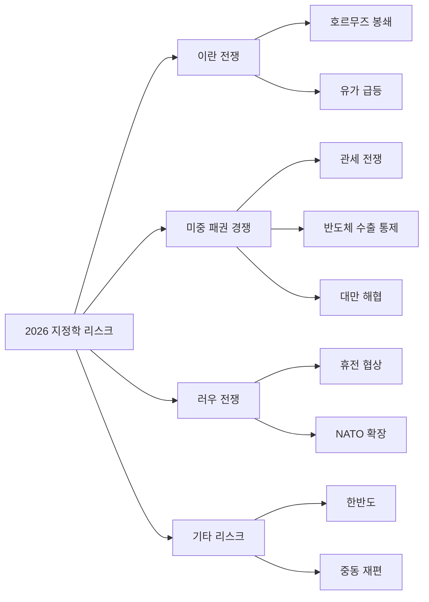
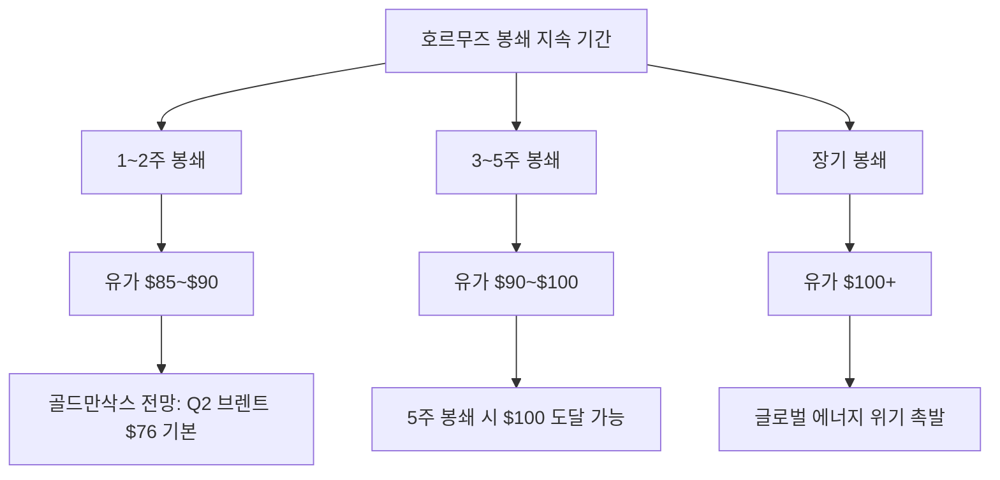
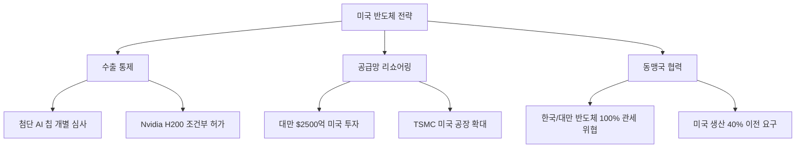
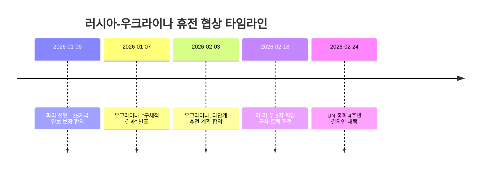
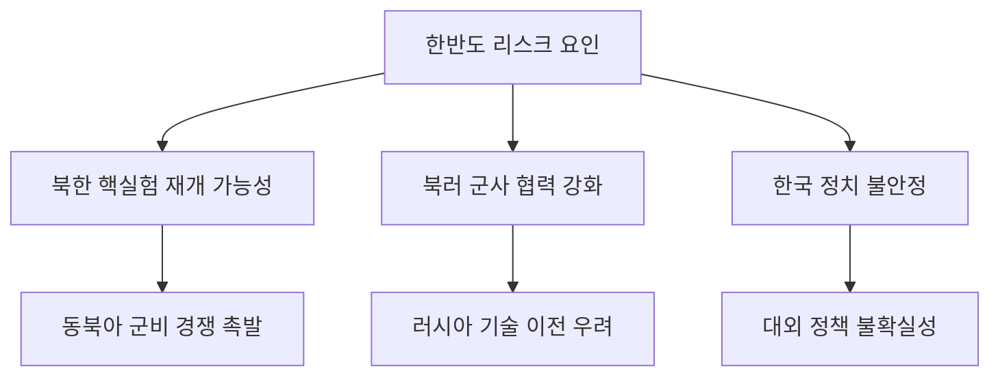
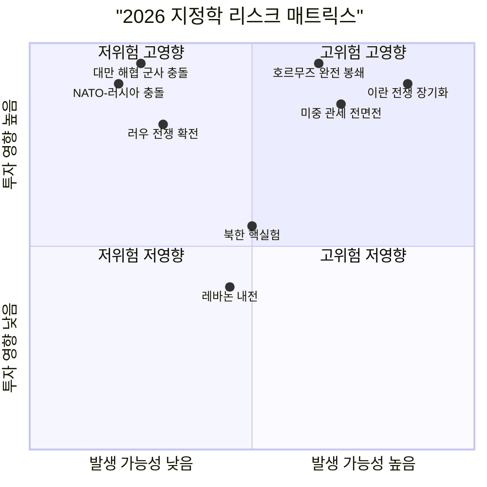

## 개요

2026년은 글로벌 지정학 리스크가 동시다발적으로 고조된 해이다. 이란 전쟁(3월 1일 개전), 미중 패권 경쟁 심화, 대만 해협 긴장, 러시아-우크라이나 교착 상태가 복합적으로 작용하며, 투자 환경에 구조적 불확실성을 가중시키고 있다. 본 문서는 각 리스크의 현황, 전개 시나리오, 그리고 투자 함의를 체계적으로 분석한다.

---

## 1. 이란 전쟁 (Day 7, 2026년 3월 7일 기준)

### 1.1 전쟁 경과

2026년 3월 1일, 미국과 이스라엘이 이란에 대한 공습을 개시했다. 이란 최고 지도자가 사망하면서 전면전으로 확대되었으며, 이란은 UAE와 사우디아라비아를 포함한 걸프 인접국을 타격하고 호르무즈 해협 봉쇄를 선언했다.

### 1.2 호르무즈 해협 봉쇄

호르무즈 해협은 전 세계 석유 소비량의 약 20%가 통과하는 최대 에너지 병목 지점이다.

| 지표 | 전쟁 전 | 전쟁 후 (3월 1일) |
|------|---------|------------------|
| 일일 원유 탱커 통과량 | 24척/일 | 4척/일 |
| WTI 원유 가격 | $74.66/배럴 | $81.01/배럴 (+8.5%) |
| 브렌트 원유 가격 | $81.40/배럴 | $85.41/배럴 (+4.9%) |
| 유조선 보험료 | 정상 | 전쟁 위험 보험 중단 |

### 1.3 유가 시나리오

- 트럼프 대통령은 미국이 호르무즈 해협 통과 유조선에 대한 보험을 제공하겠다고 발표하여 일시적으로 유가가 하락
- 그러나 이란의 유조선 공격 위협이 지속되며 해상 보험사들이 전쟁 위험 담보를 중단

### 1.4 투자 함의

**수혜 섹터:**
- 에너지: 유가 상승으로 석유 메이저 수혜 (ExxonMobil, Chevron, Saudi Aramco)
- 방산: 전쟁 장기화 시 방산주 수요 증가 (Lockheed Martin, Raytheon, 한화에어로스페이스)
- 금: 안전자산 선호 강화

**피해 섹터:**
- 항공: 유가 상승으로 연료비 부담 증가
- 화학/정유: 원료비 급등
- 신흥국 증시: 달러 강세와 자본 유출 압력

---

## 2. 미중 패권 경쟁

### 2.1 관세 전쟁 현황

2026년 미중 무역 갈등은 관세율 인상과 반도체 수출 통제를 중심으로 전개되고 있다.

| 조치 | 내용 | 시행일 |
|------|------|--------|
| 중국산 첨단 반도체 관세 | 25% 관세 부과 | 2026.01.15 |
| Nvidia/AMD 중국 판매 합의 | 매출의 15~25%를 미 정부에 납부 조건부 허가 | 2025.08~2026.01 |
| 반도체 수출 허가 정책 변경 | "거부 추정"에서 "개별 심사"로 전환 | 2026.01.15 |
| 대만 관세 협상 | 상호 관세율 20% -> 15% 인하 | 2026.01.15 |

### 2.2 반도체 수출 통제

- 하워드 러트닉 상무장관은 한국과 대만 반도체 기업이 미국에 투자하지 않으면 최대 100% 관세를 부과하겠다고 경고
- 대만은 $2,500억 규모의 미국 제조업 투자 합의를 통해 관세율을 20%에서 15%로 낮춤
- Section 232(국가안보 관세) 조치가 반도체에도 적용되기 시작

### 2.3 대만 해협

대만 해협은 미중 패권 경쟁의 핵심 화약고로 남아 있다.

**리스크 요인:**
- 중국의 군사적 압박 지속 (정기적 군사 훈련, 방공식별구역 침범)
- 미국의 대만 반도체 의존도 축소 전략 (TSMC 미국 공장 확대)
- 2027년 시진핑 3기 중반, 대만 문제 해결 의지 강화 가능성

**억제 요인:**
- 대만 반도체의 글로벌 공급망 핵심 역할 ("실리콘 방패")
- 미국의 대만 관계법 및 군사적 억지력
- 중국 경제의 글로벌 통합 의존도

### 2.4 투자 함의

**수혜 섹터:**
- 미국 반도체 파운드리: TSMC 미국 공장, Intel Foundry Services
- 국방/사이버보안: 미중 긴장 속 군비 경쟁
- 미국 국내 제조업: 리쇼어링 수혜

**위험 섹터:**
- 중국 시장 노출도 높은 기업 (Apple, Tesla 등)
- 한국/대만 반도체 기업: 관세 불확실성
- 중국 ADR: 규제 리스크

---

## 3. 러시아-우크라이나 전쟁

### 3.1 현황: 동결 분쟁으로 향하는 흐름

전쟁 4년차에 접어든 러우 전쟁은 트럼프 행정부의 중재 노력과 함께 휴전 협상이 진행되고 있으나, 실질적 합의에는 도달하지 못하고 있다.

### 3.2 핵심 쟁점

| 쟁점 | 우크라이나 입장 | 러시아 입장 |
|------|----------------|-------------|
| 영토 | 현재 접촉선 동결 | 돈바스 전역 우크라이나군 철수 요구 |
| 안보 보장 | NATO식 집단 안보 + 서방군 주둔 | NATO 불가입 보장 |
| 휴전 감시 | 미국 주도 감시 메커니즘 | 러시아 참여 감시 체계 |
| 제재 | 단계적 해제 | 즉각적 전면 해제 |

### 3.3 NATO 확장과 유럽 안보

- 파리 선언: 프랑스와 영국이 휴전 시 우크라이나에 군사 허브(military hub) 설치 약속
- 러시아 위반 시 24시간 내 군사적 대응 체계 합의
- NATO 회원국 간 방위비 5% GDP 목표 논쟁으로 내부 분열 심화
- 러시아의 NATO 회원국에 대한 하이브리드 전쟁(사이버공격, 정보전) 확대

### 3.4 투자 함의

**수혜 섹터:**
- 유럽 방산: Rheinmetall, BAE Systems, Leonardo
- 우크라이나 재건 관련주: 건설, 인프라, 에너지
- 유럽 에너지 인프라: LNG 터미널, 재생에너지

**위험 섹터:**
- 러시아 노출 기업: 제재 리스크 지속
- 유럽 에너지 집약 산업: 가스 가격 불확실성

---

## 4. 기타 지정학 리스크

### 4.1 중동 재편

이란 전쟁은 중동의 기존 세력 균형을 근본적으로 변화시키고 있다.

- 이란의 지역 네트워크(헤즈볼라, 후티, 이라크 친이란 민병대) 약화
- 사우디-이스라엘 관계 재편 가능성
- 예멘 후티 반군과 사우디/정부군 간 충돌 확대 위험
- 레바논 내전 재발 가능성
- 이라크 내부 분쟁 격화 우려

### 4.2 한반도

- CFR(외교관계위원회)는 북한 핵실험 재개를 2026년 주요 분쟁 리스크로 선정
- 북한의 핵실험 재개 시 한반도와 동북아 전체에 걸친 군사적 긴장 고조 가능성
- 미국을 포함한 지역 강대국 간 무력 충돌 위험 존재

### 4.3 투자 함의

**한반도 리스크 대응:**
- KOSPI 코리아 디스카운트 요인으로 지속 작용
- 원화 약세 시 수출 대기업 실적 수혜 가능
- 방산주(한화에어로스페이스, LIG넥스원) 지정학 프리미엄

---

## 5. 종합 리스크 매트릭스

### 5.1 지정학 리스크별 자산 영향 요약

| 리스크 | 주식 | 채권 | 원자재 | 금 | 달러 |
|--------|------|------|--------|-----|------|
| 이란 전쟁 확대 | 하락 | 상승 | 급등(유가) | 급등 | 강세 |
| 미중 관세 전면전 | 하락 | 상승 | 혼조 | 상승 | 강세 |
| 대만 해협 충돌 | 급락 | 급등 | 급등 | 급등 | 급강세 |
| 러우 전쟁 확전 | 하락 | 상승 | 상승(가스) | 상승 | 강세 |
| 북한 핵실험 | KOSPI 하락 | 한국채 하락 | 제한적 | 상승 | 강세 |

### 5.2 투자자를 위한 리스크 관리 전략

1. **분산투자**: 지역별, 자산군별 분산을 통해 단일 지정학 이벤트 충격 최소화
2. **안전자산 비중 확대**: 금, 미국 국채, 달러 자산 비중 10~15% 유지
3. **에너지 헤지**: 유가 선물 또는 에너지 ETF를 통한 인플레이션 헤지
4. **옵션 활용**: 풋옵션 또는 VIX 관련 상품으로 테일 리스크 대비
5. **현금 비중**: 급락 시 매수 기회 활용을 위한 현금 15~20% 확보
6. **방산/보안 테마**: 지정학 리스크 심화 시 구조적 수혜 섹터로 포트폴리오 일부 배분

---

## 6. 결론

2026년 3월 기준, 글로벌 지정학 리스크는 역대 최고 수준에 근접해 있다. 이란 전쟁과 호르무즈 해협 봉쇄가 가장 즉각적인 위협이며, 미중 패권 경쟁은 구조적이고 장기적인 리스크로 작용한다. 러우 전쟁은 동결 분쟁으로 향하고 있으나, NATO-러시아 간 하이브리드 전쟁이 새로운 위험 요소로 부상하고 있다.

투자자는 단일 시나리오에 베팅하기보다는, 다양한 시나리오에 대비하는 포트폴리오 구성과 적극적인 리스크 관리가 필요하다. 특히 에너지 가격 급등, 공급망 재편, 안전자산 수요 증가라는 세 가지 공통 테마에 주목해야 한다.
