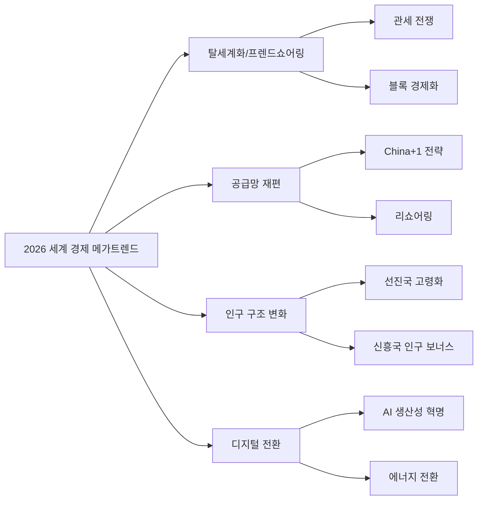
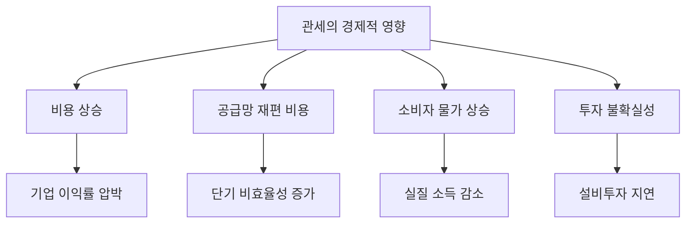
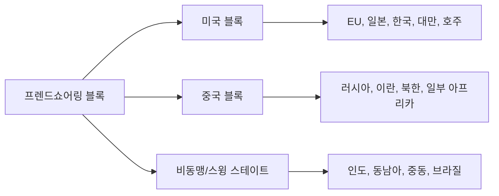
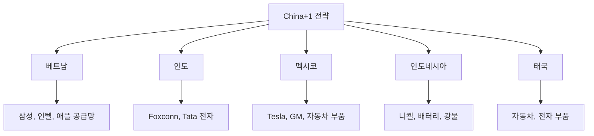
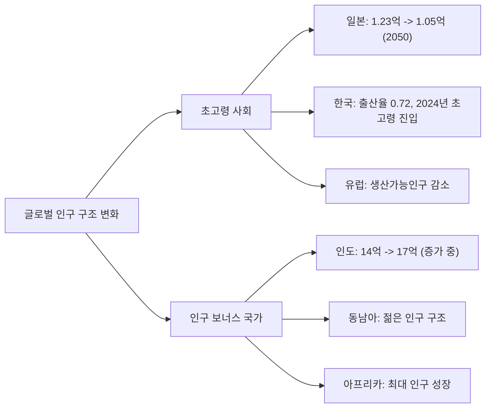
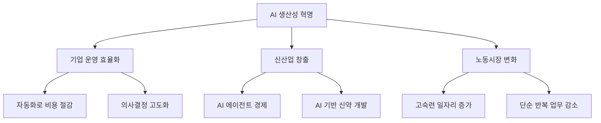
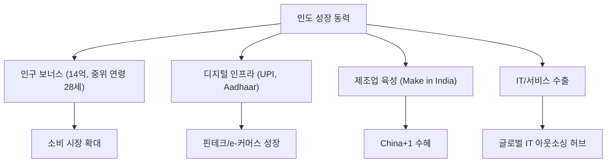
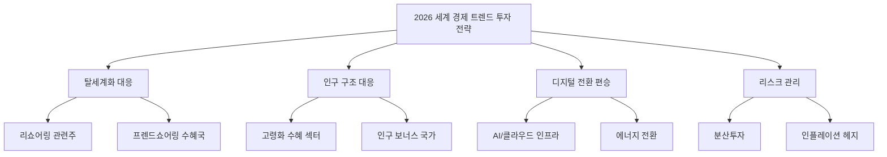

## 개요

2026년 세계 경제는 탈세계화, 공급망 재편, 인구 구조 변화, 디지털 전환이라는 네 가지 구조적 메가트렌드 속에서 전환기를 맞고 있다. 코로나19 팬데믹과 지정학 갈등이 촉발한 이 변화들은 이제 되돌릴 수 없는 구조적 전환으로 자리잡았다. 본 문서는 각 트렌드의 현황과 투자 함의를 체계적으로 분석한다.

---

## 1. 글로벌 GDP 전망

### 1.1 주요 기관별 2026년 성장률 전망

| 기관 | 글로벌 GDP | 미국 | 유로존 | 중국 | 인도 |
|------|-----------|------|--------|------|------|
| IMF (2026.01) | 3.3% | - | - | - | - |
| World Bank (2026.01) | 2.6% | - | - | - | - |
| EY-Parthenon | 3.1% | 1.9% | 1.1% | - | - |
| Goldman Sachs | 2.9% | - | - | - | - |
| S&P Global | - | - | - | - | - |

### 1.2 관세 영향

새로운 관세 체제는 글로벌 경제에 상당한 부담을 주고 있다.

- 글로벌 GDP: 관세로 인해 약 0.7% 감소 예상
- 미국 실질 GDP: 약 1.2% 감소 예상
- 개도국 성장률: 2025년 4.2%에서 2026년 4.0%로 둔화

---

## 2. 탈세계화와 프렌드쇼어링

### 2.1 탈세계화의 구조적 동인

냉전 이후 30년간 이어진 세계화 흐름이 역전되고 있다. 이는 일시적 현상이 아닌 구조적 전환이다.

**탈세계화 촉진 요인:**
- 코로나19가 노출한 글로벌 공급망 취약성
- 미중 패권 경쟁과 기술 디커플링
- 국가안보를 명분으로 한 보호무역 확대
- 이란 전쟁으로 에너지 공급망 불안 심화

**프렌드쇼어링(동맹국 중심 공급망) 전략:**

### 2.2 무역 블록화 현황

| 블록 | 핵심 축 | 주요 교역 메커니즘 | 투자 기회 |
|------|---------|-------------------|-----------|
| 미국 중심 | 미-EU-일-한-대만 | USMCA, IPEF, 양자 FTA | 리쇼어링 인프라 |
| 중국 중심 | 중-러-이란-북한 | RCEP, 일대일로, 위안화 결제 | 중국 내수 소비 |
| 스윙 스테이트 | 인도-동남아-중동 | 다자간 균형 외교 | 차이나+1 수혜국 |

### 2.3 투자 함의

- **리쇼어링 수혜**: 미국 국내 제조업, 건설, 자동화 장비
- **프렌드쇼어링 수혜**: 인도, 베트남, 멕시코의 제조업 투자 확대
- **무역 비용 상승**: 소비자 물가 상승 → 인플레이션 헤지 필요

---

## 3. 공급망 재편

### 3.1 China+1 전략의 본격화

기업들이 중국 의존도를 줄이고 대체 생산 기지를 구축하는 China+1 전략이 본격화되고 있다.

### 3.2 공급망 구조 비교

| 지표 | 전통적 글로벌 공급망 | 재편 후 공급망 |
|------|--------------------|--------------|
| 목표 | 비용 최적화 | 복원력 + 비용 균형 |
| 소싱 전략 | 단일 최저가 소싱 | 다변화 + 이중 소싱 |
| 재고 관리 | Just-in-Time (JIT) | Just-in-Case (JIC) |
| 공급자 위치 | 글로벌 최적지 | 지정학적 안전 지역 |
| 데이터 활용 | 기본 추적 | AI 기반 예측적 관리 |
| 비용 구조 | 낮은 단기 비용 | 높은 단기 비용, 낮은 리스크 비용 |

### 3.3 반도체 공급망 재편

반도체는 공급망 재편의 핵심 영역이다.

- **대만 반도체 기업**: 미국에 $2,500억 투자 합의, TSMC 애리조나 공장 가동 확대
- **미국 CHIPS Act**: 국내 반도체 생산 역량 확충 지속
- **한국 반도체**: 미국 투자 확대 압박, 100% 관세 위협 대응 필요
- **일본**: 라피더스(Rapidus) 프로젝트로 첨단 반도체 제조 재진입

### 3.4 투자 함의

**수혜 기업/섹터:**
- 산업 자동화: Rockwell, ABB, Fanuc
- 동남아/인도 ETF: iShares MSCI India (INDA), VanEck Vietnam (VNM)
- 물류/인프라: 항만, 창고, 물류 자동화
- 반도체 장비: ASML, Applied Materials, Tokyo Electron

---

## 4. 인구 구조 변화

### 4.1 선진국 초고령화

### 4.2 주요국 인구 위기 비교

| 지표 | 일본 | 한국 | 중국 | 인도 |
|------|------|------|------|------|
| 합계출산율 | 1.20 | 0.72 (세계 최저) | 1.00 | 2.00 |
| 65세+ 비율 | 29.1% | 20%+ | 14.5% | 7% |
| 생산인구 전망 | 급감 | 급감 | 급감 | 증가 |
| 초고령사회 진입 | 2006년 | 2024년 | 2035년경 | 2060년경 |
| 인구 정점 | 2010년 | 2020년 | 2022년 | 2065년경 |

### 4.3 인구 위기의 경제적 영향

**일본 (선행 사례):**
- 인구 감소 시작(2010년) 이후 15년간 약 300만 명 감소
- 2050년까지 추가 1,870만 명 감소 전망 (15.1% 감소)
- 로봇 공학에 $4.4억 투자, 62종 휴머노이드 로봇 배치 → 의료 업무량 15% 절감

**한국:**
- 2045년 세계 최고령 국가 전망 (일본 추월)
- 2067년 노인 인구 비율 46.5%, 생산가능인구 초과
- AI 기반 노인 돌봄 시스템으로 효율성 향상 중

### 4.4 투자 함의

**고령화 수혜 섹터:**
- 헬스케어/바이오: 노인 질환 치료제, 의료기기
- 로봇/자동화: 노동력 부족 대응, 돌봄 로봇
- 실버 경제: 노인 소비재, 요양 서비스
- 연금/보험: 퇴직 자산 관리 수요 증가

**인구 보너스 국가 투자:**
- 인도: IT서비스, 소비재, 인프라
- 인도네시아: 디지털 경제, 자원
- 베트남: 제조업, FDI 수혜

---

## 5. 디지털 전환과 AI 생산성 혁명

### 5.1 AI의 경제적 영향

AI는 탈세계화로 인한 효율성 손실을 상쇄할 핵심 기술로 부상하고 있다.

### 5.2 디지털 전환 핵심 영역

| 영역 | 2026년 현황 | 투자 기회 |
|------|------------|-----------|
| AI/ML | 기업 도입 본격화, AI 에이전트 시대 개막 | 클라우드, 반도체, SaaS |
| 클라우드 | 하이브리드/멀티클라우드 표준화 | AWS, Azure, GCP |
| 사이버보안 | AI 기반 위협 증가로 수요 급증 | CrowdStrike, Palo Alto |
| 핀테크 | CBDC 실험 확대, 디지털 결제 보편화 | PayPal, Block, 토스 |
| 로보틱스 | 산업/서비스 로봇 도입 가속 | Fanuc, Boston Dynamics |

### 5.3 에너지 전환

에너지 전환은 디지털 전환과 맞물려 가속화되고 있다.

**데이터센터 전력 수요 폭증:**
- AI 학습/추론에 필요한 컴퓨팅 파워 급증
- 글로벌 데이터센터 전력 소비량 연 30%+ 증가
- 원자력/SMR(소형모듈원자로)에 대한 재평가

**재생에너지 확대:**
- 태양광/풍력 발전 비용 지속 하락
- 배터리 저장 기술 상용화 가속
- 그린 수소 파일럿 프로젝트 확대

### 5.4 투자 함의

**디지털 전환 수혜:**
- AI 인프라: Nvidia, AMD, Broadcom
- 클라우드: Amazon, Microsoft, Google
- 산업 자동화: Siemens, Schneider Electric

**에너지 전환 수혜:**
- 원자력/SMR: Cameco, NuScale Power
- 배터리/EV: CATL, LG에너지솔루션
- 유틸리티: NextEra Energy, Constellation Energy

---

## 6. 신흥국 성장: 인도와 동남아

### 6.1 인도: 차세대 성장 엔진

### 6.2 동남아 성장 전망

| 국가 | 인구 | 성장 동력 | 주요 투자 테마 |
|------|------|-----------|---------------|
| 인도네시아 | 2.8억 | 니켈/자원, 디지털 경제 | 배터리 소재, e-커머스 |
| 베트남 | 1억 | 제조업 FDI, 수출 | 전자부품, 섬유 |
| 필리핀 | 1.2억 | BPO, 해외 송금 | 서비스업, 소비재 |
| 태국 | 7천만 | 자동차, 관광 | EV 제조, 관광 인프라 |

---

## 7. 부채 지속가능성

### 7.1 글로벌 부채 리스크

세계 경제의 또 다른 구조적 위험은 역대 최고 수준의 정부 부채이다.

**주요 우려 사항:**
- 미국 연방 부채: GDP 대비 120%+ 돌파
- 유럽: 높은 부채와 국방비 증가 압박 동시 발생
- 중국: 지방정부 부채 + 부동산 부문 부실
- 일본: GDP 대비 250%+ (세계 최고)

### 7.2 투자 함의

- 금리 상승 장기화 가능성 → 장기 채권 리스크
- 재정 건전성 높은 국가 선호 (싱가포르, 노르웨이, 스위스)
- 인플레이션 연동 채권(TIPS) 수요 증가
- 실물자산(금, 부동산, 인프라) 가치 재평가

---

## 8. 종합 투자 전략

### 8.1 구조적 트렌드별 핵심 투자 테마

### 8.2 자산군별 전략

| 자산군 | 전략 방향 | 근거 |
|--------|-----------|------|
| 주식 | 미국 + 인도/동남아 분산 | 탈세계화 수혜 + 인구 보너스 |
| 채권 | 단기 위주, TIPS 비중 확대 | 금리 불확실성 + 인플레이션 |
| 원자재 | 에너지 + 산업 금속 | 공급망 재편 + 에너지 전환 |
| 부동산 | 데이터센터, 물류 창고 | 디지털 전환 인프라 |
| 대안투자 | 인프라 펀드, 사모 신용 | 저상관 수익원 |

---

## 9. 결론

2026년 세계 경제는 탈세계화, 공급망 재편, 인구 구조 변화, 디지털 전환이라는 구조적 전환 속에서 새로운 균형점을 찾아가고 있다. 이러한 변화는 단기적으로는 비용 상승과 불확실성을 동반하지만, 장기적으로는 새로운 투자 기회를 창출한다.

핵심은 이 트렌드들이 상호 연결되어 있다는 점이다. 탈세계화가 공급망 재편을 촉진하고, 인구 고령화가 디지털 전환과 자동화를 가속화하며, AI가 탈세계화의 효율성 손실을 상쇄한다. 투자자는 이러한 상호작용을 이해하고, 복수의 트렌드가 교차하는 지점(AI 자동화 x 고령화, 공급망 재편 x 신흥국 성장 등)에서 기회를 찾아야 한다.
