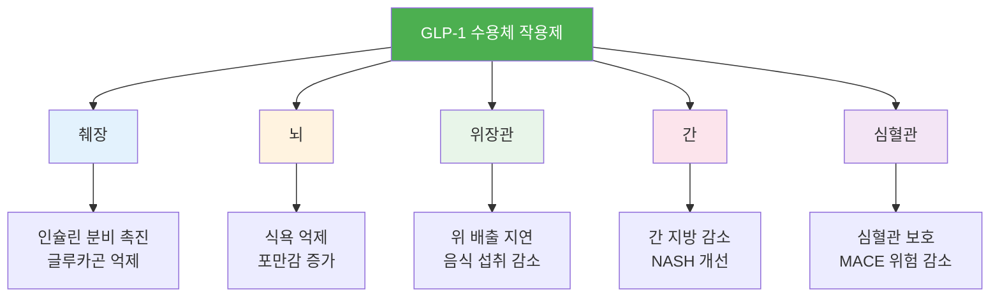
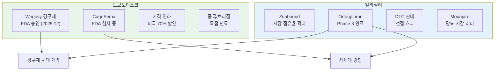
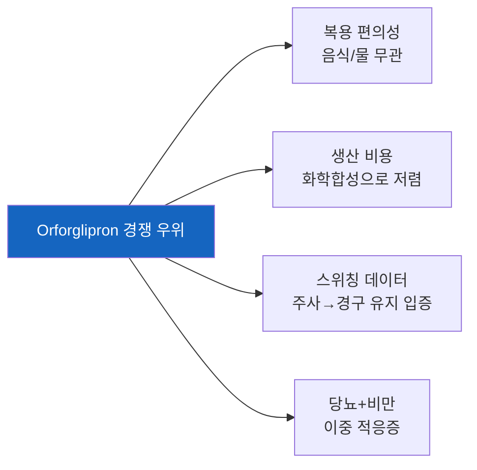
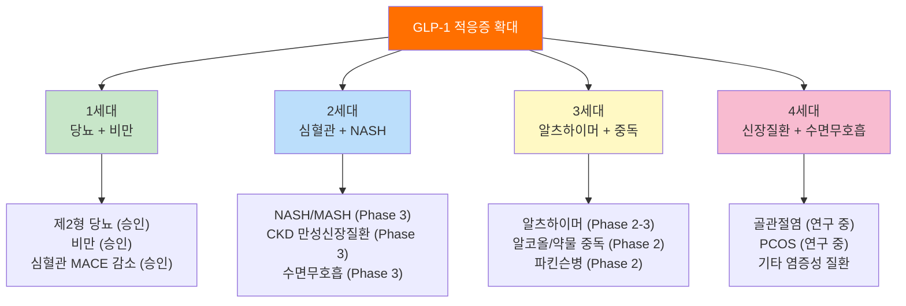
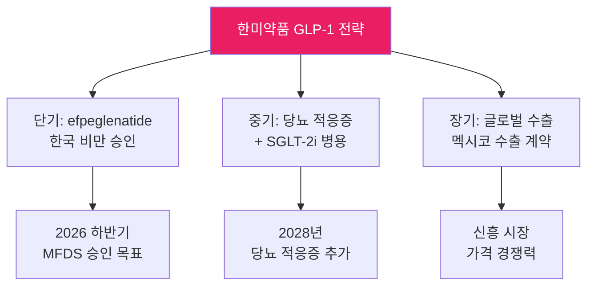
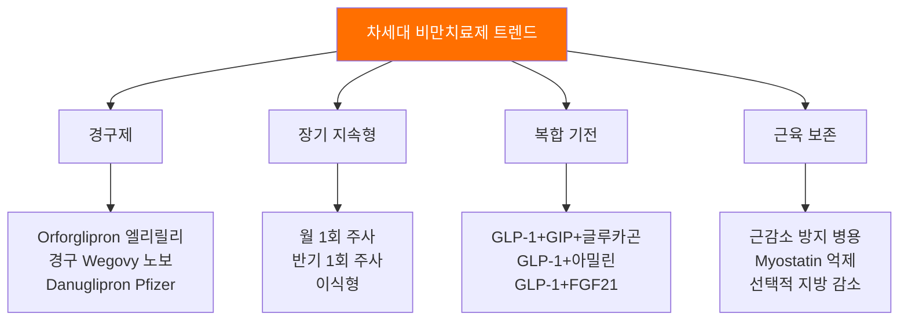

> **관련 글**: [2026년 바이오/헬스케어 섹터 종합 전망](/knowledge/invest/2026/03/07/bio-healthcare-sector-outlook-2026.html)

2026년은 GLP-1 시장에서 **"경구제 시대의 원년"**이자 **"양강 구도 재편의 해"**입니다. 노보노디스크가 **Wegovy 경구제**(세계 최초 경구 GLP-1 비만치료제)의 FDA 승인을 받아 2026년 1월 미국 출시를 시작했고, 엘리릴리는 차세대 경구제 **orforglipron**의 Phase 3 데이터를 연이어 발표하며 FDA 승인 신청을 준비 중입니다. 글로벌 GLP-1 시장은 2025년 $50B 이상에서 2030년 $100B 이상으로 성장이 전망되며, 적응증은 비만·당뇨를 넘어 NASH, 심혈관질환, 심지어 알츠하이머까지 확대되고 있습니다.

## GLP-1이란 무엇인가?

### GLP-1 수용체 작용제의 기본 원리

**GLP-1(Glucagon-Like Peptide-1)**은 식사 후 소장에서 분비되는 인크레틴 호르몬으로, 다음과 같은 다중 작용 기전을 가집니다:

### 주요 GLP-1 약물 비교

| 약물명 | 기업 | 성분 | 투여 | 체중 감량 | 승인 적응증 |
|--------|------|------|------|----------|-----------|
| **Wegovy (주사)** | 노보노디스크 | 세마글루타이드 2.4mg | 주 1회 주사 | 약 15% | 비만, 심혈관 |
| **Wegovy (경구)** | 노보노디스크 | 세마글루타이드 25mg | 매일 경구 | 약 16.6% | **비만 (신규 승인)** |
| **Ozempic** | 노보노디스크 | 세마글루타이드 1mg | 주 1회 주사 | 약 10% | 제2형 당뇨 |
| **Mounjaro** | 엘리릴리 | 티르제파타이드 | 주 1회 주사 | 약 21% | 제2형 당뇨 |
| **Zepbound** | 엘리릴리 | 티르제파타이드 | 주 1회 주사 | 약 21% | 비만 |
| **CagriSema** | 노보노디스크 | 세마글루타이드+카그릴린타이드 | 주 1회 주사 | 약 22-25% | **FDA 심사 중** |
| **Orforglipron** | 엘리릴리 | 소분자 GLP-1 | 매일 경구 | 약 14% | **Phase 3 완료** |

## 양강 구도: 노보노디스크 vs 엘리릴리

### 2026년 실적 가이던스 비교

2026년은 두 기업의 **운명이 극명하게 엇갈리는 해**입니다.

| 지표 | 노보노디스크 | 엘리릴리 |
|------|-----------|---------|
| **2026 매출 가이던스** | **-5% ~ -13%** (역성장) | **$80-83B** (+25%) |
| **시장 반응** | 주가 급락 | 주가 상승 |
| **미국 GLP-1 처방 점유율** | **43%** (Q3 2025) | **57%** (Q3 2025) |
| **핵심 이슈** | 가격 인하 압력, 중국·브라질 독점 만료 | 효능 우위, DTC 판매 선점 |
| **차세대 무기** | Wegovy 경구제, CagriSema | Orforglipron, 차세대 복합제 |

### 노보노디스크 심층 분석

#### Wegovy 경구제 (세마글루타이드 25mg 경구)

| 항목 | 내용 |
|------|------|
| **FDA 승인** | 2025년 12월 (세계 최초 경구 GLP-1 비만치료제) |
| **미국 출시** | 2026년 1월 |
| **가격** | 월 $149~ (보험 미적용 시) |
| **체중 감량** | 16.6% (OASIS 4 임상) |
| **주사 대비** | 유사한 감량 효과 (주사 Wegovy 2.4mg과 비슷) |
| **투여 방법** | 매일 1회 경구 복용 |
| **전략적 의미** | 주사 거부 환자 공략, 접근성 대폭 확대 |

#### CagriSema (카그릴린타이드 + 세마글루타이드)

| 항목 | 내용 |
|------|------|
| **구성** | GLP-1(세마글루타이드) + 아밀린 유사체(카그릴린타이드) |
| **체중 감량** | 약 22-25% (Wegovy 대비 우월) |
| **FDA 심사** | 2026년 내 승인 결정 예상 |
| **전략적 의미** | 노보노디스크의 "최후의 무기", 엘리릴리 Zepbound에 대항 |
| **리스크** | Phase 3 REDEFINE 1 결과가 기대보다 약할 수 있음 |

#### 노보노디스크의 가격 전쟁

노보노디스크는 미국에서 GLP-1 약가를 **최대 70% 인하**하는 공격적 가격 전략을 발표했습니다. 이는 보험 적용 확대와 시장 접근성 향상을 목적으로 하지만, 단기적으로 매출과 이익률에 부정적입니다.

| 가격 전략 | 영향 |
|----------|------|
| 미국 약가 70% 인하 | 접근성 ↑, 단기 매출 ↓ |
| 경구제 $149/월 출시 | 주사 거부 환자 공략 |
| 중국·브라질 독점 만료 | 제네릭 경쟁 시작 |

### 엘리릴리 심층 분석

#### 2026년 매출 가이던스: $80-83B

엘리릴리는 2026년 매출을 **$80-83B**(약 104-108조원)으로 전망하며, 이는 애널리스트 컨센서스 $77.6B를 크게 상회합니다.

| 지표 | 2025년 | 2026년 전망 | 성장률 |
|------|--------|-----------|--------|
| **매출** | ~$64B | **$80-83B** | +25% |
| **EPS** | - | **$33.5-35** | - |
| **GLP-1 매출** | ~$35B | **$45B+** | +30%+ |
| **Mounjaro/Zepbound** | - | 주력 성장 동력 | - |

#### Orforglipron: 게임체인저 경구 GLP-1

Orforglipron은 엘리릴리가 개발 중인 **소분자(non-peptide) 경구 GLP-1 수용체 작용제**로, 기존 경구 세마글루타이드(펩타이드)와 근본적으로 다른 구조입니다.

| 항목 | Orforglipron | 경구 Wegovy |
|------|-------------|------------|
| **분자 유형** | 소분자 (non-peptide) | 펩타이드 |
| **복용 제한** | **없음** (음식·물 무관) | 공복 복용 필요 |
| **복용 시간** | **아무 때나** | 아침 공복 |
| **체중 감량** | 약 14% (P3) | 약 16.6% (P3) |
| **생산 비용** | **저렴** (화학합성) | 비쌈 (펩타이드 합성) |
| **확장성** | **높음** | 제한적 |

#### Orforglipron Phase 3 핵심 결과

| 임상 시험 | 결과 | 의미 |
|-----------|------|------|
| **ATTAIN-2** | 당뇨 환자에서 유의미한 체중 감량·혈당 조절 | 비만+당뇨 동시 공략 |
| **ATTAIN-MAINTAIN** | 주사(Wegovy/Zepbound) → 경구 전환 시 체중 유지 | **주사→경구 스위칭 전략 입증** |
| **경구 세마글루타이드 대비** | 혈당 조절 우월, 체중 감량 유사 | 엘리릴리 경구 GLP-1 우위 근거 |

## GLP-1 시장 규모 및 성장 전망

### 시장 규모 추이

| 연도 | 시장 규모 | 주요 동인 |
|------|----------|----------|
| 2023 | ~$25B | Wegovy/Ozempic 폭발, Mounjaro 출시 |
| 2024 | ~$40B | Zepbound 미국 출시, 보험 적용 확대 |
| 2025 | **$50B+** | 경구제 승인, 적응증 확대 |
| 2026E | **$60-70B** | 경구제 본격 매출, 가격 인하 효과 |
| 2028E | **$80-90B** | 차세대 복합제, 글로벌 확산 |
| 2030E | **$100B+** | 전체 적응증 개화, 글로벌 보편화 |

### 적응증 확대: 비만 너머의 $100B 시장

### 적응증별 시장 기회

| 적응증 | 환자 수 (글로벌) | TAM 예상 | 임상 단계 | 시기 |
|--------|----------------|----------|----------|------|
| **비만** | 10억명+ | $60B+ | 시판 | 현재 |
| **제2형 당뇨** | 5억명+ | $30B+ | 시판 | 현재 |
| **NASH/MASH** | 1.5억명+ | $15-20B | Phase 3 | 2027-28 |
| **심혈관** | 수억명 | $10-15B | 승인 | 현재 |
| **알츠하이머** | 5,500만명+ | $10B+ | Phase 2-3 | 2028+ |
| **CKD** | 8억명+ | $5-10B | Phase 3 | 2027-28 |
| **수면무호흡** | 1억명+ | $5B+ | Phase 3 | 2027 |

## 한미약품: 한국의 GLP-1 도전

### Efpeglenatide 파이프라인

한미약품은 자체 개발한 주 1회 GLP-1 수용체 작용제 **efpeglenatide**로 글로벌 비만치료제 시장에 도전하고 있습니다.

| 항목 | 내용 |
|------|------|
| **약물명** | Efpeglenatide |
| **투여** | 주 1회 주사 |
| **차별점** | 점진적 방출 기전으로 위장관 부작용 경감 |
| **비만 적응증** | 2025.12 MFDS 허가 신청 → **2026 하반기 승인 목표** |
| **당뇨 적응증** | 2028년 적응증 추가 목표 |
| **SGLT-2i 병용** | Phase 3 IND 승인 (2026.01) |
| **글로벌 확장** | 멕시코 Sanfer사와 수출 계약 |

### 한미약품 투자 포인트

| 투자 포인트 | 상세 |
|-----------|------|
| **장점** | 자체 GLP-1 파이프라인, 위장관 부작용 감소, 가격 경쟁력 |
| **단점** | 노보·릴리 대비 임상 데이터 한계, 글로벌 인지도 부족 |
| **촉매** | 2026 하반기 MFDS 비만 승인, 추가 해외 파트너십 |
| **리스크** | GLP-1 시장 경쟁 과열, 임상 실패 가능성 |

## 공급 제약과 기회

### GLP-1 공급 부족 현황

GLP-1 시장의 폭발적 성장에도 불구하고, **공급 능력은 여전히 수요를 따라가지 못하고 있습니다**.

| 공급 이슈 | 현황 | 영향 |
|----------|------|------|
| 주사제 원료(API) 부족 | 세마글루타이드·티르제파타이드 API 증설 중 | 매출 상한 제약 |
| 프리필드 시린지/펜 | 장치 생산 병목 | 출하 지연 |
| CDMO 캐파 경쟁 | 노보·릴리 모두 자체 생산 확대 | 삼성바이오 등 CDMO 수혜 |
| 경구제 생산 전환 | 경구제 증산은 상대적으로 용이 | 경구제 시대 가속 요인 |

### 공급 확대 계획

| 기업 | 투자 계획 | 목표 시기 |
|------|----------|----------|
| **노보노디스크** | 덴마크·프랑스·미국 공장 $10B+ 투자 | 2026-2028 |
| **엘리릴리** | 미국 인디애나·노스캐롤라이나 $10B+ | 2026-2028 |
| **삼성바이오로직스** | GLP-1 CMO 사업 확대 가능성 | 미정 |

## 차세대 비만치료제 파이프라인

### 경쟁사 파이프라인

| 기업 | 약물 | 기전 | 체중 감량 | 단계 |
|------|------|------|----------|------|
| **Amgen** | MariTide | GIP/GLP-1 이중항체 | 20%+ (초기) | Phase 2 |
| **Pfizer** | Danuglipron | 소분자 GLP-1 | 약 11% | Phase 3 |
| **Viking Therapeutics** | VK2735 | GLP-1/GIP 이중작용 | 약 15% | Phase 2 |
| **AstraZeneca** | AZD5004 | 소분자 GLP-1 | 초기 | Phase 1 |
| **Structure Therapeutics** | GSBR-1290 | 소분자 GLP-1 | 약 8% | Phase 2 |
| **Roche** | CT-388 | GLP-1/GIP 이중작용 | 약 19% | Phase 2 |

### 차세대 기술 트렌드

## 투자 전략

### 종목별 투자 판단

| 종목 | 투자 의견 | 목표 | 핵심 근거 |
|------|---------|------|----------|
| **엘리릴리 (LLY)** | **강력 매수** | 시장 리더 | 미국 57% 점유율, Orforglipron, $80-83B 가이던스 |
| **노보노디스크 (NVO)** | **매수 (저가 매수)** | 반등 기대 | 경구 Wegovy 출시, CagriSema 승인, 가격 인하 장기 긍정 |
| **한미약품** | **관망→매수** | 승인 촉매 대기 | 2026 하반기 efpeglenatide 비만 승인 시 모멘텀 |
| **Amgen** | **관심** | MariTide 데이터 | Phase 3 진입 시 주가 촉매 |
| **Viking Therapeutics** | **고위험·고수익** | M&A 타깃 | VK2735 데이터 긍정적, 인수 대상 |

### 시나리오 분석

| 시나리오 | 확률 | 전략 |
|---------|------|------|
| **Bull**: CagriSema 승인 + Orforglipron 신청 + 적응증 확대 | 35% | 엘리릴리·노보노디스크 비중 최대화, 한미약품 매수 |
| **Base**: 경구제 시장 안착 + 가격 경쟁 심화 + 선별적 성장 | 45% | 엘리릴리 core, 노보노디스크 하한 매수, 한미 관망 |
| **Bear**: CagriSema 실망 + 안전성 이슈 + 약가 규제 | 20% | 엘리릴리만 보유, GLP-1 비중 축소, 수혜주(CDMO) 전환 |

### 핵심 모니터링 이벤트

| 시기 | 이벤트 | 영향도 |
|------|--------|--------|
| 2026 Q1 | Wegovy 경구제 초기 매출 | 노보노디스크 반등 여부 |
| 2026 상반기 | CagriSema FDA 결정 | 노보노디스크 최대 촉매 |
| 2026 상반기 | Orforglipron FDA 신청 여부 | 엘리릴리 경구 GLP-1 타임라인 |
| 2026 하반기 | 한미약품 efpeglenatide 승인 | 한국 GLP-1 시장 형성 |
| 2026 연중 | Amgen MariTide Phase 3 데이터 | 3강 체제 가능성 |
| 2026 연중 | 적응증 확대 임상 결과 (NASH, CKD 등) | TAM $100B 달성 근거 |
| 2026 연중 | 안전성 장기 데이터 | 시장 지속 성장 신뢰도 |

## GLP-1 관련 수혜주

GLP-1 시장 성장의 간접 수혜를 받는 기업들도 주목해야 합니다.

| 수혜 영역 | 기업/종목 | 수혜 내용 |
|----------|---------|----------|
| **CDMO/API** | 삼성바이오로직스, Lonza, Bachem | GLP-1 위탁생산 수요 |
| **프리필드 시린지** | Becton Dickinson, Gerresheimer | 주사 장치 수요 급증 |
| **당뇨 합병증 감소** | DexCom (역풍) | CGM 수요 감소 우려 |
| **식품·외식** | Weight Watchers (역풍) | 다이어트 산업 구조 변화 |
| **피하주사 기술** | 알테오젠 | IV→SC 전환 수요 |
| **보험사** | UnitedHealth, CVS Health | 약가 할인, 의료비 절감 |

## 리스크 요인

| 리스크 | 확률 | 영향도 | 설명 |
|--------|------|--------|------|
| **약가 규제** | 높음 | 상 | 미국 IRA 약가 협상, 보험 적용 조건 강화 |
| **안전성 이슈** | 낮음-중 | 최상 | 갑상선암, 췌장염 등 장기 부작용 모니터링 |
| **임상 실패** | 중 | 상 | CagriSema 기대 미달, 적응증 확대 임상 실패 |
| **경쟁 과열** | 높음 | 중 | 10개+ 기업 파이프라인, 가격 경쟁 |
| **공급 부족** | 중 | 중 | 수요 초과 공급, 매출 상한 |
| **보험 적용 제한** | 중 | 중 | 미국 Medicare 비만 적용 정책 변화 |
| **체중 반등** | 중 | 중 | 약물 중단 시 체중 회복 → 장기 복용 필요성 |

---

> **면책 조항**: 본 글은 투자 정보 제공 목적이며, 특정 종목의 매수/매도를 권유하는 것이 아닙니다. 투자 결정은 본인의 판단과 책임하에 이루어져야 합니다.

---

*최종 업데이트: 2026년 3월 7일*
