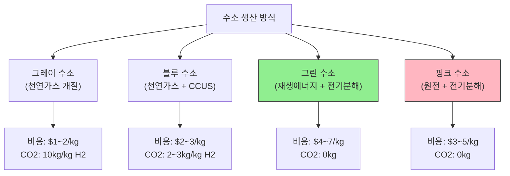
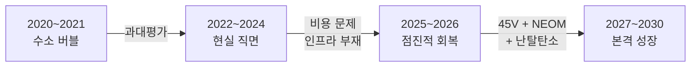
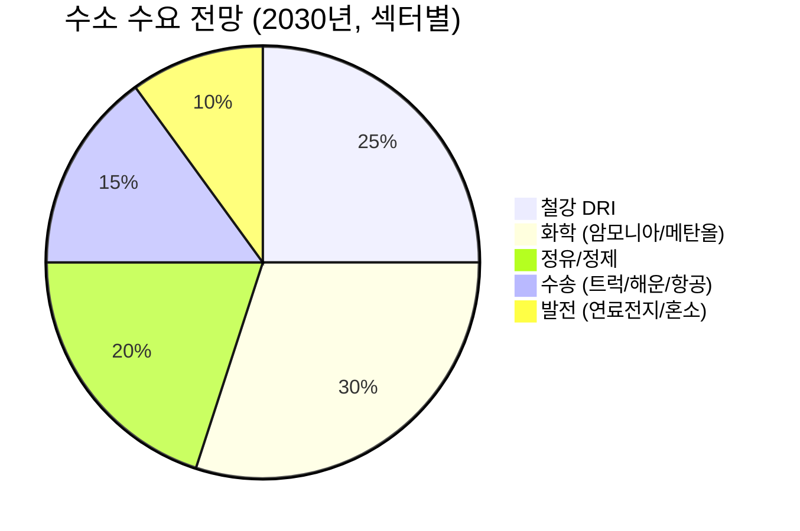
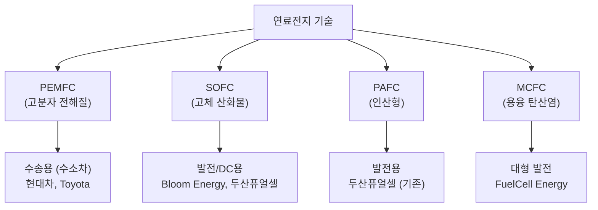
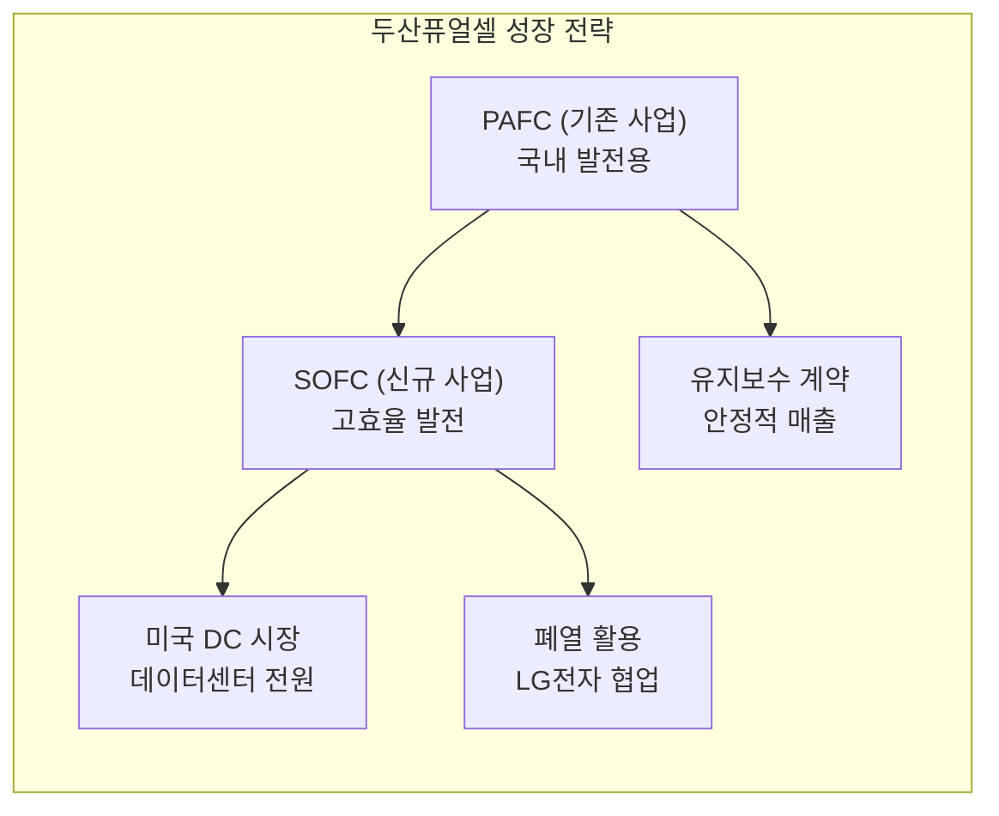
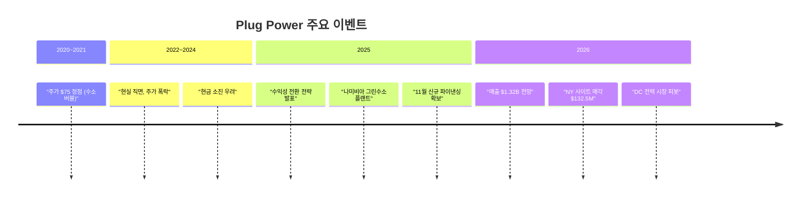
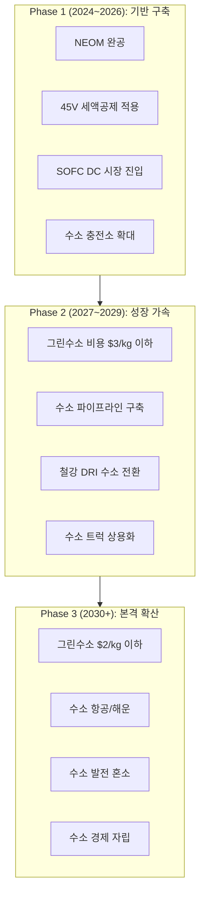

> **시리즈 안내**: [에너지 섹터 종합 전망](/knowledge/invest/2026/03/07/energy-sector-outlook-2026.html) |
> [재생에너지 상세 분석](/knowledge/invest/2026/03/07/renewable-energy-outlook-2026.html) |
> [ESS 상세 분석](/knowledge/invest/2026/03/07/ess-energy-storage-outlook-2026.html) |
> [원전/SMR 상세 분석](/knowledge/invest/2026/01/21/nuclear-power-sector-outlook-2026.html)

---

## 핵심 요약

| 항목 | 내용 |
|------|------|
| **수소 시장 현실** | 초기 과대평가 → 현실적 조정기 ("점진적 탈탄소") |
| **NEOM 프로젝트** | $8.4B, 세계 최대 그린수소 플랜트 (2026~2027 완공) |
| **IRA 45V** | 그린수소 $3/kg 세액공제 (경제성 핵심) |
| **두산퓨얼셀** | SOFC 양산, 2026 매출 6,900억 원 전망 |
| **Plug Power** | 2026 매출 $1.32B 전망, 수익성 전환 도전 |
| **핵심 적용처** | 철강/화학/장거리 물류 (난탈탄소 섹터) |
| **투자 등급** | B+ (장기 성장 잠재력 높으나, 단기 리스크 존재) |

---

## 수소 에너지 기초 이해

### 수소의 색깔별 분류

수소는 생산 방식에 따라 "색깔"로 구분됩니다. 투자 관점에서 각 색깔의 경제성과 탄소 배출량을 이해하는 것이 중요합니다.

| 구분 | 생산 방식 | 비용 ($/kg) | CO2 배출 | 현재 비중 |
|------|---------|------------|---------|---------|
| **그레이** | 천연가스 개질 (SMR) | $1~2 | 높음 (10kg CO2/kg H2) | ~95% |
| **블루** | 천연가스 + 탄소포집(CCUS) | $2~3 | 낮음 | ~4% |
| **그린** | 재생에너지 + 전기분해 | $4~7 | 제로 | ~1% |
| **핑크** | 원전 + 전기분해 | $3~5 | 제로 | <1% |

**핵심**: 현재 수소의 95%는 그레이 수소로, 탈탄소 효과가 없습니다. 투자 관점에서 주목해야 할 것은 **그린/핑크 수소로의 전환**이며, 이를 위해서는 생산 비용 절감이 핵심입니다.

### IRA 45V: 그린수소 경제성의 게임체인저

IRA의 45V 세액공제는 그린수소 경제성을 획기적으로 개선합니다.

| 탄소 배출량 | 세액공제 | 적용 후 비용 |
|-----------|---------|------------|
| 0~0.45 kg CO2/kg H2 | **$3.00/kg** | $1~4/kg (그레이와 경쟁 가능) |
| 0.45~1.5 kg CO2/kg H2 | $1.00/kg | $3~6/kg |
| 1.5~2.5 kg CO2/kg H2 | $0.75/kg | $3.25~6.25/kg |
| 2.5~4.0 kg CO2/kg H2 | $0.60/kg | $3.4~6.4/kg |

45V $3/kg 세액공제가 적용되면, 그린수소 비용이 **$1~4/kg**으로 하락하여 그레이 수소($1~2/kg)와 **경쟁 가능한 수준**에 도달합니다. 이것이 수소 경제 활성화의 핵심 촉매입니다.

---

## 수소 시장 현실 진단: 기대 vs 현실

### 2026년 수소 섹터의 조정기

2020~2021년의 수소 버블 이후, 2026년 수소 섹터는 **현실적 조정기**를 거치고 있습니다.

| 시기 | 시장 분위기 | 핵심 이벤트 |
|------|----------|-----------|
| **2020~2021** | 과열 (Plug Power $75, 현재 ~$2) | 수소 경제 비전, 정부 투자 계획 |
| **2022~2024** | 냉각 (높은 비용, 인프라 부재 직면) | 금리 인상, 프로젝트 지연 |
| **2025~2026** | 선별적 회복 (난탈탄소 집중) | 45V 확정, NEOM 완공 임박, SOFC 양산 |
| **2027~2030** | 본격 성장 예상 | 인프라 확충, 비용 하락, 정책 지원 |

**핵심 변화**: 초기의 "수소가 모든 화석연료를 대체한다"는 과대한 기대에서, **"난탈탄소(hard-to-abate) 섹터에 집중"**하는 현실적 접근으로 전환되었습니다.

### 수소의 핵심 적용처: 난탈탄소 섹터

수소는 전기화가 어려운 "난탈탄소" 섹터에서 유일한 대안입니다.

| 적용 분야 | 수소 필요성 | 규모 | 시기 |
|----------|----------|------|------|
| **철강 (DRI)** | ★★★★★ | 매우 큼 | 2025~2030 |
| **화학 (암모니아/메탄올)** | ★★★★★ | 큼 | 현재~진행 중 |
| **정유 (수소화 탈황)** | ★★★★ | 큼 | 현재 |
| **장거리 해운** | ★★★★ | 중간 | 2027~2030 |
| **장거리 항공** | ★★★ | 중간 | 2030+ |
| **대형 트럭 물류** | ★★★ | 중간 | 2026~2028 |
| **데이터센터 전원** | ★★★ | 새로운 시장 | 2025~2027 |
| **건물 난방** | ★★ | 큼 (EU) | 장기 |

---

## 글로벌 수소 프로젝트

### NEOM 그린수소: 세계 최대 프로젝트

NEOM 그린수소 프로젝트는 수소 경제의 **상징적 프로젝트**입니다.

| 항목 | 내용 |
|------|------|
| **위치** | 사우디아라비아 NEOM |
| **투자 규모** | $8.4B (총), EPC $6.7B (Air Products) |
| **합작 구조** | ACWA Power + Air Products + NEOM (균등 지분) |
| **생산 규모** | 600톤/일 그린수소 → 120만 톤/년 그린암모니아 |
| **에너지원** | 태양광+풍력 4GW |
| **진행률** | 80%+ (2025 Q1 기준) |
| **완공** | 2026~2027년 |
| **탄소 감축** | 연간 500만 톤 CO2 |
| **오프테이커** | Air Products 독점 |

**투자 시사점**: NEOM 프로젝트의 성공적 완공은 그린수소의 **대규모 상업 생산 가능성**을 증명하는 이정표가 됩니다. Air Products(APD)가 독점 오프테이커로서 직접 수혜.

### 글로벌 주요 수소 프로젝트

| 프로젝트 | 국가 | 규모 | 유형 | 시기 |
|---------|------|------|------|------|
| **NEOM NGHC** | 사우디 | 4GW 전해조 | 그린 | 2026~2027 |
| **HyDeal Ambition** | EU | 95GW (목표) | 그린 | 2030 |
| **Asian Renewable Energy Hub** | 호주 | 26GW | 그린 | 2028+ |
| **H2 Hub Gladstone** | 호주 | 3GW | 그린 | 2027+ |
| **H2 Hollandia** | 네덜란드 | 5MW (Plug Power) | 그린 | 2025~2026 |

### EU 수소 전략

EU는 수소 전환에 가장 적극적인 지역입니다.

| 목표 | 내용 | 시기 |
|------|------|------|
| **그린수소 생산** | 1,000만 톤/년 (역내) | 2030 |
| **수소 수입** | 1,000만 톤/년 | 2030 |
| **전해조 용량** | 100GW | 2030 |
| **수소 인프라** | 파이프라인 네트워크 구축 | 2030+ |
| **탄소국경세** | CBAM 본격 시행 → 수소 수요 촉진 | 2026~ |

### 한국 수소 경제 로드맵

| 목표 | 내용 | 시기 |
|------|------|------|
| **수소차 보급** | 누적 10만 대 | 2030 |
| **수소 충전소** | 660개소 | 2030 |
| **수소 발전** | 연료전지 발전 확대 (현재 ~700MW) | 진행 중 |
| **수소 도시** | 3개 시범도시 | 2025~2026 |
| **클린수소 인증** | 클린수소 포트폴리오 기준 도입 | 2026~ |

---

## 연료전지 시장 심층 분석

### 연료전지 종류별 비교

| 종류 | 작동 온도 | 효율 | 주요 용도 | 장점 | 단점 |
|------|---------|------|---------|------|------|
| **PEMFC** | 60~80도C | 40~50% | 수소차, 드론 | 빠른 시동, 경량 | 백금 촉매 필요 |
| **SOFC** | 600~1000도C | 55~65% | 발전, DC | 고효율, 연료 유연성 | 느린 시동 |
| **PAFC** | 150~200도C | 40~50% | 발전 | 검증된 기술 | 크고 무거움 |
| **MCFC** | 600~700도C | 45~55% | 대형 발전 | 대용량 가능 | 부식 문제 |

**2026년 핵심 트렌드**: SOFC가 **데이터센터 발전용**으로 급부상. SMR(소형원전)이 실제 배치되기까지 시간이 걸리는 동안, SOFC 연료전지가 **중간 솔루션(bridge solution)**으로 주목받고 있습니다.

---

## 주요 기업 심층 분석

### 두산퓨얼셀 (336260.KS)

| 항목 | 내용 |
|------|------|
| **사업** | PAFC(기존) + SOFC(신규) 연료전지 발전 |
| **SOFC 양산** | 2024.7 군산공장 양산 개시 (Ceres 기술 기반) |
| **SOFC 차별화** | 600도C 중저온 작동 (Bloom 700~1000도C 대비 유리) |
| **2025E 매출** | ~5,700억 원, 영업이익 ~2,800억 원 |
| **2026E 매출** | ~6,900억 원, 영업이익 ~4,400억 원 |
| **미국 진출** | SOFC 기반 데이터센터 시장 공략 |
| **신사업** | LG전자와 연료전지 폐열 활용 MOU |
| **유지보수** | 장기 유지보수 계약 연속 수주 |

**투자 판단**:
- **강점**: SOFC 양산 능력 확보, 미국 DC 시장 진출 모멘텀, 안정적 국내 매출 기반
- **리스크**: 미국 시장 진출 성과 불확실, SOFC 가격 경쟁력 (Bloom Energy 대비)
- **밸류에이션**: 2026E P/E 기준 성장주 프리미엄 적용 가능

### Plug Power (PLUG, NASDAQ)

| 항목 | 내용 |
|------|------|
| **사업** | 전해조 + 액화수소 운송 + 연료전지 (수직계열화) |
| **2025E 매출** | $969M (+36% YoY) |
| **2026E 매출** | $1.32B (+36% YoY) |
| **전략 전환** | "성장 우선" → "수익성 경로(pathway to profitability)" |
| **부동산 매각** | NY 수소 사이트 $132.5M에 Stream Data Centers 매각 |
| **글로벌** | 나미비아 5MW 전해조 (아프리카 최초 상업 그린수소) |
| **네덜란드** | H2 Hollandia 5MW 전해조 설치 |
| **DC 진출** | 수소 인프라 → AI 데이터센터 전력 피봇 |

**투자 판단**:
- **강점**: 수소 밸류체인 수직계열화 (생산~운송~충전~소비), 매출 성장세
- **리스크**: 지속적 영업 적자, 현금 소진 (역대 적자 누적), 주가 $2 수준
- **주의**: 고위험-고수익 투자. 수익성 전환 확인 전까지는 소규모 비중 권장

### Bloom Energy (BE, NYSE)

| 항목 | 내용 |
|------|------|
| **사업** | SOFC 연료전지 발전 시스템 |
| **기술** | 고체 산화물 연료전지 (700~1000도C) |
| **2026 생산** | 2GW 생산 용량 확대 계획 |
| **핵심 시장** | 데이터센터, 병원, 대학 등 |
| **한국** | SK그룹과 합작 (블룸SK퓨얼셀) |
| **경쟁우위** | SOFC 상업화 선두주자 |
| **리스크** | 두산퓨얼셀의 저온 SOFC 추격 |

**투자 판단**: SOFC 데이터센터 전원 시장의 선두주자. 2GW 생산 확대로 규모의 경제 달성 시 수익성 개선 기대. 한국 시장은 블룸SK퓨얼셀을 통해 진출.

### Air Products (APD, NYSE)

| 항목 | 내용 |
|------|------|
| **사업** | 산업용 가스 글로벌 3위 + 수소 인프라 |
| **NEOM** | EPC $6.7B + 그린암모니아 독점 오프테이커 |
| **Yara 협업** | 저탄소 암모니아 프로젝트 협상 중 |
| **시가총액** | ~$60B |
| **배당** | 40년+ 연속 배당 증가 |
| **투자 포인트** | 수소 인프라 대장주, 안정적 산업가스 수익 |

**투자 판단**: 수소 섹터에서 가장 안정적인 투자 대상. 기존 산업용 가스 사업의 안정적 현금흐름 + NEOM 그린수소 성장 잠재력. 고위험 수소 순수 플레이보다 **리스크 조정 수익률이 우수**.

### 효성첨단소재 (298050.KS)

| 항목 | 내용 |
|------|------|
| **사업** | 탄소섬유 + 타이어코드 + 스틸코드 |
| **수소 관련** | 탄소섬유 강화 플라스틱(CFRP) 수소 저장 탱크 |
| **Type IV 탱크** | 수소차/수소 충전소 핵심 부품 |
| **경쟁력** | 국내 유일 탄소섬유 양산 기업 |
| **투자 포인트** | 수소 인프라 확대 시 탱크 수요 직접 수혜 |
| **리스크** | 수소차 보급 지연, 탄소섬유 가격 |

---

## 수소 경제 단계별 투자 전략

### 수소 경제 발전 로드맵

### 단계별 투자 전략

| 단계 | 시기 | 투자 대상 | 이유 |
|------|------|---------|------|
| **Phase 1** (현재) | 2024~2026 | Air Products, 두산퓨얼셀, Bloom Energy | 실질 매출 있는 기업 |
| **Phase 2** | 2027~2029 | 전해조 기업, 수소 인프라 | 규모 확대에 따른 수혜 |
| **Phase 3** | 2030+ | 수소 전체 밸류체인 | 수소 경제 본격화 |

### 현 시점(Phase 1) 투자 원칙

1. **실질 매출이 있는 기업 우선**: Air Products(산업가스), 두산퓨얼셀(연료전지 발전), Bloom Energy(SOFC)
2. **적자 지속 기업 소규모**: Plug Power 등 수익성 미검증 기업은 포트폴리오 5% 이내
3. **간접 수혜주 병행**: 효성첨단소재(탄소섬유), 현대차(수소차)
4. **ETF 분산**: 개별 종목 리스크가 크므로 ETF 병행

---

## 리스크 분석

### 수소 섹터 특유의 리스크

| 리스크 | 발생 확률 | 영향도 | 대응 |
|--------|---------|--------|------|
| **그린수소 비용 하락 지연** | 중 (40%) | 높음 | 45V 수혜 기업 집중 |
| **45V 세액공제 축소** | 중 (30%) | 높음 | 비미국 프로젝트 분산 |
| **배터리 EV가 수소차 대체** | 높음 (70%) | 중간 | 수송용 아닌 발전/산업용 집중 |
| **인프라 구축 지연** | 높음 (60%) | 중간 | 인프라 불필요 분야(발전용) 선호 |
| **수소 저장/운송 기술 미성숙** | 중 (40%) | 중간 | 암모니아 운송 기업 주목 |
| **경쟁 기술 (소형원전)** | 중 (35%) | 높음 | 원전 보완 역할에 주목 |

### 수소 vs 경쟁 기술

수소의 가장 큰 리스크는 **경쟁 기술의 발전**입니다.

| 적용 분야 | 수소 | 경쟁 기술 | 수소 우위 |
|----------|------|---------|---------|
| **승용차** | 수소차 (FCEV) | 배터리 EV | X (EV 승리) |
| **대형 트럭** | 수소 트럭 | 배터리 트럭 | △ (장거리만) |
| **데이터센터** | 연료전지 | SMR, ESS+재생에너지 | △ (SMR 전 브릿지) |
| **철강** | 수소 DRI | 전기로 (EAF) | O (고급강 필수) |
| **화학** | 그린수소 | 대안 없음 | O (유일한 대안) |
| **해운** | 수소/암모니아 | 메탄올, 배터리 | O (장거리) |

**결론**: 수소는 **모든 분야에서 이기는 기술이 아니라**, 전기화가 어려운 특정 분야에서 **유일한 대안**으로서 가치가 있습니다. 투자도 이에 맞춰 **난탈탄소 섹터 관련 기업**에 집중해야 합니다.

---

## 결론

2026년 수소 에너지 섹터는 **과열기를 지나 현실적 조정기**에 있습니다. "모든 에너지를 수소로"라는 과대한 비전은 퇴색했지만, **난탈탄소 섹터(철강/화학/장거리 물류)**에서의 필수적 역할은 더욱 명확해지고 있습니다.

**투자 핵심 포인트**:

1. **실질 매출 기업 우선**: Air Products(안정적 산업가스 + NEOM), 두산퓨얼셀(SOFC 양산 + DC 시장), Bloom Energy(SOFC 선두)
2. **NEOM 완공 모멘텀**: 2026~2027 세계 최대 그린수소 플랜트 완공 → 대규모 상업 생산 검증
3. **SOFC = 데이터센터 브릿지**: SMR 배치 전까지 연료전지가 DC 전원으로 주목 → 두산퓨얼셀/Bloom Energy 수혜
4. **고위험 종목 소규모**: Plug Power 등 적자 지속 기업은 수익성 전환 확인 후 비중 확대

**최종 평가**: 수소 섹터는 **장기 구조적 성장 잠재력(★★★★★)**은 매우 높으나, **단기 투자 매력도(★★★)**는 제한적입니다. Phase 1(기반 구축기)에 맞춰, 실적 기반 기업 중심으로 장기 관점에서 접근하는 것이 바람직합니다.
