## 개요

투자에서 "무엇을 살 것인가"만큼 중요한 것이 "어떻게 투자할 것인가"이다. 본 문서는 자산배분 프레임워크, 리스크 관리 기법, 행동재무학적 편향, 투자 대가들의 전략을 체계적으로 정리한 투자 방법론 레퍼런스이다. 2026년 시장 환경에 맞춘 실전 적용 방안도 함께 다룬다.

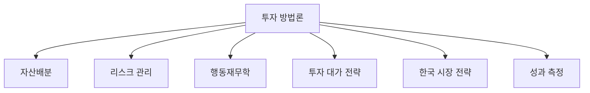

---

## 1. 자산배분 프레임워크

### 1.1 현대 포트폴리오 이론 (MPT)

해리 마코위츠가 1952년 제안한 현대 포트폴리오 이론은 자산배분의 기초이다.

**핵심 원리:**
- 분산투자를 통해 동일한 수익률에서 위험을 줄이거나, 동일한 위험에서 수익률을 높일 수 있다
- 개별 자산의 위험보다 자산 간 상관관계가 더 중요
- 효율적 프론티어(Efficient Frontier) 위의 포트폴리오가 최적

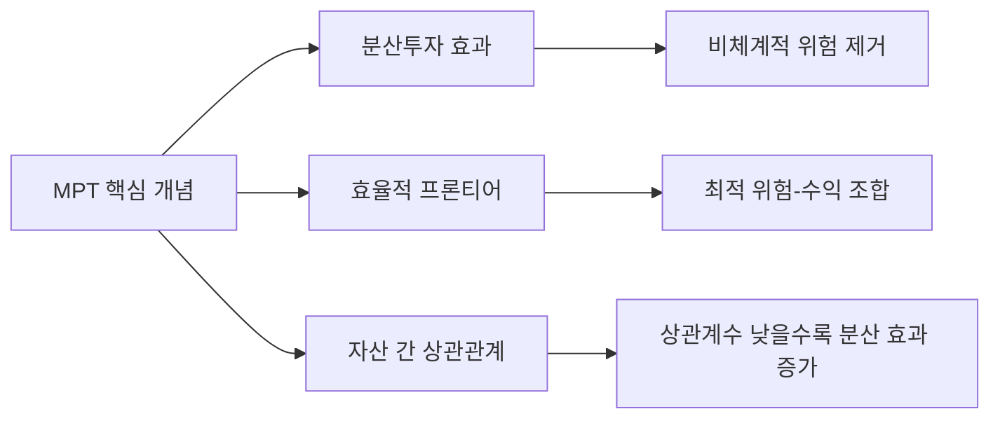

**한계:**
- 과거 데이터 기반 → 미래 상관관계 변동 반영 어려움
- 정규분포 가정 → 꼬리 위험(tail risk) 과소평가
- 위기 시 상관관계가 1에 수렴하는 현상 미반영

### 1.2 올웨더 포트폴리오 (All-Weather Portfolio)

레이 달리오(Ray Dalio)가 설계한 올웨더 포트폴리오는 어떤 경제 환경에서도 안정적 성과를 추구한다.

**기본 배분:**

| 자산군 | 비중 | 역할 |
|--------|------|------|
| 주식 (S&P 500) | 30% | 경제 성장기 수익 |
| 장기 국채 (20년+) | 40% | 디플레이션/경기침체 방어 |
| 중기 국채 (7~10년) | 15% | 안정성 + 소득 |
| 금 | 7.5% | 인플레이션 헤지 |
| 원자재 | 7.5% | 인플레이션 헤지 |

**핵심 철학: 리스크 패리티**
- 달러가 아닌 리스크를 균등하게 배분
- 경제를 4가지 계절(성장/침체 x 인플레/디플레)로 구분하고 각 계절에 강한 자산을 배치
- 경제 예측이 불가능하다는 전제에서 출발

**30년 성과 (2026년 2월 기준):**
- 연평균 수익률: 7.43%
- 표준편차: 7.46%
- 샤프 비율: 약 0.6

**2026년 수정 사항:**
- 달리오가 금 비중을 5~15%로 높이고, 미국 국채 비중을 줄일 것을 권고
- 대안자산(미술품, 사모 신용, 부동산, 실물 금) 일부 편입 검토

### 1.3 퍼머넌트 포트폴리오 (Permanent Portfolio)

해리 브라운(Harry Browne)이 설계한 4등분 포트폴리오이다.

| 자산군 | 비중 | 역할 |
|--------|------|------|
| 주식 | 25% | 경기 번영 |
| 장기 국채 | 25% | 디플레이션 |
| 금 | 25% | 인플레이션 |
| 현금/단기 국채 | 25% | 경기 침체 |

**장점:** 극도로 단순, 분기별 리밸런싱만 필요
**단점:** 장기적으로 올웨더 대비 수익률 낮음

### 1.4 바벨 전략 (Barbell Strategy)

나심 탈레브(Nassim Taleb)가 주장한 전략으로, 극도로 안전한 자산과 극도로 공격적인 자산을 조합한다.

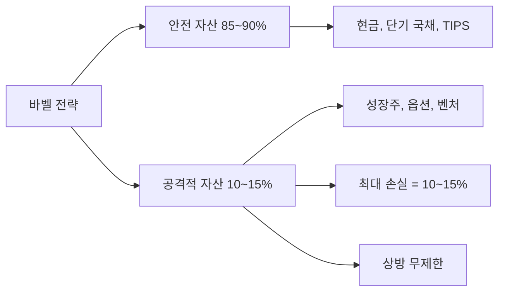

---

## 2. 리스크 관리

### 2.1 VaR (Value at Risk)

포트폴리오의 일정 기간 동안 일정 신뢰수준에서 발생할 수 있는 최대 손실액을 측정한다.

**예시:**
- "95% 신뢰수준에서 1일 VaR = $100만" → 5% 확률로 하루에 $100만 이상 손실 가능

**한계:**
- 꼬리 위험 과소평가 (2008년 금융위기 등)
- 정규분포 가정의 비현실성
- 개선안: CVaR(조건부 VaR), 스트레스 테스트 병행

### 2.2 드로다운 관리 (Drawdown Control)

| 드로다운 수준 | 회복에 필요한 수익률 | 심리적 영향 |
|--------------|---------------------|------------|
| -10% | +11.1% | 경미한 스트레스 |
| -20% | +25.0% | 상당한 불안 |
| -30% | +42.9% | 강한 매도 충동 |
| -40% | +66.7% | 패닉 셀링 위험 |
| -50% | +100.0% | 투자 포기 위험 |

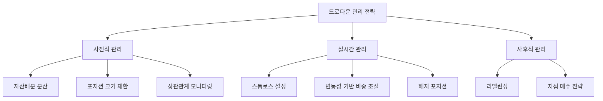

### 2.3 포지션 사이징 (Position Sizing)

**켈리 기준 (Kelly Criterion):**
```
최적 투자 비율 = (bp - q) / b
여기서 b = 배당률, p = 승률, q = 패률 (1-p)
```

**실전 적용 규칙:**
- 단일 종목: 포트폴리오의 5% 이내 (보수적 투자자는 2~3%)
- 단일 섹터: 포트폴리오의 20% 이내
- 단일 국가: 포트폴리오의 40% 이내 (자국 제외)
- 고위험 자산: 총 포트폴리오의 10~15% 이내

### 2.4 헤지 전략

| 헤지 도구 | 목적 | 비용 | 적합 상황 |
|-----------|------|------|-----------|
| 풋옵션 | 하락 방어 | 프리미엄 (2~5%/년) | 급락 우려 시 |
| VIX 콜옵션 | 변동성 급등 방어 | 프리미엄 | 지정학 리스크 고조 |
| 인버스 ETF | 단기 하락 헤지 | 추적 오차 | 단기 전술적 |
| 금/달러 | 체계적 위험 헤지 | 기회비용 | 상시 보유 |
| 통화 헤지 | 환율 변동 방어 | 스왑 비용 | 해외 투자 시 |

---

## 3. 행동재무학: 투자자의 심리적 편향

### 3.1 주요 인지 편향

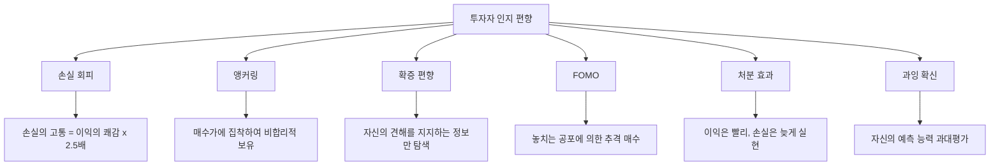

### 3.2 편향별 대응 전략

| 편향 | 증상 | 대응 전략 |
|------|------|-----------|
| 손실 회피 | 손절 거부, 본전 심리 | 사전에 스톱로스 설정, 기계적 실행 |
| 앵커링 | 매수가/과거 고점에 집착 | 현재 가치와 미래 전망만 평가 |
| 확증 편향 | 한쪽 의견만 탐색 | 의도적으로 반대 의견 탐색 |
| FOMO | 급등 종목 추격 매수 | 투자 원칙 문서화, 사전 매수 기준 설정 |
| 처분 효과 | 수익 종목 빨리 매도 | 손절/익절 기준 동일하게 적용 |
| 과잉 확신 | 과도한 거래, 집중 투자 | 투자 일지 기록, 성과 정기 점검 |
| 군중 심리 | 유행 따라가기 | 역발상 투자 체크리스트 활용 |
| 최근 편향 | 최근 성과로 미래 예측 | 장기 데이터 기반 판단 |

### 3.3 체계적 투자 프로세스

행동 편향을 극복하기 위한 체계적 프로세스:

1. **투자 원칙 문서화**: 매수/매도 기준, 포지션 크기, 리밸런싱 규칙
2. **체크리스트 활용**: 매수 전 10가지 질문 체크
3. **투자 일지**: 매매 이유, 감정 상태, 결과 기록
4. **정기 리뷰**: 월간/분기별 포트폴리오 점검
5. **자동화**: 적립식 투자, 자동 리밸런싱

---

## 4. 투자 대가들의 전략

### 4.1 워렌 버핏 (가치 투자)

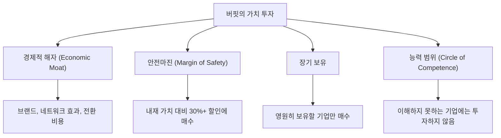

**핵심 원칙:**
- "좋은 기업을 적정 가격에 사는 것이, 적당한 기업을 좋은 가격에 사는 것보다 낫다"
- "다른 사람들이 탐욕스러울 때 두려워하고, 다른 사람들이 두려워할 때 탐욕스러워져라"
- 추천 포트폴리오: S&P 500 인덱스 90% + 단기 국채 10%

**2026년 적용:**
- 이란 전쟁, 미중 갈등으로 시장 공포 시 우량주 매수 기회
- 현금 비중 유지하며 급락 시 공격적 투입
- 장기 경쟁우위 있는 기업 중심 포트폴리오

### 4.2 레이 달리오 (매크로/리스크 패리티)

**올웨더 전략 (앞서 상세 설명)**

**추가 핵심 원칙:**
- "경제는 기계처럼 작동한다" → 부채 사이클, 생산성 성장, 단기 부채 사이클 이해
- 극단적 분산: 15~20개 비상관 수익원(return streams)
- 체계적 의사결정: 알고리즘과 원칙에 기반한 투자

**2026년 시사점:**
- 지정학 리스크 고조 → 금 비중 확대 (5~15%)
- 인플레이션 우려 → TIPS, 원자재 비중 유지
- 미국 국채 리스크 증가 → 글로벌 채권 분산

### 4.3 조지 소로스/스탠리 드러켄밀러 (모멘텀/매크로)

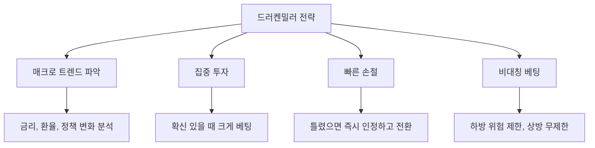

**핵심 원칙:**
- "돈을 벌든 잃든 중요하지 않다. 옳을 때 얼마나 벌고, 틀릴 때 얼마나 잃느냐가 중요하다"
- 매크로 흐름이 유리할 때 공격적으로 베팅
- 포지션 크기 > 방향 예측 정확도

**2026년 적용:**
- 이란 전쟁 → 에너지/방산 롱, 항공 숏
- 미중 관세 → 리쇼어링 수혜주 롱
- 금리 방향에 따른 채권/주식 전술적 배분

### 4.4 하워드 막스 (사이클 투자)

**핵심 원칙:**
- 시장 사이클을 이해하는 것이 투자의 핵심
- "현재 우리가 사이클의 어디에 있는가?"가 가장 중요한 질문
- 시장이 극단에 있을 때 반대로 행동

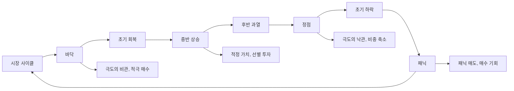

**2026년 사이클 판단:**
- 이란 전쟁과 지정학 리스크로 시장 불안 고조
- 그러나 AI/기술 혁신으로 장기 성장 동력 건재
- 사이클 중후반 → 선별적 투자, 현금 비중 유지 권장

### 4.5 캐시 우드 (혁신 투자)

**핵심 원칙:**
- 파괴적 혁신(disruptive innovation)에 집중 투자
- 5년 이상 장기 시계열로 투자
- 시장이 과소평가하는 혁신 기술에 베팅

**5대 혁신 플랫폼:**
1. AI/로보틱스
2. 에너지 저장 (배터리)
3. 유전체학/합성생물학
4. 블록체인/디지털 자산
5. 다중오믹스(멀티오믹스)

**장점과 한계:**
- 장점: 장기 혁신 트렌드 조기 포착
- 한계: 높은 변동성, 금리 상승 시 성장주 할인율 증가로 큰 손실 가능

---

## 5. 한국 시장 전략

### 5.1 KOSPI 사이클 특성

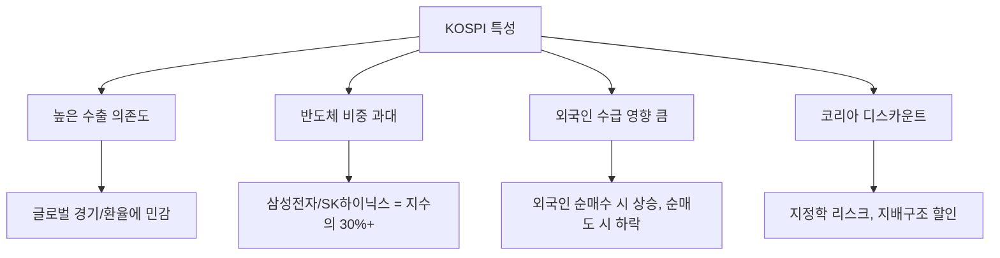

### 5.2 2026년 KOSPI 전망

| 시나리오 | 지수 범위 | 전제 조건 |
|----------|-----------|-----------|
| Base | 3,300~4,000 | 이란 전쟁 단기 종결, 미중 관계 안정 |
| Best | 6,000~8,000 | 반도체 슈퍼사이클, 글로벌 유동성 확대 |
| Worst | 2,500~3,000 | 이란 전쟁 장기화, 글로벌 침체 |

- Macquarie는 강한 실적 성장, 충분한 유동성, 주식 친화적 정책에 의해 KOSPI 6,000선 접근 전망
- 외국인 현선물 수급: 2025년에 이어 2026년에도 순매수 기류 우세 전망
- 글로벌/EM 증시 내 한국 Overweight 시장 차별화 가능성

### 5.3 외국인 수급 분석

**외국인 순매수 확대 요인:**
- 한국 기업 실적 모멘텀 (반도체, AI 관련)
- 밸류업 프로그램으로 주주환원 개선 기대
- 글로벌 대비 저평가 매력 (PER, PBR 할인)

**외국인 순매도 리스크:**
- 달러 강세 / 원화 약세 시 환차손 우려
- 지정학 리스크 (북한, 한국 정치 불안정)
- 글로벌 위험 회피(risk-off) 심화 시

### 5.4 환율 헤지 전략

한국 투자자의 해외 투자 시 환율 헤지는 필수 고려 사항이다.

| 전략 | 방법 | 장점 | 단점 |
|------|------|------|------|
| 완전 헤지 | 환헤지 ETF (H형) | 환율 변동 제거 | 헤지 비용 (금리차) |
| 부분 헤지 | 50% 헤지 | 균형적 접근 | 관리 복잡 |
| 무헤지 | 원화 약세 베팅 | 비용 없음 | 환차손 위험 |
| 달러 자산 보유 | 달러 예금/MMF | 자연 헤지 | 유동성 제약 |

**2026년 환율 전략:**
- 이란 전쟁으로 달러 강세 → 해외 투자 시 환헤지 비중 확대 고려
- 장기적으로 원화 약세 추세 (무역수지, 인구 구조) → 달러 자산 일부 보유 유리

### 5.5 한국 시장 투자 전략

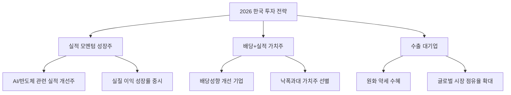

---

## 6. 성과 측정

### 6.1 핵심 성과 지표

| 지표 | 공식 | 의미 | 우수 기준 |
|------|------|------|-----------|
| CAGR | (최종/초기)^(1/n) - 1 | 연평균 복합 수익률 | S&P 500 평균 ~10% |
| 샤프 비율 | (수익률-무위험)/표준편차 | 위험 대비 수익 | > 1.0 우수 |
| 소르티노 비율 | (수익률-무위험)/하방편차 | 하락 위험 대비 수익 | > 1.5 우수 |
| 최대 낙폭 (MDD) | 고점 대비 최대 하락 | 최악의 손실 | < -20% 양호 |
| 정보 비율 | 초과수익/추적오차 | 벤치마크 대비 성과 | > 0.5 우수 |
| 승률 | 이익 거래/전체 거래 | 거래 성공 비율 | > 50% (모멘텀) |
| 손익비 | 평균 이익/평균 손실 | 이익 대 손실 비율 | > 2.0 우수 |

### 6.2 벤치마크 비교

| 벤치마크 | 용도 | 30년 CAGR |
|----------|------|-----------|
| S&P 500 | 미국 대형주 | ~10.5% |
| MSCI World | 글로벌 선진국 | ~8.5% |
| MSCI EM | 신흥국 | ~7.0% |
| KOSPI | 한국 대형주 | ~7.0% |
| 올웨더 포트폴리오 | 균형 자산배분 | 7.43% |
| 60/40 포트폴리오 | 전통적 균형 | ~8.0% |

### 6.3 성과 분석 체크리스트

**월간 점검 항목:**
- [ ] 포트폴리오 수익률 vs 벤치마크
- [ ] 각 자산군별 기여도 분석
- [ ] 최대 낙폭 및 회복 기간 확인
- [ ] 리밸런싱 필요 여부 확인

**분기별 점검 항목:**
- [ ] 투자 원칙 준수 여부 점검
- [ ] 매크로 환경 변화 반영 여부
- [ ] 포지션 크기 적정성 검토
- [ ] 비용(수수료, 세금) 분석

---

## 7. 2026년 환경에서의 종합 전략

### 7.1 현재 환경 진단

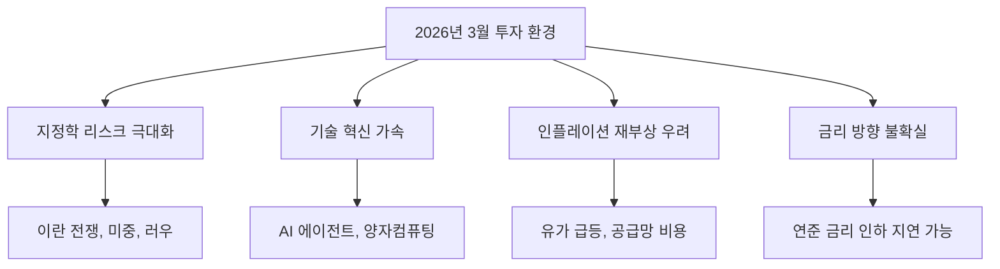

### 7.2 전략별 적용

| 대가 | 전략 | 2026년 3월 적용 |
|------|------|----------------|
| 버핏 | 가치 투자 | 공포 시 우량주 매수, 현금 20%+ 확보 |
| 달리오 | 올웨더 | 금 비중 확대, 채권 글로벌 분산 |
| 드러켄밀러 | 매크로 | 에너지 롱, 항공 숏, 방산 롱 |
| 막스 | 사이클 | 사이클 중후반 판단, 선별적 투자 |
| 캐시 우드 | 혁신 | AI/양자 장기 투자, 변동성 감내 |

### 7.3 실전 포트폴리오 예시 (2026년 3월)

**보수적 투자자 (안정 추구):**

| 자산군 | 비중 | 구체적 배분 |
|--------|------|------------|
| 현금/단기 채권 | 25% | 달러 MMF, 한국 단기채 |
| 주식 | 30% | S&P 500 20%, KOSPI 10% |
| 채권 | 25% | TIPS 10%, 글로벌 채권 15% |
| 금 | 10% | 금 ETF |
| 원자재 | 5% | 에너지 ETF |
| 대안투자 | 5% | 인프라 펀드 |

**공격적 투자자 (성장 추구):**

| 자산군 | 비중 | 구체적 배분 |
|--------|------|------------|
| 현금 | 10% | 급락 시 매수 대기 자금 |
| 주식 | 55% | AI/반도체 20%, S&P 500 15%, 인도/동남아 10%, KOSPI 10% |
| 채권 | 10% | TIPS |
| 금 | 10% | 금 ETF |
| 원자재 | 5% | 에너지 ETF |
| 고위험 | 10% | 양자컴퓨팅, BCI, 합성생물학 |

---

## 8. 핵심 투자 원칙 요약

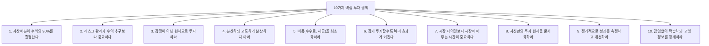

---

## 9. 결론

투자 방법론은 시장 환경에 따라 적용 방식은 달라지지만, 핵심 원칙은 불변한다. 자산배분, 리스크 관리, 행동 편향 극복이라는 세 기둥이 투자 성과의 대부분을 결정한다.

2026년 3월, 이란 전쟁과 지정학 리스크 속에서 투자자가 가장 경계해야 할 것은 공포에 의한 패닉 매도와, 반대로 "이번엔 다르다"는 과잉 확신이다. 하워드 막스의 말처럼, "가장 위험한 것은 리스크가 없다고 생각하는 것"이다.

체계적 프로세스를 구축하고, 원칙에 따라 투자하며, 장기적 시각을 유지하는 것이 어떤 시장 환경에서도 유효한 최선의 전략이다.
