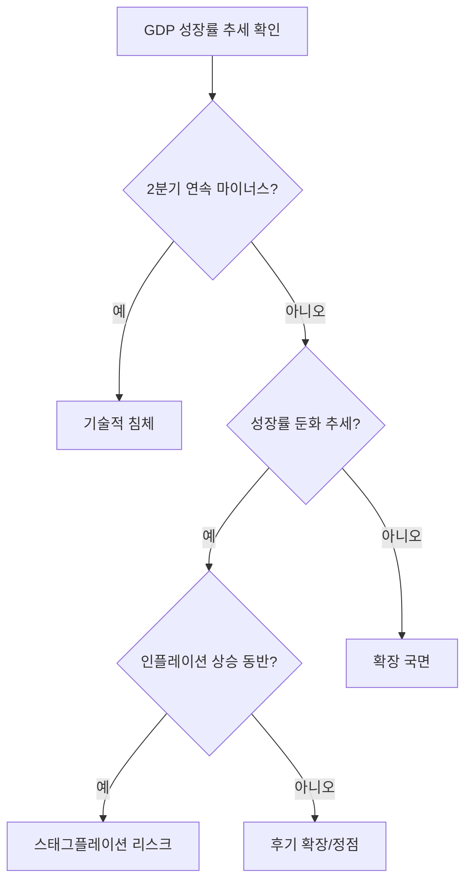
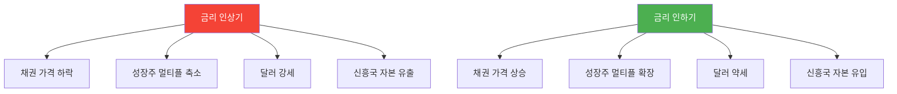
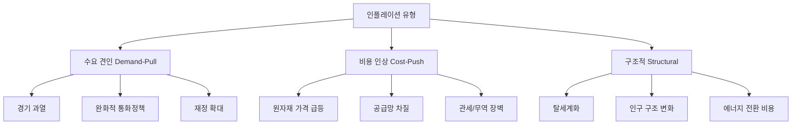
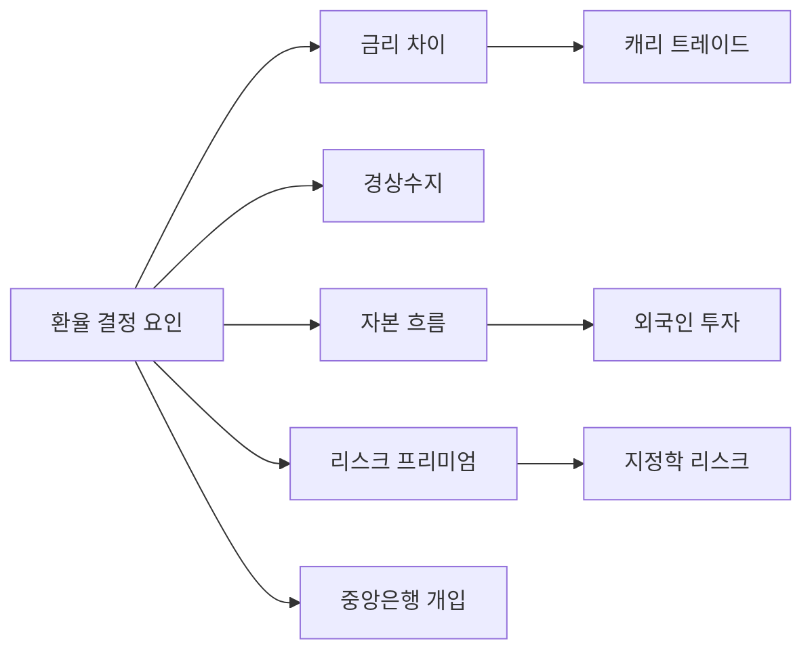
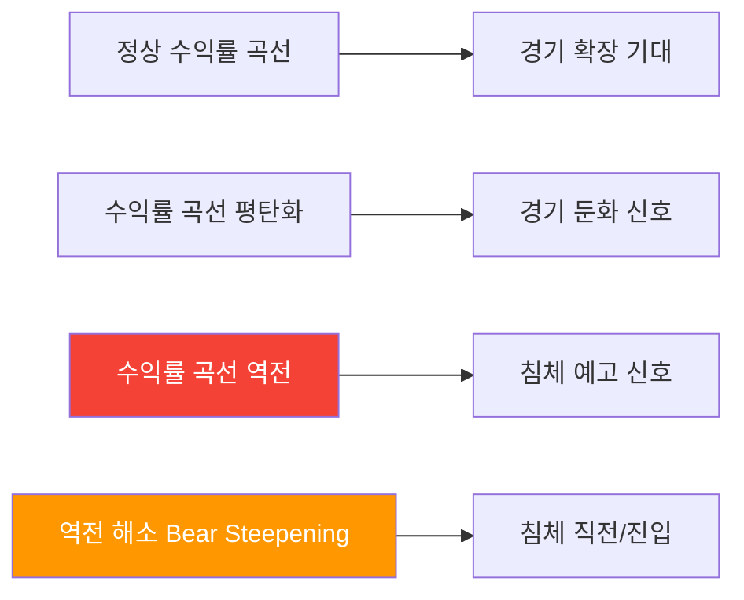
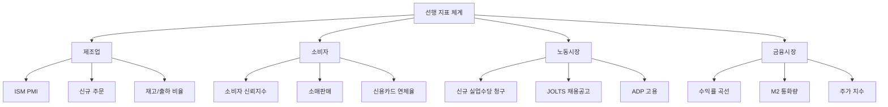
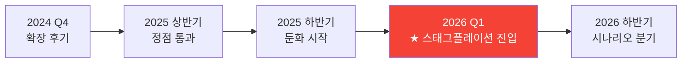

## 개요

거시경제 분석은 투자 판단의 최상위 프레임워크다. 개별 종목이나 섹터 분석 이전에 **"지금 경제가 어느 국면에 있는가"**를 파악해야 한다. 이 문서는 경기 사이클, 금리, 인플레이션, 환율, 채권 시장을 체계적으로 분석하기 위한 프레임워크를 정리한다.

---

## 1. 경기 사이클(Business Cycle) 분석

### 1.1 4단계 경기 사이클 모델

경기는 **확장(Expansion) → 정점(Peak) → 수축(Contraction) → 저점(Trough)**의 반복 패턴을 따른다.

### 1.2 각 국면별 특성과 자산 배분

| 국면 | GDP | 인플레이션 | 금리 방향 | 유리한 자산 | 불리한 자산 |
|------|-----|-----------|----------|-----------|-----------|
| **초기 확장** | 회복 시작 | 낮음 | 인하/저점 유지 | 성장주, 소형주, 하이일드 채권 | 금, 현금, 방어주 |
| **중기 확장** | 견조한 성장 | 점진적 상승 | 점진적 인상 | 대형 가치주, 산업재, 원자재 | 장기채, 유틸리티 |
| **후기 확장/정점** | 성장 둔화 | 높음 | 고점 근처 | 원자재, 에너지, 단기채, 금 | 성장주, 부동산 |
| **수축/침체** | 마이너스 | 하락 시작 | 인하 전환 | 장기 국채, 현금, 방어주, 금 | 경기 민감주, 하이일드 |

### 1.3 현재 위치 판단 체크리스트

---

## 2. 금리 사이클 분석

### 2.1 중앙은행 금리 정책 프레임워크

중앙은행은 **테일러 룰(Taylor Rule)**에 기반해 금리를 결정한다.

**테일러 룰 공식:**
> 적정 금리 = 중립 금리 + 0.5 × (실제 인플레이션 - 목표 인플레이션) + 0.5 × (실제 GDP - 잠재 GDP)

### 2.2 주요 중앙은행 현황 (2026년 3월 기준)

| 중앙은행 | 현재 금리 | 방향 | 다음 회의 | 전망 |
|---------|----------|------|----------|------|
| **Fed (미국)** | 3.50~3.75% | 동결 | 3/18 FOMC | 95% 확률 동결 예상 |
| **ECB (유럽)** | 2.75% | 인하 사이클 | 4월 | 추가 인하 가능 |
| **BOJ (일본)** | 0.50% | 인상 사이클 | 3월 | 점진적 정상화 |
| **BOK (한국)** | 2.50% | 동결 | 4월 | 5회 연속 동결 |
| **PBOC (중국)** | 3.10% (1Y LPR) | 완화 | 수시 | 경기 부양 기조 |

### 2.3 금리 사이클과 자산 가격 관계

### 2.4 실질 금리와 투자 판단

**실질 금리 = 명목 금리 - 기대 인플레이션**

| 실질 금리 | 의미 | 투자 시사점 |
|----------|------|-----------|
| **크게 양수 (+2% 이상)** | 긴축적 환경 | 현금/단기채 유리, 위험자산 불리 |
| **소폭 양수 (0~2%)** | 중립적 환경 | 균형 잡힌 포트폴리오 |
| **음수** | 완화적 환경 | 위험자산 유리, 실물자산(금, 부동산) 유리 |

현재 미국 실질 금리: 약 +0.7~0.9% (10년물 국채 4.3% - 기대 인플레 3.0% 내외)

---

## 3. 인플레이션 분석 프레임워크

### 3.1 인플레이션 유형별 분류

### 3.2 스태그플레이션 판단 기준

**스태그플레이션 = 경기 침체(Stagnation) + 인플레이션(Inflation)**

| 지표 | 스태그플레이션 신호 | 2026년 3월 현재 |
|------|------------------|---------------|
| GDP 성장률 | 잠재 성장률 이하 또는 마이너스 | Q4 GDP 1.4% (급락) |
| Core PCE | 3% 이상 지속 | 3.0% (상승 추세) |
| 실업률 | 상승 추세 | 4.4% (상승 중) |
| NFP | 마이너스 또는 극히 낮은 수준 | -9.2만 (쇼크) |
| 유가 | 급등 | Brent $89.44 (+25%) |
| 임금 상승률 | 물가 상승률 이상 | +3.8% YoY |

**현재 판단: 스태그플레이션 시나리오 본격화 중**

### 3.3 인플레이션 헤지 전략

| 자산 | 수요 견인 인플레 | 비용 인상 인플레 | 스태그플레이션 |
|------|---------------|---------------|-------------|
| **금** | 중립 | 양호 | **최적** |
| **원자재** | 양호 | **최적** | 양호 |
| **TIPS** | 양호 | 양호 | 양호 |
| **부동산(REITs)** | 양호 | 중립 | 불리 |
| **가치주** | 양호 | 중립 | 중립 |
| **에너지주** | 양호 | **최적** | 양호 |
| **성장주** | 불리 | 불리 | **매우 불리** |
| **장기 국채** | 불리 | 불리 | 분할 매수 기회 |

---

## 4. 환율 분석 프레임워크

### 4.1 환율 결정 요인

### 4.2 달러 인덱스(DXY) 분석

| DXY 구간 | 의미 | 영향 |
|----------|------|------|
| **110 이상** | 달러 초강세 | 신흥국 위기 경계, 원자재 하락 압력 |
| **100~110** | 달러 강세 | 수출 기업 불리, 달러 자산 유리 |
| **90~100** | 보통 수준 | 균형 상태 |
| **90 이하** | 달러 약세 | 신흥국/원자재 강세, 미국 수출 유리 |

### 4.3 원/달러 환율 분석 포인트

| 요인 | 원화 강세 요인 | 원화 약세 요인 |
|------|-------------|-------------|
| **금리 차** | 한-미 금리차 축소 | 한-미 금리차 확대 |
| **경상수지** | 반도체 수출 호조 | 에너지 수입 급증 |
| **외국인 투자** | 한국 주식 순매수 | 외국인 순매도 |
| **지정학** | 한반도 안정 | 북한 리스크, 중동 불안 |
| **중국 경제** | 중국 경기 회복 | 중국 경기 둔화 |

### 4.4 캐리 트레이드(Carry Trade) 이해

캐리 트레이드는 저금리 통화를 빌려 고금리 통화에 투자하는 전략이다.

**주요 캐리 트레이드 쌍 (2026년 3월):**
- 엔 캐리: JPY(0.50%) → USD(3.50~3.75%), AUD 등
- 위안 캐리: CNY → 고금리 신흥국

**캐리 트레이드 청산 리스크:**
- BOJ 금리 인상 시 엔 캐리 청산 → 글로벌 위험자산 하락
- 2024년 8월 캐리 청산 사태 교훈: VIX 65 기록

---

## 5. 채권 시장 신호 분석

### 5.1 수익률 곡선(Yield Curve) 분석

| 곡선 형태 | 2Y-10Y 스프레드 | 의미 | 투자 시사점 |
|----------|---------------|------|-----------|
| **정상(Normal)** | +100bp 이상 | 건전한 성장 기대 | 위험자산 선호 |
| **평탄(Flat)** | 0~50bp | 불확실성 증가 | 방어적 포지션 강화 |
| **역전(Inverted)** | 음수 | 침체 12~18개월 내 | 장기채 매수, 방어주 |
| **역전 해소(Steepening)** | 음수→양수 전환 | 침체 임박/진행 | 현금 비중 확대 |

### 5.2 크레딧 스프레드

| 스프레드 | 의미 | 현재 수준 |
|---------|------|----------|
| **IG 스프레드 (투자등급)** | 기업 건전성 지표 | ~110bp (정상) |
| **HY 스프레드 (하이일드)** | 부도 리스크 지표 | ~350bp (확대 추세) |
| **TED 스프레드** | 은행 간 신용 리스크 | 안정 |

**크레딧 스프레드 확대 시:** 위험자산 비중 축소, 국채 비중 확대

### 5.3 채권 듀레이션 전략

| 금리 방향 | 추천 듀레이션 | 전략 |
|----------|------------|------|
| **금리 인상기** | 단기(1~3년) | 변동금리 채권, 단기 국채 |
| **금리 고점** | 중기(5~7년) | 분할 매수 시작 |
| **금리 인하기** | 장기(10~30년) | 자본 이득 극대화 |
| **스태그플레이션** | TIPS + 단기채 | 인플레 보호 + 유동성 확보 |

---

## 6. 선행 경제 지표(Leading Indicators) 체계

### 6.1 핵심 선행 지표

### 6.2 ISM PMI 해석 가이드

| PMI 수준 | 의미 | 투자 시사점 |
|---------|------|-----------|
| **55 이상** | 강한 확장 | 경기 민감주 유리 |
| **50~55** | 완만한 확장 | 균형 포트폴리오 |
| **47~50** | 위축 초기 | 방어적 전환 시작 |
| **45 이하** | 심각한 위축 | 침체 대비 필수 |

### 6.3 복합 경기 판단 매트릭스

| 지표 | 확장 신호 | 수축 신호 | 2026.03 현재 |
|------|---------|---------|------------|
| ISM 제조업 PMI | 50 이상 | 50 이하 | 49.8 (위축) |
| ISM 서비스 PMI | 50 이상 | 50 이하 | 52.1 (확장) |
| 소비자 신뢰지수 | 상승 추세 | 하락 추세 | 하락 추세 |
| 신규 실업수당 | 감소 추세 | 증가 추세 | 증가 추세 |
| 수익률 곡선 | 정상 | 역전/해소 | 역전 해소 중 |
| NFP | +15만 이상 | 마이너스 | -9.2만 (쇼크) |

---

## 7. 2026년 3월 종합 판단

### 7.1 현재 경기 사이클 위치

### 7.2 시나리오별 자산 배분 가이드

| 시나리오 | 확률 | 주식 | 채권 | 원자재 | 금 | 현금 |
|---------|------|------|------|-------|---|------|
| **스태그플레이션 심화** | 40% | 20% (방어주) | 20% (TIPS/단기) | 20% | 25% | 15% |
| **연착륙(금리 인하)** | 30% | 45% | 30% (중기) | 10% | 10% | 5% |
| **경기 침체** | 20% | 15% | 40% (장기) | 5% | 25% | 15% |
| **인플레 재점화** | 10% | 25% (에너지/원자재) | 10% (변동금리) | 30% | 25% | 10% |

### 7.3 핵심 모니터링 이벤트

| 일정 | 이벤트 | 중요도 |
|------|--------|--------|
| 3/18 | FOMC 회의 | 최고 |
| 매월 첫째 금요일 | 고용보고서 (NFP) | 최고 |
| 매월 | CPI/PCE 발표 | 높음 |
| 5/15 | 파월 의장 퇴임 | 높음 |
| 수시 | 이란 전쟁 진행 상황 | 최고 |
| 11/10 | 대중국 관세율 재협상 기한 | 높음 |

---

## 핵심 요약

1. **경기 사이클:** 현재 후기 확장~수축 전환기. 스태그플레이션 시나리오 본격화
2. **금리:** Fed 3.50~3.75% 동결 중. 인플레 + 고용 악화로 딜레마 상태
3. **인플레이션:** Core PCE 3.0%, 유가 급등(Brent $89.44)으로 비용 인상 인플레 가중
4. **환율:** 원/달러 1,474~1,477원. 중동 불안 + 미국 고용 쇼크로 변동성 확대
5. **채권:** 수익률 곡선 역전 해소 중(침체 신호). HY 스프레드 확대 추세
6. **투자 전략:** 금/원자재/에너지 비중 확대, TIPS 활용, 성장주 비중 축소, 현금 비중 유지
