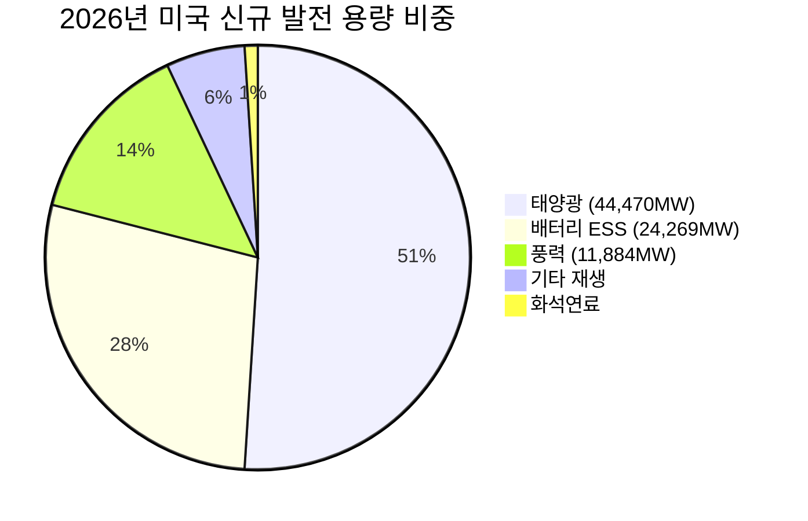
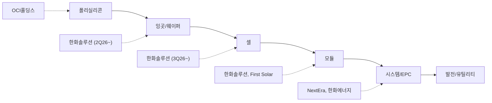
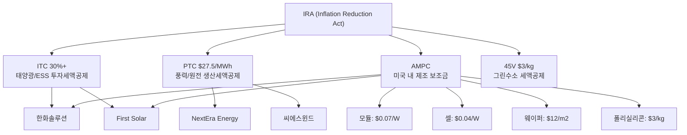
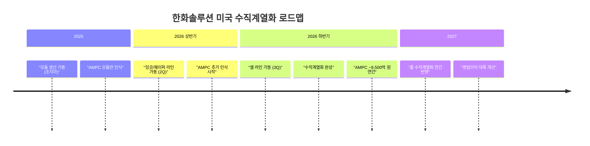
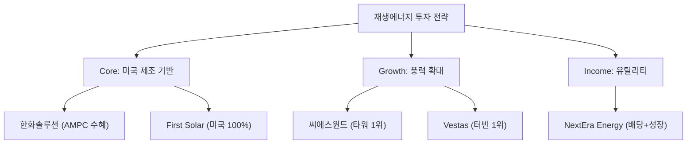

> **시리즈 안내**: [에너지 섹터 종합 전망](/knowledge/invest/2026/03/07/energy-sector-outlook-2026.html) |
> [ESS 상세 분석](/knowledge/invest/2026/03/07/ess-energy-storage-outlook-2026.html) |
> [수소 에너지 상세 분석](/knowledge/invest/2026/03/07/hydrogen-energy-outlook-2026.html) |
> [원전/SMR 상세 분석](/knowledge/invest/2026/01/21/nuclear-power-sector-outlook-2026.html)

---

## 핵심 요약

| 항목 | 내용 |
|------|------|
| **미국 2026 태양광 신규** | 44,470MW (역대 최대, 신규 용량의 51%) |
| **미국 2026 풍력 신규** | 11,884MW (육상 10,369 + 해상 1,515MW) |
| **한화솔루션** | 2026 판매 9GW 목표, AMPC ~9,500억 원 |
| **First Solar** | 미국 유일 대규모 태양광 제조, IRA 최대 수혜 |
| **NextEra Energy** | 세계 최대 풍력/태양광 유틸리티, EPS $3.92~4.02 |
| **핵심 리스크** | 중국 과잉공급, IRA 정책 변동, 금리 |

---

## 글로벌 재생에너지 시장 전망

### 미국: 신규 발전 99%가 재생에너지

EIA(미국에너지정보청)에 따르면, 2026년 미국에 설치될 신규 발전 용량의 **99% 이상**이 태양광, 풍력, 배터리 저장 시스템으로 구성됩니다. 화석연료 신규 발전소는 사실상 전무한 상황입니다.

### 2025년 대비 62% 증가

2026년에는 2025년 대비 **62% 더 많은** 재생에너지 용량이 설치될 예정이며, 이는 IRA 보조금 효과와 AI 데이터센터 전력 수요가 결합된 결과입니다.

| 에너지원 | 2025 실적 | 2026 계획 | 증감 |
|---------|----------|----------|------|
| **태양광** | ~30GW | 44.5GW | +48% |
| **풍력 (육상)** | 6,174MW | 10,369MW | +68% |
| **풍력 (해상)** | ~2GW | 1,515MW | 유지 |
| **ESS** | ~15.5GW | 24,269MW | +57% |

### 글로벌 시장

- **중국**: 2025년 태양광 신규 설치 230GW+로 글로벌 시장의 60% 이상 차지
- **EU**: REPowerEU 정책으로 2030년 재생에너지 45% 목표 상향
- **인도**: 2030년 500GW 재생에너지 목표, 태양광 중심 확대

---

## 태양광 섹터 심층 분석

### 태양광 밸류체인 구조

### 중국 과잉공급 문제

중국의 태양광 모듈 과잉공급은 2026년에도 글로벌 태양광 산업의 최대 리스크입니다.

| 항목 | 내용 |
|------|------|
| **중국 모듈 가격** | $0.10~0.12/W (역대 최저) |
| **과잉 생산 규모** | 연간 생산능력 ~1,000GW vs 글로벌 수요 ~400GW |
| **구조조정** | 중소 업체 도산 가속, 상위 5개사 집중 |
| **미국 관세** | Section 201 + AD/CVD → 중국산 사실상 차단 |
| **수혜 기업** | 미국 내 생산 기반 기업 (First Solar, 한화솔루션) |

중국 과잉공급으로 글로벌 ASP(평균판매가격)가 역대 최저 수준이지만, **미국 시장은 관세 장벽 + IRA AMPC로 프리미엄 시장**이 형성되어 있습니다. 따라서 투자 포인트는 **미국 제조 기반 기업**에 집중해야 합니다.

### 페로브스카이트 태양전지: 차세대 기술

기존 실리콘 태양전지의 이론적 효율 한계(~29%)를 넘어서는 차세대 기술로 페로브스카이트가 주목받고 있습니다.

| 기술 | 효율 | 장점 | 단점 | 상용화 |
|------|------|------|------|--------|
| **실리콘 (기존)** | 22~26% | 검증된 기술, 양산 안정 | 효율 한계 | 현재 |
| **페로브스카이트** | 26~33% | 고효율, 저비용, 경량 | 내구성 미검증 | 2027~2028 |
| **탠덤 (Si+Perovskite)** | 30~33% | 최고 효율 | 양산 기술 미성숙 | 2028~2030 |

Oxford PV, Hanwha Q Cells, LONGi 등이 페로브스카이트 상용화를 추진 중이며, 2027~2028년 시범 양산이 예상됩니다.

---

## 풍력 섹터 심층 분석

### 육상풍력 vs 해상풍력

| 항목 | 육상풍력 | 해상풍력 |
|------|---------|---------|
| **2026 미국 신규** | 10,369MW | 1,515MW |
| **LCOE** | $25~50/MWh | $50~100/MWh |
| **성장 동인** | IRA PTC, AI DC 전력 | 동해안 정책, EU 확대 |
| **핵심 기업** | Vestas, GE Vernova | Orsted, Vestas |
| **한국 기업** | 씨에스윈드 (타워) | 씨에스윈드, 두산에너빌리티 |

### 글로벌 풍력 시장

| 지역 | 2025 누적 | 2030 목표 | 주요 정책 |
|------|----------|----------|----------|
| **중국** | ~450GW | 800GW+ | 이중탄소 정책 |
| **EU** | ~260GW | 510GW | REPowerEU |
| **미국** | ~165GW | 250GW+ | IRA PTC |
| **한국** | ~3.2GW | 17.7GW | 해상풍력 중심 |

---

## IRA (Inflation Reduction Act) 수혜 분석

### IRA 핵심 보조금 체계

### IRA 정책 리스크

트럼프 행정부 하에서 IRA 축소 가능성이 있으나, 실질적 폐지는 어렵다는 것이 시장 컨센서스입니다.

| 시나리오 | 확률 | 영향 | 대응 |
|---------|------|------|------|
| **IRA 유지** | 50% | 현재 성장 트렌드 지속 | 기존 전략 유지 |
| **IRA 부분 축소** | 35% | AMPC 축소 가능, PTC/ITC 유지 | 미국 제조 프리미엄 축소 |
| **IRA 대폭 폐지** | 15% | 재생에너지 성장 둔화 | 유럽/아시아 비중 확대 |

**핵심**: 공화당 의원 다수가 IRA 수혜 지역구에 있어, 전면 폐지보다는 부분 조정 가능성이 높습니다. 또한 이미 착공된 프로젝트는 기득권(grandfathering) 보호를 받습니다.

---

## 한국 기업 심층 분석

### 한화솔루션 (009830.KS)

| 항목 | 내용 |
|------|------|
| **사업 구조** | 태양광 모듈 + 케미칼 + 신소재 |
| **미국 전략** | 조지아주 모듈 공장 + 잉곳/웨이퍼(2Q26) + 셀(3Q26) |
| **2026 목표** | 판매량 9GW, AMPC ~9,500억 원 |
| **수직계열화** | 하반기 잉곳→웨이퍼→셀→모듈 완성 |
| **실적 전환** | 1Q26 모듈 판매 +50%, AMPC 2천억 원대, 흑자전환 전망 |
| **시장 평가** | 2026년 "빅 사이클" 진입, 시총 순위 37계단 상승 |

**투자 판단 포인트**:
- 2026 하반기 수직계열화 완성 → AMPC 극대화 (모듈+셀+웨이퍼+잉곳 모두 보조금)
- 중국산 대비 미국 시장 프리미엄 확보
- 리스크: IRA AMPC 축소 시 수익성 타격, 중국 모듈 ASP 하락 영향

### OCI홀딩스 (010060.KS)

| 항목 | 내용 |
|------|------|
| **사업 구조** | 폴리실리콘 + 도시개발 + 투자 |
| **핵심 자회사** | OCI (미국 폴리실리콘), Hanwha Qcells 지분 |
| **투자 포인트** | 미국 폴리실리콘 제조 → IRA AMPC 수혜 |
| **리스크** | 중국 폴리실리콘 가격 $6/kg 이하 폭락 |

### 씨에스윈드 (112610.KS)

| 항목 | 내용 |
|------|------|
| **사업 구조** | 풍력 타워 제조 글로벌 1위 |
| **시장 점유율** | 글로벌 풍력 타워 M/S ~20% |
| **지역 다각화** | 한국, 미국, 유럽, 동남아 생산기지 |
| **투자 포인트** | 글로벌 풍력 설치 확대 + IRA PTC 수혜 |
| **실적 동인** | 미국 풍력 68% 증가 (2025→2026) |
| **리스크** | 풍력 프로젝트 지연, 원자재 비용 |

---

## 글로벌 기업 심층 분석

### First Solar (FSLR, NASDAQ)

| 항목 | 내용 |
|------|------|
| **사업 구조** | 미국 유일 대규모 태양광 모듈 제조사 |
| **기술** | CdTe(카드뮴텔루라이드) 박막 태양전지 |
| **미국 생산** | 오하이오, 앨라배마 등 다수 공장 |
| **IRA 수혜** | AMPC 최대 수혜 (미국 내 100% 제조) |
| **경쟁우위** | 중국 공급망 비의존, 미국 관세 면제 |
| **리스크** | CdTe 기술 한계, 페로브스카이트 등장 |

First Solar는 **미국 내 제조 100%** 기반으로 IRA AMPC를 최대한 활용할 수 있는 유일한 대형 태양광 기업입니다. 중국산 태양광 관세 강화가 지속되는 한, 구조적 수혜가 예상됩니다.

### NextEra Energy (NEE, NYSE)

| 항목 | 내용 |
|------|------|
| **사업 구조** | FPL(플로리다 유틸리티) + NEER(재생에너지) |
| **규모** | 세계 최대 풍력/태양광 발전 사업자 |
| **발전 용량** | ~24,600MW 순 발전 용량 |
| **2026 EPS** | $3.92~4.02 (가이던스 상단 지향) |
| **주가 성과** | YTD +17%, ~$94/주 |
| **20년 연평균 수익률** | 15.7% |
| **투자 포인트** | 안정적 유틸리티 + 재생에너지 성장 |

NextEra의 강점은 **안정적인 유틸리티 수익(FPL)**과 **재생에너지 성장(NEER)**의 결합입니다. AI 데이터센터 전력 PPA 확대가 추가 성장 동력입니다.

### Vestas Wind Systems (VWS, CPH)

| 항목 | 내용 |
|------|------|
| **사업 구조** | 풍력 터빈 세계 1위 제조사 |
| **Q3 2025 매출** | EUR 5.3B |
| **EBIT 마진** | 7.8% (개선 추세) |
| **수주 잔고** | EUR 31.6B (다년간 매출 가시성) |
| **Q3 수주량** | 4.6GW |
| **서비스 사업** | 설치 기반 확대 → 장기 서비스 계약 |
| **투자 포인트** | 수주잔고 기반 안정 성장, 마진 개선 |

---

## 재생에너지 ETF 투자 대안

개별 종목 리스크를 분산하고 싶다면 ETF를 통한 접근도 유효합니다.

| ETF | 티커 | 초점 | 비용 | 주요 보유 |
|-----|------|------|------|----------|
| **iShares Global Clean Energy** | ICLN | 글로벌 청정에너지 | 0.40% | 다양한 재생에너지 |
| **Invesco Solar** | TAN | 태양광 | 0.67% | Enphase, First Solar |
| **First Trust Global Wind** | FAN | 풍력 | 0.60% | Vestas, Orsted |
| **TIGER 신재생에너지** | 365780 | 한국 재생에너지 | 0.50% | 한화솔루션, 씨에스윈드 |

---

## 투자 전략 및 리스크 관리

### 추천 투자 전략

### 진입 시점 판단

| 신호 | 의미 | 행동 |
|------|------|------|
| IRA AMPC 확정 유지 | 한화솔루션/First Solar 실적 확보 | 비중 확대 |
| 중국 모듈 가격 반등 | 업계 구조조정 완료 | 업종 전체 매수 |
| 미국 풍력 PTC 연장 | 풍력 장기 성장 확인 | 씨에스윈드/Vestas |
| 금리 인하 시작 | 유틸리티/재생에너지 밸류에이션 상승 | NextEra 비중 확대 |
| 한화솔루션 1Q26 흑자전환 | 수직계열화 효과 검증 | 추가 매수 |

### 핵심 리스크

| 리스크 | 발생 확률 | 영향도 | 대응 |
|--------|---------|--------|------|
| **IRA AMPC 축소** | 중 (35%) | 높음 | First Solar(미국 100%) 비중 유지 |
| **중국 과잉공급 심화** | 높음 (70%) | 중간 | 미국 시장 중심 기업 집중 |
| **금리 고수준 지속** | 중 (40%) | 중간 | 현금흐름 양호 기업 선호 |
| **페로브스카이트 상용화** | 낮음 (15%) | 장기 높음 | 기술 전환 모니터링 |
| **무역분쟁 심화** | 중 (40%) | 중간 | 공급망 다각화 기업 |

---

## 결론

2026년 재생에너지 섹터는 **미국 역대 최대 설치 + IRA 보조금 + AI 전력 수요**라는 삼중 호재가 작동하고 있습니다. 다만 **중국 과잉공급**과 **IRA 정책 변동** 리스크를 감안해, 투자 대상은 **미국 내 제조 기반 기업**에 집중하는 것이 바람직합니다.

**최우선 종목**: 한화솔루션 (미국 수직계열화 완성), First Solar (미국 100% 제조)
**안정 성장**: NextEra Energy (유틸리티 + 재생에너지), Vestas (풍력 터빈 1위)
**성장 테마**: 씨에스윈드 (글로벌 풍력 타워 1위), OCI홀딩스 (폴리실리콘)

특히 한화솔루션은 2026년 하반기 수직계열화 완성으로 **AMPC ~9,500억 원**이라는 구체적 실적 촉매가 있어, 1Q26 흑자전환 확인 후 적극적 접근이 유효합니다.
