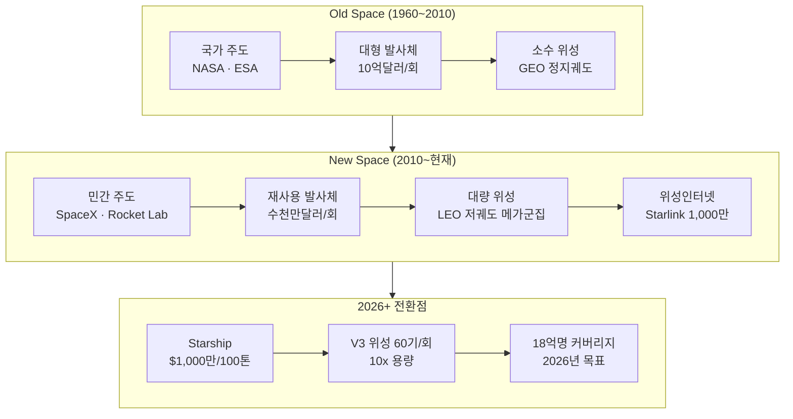
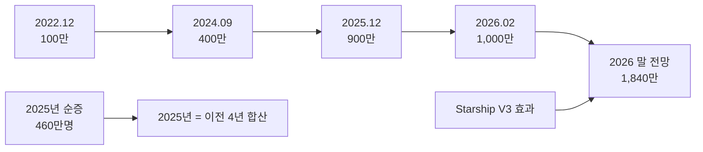
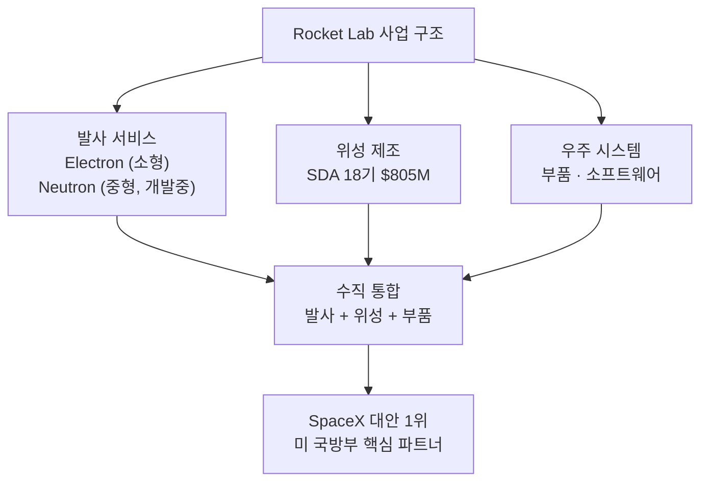
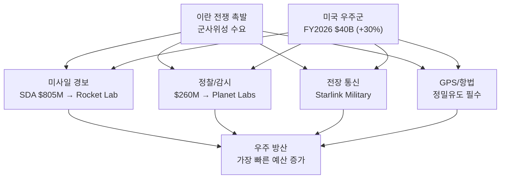
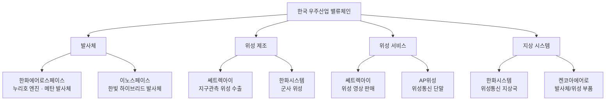
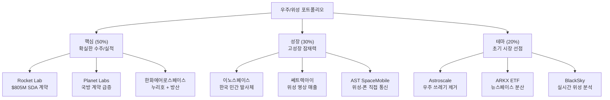

> **관련 글**: [방산/우주 섹터 종합 전망](/knowledge/invest/2026/03/07/defense-space-sector-outlook-2026.html) | [드론/UAM 투자 전망](/knowledge/invest/2026/03/07/drone-uam-outlook-2026.html) | [방산 섹터 상세](/knowledge/invest/2026/01/21/defense-sector-outlook-2026.html)

---

## 핵심 요약 (2026년 3월 7일 기준)

| 항목 | 내용 |
|------|------|
| **Starlink 가입자** | **1,000만명** (2026.2), 2025년만 460만명 순증, 2026년 1,840만 전망 |
| **Starship V3 위성** | 발사당 60기, 용량 10x, 2026년 배치 시작 |
| **미국 우주군 예산** | **$40B** (FY2026, +30%) — 역대 최대 |
| **Rocket Lab** | $805M 미 SDA 계약 (미사일 경보위성 18기) |
| **Planet Labs** | $260M 독일 국방 계약, 수주잔고 +245% |
| **한국 우주 R&D** | **1조 1,605억원** (2026년) — 우주청 예산 1조 시대 |
| **누리호 5차 발사** | 2026년 8월 예정 — 초소형 군집위성 5기 |
| **우주 쓰레기 시장** | **$1.4B** (2026년), Astroscale ELSA-M 2026 발사 |

---

## 1. 뉴스페이스 혁명 — 왜 2026년이 티핑포인트인가

### 1-1. 우주 경제의 패러다임 전환

우주 산업은 **국가 주도(Old Space)에서 민간 주도(New Space)로** 패러다임이 완전히 전환되었습니다. 2026년은 이 전환이 **상업적 수익으로 입증**되는 원년입니다.

### 1-2. 2026년 핵심 지표

| 지표 | Old Space (2010) | New Space (2020) | **2026년** |
|------|-----------------|------------------|-----------|
| **발사 비용/kg** | $54,500 (STS) | $2,720 (F9) | **~$200** (Starship 목표) |
| **연간 발사 횟수** | ~74회 | ~114회 | **300회+** (SpaceX만 ~150회) |
| **LEO 위성 수** | ~800기 | ~3,000기 | **7,000기+** (Starlink만) |
| **위성인터넷 가입자** | 0 | ~100만 | **1,000만+** (Starlink) |
| **우주 경제 규모** | ~$270B | ~$370B | **$550B+** 전망 |

---

## 2. Starlink — 위성인터넷의 상업적 성공

### 2-1. 가입자 성장 추이

Starlink은 **우주 산업 역사상 가장 빠르게 성장하는 위성 서비스**입니다.

| 시기 | 가입자 수 | 비고 |
|------|----------|------|
| 2022.12 | 100만명 | 첫 100만 달성 |
| 2023.09 | 200만명 | +100만 (9개월) |
| 2024.05 | 300만명 | +100만 (8개월) |
| 2024.09 | 400만명 | +100만 (4개월) — 가속 |
| 2025.06 | 600만명 | +200만 (9개월) |
| 2025.12 | **900만명** | +300만 (6개월) — 급가속 |
| **2026.02** | **1,000만명** | +100만 (2개월) |
| 2026년말 전망 | **1,840만명** | +840만 전망 |

### 2-2. Starship이 바꾸는 게임

2026년부터 SpaceX는 **Starship을 이용한 V3 위성 배치**를 시작합니다.

| 항목 | Falcon 9 + V2 Mini | **Starship + V3** | 개선 |
|------|--------------------|--------------------|------|
| **위성/회** | 23기 | **60기** | 2.6x |
| **다운링크 용량** | 기준 | **10x** | 10x |
| **업링크 용량** | 기준 | **24x** | 24x |
| **발사당 네트워크 추가** | ~3 Tbps | **~60 Tbps** | 20x |
| **발사 비용** | ~$67M | ~**$10M** (목표) | 6~7x 절감 |

> Starship V3 위성의 배치는 Starlink의 서비스 품질을 **근본적으로 변화**시킵니다. 다운링크 10배, 업링크 24배 향상은 기존 광대역 인터넷에 준하는 서비스를 전 세계에 제공할 수 있게 만듭니다.

### 2-3. SpaceX 투자 방법

SpaceX는 비상장 기업이므로 직접 투자가 어렵지만, 간접 투자 경로가 있습니다.

| 방법 | 내용 | 접근성 |
|------|------|--------|
| **2차 시장** | Forge Global, EquityZen 등에서 SpaceX 주식 거래 | 미국 적격 투자자 한정 |
| **SpaceX ETF** | Roundhill, Tuttle Capital 등 SpaceX 편입 ETF | 일반 투자자 가능 |
| **IPO 대기** | 2026년 말 또는 2027년 IPO 가능성 논의 중 | 미확정 |
| **수혜주 투자** | SpaceX 공급망 기업 (예: Rocket Lab, Planet Labs) | 일반 투자자 가능 |

---

## 3. 발사체 시장 — SpaceX를 넘어

### 3-1. 글로벌 발사체 경쟁 구도

| 기업/프로그램 | 국가 | 발사체 | 현황 (2026) |
|-------------|------|--------|------------|
| **SpaceX** | 미국 | Falcon 9, Starship | 시장 점유율 60%+, Starship 상용화 |
| **Rocket Lab** | 미국/뉴질랜드 | Electron, Neutron | $805M 미 SDA 계약, 중형 발사체 Neutron 개발 |
| **Blue Origin** | 미국 | New Glenn | 2025년 첫 발사 성공, 상용 발사 시작 |
| **ULA** | 미국 | Vulcan Centaur | 미 국방부 발사 계약 수행 |
| **Arianespace** | 유럽 | Ariane 6 | 2024년 첫 발사, 유럽 자체 발사 역량 확보 |
| **이노스페이스** | 한국 | 한빛 | 2023년 시험 발사 성공, 소형 발사체 상용화 추진 |
| **KARI/한화** | 한국 | 누리호 | 5차 발사 2026.8 예정, 메탄 재사용 발사체 개발 |

### 3-2. Rocket Lab — SpaceX의 가장 강력한 대안

Rocket Lab은 **"SpaceX의 프리미어 대안"**으로 평가받으며, 2025년 이후 주가가 174% 상승했습니다.

| 항목 | 내용 |
|------|------|
| **SDA 계약** | **$805M** — 미사일 경보/추적 위성 18기 제작 (2025.12) |
| **주가 성과** | 2025년 +174%, 2026년 YTD +30% |
| **Electron** | 소형 발사체, 50회+ 발사 성공, 재사용 시도 |
| **Neutron** | 중형 발사체 개발 중, Falcon 9 경쟁자 |
| **위성 제조** | 발사뿐 아니라 위성 제조까지 수직 통합 |

### 3-3. 발사체 투자 종목

| 종목 | 티커 | 핵심 포인트 | 밸류에이션 | 리스크 |
|------|------|------------|----------|--------|
| **Rocket Lab** | RKLB | $805M SDA, Neutron 개발, +174%(2025) | 매우 높음 (PSR 30x+) | Neutron 지연 시 조정 |
| **이노스페이스** | 462350 | 국내 유일 상장 발사체, 한빛 TLV 성공 | 적자 기업, 밸류에이션 불확실 | 상용 발사 실적 부족 |

---

## 4. 위성 서비스 — 국방 수요가 이끄는 성장

### 4-1. Planet Labs — 위성 영상의 국방화

Planet Labs는 지구 관측 위성 전문 기업에서 **사실상 국방 계약업체**로 진화했습니다.

| 항목 | 내용 |
|------|------|
| **독일 국방 계약** | **$260M** (2025.7) — 유럽 방위/안보 위성 서비스 |
| **수주잔고** | **+245% YoY** — 국방/정보 기관 계약 급증 |
| **주가 성과** | 1년간 **+402%** 상승 |
| **위성 수** | 200기+ Dove 위성 군집 운영 |
| **핵심 가치** | 매일 전 지구 영상 촬영 → 군사 정보 분석 |

### 4-2. 쎄트렉아이 — 한국 위성 영상의 가능성

| 항목 | 내용 |
|------|------|
| **핵심 역량** | 위성 시스템 수출 + 고해상도 지구관측 영상 |
| **2026년 전망** | 자체 위성 운용 본격화 → 고품질 영상 판매 매출 급증 기대 |
| **시장 환경** | 이란 전쟁으로 군사 위성 영상 수요 급증 |
| **투자 포인트** | 위성 수출 + 영상 서비스의 이중 수익 구조 |
| **리스크** | 위성 운용 성공 여부에 크게 의존 |

### 4-3. 군사 위성 수요 급증

이란 전쟁은 **군사 위성 수요를 폭발적으로 증가**시켰습니다.

| 수요 분야 | 내용 | 관련 기업 |
|----------|------|----------|
| **미사일 경보위성** | 탄도미사일/드론 조기 경보 | Rocket Lab (SDA $805M) |
| **정찰/감시 위성** | 이란 군사 시설 실시간 모니터링 | Planet Labs ($260M 독일) |
| **통신 위성** | 전장 통신, 군용 데이터 링크 | Starlink Military |
| **GPS/항법 위성** | 정밀 유도 무기, 드론 항법 | 미 우주군 GPS III |
| **우주 상황 인식** | 적국 위성 추적, 우주 쓰레기 | LeoLabs, Astroscale |

---

## 5. 한국 우주 산업 — 1조 시대의 개막

### 5-1. 2026년 한국 우주 예산

| 항목 | 금액 | 비고 |
|------|------|------|
| **우주 R&D 총액** | **1조 1,605억원** | 우주항공청 예산 1조 시대 |
| **누리호 5차 발사** | 2026년 8월 예정 | 초소형 군집위성 5기 탑재 |
| **차세대 발사체** | 메탄 기반 재사용 발사체 | 개발 사업 본격 착수 |
| **달 탐사** | 달착륙선 개발 | 본격화 |
| **군사 위성** | 정찰위성 추가 배치 | 북한 감시 강화 |

### 5-2. 한국 우주 관련 기업

| 기업 | 역할 | 2026년 투자 포인트 |
|------|------|-------------------|
| **한화에어로스페이스** | 누리호 엔진 제작, 차세대 메탄 발사체 | 방산 + 우주 이중 성장 동력 |
| **이노스페이스** | 한빛 하이브리드 발사체 | 국내 유일 상장 민간 발사체 기업 |
| **쎄트렉아이** | 위성 시스템 수출 + 영상 서비스 | 2026년 자체 위성 영상 매출 본격화 |
| **한화시스템** | 위성통신, 군사위성 | 방산 + 위성 + UAM 복합 성장 |
| **AP위성** | 위성통신 단말 | 소형주, 위성통신 테마 |
| **켄코아에어로스페이스** | 발사체/위성 부품 | 소형주, 우주 산업 밸류체인 |

### 5-3. 누리호 5차 발사의 의미

| 항목 | 내용 |
|------|------|
| **발사 일정** | 2026년 8월 예정 |
| **탑재체** | 초소형 군집위성 5기 (부탑재위성 공모 완료) |
| **의미** | 한국 독자 발사 역량의 연속 입증 |
| **향후 계획** | 2027년까지 연 1회 발사, 차세대 메탄 발사체 전환 |
| **수혜 기업** | 한화에어로스페이스 (엔진), 이노스페이스 (생태계 확대) |

> **메탄 기반 재사용 발사체**는 한국 우주산업의 다음 도약점입니다. 기존 케로신 기반 대비 환경친화적이고, 재사용 가능성이 높아 장기적으로 발사 비용을 대폭 절감할 수 있습니다.

---

## 6. 우주 쓰레기 — 새롭게 부상하는 투자 테마

### 6-1. 우주 쓰레기 현황

LEO(저궤도)에 7,000기+ 위성이 운용되면서 **우주 쓰레기 문제**가 심각해지고 있습니다. Starlink만 향후 42,000기 배치를 계획하고 있어, 우주 쓰레기 관리는 필수 산업으로 부상하고 있습니다.

| 지표 | 수치 |
|------|------|
| **우주 쓰레기 모니터링/제거 시장** | **$1.4B** (2026년) |
| **우주 쓰레기 제거 시장** | $0.2B(2026) → **$0.75B**(2030), CAGR 39.2% |
| **추적 대상 잔해물** | 36,000개+ (10cm 이상) |
| **추적 불가 잔해물** | 1억개+ (1mm~10cm) |
| **충돌 위험** | 연간 수십 건 회피 기동 |

### 6-2. 우주 쓰레기 관련 기업

| 기업 | 국가 | 기술 | 현황 |
|------|------|------|------|
| **Astroscale** | 일본 | 능동 잔해물 제거(ADR) | ELSA-M 2026년 발사 예정, 세계 최초 ADR 미션 성공 |
| **ClearSpace** | 스위스 | ESA 잔해물 제거 미션 | ClearSpace-1 개발 중 |
| **D-Orbit** | 이탈리아 | 위성 라스트마일 배치 | ION 위성 캐리어 상용 서비스 |
| **LeoLabs** | 미국 | 우주 상황 인식(SSA) | 레이더 기반 잔해물 추적 |

---

## 7. 종목별 투자 분석

### 7-1. 해외 종목

| 종목 | 티커 | 시가총액 | 2026년 핵심 포인트 | 투자 의견 |
|------|------|---------|-------------------|----------|
| **Rocket Lab** | RKLB | ~$14B | $805M SDA, Neutron 개발, 수직 통합 | 중장기 유망, 밸류에이션 부담 |
| **Planet Labs** | PL | ~$5B | $260M 독일, 수주잔고 +245%, 1년 +402% | 국방 계약 모멘텀 강력 |
| **AST SpaceMobile** | ASTS | ~$9B | 위성→스마트폰 직접 통신 | 기술 검증 진행 중, 고위험 |
| **Intuitive Machines** | LUNR | ~$3B | NASA 달 탐사 미션 수주 | 테마성, 실적 변동 큼 |
| **BlackSky** | BKSY | ~$1B | 실시간 위성 영상 분석, 국방 계약 | 소형주, 성장 잠재력 |

### 7-2. 국내 종목

| 종목 | 코드 | 핵심 사업 | 투자 포인트 | 리스크 |
|------|------|----------|------------|--------|
| **한화에어로스페이스** | 012450 | 누리호 엔진 + 방산 | 방산 매출 31.8조 + 우주 성장 | 밸류에이션 고평가 |
| **이노스페이스** | 462350 | 한빛 발사체 | 국내 유일 민간 발사체 상장사 | 매출 미미, 상용 실적 부족 |
| **쎄트렉아이** | 099320 | 위성 수출 + 영상 | 2026년 영상 매출 급증 전망 | 위성 운용 리스크 |
| **한화시스템** | 272210 | 위성통신 + 방산 | 4축 성장(방산/위성/UAM/AI) | Overair 리스크 |
| **AP위성** | 211270 | 위성통신 단말 | 위성통신 시장 확대 수혜 | 소형주 변동성 |

### 7-3. 우주 관련 ETF

| ETF | 티커 | 핵심 구성 | 비고 |
|-----|------|----------|------|
| **ARK Space Exploration** | ARKX | Rocket Lab, Trimble, Kratos | 뉴스페이스 테마 |
| **Procure Space** | UFO | Boeing, Lockheed, Rocket Lab | Old+New Space 혼합 |
| **SPDR Kensho Final Frontiers** | ROKT | 우주+딥씨 기술 | 우주 탐사 집중 |

---

## 8. 투자 전략 — 어디에 베팅할 것인가

### 8-1. 확실성 기준 투자 매트릭스

| 세부 섹터 | 수익 확실성 | 성장성 | 밸류에이션 | 종합 매력도 |
|----------|-----------|--------|----------|-----------|
| **우주 방산** (위성 경보/정찰) | ★★★★★ | ★★★★ | ★★★ | **최우선** |
| **위성 인터넷** (Starlink) | ★★★★ | ★★★★★ | 비상장 | **간접 투자** |
| **발사체** | ★★★ | ★★★★★ | ★★ (고평가) | **중장기** |
| **위성 영상** | ★★★★ | ★★★★ | ★★★ | **유망** |
| **우주 쓰레기** | ★★ | ★★★★★ | ★★★★ | **초기 테마** |

### 8-2. 포트폴리오 구성 제안

---

## 9. 리스크 요인

| 리스크 | 영향 | 확률 |
|--------|------|------|
| **발사 실패** | Rocket Lab/이노스페이스 주가 급락, 위성 배치 지연 | 중간 |
| **Starship 지연** | V3 위성 배치 지연, Starlink 성장 둔화 | 낮음~중간 |
| **지정학적 변화** | 이란 전쟁 종전 시 군사위성 수요 일시 감소 | 중간 |
| **밸류에이션 조정** | 우주주 대부분 PSR 30x+, 조정 위험 | 높음 |
| **규제 강화** | 우주 쓰레기 규제, 주파수 할당 분쟁 | 낮음 |
| **기술 리스크** | 위성 고장, 재진입 실패, 궤도 문제 | 중간 |

---

## 10. 결론 — 뉴스페이스 혁명의 수혜자를 찾아라

2026년 우주/위성 섹터는 **세 가지 동인이 동시에 가속화**되는 역사적 국면입니다.

### 핵심 투자 논거

1. **Starlink 1,000만 가입자** → 위성 인터넷의 상업적 성공이 입증됨. V3 위성 배치로 서비스 품질 10배 향상 예정
2. **미국 우주군 $40B (+30%)** → 군사 위성 수요 폭발. Rocket Lab($805M), Planet Labs($260M) 대규모 국방 계약
3. **한국 우주 예산 1조 시대** → 누리호 5차 발사, 메탄 재사용 발사체, 이노스페이스/쎄트렉아이 수혜

### 투자 우선순위

| 순위 | 영역 | 이유 | 대표 종목 |
|------|------|------|----------|
| **1** | 우주 방산 | 확정된 국방 예산, 대형 계약 수주 | Rocket Lab, Planet Labs |
| **2** | 한국 우주 | 정부 예산 1조, 누리호 5차, 위성 영상 | 이노스페이스, 쎄트렉아이 |
| **3** | 위성 인터넷 | Starlink 성장 지속, V3 혁신 | SpaceX (간접), AST SpaceMobile |
| **4** | 우주 쓰레기 | 장기 필수 산업, 초기 진입 기회 | Astroscale, ARKX ETF |

> 우주 산업은 **발사 비용의 극적 하락(Starship)이 위성 서비스의 경제성을 근본적으로 바꾸는** 전환점에 있습니다. 이 패러다임 전환의 수혜자 — 대규모 국방 계약을 확보한 Rocket Lab/Planet Labs, 한국 우주 예산 확대의 수혜를 받는 이노스페이스/쎄트렉아이 — 가 2026년 우주/위성 섹터의 핵심 투자 대상입니다.

---

## 11. 관련 포스트

| 섹터 | 포스트 | 핵심 주제 |
|------|--------|----------|
| **종합** | [방산/우주 섹터 종합 전망](/knowledge/invest/2026/03/07/defense-space-sector-outlook-2026.html) | 3개 하위 섹터 비교, 투자 전략 |
| **드론/UAM** | [드론/UAM 투자 전망](/knowledge/invest/2026/03/07/drone-uam-outlook-2026.html) | 이란전쟁 드론 혁명, eVTOL 인증 |
| **방산 상세** | [방산 섹터 상세 전망](/knowledge/invest/2026/01/21/defense-sector-outlook-2026.html) | 천궁-II, EU 재무장, K-방산 |
