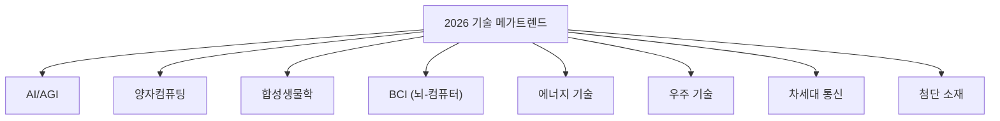
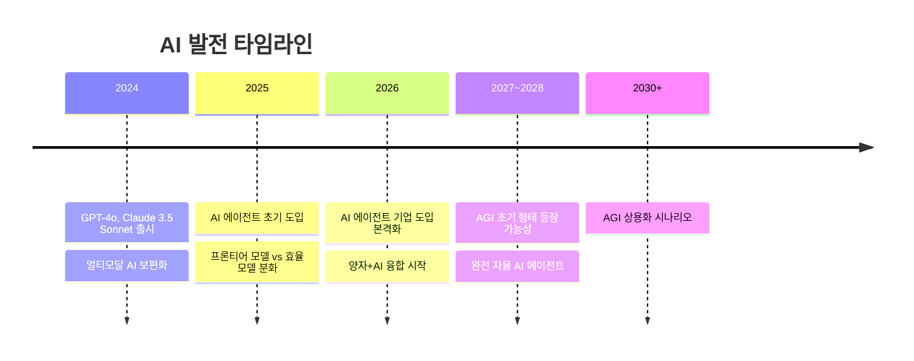
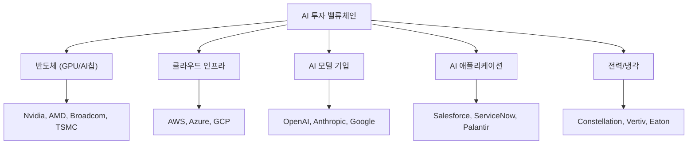
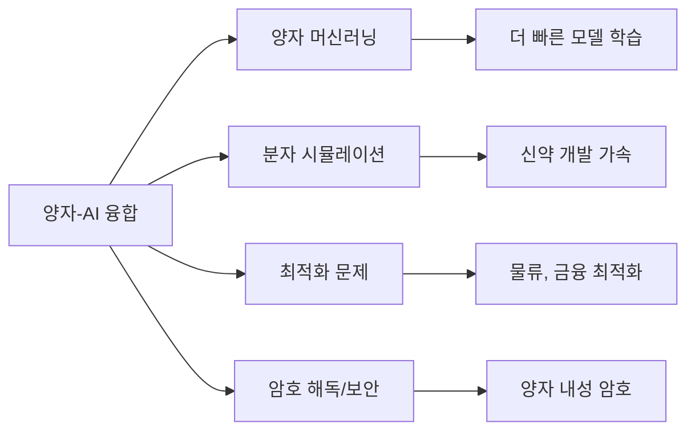
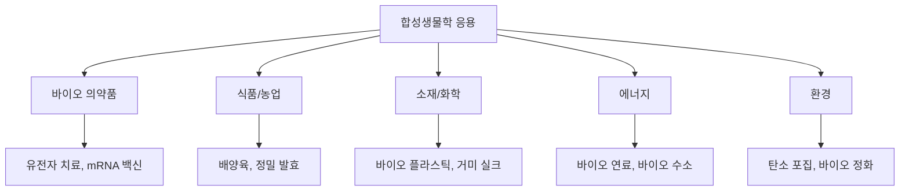
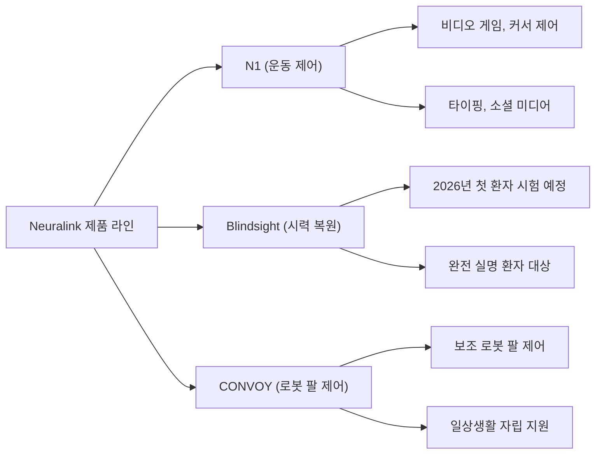
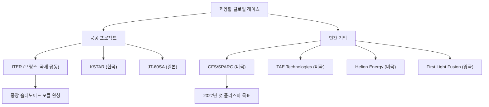
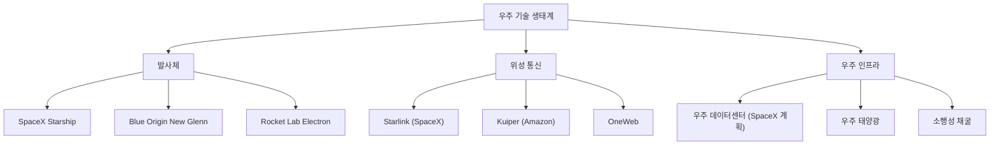
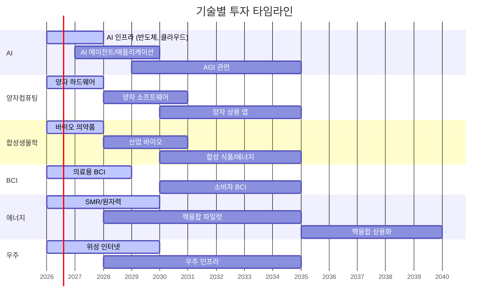

## 개요

2026년은 여러 혁신 기술이 실험실에서 상용화 단계로 넘어가는 전환점이다. AI 에이전트가 기업 업무를 자동화하고, 양자컴퓨터가 최초로 클래식 컴퓨터를 능가하며, 합성생물학이 산업화를 시작하고, 뇌-컴퓨터 인터페이스가 인체에 이식되고 있다. 본 문서는 각 기술의 현황, 상용화 타임라인, 투자 기회를 체계적으로 분석한다.

---

## 1. 인공지능 (AI)

### 1.1 AGI 타임라인

AGI(범용 인공지능)에 대한 전망이 "수십 년"에서 "수 년"으로 좁혀지고 있다.

### 1.2 2026년 AI 핵심 트렌드

| 트렌드 | 설명 | 주요 기업 |
|--------|------|-----------|
| AI 에이전트 | 자율적으로 작업을 수행하는 AI 시스템 | OpenAI, Anthropic, Google |
| 멀티모달 AI | 텍스트+이미지+음성+영상 통합 처리 | Google Gemini, GPT-4o |
| 프론티어 vs 효율 모델 | 대규모 모델과 경량화 모델의 이원화 | Meta Llama, Mistral |
| AI 인프라 | GPU/TPU 수요 폭증, 데이터센터 확장 | Nvidia, AMD, Broadcom |
| AI 규제 | EU AI Act 시행, 미국 행정명령 | 정부/규제기관 |

### 1.3 AI 에이전트 경제

2026년은 "AI 에이전트의 해"로 불린다. 단순 챗봇을 넘어 자율적으로 업무를 수행하는 AI 시스템이 기업에 도입되고 있다.

**AI 에이전트 적용 분야:**
- 소프트웨어 개발: 코드 작성, 리뷰, 디버깅 자동화
- 고객 서비스: 멀티채널 자율 응대
- 데이터 분석: 자동 리포트 생성, 이상 탐지
- 영업/마케팅: 리드 생성, 개인화 캠페인
- 연구개발: 논문 분석, 실험 설계 보조

### 1.4 투자 기회

**투자 타임라인:**
- 단기 (2026): AI 인프라 (반도체, 클라우드, 전력)
- 중기 (2027~2028): AI 애플리케이션, 에이전트 플랫폼
- 장기 (2029+): AGI 관련 기업, AI 규제 수혜

---

## 2. 양자컴퓨팅

### 2.1 2026년: 양자 우위 원년

IBM은 2026년을 양자컴퓨터가 최초로 클래식 컴퓨터를 능가하는 문제를 풀 수 있는 해로 선언했다. "수십 년이 아닌 수 년" 내에 양자컴퓨터가 클래식 컴퓨터가 풀 수 없는 문제를 해결하는 시대가 도래할 것으로 전망된다.

### 2.2 주요 기업별 진행 현황

| 기업 | 방식 | 2026년 현황 | 투자 포인트 |
|------|------|------------|------------|
| IBM | 초전도 큐비트 | 양자 우위 달성 목표 | 하이브리드 양자-클래식 컴퓨팅 |
| Google | 초전도 큐비트 (Willow) | 오류 수정 개선 진행 | DeepMind와 양자-AI 융합 |
| IonQ | 이온 트랩 | Q3 2025 매출 $3,990만 (YoY +222%) | $20억 유상증자 완료 |
| Microsoft | 위상 큐비트 | Azure Quantum 플랫폼 확대 | 클라우드 양자 서비스 |
| Quantinuum | 이온 트랩 | 하니웰 지원으로 안정적 성장 | 기업용 양자 솔루션 |

### 2.3 양자-AI 융합

- 양자-AI 리스크 헤지 플랫폼 시장: 2025년 $30.5억 → 2026년 $39.2억 (CAGR 28.5%)
- Google DeepMind가 Commonwealth Fusion Systems 및 EPFL과 협력하여 양자 플라즈마 제어에 AI 적용

### 2.4 투자 기회

**투자 타임라인:**
- 단기 (2026~2027): 양자컴퓨팅 하드웨어 기업 (IonQ, Rigetti)
- 중기 (2028~2030): 양자 소프트웨어/알고리즘 기업
- 장기 (2030+): 양자 상용 애플리케이션, 양자 내성 암호

**주의사항:**
- 양자컴퓨팅 기업 대부분 적자 상태 → 고위험/고수익
- 실질적 상업 수익 창출까지 3~5년 소요 전망
- ETF(QTUM 등)를 통한 분산 접근 권장

---

## 3. 합성생물학

### 3.1 현황: AI와의 융합으로 산업화 가속

합성생물학은 생물학적 시스템을 설계하고 엔지니어링하여 새로운 물질, 식품, 에너지를 생산하는 기술이다. 2026년에는 AI와의 융합으로 산업화가 가속화되고 있다.

### 3.2 Ginkgo Bioworks: 전략적 전환

Ginkgo Bioworks는 합성생물학의 대표 기업으로, 2026년 3월 대대적인 전략 전환을 단행했다.

**Ginkgo Cloud Lab (2026년 3월 출시):**
- 연구자들이 웹 브라우저를 통해 Ginkgo의 자율 실험실 인프라에 접근
- AI 에이전트 "EstiMate"가 자연어로 작성된 프로토콜의 호환성을 즉시 평가
- 전통적 실험대(bench)를 폐지하고 프로그래밍 가능한 로봇 인프라로 전면 전환
- $60억 이상의 누적 손실 속에서 AI 로봇 판매로 사업 모델 전환

### 3.3 합성생물학 적용 분야

### 3.4 시장 규모와 투자 기회

- 바이오 경제 시장 규모: $4조 (장기 잠재 시장)
- 주요 투자 대상: Ginkgo Bioworks (DNA), Twist Bioscience (TWST), Amyris, Zymergen
- ETF: ARK Genomic Revolution ETF (ARKG)

**투자 타임라인:**
- 단기 (2026~2027): 바이오 의약품 (mRNA, 유전자 치료)
- 중기 (2028~2030): 산업 바이오 (소재, 화학)
- 장기 (2030+): 합성 식품, 바이오 에너지

---

## 4. 뇌-컴퓨터 인터페이스 (BCI)

### 4.1 Neuralink: 대량 생산 시대 개막

2026년은 BCI 기술이 실험실을 벗어나 대량 생산 체제로 전환하는 원년이다.

**Neuralink 현황 (2026년 3월):**
- 12명의 중증 마비 환자에게 임플란트 이식 완료
- 2026년부터 대량 생산(high-volume production) 시작
- 거의 완전 자동화된 수술 절차 도입 (두개골을 열지 않고 경막 관통)
- 환자들이 뇌파만으로 비디오 게임, 인터넷 브라우징, SNS 게시 가능

### 4.2 주요 BCI 기업 비교

| 기업 | 방식 | 침습성 | 2026년 현황 |
|------|------|--------|------------|
| Neuralink | 전극 어레이 (N1) | 침습적 | 12명 이식, 대량 생산 시작 |
| Synchron | 스텐트로드 | 최소 침습 | 혈관 내 삽입, 임상 진행 중 |
| Blackrock Neurotech | 유타 어레이 | 침습적 | 연구용 선두 |
| DARPA N3 | 비침습적 BCI | 비침습 | $1.04억 펀딩, 군사 응용 |

### 4.3 Neuralink Blindsight: 시력 복원

### 4.4 투자 기회

- BCI 대부분 비상장 기업 → 직접 투자 어려움
- 간접 투자 경로: 의료기기 ETF, 신경과학 관련 바이오텍
- 장기적으로 BCI 상용화 시 수혜: 반도체, 의료기기, 소프트웨어
- 윤리적/규제적 리스크가 상당하여 장기적 관점 필요

---

## 5. 에너지 기술: 핵융합

### 5.1 Commonwealth Fusion Systems (CFS): SPARC

핵융합은 "무한 청정 에너지"의 꿈으로, 2026년 가장 큰 진전을 보이고 있다.

**SPARC 프로젝트:**
- 2026년 말까지 건설 거의 완료 예정
- 2027년 최초 플라즈마 에너지 생산 목표
- 총 $30억 이상 투자 유치 (Nvidia, Google 참여)
- CES 2026에서 Siemens, Nvidia와 협력한 디지털 트윈 공개
- AI를 활용한 플라즈마 제어 기술 적용 (DeepMind 협력)

### 5.2 핵융합 글로벌 레이스

### 5.3 투자 기회

- 핵융합 기업 대부분 비상장 → 직접 투자 제한적
- 간접 투자: 핵융합 소재/부품 기업, 초전도 기술 기업
- 원자력/SMR ETF를 통한 포트폴리오 구성
- 핵융합 상용화 시점: 2030년대 후반~2040년대 (보수적)

---

## 6. 우주 기술

### 6.1 SpaceX Starship과 Starlink

**Starlink 현황 (2026년 3월):**
- 9,422개 이상의 LEO 위성 운용
- 1,000만 가입자 돌파 (2026년 2월)
- 3세대 위성 2026년 상반기 발사 예정

**3세대 Starlink 위성 성능:**

| 지표 | 2세대 | 3세대 | 개선 폭 |
|------|-------|-------|---------|
| 다운링크 용량 | ~100Gbps | 1,000+Gbps | 10배+ |
| 업링크 용량 | ~8Gbps | 200+Gbps | 24배+ |
| Starship 1회 발사 용량 | ~3Tbps | 60Tbps | 20배+ |
| 위성 간 통신 | 부분 적용 | 광학 레이저 표준 | 전면 적용 |

### 6.2 우주 기술 생태계

**우주 데이터센터:**
- 일론 머스크가 Starlink V3 위성 확대와 우주 데이터센터 구축 계획 발표
- AI 시대 컴퓨팅 파워 부족 문제 해결을 위한 우주 기반 인프라 구상

### 6.3 투자 기회

- SpaceX (비상장): 2차 시장(Secondary market)을 통한 지분 거래
- 우주 ETF: ARK Space Exploration (ARKX), Procure Space ETF (UFO)
- 위성 통신 경쟁: Amazon Kuiper 출시로 경쟁 본격화
- 우주 방산: Northrop Grumman, L3Harris Technologies

---

## 7. 6G와 차세대 통신

### 7.1 6G 개발 현황

6G는 2030년 상용화를 목표로 연구개발이 진행 중이다.

| 지표 | 5G | 6G (목표) |
|------|-----|-----------|
| 최대 속도 | 20Gbps | 1Tbps |
| 지연시간 | 1ms | 0.1ms |
| 연결 밀도 | 10^6/km^2 | 10^7/km^2 |
| 주파수 대역 | sub-6GHz, mmWave | THz |
| 핵심 기술 | MIMO, 빔포밍 | AI 네이티브, 감지 통합 |

### 7.2 투자 타임라인

- 단기 (2026~2028): 6G 연구 단계 → 직접 투자 시기상조
- 중기 (2028~2030): 6G 표준화 → 통신장비 기업 주목
- 장기 (2030+): 6G 상용화 → 통신사, 디바이스 기업

---

## 8. 첨단 소재

### 8.1 주목할 소재 기술

| 기술 | 응용 분야 | 성숙도 | 주요 기업 |
|------|-----------|--------|-----------|
| 그래핀 | 전자, 에너지 저장 | 초기 상용화 | Applied Graphene |
| 페로브스카이트 태양전지 | 차세대 태양광 | 파일럿 생산 | Oxford PV |
| 고엔트로피 합금 | 항공, 원자력 | 연구 단계 | 대학/연구소 |
| 바이오 소재 | 포장재, 건축 | 상용화 진행 | Ecovative, Bolt Threads |
| 초전도체 | 에너지, 양자컴퓨팅 | 초기 상용화 | SuperOx, AMSC |

---

## 9. 기술별 투자 타임라인 종합

---

## 10. 종합 투자 전략

### 10.1 기술 성숙도별 포트폴리오 배분

| 성숙도 | 기술 | 투자 비중 (제안) | 리스크 |
|--------|------|----------------|--------|
| 상용화 단계 | AI 인프라, 위성 통신 | 40~50% | 낮음~중간 |
| 초기 상용화 | 양자 하드웨어, 합성생물학 | 20~30% | 중간~높음 |
| 파일럿 단계 | BCI, 핵융합, 6G | 10~20% | 높음 |
| 연구 단계 | AGI, 우주 인프라 | 5~10% | 매우 높음 |

### 10.2 핵심 원칙

1. **밸류체인 투자**: 기술 자체보다 이를 가능케 하는 인프라(반도체, 전력, 소재)에 먼저 투자
2. **단계별 진입**: 기술 성숙도에 따라 단계적으로 비중 조절
3. **분산**: ETF를 활용하여 개별 기업 리스크 분산
4. **장기 시계열**: 혁신 기술은 3~10년 단위로 접근
5. **리스크 관리**: 포트폴리오의 20% 이내로 고위험 기술 투자 제한

---

## 11. 결론

2026년은 AI, 양자컴퓨팅, 합성생물학, BCI, 핵융합 등 다수의 혁신 기술이 동시에 상용화 임계점에 도달하는 역사적 시기이다. 특히 AI는 다른 모든 기술의 발전을 가속화하는 "메타 기술"로서, 양자-AI 융합, AI 기반 신약 개발, AI 플라즈마 제어 등 교차 영역에서 혁신을 주도하고 있다.

투자자는 개별 기술의 하이프 사이클에 휩쓸리지 않고, 밸류체인 분석과 기술 성숙도 평가를 통해 적절한 진입 시점을 판단해야 한다. 현재 시점에서 가장 확실한 투자 기회는 AI 인프라이며, 양자컴퓨팅과 합성생물학은 높은 위험 감수가 가능한 투자자에게 중장기 기회를 제공한다.
