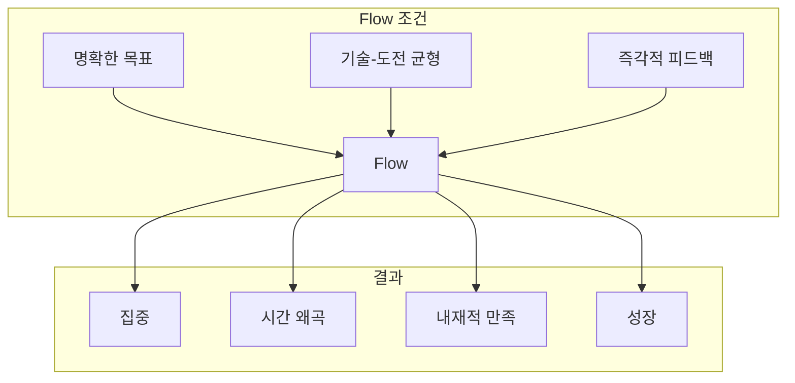
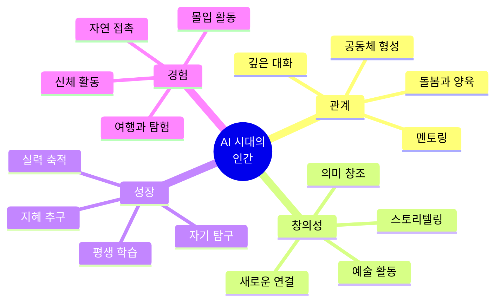

강한 도파민 자극은 내성이 생겨 오래가지 못한다. 처음에는 짜릿했던 것들이 점점 무뎌지고, 더 강한 자극을 찾게 된다. 게임, SNS, 쇼츠, 도박, 과식... 이런 것들의 공통점은 **즉각적 쾌감**에 기반한다는 것이다.

반면, 오래 즐길 수 있는 것들은 "즉각적 쾌감"이 아니라 **"의미·성장·관계"**에 기반한다. 이 글에서는 도파민 내성이 거의 생기지 않거나, 오히려 시간이 갈수록 깊어지는 것들을 정리하고, AI가 모든 것을 대체하는 시대에 인간이 어떤 삶을 살아야 하는지에 대한 방향성을 제시한다.

---

## 도파민과 지속 가능한 만족의 과학

### 도파민 시스템의 이해

도파민은 "쾌락 호르몬"이 아니라 **"동기 호르몬"**이다. 도파민은 보상 그 자체보다 **보상을 예측하고 추구하는 과정**에서 분비된다. 문제는 강한 자극에 반복 노출되면 뇌의 도파민 수용체가 둔감해진다는 것이다.

```
강한 자극 반복
      ↓
도파민 수용체 감소 (내성)
      ↓
같은 자극으로는 만족 불가
      ↓
더 강한 자극 추구
      ↓
악순환
```

### 과학이 말하는 지속 가능한 행복

[심리학 연구](https://pmc.ncbi.nlm.nih.gov/articles/PMC11223451/)에 따르면, 진정한 웰빙 향상은 **일시적인 도파민 디톡스가 아니라 지속 가능한 건강한 습관**에서 온다. [2025년 연구](https://www.sciencefocus.com/science/dopamine-detox-focus-mood)는 스마트폰 인터넷 차단 2주 후 피험자들의 집중력과 웰빙이 향상되었음을 발견했는데, 이는 인터넷 사용 시간 대신 **운동, 야외 활동, 대면 사회화**에 시간을 썼기 때문이었다.

핵심은 이것이다: **뇌는 도파민 디톡스가 아니라 건강한 습관, 균형, 자기 돌봄이 필요하다.**

---

## 도파민 내성 없이 오래 즐길 수 있는 것들

### 1. 실력이 축적되는 활동 (느린 도파민)

보상이 '결과'가 아닌 '과정'에 있는 활동들이다.

| 분야 | 예시 |
|------|------|
| 음악 | 피아노, 기타, 바이올린 |
| 언어 | 외국어 학습, 특히 회화 |
| 표현 | 글쓰기, 에세이, 생각 정리 |
| 기술 | 프로그래밍, 시스템 설계 |
| 예술 | 그림, 드로잉, 캘리그래피 |

**왜 내성이 없는가?**
- 자극 자체는 약하다
- "어제의 나 vs 오늘의 나" 비교에서 만족이 발생한다
- 시간이 지날수록 할 수 있는 것이 늘어난다
- 도파민 + 세로토닌 + 자존감 보상이 함께 온다

### 2. 끝이 없는 사고 활동 (지적 쾌감)

답이 없는 질문들을 탐구하는 활동이다.

- **철학**: 삶, 자유, 행복, 죽음
- **경제·투자**: 시장의 흐름 이해
- **역사**: 과거와 현재의 연결
- **심리학**: 인간 행동의 이해
- **사회 구조**: 시스템의 작동 원리

**왜 내성이 없는가?**
- 매번 새로운 관점이 열린다
- 정답이 없어서 "완료"가 없다
- 나이가 들수록 더 재미있어진다
- "아는 것이 늘수록 세상이 다르게 보이는 즐거움"

### 3. 신체 감각 기반 활동 (도파민 리셋)

자극이 아니라 감각에 집중하는 활동이다.

| 활동 | 효과 |
|------|------|
| 웨이트 트레이닝 | 신체 변화 + 성취감 |
| 러닝 (페이스 조절) | 엔도르핀 + 명상 효과 |
| 요가, 스트레칭 | 신체 인식 + 안정감 |
| 수영 | 전신 감각 활성화 |
| 산책 (이어폰 없이) | 자연 연결 + 사고 정리 |

**왜 내성이 없는가?**
- 도파민 폭발이 아닌 엔도르핀 + 안정감
- 몸이 변하면서 정체성 만족이 발생한다
- 강한 자극 없이도 "오늘 잘 살았다"는 감각

### 4. 관계에서 오는 깊은 만족

즉각적 재미가 아닌 신뢰에 기반한 관계다.

- 한 사람과의 깊은 대화
- 아이와의 상호작용
- 멘토링, 가르치기
- 공동 프로젝트

**왜 내성이 없는가?**
- 관계는 반복할수록 깊어진다
- 기억이 쌓이며 만족이 증가한다
- 도파민보다 옥시토신(유대 호르몬) 중심

### 5. 장기 목표를 가진 삶의 프로젝트

"나는 이런 사람이다"라는 서사(정체성) 자체가 보상이 된다.

- 장기 투자 철학 구축
- 평생 공부 주제 하나 정하기
- 가족·자녀 중심 삶 설계
- 자신만의 원칙 시스템 만들기
- 특정 분야의 전문가 되기

**왜 내성이 없는가?**
- 결과보다 정체성 유지가 만족의 원천
- 자극 소모가 없다
- 인생 후반으로 갈수록 더 강해진다

### 6. 무자극 시간 (역설적 즐거움)

도파민을 '쓰지 않는 법'을 즐기는 것이다.

- 아무것도 안 하고 생각하기
- 지루함을 견디는 훈련
- 하루 30분 무자극 시간
- SNS/쇼츠 완전 차단 시간대

**왜 내성이 없는가?**
- 도파민 민감도가 회복된다
- 작은 것에서도 다시 즐거움이 발생한다

---

## 몰입(Flow)의 힘: 지속 가능한 만족의 핵심

심리학자 [미하이 칙센트미하이](https://positivepsychology.com/theory-psychology-flow/)가 발견한 **몰입 상태(Flow State)**는 지속 가능한 만족의 핵심 메커니즘이다.

### Flow의 특징

| 특징 | 설명 |
|------|------|
| 명확한 목표 | 무엇을 해야 하는지 알고 있음 |
| 즉각적 피드백 | 잘하고 있는지 바로 알 수 있음 |
| 기술-도전 균형 | 너무 쉽지도, 어렵지도 않음 |
| 행동과 의식의 합일 | 생각과 행동이 하나가 됨 |
| 시간 감각 왜곡 | 시간이 빠르게 흐름 |
| 자의식 상실 | 자기 검열이 사라짐 |
| 자기 목적성 | 활동 자체가 보상 |

### Flow가 행복에 미치는 영향

[연구](https://link.springer.com/article/10.1023/B:JOHS.0000035916.27782.e4)에 따르면 몰입을 자주 경험하는 사람들은:
- 더 높은 행복감
- 더 높은 자존감
- 더 높은 삶의 만족도

를 보고한다. [맥킨지의 10년 연구](https://blog.pdainternational.net/en/state-of-flow-the-code-of-intrinsic-motivation-and-high-performance/)에 따르면 최고 경영진들은 몰입 상태에서 평소보다 **5배 더 생산적**이라고 응답했다.

### Flow를 경험하는 조건



> **핵심 통찰**: Flow는 외부 보상 없이도 활동 자체가 보상이 되는 상태다. 이것이 도파민 내성이 생기지 않는 이유다.

---

## 추천하는 하루 패턴

도파민 민감도를 유지하면서 지속 가능한 만족을 경험하는 하루 구조다.

### 아침 (기상 후 2시간): 무자극 + 신체 활성화

```
06:00-08:00
├── 스마트폰 보지 않기 (중요!)
├── 가벼운 스트레칭 or 산책
├── 찬물 세안 or 샤워
├── 하루 의도 설정 (3가지 이하)
└── 영양가 있는 아침식사
```

**이유**: 아침에 도파민을 아끼면 하루 종일 작은 것에서 만족을 느낄 수 있다.

### 오전 (핵심 집중 시간): 깊은 작업

```
08:00-12:00
├── 가장 중요한 일 1가지
├── 90분 집중 + 15분 휴식 사이클
├── 알림 모두 끄기
└── 단일 작업 (멀티태스킹 금지)
```

**이유**: 오전의 도파민과 코르티솔 조합은 집중에 최적화되어 있다.

### 오후: 관계 + 가벼운 작업

```
13:00-18:00
├── 회의, 협업, 커뮤니케이션
├── 루틴한 업무 처리
├── 짧은 산책 (15분)
└── 깊은 대화 1회
```

### 저녁: 회복 + 축적 활동

```
18:00-22:00
├── 운동 (웨이트 or 유산소)
├── 가족/친구와 시간
├── 실력 축적 활동 (악기, 언어, 글쓰기 등)
├── 스마트폰 내려놓기 시간
└── 다음날 준비
```

### 밤: 완전한 휴식

```
22:00-06:00
├── 블루라이트 차단
├── 가벼운 독서 or 명상
├── 7-8시간 수면
└── 스마트폰 침실 밖에 두기
```

---

## 장기적 습관과 인생의 방향성

### 10가지 장기 습관 권장

| 습관 | 주기 | 목적 |
|------|------|------|
| 아침 무자극 시간 | 매일 | 도파민 민감도 유지 |
| 깊은 작업 블록 | 매일 | 몰입 능력 개발 |
| 운동 | 주 3-5회 | 신체 + 정신 건강 |
| 깊은 대화 | 주 2-3회 | 관계 심화 |
| 실력 축적 활동 | 매일 30분+ | 성장 감각 |
| 자연 접촉 | 주 1회+ | 도파민 리셋 |
| 독서/학습 | 매일 | 지적 자극 |
| 글쓰기/생각 정리 | 주 2-3회 | 자기 인식 |
| 디지털 디톡스 | 주 1일 | 민감도 회복 |
| 회고와 계획 | 주 1회 | 방향성 점검 |

### 삶의 방향성을 정하는 질문들

1. **10년 후 어떤 사람이 되고 싶은가?**
2. **죽을 때 후회하지 않으려면 무엇을 해야 하는가?**
3. **나만이 할 수 있는 것은 무엇인가?**
4. **돈이 필요 없다면 무엇을 하고 싶은가?**
5. **누구와 시간을 보내고 싶은가?**

---

## AI 시대, 인간은 무엇으로 살아야 하는가?

### 변화하는 노동의 풍경

[세계경제포럼](https://www.pwc.com/kr/ko/insights/issue-brief/ai-jobs-future.html)에 따르면 향후 5년간 9,200만 개의 일자리가 사라지지만, 1억 7천만 개의 새로운 일자리가 창출될 것으로 전망된다. [가트너](https://www.incheontoday.com/news/articleView.html?idxno=301688)는 2026년까지 글로벌 콜센터 업무의 10% 이상이 AI 챗봇으로 대체될 것이라고 예측했다.

```
사라지는 일자리              새로 생기는 일자리
├── 단순 사무직              ├── AI 휴먼 레이어
├── 텔레마케팅              ├── 프롬프트 엔지니어
├── 데이터 입력             ├── AI 윤리 전문가
├── 단순 제조업             └── 창의적 협업 역할
└── 회계 감사
```

### AI가 대체하기 어려운 인간의 영역

[아시아경제](https://www.asiae.co.kr/article/2026010210290642788)의 분석에 따르면, AI가 효율과 속도를 담당한다면 인간은 **복잡성과 맥락의 영역**으로 이동한다.

| AI가 잘하는 것 | 인간이 잘하는 것 |
|--------------|----------------|
| 패턴 인식 | 맥락 이해 |
| 데이터 처리 | 의미 부여 |
| 반복 작업 | 창의적 연결 |
| 최적화 | 윤리적 판단 |
| 예측 | 공감과 돌봄 |
| 속도 | 깊이 |

### Post-Work Society: 노동 이후의 삶

[철학자들](https://plato.stanford.edu/entries/work-labor/)은 AI 자동화 시대에 대해 다양한 관점을 제시한다:

**아리스토텔레스의 관점**
> "인간은 노동이 아니라 여가에서 온전한 잠재력을 실현한다."

AI가 노동을 자동화하면, 이는 인간을 해방시켜 **본질적으로 의미 있는 활동**을 추구하게 할 수 있다.

**케인즈의 예측 (1930년)**
> "21세기 초에는 기술 발전으로 주 15시간만 일하는 '여가와 풍요의 시대'가 올 것이다."

아직 실현되지 않았지만, AI 시대에 다시 주목받고 있다.

**앙드레 고르(André Gorz)**
> "노동 시간 감소는 더 충만하고 평등한 사회로 이어질 수 있다. 생산성과 효율성 대신 창의성, 웰빙, 사회적 연결에 초점을 맞춘 사회."

### AI 시대에 인간이 집중해야 할 것들



#### 1. 관계의 깊이

AI는 정보를 제공하지만, **신뢰와 유대**는 시간을 들인 인간 관계에서만 형성된다.
- 가족과의 깊은 대화
- 공동체 활동
- 세대 간 지혜 전수
- 함께하는 경험

#### 2. 창의적 표현

AI가 콘텐츠를 생성할 수 있지만, **인간의 고유한 관점과 경험에서 나오는 표현**은 대체 불가능하다.
- 예술 활동 (음악, 미술, 글쓰기)
- 자신만의 스토리 구축
- 새로운 의미의 창조
- 문화의 형성

#### 3. 몸의 경험

AI는 정보 세계에 존재하지만, **신체를 통한 경험**은 인간만의 영역이다.
- 운동과 스포츠
- 자연에서의 시간
- 감각적 즐거움 (음식, 음악, 예술)
- 신체적 도전

#### 4. 의미와 목적

AI는 "어떻게"에 답할 수 있지만, **"왜"에 대한 답**은 인간의 몫이다.
- 개인적 사명 정의
- 가치관 명확화
- 세상에 기여하는 방법 찾기
- 영적/철학적 탐구

#### 5. 판단과 책임

[AI 휴먼 레이어](https://www.asiae.co.kr/article/2026010210290642788)로서 AI의 결과물을 **해석, 검증, 조정하는 역할**이 중요해진다.
- 윤리적 판단
- 맥락에 맞는 적용
- 책임감 있는 의사결정
- 인간 중심 가치 수호

### AI 시대를 위한 삶의 자세

| 기존 패러다임 | 새로운 패러다임 |
|--------------|----------------|
| 효율성 추구 | 의미 추구 |
| 더 많이 일하기 | 더 깊이 살기 |
| 정보 축적 | 지혜 추구 |
| 경쟁 | 협력과 연결 |
| 소비 | 창조와 기여 |
| 바쁨 = 가치 | 여유 = 성숙 |

> [2026년 노동 재설계 보고서](https://v.daum.net/v/20260103104443614?f=p)는 말한다: "기술은 인간의 일을 없애는 것이 아니라, 인간의 일을 다시 정의하고 있다."

---

## 결론: 한 문장 요약

> **오래 즐길 수 있는 것들은 "강한 자극"이 아니라, 시간이 지날수록 나를 바꿔주는 것들이다.**

도파민 내성 없이 평생 즐길 수 있는 것들의 공통점:
1. **과정 자체가 보상**이다
2. **축적**이 된다
3. **관계**를 깊게 한다
4. **의미**를 만든다
5. **성장**을 가져온다

AI 시대에 인간이 추구해야 할 것:
1. **효율이 아닌 깊이**
2. **정보가 아닌 지혜**
3. **경쟁이 아닌 연결**
4. **소비가 아닌 창조**
5. **바쁨이 아닌 충만함**

이것이 "지속 가능한 만족"의 본질이다.

---

## 참고 자료

### 도파민과 행복의 과학
- [A Literature Review on Holistic Well-Being and Dopamine Fasting - PMC](https://pmc.ncbi.nlm.nih.gov/articles/PMC11223451/)
- [Do We Need to Detox From Dopamine? - Psychology Today](https://www.psychologytoday.com/us/blog/addiction-outlook/202502/detoxing-from-dopamine)
- [It's time to change your relationship with dopamine - BBC Science Focus](https://www.sciencefocus.com/science/dopamine-detox-focus-mood)
- [The Neuroscience of Happiness 2026](https://mindlabneuroscience.com/the-neuroscience-of-happiness/)

### 몰입(Flow)과 내재적 동기
- [What Is Flow in Positive Psychology?](https://positivepsychology.com/theory-psychology-flow/)
- [Flow (psychology) - Wikipedia](https://en.wikipedia.org/wiki/Flow_(psychology))
- [State of Flow: The code of intrinsic motivation - PDA](https://blog.pdainternational.net/en/state-of-flow-the-code-of-intrinsic-motivation-and-high-performance/)

### AI 시대와 인간의 역할
- [AI 시대, 사라지는 일자리와 인간의 불안한 미래 - 인천투데이](https://www.incheontoday.com/news/articleView.html?idxno=301688)
- [2026년, AI 이후의 노동은 어떻게 재설계되는가 - 아시아경제](https://www.asiae.co.kr/article/2026010210290642788)
- [AI와 일자리의 미래 - 삼일PwC](https://www.pwc.com/kr/ko/insights/issue-brief/ai-jobs-future.html)

### Post-Work Society와 철학
- [Post-work society - Wikipedia](https://en.wikipedia.org/wiki/Post-work_society)
- [Philosophical Approaches to Work and Labor - Stanford Encyclopedia](https://plato.stanford.edu/entries/work-labor/)
- [Post-Work: The Radical Idea of a World Without Jobs - Green European Journal](https://www.greeneuropeanjournal.eu/post-work-the-radical-idea-of-a-world-without-jobs/)
- [Redefining Work in a Post-Scarcity World - Life.Understood](https://geralddaquila.com/2025/05/28/redefining-work-in-a-post-scarcity-world-a-new-dawn-for-human-purpose-and-connection/)

---

*이 글은 인생의 10가지 질문 중 하나인 "지속 가능한 만족이란 무엇인가?"에 대한 탐구입니다.*
