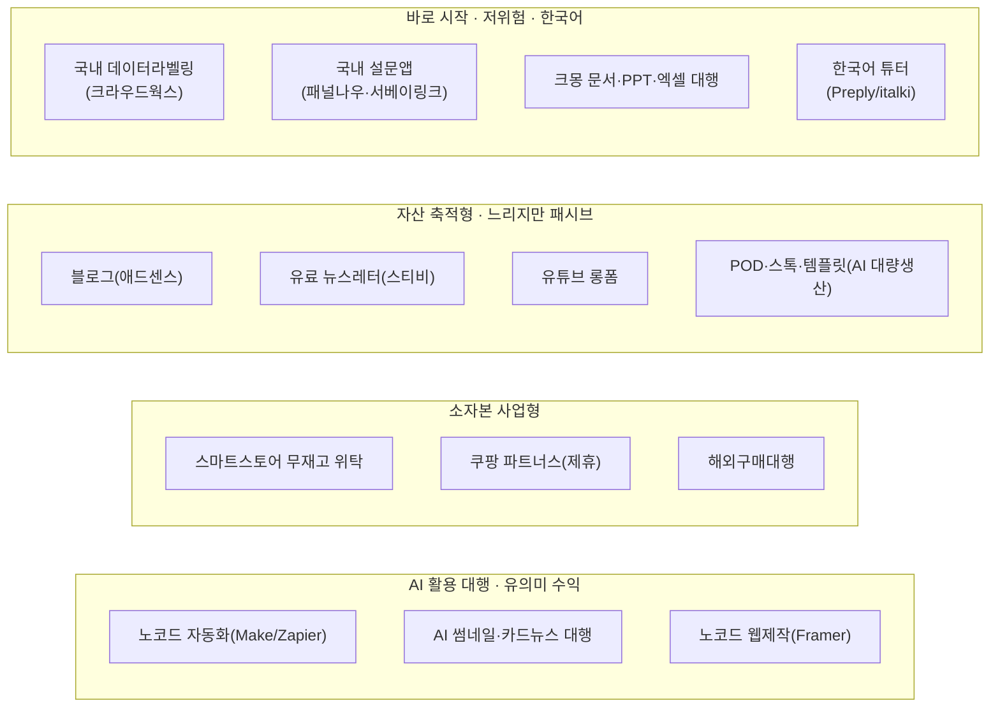

# 40대 온라인 부업 총정리 (2026)

부업을 알아보면 "월 500만원 보장" 같은 광고부터 나옵니다. 대부분은 **강의·전자책을 팔기 위한 미끼**입니다. 이 글은 그런 과장을 걷어내고, **인터넷만 있으면 완전 재택으로 시작할 수 있는 온라인 부업 60여 가지**를 2026년 현행 기준으로 정리했습니다. 실제 가입/판매 페이지가 열리는 것만, 그리고 현실적인 수익 범위까지 솔직하게 담았습니다.

## 이 글이 맞는 독자

- **40대 전후**의 직장인·자영업자 (하지만 대부분 연령 무관하게 적용됩니다)
- **한국 거주**, 필요하면 글로벌 플랫폼도 시도할 의향이 있는 분
- **한국어는 능통하지만 영어는 기초** 수준 (번역기 도움이 필요한 분)
- 소프트웨어·하드웨어를 **기본적으로 두루 다룰 줄 아는** 정도 (전문 개발자는 아님)
- **완전 재택 + 시간 자유**를 원하는 분

> ⚠️ 이 글은 일반 정보이며 투자·재무 조언이 아닙니다. 수익 수치는 후기·공개 자료 기반의 **범위 추정치**로, 개인 편차가 매우 큽니다. 플랫폼 수수료·정산·가입 조건은 자주 바뀌니 착수 직전 공식 페이지에서 재확인하세요.

---

## 읽는 법 — "영어 의존도"가 핵심 변수

온라인 부업에서 한국인이 막히는 지점은 대부분 **"실시간 영어 말하기"** 하나입니다. 이 기준으로 모든 항목에 신호등을 붙였습니다.

- 🟢 **한국어만으로 OK** — 언어 장벽 없음. 1순위 후보.
- 🟡 **비실시간 영어 (AI 번역으로 극복 가능)** — 상품 설명·라벨링 지침·채팅 CS 등 글자 기반이라 ChatGPT·DeepL로 처리 가능. 시간이 조금 더 걸릴 뿐.
- 🔴 **실시간 영어 필요 (진입 어려움)** — 영어 말하기·화상 인터뷰·즉답 영어 CS. 영어가 기초라면 당분간 보류.

핵심은 이겁니다. **글자 기반 해외 일(POD 디자인, 스톡 이미지, 프롬프트 판매, 해외 마켓 상품설명)은 AI 번역으로 충분히 뚫립니다.** 그리고 국내 시장(🟢)만으로도 선택지는 넘칩니다.

---

## 한눈에 보기

### 성향별 추천 (영어 기초 기준)

| 원하는 것 | 1순위 | 2순위 | 3순위 |
|---|---|---|---|
| **당장 소액이라도** | 🟢 국내 데이터라벨링 | 🟢 국내 설문앱 3종 | 🟢 파킹통장 이자 |
| **내 시간에 기술 팔기** | 🟢 크몽(문서·엑셀·PPT) | 🟢 한국어 튜터 | 🟡 Fiverr(번역기 보조) |
| **길게 자산 만들기** | 🟢 블로그+애드센스 | 🟢 유료 뉴스레터 | 🟢 유튜브 롱폼 |
| **AI로 대량 생산** | 🟡 POD(마플샵→해외) | 🟡 스톡 이미지 | 🟡 프롬프트 판매 |
| **소자본 장사** | 🟢 스마트스토어 위탁 | 🟢 쿠팡 파트너스 | 🟢 해외구매대행 |
| **AI 대행 기술 부업** | 🟢 노코드 자동화 | 🟢 AI 썸네일 대행 | 🟢 Framer 웹제작 |

---

## A. AI 데이터 라벨링 / 크라우드워크

AI 학습 데이터를 만들거나 검수하는 일입니다. **국내 플랫폼(🟢)은 진입이 쉽고 원화로 정산**되지만 시급이 낮습니다(초보 시급 4~6천원, 숙련 1만~1.5만원, 월 20~30만원 부수입). 고수익 해외 플랫폼은 대부분 영어 필수라 지금은 후순위입니다.

### 국내 (🟢 한국어 OK) — 여기부터 시작

- **크라우드웍스** — 국내 최대, 일감 최다. [works.crowdworks.kr](https://works.crowdworks.kr/) · 앱 "크라우드웍스". 이미지·음성·텍스트 라벨링/수집. 내일배움카드 교육 이수 시 고단가 프로젝트 접근 가능. 현실 **월 20~30만원**. **난이도 ★★ / 추천 ★★★★**
- **셀렉트스타 캐시미션** — 모바일 앱 "캐시미션". 미션형 수집·라벨링, 포인트 → 현금. **추천 ★★★**
- **에이모(AIMMO)** — [labelers.aimmo.ai](https://labelers.aimmo.ai/). 자율주행 데이터 특화. 프로젝트 오픈이 불규칙("알림받기" 등록 추천). **추천 ★★★**
- **레이블러(Labelr)** — 모바일 UI가 편해 스마트폰 자투리 작업에 적합. **추천 ★★★**
- ⛔ **데이터헌트**는 2024년 폐업했습니다. 오래된 추천글에 보여도 무시하세요.

### 해외 (대부분 🔴 영어 필수)

- 🔴 **DataAnnotation.tech** — 시급이 가장 높습니다($25~100+, 코딩/STEM 고단가, PayPal 정산). 한국 가입은 되지만 **평가·작업이 전부 영어**. 영어가 되면 이 분야 원톱, 지금은 보류.
- 🟡 **Prolific** — 대학·연구기관 설문 참여. **한국 공식 지원국**, PayPal. 설문이 영어지만 글자 기반이라 **번역기로 참여 가능**. 착취가 적고 시급을 보장하는 편이나 물량이 불규칙(소일거리). [prolific.com](https://www.prolific.com/participants)
- 🔴 Appen/CrowdGen, TELUS International AI, Clickworker, Toloka, Microworkers 등 — 영어·저단가라 후순위.

---

## B. 설문 · 리서치 패널 · 유저 테스트

진입은 가장 쉽지만 수익은 "용돈" 수준(월 3~10만원)입니다. **국내 설문앱은 여러 개 깔아 알림을 모으는 게 정석**입니다.

### 국내 설문앱 (🟢)

- **패널나우** [panelnow.co.kr](https://www.panelnow.co.kr/) — 고단가·좌담회 강점. 건당 500~5,000원. **추천 ★★★★**
- **서베이링크** [surveylink.co.kr](https://www.surveylink.co.kr/) — 20년+ 운영. 건당 1천~2만원, 현금/네이버페이/관리비 납부. **추천 ★★★★**
- **엠브레인 패널파워** [panel.co.kr](https://www.panel.co.kr/) — 물량 최다, 통장 현금이체(수수료 무료). **추천 ★★★★**
- **헤이폴**, **오베이** — 가벼운 설문, 기프티콘·네이버페이. **추천 ★★★**

### 해외 유저 테스트 (대부분 🔴)

- 🔴 **UserTesting** — 웹/앱을 **영어로 소리내어** 사용 소감을 말하는 방식. 녹화 건당 $10, 라이브 인터뷰 $30~120. 영어 발화가 관문.
- 🔴 **Respondent.io / User Interviews** — 건당 $50~400로 시급 최고지만 **한국 미지원 + 영어 화상**이라 사실상 불가.

---

## C. 콘텐츠 크리에이터 (블로그·유튜브·뉴스레터) — 전부 🟢

전부 **느리게 자라는(slow-burn)** 부업입니다. 수익화까지 3~12개월, 의미 있는 돈까지 1~2년. 대신 40대의 **경험·전문성·신뢰감**이 그대로 무기가 됩니다(재테크·연금·부동산·중년건강·직장경험·취미). 자산이 쌓이면 패시브 성격이 강해집니다.

- **티스토리 + 구글 애드센스** — 구글 유입 + 국내 최고 광고 단가. 글 10~15개와 필수 페이지를 갖춰 승인(2~4주). 초기 1~5만 → 6개월~1년 10~30만 → 상위 50~200만원. 금융·보험·건강 등 **고단가 니치**를 경험으로 공략. **난이도 ★★★ / 추천 ★★★★**
- **네이버 블로그 + 애드포스트** — 진입 가장 쉬움(국내 검색 유입). 단가는 애드센스보다 낮음. 입문용. **난이도 ★★ / 추천 ★★★★**
- **유료 뉴스레터(스티비/메일리)** — **40대 전문성 활용에 최적**. 광고가 아니라 팬의 직접 구독료(스티비 플랫폼 수수료 0%). 예: 월 1만원 × 100명 = 월 100만원. 영상 편집 부담 없이 글로 승부. [stibee.com](https://stibee.com) · **추천 ★★★★**
- **유튜브 롱폼** — 수익 상한 최고(구독 1천 + 시청 4천시간 → 수익화). 재테크·시니어 니치는 CPM이 2배+, 협찬도 건당 수백만원. 얼굴·목소리·경험이 신뢰가 됩니다. 대신 번아웃·초기 무보수 리스크가 최대. **난이도 ★★★★★ / 추천 ★★★★(니치)**
- **네이버 프리미엄콘텐츠 / 인플루언서** — 전문성 유료 구독 판매. 검색 유입이 강점.

> ⚠️ **유튜브 쇼츠·인스타·틱톡 단독 수익화는 비추천**입니다(조회수 대비 단가가 박하고 트렌드 경쟁이 심함). 다른 채널로 유입시키는 **깔때기**로만 쓰세요.

**전략**: 하나의 니치를 **블로그(SEO 자산) → 뉴스레터/유료구독(전문성 유료화) → 유튜브(상한 확장)** 로 재활용하는 것이 제한된 시간을 가장 효율적으로 쓰는 길입니다.

---

## D. 온라인 판매 / 커머스 — 대부분 🟢

> **공통 행정**: 실물·구매대행 판매는 **사업자등록(초기엔 간이과세 유리)·통신판매업 신고**가 사실상 필요합니다. 제휴마케팅(쿠팡 파트너스)과 개인 중고거래는 불필요합니다.

- **네이버 스마트스토어 무재고 위탁** — 재고 없이 도매(오너클랜·도매매)에서 소싱해 등록하고, 주문이 오면 도매처가 고객에게 직배송. 초기 자본 낮음(예비비 100만원 권장). 마진 20%+, 초보 월 10~50만 → 안착 시 50~200만. 엑셀 대량등록·키워드 분석에 **테크 감각이 강점**. [sell.smartstore.naver.com](https://sell.smartstore.naver.com) · **추천 ★★★★**
- **쿠팡 파트너스(제휴)** — 재고·CS 없음, 초기 비용 거의 0. 상품 링크로 24시간 내 구매가 일어나면 수수료(1~3%). 트래픽(블로그/유튜브)이 곧 수익. 사업자등록 불필요. [partners.coupang.com](https://partners.coupang.com) · **추천 ★★★★**
- **해외구매대행** 🟡 — 해외몰 상품을 대신 구매·연결하고 수수료 마진. 무재고. 소싱처가 해외라 **번역이 필요**. 업종코드 525105 등록 필요. 초보 월 10~50만. **추천 ★★★★**
- **위탁 도매 소싱처** — [도매매/도매꾹](https://domeggook.com)(상품 최다), [오너클랜](https://ownerclan.com), [온채널](https://www.onch3.co.kr). 위 스마트스토어의 공급원.
- **쿠팡 로켓그로스** — 사입해 쿠팡 물류센터에 입고하면 쿠팡이 배송·CS 대행. **재고 자본 필요**, 실질 비용 13~18%. **추천 ★★★**
- **중고 리셀** — [당근](https://www.daangn.com)·[번개장터](https://m.bunjang.co.kr)·[크림](https://kream.co.kr). 관심 카테고리가 있으면 재미와 수익을 겸함. 매입 자본·시세 리스크. **추천 ★★★**
- **아이디어스/텐바이텐** — 손재주가 있으면 핸드메이드 판매. 노동 집약. **추천 ★★★**
- 🔴 **아마존/이베이 글로벌 셀링** — 객단가는 높지만 초기 자본이 크고 영어 리스팅·CS가 필요. 영어 기초엔 비추천.

---

## E. 디지털 상품 / POD (패시브 지향) — 🟡 AI로 뚫는 영역

**핵심은 대량 생산**입니다. ChatGPT·미드저니·Canva로 상품을 빠르게 찍어내면 "많이 올릴수록 팔릴 확률이 올라가는" 롱테일 구조에서 유리합니다. 해외 마켓의 영어 상품 설명은 **AI 번역으로 처리 가능(🟡)**. 단, **상위 3~5%만 월급 수준**인 극단적 롱테일이라, 한 방보다 여러 플랫폼에 자산을 쌓아 합산 수익을 노리는 전략이 현실적입니다.

### 국내 정산 (🟢)

- **전자책** — [크몽](https://kmong.com)·[부크크](https://bookk.co.kr)·[유페이퍼](https://upaper.kr). ChatGPT 초안 + 본인 경험으로 보강. **추천 ★★★★**
- **엑셀/구글시트 템플릿** — 가계부·마진계산기·대시보드. **수식·자동화 이해도가 있으면 특히 유리**. **추천 ★★★★**
- **노션 템플릿** — [ctee.kr](https://ctee.kr)(원화) 또는 노션 마켓. 제작비 0, 매우 패시브. **추천 ★★★★**
- **이모티콘** — [카카오 이모티콘 스튜디오](https://emoticonstudio.kakao.com)(심사 높음) / [OGQ](https://creators.ogq.me)(문턱 낮음, 입문 추천). AI로 시안 대량 생성. 무명 1세트 회수 100~200만, 히트만 대박. **추천 ★★★**
- **크라우드픽(스톡)** — [crowdpic.net](https://www.crowdpic.net) 작가 70%, 원화. 국내 스톡 입문 최적.
- **마플샵(POD)** — [marpple.shop](https://marpple.shop). 재고·배송·CS를 마플이 대행, 원화 정산. 디자인만 올리면 되는 **가장 손 안 가는 패시브**. **추천 ★★★★**

### 해외 정산 (🟡 번역 + Payoneer 필요)

- **스톡 이미지/영상** — [셔터스톡](https://www.shutterstock.com)·[어도비스톡](https://contributor.stock.adobe.com). 미드저니 AI 이미지 대량 + 메타데이터. (각 플랫폼의 AI 콘텐츠 정책 준수 필수)
- **POD 해외** — [Redbubble](https://www.redbubble.com)·[Printful](https://www.printful.com). Payoneer 우회 필요.
- **Etsy 디지털다운로드 / Gumroad** — 프린터블·템플릿. **Etsy는 PayPal 불가, Payoneer 필수**. 영어 리스팅은 ChatGPT로.
- **프롬프트 판매(PromptBase)** — [promptbase.com](https://promptbase.com/sell). AI를 다루면 진입은 쉬우나 포화·저단가(상위도 월 $200~400). 사이드 실험용.

> 해외 마켓을 하려면 **Payoneer 계정**이 사실상 필수 인프라입니다(원화 인출). PayPal은 Gumroad·PromptBase 등에서 여전히 유효합니다.

---

## F. 재능마켓(비전문) + 튜터링 — 이번 주 착수 가능

### 국내 재능마켓 (🟢)

- **크몽** — [kmong.com](https://kmong.com/seller/become-a-seller). **최우선 추천.** PPT 제작·엑셀 자동화·문서작성·캔바 디자인·데이터 입력·교정·리서치. **40대의 직장 경력(문서·엑셀·보고서)이 그대로 상품**이 됩니다. 초기 리뷰 0 구간(월 10~30만)만 저가로 통과하면 월 50~150만. 원화 즉시 정산. **난이도 ★★ / 추천 ★★★★★**
- **숨고** — [soomgo.com/pro](https://soomgo.com/pro). 고객 요청서에 견적을 보내는 역경매(견적당 캐시 차감, 최종 거래 수수료 0%). **추천 ★★★**
- **오투잡** — 크몽 상품을 복붙 확장(멀티호밍)하는 보조 채널. **추천 ★★★**
- ⚠️ 라우드소싱(디자인 콘테스트)은 "이겨야" 돈이 되는 복권형이라 디자인 취미가 있을 때만. 위시켓은 IT 개발 중심이라 비개발자 실익이 낮습니다.

### 해외 재능마켓 (🟡 번역기 보조)

- **Fiverr** — [fiverr.com](https://www.fiverr.com). 데이터 입력·가상비서·간단 번역·리서치·캔바 디자인. **채팅 기반이라 AI 번역으로 소통 가능**. Payoneer 원화 인출. 건당 $5~50, 안착 시 월 30~150만. **추천 ★★★★(번역 감수 시)**
- **Upwork** — 제안서·장기계약형. Fiverr보다 영어 부담이 큼. Fiverr 먼저.

### 튜터링 / 교육

- **한국어 가르치기(외국인 대상)** 🟢~🟡 — [Preply](https://preply.com/en/online/korean-tutors)·[italki](https://www.italki.com). **자격증 없이 커뮤니티 튜터로 한국어 회화 수업 가능**. 수업은 한국어로 진행할 수 있고, 프로필에 영어가 있으면 유리. K-컬처 붐으로 수요 우호적. 시급 본인 설정, 시간 완전 자유. **첫 학생 확보는 Preply가 유리. 추천 ★★★★**
- **김과외** — [kimstudy.com](https://kimstudy.com). 자신 있는 과목을 온라인 화상 과외로. 시급 2~4만, 학생 2~3명이면 월 60~150만(첫 달 25% 수수료). **추천 ★★★★**
- **인프런/클래스101/유데미** — 실무·취미 VOD 강의 제작(자산형). 인프런은 정산 7:3로 유리. 제작 선투자가 큼. **추천 ★★★★(인프런)**

---

## G. AI 활용 신종 부업 + 앱테크

**두 그룹을 분리해서 보세요.** (1) AI 대행은 유의미한 수익(초기 월 20~80만 → 안정 50~200만), (2) 앱테크는 용돈(월 3~5만).

### (1) AI 스킬 활용형 (🟢 대부분 국내 대행)

- **노코드 자동화 대행 (Make·Zapier·n8n)** — **AI 부업 중 가장 유망.** 자영업자·기업의 반복 업무를 자동화 구축 + 유지보수. 간단 건 10~50만, 복잡한 것 50~300만, **월 유지보수 5~30만(반복 수익의 핵심)**. 논리·API 개념이 강점. [make.com](https://make.com) · **추천 ★★★★★**
- **AI 이미지·썸네일·카드뉴스 대행** — 미드저니 + Canva로 유튜버·매장 소재 제작. 썸네일 건당 3~15만, 정기 거래처 2~3곳이면 월 50만+. 진입 쉬움. **추천 ★★★★**
- **노코드 웹/앱 제작 대행 (Framer·Bubble)** — **비개발자에게 최적.** 랜딩 건당 30~150만, 웹앱 100만+. [framer.com](https://framer.com)(쉬움) / [bubble.io](https://bubble.io)(로직 복잡). **추천 ★★★★**
- **GPTs·챗봇 제작 대행** — B2B 맞춤 챗봇 1건 30~200만. "AI 쓰고 싶은데 어렵다"는 40~60대 고객 수요가 큼. **추천 ★★★★**
- **AI 리서치·요약 대행** — 시장조사·회의록 요약 보고서 건당 3~30만. 문서 경험이 강점. **추천 ★★★**

### (2) 앱테크 / 리워드 (🟢 소액, 가볍게)

- **파킹통장 이자** — **노동 0.** 고금리 파킹통장(우대 한도 대개 200~300만원)에 여유자금. 앱테크 중 가장 효율적. **추천 ★★★★(자금 있으면)**
- **설문 리워드**(패널나우·엠브레인) — 앱테크 중 시급이 상대적으로 좋음. 월 1~3만.
- **만보기**(토스·캐시워크) — 토스 만보기 월 약 2.7만. 5~6개 병행해도 하루 10~15분에 월 3~5만.
- **영수증·네이버페이 적립** — 어차피 하는 소비에 얹기. 월 수천~1만.

---

## 영어가 기초라면 — 이렇게 재정렬하세요

```mermaid
flowchart LR
    direction TB
    subgraph GO["🟢 지금 바로 (한국어)"]
        direction TB
        G1["국내 라벨링 · 국내 설문"]
        G2["크몽 · 한국어 튜터 · 김과외"]
        G3["블로그 · 뉴스레터 · 유튜브"]
        G4["스마트스토어 · 쿠팡 파트너스"]
        G5["노코드 자동화 · AI 썸네일 대행"]
    end
    subgraph MAYBE["🟡 번역 보조로 가능"]
        direction TB
        M1["POD · 스톡 · 프롬프트 판매"]
        M2["Fiverr#40;채팅 번역#41;"]
        M3["Etsy · Gumroad#40;상품설명 번역#41;"]
        M4["Prolific#40;설문 번역#41;"]
    end
    subgraph NO["🔴 영어 늘기 전 보류"]
        direction TB
        N1["DataAnnotation · Outlier"]
        N2["UserTesting · Respondent"]
        N3["아마존/이베이 셀링 · Upwork"]
    end
    GO ~~~ MAYBE ~~~ NO
```

- **가장 현실적인 조합**: 🟢 크몽(문서·엑셀·자동화 대행) + 국내 데이터라벨링/설문(즉시 소액) + 한국어 튜터로 현금흐름을 만들고, 동시에 🟢 블로그·뉴스레터로 장기 자산을 축적. AI 감각이 있으면 🟢 노코드 자동화·AI 썸네일 대행이 시급 대비 가장 좋습니다.
- **글로벌도 노린다면**: 🟡 POD·스톡·프롬프트 판매는 실시간 대화가 없어 번역기만으로 해외 수익이 가능 — 영어 기초라도 글로벌을 살리는 최적 경로입니다.

---

## 이번 주 바로 시작하기 (Quick Start)

1. **크몽 판매자 등록** → 문서정리/PPT/엑셀 자동화 서비스 1~2개 올리기(초기엔 리뷰 확보용 저가).
2. **국내 라벨링 1개(크라우드웍스) + 설문앱 3개(패널나우·서베이링크·엠브레인)** 설치 → 알림 켜고 자투리 수익.
3. **Preply 한국어 튜터 프로필** 등록(수업은 한국어로, 프로필 문구는 번역기 활용).
4. **티스토리 블로그 개설** → 강점 니치(재테크/건강/직장경험)로 주 3글, 애드센스 승인 준비.
5. (AI 감각 있으면) **크몽에 "AI 썸네일" 또는 "업무 자동화" 서비스** 실험 등록.
6. (자금 여유) **고금리 파킹통장** 하나 — 노동 0 소액 이자.

> 5개씩 벌리지 마세요. **1~2개를 3개월 집중** → 리뷰·자산이 붙는 것만 남기고 나머지는 정리하는 방식이 가장 효율적입니다.

---

## 시작 전 꼭 알아둘 것

- **수익 곡선**: 거의 모든 부업이 초기 3~6개월은 저수익/무수익 구간입니다. "빠른 큰 돈"은 대부분 미끼입니다.
- **"월 1000만원" 광고** = 강의·전자책 판매용. 상위 1~3% 사례를 평균처럼 포장한 것입니다.
- **세무**: 반복·지속 수익이 커지면(대략 월 100만원 이상) 사업자등록·통신판매업 신고·종합소득세 신고 대상입니다. 해외(Payoneer/PayPal) 수익도 한국 종합소득 신고 대상이니 입금·거래 내역을 보관하세요.
- **AI 콘텐츠 정책**: 애드센스·유튜브·스톡·이모티콘 모두 2026년 들어 AI 양산물 규제가 강화됐습니다. 순수 AI 양산은 반려·정지 위험 → 반드시 **사람의 경험·검수**를 얹으세요.
- **저작권**: POD·이모티콘·스톡에서 상표·연예인·캐릭터 무단 사용은 즉시 계정 정지 사유입니다.

---

부업의 성패는 "무엇을 고르느냐"보다 **"6~12개월을 버티며 리뷰와 자산을 쌓느냐"**에서 갈립니다. 화려한 한 방을 찾기보다, 위 목록에서 지금 당장 손이 가는 🟢 한두 개를 골라 이번 주에 계정부터 만들어 보세요.

*(조사 기준일: 2026-07-13. 수치는 범위 추정치이며 개인 편차가 큽니다. 플랫폼 정책은 착수 전 공식 페이지에서 재확인하세요.)*
