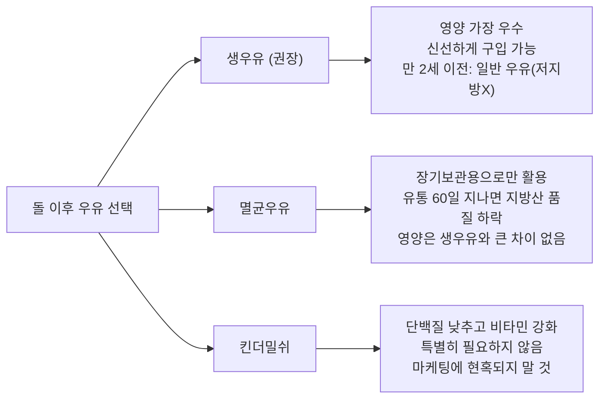
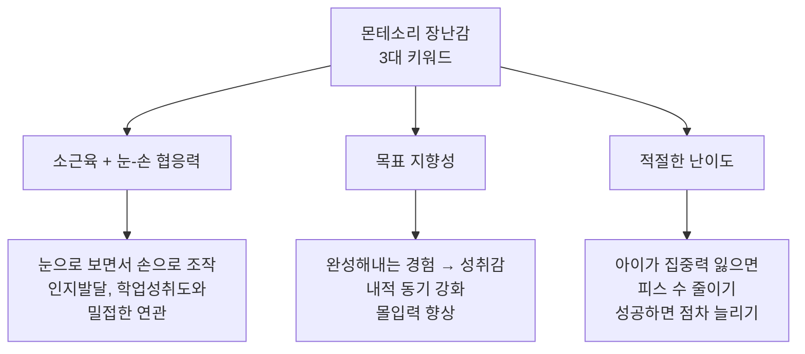
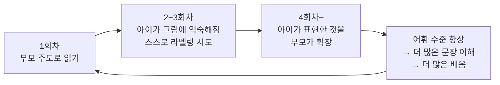

돌에서 세 돌까지는 **변연계(감정 조절 뇌영역)**가 집중적으로 발달하는 시기입니다. 이 시기에 한글 카드, 영어 비디오, 학습 앱 등 인지 학습을 과도하게 시키면 감정 조절과 상호작용 능력이 저해될 수 있습니다. 하루 9시간 영어 비디오를 본 6개월 아기가 자폐 유사 증상을 보인 사례도 보고되었습니다. 이 시기의 핵심은 **부모와의 정서적 교감** -- 안아주기, 함께 놀기, 감정 읽어주기 -- 에 집중하는 것입니다.

12~18개월 아기는 호기심이 폭발적으로 증가하여 무엇이든 만지고, 입에 넣고, 탐색하려 합니다. 닫혀 있는 문을 열고, 서랍 속을 뒤지고, 어른이 사용하는 물건에 관심을 보이며, 본 것을 그대로 흉내 내려 합니다. 이 왕성한 호기심과 탐색 욕구를 안전하게 충족시켜 주는 것이 부모의 가장 중요한 역할입니다.

---

## 몬테소리 환경 세팅: 집을 아이 중심으로

몬테소리 철학의 핵심은 **"아이가 스스로 할 수 있게끔 도와주는 것"**입니다. 아이가 삶의 통제감을 느끼고, 일상 생활 활동 자체에서 소근육을 집중해서 쓸 수 있도록 환경을 만들어 주는 것이 첫걸음입니다. 한번에 다 바꿀 필요는 없습니다. 아이의 하루를 떠올리면서 -- 일어나서 아침을 먹고, 양치질을 하고, 옷을 갈아 입고, 외출하고, 돌아와서 손을 씻고, 간식을 먹고, 놀다가 저녁을 먹고, 책을 읽고, 잠을 자는 -- 그 속에서 아이가 스스로 할 수 있는 부분을 하나씩 찾아보세요.

### 주방

**낮은 서랍 하나를 아이 전용 공간으로 지정합니다.** 아이가 손쉽게 열 수 있도록 작은 손잡이를 달아 주고, 아이의 식기(숟가락, 컵 등)를 넣어 둡니다. "밥 먹을 때 여기서 숟가락 가져오는 거야"라고 몇 번 알려주면 아이는 스스로 숟가락을 꺼내 식탁으로 가져갑니다.

**시리얼이나 간식은 이케아 스쿱 같은 작은 도구와 함께 제공합니다.** 아이가 원하는 만큼 떠서 자기 그릇에 넣을 수 있게 합니다. 너무 많이 넣으려 하면 부드럽게 제재하고, "먹고 모자라면 더 더" 방식으로 가이드합니다.

**주전자로 물 따르기를 연습시킵니다.** 아직 잘 못해도 혼자 해보도록 격려하세요. 쏟더라도 조절하는 법을 조금씩 배우는 과정 자체가 소근육 발달에 도움이 됩니다. 평소에는 센서형 워터 디스펜서를 활용할 수도 있습니다.

**러닝타워는 이 시기 가장 유용한 아이템 중 하나입니다.** 걸음마 시기부터 약 4년간 사용할 수 있습니다. 러닝타워를 싱크대 옆에 놓으면 아이가 부모와 같은 눈높이에서 요리나 설거지에 참여할 수 있습니다.

> "위에서 부모님과 함께 활동한다면 엄마가 뭘 하는지 보면서 '아, 양상추를 찢어서 엄마가 준비 중인 저 재료와 함께 샐러드에 넣는 거구나' 이런 식으로 그 활동의 의미를 좀 더 넓은 범위에서 잘 이해할 수 있어요. 아래에서 활동한다면 아이의 활동은 '샐러드 만들기'가 아닌 '양상추 찢기'가 될 가능성이 더 높아요." -- 베싸TV

러닝타워 사용 시 **만 3세 이전까지는 반드시 부모가 가까이에서 지켜봐야 합니다.** 올라탄 상태로 매달리거나 한쪽으로 기대지 않도록 주의를 줍니다. 테이블 형태로 변형해서 미술 활동용으로도 활용할 수 있습니다.

### 세면대

**높은 디딤대를 세면대 앞에 놓습니다.** 스스로 칫솔질을 먼저 하게 한 뒤, "엄마가 해줘도 돼?"라고 물어보고 마무리해 줍니다. 처음에는 엄마가 해주는 부분을 싫어할 수 있지만, 스스로 하는 시간을 충분히 주고 매번 물어보다 보면 자연스럽게 칫솔을 건네게 됩니다.

**센서형 오토 디스펜서**를 설치하면 펌핑이 아직 어려운 아이도 스스로 비누를 사용할 수 있습니다. 수건은 아이 키 높이에 맞게 낮게 걸어 두세요.

### 옷장

**아래쪽 서랍 하나를 아이 전용으로 지정합니다.** 손잡이를 달아 아이가 직접 열 수 있게 하고, 세트로 미리 구성한 옷 2~3벌을 넣어 둡니다. 선택지가 너무 많으면 혼란스러울 수 있으므로 2~3개 정도로 제한합니다. 티셔츠 안에 바지를 넣어 두면 아이가 한 번에 한 세트를 꺼낼 수 있어 편리합니다.

**셀프케어 공간을 만들어 줍니다.** 낮은 위치에 후크를 달아 외투를 스스로 걸 수 있게 하고, 낮은 곳에 빗이나 머리핀을 놓아 줍니다. 돌에서 두 돌 사이에 아이가 옷을 가져와서 입혀 달라 하거나, 머리에 뭔가를 꽂아 달라 하는 모습을 보인다면 셀프케어에 관심이 생긴 징조입니다.

> **실천 팁**: 아직 옷을 스스로 입는 스킬이 미숙하더라도 작은 부분을 떼어서 아이가 할 수 있도록 독려합니다. 예를 들어 바지를 입을 때 다리까지는 끼워 주고, 나머지는 스스로 올릴 수 있게 격려합니다.

### 놀이 공간

**낮은 선반에 6~10개의 장난감/활동 재료를 배치합니다.** 이케아 칼락스 선반이나 트로파스트 같은 제품이 적합합니다. 나머지 장난감은 박스에 따로 보관하고, 아이의 관심이 줄면 교체합니다.

**트레이를 사용합니다.** 여러 물건을 하나의 활동 재료로 묶어 주는 효과가 있고, 바닥이나 테이블로 가져와서 활동하기 좋습니다.

**재료를 배치할 때 핵심 원칙:**

| 원칙 | 예시 |
|------|------|
| 깔끔하고 일관적으로 정리 | 아이가 직관적으로 "이건 뭘 하는 활동이구나" 알아차릴 수 있게 |
| 왼쪽에서 오른쪽으로 활동을 완성하는 형태 | 왼쪽에 비즈, 오른쪽에 빈 막대 |
| **완성되지 않은 형태로 놓기** | 링 쌓기를 완성된 상태로 놓으면 흥미가 떨어짐. 비즈를 옆에 놓고 막대를 따로 두면 완성하려는 동기가 유발됨 |

**러그를 활용합니다.** 러그 위에서 활동하는 습관을 들이면 아이의 활동 공간을 자율적으로 설정하면서도 정해진 활동 반경 안에서 집중하는 공간적 질서를 부여할 수 있습니다. 단, 아이가 이미 집중하고 있다면 러그 위로 옮긴다고 방해할 필요는 없습니다.

---

## 돌 이후 식단 완전 가이드

### 비타민D + 유산균은 필수 영양제

균형 잡힌 식사(곡물, 채소, 과일, 동물성 단백질, 유제품)를 하면 대부분의 영양제는 필요하지 않습니다. 단, **비타민 D**와 **유산균**은 예외입니다.

- **비타민 D**: 식품만으로는 충분한 섭취가 어렵고, 자외선 차단제를 바르면 체내 합성이 안 됩니다. **하루 600IU를 식후에 보충**합니다.
- **유산균**: 부족이나 과다를 걱정할 필요 없이 장내 환경에 긍정적 영향을 줍니다. 매일 아침 공복 또는 식사에 섞어 줍니다.

> "균형 잡힌 식단이 해방. 그 식단에서 부족한 것만 딱 골라 영양제로 섭취하는 것이 핵심." -- 베싸TV

**DO:**
- 비타민 D 600IU + 유산균은 매일 챙기기
- 균형 잡힌 식단(곡물+채소+과일+단백질+유제품)을 1순위로 놓기
- 두 돌 이전에 좋은 식습관 형성에 집중하기 (이 시기에 형성된 식습관은 평생 지속되는 경향)

**DON'T:**
- 영양제에 기대어 식단 노력을 소홀히 하지 않기
- 젤리 형태 비타민을 무분별하게 주지 않기 (비타민 A 과다 섭취 위험, 높은 당 함량)
- 불필요한 영양제를 "많이 먹을수록 좋다"는 생각으로 먹이지 않기

### 철분/DHA 부족 대응법

**철분**은 돌 이후에도 여전히 중요합니다. 돌에서 두 돌 사이 한국 아기들의 평균 철분 섭취량은 6.3mg으로, 미국 권장량(8mg)보다 낮은 경향이 있습니다. 철분이 부족하면 뇌발달, 인지발달, 수면에 영향을 줄 수 있습니다.

- **소고기, 닭고기, 돼지고기, 생선, 달걀**을 골고루 챙기세요
- **철분강화 시리얼**은 간편한 아침식사 옵션입니다
- **비타민 C가 풍부한 과일/채소**를 함께 먹여야 철분 흡수가 잘 됩니다

**DHA**는 돌에서 두 돌 사이 한국 유아의 90% 이상이 충분히 섭취하지 못하고 있습니다. 뇌가 발달하는 시기에 DHA 섭취는 특히 중요합니다.

- **등푸른 생선(연어, 멸치, 고등어)을 주 2회 이상** 식단에 포함합니다
- 연어구이를 잘게 찢어 밥에 섞거나, 멸치를 곱게 갈아 국에 넣는 방법이 간편합니다
- 생선 섭취가 어려우면 **DHA 영양제**를 보충합니다
- 아몬드, 호두, 들기름에도 오메가3가 있지만 DHA가 아닌 ALA가 풍부하여 전환율이 10~15%에 불과합니다

**아연**은 육류를 어느 정도 먹고 있다면 별도로 영양제를 먹일 필요가 없습니다. 미국 소아과학회에서도 채식주의 아이조차 아연 결핍은 흔하지 않다고 봅니다. 아연 과잉섭취는 오히려 철분과 구리 흡수를 방해하고 면역기능을 떨어뜨릴 수 있습니다.

### 생우유 vs 멸균우유 vs 킨더밀쉬

**핵심 정리:**
- **생우유**만으로 충분합니다. 만 2세 이전에는 **저지방이 아닌 일반 우유**를 선택합니다.
- **유제품은 하루 2회분 권장**, 우유는 **하루 500ml 이하**로 (과다 섭취 시 철분결핍빈혈 위험).
- 멸균우유는 장기보관이 필요한 경우에만 활용합니다.
- 킨더밀쉬는 아기가 고기/달걀을 매우 많이 먹어 단백질 과다가 우려되거나, 이미 비만 기미가 있는 경우에만 고려합니다. 그 외에는 생우유로 충분합니다.

### 두 돌까지 간 하지 않기

> "이론적으로는 두 돌까지는 소금간이든 간장간이든 하지 않는 것이 일반적인 권고 사항입니다." -- 우리동네 어린이병원

어릴 때부터 나트륨 섭취가 많았던 아이들은 성인이 되어 만성 질환에 걸릴 확률이 더 높았다는 연구 결과가 있습니다. 분유, 모유, 식재료 자체에 이미 나트륨이 포함되어 있으므로 별도의 간을 하지 않아도 충분합니다.

**이미 간을 시작해버렸다면:**

1. **국물 줄이기**: 국에 밥을 말아서 먹이지 말고, 밥 위에 자작자작하게 적시는 정도로 줄입니다
2. **아이용 양념 사용**: 저염 간장, 아이용 김 등을 활용합니다. 단, "아이용"이라고 표기되어 있어도 나트륨 함량이 비슷한 경우가 많으니 **반드시 영양성분표를 확인**합니다
3. **온 가족이 함께 싱겁게**: 어른의 1일 나트륨 목표(2,000mg)와 아이의 목표가 크게 다르지 않으니 온 가족이 함께 실천합니다

---

## 재접근기 (16~24개월): 다시 엄마 껌딱지

### 왜 발생하는가

첫돌이 지나면 점차 자아가 형성되면서 **독립적인 마음**과 **주 양육자와 분리되었을 때 불안한 마음**이 공존하게 됩니다. 이 이중적인 감정이 아이 본인에게 혼란과 두려움을 주며, 안정감을 느끼기 위해 다시 엄마를 찾게 되는 것이 **재접근기**입니다.

> "나는 이제 혼자 할 수 있어, 내가 할 거야! 라는 마음과 '아니야, 나는 아직 엄마 없이는 무섭고 불안해' 라는 양가 감정이 하루에도 수십 번 왔다 갔다 합니다." -- 이민주 육아상담소

전문가들은 재접근기를 **"정상적인 발달 과정이지만, 정신이 성장해가는 과정 중에서 그 어느 때보다 혼란스러운"** 시기라고 말합니다. 주 양육자로부터 정신적 독립을 해가는 **분리-개별화 단계**의 일부입니다.

### 구체적 행동 패턴 5가지

| # | 행동 | 상세 |
|---|------|------|
| 1 | 하루종일 "안아줘" 반복 | 안고 있어도 안아 달라고 칭얼거리며 떼 씀 |
| 2 | 아빠 거부, 엄마만 찾음 | 목욕, 밥, 잠, 카시트 태우기까지 전부 엄마만 |
| 3 | 감정기복 심화, 급발진 | 스스로 하겠다 했다가 갑자기 심하게 짜증, 도와주면 더 큰 떼 |
| 4 | 혼자 놀이에 집중 못함 | 화장실 가면 울고, 다리 사이에 얼굴을 넣고 끌어안는 시그니처 포즈 |
| 5 | 수면 중 자주 깸 | 잘 자던 아이가 갑자기 새벽에 많이 울며 깨고, 다시 재우기도 힘듦 |

### 대처법 5가지

**1. 최대한 안정감을 느끼도록 수용하기**

단순히 칭얼거림이 아니라, **매우 불안한 마음을 아이 스스로도 감당이 어렵고 두려워서** 주 양육자 접촉으로 불안감을 낮추고 싶어하는 것입니다. 훈육 상황이 아닙니다. 아무리 지치고 힘들더라도 재접근기 동안은 최대한 안아주고 수용해 줘야 건강하게 다음 단계로 성장할 수 있습니다. 힙시트를 다시 구매해서 활용하는 것도 현실적인 방법입니다.

**2. 스스로 하려는 마음 지지하기**

불안감을 보이는 동시에 스스로 하고 싶어하는 욕구도 공존합니다. 시간이 걸린다고, 쏟아질까 봐, 뒤처리가 힘들어서 계속 제지하면 아이는 독립 경험이 부족해져 수동적이고 의존적인 아이가 됩니다. 아이가 무언가 스스로 시도하려 할 때 진심으로 지지해 주세요.

**3. 사소한 것부터 선택권 부여하기**

- "빨간 양말 신을까, 파란 양말 신을까?"
- "어떤 식판 쓸까?"
- "어떤 신발 신을래?"
- "가방에 뭐 넣고 나갈까?"

이런 사소한 선택을 통해 아이가 스스로 고민하고 결정할 수 있다는 것을 느끼게 하면 독립심을 길러주는 데 도움이 됩니다.

**4. 혼란스러운 마음 공감하기**

"왜 울어?"보다는 **"그랬구나", "괜찮아, 그럴 수 있어", "기다려줄게"** 같은 말 한마디가 아이에게 "내 편이구나, 별일 아니구나" 라는 위로가 됩니다. 부정적인 말과 어투, 표정으로 대하면 불안감이 오히려 증폭되어 소리지르기, 발차기, 구름 등으로 불안감을 낮추려 하고 그것이 옳은 방법이라고 학습할 수 있습니다.

**5. 수면이 힘들 때 옆에 있어주기**

불안감이 높아지면 어두운 상황, 눈을 떠서 엄마가 없는 상황, 눈을 감았을 때 아무것도 보이지 않는 것이 두렵게 느껴집니다. 재접근기가 지나면 수면도 자연스럽게 패턴을 되찾으므로, 이 기간에는 옆에서 토닥여 줍니다. **단, 수면 환경과 수면 의식은 일관되게 유지합니다.** 불을 켜달라, 물을 달라, 책을 읽어달라는 요구를 모두 들어주라는 것은 아닙니다.

---

## 12~18개월 추천 장난감

### 몬테소리 3대 키워드

> "자기 수준에 약간 어려운 조작을 반복적으로 연습하고 몰입하여 결국 해내는 아이의 뿌듯한 얼굴, 이것이 몬테소리 철학이 가장 핵심적으로 추구하는 이미지입니다." -- 베싸TV

### 구체적 교구 목록

| 교구 | 설명 | 추천 시기 | 핵심 발달 영역 |
|------|------|-----------|----------------|
| **막대 끼우기** | 막대가 1개인 심플한 형태가 이상적. 직관적으로 목적을 파악할 수 있어야 함 | 12개월~ | 눈-손 협응, 소근육 |
| **포스팅(구멍 넣기)** | 구멍에 물체를 넣는 활동. DIY로도 가능하지만 장난감은 흥미 유도가 더 쉬움 | 12개월~ | 소근육, 집중력 |
| **꼭지 퍼즐** | 3피스 단순 도형부터 시작. 떼어내기는 돌 전부터, 맞추기는 돌 이후 본격화 | 12~15개월 | 눈-손 협응, 문제해결 |
| **페깅(꽂기)** | 말뚝 같은 것을 구멍에 꽂는 활동. 보드와 컬러 페그로 색깔 분류까지 확장 가능 | 12개월~ | 소근육, 색깔 인지 |
| **색깔 분류** | 15개월경 색깔에 따라 분류 가능. 막대와 고리 색이 완전히 일치하는 제품으로 시작 | 15개월~ | 인지, 소근육 |
| **자석 낚시놀이** | 소근육과 눈-손 협응력 발달. 하나씩 빼서 옆 통에 옮기는 것을 목표로 | 15개월~ | 소근육, 집중력, 목표지향 |
| **2피스 자석 퍼즐** | 그림 맞추기 위해 눈으로 보면서 손으로 돌려보는 연습 | 15개월~ | 시각-운동 통합 |

**추천 브랜드**: 멜리사앤더그(꼭지 퍼즐), 브알라(색깔 분류), 블루래빗(자석 낚시, 15개월~), 플랜토이즈(페깅), 하바(끼우기+색맞추기)

> **팁**: 아이가 퍼즐 맞추기를 어려워하면 잠시 지켜보다가, 포기할 것 같으면 옆에서 살짝 돌려주거나 톡 밀어주는 식으로 최소한만 도와주세요. 아이가 "내가 해냈다"는 성취감을 느끼는 것이 핵심입니다.

**열린 장난감도 함께 필요합니다.** 몬테소리 교구(목표지향적, 닫힌 장난감)와 열린 장난감(블럭, 실크 스카프 등 자유로운 놀이)은 모두 발달에 필요합니다. 몬테소리 박사 역시 집에서 아이들이 열린 장난감으로 자유롭게 노는 것에 대해 부정적으로 보지 않았습니다.

---

## 책육아 본격화

### 왜 이 시기에 책육아인가

책 읽기는 단순히 "좋은 습관"이 아니라, 언어, 사회성, 인지발달에 **측정 가능한 수준의 영향**을 줍니다.

**언어발달 효과:**
- 책 읽기 시 **라벨링(그림 가리키며 이름 말하기) 비율이 전체 발화의 75.6%**로, 일반 놀이(7%)의 약 10배입니다. 이것이 어휘 습득의 핵심입니다.
- 책을 읽을 때 부모는 과거/현재/미래 등 **다양한 시제**를 자연스럽게 사용하게 되어 아이의 언어 구조 학습에 도움됩니다.
- 아이가 집중해야 할 대상이 명확하고 단순해서, 같은 언어 자극을 받더라도 **배움의 효율이 훨씬 높아집니다.**

**사회성 발달 효과:**
- 책을 읽으며 등장인물의 감정("토끼가 슬퍼 보이네", "강아지가 무서웠나 봐")에 대해 이야기하는 기회가 많아집니다.
- 다른 사람의 마음 상태를 이해하는 연습이 향후 공감 능력과 사회성의 토대가 됩니다.

**반복 읽기의 선순환:**

아이가 같은 책을 가져오면 **기꺼이 다시 읽어 줍니다.** 반복은 부모에게는 같은 에피소드지만, 아이에게는 회차마다 상호작용의 형태가 조금씩 바뀌며 배움이 깊어지는 과정입니다.

### 어떤 책을 고를 것인가

만 3세 미만 아이들에게는 **"단순하고, 사실적이며, 현실과 맞닿은"** 그림책이 가장 효과적입니다.

**1. 단순함**

한 페이지에 그림이 너무 많지 않은 책을 선택합니다. 그림이 2개 이상 있으면 아이는 어떤 그림에 문장을 연결해야 할지 인지적 부담이 생겨 배움의 효율이 떨어집니다. 부모가 손가락으로 가리켜 주면 해소되지만, 모든 단어마다 포인팅하는 것은 현실적으로 어렵습니다.

**2. 사실성**

15개월 아기를 대상으로 한 실험에서, **사진이나 세밀화로 된 책**으로 배운 아이들은 배운 단어를 현실 물체에 적용할 수 있었지만, **만화화된 그림으로 된 책**으로 배운 아이들은 현실 물체를 인식하지 못했습니다. 30개월 아이들도 만화화된 그림을 통해서는 배운 단어를 현실에 적용하는 데 어려움을 겪었습니다.

> 사진이나 세밀화처럼 사실적인 그림책을 우선 선택하세요. 특히 두 돌 정도까지는 그림의 사실성이 배움의 효율에 직접적 영향을 줍니다.

**3. 현실성**

아이가 매일 겪는 경험(가족, 친구, 놀이, 밥 먹기, 산책 등)을 소재로 한 책이 좋습니다. 환상적인 요소가 많은 책은 아이에게 "이 책의 정보는 현실과 다르다"는 메시지를 던져, 배운 내용을 현실에 덜 적용하게 됩니다.

**4. 의인화된 동물 주의**

사람이 등장하는 책을 읽은 아이들이 의인화된 동물 책을 읽은 아이들보다 스토리의 교훈을 더 잘 실천했습니다. 동물 책도 괜찮지만, **사람이 등장하는 책도 적극적으로 포함**시키세요.

**DO:**
- 전면 책장에 10~15권을 진열하고, 관심이 줄면 교체
- 그림을 가리키며 "이건 뭘까?" "강아지가 뭐 하고 있어?" 라벨링 적극 활용
- 등장인물의 감정 읽어주기 ("토끼가 슬퍼 보이네")
- 2~3회차부터 "이건 뭐지?" 아이가 스스로 라벨링하도록 유도

**DON'T:**
- 집안을 책으로 가득 채우는 것 = 책육아가 아님
- 하루 몇 시간 이상 읽어야 한다는 강박
- 만화화된 그림만으로 구성된 책에만 의존

---

## 훈육의 시작

### 훈육의 시작 시기

16~30개월은 **자아가 형성되면서 자기주장을 펼치기 시작하는 시기**입니다. 동시에 인지 발달과 언어 발달은 아직 미숙하여, 자기가 원하는 것을 언어로 정확하게 표현하기도 어렵고 자기 주장이 옳은지 판단하기도 어렵습니다. 이것이 떼쓰기의 첫 번째 원인입니다.

두 번째 원인은 **가족 내에서 서열을 정하는 시기**이기 때문입니다. 아이는 양육자가 자기 마음대로 통제 가능한지, 누가 가장 잘 들어주는지를 시험합니다. 이 시기를 현명하게 대처하면 약 일주일 후 아이가 스스로 자기 위치를 받아들이게 됩니다. 반대로 일관적이지 않은 태도를 보이면 떼쓰기가 점점 더 강해지고 통제가 어려워집니다.

> "훈육은 혼내는 것이 아닙니다. 아이가 세상에 태어나 살아가면서 지켜야 할 도리, 규범, 사회의 일원으로써 문제가 되지 않도록 가르치는 과정입니다." -- 이민주 육아상담소

### 훈육 3단계

**1단계: 짧고 단호한 의사 전달**

아이가 흥분해서 떼를 쓰고, 소리지르고, 울고 있을 때는 긴 설명이 오히려 혼란을 줍니다. **"던지면 안 돼"**, **"떼쓰고 운다고 들어줄 수 없어"** -- 짧고 단호하게, 낮은 목소리로 분명히 의사를 전달합니다. 그리고 아이가 스스로 감정을 가라앉힐 때까지 일정 거리를 두고 기다립니다. 아이에게 "소리지르고 떼쓰지 않을 때 엄마랑 이야기할 거야"라고 분명히 전달합니다.

**2단계: 감정 공감**

아이의 울음 강도가 처음보다 확연히 약해지거나, 양육자의 눈치를 살피면서 울음을 이어가는 느낌이 올 때 접근합니다. **"물건이 안 맞아서 속상했구나"**, **"그거 하고 싶었구나"** -- 아이의 정확한 감정을 확인해 줍니다. 아이가 공감받아 서러움에 더 크게 울 수 있는데, 이것은 떼쓰기 울음이 아닌 감정 해소입니다.

**3단계: 올바른 표현 방법 알려주기**

> "이것이 가장 중요합니다. '안 되는 거야, 울고 떼쓴다고 들어주지 않아'에서 끝나면 아이는 더 배울 수 있는 것이 없어요. 다음번에 또 똑같은 방법으로 떼쓰기를 택합니다." -- 이민주 육아상담소

**"속상하면 '도와줘'라고 말해"**, **"하고 싶을 때는 '엄마!' 하고 크게 부르거나 '주세요' 해"** -- 아이의 발달 수준에 맞는 짧고 간단한 언어나 제스처를 알려줍니다. 하루에도 수 번, 일주일에도 수십 번 반복해야 합니다.

### 떼쓰기 2가지 원인

| 원인 | 설명 | 대처 핵심 |
|------|------|-----------|
| **자아 형성 + 인지/언어 미숙** | 원하는 것이 있지만 표현할 수 없고, 옳고 그름도 판단 어려움 | 올바른 표현 방법 반복 알려주기 |
| **서열 정하기 (힘겨루기)** | 양육자가 마음대로 통제 가능한지 시험 | "안 되는 것은 안 된다" 일관성 유지 |

**핵심 주의사항:**

- **모든 양육자(엄마, 아빠, 조부모)가 동일한 기준으로 일관되게** 실천해야 합니다
- 양육자의 컨디션에 따라 허용했다 안 했다 하면 아이는 사람과 상황에 따라 눈치를 보게 됩니다
- 아이가 떼쓰는 모습을 영상으로 찍거나 재미있어하면, 아이는 다음번에 관심 끌기 수단으로 활용합니다
- **양육자 자신이 화가 난 상태**에서는 훈육을 피하세요. 잠시 분리 후 감정을 가라앉히고 다시 접근합니다

---

## 이 시기 체크리스트

### 환경
- [ ] 주방에 아이 전용 낮은 서랍 마련 (식기, 숟가락)
- [ ] 러닝타워 설치 (싱크대/조리대 옆)
- [ ] 세면대 앞 높은 디딤대 설치
- [ ] 센서형 오토 디스펜서 설치
- [ ] 수건을 아이 키 높이에 걸기
- [ ] 옷장 아래 서랍에 세트 옷 2~3벌 배치
- [ ] 놀이 공간에 낮은 선반 + 6~10개 활동 배치
- [ ] 전면 책장에 10~15권 진열

### 영양
- [ ] 비타민 D 600IU + 유산균 매일 챙기기
- [ ] 등푸른 생선 주 2회 이상 (DHA)
- [ ] 생우유 하루 500ml 이하, 일반(저지방X) 우유
- [ ] 철분 풍부 식품 매일 (소고기, 달걀, 철분강화 시리얼)
- [ ] 비타민 C 풍부 과일/채소 함께 먹이기 (철분 흡수 촉진)
- [ ] 두 돌까지 간 하지 않기

### 발달/교육
- [ ] 몬테소리 교구 2~3개 구비 (꼭지 퍼즐, 포스팅, 막대끼우기 등)
- [ ] 단순하고 사실적인 그림책 위주로 선택
- [ ] 라벨링하며 책 읽기 실천
- [ ] 반복 읽기 요청 시 기꺼이 읽어주기

### 정서/훈육
- [ ] 재접근기 행동 이해하기 (16~24개월)
- [ ] "안아줘" 요청 시 최대한 수용
- [ ] 사소한 선택권 부여 (양말, 신발, 식판)
- [ ] 훈육 3단계 실천 (단호 전달 → 감정 공감 → 올바른 표현법 알려주기)
- [ ] 모든 양육자 일관된 기준 합의

### 건강
- [ ] 영유아 건강검진 빠짐없이 받기
- [ ] 기저귀 떼기는 억지로 강요하지 않기 (개인차 큼)
- [ ] 숟가락/포크 스스로 사용하게 환경 제공
