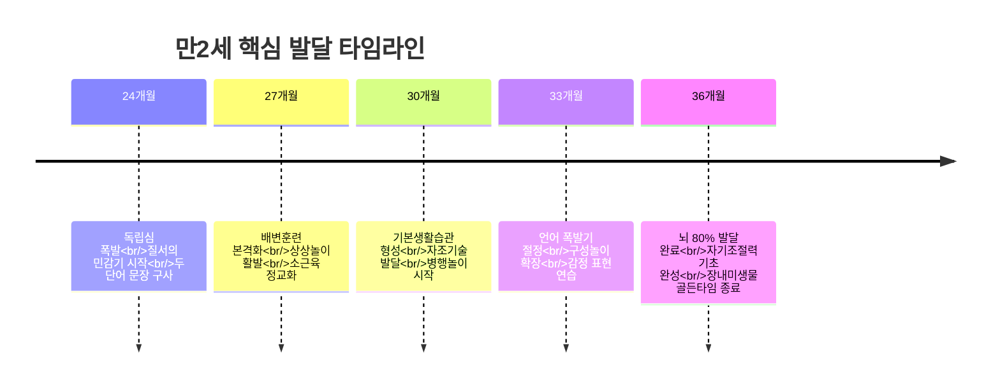
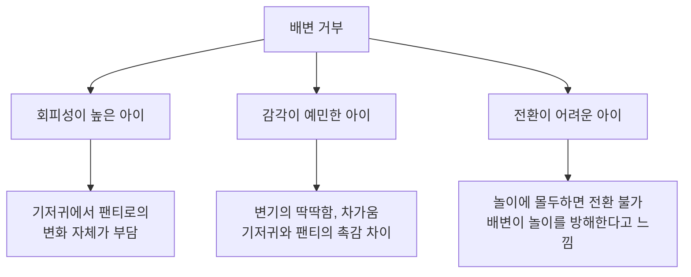
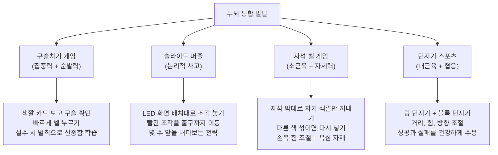
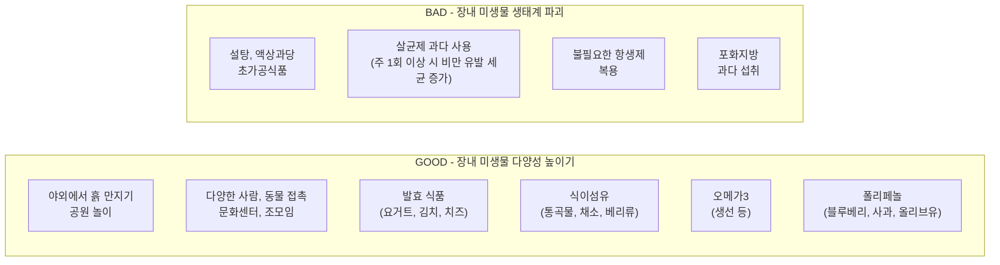

24~36개월, 만 2세. 이 시기를 한마디로 표현하면 **"영아기의 사춘기"**다. "내가 할래!", "싫어!", "안 해!"가 하루 종일 이어지고, 어제까지 순한 양이던 아이가 갑자기 고집쟁이로 변한다. 하지만 이것은 문제가 아니라, 아이가 독립된 존재로 성장하고 있다는 건강한 신호다.

만 3세가 되면 **뇌의 약 80%가 발달을 완료**한다. 지금 이 시기는 뇌 발달의 마지막 골든타임이자, 감정 조절을 담당하는 변연계 발달이 마무리되는 시기이기도 하다. 변연계가 충분히 성숙해야 전두엽(인지) 발달로 순조롭게 넘어갈 수 있다. 즉, 지금 아이의 감정을 어떻게 다뤄주느냐가 앞으로의 인지 발달 기반을 결정한다.

---

## 만2세 발달 특성 총정리

### 신체 발달

이동 영역이 크게 넓어진다. 뛰기, 계단 오르내리기가 가능해지면서 만 1세 때와는 비교할 수 없을 정도로 활동 반경이 확대된다. 소근육도 빠르게 발달하여 **자발적인 끼적이기**가 나타나고, 책장을 한 장씩 넘길 수 있게 되며, 블록을 더 정교하고 튼튼하게 쌓아 올릴 수 있다.

**DO:**
- 매일 30분 이상 야외 활동(공원, 놀이터) 확보
- 뛰기, 계단 오르내리기, 언덕 오르기 등 다양한 대근육 활동 경험
- 큰 종이(전지)를 벽이나 바닥에 붙여놓고 자유롭게 끼적이기 환경 제공
- 크레파스/마커를 아이 손이 닿는 곳에 비치

**DON'T:**
- 끼적이기를 보고 "뭘 그린 거야?"라고 질문하기 (대신 "와, 동그라미가 많네!" 하고 관찰한 것을 말해주기)
- 아이가 활발하다고 실내에만 가두기 (에너지가 위험한 행동으로 전환됨)

### 언어 발달

**언어 폭발기**에 진입한다. 두 단어를 결합한 문장("맘마 주세요", "엄마 보고 싶어요")을 구사할 수 있게 되고, 간단한 심부름("저기 책상 아래에 있는 연필 가져다 줘")을 수행할 수 있을 정도로 듣기 능력이 발달한다.

> 우리쥬임쌤은 "만 2세 선생님들이 되도록 많은 이야기를 들려주시고, 많은 단어를 들려주시고, 언어적 의사소통을 통해 상호작용을 많이 해주시는 게 아이들의 언어 발달에 굉장히 도움이 된다"고 강조한다.

### 인지 발달

사물의 **색깔, 모양, 질감, 기능**에 관심이 폭발한다. 특정 색깔만 모으는 아이, 같은 모양끼리 분류하려는 아이 -- 모두 정상적인 인지 발달의 모습이다.

**구성 놀이**와 **상상 놀이(가작화 놀이)**가 활발해진다. 볼펜을 마이크라고 하며 노래하고, 빈 컵으로 물 마시는 시늉을 한다. 엄마 아빠 놀이, 선생님 놀이에서 점차 병원 놀이, 가게 놀이로 확장된다.

### 사회/정서 발달

또래에 관심을 보이기 시작하지만, 아직 **병행 놀이** 수준이다. 같은 공간에서 각자 놀며 간단한 물건 주고받기 정도가 가능하다.

**DON'T:**
- "왜 친구랑 안 놀아?"라고 걱정하기
- 억지로 아이들을 붙여놓으려 하기

> 우리쥬임쌤은 "만 2세 아이들은 사회적 기술이 미숙하기 때문에 혼자 놀이하는 것은 당연한 현상이며, 학부모님이 걱정하실 필요가 없다"고 설명한다.

정서적으로는 부정적 감정의 표현이 폭발적으로 나타나는 시기다. 뜻대로 되지 않으면 때리거나, 울거나, 소리를 지른다. 동시에 다른 사람의 감정에 관심을 갖기 시작하여 어깨를 톡톡 두드려주거나 "아파?"라고 물어보기도 한다. 이것이 바로 사회성의 기초가 되는 모습이다.

---

## 4가지 발달 과업

이민주 육아상담소의 이민주 상담사는 만 1~3세 아이들이 반드시 성취해야 하는 **4가지 발달 과업**을 제시한다. 각 단계의 발달 과업을 잘 성취해야 다음 단계로 순조롭게 넘어갈 수 있다.

### 과업 1: 건강한 자아 인식

자아가 생겨나면서 자기중심적 사고를 하고, 독립된 존재임을 깨닫는 시기다. "내가 할래"가 폭발하고, "우리 집에서 나의 서열이 어디쯤인지" 테스트하듯 환경을 통제하려 한다.

**부모 역할:**
- 정서적 지원은 아끼지 않되, **안 되는 것에 대한 한계 설정은 분명히** 해야 한다
- 한계 설정을 통해 자기조절력을 키워주고, 부모가 "이기려고 기를 쓰는 대상"이 아님을 인식시킨다
- 부모의 권위가 지켜져야 앞으로의 건강한 훈육이 가능하다

### 과업 2: 언어 발달과 소통

단순히 말이 트이는 것만 중요한 게 아니라, **부정적 감정을 언어로 표현하는 방법**을 가르치는 것이 핵심이다.

**구체적 실천법:**
1. 아이가 때리거나 던지면 **즉시** 짧은 언어 표현을 모델링한다
   - "속상하면 '싫어'라고 말해"
   - "화나면 '안 해'라고 말해"
2. 같은 말을 100번, 1000번 반복한다 -- 한두 번으로 습관이 되지 않는다
3. 아이가 한 번이라도 말로 표현하면 **즉시 긍정 강화**: "말로 잘 이야기했네!"

**DON'T:**
- 공격적 행동에 대해서만 훈육하고, 대안적 표현 방법은 알려주지 않기
- "왜 때려!" 식의 반응만 하기 (아이는 다른 방법을 모르기 때문에 때리는 것)

### 과업 3: 기본생활습관 형성

"세 살 버릇 여든까지" -- 이 말이 가장 정확하게 적용되는 시기다. 처음부터 올바르게 형성하는 것이 잘못된 습관을 나중에 고치는 것보다 **훨씬 쉽다**.

> 이민주 상담사는 "따라다니며 떠먹여 주는 식습관을 제자리에 앉아 먹는 식습관으로 바꾸는 것은 매우 어렵지만, 처음부터 그런 경험이 없는 아이들은 이유식 단계부터 자연스럽게 식사 습관이 형성된다"고 강조한다.

**지금 잡아야 할 4가지 기본 습관:**

| 습관 | 구체적 실천 |
|------|------------|
| 식사 | 정해진 자리에서 TV 없이, 40분 이내로 |
| 이 닦기 | 밥 먹고 나면 바로, 부모가 시범 보이기 |
| 수면 | 매일 같은 시간에 자기 |
| 정리정돈 | 놀이 후 "같이 하자"로 유도하며 정리 |

### 과업 4: 자율성 확립

에릭슨의 심리사회적 발달단계에서 이 시기는 **자율성 vs 수치심** 단계다. 모든 게 서툴지만 뭐든 자기가 하려는 시기이며, 이를 어떻게 다루느냐가 아이의 자존감을 결정한다.

**DO:**
- "내가 할 거야"를 존중하고 **기다려주기** -- 가장 중요한 부모 역할
- 서투르지만 스스로 해보게 하고, 성취감을 느끼게 해주기
- 대소근육 발달을 놀이로 지원하여, 실제로 "할 수 있는 것"을 늘려주기

**DON'T:**
- 지나치게 통제하고 혼내기 -- 좌절감과 수치심 유발
- 지나치게 과잉보호하여 아이가 스스로 할 기회를 빼앗기
- 아이의 실수를 훈육 상황으로 만들기 (도전 과정의 실수는 당연한 것)

---

## 배변훈련 완전 가이드

배변훈련은 누구나 거치는 과정이지만, 잘못된 접근으로 오랫동안 고생하는 가정이 적지 않다. 육아메이트 미오의 도현경 상담사는 "억지로 밀어붙여도 안 되고, 무작정 기다려도 안 된다"고 말한다. 핵심은 **아이가 스스로 생각하고 선택하게** 만드는 것이다.

### 기질별 거부 원인 파악

아이가 배변을 거부하는 이유는 기질에 따라 다르다. 원인을 파악해야 적절한 접근이 가능하다.

**기질별 구체적 대응:**

| 기질 | 대응법 |
|------|--------|
| 회피성 높은 아이 | 변화를 아주 천천히, 한 단계씩 도입. 급격한 변화 금지 |
| 감각 예민한 아이 | 변기 시트에 따뜻한 커버 씌우기, 기저귀와 비슷한 포근한 팬티 사용 |
| 전환 어려운 아이 | 놀이 전에 "5분 뒤에 화장실 갈 거야"라고 미리 예고 |

### 절대 하면 안 되는 4가지

**1. 아무 말 없이 아이가 원하는 대로 해주기**

아이가 기저귀를 원할 때 아무 설명 없이 주면, 아이는 "내가 불편할 때 기저귀 요청하면 되는구나"라는 기본값을 형성한다. 기저귀를 줄 수는 있지만, 반드시 **상황에 대한 설명**을 함께 해야 한다.

**2. 타이밍 안 맞는 과장된 칭찬**

오랫동안 거부하던 아이가 겨우 한번 변기에 앉았는데 "우와! 너무 잘했어! 최고야!" 하면 아이는 **부담감**을 느낀다. 그 이후 다시는 앉지 않는 경우가 많다.

올바른 칭찬법: 침착하게 **구체적 이득**을 설명한다.
- "변기에 앉아서 하니까 쑥 한방에 닦아지네. 물로 길게 안 씻어도 되네."
- 변기 사용 자체를 크게 칭찬하기보다, 아이가 성장하고 있는 다른 부분을 함께 칭찬

**3. 억지로 앉히기**

억지로 앉히면 거부가 더 심해진다. 반드시 **생각하는 과정**을 먼저 거치게 해야 한다.

**4. 실수했을 때 화내기**

초등학생이 되어도 실수할 수 있다. 지적하면 아이가 조급해지고 불안해져서 오히려 더 실수하게 된다.

### 올바른 접근법: 생각 -> 선택 -> 한계 설정

**1단계 - 생각하게 만들기:**

"지금 안 가면 팬티에 묻을 수도 있어. 그러면 오래 씻어야 되네. 레고 놀이 많이 해야 되는데 조금밖에 못 놀겠네."

이렇게 말하면 아이는 스스로 "화장실에 안 가는 게 나에게 안 좋은 건가?"라고 생각하기 시작한다.

**2단계 - 충분한 시간 주기:**

며칠에 걸쳐 아이가 스스로 선택할 시간을 준다. 조급하게 밀어붙이지 않는다.

**3단계 - 한계 설정:**

생각의 과정을 충분히 거쳤는데도 아이가 선택하지 않으면, 한계 설정이 필요하다. 단, 생각 과정 없이 바로 한계 설정으로 가면 역효과가 난다.

**보상 활용법:**
- "변기에 앉으면 사탕 줄게" (조건형 보상) -- 비효과적
- "변기를 사용하는 날 축하 파티하자. 맛있는 간식 같이 먹자" (자연스러운 축하) -- 효과적

### 밤 기저귀 떼기

밤 기저귀는 낮 배변훈련과 **별개**로 진행한다. 자고 일어났을 때 기저귀가 젖지 않은 날이 **10일 연속** 지속되면 그때 제거한다. 절대 서두르지 않는다.

---

## 몬테소리: 집중력과 자기조절

베싸TV의 배싸는 몬테소리 교육의 핵심을 **움직임, 통제감, 집중력, 흥미** 네 가지로 정리한다.

### 집중력이 "정상화"를 만든다

몬테소리 교실에서 가장 눈에 띄는 특징은, 또래 아이들에게 보기 힘든 **수십 분의 집중력**이다. 몬테소리 박사는 이렇게 집중할 수 있게 된 아이들을 **"정상화(Normalization)"**되었다고 표현했다.

정상화된 아이들의 특징:
- 더 차분하고 덜 떼쓴다
- 자기주장이 확실하면서도 타인에게 공감한다
- 부모나 어른들에게 더 협조적이다

**집중력 훈련의 핵심은 일상생활 활동이다.** 테이블 닦기를 예로 들면:

1. 앞치마 입기
2. 스프레이 뿌리기
3. 천으로 닦기
4. 천 정리하기
5. 앞치마 벗기

이렇게 많은 단계를 **정확하게** 밟는 것을 아이들이 즐기며, 이 과정에서 집중력이 길러진다. 처음에는 2~3단계 축약 버전부터 시작해 점차 단계를 늘려간다.

**DO:**
- 아이가 집중하고 있을 때 **말을 걸거나 개입하지 않기**
- 몬테소리 교육기관에서는 집중을 방해하지 않도록 간식 포함 어떤 스케줄도 없는 자유 작업 시간(3세 이상 3시간, 3세 미만 2시간)을 마련한다

### 질서의 민감기 활용법

만 2세경 **질서에 대한 민감도가 최고조**에 달한다. 항상 모자를 쓰던 사람이 갑자기 모자를 쓰지 않으면 신경질을 내고, 매일 아빠가 데려다주다가 갑자기 엄마가 데려다주면 짜증을 낸다.

> 몬테소리 박사는 "테러블 투의 떼쓰기는 많은 경우 어른이 아이의 질서에 대한 욕구를 이해하지 못해서 생긴다"고 설명한다.

**구체적 실천법:**
- 아이의 물건(신발, 장난감, 컵)을 **항상 같은 자리**에 둔다
- 외출-귀가, 식사, 수면 등의 **루틴을 일정하게** 유지한다
- "항상 이 컵으로 먹어야 해!"라고 고집 부리면 질서의 민감기로 이해하고, 가능한 범위에서 존중한다
- 아이가 일렬로 늘어놓거나, 크기순 정렬하거나, 같은 것끼리 분류하는 행동은 질서 욕구의 표현이다 -- 칭찬해줄 만한 행동이다

### 움직임과 인지 능력의 상관관계

많은 연구에서 **근육의 움직임은 인지 능력과 밀접한 상관관계**가 있다고 밝히고 있다. 특히 소근육 발달이 빠른 아기들을 추적 관찰하면 향후 공부를 더 잘하는 경향이 있다. 근육의 움직임을 관장하는 소뇌는 집중, 장기 기억력, 충동 조절, 공간 인지 등 다양한 인지 영역의 처리를 돕는다.

12개월~3세 아이들의 교육에 **소근육과 대근육을 적극적으로 사용**하도록 했더니 집중력이 향상되었다는 연구 결과도 있다.

**실천법:**
- 일상생활 활동(테이블 닦기, 물 따르기, 옷 개기 등)으로 소근육을 자연스럽게 발달
- 야외 활동, 계단 오르기, 넓은 공간에서의 신체 놀이로 대근육 발달
- 책만 많이 읽히는 것보다, 직접 만져보고 움직여보고 조작해보는 경험과 균형 잡기

### 선택권 부여로 통제감 제공

아기든 어른이든, 자유롭게 선택할 수 있을 때 **학습 동기와 흥미가 강화**되고 학습 효과도 높아진다. 특히 부모의 영향력 아래에 있어 통제감이 부족한 아이들에게 더욱 중요하다.

**하루 일과 중 아이가 선택할 수 있는 순간을 의식적으로 만든다:**
- "빨간 접시 줄까, 노란 접시 줄까?"
- "사과 먹을까, 바나나 먹을까?"
- "이 옷 입을까, 저 옷 입을까?"

간식도 스스로 꺼내 먹게 하되, 그날 먹을 만큼만 서랍에 넣어둔다. 한번에 다 먹으면 더 없다는 것을 **스스로 경험**하게 하면, 자기조절력이 자연스럽게 길러진다.

> 배싸TV는 "평소 삶의 통제감이 부족한 아이라면, '오늘 날씨 좋은데 한번 나가볼까?' 이런 식의 질문을 하는 것만으로도 떼쓰기가 줄어들기도 한다"고 소개한다.

---

## 하루 10~20분 교구 놀이

아동 전문가 원민우 교수는 아이의 두뇌 발달을 **집중력/순발력, 논리적 사고, 소근육 조절, 대근육/협응** 네 영역으로 나누고, 이를 통합적으로 발달시키는 4가지 교구 놀이를 제시한다.

### 4가지 교구와 발달 영역

### 4주 확장법

| 주차 | 방법 | 포인트 |
|------|------|--------|
| 1주차 | 교구 1가지만 집중 | 충분히 익숙해질 때까지 |
| 2주차 | 2가지를 번갈아 활용 | 아이 반응 관찰 |
| 3주차 | 3가지로 확장 | 어려워하는 것 파악 |
| 4주차 | 4가지 모두 활용 | 전략적으로 부족한 영역 보충 |

**핵심 포인트:**
- 하루 **딱 10~20분**만 놀아준다. 아이가 더 하고 싶어해도 20분에서 끊는다
- 아쉬움이 다음 놀이에 대한 기대감을 키운다
- 연구 결과에 따르면, 하루 20분 집중 놀이가 무조건 오래 놀아주는 것보다 **훨씬 효율적**

**부모 팁:**
- 구슬치기: 처음에는 천천히 생각할 시간을 주고, 점점 속도를 올리면서 성취감 제공
- 퍼즐: "이 조각을 먼저 움직이면 어떻게 될까?" 질문으로 스스로 답을 찾게 유도
- 자석 벨: 실수해도 괜찮다고 격려하고, "이번엔 몇 개 성공할까?" 도전 의식 유도
- 던지기: 가족 토너먼트로 진행하면 긍정적 경험이 배가됨

---

## 외국어: 모국어와의 밸런스

"어릴 때 영어 가르치면 한국어를 잘 못하게 된다"는 속설은 연구로 반박되었다.

### 핵심 연구 결과

**1. 언어 발달 속도에 차이 없음**

바이링구얼과 모노링구얼 아이들의 언어 발달 속도에는 별 차이가 없다. 두세 단어를 연속해서 말하기 시작한 이후에는 모노링구얼 아이들과 비슷한 속도로 문법을 습득한다.

**2. 아기는 언어를 별개 시스템으로 처리한다**

생후 4개월만 되어도 한국어를 들으면 한국어 처리 시스템을, 영어를 들으면 영어 처리 시스템을 가동시킬 수 있다. 외국어 노출이 모국어의 음성학적 특징 습득을 방해하지 않는다.

**3. 코드 믹싱은 정상적 발달 단계**

한국어와 영어를 섞어 쓰는 "코드 믹싱"은 혼란이 아니라, 부족한 어휘를 다른 언어에서 빌려오는 **전략**이다. 각 언어 체계가 확립되면 자연스럽게 극복된다.

### 실천 가이드

| 시기 | 권장 사항 |
|------|-----------|
| ~5세 | 전체 언어 경험의 **절반 정도**는 외국어로 대체해도 모국어 습득에 영향 없음 |
| 5세 이후 | 고급 문법 영역에서는 모국어 자극을 충분히 확보해야 함. 외국어 비중이 과하지 않도록 조절 |
| 6~7세 이후 | 모국어 유창성이 외국어 학습의 중요한 요소가 됨 |

**DON'T:**
- 전체 언어 경험에서 모국어 비중을 절반 이하로 떨어뜨리기
- 부모가 유창하지 않은 외국어로 일상 대화를 대체하기 (언어 환경의 질이 떨어짐)

---

## 장내 미생물: 마지막 골든타임

**생후 3년까지**가 장내 미생물 조성의 핵심 시기다. 이 시기에 형성된 장내 미생물 생태계가 평생의 건강 기반이 된다.

### 장내 미생물이 중요한 이유

장내 미생물은 단순히 소화만 돕는 것이 아니다. 신진대사, 면역, 기분, 수면, 정서, 집중력까지 영향을 미친다. 저식이섬유 식단을 4주만 유지해도 장내 세균 60%의 수치가 감소하고, 이후 고식이섬유 식단으로 돌려도 **절반은 회복되지 않았다**는 연구 결과가 있다.

### GOOD vs BAD

### 구체적 식단 실천법

**먹어야 할 것:**
- 곡물의 절반은 통곡물(현미, 잡곡)로
- 과일은 즙을 짜지 말고 **통으로 갈아서** (식이섬유 보존)
- 간식으로 요거트, 치즈 등 발효 식품
- 블루베리, 사과 등 베리류와 과일 (폴리페놀)
- 설탕 대신 **프락토올리고당** 사용 (모유에도 들어있는 올리고당)

**줄여야 할 것:**
- 탄산음료, 젤리, 아이스크림 등 액상과당 제품
- 초가공식품 -- 특히 3세 미만에게는 가급적 주지 않기
- 살균제 과다 사용 자제 (주 1회 이상 사용하는 가정의 아기는 비만 유발 세균이 더 많았다는 연구)

### 다양한 환경 노출

- 야외 활동을 적극적으로 -- 흙, 나무, 자연 환경 접촉
- 다양한 사람들과의 만남 (가족 구성원이 많을수록, 시설 보육 아이일수록 장내 미생물 다양성이 높음)
- 반려동물과 함께 사는 아기들은 장내 미생물이 더 다양하고, 비만과 알레르기 감소 경향

---

## 체크리스트

### 매일 실천

- [ ] 야외 활동 30분 이상 (대근육 + 장내 미생물)
- [ ] 일과 루틴 일정하게 유지 (질서의 민감기)
- [ ] 하루 2~3회 이상 선택지 제공 ("빨간 접시? 노란 접시?")
- [ ] 부정적 감정 표현 시 언어로 모델링 ("싫어라고 말해")
- [ ] 교구 놀이 10~20분 집중 (4주 확장법)
- [ ] 식사는 정해진 자리, TV 없이, 40분 이내
- [ ] 식이섬유 포함 식단 (통곡물, 채소, 과일)

### 주간 점검

- [ ] 배변훈련 진행 상황 -- 아이의 생각 과정 거치고 있는가?
- [ ] 일상생활 활동(닦기, 따르기 등)으로 집중력 훈련 중인가?
- [ ] 발효 식품(요거트, 김치 등) 꾸준히 섭취하고 있는가?
- [ ] 다양한 사람/환경과 접촉 기회가 있었는가?

### 월간 점검

- [ ] 기본생활습관(식사, 이닦기, 수면, 정리정돈)이 일관되게 유지되고 있는가?
- [ ] 아이의 자율성을 존중하면서도 한계 설정은 명확한가?
- [ ] 끼적이기, 구성 놀이, 상상 놀이 환경이 충분한가?
- [ ] 외국어/모국어 밸런스가 적절한가? (모국어 50% 이상)
