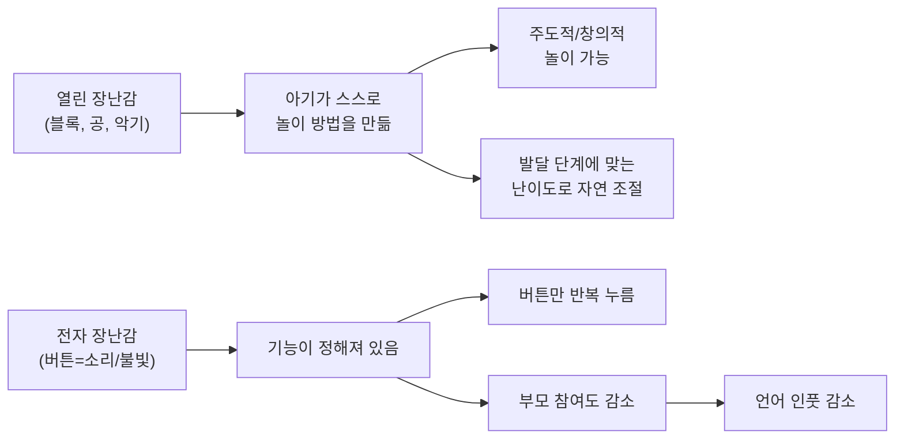
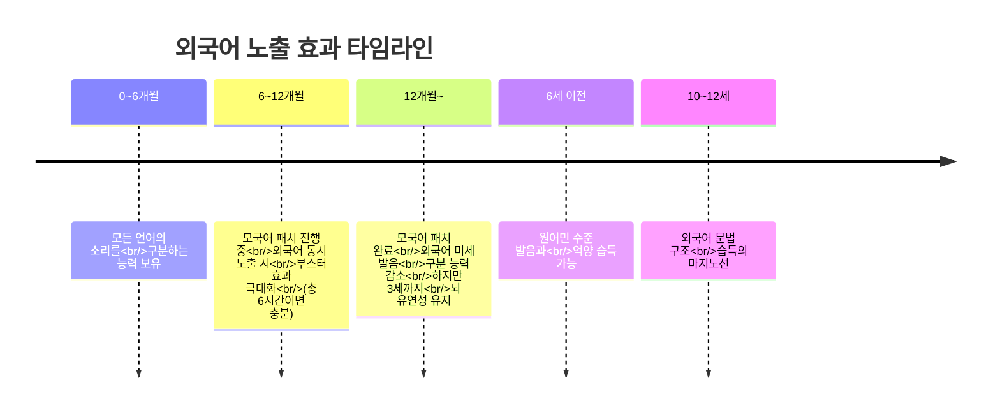

0~6개월은 아기의 뇌가 가장 폭발적으로 성장하는 시기입니다. 이 시기에 적절한 영양 공급, 언어 자극, 감각 경험을 제공하는 것이 아이의 평생 발달에 결정적인 영향을 미칩니다. 이 글에서는 "~가 중요하다"에서 멈추지 않고, **매일 구체적으로 무엇을 얼마만큼 어떻게 해야 하는지**를 정리했습니다.

---

## 이유식의 시작: 4~6개월

### 달걀 이유식의 마법 -- 알레르기 예방과 뇌발달을 동시에

과거에는 미국 소아과협회(AAP)에서 돌 이후에 달걀 흰자를 먹이라고 권고했지만, 현재는 이 권고가 **철회**되었습니다. 최신 연구에 따르면 **4~6개월 사이에 달걀(흰자 포함)을 조기 노출시키면 오히려 면역력이 생겨 알레르기 발생 가능성이 낮아집니다.** 달걀 알레르기가 있는 아기에게도 소량씩 용량을 늘려가며 먹이면 알레르기 극복에 도움이 된다는 연구결과까지 있습니다.

달걀의 효과는 단순히 알레르기 예방에 그치지 않습니다. 에콰도르에서 진행된 연구에 따르면, **6~9개월 아기에게 매일 달걀 한 알씩 6개월간 먹인 결과** 그렇지 않은 아기들에 비해 성장이 더 빨랐고, **발육부진이 47% 감소**했습니다. 또한 매일 달걀을 먹은 아기들은 **혈중 DHA와 콜린 농도가 더 높았습니다.** DHA는 인지 능력과 관계가 깊어, DHA가 높은 아이일수록 읽기 능력과 수학 능력이 더 뛰어났다는 연구결과가 있고, 콜린 농도가 높은 아이들은 기억력과 학업 성적이 더 좋았다고 합니다. 특히 DHA와 콜린을 **함께 섭취할 때 뇌 발달 측면에서 시너지 효과**가 난다는 점이 주목할 만합니다.

**구체적 실천법:**

- **시작 시기**: 이유식 시작 시점(4~6개월)부터 달걀을 포함시킨다
- **흰자 알레르기 예방 목적**: 삶은 달걀 흰자를 야채 미음에 갈아 섞어 소량(1/4 티스푼)부터 시작한다. 알레르기 반응(발진, 구토, 설사)이 없는지 2~3일 관찰한 뒤 양을 늘린다
- **노른자 영양 보충 목적**: 완숙한 달걀 노른자 1/4개를 포크로 으깨 모유나 분유 3스푼 정도와 섞어 미음 질감으로 만들어 먹인다. 일주일 간격으로 양을 늘려 최종적으로 **하루 달걀 1개**를 목표로 한다
- **삶는 팁**: 냄새를 줄이려면 약불로 15분 이내 삶는다. 찜기 사용 시에도 15분이 적당하다
- **노른자 vs 흰자**: 둘 다 중요하지만 하나만 골라야 한다면 노른자를 우선한다. 흰자는 단백질/마그네슘/비타민B군(신체 성장), 노른자는 칼슘/철분/DHA/콜린/지용성 비타민(뇌 발달)이 풍부하다

> **DO**: 이유식 초기부터 달걀을 소량씩 매일 먹인다. 노른자를 중심으로 시작해 흰자까지 포함시킨다.
>
> **DON'T**: "알레르기가 무서우니 돌까지 기다리자"는 과거의 관행. 조기 노출이 오히려 알레르기 예방에 효과적이다.

### 소고기는 왜 6개월부터 필수인가

압구정 호산병원의 소아과 전문의는 **"6개월에서 돌 사이에 빈혈이 매우 흔하게 발생한다"**고 경고합니다. 모유에 포함된 철분은 생후 6개월 즈음부터 고갈되기 시작하며, 이 시기 철분 결핍은 단순한 빈혈을 넘어 **IQ 저하와 직접적인 연관**이 있습니다. 빈혈이 있는 아이는 다리를 끊임없이 움직이는 하지불안증후군이 생겨 수면 장애를 일으킬 수 있고, 수면 장애는 다시 뇌 발달에 악영향을 미치는 악순환에 빠질 수 있습니다.

**구체적 실천법:**

- **시작 시기**: 만 6개월부터
- **초기 양**: 소고기 **10g**(한 스푼 정도)을 곱게 갈아 쌀미음에 섞어 매일 1회 이상 제공한다
- **중기(7~8개월)**: **20~30g**으로 점진적으로 늘린다
- **철분 흡수율 높이기**: 비타민C가 풍부한 과일(딸기, 키위 등)을 함께 먹인다
- **빈혈 검사**: 6개월 전후에 소아과에서 빈혈 검사를 받아본다

### 지방 섭취의 중요성

**뇌의 60%는 지방으로 구성되어 있습니다.** 이 시기 아기는 열량의 **25~50%를 지방으로 섭취**하는 것이 바람직합니다. 성인에게 적용되는 "저지방 = 건강"이라는 공식은 영유아에게는 적용되지 않습니다.

**구체적 실천법:**

- 이유식에 **달걀 노른자, 아보카도, 올리브오일, 무염버터**를 적극 활용한다
- 스크램블 에그를 만들 때 무염버터 1/2 티스푼을 팬에 녹여 사용한다
- 우유 알레르기가 있으면 버터 대신 엑스트라 버진 올리브유를 사용한다

### 전자레인지 이유식, 정말 안전할까?

결론부터 말하면, **전자레인지로 이유식을 데워도 안전합니다.** 하버드 의대에서 운영하는 블로그에 따르면 전자레인지 전자파 자체가 영양소에 직접 영향을 미치지 않습니다. 여러 연구결과를 종합하면, 전자레인지가 단백질, 지방, 미네랄, 탄수화물, 비타민 등에 미치는 영향은 미미하거나 없다는 결론입니다. 오히려 조리 시간이 짧기 때문에 같은 온도에서 **영양소 파괴가 더 적을 수 있습니다.**

**구체적 실천법:**

- **10초씩 데우면서** 중간에 잘 저어준다. 전자레인지는 가운데 부분이 덜 뜨거울 수 있으므로 꼭 섞어준다
- 손목 안쪽에 떨어뜨려 온도를 확인한 후 먹인다
- 너무 뜨겁게 데우면 비타민이 파괴되므로 (70도 이상) **미지근한 정도**가 적당하다
- 냉동 이유식을 전자레인지로 해동해도 안전하다 (미국 농무부 식품안전검사국 기준)
- 국내 유통되는 시판 이유식 용기(폴리프로필렌, 유리)는 전자레인지에 그대로 돌려도 환경호르몬 걱정 없다

### 7가지 달걀 이유식 레시피

달걀을 매일 먹이려면 다양한 레시피가 필요합니다. 아래는 월령과 이유식 단계에 맞춘 7가지 방법입니다.

**1. 흰자 + 야채 미음 (초기, 4~6개월)**

알레르기 예방 목적으로 삶은 달걀 흰자 1/2을 브로콜리 미음에 갈아 체에 내려 먹인다. 달걀 맛이 거의 느껴지지 않아 거부감이 적다.

**2. 노른자 + 모유/분유 (초기, 4~6개월)**

삶은 달걀 노른자를 포크로 으깨고 모유/분유 3스푼과 섞어 미음 질감으로 만든다. 가장 간단한 방법.

**3. 노른자 + 아보카도 + 고구마 퓨레 (초기~중기)**

달걀 노른자 1개, 아보카도 1/4, 찐 고구마 2스푼을 믹서에 갈아준다. 아기가 덩어리진 음식을 먹을 수 있게 되면 흰자를 잘게 다져 섞어준다. 감자 퓨레, 브로콜리 퓨레, 단호박 퓨레 등 다양한 퓨레에 노른자를 으깨 섞어도 좋다.

**4. 달걀 + 미음/죽 풀기 (중기, 6개월 이후)**

평소 만들던 미음이나 죽을 약불로 살짝 익힌 뒤 풀어준 달걀을 넣고 2~3분 저으며 익힌다. 충분히 익혀 살모넬라균 위험을 방지한다.

**5. 스크램블 에그 (중기, 6개월 이후)**

달걀 1개를 믹서로 잘 섞고, 무염버터 1/2 티스푼을 녹인 팬에 약불로 저으며 익힌다. 아기 치즈를 약간 넣어 녹이면 맛과 촉촉함이 좋아진다. 밥에 섞어 먹여도 된다.

**6. 달걀 바나나 팬케이크 (중기 이후)**

달걀 1개, 바나나 반 개(15g), 오트밀 시리얼 또는 쌀가루를 믹서에 갈아 약불 프라이팬에 구워준다. 양이 꽤 많으므로 한 끼에 다 먹이기보다 간식으로 조금씩 먹인다. 철분 강화 시리얼을 사용하면 철분까지 보충 가능.

**7. 달걀 + 사과 + 오트밀 (중기 이후)**

사과 반 개를 30분 푹 찐 후 으깨 퓨레로 만든다. 삶은 달걀 1개를 잘게 다지고, 오트밀 시리얼에 물을 섞어 준비한다. 으깬 달걀 + 사과 퓨레 60ml + 오트밀 30ml을 잘 섞는다. 사과의 상큼한 맛이 달걀의 텁텁함을 가려주어 잘 먹는 레시피.

---

## 언어발달: 첫 1년이 좌우한다

언어는 입이 아니라 **뇌에서 발달**합니다. 아기 뇌의 언어 중추는 생후 1년에 가장 활발하게 발달하며, 이 시기에 받은 언어 자극이 이후에도 양분이 됩니다. 압구정 호산병원 소아과 전문의는 **"노래를 들려주거나 TV를 보여주는 것은 아무 효과가 없다"**고 단언하며, 연구 결과를 인용합니다: **24개월 때 TV를 하루 1시간 이상 본 아이들은 만 4세 때 추적 관찰 결과 언어 발달이 늦었고, 만 1세에 2시간 이상 전자 미디어에 노출된 아이는 만 3세 때 자폐 판정을 받은 비율이 훨씬 높았습니다.**

아이 언어 발달이 늦다고 TV를 보여주는 것은 역효과입니다. 중요한 것은 **실제 사람과의 대화**뿐입니다.

### 실전 기술 4가지

**기술 1: 상호작용이 기본이다**

신생아 시기의 의사소통 수단은 울음과 웃음입니다. 부모가 해줄 수 있는 것은 얼굴 표정, 스킨십, 말투, 소리 등 다양합니다. 아기가 정서적 교감과 상호작용을 통해 타인과 교류했을 때 **뇌 전체의 발달에 자극**을 받습니다.

실천법:
- 기저귀를 갈 때: **"쉬 많이 했네~ 깨끗하게 해줄게"**
- 수유할 때: **"맘마 먹자~ 맛있지?"**
- 목욕할 때: **"물 따뜻하다~ 좋아?"**
- 잠에서 깨면: **"잘 잤어?"** 하며 눈 마주침
- 뚜껑을 열 때: **"우와~ 열었다!"**라고 말하며 반복

모든 일상 활동에서 아기에게 말을 걸고 표정으로 교감하는 것이 핵심입니다. 특별한 교구나 도구보다 **일상생활 속에서 자연스럽게 자극을 주는 것**이 더 효과적입니다.

**기술 2: 제스처를 가르쳐라 (6개월 이후)**

제스처와 언어발달은 별개가 아닙니다. **9~16개월 사이의 제스처 사용이 이후 2년간의 언어발달을 예측하는 인자**가 됩니다. 말이 나오기 전에 제스처가 울음 다음으로 하는 의사소통의 수단이 되기 때문입니다.

실천법:
- **9개월부터 매달 2개의 제스처**를 가르친다
- 이번 달: "사랑해", 다음 달: "이쁜 짓", 그 다음 달: "주세요" 식으로
- 가장 먼저 가르칠 것: **"안아줘"** -- 아기가 "내가 표현했더니 원하는 것이 이루어진다"를 경험하게 한다
- 반드시 **모델링**(직접 보여주기)으로 가르친다
- 아기가 제스처를 하면 **즉시 반응**해준다

**기술 3: 재미있는 사람이 돼라**

의성어, 의태어를 적극 활용하고 억양을 다양하게 합니다. 아기는 재미있는 소리를 듣고 따라하려는 본능이 있습니다.

실천법:
- 자동차를 보면 **"빠방~!"**, 고양이를 보면 **"야옹~"**, 강아지는 **"멍멍!"**
- 공이 굴러가면 **"데굴데굴~"**, 물이 흐르면 **"졸졸졸~"**
- 아기의 옹알이에 같은 소리로 대답하며 "대화"를 이어간다
- **"어~어우~", "오오~", "허어~"** 같은 감탄사를 과장되게 표현하면 아기가 따라한다
- 꼼꼼히 의성어/의태어가 많이 나오는 그림책을 구매하면 어색한 부모에게 도움이 된다

> **언어발달 순서 참고**: 모음(아~)이 먼저 발달하고, 자음 중에서는 양순음(ㅁ, ㅂ)이 먼저 나옵니다. 그래서 "엄마", "맘마", "빠빠", "까까"가 첫 단어로 출현합니다.

**기술 4: 일상생활에서 팁을 찾아라**

특별한 교구나 그림책보다 **일상생활이 가장 좋은 언어 교실**입니다.

실천법:
- 소변볼 때: **"쉬~"**
- 기저귀 가져올 때: **"기저귀 가져와~"**
- 밥 먹을 때: **"맘마~"**
- 아기가 관심을 보이는 물건이 있으면 그것을 가지고 말놀이를 한다
- 값비싼 교구를 샀다고 아기가 싫어해도 강요하지 않는다. 아기가 관심 있어 하는 것에 언어를 입혀주는 것이 핵심

### TV/영상은 왜 효과 없는가

아기들은 **가상과 실제를 구분할 줄 알며, 가상이 아닌 실제 세상의 상호작용을 통해 학습**합니다. 영상이나 장난감에서 나오는 말소리는 아기의 언어 발달에 긍정적인 영향을 주지 않습니다. 대가족에서 자란 아기들이 별도의 언어 교육 없이도 말을 잘 하는 이유는, 어른들이 대화하는 것을 많이 들었기 때문입니다.

> **DO**: 하루 종일 아기에게 말을 걸고, 어른들끼리 대화하는 모습을 보여준다. 돌봄 제공자(시터, 조부모)에게도 아기에게 말을 많이 걸어달라고 부탁한다.
>
> **DON'T**: "교육 콘텐츠니까 괜찮겠지"라며 영상을 틀어놓는 것. 두 돌 전에는 전자 미디어 노출을 하지 않는다.

---

## 월령별 추천 장난감

장난감은 많을수록 좋은 것이 아닙니다. 하루에 1~2시간 정도 집중해서 소수의 좋은 장난감으로 놀아주고, 나머지 시간은 아기가 일상에서 스스로 재미를 발견할 수 있도록 하는 것이 바람직합니다. 열린 장난감 위주로 구성하되, 부모가 적극적으로 함께 놀아주는 것이 핵심입니다.

### 신생아~1개월: 악기 세트

이 시기에는 세상 모든 것이 낯선 자극입니다. 별도의 장난감이 필요 없고, **엄마 목소리를 들려주는 것만으로 충분**합니다. 굳이 하나 준비한다면 **악기 세트**(하페 퍼커션 세트 또는 브랜드B 파란 팜팜 세트)를 추천합니다. 청력은 시력보다 먼저 발달하는 감각이라 아기에게 덜 낯선 자극이 됩니다.

- 엄마가 악기를 흔들어 소리를 들려준다
- 5개월부터는 아기가 직접 흔들어볼 수 있다
- 12개월 이후까지 다양한 방식으로 사용 가능한 **열린 장난감**

### 1~3개월: 모빌 + 터미타임 놀이매트

**자동 회전 모빌**: 1개월부터 시력이 발달하며 모빌을 집중해서 바라보기 시작합니다. 2개월에는 움직이는 물체를 따라 눈이 움직이는 트래킹을 연습하고, 3개월에는 돌아가는 모빌을 보며 깔깔 웃습니다. 5개월쯤 앉기 시작하면 다시 활용도가 높아져 모빌을 붙잡고 치거나 흔들며 놀 수 있습니다.

**터미타임용 놀이매트**(맨하탄토이 퍼거슨 놀이매트): 불빛/사운드 요소가 있어 아기가 고개를 들려는 동기를 부여합니다. 터미타임에 대한 자세한 내용은 아래 별도 섹션에서 다룹니다.

### 3~4개월: 텍스처 탐색 장난감 + 아기체육관

**라마즈 노랑나비**: 다양한 텍스처와 색상으로 아기의 주의를 끄는 데 매우 효과적입니다. 처음에는 바라보고, 4개월부터는 이리저리 만지며 바스락 소리를 즐기고 다양한 촉감을 탐색합니다. 3개월에는 이 외에도 **손에 잡기 좋은 딸랑이나 치발기**가 유용합니다.

**아기체육관**(이케아 레카 베이비짐): 매달린 장난감을 바꿔 끼울 수 있는 것이 활용도 면에서 좋습니다. 2개월에는 매달린 물체를 바라보고, 4개월에는 손을 뻗어 잡기 연습, 5개월에는 잡고 흔들기, 7개월에는 두 개를 잡아 부딪히기, 8~9개월에는 붙잡고 일어서기까지 가능합니다.

### 4~6개월: 열린 장난감 본격 도입

**말랑말랑 공**(브랜드B 베이비 빅볼, 센소리 롤러): 대표적인 열린 장난감입니다. 어릴 때는 손에 잡고 다양한 촉감을 느끼고, 입에 넣고, 굴러가거나 튀기는 것을 관찰합니다. 8개월에는 공을 발로 차게 유도할 수 있고, 12개월 이후에는 던지고 받기 놀이까지 확장됩니다.

**맨하탄토이 스퀴시**(위니클 그와 같은 회사): 자유자재로 움직이는 구조로, 누르면 들어가고 놓으면 원상복귀됩니다. 아기는 자신의 행동에 피드백이 있는 것을 좋아하며, 이를 통해 **행동의 원인과 결과**를 배웁니다.

**하바 매지카**: 독일 하바사의 제품으로 두 손으로 잡고 돌리면 나무 구슬들이 다양한 방향으로 돌아가며 소리가 납니다. 색감이 예쁘고 감각 자극이 풍부합니다.

**패브릭 블록**(케이스키즈): 열린 장난감의 대표주자인 블록을 아기 버전으로 만든 것. 바스락 소리가 나고 다양한 텍스처를 느낄 수 있어 4개월부터 가지고 놀 수 있습니다. 크면 엄마가 쌓는 것을 넘어뜨리거나, 나중에는 스스로 쌓습니다.

**까꿍놀이 책** (5개월~): 대상영속성 개념이 아직 없는 아기가 까꿍놀이를 즐거워합니다. 부스럭거리는 소재와 쨍한 색감으로 까꿍에 관심이 없더라도 책 자체를 만지며 잘 놀 수 있습니다.

### 열린 장난감 vs 전자 장난감 -- 왜 열린 장난감인가

전자 장난감이 문제가 되는 3가지 이유:

1. **열린 장난감이 아니다**: 버튼을 누르면 미리 세팅된 결과만 나옵니다. 아기는 자신의 발달 단계에 맞는 수준으로 자연스럽게 놀지 못하고, 이미 마스터한 활동을 불빛/소리 때문에 반복하게 됩니다.

2. **부모의 놀이 참여도가 떨어진다**: 연구 결과, 전자 장난감을 가지고 놀 때 부모의 **언어 활동이 훨씬 줄어들었습니다.** 장난감에 아기를 맡겨두고 지켜보기만 할 가능성이 높아지며, 이는 아기의 언어 발달에 직접적 악영향을 미칩니다.

3. **지나친 자극으로 집중력 저하**: 유니세프 홈페이지에 따르면, 아기가 정보를 처리할 충분한 시간 없이 계속 새로운 자극을 받으면 **집중하는 능력이 저하**됩니다. 화려한 자극에 의존하는 버릇이 들면 심심할 때 스스로 무언가를 하지 못하고 항상 외부 자극에 의존하게 됩니다.

> 한 연구에서 6개월과 12개월 때의 가정 놀이 환경이 **36개월 때 IQ와 상관관계**가 있었습니다. 적절한 놀이 도구(열린 장난감)와 부모의 놀이 참여도가 핵심이었습니다.

---

## 터미타임과 대근육 발달

압구정 호산병원 전문의는 **"돌 전 어린 시기에 가장 좋은 놀이는 단단한 바닥에서 엎드려 바둥거리면서 노는 것"**이라고 말합니다. 터미타임을 한 아이들은 하지 않은 아이들보다 **걷는 시기가 약 2개월 빨랐다**는 연구결과도 있습니다.

### 언제부터

**2개월 이후**부터 시작합니다. 2개월 이전에는 속싸개를 사용하는 경우가 많은데, 호산병원 전문의는 **"2개월 후에는 속싸개를 아예 안 하시는 것을 추천한다"**고 합니다. 속싸개로 꽁꽁 싸면 아기가 팔다리를 못 움직이고 감각을 체험하지 못해 뇌 발달에 어려움을 겪을 수 있습니다. 손싸개도 마찬가지입니다. 아기가 손을 빨고 발을 빨면서 뇌 발달이 이루어지는데, 얼굴 긁힌다고 손을 막아놓으면 발달을 저해합니다.

### 얼마나

- **하루 3~5회**, 1회에 **1~5분**씩
- 처음에는 30초도 힘들 수 있으니 서서히 시간을 늘린다
- **아기 기분이 좋을 때만** 실시하고, 울면 바로 자세를 바꿔준다

### 어떻게

1. 단단한 바닥(놀이매트)에 아기를 엎드려 놓는다
2. 아기 앞에 **거울이나 장난감**을 놓아 고개를 들도록 유도한다
3. 터미타임용 놀이매트(맨하탄토이 퍼거슨 등) 위에서 하면, 불빛/사운드 요소가 집중할 거리를 제공해 더 효과적이다
4. 목 힘이 강화되면서 두상이 납작해지는 것도 방지된다

> **DO**: 2개월 이후 매일 짧게라도 터미타임을 실시한다. 아기 앞에 흥미로운 것을 놓아 동기를 부여한다.
>
> **DON'T**: 속싸개/손싸개로 아기를 꽁꽁 싸매 감각 경험을 차단하는 것. 2개월 이후에는 풀어준다.

---

## 책육아 시작하기

로운맘의 정의에 따르면, 0~1세 책육아란 **"아이를 품에 안고 스킨십하면서 엄마 아빠의 목소리로 매일매일 책을 읽어주는 것"**입니다. 목적은 지식 전달이 아니라 **교감, 애착 형성, 그리고 "책 = 즐거운 시간"으로 인식**시키는 것입니다.

### 시기별 적합한 책 종류

**출생~목 가누기 전 (0~3개월)**
- **초점책**: 흑백 초점책을 아기 눈에서 20~30cm 거리에 두고, 한 페이지를 천천히 보여주며 그림을 설명해준다
- **여백이 많은 심플한 그림책**: 한 페이지에 그림이 한두 개만 있는 책
- 한 권을 다 읽으려 하지 말고, 아기가 집중하는 페이지에서 충분히 머문다

**목 가누고 앉는 시기 (4~6개월)**
- **촉감책, 헝겊책**: 아기의 손, 발, 발바닥으로 책을 다양하게 느끼게 한다
- **심플한 그림책**: 의성어/의태어가 많은 그림책이 부모도 재미있게 읽어줄 수 있어 좋다
- 아기를 품에 안고 스킨십하면서 **매일 같은 시간에** 읽어준다

### 아기 주도 허용의 중요성

0~1세 책육아의 대전제는 **"아기가 책을 접하는 방법대로 따라가 주기"**입니다. 이 시기 아기들은:

- 책에 **발을 대기도** 하고
- **깔고 앉기도** 하고
- **입에 넣고 물고 빨고 뜯기도** 하고
- **같은 페이지만 계속 보려** 하고
- **거꾸로 보려** 하기도 합니다

이 모든 것이 정상이며, 제지해서는 안 됩니다. 부모는 아기의 관심이 어디에 있는지 관찰하며 **"이 그림이 좋아?"** 하고 말을 걸어줍니다. 구강기(~18개월)에는 **보드북** 위주로 하되, 나중에 페이퍼북에 친숙해지기 어려워지지 않도록 비율을 조정하면서 페이퍼북도 섞어 노출합니다.

> 책육아는 **과제가 아니라 놀이의 일부**입니다. 하루에 몇 권씩 클리어해야 한다는 생각보다는, 매일 반복이 되어 습관이 되기만 하면 됩니다.

---

## 외국어 노출의 황금기

### 12개월 이전 부스터 효과

아기의 뇌는 생후 첫 1년 동안 모국어 시스템을 이해하도록 최적화됩니다. **6~12개월 사이에 모국어 배치(패치)가 거의 완료**되며, 12개월 이후에는 외국어의 미세한 발음을 구분하는 것이 어려워집니다.

그러나 이 시기에 모국어뿐 아니라 **외국어에도 함께 노출되면**, 모국어 패치와 외국어 패치가 동시에 진행되어 두 언어 모두 의미 있는 정보로 남게 됩니다. 네이처지에 실린 논문에 따르면, **9개월 된 영어권 아기들에게 5주간 30분씩 12세션(총 약 6시간)으로 중국인과 상호작용하게 한 결과**, 태어날 때부터 중국어에 노출된 아기들과 비교해도 뒤떨어지지 않는 중국어 소리 구분 능력을 갖게 되었습니다.

즉, **12개월 이전에는 총 6시간 정도의 단기 노출만으로도 외국어 패치(부스터 효과)**가 가능합니다.

### 영상이 아닌 실제 사람 상호작용

이 외국어 노출은 반드시 **실제 사람과 라이브로 상호작용할 때만 효과**가 있습니다. 같은 연구에서 영상이나 녹음을 통한 노출은 뇌의 변화가 **전혀 없었습니다.**

**구체적 실천법:**

- **원어민 베이비시터, 외국어를 구사하는 가족** 등이 직접 아기에게 외국어로 말을 걸어주는 방식으로 노출한다
- 영상/오디오만으로는 효과가 없다. 얼굴을 보고 상호작용하는 것이 핵심이다
- 모국어 발달이 우선이므로, 외국어 노출은 모국어에 추가하는 형태로 진행한다
- 12개월을 넘기더라도 3세 정도까지는 뇌가 충분히 유연하므로 효과를 기대할 수 있다

> **DO**: 12개월 이전에 실제 사람(원어민)이 아기에게 외국어로 말 걸어주는 경험을 만든다. 짧은 시간이라도 효과가 있다.
>
> **DON'T**: 영어 교육 영상이나 오디오를 틀어놓는 것. 아기의 뇌는 가상과 실제를 구분하며, 영상으로는 언어 패치가 되지 않는다.

---

## 이 시기 체크리스트

### 매일 하는 것

- [ ] 아기에게 **말 걸기** -- 모든 일상 활동에서 의성어/의태어 포함, 과장된 억양으로
- [ ] **이유식에 달걀** 포함 (노른자 중심, 점차 하루 1개 목표)
- [ ] **소고기 10g 이상** 이유식에 포함 (6개월부터)
- [ ] **터미타임** 3~5회, 1회 1~5분 (2개월부터)
- [ ] **책 읽어주기** -- 품에 안고 스킨십하면서, 양보다 일관성
- [ ] 아기의 울음/웃음/표현에 **즉각적으로 반응**하기

### 이 시기에 준비할 것

- [ ] **4~6개월**: 이유식 시작, 달걀 흰자/노른자 조기 도입
- [ ] **6개월**: 소아과 빈혈 검사
- [ ] **열린 장난감** 위주 구성 (공, 블록, 악기, 텍스처 장난감)
- [ ] 전자 장난감 비중 줄이기
- [ ] 외국어 노출 환경 마련 (가능하다면 원어민과의 상호작용)

### 하지 말아야 할 것

- [ ] 2세 전 TV/영상 노출
- [ ] 2개월 이후에도 속싸개/손싸개 유지
- [ ] "알레르기 무서우니 달걀은 돌까지 기다리자"
- [ ] 아기 발달을 또래와 비교하며 조바심내기 (4개월에 뒤집든 6개월에 뒤집든 차이 없음)
- [ ] 해당 월령에 맞지 않는 과제 요구 (한 살도 안 된 아기에게 단어 암기 등)

---

*이 글은 소아과 전문의, 언어치료사, 영양학 전문가의 조언과 다수의 학술 연구를 기반으로 작성되었습니다. 개별 아기의 상황은 다를 수 있으므로, 궁금한 점은 담당 소아과에 상담하시기 바랍니다.*
